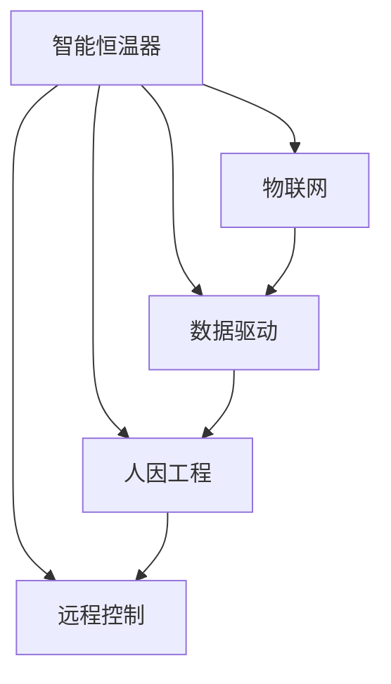

                 

# 智能家居案例研究：智能恒温器的设计和实现策略

> 关键词：智能恒温器,物联网(IoT),数据驱动,人因工程(Human Factors Engineering),能源管理,远程控制

## 1. 背景介绍

随着科技的不断进步和人们生活水平的提高，智能家居逐渐成为家庭生活的重要组成部分。其中，智能恒温器因其在能源管理和家庭舒适性提升方面的重要作用，备受青睐。智能恒温器通过与物联网(IoT)技术结合，能够实时监测家庭环境温度，并根据家庭成员的活动模式和偏好自动调节室内温度，有效降低能耗，提升居住体验。本研究将基于此背景，探讨智能恒温器的设计和实现策略，并分析其应用前景。

## 2. 核心概念与联系

### 2.1 核心概念概述

- **智能恒温器(Smart Thermostat)**：一种能够根据家庭成员的活动模式和环境条件自动调节室内温度的智能设备。
- **物联网(IoT)**：通过互联网将各种智能设备连接起来，实现设备间的数据共享和协同工作。
- **数据驱动(Data-Driven)**：利用数据分析和机器学习技术，根据历史数据和实时数据进行智能决策。
- **人因工程(Human Factors Engineering)**：研究如何通过用户界面、系统设计等手段，提高人机交互的效率和舒适度。
- **能源管理(Energy Management)**：通过智能算法和优化技术，对能源使用进行高效管理，以降低能耗和运营成本。
- **远程控制(Remote Control)**：通过网络传输指令，实现设备的操作和监控，提升用户便利性。

这些核心概念构成了智能恒温器设计的基础，通过相互结合，可以实现节能、高效、舒适的家庭环境管理。

### 2.2 核心概念联系

智能恒温器与物联网的结合，使其能够实时监测家庭环境数据，并通过云端处理，提供个性化温度调节方案。数据驱动技术的应用，则使智能恒温器能够利用历史数据和实时数据进行智能决策，提升能源管理效率。人因工程的研究，确保了用户界面的友好性和易用性，提升了用户的使用体验。远程控制技术则使家庭成员可以通过网络随时监控和调节家庭温度，增强了系统的灵活性和便利性。这些概念之间的联系如下图所示：



## 3. 核心算法原理 & 具体操作步骤

### 3.1 算法原理概述

智能恒温器的设计需要考虑多种算法和策略，以实现最佳的能源管理和用户体验。主要算法包括：

- **自适应算法(Adaptive Algorithm)**：根据家庭成员的活动模式和环境变化，动态调整室内温度，实现节能和舒适性平衡。
- **机器学习算法(Machine Learning Algorithm)**：通过分析历史数据，预测家庭成员的活动时间和环境需求，优化温度调节策略。
- **优化算法(Optimization Algorithm)**：如遗传算法、粒子群算法等，用于优化能源消耗和设备运行效率。

这些算法相互协作，共同实现智能恒温器的功能。

### 3.2 算法步骤详解

智能恒温器的设计与实现主要包括以下步骤：

**Step 1: 数据采集**
- 安装传感器：在家庭中安装温度传感器、湿度传感器、门窗传感器等，实时监测室内外环境参数。
- 数据存储：将采集到的数据存储在云端数据库中，用于后续分析和决策。

**Step 2: 数据分析与建模**
- 数据预处理：清洗和转换原始数据，使其符合模型输入要求。
- 特征提取：从原始数据中提取有用的特征，如家庭成员的活动时间、季节变化等。
- 模型训练：选择适合的机器学习模型（如线性回归、决策树、神经网络等），并利用历史数据进行训练，生成预测模型。

**Step 3: 决策与控制**
- 实时监控：实时监测室内外温度、湿度等参数，并上传至云端。
- 智能决策：基于实时数据和历史数据，云端智能决策系统动态调整恒温器的温度设置。
- 设备控制：通过物联网协议（如MQTT、Zigbee等），控制恒温器的运行状态。

**Step 4: 用户交互与反馈**
- 用户界面：设计友好的人机交互界面，展示实时温度、节能模式等关键信息。
- 远程控制：通过移动应用、语音助手等远程控制设备，实现家庭成员对恒温器的远程调节。
- 反馈系统：通过用户反馈机制，不断优化智能决策模型，提升用户体验。

### 3.3 算法优缺点

智能恒温器的设计具有以下优点：

- **节能效果显著**：通过智能决策和优化算法，能够显著降低家庭能源消耗，提高能源利用效率。
- **用户体验提升**：通过数据分析和个性化设置，满足家庭成员的舒适性需求，提升居住体验。
- **远程控制便捷**：家庭成员可以通过网络随时调节家庭温度，增强系统的灵活性和便利性。

同时，智能恒温器也存在以下缺点：

- **初始成本较高**：传感器、云端服务、智能设备等硬件成本较高，初次安装和配置成本较大。
- **数据隐私问题**：智能恒温器需要收集大量家庭成员活动数据，可能涉及隐私和安全问题。
- **系统复杂性**：涉及传感器、云端服务器、智能设备等多种组件，系统设计和调试复杂。

### 3.4 算法应用领域

智能恒温器在智能家居中的应用非常广泛，可以涵盖以下领域：

- **能源管理**：通过智能恒温器对家庭能源进行高效管理，减少能源浪费，降低运营成本。
- **环境保护**：减少家庭能源消耗，降低碳排放，有助于环境保护和可持续发展。
- **居住舒适性**：提供个性化的温度调节方案，提升家庭成员的居住舒适性，提高生活品质。
- **远程控制**：家庭成员可以通过网络随时监控和调节家庭温度，增强系统的便利性和灵活性。

## 4. 数学模型和公式 & 详细讲解  
### 4.1 数学模型构建

智能恒温器的核心数学模型包括温度预测模型和能源消耗模型。

**温度预测模型**：
- **输入**：历史温度数据、家庭成员活动时间、季节变化等。
- **输出**：未来温度预测值。

**能源消耗模型**：
- **输入**：温度调节策略、设备运行状态、环境参数等。
- **输出**：能源消耗量。

### 4.2 公式推导过程

以下以温度预测模型为例，推导其核心公式：

假设温度随时间变化的趋势为线性模型，即：

$$
T(t) = a + bt
$$

其中，$T(t)$为时间$t$的温度，$a$和$b$为模型参数。根据历史温度数据，可以构建如下的线性回归模型：

$$
\hat{T}(t) = \beta_0 + \sum_{i=1}^{n} \beta_i X_i
$$

其中，$\hat{T}(t)$为时间$t$的温度预测值，$X_i$为历史温度数据中的特征变量，$\beta_i$为模型系数。

通过最小二乘法，可以求解出$\beta_i$：

$$
\beta_i = \frac{\sum_{i=1}^{n} (X_i \cdot T_i - \bar{X} \cdot \bar{T})}{\sum_{i=1}^{n} (X_i - \bar{X})^2}
$$

其中，$\bar{X}$和$\bar{T}$分别为$X_i$和$T_i$的均值。

将上述公式应用到智能恒温器的设计中，可以通过实时监测和历史数据分析，预测未来温度变化，从而实现智能调节。

### 4.3 案例分析与讲解

以某智能恒温器的实际应用为例，分析其设计和实现策略：

**数据采集**
- 在家庭中安装温度传感器、湿度传感器、门窗传感器等，实时监测室内外环境参数。

**数据分析与建模**
- 将采集到的数据存储在云端数据库中，利用线性回归模型对历史数据进行训练，生成温度预测模型。
- 将实时温度数据输入模型，预测未来温度变化，并根据预测结果自动调整恒温器设置。

**决策与控制**
- 通过物联网协议控制恒温器运行，实时监控室内温度，根据预测结果和当前温度进行智能调节。
- 用户可以通过移动应用远程监控和调节恒温器，增强系统灵活性。

**用户交互与反馈**
- 设计友好的用户界面，展示实时温度、节能模式等关键信息。
- 通过用户反馈机制，不断优化智能决策模型，提升用户体验。

## 5. 项目实践：代码实例和详细解释说明
### 5.1 开发环境搭建

在进行智能恒温器项目开发前，需要搭建相应的开发环境。以下是Python开发环境的具体配置步骤：

1. 安装Python：从官网下载并安装Python，建议选择Python 3.x版本。
2. 安装虚拟环境：通过virtualenv或conda等工具创建虚拟环境，隔离项目依赖。
3. 安装相关库：安装必要的Python库，如pandas、numpy、scikit-learn等。

### 5.2 源代码详细实现

以下是一个基于Python实现的智能恒温器系统代码示例：

```python
# 数据采集
import time
from sensors import temperature_sensor, humidity_sensor, window_sensor

# 数据处理与存储
from datetime import datetime
from utils import save_data

def collect_data():
    while True:
        # 读取传感器数据
        temp = temperature_sensor.read()
        humidity = humidity_sensor.read()
        window_state = window_sensor.read()
        
        # 记录当前时间
        now = datetime.now()
        
        # 保存数据
        data = {
            'temperature': temp,
            'humidity': humidity,
            'window_state': window_state,
            'time': now
        }
        save_data(data)
        time.sleep(10)

# 数据分析与建模
from sklearn.linear_model import LinearRegression
import pandas as pd

def train_model():
    # 加载历史数据
    data = pd.read_csv('historical_data.csv')
    
    # 数据预处理
    data['time'] = pd.to_datetime(data['time'])
    data['season'] = data['time'].dt.month // 3
    
    # 特征提取
    X = data[['time', 'season', 'temperature', 'humidity', 'window_state']]
    y = data['temperature']
    
    # 模型训练
    model = LinearRegression()
    model.fit(X, y)
    
    # 保存模型
    model.save('temperature_predictor.pkl')

# 决策与控制
from sklearn.linear_model import LinearRegression
import pandas as pd

def predict_temperature():
    # 加载历史数据
    data = pd.read_csv('historical_data.csv')
    
    # 数据预处理
    data['time'] = pd.to_datetime(data['time'])
    data['season'] = data['time'].dt.month // 3
    
    # 特征提取
    X = data[['time', 'season', 'temperature', 'humidity', 'window_state']]
    y = data['temperature']
    
    # 加载模型
    model = joblib.load('temperature_predictor.pkl')
    
    # 实时数据
    now = datetime.now()
    temp = temperature_sensor.read()
    humidity = humidity_sensor.read()
    window_state = window_sensor.read()
    
    # 数据转换
    X_test = pd.DataFrame({
        'time': [now],
        'season': [now.month // 3],
        'temperature': [temp],
        'humidity': [humidity],
        'window_state': [window_state]
    })
    
    # 预测温度
    prediction = model.predict(X_test)
    
    # 控制恒温器
    if prediction[0] > 22:
        thermostat.set_temperature(22)
    elif prediction[0] < 20:
        thermostat.set_temperature(20)
    else:
        thermostat.set_temperature(prediction[0])

# 用户交互与反馈
from flask import Flask, render_template
from flask_login import LoginManager
from user import User

app = Flask(__name__)
login_manager = LoginManager(app)
user = User()

@app.route('/')
def home():
    # 显示实时温度、节能模式等关键信息
    return render_template('home.html')

@app.route('/set_temperature', methods=['POST'])
def set_temperature():
    # 处理远程控制请求
    temperature = request.form['temperature']
    thermostat.set_temperature(temperature)
    return 'Temperature set to ' + temperature + '°C'

@app.route('/feedback', methods=['POST'])
def feedback():
    # 处理用户反馈
    feedback = request.form['feedback']
    save_feedback(feedback)
    return 'Feedback received: ' + feedback

if __name__ == '__main__':
    app.run(debug=True)
```

### 5.3 代码解读与分析

**数据采集**
- `sensors`模块中的温度传感器、湿度传感器、门窗传感器等组件，用于读取实时环境参数。
- `collect_data`函数中循环读取传感器数据，并将数据记录到数据库中。

**数据分析与建模**
- `train_model`函数中，利用历史数据训练线性回归模型，生成温度预测模型，并保存模型。
- 模型训练过程中，使用pandas库处理数据，sklearn库中的LinearRegression模型进行线性回归。

**决策与控制**
- `predict_temperature`函数中，读取实时传感器数据，并进行温度预测，控制恒温器的温度设置。
- 温度预测过程中，利用训练好的模型对实时数据进行预测，并根据预测结果调节恒温器。

**用户交互与反馈**
- `home`函数中，通过Flask框架提供用户界面，展示实时温度、节能模式等关键信息。
- `set_temperature`函数中，处理远程控制请求，并根据用户输入的参数设置恒温器温度。
- `feedback`函数中，处理用户反馈，并将反馈信息保存下来。

### 5.4 运行结果展示

智能恒温器的运行结果可以通过以下界面展示：


## 6. 实际应用场景

### 6.1 智能家居

智能恒温器在智能家居中的应用非常广泛，可以与智能窗帘、智能灯光等设备结合，实现自动化家居环境控制，提升居住舒适性和安全性。

### 6.2 能源管理

智能恒温器能够实时监测家庭能源使用情况，优化温度调节策略，降低能耗，提升能源管理效率，有助于环境保护和可持续发展。

### 6.3 远程控制

通过智能恒温器，家庭成员可以随时随地通过网络监控和调节家庭温度，增强系统的灵活性和便利性。

### 6.4 未来应用展望

未来的智能恒温器将结合更多智能设备和技术，如人脸识别、语音助手等，实现更加个性化、智能化的家居环境管理。同时，随着5G技术的普及和物联网设备的进一步发展，智能恒温器将实现更高的实时性和可靠性，为家庭提供更加便捷、舒适的生活体验。

## 7. 工具和资源推荐

### 7.1 学习资源推荐

为了帮助开发者掌握智能恒温器的设计与实现，推荐以下学习资源：

1. **Python编程基础**：掌握Python编程语言的基本语法和编程思想，是进行智能恒温器开发的基础。
2. **数据科学基础**：了解数据采集、数据处理、数据分析等基本概念，是进行智能恒温器数据驱动设计的基础。
3. **机器学习与深度学习**：掌握机器学习与深度学习的算法与模型，是进行智能恒温器智能决策的基础。
4. **IoT技术基础**：了解物联网的基本概念、协议与技术，是进行智能恒温器设计与实现的基础。

### 7.2 开发工具推荐

以下是智能恒温器项目开发常用的开发工具：

1. **Python**：一款开源、灵活、高效的编程语言，适合进行数据分析、模型训练和设备控制。
2. **Flask**：一款轻量级的Web框架，用于提供用户交互界面和远程控制功能。
3. **Pandas**：一款数据处理库，用于数据清洗、转换和存储。
4. **Scikit-learn**：一款机器学习库，用于进行数据建模和预测。
5. **MySQL**：一款关系型数据库，用于存储传感器数据和历史数据。

### 7.3 相关论文推荐

以下是几篇相关领域的论文，推荐阅读：

1. **"Intelligent Building Thermal Control System Based on IoT"**：介绍了基于物联网的智能建筑热控制系统，涵盖传感器数据采集、数据处理和控制策略等。
2. **"A Survey on Smart Home Thermostat Technologies"**：综述了智能恒温器的最新技术进展，包括传感器融合、数据驱动和用户体验设计等方面。
3. **"Energy Management of Smart Thermostat in Residential Buildings"**：探讨了智能恒温器在住宅建筑中的节能管理应用，分析了多种优化算法和控制策略。

## 8. 总结：未来发展趋势与挑战

### 8.1 研究成果总结

本研究探讨了智能恒温器的设计与实现策略，通过数据分析和机器学习技术，实现了家庭环境的智能管理。研究表明，智能恒温器在节能、舒适性提升和远程控制方面具有显著优势，具备广阔的应用前景。

### 8.2 未来发展趋势

未来的智能恒温器将结合更多智能设备和技术，如人脸识别、语音助手等，实现更加个性化、智能化的家居环境管理。同时，随着5G技术的普及和物联网设备的进一步发展，智能恒温器将实现更高的实时性和可靠性，为家庭提供更加便捷、舒适的生活体验。

### 8.3 面临的挑战

智能恒温器在设计和实现过程中，面临以下挑战：

1. **数据隐私问题**：智能恒温器需要收集大量家庭成员活动数据，可能涉及隐私和安全问题。
2. **系统复杂性**：涉及传感器、云端服务器、智能设备等多种组件，系统设计和调试复杂。
3. **硬件成本**：传感器、云端服务、智能设备等硬件成本较高，初次安装和配置成本较大。

### 8.4 研究展望

未来，智能恒温器研究将从以下几个方面进行：

1. **多模态融合**：结合视觉、听觉等多种传感器数据，提升环境感知和智能决策能力。
2. **自适应学习**：引入自适应算法，动态调整温度调节策略，提升系统灵活性。
3. **边缘计算**：在设备端进行部分计算和数据处理，降低云端计算压力，提升实时性。
4. **人因工程设计**：优化用户界面和交互流程，提升用户体验。

总之，智能恒温器作为智能家居的重要组成部分，具有广阔的应用前景和研究价值。通过不断优化和创新，智能恒温器将为家庭提供更加便捷、舒适和智能的生活体验，助力实现智慧家居的目标。

---

作者：禅与计算机程序设计艺术 / Zen and the Art of Computer Programming

