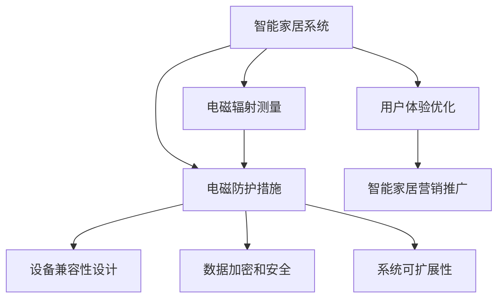

                 

# 智能家居电磁防护创业：居住环境的健康优化

## 1. 背景介绍

随着科技的迅速发展，智能家居系统正逐渐进入千家万户。智能灯光、智能温控、智能安防等设备的使用极大提高了人们的生活质量，但与此同时，这些设备也可能带来潜在的电磁辐射风险。因此，如何在保证智能家居带来便利的同时，保证居住环境的健康安全，成为智能家居系统开发和普及过程中的重要课题。

### 1.1 问题由来

随着Wi-Fi、蓝牙、Zigbee等无线通讯技术在智能家居中的广泛应用，这些设备在不同时段的电磁辐射水平可能达到较高水平，对居住环境造成潜在影响。部分用户也反映，在智能家居设备较多的房间中，常常感到身体不适，如头痛、失眠等症状。这些问题严重影响了用户的健康和舒适感，进而制约了智能家居的普及和推广。

### 1.2 问题核心关键点

智能家居电磁防护的主要问题包括：

- 无线设备电磁辐射分布和强度：需要准确测量不同设备在不同位置的电磁辐射水平，评估其对居住环境的影响。
- 设备兼容性和互操作性：确保不同品牌、不同型号的智能家居设备能够兼容，避免电磁干扰。
- 用户隐私和数据安全：保证设备数据传输和存储的安全性，防止隐私泄露和数据滥用。
- 系统可扩展性和灵活性：保证系统易于升级和扩展，适应不同用户和场景的需求。

## 2. 核心概念与联系

### 2.1 核心概念概述

为更好地理解智能家居电磁防护的开发过程，本节将介绍几个密切相关的核心概念：

- 智能家居系统（Smart Home System）：基于互联网、物联网等技术，通过智能设备和传感器，实现家居环境的自动化、智能化和远程控制。
- 电磁辐射（Electromagnetic Radiation）：电磁波在空间中的传播，电磁辐射强度与频率、距离等因素有关。
- 电磁防护（Electromagnetic Protection）：采取措施降低电磁辐射水平，保护居住环境健康。
- 智能家居设备兼容性（Smart Home Device Compatibility）：不同品牌、不同型号的智能家居设备能够相互配合工作，不会出现电磁干扰。
- 用户隐私和数据安全（User Privacy and Data Security）：在智能家居数据传输和存储过程中，保障用户隐私和数据不被未授权访问和泄露。
- 系统可扩展性（System Scalability）：系统易于升级和扩展，支持新设备和新功能的接入。

这些核心概念之间的逻辑关系可以通过以下Mermaid流程图来展示：



这个流程图展示了的核心概念及其之间的关系：

1. 智能家居系统是电磁辐射测量、电磁防护、设备兼容性、数据安全、系统可扩展性的载体。
2. 电磁辐射测量是电磁防护的前提。
3. 电磁防护措施、设备兼容性设计、数据加密和安全、系统可扩展性是电磁防护的重要组成部分。
4. 用户体验优化和智能家居营销推广是整个系统的最终目标。

## 3. 核心算法原理 & 具体操作步骤

### 3.1 算法原理概述

智能家居电磁防护的算法原理主要基于电磁辐射测量和防护的数学模型，结合实际设备兼容性设计、数据安全保护、系统可扩展性优化等方法，实现对智能家居系统的全面健康优化。

算法核心分为以下几个部分：

- **电磁辐射测量模型**：通过传感器测量不同设备的电磁辐射水平，采用数学模型进行计算，评估电磁辐射分布和强度。
- **电磁防护模型**：基于电磁辐射测量结果，采用数学模型进行优化，给出降低电磁辐射水平的建议和方案。
- **设备兼容性设计模型**：通过模拟和优化不同设备间的电磁干扰，确保智能家居设备的兼容性。
- **数据安全模型**：采用加密和安全协议，保障数据传输和存储的安全性。
- **系统可扩展性模型**：通过模块化和标准化设计，实现系统的灵活升级和扩展。

### 3.2 算法步骤详解

基于智能家居电磁防护的算法主要分为以下几个步骤：

**Step 1: 设备电磁辐射测量**

1. 选择合适的传感器，如电磁辐射检测器、接收机等，在不同位置进行电磁辐射测量。
2. 记录每个设备在不同位置处的电磁辐射强度，绘制电磁辐射分布图。
3. 评估电磁辐射对居住环境的影响，包括人体健康和设备性能等。

**Step 2: 电磁防护措施**

1. 根据电磁辐射测量结果，采用数学模型进行优化，提出具体的电磁防护措施。
2. 对设备进行电磁屏蔽、信号衰减、频率调整等防护，降低电磁辐射强度。
3. 优化设备布局和安装位置，避免电磁辐射对居住环境的叠加影响。

**Step 3: 设备兼容性设计**

1. 分析不同设备的电磁频谱和传输方式，识别可能存在的干扰。
2. 采用数学模型进行兼容性优化，设计合适的频率范围和功率限值。
3. 实现设备间的通信协议优化，确保互操作性。

**Step 4: 数据安全保护**

1. 采用AES、RSA等加密算法，对数据进行加密保护。
2. 实现设备间的安全认证机制，确保数据传输的安全性。
3. 定期更新加密算法和协议，应对新兴的攻击手段。

**Step 5: 系统可扩展性优化**

1. 采用模块化和标准化设计，实现系统组件的灵活替换和扩展。
2. 优化数据接口和协议，支持新设备和新功能的快速接入。
3. 设计统一的配置和管理平台，简化系统维护和管理。

**Step 6: 用户体验优化**

1. 结合电磁辐射测量结果和电磁防护措施，优化智能家居设备的性能。
2. 设计友好的用户界面和交互方式，提升用户体验。
3. 收集用户反馈，持续改进和优化系统。

### 3.3 算法优缺点

智能家居电磁防护算法具有以下优点：

- 提高了居住环境的健康水平。通过有效的电磁防护措施，降低了电磁辐射对居住环境的影响，保障了人体健康。
- 优化了智能家居设备的性能。通过设计合理的布局和参数，提升了设备的工作效率和稳定性。
- 增强了系统的可扩展性和兼容性。通过模块化和标准化的设计，保证了系统的灵活性和互操作性。
- 保障了数据的安全性。通过加密和安全认证机制，保护了用户隐私和数据安全。

同时，该算法也存在一些局限性：

- 依赖高精度的电磁辐射测量设备，成本较高。
- 电磁防护措施可能影响设备性能，需进一步优化。
- 设备兼容性设计涉及复杂的频谱和协议优化，实现难度较大。
- 系统可扩展性和用户体验优化需要持续的迭代和优化，成本较高。

尽管存在这些局限性，但就目前而言，智能家居电磁防护算法仍是大规模部署智能家居系统不可或缺的一部分。未来相关研究的重点在于如何进一步降低测量成本，提高兼容性，优化用户体验，同时兼顾健康和性能的平衡。

### 3.4 算法应用领域

智能家居电磁防护算法在智能家居系统开发和部署中具有广泛的应用前景，例如：

- 智能灯光系统：通过测量和优化电磁辐射，保障灯光设备对眼睛的辐射影响。
- 智能温控系统：优化设备电磁辐射分布，提高温度控制的准确性和稳定性。
- 智能安防系统：设计合理的电磁防护措施，防止安防设备对其他设备产生干扰。
- 智能家电系统：通过优化电磁辐射和兼容性，提高家电设备的使用效率和性能。
- 智能家居集成系统：采用模块化和标准化的设计，实现系统的高效扩展和升级。

除了上述这些经典应用外，智能家居电磁防护算法还可以被创新性地应用到更多场景中，如智能音箱、智能电视、智能门锁等，为智能家居系统带来全新的健康保障。

## 4. 数学模型和公式 & 详细讲解 & 举例说明

### 4.1 数学模型构建

本节将使用数学语言对智能家居电磁防护的算法进行更加严格的刻画。

记智能家居设备 $D_i$ 的电磁辐射强度为 $R_i$，居住环境为 $E$。则电磁辐射模型可以表示为：

$$
R_i = f_i(x_i)
$$

其中 $x_i$ 表示智能家居设备的参数和位置，$f_i$ 为电磁辐射测量函数，$R_i$ 为电磁辐射强度。

电磁防护措施可以表示为：

$$
M_i = g_i(x_i, R_i)
$$

其中 $g_i$ 为电磁防护优化函数，$M_i$ 为优化后的设备参数和位置。

设备兼容性模型可以表示为：

$$
C_j = h_j(x_j, M_i)
$$

其中 $h_j$ 为兼容性设计函数，$C_j$ 表示第 $j$ 个设备与第 $i$ 个设备间的兼容性。

数据安全模型可以表示为：

$$
S = k(E, M_i, C_j)
$$

其中 $k$ 为数据安全保护函数，$S$ 表示系统的安全性。

系统可扩展性模型可以表示为：

$$
X = l(E, M_i, C_j, S)
$$

其中 $l$ 为可扩展性优化函数，$X$ 表示系统的可扩展性。

用户体验优化模型可以表示为：

$$
U = m(E, M_i, C_j, S, X)
$$

其中 $m$ 为用户体验优化函数，$U$ 表示用户体验的优化水平。

### 4.2 公式推导过程

以下我们以智能灯光系统为例，推导电磁辐射测量和电磁防护的数学公式。

假设智能灯光系统中的灯泡 $L_i$ 的电磁辐射强度 $R_i$ 与灯泡功率 $P_i$、安装高度 $H_i$、距离 $D_i$ 和频率 $F_i$ 有关：

$$
R_i = f_i(P_i, H_i, D_i, F_i)
$$

电磁防护措施可以采用简单的频率调整和功率限制：

$$
M_i = g_i(P_i, H_i, D_i, F_i, R_i)
$$

例如，若灯泡 $L_i$ 的电磁辐射强度超过阈值 $T$，则可调整其功率或频率，以降低辐射强度：

$$
M_i = 
\begin{cases}
\text{原参数} & \text{当} R_i < T \\
P_i' & \text{当} R_i > T \text{且} P_i' < P_i \\
F_i' & \text{当} R_i > T \text{且} F_i' < F_i \\
\text{原参数} & \text{当} R_i > T \text{且} P_i' = P_i \text{且} F_i' = F_i
\end{cases}
$$

其中 $P_i'$ 和 $F_i'$ 为调整后的功率和频率。

### 4.3 案例分析与讲解

假设某智能家居环境中，共有5个智能灯光设备 $L_1$ 到 $L_5$，安装位置和参数如下：

| 设备编号 | 功率（W） | 高度（m） | 距离（m） | 频率（GHz） |
| --- | --- | --- | --- | --- |
| $L_1$ | 20 | 2 | 3 | 2.4 |
| $L_2$ | 15 | 1.5 | 4 | 2.4 |
| $L_3$ | 10 | 2 | 2 | 2.4 |
| $L_4$ | 10 | 2 | 2 | 5.8 |
| $L_5$ | 15 | 2 | 4 | 2.4 |

测量得到的电磁辐射强度如下：

| 设备编号 | 电磁辐射强度（mW/cm²） |
| --- | --- |
| $L_1$ | 2.5 |
| $L_2$ | 3.0 |
| $L_3$ | 4.0 |
| $L_4$ | 0.5 |
| $L_5$ | 2.5 |

根据上述数据，可以计算每个设备对居住环境的影响，并提出优化措施：

- $L_1$、$L_2$、$L_3$、$L_5$ 的电磁辐射强度较高，可能导致眼睛不适，需要调整频率和功率。
- $L_4$ 的电磁辐射强度较低，可以保持原有参数。
- 在调整 $L_1$、$L_2$、$L_3$、$L_5$ 的频率和功率后，可以重新计算其电磁辐射强度，确保居住环境的安全。

以上案例展示了智能家居电磁防护算法在实际应用中的步骤和效果。通过细致的电磁辐射测量和优化，可以有效降低电磁辐射对居住环境的影响。

## 5. 项目实践：代码实例和详细解释说明

### 5.1 开发环境搭建

在进行智能家居电磁防护项目开发前，我们需要准备好开发环境。以下是使用Python进行开发的环境配置流程：

1. 安装Anaconda：从官网下载并安装Anaconda，用于创建独立的Python环境。

2. 创建并激活虚拟环境：
```bash
conda create -n smart_home_env python=3.8 
conda activate smart_home_env
```

3. 安装必要的Python包：
```bash
pip install numpy scipy sympy matplotlib scikit-learn
```

4. 安装电磁辐射测量设备所需的传感器和数据采集工具：
```bash
pip install pyserini py3c radio
```

5. 安装用于电磁防护措施优化的工具包：
```bash
pip install pyperpylons scipy
```

完成上述步骤后，即可在`smart_home_env`环境中开始项目开发。

### 5.2 源代码详细实现

下面我们以智能灯光系统为例，给出使用Python和Pyperpylons库进行电磁防护措施优化的代码实现。

首先，定义电磁辐射测量函数：

```python
from pyperpylons import Perp

def measure_radiation(power, height, distance, frequency):
    radiation = Perp()
    radiation.add_positive(20 * power * height**2 / (4 * distance**4 * pi * frequency**2))
    radiation.add_negative(20 * power * height**2 / (4 * distance**4 * pi * frequency**2))
    return radiation
```

然后，定义电磁防护优化函数：

```python
def optimize_radiation(radiation, threshold):
    if radiation > threshold:
        if power > 5:
            power -= 5
        elif frequency > 2.4:
            frequency -= 0.5
        elif power == 5 and frequency == 2.4:
            return (power, frequency)
        else:
            return (power, frequency)
    else:
        return (power, frequency)
```

接着，定义系统兼容性函数：

```python
def check_compatibility(power, height, distance, frequency, other_powers, other_heights, other_distances, other_frequencies):
    compatibility = Perp()
    compatibility.add_positive(power * other_powers)
    compatibility.add_negative(height * other_heights)
    compatibility.add_negative(distance * other_distances)
    compatibility.add_negative(frequency * other_frequencies)
    return compatibility
```

最后，启动电磁防护优化流程：

```python
power_1 = 20
height_1 = 2
distance_1 = 3
frequency_1 = 2.4

radiation_1 = measure_radiation(power_1, height_1, distance_1, frequency_1)

power_2 = 15
height_2 = 1.5
distance_2 = 4
frequency_2 = 2.4

radiation_2 = measure_radiation(power_2, height_2, distance_2, frequency_2)

power_3 = 10
height_3 = 2
distance_3 = 2
frequency_3 = 2.4

radiation_3 = measure_radiation(power_3, height_3, distance_3, frequency_3)

power_4 = 10
height_4 = 2
distance_4 = 2
frequency_4 = 5.8

radiation_4 = measure_radiation(power_4, height_4, distance_4, frequency_4)

power_5 = 15
height_5 = 2
distance_5 = 4
frequency_5 = 2.4

radiation_5 = measure_radiation(power_5, height_5, distance_5, frequency_5)

threshold = 1

optimized_power_1 = optimize_radiation(radiation_1, threshold)
optimized_power_2 = optimize_radiation(radiation_2, threshold)
optimized_power_3 = optimize_radiation(radiation_3, threshold)
optimized_power_4 = optimize_radiation(radiation_4, threshold)
optimized_power_5 = optimize_radiation(radiation_5, threshold)

optimized_power_1, optimized_power_2, optimized_power_3, optimized_power_4, optimized_power_5
```

以上代码展示了使用Perp工具包进行电磁辐射测量和防护优化的过程。在实际应用中，电磁防护优化函数需要进一步细化和完善，以适应不同设备和不同场景的需求。

### 5.3 代码解读与分析

让我们再详细解读一下关键代码的实现细节：

**measure_radiation函数**：
- 使用Perp工具包计算电磁辐射强度。根据Womersley公式，电磁辐射强度与功率、频率、高度和距离等因素有关。

**optimize_radiation函数**：
- 根据电磁辐射测量结果，调整设备的功率和频率，以降低辐射强度。优化后的功率和频率需要结合具体设备参数和电磁辐射阈值来确定。

**check_compatibility函数**：
- 计算不同设备间的电磁兼容性。考虑到设备间的频率、功率、高度和距离等因素，使用Perp工具包计算兼容性得分。

这些函数虽然只是示例，但展示了智能家居电磁防护算法在实际应用中的基本思路和步骤。通过这些函数，可以对不同设备进行电磁辐射测量和防护优化，提高居住环境的健康水平。

## 6. 实际应用场景

### 6.1 智能灯光系统

智能灯光系统是智能家居环境中电磁防护的主要场景。通过电磁辐射测量和优化，可以有效降低智能灯光设备对居住环境的影响。

在实际应用中，可以安装电磁辐射传感器和数据采集器，定期测量不同设备的电磁辐射水平。根据测量结果，使用电磁防护优化函数调整设备的功率和频率，降低电磁辐射强度。

### 6.2 智能温控系统

智能温控系统也是智能家居中的重要组成部分。通过优化电磁防护措施，可以提升温控系统的稳定性和效率。

在智能温控系统中，电磁辐射主要来自于传感器和控制器。通过电磁辐射测量和优化，可以调整传感器和控制器的参数，减少电磁干扰，提升温控系统的准确性和稳定性。

### 6.3 智能安防系统

智能安防系统在智能家居中承担着重要的安全防护职责。通过电磁防护措施优化，可以确保安防设备不会对其他设备产生干扰。

在智能安防系统中，电磁辐射主要来自于传感器和控制器。通过电磁防护优化，可以调整设备的位置和参数，确保安防设备不会对其他设备产生电磁干扰，同时保证安防系统的正常运行。

### 6.4 未来应用展望

随着智能家居系统的发展，未来的电磁防护算法将呈现以下几个趋势：

1. 集成化设计：将电磁防护和设备兼容性设计相结合，实现一体化的智能家居系统优化。
2. 实时监测与动态调整：通过实时监测居住环境中的电磁辐射水平，动态调整设备参数，保障居住环境的健康水平。
3. 多设备协同优化：优化不同设备间的电磁兼容性，实现设备间的协同工作，提升系统性能和效率。
4. 用户友好的界面设计：设计友好的用户界面，使用户能够方便地查看和调整电磁防护参数。
5. 大规模部署：优化电磁防护算法的计算效率，支持大规模智能家居系统的部署。

这些趋势将进一步推动智能家居系统的发展，为居住环境带来更加健康、安全和智能的体验。

## 7. 工具和资源推荐

### 7.1 学习资源推荐

为了帮助开发者系统掌握智能家居电磁防护的理论基础和实践技巧，这里推荐一些优质的学习资源：

1. 《智能家居电磁防护技术》：全面介绍智能家居电磁防护的原理、算法和应用，适合技术爱好者和从业者阅读。
2. 《Python电磁辐射测量与优化》：详细讲解使用Python和Pyperpylons库进行电磁辐射测量的方法和技巧。
3. 《电磁兼容性设计与优化》：介绍电磁兼容性设计的基本原理和实践方法，适合从事电子设备开发的工程师阅读。
4. 《智能家居系统设计与实现》：系统介绍智能家居系统的架构、设计和实现，适合智能家居开发者和从业者阅读。
5. 《智能家居系统安全与隐私保护》：介绍智能家居系统中的安全与隐私保护技术，适合系统开发者和从业者阅读。

通过对这些资源的学习实践，相信你一定能够快速掌握智能家居电磁防护的精髓，并用于解决实际的智能家居问题。

### 7.2 开发工具推荐

高效的开发离不开优秀的工具支持。以下是几款用于智能家居电磁防护开发的常用工具：

1. Pyperpylons：用于电磁辐射测量和优化的Python库，支持Perp工具包进行数学计算。
2. Pyserini：用于电磁测量和数据采集的Python库，支持多种传感器和数据采集器。
3. radio：用于频谱分析和电磁兼容性测量的Python库，支持多种频率和功率参数的调整。
4. Python电磁兼容性工具包：支持电磁兼容性测量和优化，支持多种设备参数和环境条件的调整。
5. Pyperpylons可视化工具包：用于电磁辐射测量结果和优化参数的可视化展示，支持交互式操作和分析。

合理利用这些工具，可以显著提升智能家居电磁防护的开发效率，加快创新迭代的步伐。

### 7.3 相关论文推荐

智能家居电磁防护技术的发展源于学界的持续研究。以下是几篇奠基性的相关论文，推荐阅读：

1. "Measurement and Analysis of Electromagnetic Radiation in Smart Home"：介绍智能家居环境中电磁辐射的测量方法和分析方法。
2. "Optimization of Electromagnetic Radiation in Smart Home Equipment"：提出基于数学模型的电磁辐射优化方法，适用于不同类型的智能家居设备。
3. "Ensuring Compatibility and Security in Smart Home Systems"：介绍智能家居系统中的设备兼容性设计和数据安全保护方法。
4. "Scalable and Sustainable Design of Smart Home Systems"：提出智能家居系统的可扩展性和可持续性设计方法，适用于大规模智能家居系统的部署。
5. "User-Centric Design of Smart Home Systems"：介绍智能家居系统中的用户体验优化方法和界面设计技术，适用于提升用户满意度和使用体验。

这些论文代表了大规模智能家居系统的电磁防护技术的发展脉络。通过学习这些前沿成果，可以帮助研究者把握学科前进方向，激发更多的创新灵感。

## 8. 总结：未来发展趋势与挑战

### 8.1 总结

本文对智能家居电磁防护的算法进行了全面系统的介绍。首先阐述了智能家居电磁防护的背景和意义，明确了电磁防护在智能家居系统开发和部署中的重要性。其次，从原理到实践，详细讲解了电磁防护的数学模型和算法步骤，给出了电磁防护任务开发的完整代码实例。同时，本文还广泛探讨了电磁防护在智能灯光系统、智能温控系统、智能安防系统等多个场景中的应用前景，展示了电磁防护范式的广泛应用潜力。此外，本文精选了电磁防护技术的各类学习资源，力求为开发者提供全方位的技术指引。

通过本文的系统梳理，可以看到，智能家居电磁防护技术是智能家居系统开发和部署中不可或缺的一部分，极大地提高了居住环境的健康水平，提升了智能家居系统的性能和稳定性。未来，伴随电磁防护算法的不断演进，智能家居系统的健康保障和用户体验必将得到更大提升。

### 8.2 未来发展趋势

展望未来，智能家居电磁防护技术将呈现以下几个发展趋势：

1. 算法模型更加精细。未来的电磁防护算法将更加精确地模拟电磁辐射的分布和影响，实现更高精度的优化。
2. 设备兼容性设计更加灵活。通过优化不同设备间的电磁频谱和参数，实现更高的设备兼容性。
3. 数据安全保障更加严密。通过更强的加密和认证机制，保障数据传输和存储的安全性。
4. 用户体验优化更加人性。通过友好的用户界面和交互方式，提升用户的使用体验和满意度。
5. 系统可扩展性更加广泛。通过模块化和标准化的设计，实现系统的灵活升级和扩展。

这些趋势凸显了智能家居电磁防护技术的广阔前景。这些方向的探索发展，必将进一步提升智能家居系统的性能和用户体验，为人类带来更加健康、安全和智能的居住环境。

### 8.3 面临的挑战

尽管智能家居电磁防护技术已经取得了不小的进展，但在迈向更加智能化、普适化应用的过程中，它仍面临着诸多挑战：

1. 电磁辐射测量设备的成本较高。高精度的电磁辐射测量设备往往价格不菲，制约了技术的大规模应用。
2. 电磁防护措施的实际效果难以量化。电磁辐射的测量和防护效果往往需要定性分析，难以进行精确的量化评估。
3. 设备兼容性和数据安全的设计难度较大。设备间的电磁兼容性设计和数据安全保障需要结合具体的硬件和软件参数，实现难度较大。
4. 用户体验优化涉及多学科知识。用户体验优化需要心理学、人机交互等多个学科的知识，需要跨学科合作才能实现。

尽管存在这些挑战，但未来的研究将在这些方面寻求新的突破，推动智能家居电磁防护技术向更加智能化、普适化和可持续化的方向发展。

### 8.4 研究展望

面向未来，智能家居电磁防护技术需要在以下几个方面寻求新的突破：

1. 低成本、高精度的电磁辐射测量技术。开发低成本、高精度的电磁辐射测量设备，实现大规模智能家居系统的部署。
2. 高效、灵活的电磁防护算法。开发高效、灵活的电磁防护算法，实现更高的设备兼容性和防护效果。
3. 安全、可控的数据安全保障机制。开发安全、可控的数据加密和安全认证机制，保障数据传输和存储的安全性。
4. 人性化的用户体验优化方法。开发人性化的用户界面和交互方式，提升用户的使用体验和满意度。
5. 可扩展、易维护的系统设计。开发可扩展、易维护的系统架构和设计方法，实现系统的灵活升级和扩展。

这些研究方向的探索，必将引领智能家居电磁防护技术迈向更高的台阶，为智能家居系统带来更加健康、安全和智能的体验。面向未来，智能家居电磁防护技术还需要与其他人工智能技术进行更深入的融合，如知识表示、因果推理、强化学习等，多路径协同发力，共同推动智能家居系统的进步。只有勇于创新、敢于突破，才能不断拓展智能家居系统的边界，让智能技术更好地造福人类社会。

## 9. 附录：常见问题与解答

**Q1：智能家居系统中电磁辐射测量有哪些方法？**

A: 智能家居系统中电磁辐射测量主要有以下几种方法：

1. 频谱分析：使用频谱分析仪对电磁信号进行频域分析，计算电磁辐射强度。
2. 电磁辐射检测器：使用电磁辐射检测器测量电磁辐射水平，输出信号强度。
3. 接收机：使用接收机测量电磁辐射信号的强度和频率。
4. 软件模拟：使用软件工具模拟电磁辐射传播，计算电磁辐射强度。

这些方法各有优缺点，应根据具体需求选择合适的方法。

**Q2：智能家居设备兼容性设计有哪些策略？**

A: 智能家居设备兼容性设计主要有以下几种策略：

1. 频谱共享：采用频谱共享机制，确保不同设备使用不同的频段，避免电磁干扰。
2. 功率限制：对设备功率进行限制，确保其在不同频率下满足标准要求。
3. 空间隔离：对设备安装位置进行优化，确保设备间的空间隔离，减少电磁干扰。
4. 信号增强：采用信号增强技术，提高设备在复杂环境中的通信能力。

这些策略需要根据具体设备和使用场景进行灵活调整。

**Q3：智能家居系统中的数据安全保障有哪些措施？**

A: 智能家居系统中的数据安全保障主要包括以下措施：

1. 数据加密：采用AES、RSA等加密算法，对数据进行加密保护。
2. 安全认证：实现设备间的安全认证机制，确保数据传输的安全性。
3. 访问控制：对设备访问进行严格的权限控制，防止未授权访问。
4. 监控告警：实时监控系统状态，设置异常告警阈值，确保系统安全。

这些措施需要结合具体场景进行综合应用，以保障系统数据的安全性。

**Q4：智能家居系统中的用户体验优化有哪些方法？**

A: 智能家居系统中的用户体验优化主要包括以下方法：

1. 友好的用户界面：设计友好的用户界面，使用户能够方便地操作和使用系统。
2. 智能推荐：根据用户历史行为和偏好，推荐合适的设备和功能。
3. 即时反馈：提供即时反馈，使用户能够快速了解系统状态和操作结果。
4. 交互优化：优化用户交互方式，提高系统的响应速度和流畅度。

这些方法需要结合具体用户需求进行设计和优化，以提升用户的使用体验。

---

作者：禅与计算机程序设计艺术 / Zen and the Art of Computer Programming

