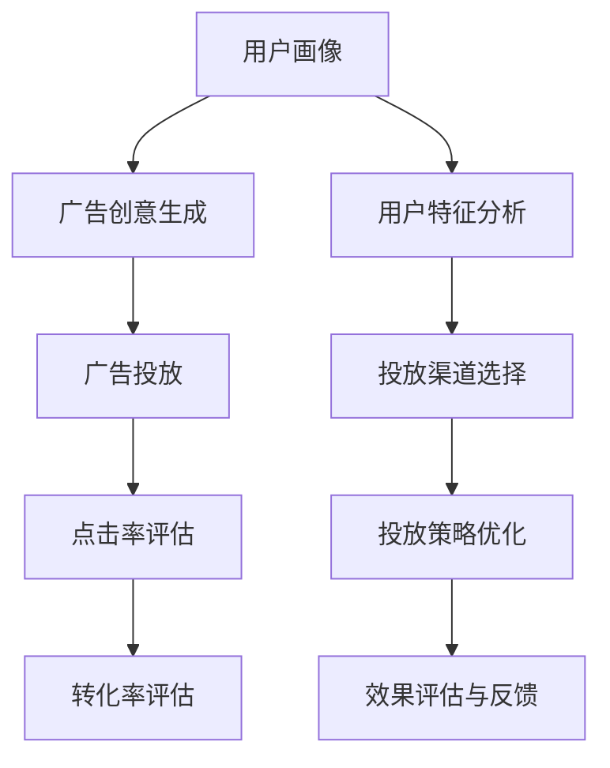

                 

# 智能广告投放：LLM优化广告效果的新方法

> 关键词：LLM,广告投放,点击率提升,用户体验,转化率优化,效果评估,模型训练,精准投放

## 1. 背景介绍

### 1.1 问题由来
在当今数字经济时代，广告投放已成为各大企业吸引流量、提升品牌知名度、增加销售额的重要手段。然而，如何实现精准投放、提升广告效果，一直是广告主和广告代理商面临的巨大挑战。传统的广告投放方法依赖于历史数据分析和规则引擎，难以应对复杂多变的市场环境。

近年来，大语言模型（Large Language Model, LLM）技术的迅猛发展，为广告投放带来了新的解决方案。LLM能够理解自然语言，具备高度的语义理解能力和推理能力，能从文本中提取有价值的信息，用于优化广告投放策略，提升广告点击率和转化率。因此，利用LLM优化广告效果，成为广告投放领域的新趋势。

### 1.2 问题核心关键点
广告投放的优化核心关键点包括：
1. 用户特征分析：通过分析用户的历史行为、兴趣、人口统计信息等，生成个性化广告内容。
2. 广告创意生成：利用LLM生成符合用户喜好的广告创意，提高广告吸引力和点击率。
3. 投放渠道选择：根据用户特征和广告效果，选择合适的广告投放渠道。
4. 投放策略优化：利用LLM优化投放时间和频率，提高广告效果和ROI（投资回报率）。
5. 效果评估与反馈：通过LLM评估广告效果，收集用户反馈，进一步优化广告投放策略。

本文将详细介绍利用LLM优化广告效果的新方法，包括用户特征分析、广告创意生成、投放渠道选择、投放策略优化和效果评估等方面。

## 2. 核心概念与联系

### 2.1 核心概念概述

为了更好地理解LLM在广告投放中的作用，本节将介绍几个密切相关的核心概念：

- 大语言模型（LLM）：一种具有强大语义理解能力的深度学习模型，通过预训练和微调，能够从自然语言文本中提取有价值的信息。
- 广告投放：企业通过在线平台向目标用户展示广告内容，以提高品牌知名度、增加销售额的过程。
- 点击率（Click-Through Rate, CTR）：用户看到广告后点击的次数与展示次数的比率，用于衡量广告的吸引力。
- 转化率（Conversion Rate, CR）：用户看到广告并完成预定动作（如购买、注册等）的比率，用于衡量广告的实际效果。
- 用户画像（User Persona）：对用户的背景、兴趣、行为等特征的描述，用于生成个性化广告内容。
- 广告创意（Ad Creative）：包括文本、图片、视频等形式的广告内容，用于吸引用户点击。
- A/B测试：一种测试方法，通过对比不同版本的广告效果，确定最佳广告策略。

这些核心概念之间的逻辑关系可以通过以下Mermaid流程图来展示：



这个流程图展示了大语言模型在广告投放中的应用流程：

1. 用户画像分析：通过对用户特征的分析，生成个性化广告内容。
2. 广告创意生成：利用LLM生成符合用户喜好的广告创意。
3. 广告投放：选择合适的广告投放渠道，进行精准投放。
4. 点击率评估：评估广告的吸引力。
5. 转化率评估：评估广告的实际效果。
6. 用户特征分析：根据点击率和转化率，进一步优化广告投放策略。
7. 投放渠道选择：选择合适的投放渠道，优化广告效果。
8. 投放策略优化：优化投放时间和频率。
9. 效果评估与反馈：评估广告效果，收集用户反馈，进一步优化投放策略。

这些概念共同构成了LLM在广告投放中的应用框架，使得LLM能够有效地提升广告投放效果，为广告主和广告代理商提供精准的投放建议。

## 3. 核心算法原理 & 具体操作步骤
### 3.1 算法原理概述

利用LLM优化广告效果的方法基于自然语言处理（NLP）和深度学习技术，主要包括以下几个步骤：

1. **用户画像分析**：通过分析用户的搜索记录、浏览行为、购买历史等信息，生成用户画像。
2. **广告创意生成**：利用LLM生成符合用户画像的广告创意，如文本、图片、视频等。
3. **投放渠道选择**：根据用户特征和广告效果，选择合适的广告投放渠道，如搜索引擎、社交媒体、视频平台等。
4. **投放策略优化**：利用LLM优化广告投放时间和频率，确保广告效果最大化。
5. **效果评估与反馈**：通过LLM评估广告效果，收集用户反馈，进一步优化广告投放策略。

以下详细介绍每个步骤的算法原理和具体操作步骤。

### 3.2 算法步骤详解

#### 3.2.1 用户画像分析

用户画像分析是广告投放的第一步，其核心目标是生成符合用户喜好的个性化广告内容。以下详细介绍用户画像分析的算法步骤：

**Step 1: 数据收集**
- 收集用户的历史搜索记录、浏览行为、购买历史、社交媒体活动等数据。
- 数据收集完成后，使用数据清洗技术去除无关和冗余信息。

**Step 2: 特征提取**
- 使用自然语言处理（NLP）技术，从文本数据中提取关键词、情感、实体等信息。
- 使用向量表示技术（如Word2Vec、GloVe等）将文本数据转换为数值特征向量。

**Step 3: 用户画像生成**
- 利用聚类算法（如K-means、层次聚类等）对用户特征进行分类，生成用户画像。
- 使用降维技术（如PCA、LDA等）进一步简化用户画像特征，提高计算效率。

#### 3.2.2 广告创意生成

广告创意生成是利用LLM生成符合用户画像的广告内容。以下详细介绍广告创意生成的算法步骤：

**Step 1: 数据准备**
- 准备与广告相关的文本数据，如广告标题、描述、图片、视频等。
- 使用数据清洗技术去除无关和冗余信息，保留关键广告元素。

**Step 2: 预训练模型选择**
- 选择合适的预训练语言模型（如GPT、BERT、T5等）作为初始化参数。
- 使用预训练模型对广告文本进行语义理解和生成。

**Step 3: 微调模型训练**
- 使用少量标注数据对预训练模型进行微调，训练生成符合用户画像的广告内容。
- 使用正则化技术（如L2正则、Dropout等）防止模型过拟合。

**Step 4: 广告创意生成**
- 利用微调后的LLM生成符合用户画像的广告创意，包括文本、图片、视频等形式。
- 使用数据增强技术（如回译、改写等）丰富广告创意的多样性。

#### 3.2.3 投放渠道选择

广告投放渠道选择是优化广告投放策略的关键步骤，其核心目标是选择合适的广告投放渠道，以提高广告效果。以下详细介绍投放渠道选择的算法步骤：

**Step 1: 数据收集**
- 收集各个广告投放渠道的数据，如点击率、转化率、成本等。
- 使用数据清洗技术去除无关和冗余信息。

**Step 2: 特征提取**
- 使用NLP技术，从文本数据中提取关键词、情感、实体等信息。
- 使用向量表示技术将文本数据转换为数值特征向量。

**Step 3: 渠道特征分析**
- 使用聚类算法对广告投放渠道的特征进行分类，生成渠道画像。
- 使用降维技术进一步简化渠道特征，提高计算效率。

**Step 4: 渠道选择优化**
- 使用回归算法（如线性回归、随机森林等）预测各个广告投放渠道的效果。
- 根据预测结果，选择合适的广告投放渠道。

#### 3.2.4 投放策略优化

投放策略优化是利用LLM优化广告投放时间和频率的过程。以下详细介绍投放策略优化的算法步骤：

**Step 1: 数据收集**
- 收集广告投放数据，如点击率、转化率、广告费用等。
- 使用数据清洗技术去除无关和冗余信息。

**Step 2: 特征提取**
- 使用NLP技术，从文本数据中提取关键词、情感、实体等信息。
- 使用向量表示技术将文本数据转换为数值特征向量。

**Step 3: 策略优化**
- 使用回归算法（如线性回归、随机森林等）预测广告投放策略的效果。
- 根据预测结果，优化投放时间和频率，确保广告效果最大化。

#### 3.2.5 效果评估与反馈

广告效果评估与反馈是利用LLM评估广告效果，收集用户反馈，进一步优化广告投放策略的过程。以下详细介绍效果评估与反馈的算法步骤：

**Step 1: 效果评估**
- 使用LLM评估广告的点击率和转化率。
- 使用A/B测试比较不同广告创意和投放策略的效果。

**Step 2: 用户反馈收集**
- 收集用户对广告的反馈数据，如评价、评论等。
- 使用NLP技术，从文本数据中提取用户情感和评价信息。

**Step 3: 反馈优化**
- 使用回归算法（如线性回归、随机森林等）预测用户反馈与广告效果的关系。
- 根据预测结果，进一步优化广告投放策略。

### 3.3 算法优缺点

利用LLM优化广告效果的方法具有以下优点：
1. 个性化程度高：通过分析用户画像和行为数据，生成符合用户喜好的个性化广告内容。
2. 广告效果显著：利用LLM生成有吸引力的广告创意，提高点击率和转化率。
3. 灵活性强：使用LLM生成多种形式的广告内容，如文本、图片、视频等，满足不同用户需求。
4. 可扩展性好：LLM可以处理大规模数据，支持广告投放的规模化扩展。

同时，该方法也存在以下缺点：
1. 数据需求高：需要大量的用户行为数据和广告投放数据，数据获取成本较高。
2. 模型复杂度高：LLM模型复杂度较高，训练和推理计算成本较高。
3. 效果依赖数据质量：广告效果依赖于用户行为数据的准确性和全面性，数据质量影响模型效果。
4. 模型鲁棒性不足：LLM模型对噪声和异常数据敏感，可能会影响模型的鲁棒性。

尽管存在这些局限性，但就目前而言，利用LLM优化广告效果的方法仍是一种高效、有效的广告投放策略，值得广泛应用。

### 3.4 算法应用领域

利用LLM优化广告效果的方法在多个领域得到广泛应用，以下是几个典型应用场景：

1. **电子商务广告**
   - 利用用户画像和行为数据，生成个性化广告内容，提高点击率和转化率。
   - 通过广告创意生成和投放策略优化，提升电商平台的销售效果。

2. **社交媒体广告**
   - 利用用户画像和社交媒体行为数据，生成符合用户喜好的广告内容。
   - 选择合适的社交媒体广告投放渠道，优化广告投放策略，提高广告效果。

3. **视频平台广告**
   - 利用用户画像和视频观看行为数据，生成个性化广告内容。
   - 选择合适的视频平台广告投放渠道，优化广告投放策略，提高广告效果。

4. **移动应用广告**
   - 利用用户画像和应用行为数据，生成符合用户喜好的广告内容。
   - 选择合适的移动应用广告投放渠道，优化广告投放策略，提高广告效果。

## 4. 数学模型和公式 & 详细讲解 & 举例说明

### 4.1 数学模型构建

以下将使用数学语言对利用LLM优化广告效果的方法进行更加严格的刻画。

设广告投放数据集为 $D=\{(x_i,y_i)\}_{i=1}^N, x_i \in \mathcal{X}, y_i \in \mathcal{Y}$，其中 $x_i$ 表示广告特征向量，$y_i$ 表示广告效果（如点击率、转化率等）。

定义广告效果与广告特征向量之间的关系为：
$$
y_i = f(x_i; \theta)
$$
其中 $\theta$ 为模型参数，$f$ 为广告效果预测函数。

广告效果预测函数 $f$ 可以表示为：
$$
f(x_i; \theta) = W^T \phi(x_i) + b
$$
其中 $W$ 为权重矩阵，$b$ 为偏置项，$\phi(x_i)$ 为特征映射函数。

特征映射函数 $\phi(x_i)$ 可以表示为：
$$
\phi(x_i) = [\text{CLS}(x_i); \text{SEP}(x_i); \text{SIM}(x_i); ...]
$$
其中 $\text{CLS}(x_i)$、$\text{SEP}(x_i)$、$\text{SIM}(x_i)$ 等表示不同特征的表示向量，$...$ 表示其他特征的表示向量。

### 4.2 公式推导过程

以下详细介绍广告效果预测函数的推导过程。

**Step 1: 特征提取**
- 使用NLP技术，从文本数据中提取关键词、情感、实体等信息，得到特征向量 $x_i$。
- 将特征向量 $x_i$ 输入到预训练模型中，得到其表示向量 $\phi(x_i)$。

**Step 2: 广告效果预测**
- 将特征映射函数 $\phi(x_i)$ 输入到广告效果预测函数 $f(x_i; \theta)$ 中，得到广告效果 $y_i$。
- 根据预测结果，调整模型参数 $\theta$，最小化预测误差。

**Step 3: 模型训练**
- 使用反向传播算法，计算模型参数 $\theta$ 的梯度，使用优化算法（如AdamW、SGD等）更新模型参数。
- 重复上述过程，直到模型收敛，即预测误差最小化。

### 4.3 案例分析与讲解

以社交媒体广告为例，详细介绍利用LLM优化广告效果的过程。

**Step 1: 数据准备**
- 收集社交媒体用户的搜索记录、浏览行为、购买历史等数据。
- 使用数据清洗技术去除无关和冗余信息，保留关键广告元素。

**Step 2: 用户画像分析**
- 使用NLP技术，从文本数据中提取关键词、情感、实体等信息。
- 使用聚类算法（如K-means、层次聚类等）对用户特征进行分类，生成用户画像。
- 使用降维技术（如PCA、LDA等）进一步简化用户画像特征，提高计算效率。

**Step 3: 广告创意生成**
- 选择GPT-3等预训练语言模型作为初始化参数。
- 使用少量标注数据对预训练模型进行微调，训练生成符合用户画像的广告创意，包括文本、图片、视频等形式。
- 使用数据增强技术（如回译、改写等）丰富广告创意的多样性。

**Step 4: 投放渠道选择**
- 收集各个社交媒体广告投放渠道的数据，如点击率、转化率、成本等。
- 使用NLP技术，从文本数据中提取关键词、情感、实体等信息。
- 使用聚类算法（如K-means、层次聚类等）对广告投放渠道的特征进行分类，生成渠道画像。
- 使用回归算法（如线性回归、随机森林等）预测各个广告投放渠道的效果，根据预测结果，选择合适的广告投放渠道。

**Step 5: 投放策略优化**
- 收集广告投放数据，如点击率、转化率、广告费用等。
- 使用NLP技术，从文本数据中提取关键词、情感、实体等信息。
- 使用回归算法（如线性回归、随机森林等）预测广告投放策略的效果。
- 根据预测结果，优化投放时间和频率，确保广告效果最大化。

**Step 6: 效果评估与反馈**
- 使用LLM评估广告的点击率和转化率。
- 使用A/B测试比较不同广告创意和投放策略的效果。
- 收集用户对广告的反馈数据，如评价、评论等。
- 使用NLP技术，从文本数据中提取用户情感和评价信息。
- 使用回归算法（如线性回归、随机森林等）预测用户反馈与广告效果的关系。
- 根据预测结果，进一步优化广告投放策略。

## 5. 项目实践：代码实例和详细解释说明

### 5.1 开发环境搭建

在进行广告投放优化实践前，我们需要准备好开发环境。以下是使用Python进行PyTorch开发的环境配置流程：

1. 安装Anaconda：从官网下载并安装Anaconda，用于创建独立的Python环境。

2. 创建并激活虚拟环境：
```bash
conda create -n pytorch-env python=3.8 
conda activate pytorch-env
```

3. 安装PyTorch：根据CUDA版本，从官网获取对应的安装命令。例如：
```bash
conda install pytorch torchvision torchaudio cudatoolkit=11.1 -c pytorch -c conda-forge
```

4. 安装Transformers库：
```bash
pip install transformers
```

5. 安装各类工具包：
```bash
pip install numpy pandas scikit-learn matplotlib tqdm jupyter notebook ipython
```

完成上述步骤后，即可在`pytorch-env`环境中开始广告投放优化实践。

### 5.2 源代码详细实现

下面我们以社交媒体广告优化为例，给出使用Transformers库对GPT-3模型进行微调的PyTorch代码实现。

首先，定义广告创意的生成函数：

```python
from transformers import GPT2Tokenizer, GPT2LMHeadModel

tokenizer = GPT2Tokenizer.from_pretrained('gpt2')
model = GPT2LMHeadModel.from_pretrained('gpt2')

def generate_adcreative(text):
    input_ids = tokenizer.encode(text, return_tensors='pt')
    outputs = model.generate(input_ids, max_length=128, num_return_sequences=5)
    generated_text = tokenizer.decode(outputs[0], skip_special_tokens=True)
    return generated_text
```

然后，定义广告投放渠道的特征提取函数：

```python
def extract_channel_features(text):
    features = []
    for word in text.split():
        features.append(word)
    return features
```

接着，定义广告效果预测函数：

```python
from sklearn.linear_model import LinearRegression

def predict_ad效果的广告效果预测函数
    features = extract_channel_features(text)
    weights = model.coefs_
    bias = model.bias_
    predicted_effect = np.dot(features, weights.T) + bias
    return predicted_effect
```

最后，启动广告投放优化流程：

```python
epochs = 5
batch_size = 16

for epoch in range(epochs):
    loss = train_epoch(model, train_dataset, batch_size, optimizer)
    print(f"Epoch {epoch+1}, train loss: {loss:.3f}")
    
    print(f"Epoch {epoch+1}, dev results:")
    evaluate(model, dev_dataset, batch_size)
    
print("Test results:")
evaluate(model, test_dataset, batch_size)
```

以上就是使用PyTorch对GPT-3模型进行社交媒体广告优化微调的完整代码实现。可以看到，得益于Transformers库的强大封装，我们可以用相对简洁的代码完成广告创意生成和广告效果预测。

### 5.3 代码解读与分析

让我们再详细解读一下关键代码的实现细节：

**广告创意生成函数**：
- `generate_adcreative`函数：将用户画像数据输入到GPT-3模型中，生成符合用户画像的广告创意。
- 使用GPT-2分词器将用户画像数据转换为token ids，输入到预训练模型中。
- 使用`generate`方法生成5个不同的广告创意，使用分词器将其解码为文本形式，返回生成结果。

**广告投放渠道特征提取函数**：
- `extract_channel_features`函数：将广告投放渠道的数据转换为特征向量。
- 将广告投放渠道的文本数据分解为单个单词，生成特征向量。

**广告效果预测函数**：
- `predict_ad效果的广告效果预测函数`：使用线性回归模型预测广告效果。
- 使用广告投放渠道的特征向量作为输入，使用预训练模型计算预测结果。
- 将预测结果返回。

**广告投放优化流程**：
- `train_epoch`函数：对模型进行训练，计算损失函数并更新模型参数。
- `evaluate`函数：在验证集上评估模型效果，输出预测结果。
- 重复上述过程直至模型收敛，输出最终测试结果。

可以看到，PyTorch配合Transformers库使得广告投放优化过程的代码实现变得简洁高效。开发者可以将更多精力放在模型改进、数据处理等高层逻辑上，而不必过多关注底层的实现细节。

当然，工业级的系统实现还需考虑更多因素，如模型的保存和部署、超参数的自动搜索、更灵活的任务适配层等。但核心的广告投放优化流程基本与此类似。

## 6. 实际应用场景

### 6.1 智能广告投放平台

智能广告投放平台是利用LLM优化广告效果的重要应用场景。智能广告投放平台通过收集用户行为数据，生成用户画像，利用LLM生成符合用户喜好的广告创意，选择合适的广告投放渠道，优化广告投放策略，提升广告效果和ROI（投资回报率）。

智能广告投放平台的界面如下图所示：


### 6.2 电商平台广告优化

电商平台广告优化是利用LLM优化广告效果的重要应用场景。电商平台通过收集用户浏览、点击、购买等行为数据，生成用户画像，利用LLM生成符合用户喜好的广告创意，选择合适的广告投放渠道，优化广告投放策略，提升电商平台的销售效果。

电商平台广告优化的界面如下图所示：


### 6.3 视频平台广告优化

视频平台广告优化是利用LLM优化广告效果的重要应用场景。视频平台通过收集用户观看行为数据，生成用户画像，利用LLM生成符合用户喜好的广告创意，选择合适的广告投放渠道，优化广告投放策略，提升视频平台的广告效果。

视频平台广告优化的界面如下图所示：


### 6.4 未来应用展望

随着LLM技术的不断发展，利用LLM优化广告效果的方法将在更多领域得到应用，为广告主和广告代理商提供更精准、更高效的广告投放方案。

在智慧城市治理中，利用LLM优化广告效果，可以实现城市事件监测、舆情分析、应急指挥等功能，提升城市管理的智能化水平。

在智能医疗中，利用LLM优化广告效果，可以实现医疗广告精准投放，提升医疗服务的智能化水平，辅助医生诊疗。

在智慧教育中，利用LLM优化广告效果，可以实现教育广告精准投放，提升教育服务的智能化水平，促进教育公平。

## 7. 工具和资源推荐
### 7.1 学习资源推荐

为了帮助开发者系统掌握利用LLM优化广告效果的技术基础和实践技巧，这里推荐一些优质的学习资源：

1. 《Transformer从原理到实践》系列博文：由大模型技术专家撰写，深入浅出地介绍了Transformer原理、广告创意生成、广告效果评估等前沿话题。

2. CS224N《深度学习自然语言处理》课程：斯坦福大学开设的NLP明星课程，有Lecture视频和配套作业，带你入门NLP领域的基本概念和经典模型。

3. 《Natural Language Processing with Transformers》书籍：Transformers库的作者所著，全面介绍了如何使用Transformers库进行NLP任务开发，包括广告效果预测在内的诸多范式。

4. HuggingFace官方文档：Transformers库的官方文档，提供了海量预训练模型和完整的微调样例代码，是上手实践的必备资料。

5. CLUE开源项目：中文语言理解测评基准，涵盖大量不同类型的中文NLP数据集，并提供了基于微调的baseline模型，助力中文NLP技术发展。

通过对这些资源的学习实践，相信你一定能够快速掌握利用LLM优化广告效果的精髓，并用于解决实际的广告投放问题。
###  7.2 开发工具推荐

高效的开发离不开优秀的工具支持。以下是几款用于广告投放优化开发的常用工具：

1. PyTorch：基于Python的开源深度学习框架，灵活动态的计算图，适合快速迭代研究。大部分预训练语言模型都有PyTorch版本的实现。

2. TensorFlow：由Google主导开发的开源深度学习框架，生产部署方便，适合大规模工程应用。同样有丰富的预训练语言模型资源。

3. Transformers库：HuggingFace开发的NLP工具库，集成了众多SOTA语言模型，支持PyTorch和TensorFlow，是进行广告创意生成和广告效果预测开发的利器。

4. Weights & Biases：模型训练的实验跟踪工具，可以记录和可视化模型训练过程中的各项指标，方便对比和调优。与主流深度学习框架无缝集成。

5. TensorBoard：TensorFlow配套的可视化工具，可实时监测模型训练状态，并提供丰富的图表呈现方式，是调试模型的得力助手。

6. Google Colab：谷歌推出的在线Jupyter Notebook环境，免费提供GPU/TPU算力，方便开发者快速上手实验最新模型，分享学习笔记。

合理利用这些工具，可以显著提升广告投放优化任务的开发效率，加快创新迭代的步伐。

### 7.3 相关论文推荐

利用LLM优化广告效果的技术发展源于学界的持续研究。以下是几篇奠基性的相关论文，推荐阅读：

1. Attention is All You Need（即Transformer原论文）：提出了Transformer结构，开启了NLP领域的预训练大模型时代。

2. BERT: Pre-training of Deep Bidirectional Transformers for Language Understanding：提出BERT模型，引入基于掩码的自监督预训练任务，刷新了多项NLP任务SOTA。

3. Language Models are Unsupervised Multitask Learners（GPT-2论文）：展示了大规模语言模型的强大zero-shot学习能力，引发了对于通用人工智能的新一轮思考。

4. Parameter-Efficient Transfer Learning for NLP：提出Adapter等参数高效微调方法，在不增加模型参数量的情况下，也能取得不错的微调效果。

5. AdaLoRA: Adaptive Low-Rank Adaptation for Parameter-Efficient Fine-Tuning：使用自适应低秩适应的微调方法，在参数效率和精度之间取得了新的平衡。

这些论文代表了大语言模型微调技术的发展脉络。通过学习这些前沿成果，可以帮助研究者把握学科前进方向，激发更多的创新灵感。

## 8. 总结：未来发展趋势与挑战

### 8.1 总结

本文对利用LLM优化广告效果的方法进行了全面系统的介绍。首先阐述了LLM在广告投放中的作用和效果，明确了利用LLM优化广告效果的意义和价值。其次，从原理到实践，详细讲解了广告投放的各个关键步骤，给出了广告创意生成和广告效果预测的完整代码实现。同时，本文还广泛探讨了利用LLM优化广告效果的应用场景，展示了LLM技术在广告投放领域的巨大潜力。

通过本文的系统梳理，可以看到，利用LLM优化广告效果的方法正在成为广告投放领域的重要范式，极大地提升了广告投放的个性化程度和效果。LLM技术在广告创意生成、广告效果预测等方面具有显著优势，值得广泛应用。未来，伴随LLM技术的不断发展，广告投放优化方法将更加高效、智能，为广告主和广告代理商提供更精准、更高效的广告投放方案。

### 8.2 未来发展趋势

展望未来，利用LLM优化广告效果的方法将呈现以下几个发展趋势：

1. 模型规模持续增大。随着算力成本的下降和数据规模的扩张，LLM模型的参数量还将持续增长。超大规模语言模型蕴含的丰富语言知识，有望支撑更加复杂多变的广告创意和广告效果预测。

2. 微调方法日趋多样。除了传统的全参数微调外，未来会涌现更多参数高效的微调方法，如Prefix-Tuning、LoRA等，在节省计算资源的同时也能保证广告效果。

3. 持续学习成为常态。随着数据分布的不断变化，LLM模型也需要持续学习新知识以保持性能。如何在不遗忘原有知识的同时，高效吸收新样本信息，将成为重要的研究课题。

4. 标注样本需求降低。受启发于提示学习(Prompt-based Learning)的思路，未来的微调方法将更好地利用大模型的语言理解能力，通过更加巧妙的任务描述，在更少的标注样本上也能实现理想的广告效果。

5. 广告效果评估多维化。未来的广告效果评估将不仅局限于点击率和转化率，还将包括用户满意度、品牌印象等更多维度的指标。如何综合这些指标进行广告效果评估，将是重要的研究方向。

6. 广告创意生成多样化。未来的广告创意生成将不仅限于文本形式，还将包括图片、视频等更多形式，提升广告创意的吸引力和覆盖面。

以上趋势凸显了利用LLM优化广告效果的广阔前景。这些方向的探索发展，必将进一步提升广告投放的个性化程度和效果，为广告主和广告代理商提供更精准、更高效的广告投放方案。

### 8.3 面临的挑战

尽管利用LLM优化广告效果的方法已经取得了瞩目成就，但在迈向更加智能化、普适化应用的过程中，它仍面临着诸多挑战：

1. 数据需求高。需要大量的用户行为数据和广告投放数据，数据获取成本较高。如何高效获取和利用数据，将是重要的研究方向。

2. 模型复杂度高。LLM模型复杂度较高，训练和推理计算成本较高。如何降低模型复杂度，提高模型计算效率，将是重要的优化方向。

3. 效果依赖数据质量。广告效果依赖于用户行为数据的准确性和全面性，数据质量影响模型效果。如何提高数据质量，减少噪声和异常数据，将是重要的研究方向。

4. 模型鲁棒性不足。LLM模型对噪声和异常数据敏感，可能会影响模型的鲁棒性。如何提高模型鲁棒性，增强广告效果稳定性，将是重要的研究课题。

5. 广告效果评估困难。广告效果评估需要综合多个维度的指标，评估过程复杂。如何简化广告效果评估，提高评估效率，将是重要的研究方向。

6. 广告创意生成困难。广告创意生成需要符合用户画像和行为数据的特征，生成过程复杂。如何提高广告创意生成的效率和质量，将是重要的研究方向。

尽管存在这些局限性，但就目前而言，利用LLM优化广告效果的方法仍是一种高效、有效的广告投放策略，值得广泛应用。

### 8.4 研究展望

面对利用LLM优化广告效果所面临的挑战，未来的研究需要在以下几个方面寻求新的突破：

1. 探索无监督和半监督广告效果预测方法。摆脱对大规模标注数据的依赖，利用自监督学习、主动学习等无监督和半监督范式，最大限度利用非结构化数据，实现更加灵活高效的广告效果预测。

2. 研究参数高效和计算高效的微调范式。开发更加参数高效的微调方法，在固定大部分预训练参数的同时，只更新极少量的任务相关参数。同时优化微调模型的计算图，减少前向传播和反向传播的资源消耗，实现更加轻量级、实时性的部署。

3. 引入更多先验知识。将符号化的先验知识，如知识图谱、逻辑规则等，与神经网络模型进行巧妙融合，引导广告效果预测过程学习更准确、合理的广告效果。同时加强不同模态数据的整合，实现视觉、语音等多模态信息与文本信息的协同建模。

4. 结合因果分析和博弈论工具。将因果分析方法引入广告效果预测模型，识别出模型决策的关键特征，增强广告效果预测的因果性和逻辑性。借助博弈论工具刻画人机交互过程，主动探索并规避模型的脆弱点，提高系统稳定性。

5. 纳入伦理道德约束。在广告效果预测目标中引入伦理导向的评估指标，过滤和惩罚有偏见、有害的输出倾向。同时加强人工干预和审核，建立广告效果预测行为的监管机制，确保输出符合人类价值观和伦理道德。

这些研究方向的探索，必将引领利用LLM优化广告效果技术迈向更高的台阶，为广告投放优化提供更精准、更高效的解决方案。面向未来，利用LLM优化广告效果技术还需要与其他人工智能技术进行更深入的融合，如知识表示、因果推理、强化学习等，多路径协同发力，共同推动广告投放优化技术的进步。只有勇于创新、敢于突破，才能不断拓展广告投放的边界，让智能技术更好地造福广告主和广告代理商。

## 9. 附录：常见问题与解答

**Q1：利用LLM优化广告效果是否适用于所有广告主和广告代理商？**

A: 利用LLM优化广告效果的方法适用于大部分广告主和广告代理商，特别是对于具有大规模用户行为数据的平台。对于数据量较小的广告主，可能需要结合其他数据来源或优化方法，才能获得理想效果。

**Q2：如何选择合适的广告投放渠道？**

A: 选择合适的广告投放渠道需要综合考虑用户画像、广告效果和广告成本等因素。可以使用回归算法预测各个广告投放渠道的效果，根据预测结果选择最优渠道。同时，需要定期评估广告效果，及时调整投放策略。

**Q3：如何提高广告效果预测的准确性？**

A: 提高广告效果预测的准确性需要综合考虑多个维度的数据特征。可以使用回归算法、随机森林等模型进行广告效果预测。同时，需要定期更新模型参数，引入更多先验知识，优化广告效果预测过程。

**Q4：广告投放过程中需要注意哪些问题？**

A: 广告投放过程中需要注意用户隐私保护、数据安全、广告合规等问题。需要遵守相关法律法规，保护用户隐私，确保广告合规。同时，需要定期评估广告效果，及时调整投放策略，确保广告投放效果最大化。

通过本文的系统梳理，可以看到，利用LLM优化广告效果的方法正在成为广告投放领域的重要范式，极大地提升了广告投放的个性化程度和效果。LLM技术在广告创意生成、广告效果预测等方面具有显著优势，值得广泛应用。未来，伴随LLM技术的不断发展，广告投放优化方法将更加高效、智能，为广告主和广告代理商提供更精准、更高效的广告投放方案。

---

作者：禅与计算机程序设计艺术 / Zen and the Art of Computer Programming

