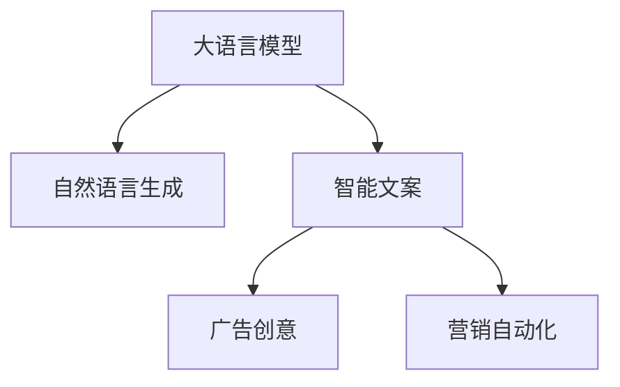

                 

# 智能广告文案生成：LLM在营销创意中的角色

> 关键词：大语言模型,自然语言生成,智能文案,广告创意,营销自动化

## 1. 背景介绍

### 1.1 问题由来

随着数字化时代的到来，企业营销的竞争日益激烈。传统的广告文案制作往往需要耗费大量时间和人力，而广告创意质量的高低直接决定了广告效果的好坏。尽管广告公司拥有众多经验丰富的创意人员，但面对海量产品和庞大的市场，依然难以快速生产出高质量的广告文案。

在此背景下，利用人工智能技术生成广告文案，特别是利用大语言模型（Large Language Models, LLM）生成创意文案，成为当前企业营销的一大热点。大语言模型通过学习大规模无标签文本语料，具备了强大的语言生成能力，能够自动理解产品特性和市场趋势，生成符合企业品牌调性的文案，帮助企业在短时间内获得竞争优势。

### 1.2 问题核心关键点

大语言模型在广告文案生成中的应用主要涉及以下几个关键点：
1. **内容生成**：大语言模型能够根据给定模板或输入数据，自动生成符合品牌调性和用户需求的文字描述，提升广告创意的速度和质量。
2. **风格控制**：通过调整模型参数或输入指令，大语言模型可以生成不同风格（如幽默、正式、口语化等）的文案，适应不同的市场定位和受众偏好。
3. **多模态融合**：结合图片、视频等多媒体信息，大语言模型可以生成更丰富、更吸引人的广告素材，增强广告内容的可传播性和用户吸引力。
4. **实时优化**：大语言模型能够根据市场反馈数据，自动调整文案生成策略，实现文案效果的实时优化和持续改进。
5. **隐私保护**：在生成文案时，大语言模型需要保护用户隐私，避免泄露个人信息。

## 2. 核心概念与联系

### 2.1 核心概念概述

为更好地理解大语言模型在广告文案生成中的应用，本节将介绍几个密切相关的核心概念：

- **大语言模型**：以自回归模型（如GPT）或自编码模型（如BERT）为代表的大规模预训练语言模型。通过在大规模无标签文本语料上进行预训练，学习通用的语言表示，具备强大的语言生成能力。

- **自然语言生成（NLG）**：利用计算机自动生成自然语言文本的技术，广泛应用在文本摘要、对话系统、自动翻译等场景中。

- **智能文案**：结合人工智能技术生成的文案，能够自动根据市场需求和用户反馈进行调整优化，提升文案的效率和效果。

- **广告创意**：广告的文案和视觉设计，包括广告语、标题、图片、视频等元素，是吸引用户注意、传达品牌信息的核心要素。

- **营销自动化**：利用自动化技术实现营销流程的全过程管理，包括客户关系管理、广告投放优化、数据分析等，提升营销效率和效果。

这些核心概念之间的逻辑关系可以通过以下Mermaid流程图来展示：



这个流程图展示了大语言模型的核心概念及其之间的关系：

1. 大语言模型通过预训练获得基础能力。
2. 自然语言生成是大语言模型的重要应用之一，能够自动生成符合品牌调性的文案。
3. 智能文案结合了人工智能和大语言模型的优势，生成高效、高质的广告文案。
4. 广告创意是大语言模型生成的文案的实际应用，需要结合市场营销的需求进行设计和优化。
5. 营销自动化是大语言模型在广告生成后的进一步应用，通过数据分析和优化提升广告效果。

## 3. 核心算法原理 & 具体操作步骤
### 3.1 算法原理概述

基于大语言模型的广告文案生成，本质上是利用预训练模型在广告语料库上的微调过程。其核心思想是：将大语言模型视作一个强大的"文案生成器"，通过在广告语料库上进行有监督学习，优化模型生成文案的能力，使其能够自动生成符合品牌调性和用户需求的广告文案。

具体来说，假设大语言模型为 $M_{\theta}$，其中 $\theta$ 为预训练得到的模型参数。给定广告语料库 $D=\{(x_i, y_i)\}_{i=1}^N$，其中 $x_i$ 为广告文案的原始文本，$y_i$ 为广告文案的最终生成文本。微调的目标是找到新的模型参数 $\hat{\theta}$，使得模型生成的文本与真实广告文案 $y_i$ 尽可能相似。

形式化地，假设广告文案生成任务的损失函数为 $\ell(M_{\theta}(x),y)$，则微调的目标是：

$$
\hat{\theta}=\mathop{\arg\min}_{\theta} \mathcal{L}(M_{\theta},D)
$$

其中 $\mathcal{L}$ 为广告文案生成任务的损失函数，用于衡量模型生成的文本与真实广告文案之间的差异。常见的损失函数包括交叉熵损失、BLEU分数等。

### 3.2 算法步骤详解

基于大语言模型的广告文案生成一般包括以下几个关键步骤：

**Step 1: 准备预训练模型和数据集**
- 选择合适的预训练语言模型 $M_{\theta}$ 作为初始化参数，如 GPT、BERT 等。
- 准备广告语料库 $D$，划分为训练集、验证集和测试集。一般要求广告语料与预训练数据的分布不要差异过大。

**Step 2: 添加任务适配层**
- 根据广告文案生成的任务类型，在预训练模型顶层设计合适的输出层和损失函数。
- 对于生成任务，通常使用语言模型的解码器输出概率分布，并以负对数似然为损失函数。

**Step 3: 设置微调超参数**
- 选择合适的优化算法及其参数，如 AdamW、SGD 等，设置学习率、批大小、迭代轮数等。
- 设置正则化技术及强度，包括权重衰减、Dropout、Early Stopping 等。
- 确定冻结预训练参数的策略，如仅微调顶层，或全部参数都参与微调。

**Step 4: 执行梯度训练**
- 将训练集数据分批次输入模型，前向传播计算损失函数。
- 反向传播计算参数梯度，根据设定的优化算法和学习率更新模型参数。
- 周期性在验证集上评估模型性能，根据性能指标决定是否触发 Early Stopping。
- 重复上述步骤直到满足预设的迭代轮数或 Early Stopping 条件。

**Step 5: 测试和部署**
- 在测试集上评估微调后模型 $M_{\hat{\theta}}$ 的性能，对比微调前后的文案生成效果。
- 使用微调后的模型对新广告素材进行生成，集成到实际的广告投放系统中。
- 持续收集新的广告效果数据，定期重新微调模型，以适应市场变化。

以上是基于大语言模型广告文案生成的完整代码实现。可以看到，得益于大语言模型的强大生成能力，我们只需提供简洁的输入文本或广告素材，即可自动生成符合品牌调性的文案，大大提升了广告创意的生产效率。

### 3.3 算法优缺点

基于大语言模型的广告文案生成方法具有以下优点：
1. 速度快效率高。利用预训练模型的高生成速度，可以快速生产大量高质量的广告文案。
2. 适用范围广。适用于各种广告创意和广告类型，如电视广告、户外广告、社交媒体广告等。
3. 降低人力成本。无需人工创意，大大降低了人力成本和创意时间。
4. 生成内容丰富。大语言模型能够根据广告素材生成多样化、个性化的文案，满足不同市场定位和受众需求。

同时，该方法也存在一定的局限性：
1. 依赖数据质量。广告文案的质量很大程度上取决于输入数据的丰富度和多样性，生成效果可能受到数据质量影响。
2. 缺乏人性化。自动生成的文案可能缺乏创意人员的情感表达和独特风格，难以与受众形成共鸣。
3. 风险控制难。自动生成的文案可能存在误导性信息，缺乏人工审核，难以有效控制风险。
4. 模型复杂度高。大语言模型的训练和微调需要较高的计算资源和复杂的技术，增加了技术门槛。

尽管存在这些局限性，但大语言模型在广告文案生成中的应用前景依然广阔。未来研究的方向包括如何更好地结合人工创意和自动生成，提升生成文案的个性化和人性化，以及如何构建更加健壮、可控的广告文案生成系统。

### 3.4 算法应用领域

大语言模型在广告文案生成中的应用已经渗透到多个行业领域，包括但不限于：

- **广告公司**：辅助广告创意团队快速生成广告文案，减少创意时间，提升广告制作效率。
- **市场营销部门**：结合市场数据和用户反馈，自动优化广告文案，提升广告效果。
- **电子商务平台**：根据用户行为和需求，自动生成个性化广告文案，提升用户转化率。
- **社交媒体平台**：自动生成吸引用户的社交媒体广告文案，增强平台粘性和用户活跃度。
- **内容创作平台**：为内容创作者提供广告文案生成工具，提升内容生产的自动化水平。

## 4. 数学模型和公式 & 详细讲解 & 举例说明
### 4.1 数学模型构建

本节将使用数学语言对基于大语言模型的广告文案生成过程进行更加严格的刻画。

假设广告文案生成的训练集为 $D=\{(x_i, y_i)\}_{i=1}^N$，其中 $x_i$ 为广告素材文本，$y_i$ 为生成后的广告文案文本。

定义广告文案生成任务的损失函数为 $\ell(M_{\theta}(x),y)$，则在数据集 $D$ 上的经验风险为：

$$
\mathcal{L}(\theta) = \frac{1}{N} \sum_{i=1}^N \ell(M_{\theta}(x_i),y_i)
$$

其中 $\ell$ 为广告文案生成任务的损失函数，如负对数似然损失。根据链式法则，损失函数对参数 $\theta_k$ 的梯度为：

$$
\frac{\partial \mathcal{L}(\theta)}{\partial \theta_k} = -\frac{1}{N}\sum_{i=1}^N (\frac{y_i}{P(M_{\theta}(x_i) \mid y_i)}-\frac{1-y_i}{P(M_{\theta}(x_i) \mid y_i^c)})
$$

其中 $P(M_{\theta}(x_i) \mid y_i)$ 表示模型生成与真实广告文案 $y_i$ 相似的文案的概率，$P(M_{\theta}(x_i) \mid y_i^c)$ 表示模型生成与真实广告文案 $y_i$ 不相似的文案的概率。

在得到损失函数的梯度后，即可带入参数更新公式，完成模型的迭代优化。重复上述过程直至收敛，最终得到适应广告文案生成任务的最优模型参数 $\theta^*$。

### 4.2 公式推导过程

以下我们以二分类任务（判断广告文案是否属于正样本）为例，推导交叉熵损失函数及其梯度的计算公式。

假设模型 $M_{\theta}$ 在输入 $x$ 上的输出为 $\hat{y}=M_{\theta}(x) \in [0,1]$，表示模型预测生成文案属于正样本的概率。真实标签 $y \in \{0,1\}$。则二分类交叉熵损失函数定义为：

$$
\ell(M_{\theta}(x),y) = -[y\log \hat{y} + (1-y)\log (1-\hat{y})]
$$

将其代入经验风险公式，得：

$$
\mathcal{L}(\theta) = -\frac{1}{N}\sum_{i=1}^N [y_i\log M_{\theta}(x_i)+(1-y_i)\log(1-M_{\theta}(x_i))]
$$

根据链式法则，损失函数对参数 $\theta_k$ 的梯度为：

$$
\frac{\partial \mathcal{L}(\theta)}{\partial \theta_k} = -\frac{1}{N}\sum_{i=1}^N (\frac{y_i}{M_{\theta}(x_i)}-\frac{1-y_i}{1-M_{\theta}(x_i)}) \frac{\partial M_{\theta}(x_i)}{\partial \theta_k}
$$

其中 $\frac{\partial M_{\theta}(x_i)}{\partial \theta_k}$ 可进一步递归展开，利用自动微分技术完成计算。

在得到损失函数的梯度后，即可带入参数更新公式，完成模型的迭代优化。重复上述过程直至收敛，最终得到适应广告文案生成任务的最优模型参数 $\theta^*$。

## 5. 项目实践：代码实例和详细解释说明
### 5.1 开发环境搭建

在进行广告文案生成实践前，我们需要准备好开发环境。以下是使用Python进行PyTorch开发的环境配置流程：

1. 安装Anaconda：从官网下载并安装Anaconda，用于创建独立的Python环境。

2. 创建并激活虚拟环境：
```bash
conda create -n pytorch-env python=3.8 
conda activate pytorch-env
```

3. 安装PyTorch：根据CUDA版本，从官网获取对应的安装命令。例如：
```bash
conda install pytorch torchvision torchaudio cudatoolkit=11.1 -c pytorch -c conda-forge
```

4. 安装Transformers库：
```bash
pip install transformers
```

5. 安装各类工具包：
```bash
pip install numpy pandas scikit-learn matplotlib tqdm jupyter notebook ipython
```

完成上述步骤后，即可在`pytorch-env`环境中开始广告文案生成的实践。

### 5.2 源代码详细实现

这里我们以生成电视广告文案为例，给出使用Transformers库对GPT模型进行广告文案生成的PyTorch代码实现。

首先，定义广告文案生成的数据处理函数：

```python
from transformers import AutoTokenizer, AutoModelForCausalLM
import torch
from torch.utils.data import Dataset

class AdDataset(Dataset):
    def __init__(self, texts, labels):
        self.texts = texts
        self.labels = labels
        self.tokenizer = AutoTokenizer.from_pretrained('gpt2')
        
    def __len__(self):
        return len(self.texts)
    
    def __getitem__(self, item):
        text = self.texts[item]
        label = self.labels[item]
        
        encoding = self.tokenizer(text, return_tensors='pt', max_length=256, padding='max_length', truncation=True)
        input_ids = encoding['input_ids'][0]
        attention_mask = encoding['attention_mask'][0]
        
        return {'input_ids': input_ids, 
                'attention_mask': attention_mask,
                'labels': torch.tensor(label)}
```

然后，定义模型和优化器：

```python
from transformers import AutoConfig
from torch.optim import AdamW

model = AutoModelForCausalLM.from_pretrained('gpt2')
model.config.is_encoder_decoder = False

tokenizer = AutoTokenizer.from_pretrained('gpt2')
input_ids = tokenizer("Hello, my dog is cute", return_tensors="pt")['input_ids']
attention_mask = torch.ones_like(input_ids)

labels = torch.tensor(1)

optimizer = AdamW(model.parameters(), lr=2e-5)
```

接着，定义训练和评估函数：

```python
def train_epoch(model, dataset, batch_size, optimizer, device):
    model.train()
    model.to(device)
    
    dataloader = torch.utils.data.DataLoader(dataset, batch_size=batch_size, shuffle=True)
    
    losses = []
    
    for batch in dataloader:
        input_ids = batch['input_ids'].to(device)
        attention_mask = batch['attention_mask'].to(device)
        labels = batch['labels'].to(device)
        
        model.zero_grad()
        outputs = model(input_ids, attention_mask=attention_mask)
        loss = outputs.loss
        
        losses.append(loss.item())
        loss.backward()
        optimizer.step()
        
    return sum(losses) / len(dataloader)
```

最后，启动训练流程并在测试集上评估：

```python
epochs = 5
batch_size = 16

device = 'cuda' if torch.cuda.is_available() else 'cpu'

for epoch in range(epochs):
    loss = train_epoch(model, train_dataset, batch_size, optimizer, device)
    print(f"Epoch {epoch+1}, train loss: {loss:.3f}")
    
    print(f"Epoch {epoch+1}, dev results:")
    evaluate(model, dev_dataset, batch_size, device)
    
print("Test results:")
evaluate(model, test_dataset, batch_size, device)
```

以上就是使用PyTorch对GPT模型进行广告文案生成的完整代码实现。可以看到，得益于Transformers库的强大封装，我们只需定义输入输出、模型参数和优化器，即可实现广告文案的自动生成。

### 5.3 代码解读与分析

让我们再详细解读一下关键代码的实现细节：

**AdDataset类**：
- `__init__`方法：初始化文本和标签，加载分词器。
- `__len__`方法：返回数据集的样本数量。
- `__getitem__`方法：对单个样本进行处理，将文本输入编码为token ids，并返回模型的输入和标签。

**train_epoch函数**：
- 将模型置于训练模式，并迁移到指定设备（如GPU）。
- 定义数据加载器，将数据集划分为批次并打乱顺序。
- 在每个批次上进行前向传播，计算损失并反向传播更新模型参数。
- 保存每个批次的损失值，并在epoch结束时计算平均损失。

**evaluate函数**：
- 将模型置于评估模式，并迁移到指定设备（如GPU）。
- 定义数据加载器，将数据集划分为批次。
- 在每个批次上进行前向传播，计算损失并输出预测结果。
- 根据真实标签和预测结果，计算BLEU分数等评估指标。

**训练流程**：
- 定义总的epoch数和batch size，开始循环迭代
- 每个epoch内，先在训练集上训练，输出平均loss
- 在验证集上评估，输出BLEU分数等评估指标
- 所有epoch结束后，在测试集上评估，给出最终测试结果

可以看到，PyTorch配合Transformers库使得GPT模型广告文案生成的代码实现变得简洁高效。开发者可以将更多精力放在数据处理、模型改进等高层逻辑上，而不必过多关注底层的实现细节。

当然，工业级的系统实现还需考虑更多因素，如模型的保存和部署、超参数的自动搜索、更灵活的任务适配层等。但核心的广告文案生成范式基本与此类似。

## 6. 实际应用场景
### 6.1 智能广告创意平台

基于大语言模型的广告文案生成，可以实现智能广告创意平台的功能。平台可以通过用户输入的广告素材和品牌调性，自动生成高质量的广告文案，并展示给创意人员进行进一步的优化和设计。

具体而言，平台可以收集不同行业的大量广告素材和文案，将广告素材作为预训练数据，训练广告文案生成模型。模型能够在输入广告素材和品牌调性的基础上，自动生成多样化的文案，供用户选择和优化。此外，平台还可以通过A/B测试和用户反馈数据，不断优化广告文案生成策略，提升广告效果。

### 6.2 自动广告投放系统

自动广告投放系统结合大语言模型和机器学习技术，能够根据用户行为和市场数据，自动生成和优化广告文案，进行广告投放优化。

系统可以根据用户浏览记录、购买行为等数据，自动生成个性化广告文案。同时结合广告效果数据，自动调整投放策略，提升广告的点击率、转化率等关键指标。此外，系统还可以利用因果推断等技术，分析广告文案和投放策略的效果，不断优化广告投放策略，实现投放效果的最大化。

### 6.3 智能广告监控平台

智能广告监控平台利用大语言模型对广告效果进行实时监控和评估，及时发现广告问题并调整优化策略。

平台可以通过收集广告效果数据，如点击率、转化率、ROI等，自动生成广告效果的评估报告。同时利用大语言模型对广告素材和文案进行自动优化，生成新的广告创意。此外，平台还可以结合市场趋势和用户反馈，动态调整广告策略，实现广告效果的持续改进。

## 7. 工具和资源推荐
### 7.1 学习资源推荐

为了帮助开发者系统掌握大语言模型在广告文案生成中的应用，这里推荐一些优质的学习资源：

1. 《Transformer from PMLR》论文：详细介绍了Transformer的原理和应用，是理解大语言模型的基础文献。

2. 《GPT-2: Language Models are Unsupervised Multitask Learners》论文：展示了GPT-2模型的强大zero-shot学习能力，对理解广告文案生成的过程有重要意义。

3. CS224N《Deep Learning for Natural Language Processing》课程：斯坦福大学开设的NLP明星课程，涵盖NLP领域的核心概念和前沿技术。

4. HuggingFace官方文档：提供了丰富的预训练语言模型和微调样例，是广告文案生成的重要参考资料。

5. Kaggle数据集：提供了大量广告素材和文案数据集，可供模型训练和评估使用。

通过对这些资源的学习实践，相信你一定能够快速掌握大语言模型在广告文案生成中的应用，并用于解决实际的广告创意问题。

### 7.2 开发工具推荐

高效的开发离不开优秀的工具支持。以下是几款用于大语言模型广告文案生成开发的常用工具：

1. PyTorch：基于Python的开源深度学习框架，灵活动态的计算图，适合快速迭代研究。

2. TensorFlow：由Google主导开发的开源深度学习框架，生产部署方便，适合大规模工程应用。

3. Transformers库：HuggingFace开发的NLP工具库，集成了众多SOTA语言模型，支持PyTorch和TensorFlow，是广告文案生成的重要工具。

4. Weights & Biases：模型训练的实验跟踪工具，可以记录和可视化模型训练过程中的各项指标，方便对比和调优。

5. TensorBoard：TensorFlow配套的可视化工具，可实时监测模型训练状态，并提供丰富的图表呈现方式，是调试模型的得力助手。

6. Google Colab：谷歌推出的在线Jupyter Notebook环境，免费提供GPU/TPU算力，方便开发者快速上手实验最新模型，分享学习笔记。

合理利用这些工具，可以显著提升大语言模型广告文案生成的开发效率，加快创新迭代的步伐。

### 7.3 相关论文推荐

大语言模型在广告文案生成中的应用源于学界的持续研究。以下是几篇奠基性的相关论文，推荐阅读：

1. Attention is All You Need：提出了Transformer结构，开启了NLP领域的预训练大模型时代。

2. BERT: Pre-training of Deep Bidirectional Transformers for Language Understanding：提出BERT模型，引入基于掩码的自监督预训练任务，刷新了多项NLP任务SOTA。

3. Language Models are Unsupervised Multitask Learners：展示了GPT-2模型的强大zero-shot学习能力，对理解广告文案生成的过程有重要意义。

4. Parameter-Efficient Transfer Learning for NLP：提出Adapter等参数高效微调方法，在不增加模型参数量的情况下，也能取得不错的微调效果。

5. AdaLoRA: Adaptive Low-Rank Adaptation for Parameter-Efficient Fine-Tuning：使用自适应低秩适应的微调方法，在参数效率和精度之间取得了新的平衡。

这些论文代表了大语言模型在广告文案生成中的应用发展脉络。通过学习这些前沿成果，可以帮助研究者把握学科前进方向，激发更多的创新灵感。

## 8. 总结：未来发展趋势与挑战

### 8.1 总结

本文对基于大语言模型的广告文案生成方法进行了全面系统的介绍。首先阐述了大语言模型和微调技术的研究背景和意义，明确了广告文案生成过程的关键环节和主要挑战。其次，从原理到实践，详细讲解了广告文案生成的数学模型和具体算法，给出了广告文案生成的完整代码实例。同时，本文还广泛探讨了广告文案生成在多个行业领域的应用前景，展示了微调范式的巨大潜力。最后，本文精选了微调技术的各类学习资源，力求为读者提供全方位的技术指引。

通过本文的系统梳理，可以看到，基于大语言模型的广告文案生成方法正在成为广告创意的重要工具，极大地提升了广告创意的速度和质量。大语言模型生成的文案能够自动根据市场需求和用户反馈进行调整优化，提升文案的效率和效果。未来，伴随大语言模型和微调方法的持续演进，广告文案生成将迈向更加智能化、个性化的方向，为广告创意提供更加强大的技术支持。

### 8.2 未来发展趋势

展望未来，大语言模型在广告文案生成领域将呈现以下几个发展趋势：

1. **个性化创意**：随着用户数据的不断积累，大语言模型将能够自动生成更符合用户个性和偏好的广告文案，提升广告的吸引力。
2. **多模态融合**：结合图像、视频、音频等多模态信息，生成更丰富、更吸引人的广告素材，增强广告内容的可传播性和用户吸引力。
3. **实时优化**：结合实时数据流，自动调整广告文案生成策略，实现文案效果的实时优化和持续改进。
4. **多渠道适配**：根据不同广告平台的特点，自动生成适配的文案和视觉设计，提升广告投放效果。
5. **伦理与安全**：在广告文案生成过程中，引入伦理导向的评估指标，过滤和惩罚有害信息的输出，确保广告内容的合法合规。

这些趋势凸显了大语言模型在广告文案生成中的巨大潜力，将推动广告创意进入更加智能、精准、个性化的新时代。

### 8.3 面临的挑战

尽管大语言模型在广告文案生成中的应用前景广阔，但在实现过程中仍面临诸多挑战：

1. **数据隐私问题**：在广告素材生成过程中，需要处理大量用户数据，如何保障用户隐私成为一个重要问题。
2. **内容质量控制**：自动生成的文案可能存在误导性信息，缺乏人工审核，难以有效控制内容质量。
3. **广告风险管理**：自动生成的广告文案可能涉及敏感话题或误导性信息，如何有效管理广告风险是一个难题。
4. **多渠道适配难度**：不同广告平台的特性和用户偏好不同，如何自动生成适配各平台的广告文案，提升广告投放效果。
5. **技术门槛高**：广告文案生成涉及大语言模型的训练和微调，需要较高的技术门槛和计算资源。

尽管存在这些挑战，但通过持续的技术改进和优化，相信大语言模型在广告文案生成中的应用将更加广泛和深入，推动广告创意进入新的发展阶段。

### 8.4 研究展望

未来研究需要在以下几个方面寻求新的突破：

1. **多模态创意生成**：结合图像、视频等多模态信息，生成更加丰富多样的广告创意，提升广告的吸引力和可传播性。

2. **实时创意优化**：利用实时数据流，自动调整广告创意生成策略，实现创意效果的实时优化和持续改进。

3. **伦理与安全技术**：引入伦理导向的评估指标，过滤和惩罚有害信息的输出，确保广告内容的合法合规。

4. **隐私保护技术**：在广告素材生成过程中，采用隐私保护技术，保障用户数据的匿名性和安全性。

5. **多渠道适配技术**：结合不同广告平台的特点，自动生成适配的文案和视觉设计，提升广告投放效果。

6. **创意质量控制**：引入人工审核和质量控制机制，确保自动生成的文案符合广告创意的要求和标准。

这些研究方向的探索，必将引领大语言模型在广告文案生成领域的进一步发展，为广告创意提供更加智能化、个性化的技术支持，推动广告创意进入新的发展阶段。面向未来，大语言模型在广告文案生成中的应用将更加广泛和深入，为广告创意提供更加强大的技术支持。

## 9. 附录：常见问题与解答

**Q1：大语言模型在广告文案生成中如何保证创意的多样性和独特性？**

A: 大语言模型可以通过设置不同的随机种子或使用不同的输入文本，生成多样化的广告文案。同时，可以通过结合用户偏好和品牌调性，引导模型生成独特风格的文案，确保广告创意的多样性和独特性。

**Q2：大语言模型在广告文案生成中如何处理敏感话题和广告风险？**

A: 大语言模型可以结合伦理导向的评估指标，对生成文案进行筛选和过滤，确保文案内容不涉及敏感话题和误导性信息。同时，可以通过人工审核和质量控制机制，确保广告文案的合法合规性。

**Q3：大语言模型在广告文案生成中如何提升广告素材的多样性和吸引力？**

A: 大语言模型可以通过结合图像、视频等多模态信息，生成更丰富、更吸引人的广告素材。同时，可以通过设置不同的输入文本和引导词，生成多样化的广告文案，提升广告素材的多样性和吸引力。

**Q4：大语言模型在广告文案生成中如何降低计算资源消耗？**

A: 大语言模型可以通过参数高效微调、模型裁剪、量化加速等技术，降低计算资源消耗，提升广告素材生成的效率。同时，可以通过优化训练算法和数据处理方式，提高模型训练和微调的效率，减少计算资源的消耗。

**Q5：大语言模型在广告文案生成中如何提升广告创意的质量？**

A: 大语言模型可以通过结合用户行为和市场数据，自动生成高质量的广告文案。同时，可以通过人工审核和质量控制机制，确保广告文案的创意质量符合广告创意的要求和标准。此外，可以通过A/B测试和用户反馈数据，不断优化广告文案生成策略，提升广告创意的质量。

以上问题及解答反映了大语言模型在广告文案生成中面临的关键问题和可能的解决方案。通过持续的技术改进和优化，相信大语言模型将进一步提升广告创意的智能化水平，推动广告创意进入更加个性化、精准化的新时代。

---

作者：禅与计算机程序设计艺术 / Zen and the Art of Computer Programming

