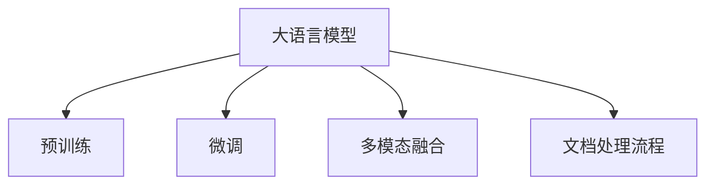

                 

# 智能文档处理：LLM在办公自动化中的应用

> 关键词：文档处理,智能自动化,LLM,办公自动化,自然语言处理

## 1. 背景介绍

### 1.1 问题由来
在现代办公环境中，文档处理任务占据了企业运营的很大一部分。传统的文档处理方式依赖于人工进行文档扫描、OCR识别、信息抽取、生成等，耗费大量时间和人力，且容易出现错误。

为了提高文档处理的效率和准确性，企业开始探索利用技术手段进行自动化处理。人工智能技术的引入，特别是大语言模型(LLM)的出现，为办公自动化带来了新的解决方案。LLM通过自然语言处理(NLP)技术，能够理解和处理自然语言，自动完成文档处理任务。

### 1.2 问题核心关键点
当前，基于大语言模型的办公自动化技术已经取得了一定的进展。其核心关键点包括：

1. **预训练模型**：利用大规模无标签文本数据进行预训练，获得通用的语言表示。
2. **微调**：根据具体办公自动化任务的需求，对预训练模型进行微调，以适应特定任务。
3. **多模态融合**：结合文本、图像、音频等多种信息，增强文档处理的准确性和效率。
4. **自动化流程**：构建完整的自动化文档处理流程，包括文档扫描、OCR识别、信息抽取、生成、分类等环节。
5. **实时性**：实现文档处理的实时性，支持在线文档处理和实时查询。

这些关键点共同构成了基于大语言模型的办公自动化技术的核心框架，使其能够更好地服务于企业文档处理需求。

### 1.3 问题研究意义
基于大语言模型的办公自动化技术，对于提升企业文档处理的效率和准确性，减少人工成本，推动企业数字化转型，具有重要意义：

1. **提升效率**：自动化文档处理可以显著减少人工处理时间，提高工作效率。
2. **降低成本**：减少人工处理成本，同时提高文档处理质量和准确性，避免人工错误。
3. **推动数字化转型**：将文档处理融入企业信息化建设，促进企业数字化升级。
4. **增强决策支持**：通过文档处理得到的结构化数据，能够支持企业决策分析，提升决策质量。
5. **提升客户体验**：自动化文档处理可以缩短客户等待时间，提高客户满意度。

本文将系统介绍基于大语言模型的办公自动化技术，从原理到实践，帮助读者全面理解其核心思想和技术细节。

## 2. 核心概念与联系

### 2.1 核心概念概述

为更好地理解基于大语言模型的办公自动化技术，本节将介绍几个密切相关的核心概念：

- **大语言模型(LLM)**：通过自监督学习在大规模无标签文本数据上进行预训练，获得强大的语言表示能力。常见的预训练任务包括掩码语言建模、下一句预测等。
- **微调**：利用标注数据对预训练模型进行微调，以适应特定任务。微调过程包括冻结部分预训练参数，更新部分参数，提高模型对任务的适应性。
- **多模态融合**：结合文本、图像、音频等多种信息，增强文档处理的准确性和效率。
- **文档处理流程**：包括文档扫描、OCR识别、信息抽取、生成、分类等环节，构成完整的文档处理流程。

这些核心概念之间的逻辑关系可以通过以下Mermaid流程图来展示：



这个流程图展示了大语言模型的核心概念及其之间的关系：

1. 大语言模型通过预训练获得基础能力。
2. 微调是对预训练模型进行任务特定的优化，以适应特定文档处理任务。
3. 多模态融合结合了多种信息源，提升了文档处理的准确性和效率。
4. 文档处理流程将多模态融合技术和微调技术应用到具体的文档处理任务中。

这些概念共同构成了基于大语言模型的办公自动化技术的核心框架，使其能够更好地服务于企业文档处理需求。

## 3. 核心算法原理 & 具体操作步骤
### 3.1 算法原理概述

基于大语言模型的办公自动化技术，其核心思想是通过自然语言处理(NLP)技术，利用大语言模型对文本信息进行处理，结合图像、音频等多种信息源，实现自动化文档处理。具体来说，包括以下几个步骤：

1. **文档扫描和OCR识别**：将纸质文档进行扫描，通过OCR技术识别出文档中的文本信息。
2. **文本信息抽取和预处理**：对OCR识别结果进行文本分割、分词、去噪等预处理操作。
3. **预训练模型选择**：根据文档处理任务的特点，选择合适的预训练语言模型。
4. **微调模型**：利用标注数据对预训练模型进行微调，以适应特定文档处理任务。
5. **多模态融合**：结合文本信息、图像信息、音频信息等，提升文档处理的准确性和效率。
6. **文档处理流程自动化**：将文档处理各环节集成化，实现自动化处理。

### 3.2 算法步骤详解

#### 3.2.1 文档扫描和OCR识别

文档扫描和OCR识别是文档处理的基础环节。传统上，文档扫描和OCR识别依赖于专门的硬件设备和软件工具，如扫描仪、OCR引擎等。现在，大语言模型可以直接与OCR服务集成，实现自动化文档处理。

#### 3.2.2 文本信息抽取和预处理

文本信息抽取和预处理是文档处理的关键环节。预训练模型在处理文本信息时，可能存在歧义或不准确的情况。因此，需要进行文本分割、分词、去噪等预处理操作，以提高模型的准确性。

#### 3.2.3 预训练模型选择

选择合适的预训练模型是文档处理的重要一步。根据任务的不同，可以选择不同类型的预训练模型，如BERT、GPT、T5等。BERT适用于分类、命名实体识别等任务，GPT适用于生成式任务，T5适用于问答、翻译等任务。

#### 3.2.4 微调模型

微调是对预训练模型进行任务特定的优化。微调过程中，需要选择适当的学习率和正则化技术，避免过拟合。可以通过设置合适的微调参数，如层数、节点数等，以提高模型对任务的适应性。

#### 3.2.5 多模态融合

多模态融合是将文本、图像、音频等多种信息源结合起来，提高文档处理的准确性和效率。可以通过特征提取、特征融合等技术，将不同模态的信息整合并输入到预训练模型中，得到更全面的语义信息。

#### 3.2.6 文档处理流程自动化

文档处理流程自动化是将文档扫描、OCR识别、信息抽取、生成、分类等环节集成化，实现自动化处理。可以使用Python等编程语言，结合OCR服务、预训练模型、多模态融合技术，构建完整的文档处理流程。

### 3.3 算法优缺点

基于大语言模型的办公自动化技术具有以下优点：

1. **高效性**：自动化的文档处理可以显著减少人工处理时间，提高工作效率。
2. **准确性**：大语言模型具有强大的语言理解和生成能力，能够准确地处理文档信息。
3. **可扩展性**：文档处理流程可以灵活调整，适应不同企业的需求。
4. **成本低**：减少人工处理成本，提高文档处理质量和准确性，避免人工错误。

同时，该技术也存在以下缺点：

1. **数据依赖**：依赖高质量的标注数据进行微调，获取标注数据成本较高。
2. **计算资源需求高**：大语言模型需要大量的计算资源进行预训练和微调。
3. **鲁棒性不足**：面对噪声数据和复杂场景，模型的鲁棒性有待提高。
4. **可解释性不足**：大语言模型往往像"黑盒"系统，难以解释其内部工作机制和决策逻辑。
5. **隐私和安全问题**：处理敏感文档时，需要考虑隐私和安全问题。

尽管存在这些局限性，但就目前而言，基于大语言模型的办公自动化技术仍然是最先进的方法。未来相关研究的重点在于如何进一步降低对标注数据的依赖，提高模型的鲁棒性，同时兼顾可解释性和隐私性等因素。

### 3.4 算法应用领域

基于大语言模型的办公自动化技术，在多个领域已经得到了广泛应用，例如：

- **文档管理**：自动化的文档扫描、OCR识别、分类、生成等，提高文档管理的效率和准确性。
- **智能客服**：利用预训练模型和微调技术，实现自动化的文档处理和客户交互，提升客户服务质量。
- **法律文档处理**：自动化的合同审查、证据抽取、法律文本生成等，提升法律服务效率和准确性。
- **医疗文档处理**：自动化的医疗记录处理、病理报告生成等，提高医疗服务质量和效率。
- **金融文档处理**：自动化的财务报表处理、合同审查等，提升金融服务效率和准确性。

除了上述这些经典应用外，大语言模型在办公自动化领域还将被创新性地应用到更多场景中，如文档智能审核、智能推荐、办公自动化工具等，为办公自动化技术带来新的突破。

## 4. 数学模型和公式 & 详细讲解  
### 4.1 数学模型构建

本节将使用数学语言对基于大语言模型的办公自动化技术进行更加严格的刻画。

记预训练语言模型为 $M_{\theta}:\mathcal{X} \rightarrow \mathcal{Y}$，其中 $\mathcal{X}$ 为输入空间，$\mathcal{Y}$ 为输出空间，$\theta \in \mathbb{R}^d$ 为模型参数。假设文档处理任务 $T$ 的训练集为 $D=\{(x_i,y_i)\}_{i=1}^N, x_i \in \mathcal{X}, y_i \in \mathcal{Y}$。

定义模型 $M_{\theta}$ 在输入 $x$ 上的损失函数为 $\ell(M_{\theta}(x),y)$，则在数据集 $D$ 上的经验风险为：

$$
\mathcal{L}(\theta) = \frac{1}{N} \sum_{i=1}^N \ell(M_{\theta}(x_i),y_i)
$$

微调的优化目标是最小化经验风险，即找到最优参数：

$$
\theta^* = \mathop{\arg\min}_{\theta} \mathcal{L}(\theta)
$$

在实践中，我们通常使用基于梯度的优化算法（如SGD、Adam等）来近似求解上述最优化问题。设 $\eta$ 为学习率，$\lambda$ 为正则化系数，则参数的更新公式为：

$$
\theta \leftarrow \theta - \eta \nabla_{\theta}\mathcal{L}(\theta) - \eta\lambda\theta
$$

其中 $\nabla_{\theta}\mathcal{L}(\theta)$ 为损失函数对参数 $\theta$ 的梯度，可通过反向传播算法高效计算。

### 4.2 公式推导过程

以下我们以文档分类任务为例，推导交叉熵损失函数及其梯度的计算公式。

假设模型 $M_{\theta}$ 在输入 $x$ 上的输出为 $\hat{y}=M_{\theta}(x) \in [0,1]$，表示样本属于正类的概率。真实标签 $y \in \{0,1\}$。则二分类交叉熵损失函数定义为：

$$
\ell(M_{\theta}(x),y) = -[y\log \hat{y} + (1-y)\log (1-\hat{y})]
$$

将其代入经验风险公式，得：

$$
\mathcal{L}(\theta) = -\frac{1}{N}\sum_{i=1}^N [y_i\log M_{\theta}(x_i)+(1-y_i)\log(1-M_{\theta}(x_i))]
$$

根据链式法则，损失函数对参数 $\theta_k$ 的梯度为：

$$
\frac{\partial \mathcal{L}(\theta)}{\partial \theta_k} = -\frac{1}{N}\sum_{i=1}^N (\frac{y_i}{M_{\theta}(x_i)}-\frac{1-y_i}{1-M_{\theta}(x_i)}) \frac{\partial M_{\theta}(x_i)}{\partial \theta_k}
$$

其中 $\frac{\partial M_{\theta}(x_i)}{\partial \theta_k}$ 可进一步递归展开，利用自动微分技术完成计算。

在得到损失函数的梯度后，即可带入参数更新公式，完成模型的迭代优化。重复上述过程直至收敛，最终得到适应下游任务的最优模型参数 $\theta^*$。

## 5. 项目实践：代码实例和详细解释说明
### 5.1 开发环境搭建

在进行文档处理实践前，我们需要准备好开发环境。以下是使用Python进行PyTorch开发的环境配置流程：

1. 安装Anaconda：从官网下载并安装Anaconda，用于创建独立的Python环境。

2. 创建并激活虚拟环境：
```bash
conda create -n pytorch-env python=3.8 
conda activate pytorch-env
```

3. 安装PyTorch：根据CUDA版本，从官网获取对应的安装命令。例如：
```bash
conda install pytorch torchvision torchaudio cudatoolkit=11.1 -c pytorch -c conda-forge
```

4. 安装Transformers库：
```bash
pip install transformers
```

5. 安装各类工具包：
```bash
pip install numpy pandas scikit-learn matplotlib tqdm jupyter notebook ipython
```

完成上述步骤后，即可在`pytorch-env`环境中开始文档处理实践。

### 5.2 源代码详细实现

下面我们以文档分类任务为例，给出使用Transformers库对BERT模型进行文档分类的PyTorch代码实现。

首先，定义文档分类任务的数据处理函数：

```python
from transformers import BertTokenizer
from torch.utils.data import Dataset
import torch

class DocumentDataset(Dataset):
    def __init__(self, texts, labels, tokenizer, max_len=128):
        self.texts = texts
        self.labels = labels
        self.tokenizer = tokenizer
        self.max_len = max_len
        
    def __len__(self):
        return len(self.texts)
    
    def __getitem__(self, item):
        text = self.texts[item]
        label = self.labels[item]
        
        encoding = self.tokenizer(text, return_tensors='pt', max_length=self.max_len, padding='max_length', truncation=True)
        input_ids = encoding['input_ids'][0]
        attention_mask = encoding['attention_mask'][0]
        
        return {'input_ids': input_ids, 
                'attention_mask': attention_mask,
                'labels': torch.tensor(label, dtype=torch.long)}
```

然后，定义模型和优化器：

```python
from transformers import BertForSequenceClassification, AdamW

model = BertForSequenceClassification.from_pretrained('bert-base-cased', num_labels=2)

optimizer = AdamW(model.parameters(), lr=2e-5)
```

接着，定义训练和评估函数：

```python
from torch.utils.data import DataLoader
from tqdm import tqdm
from sklearn.metrics import classification_report

device = torch.device('cuda') if torch.cuda.is_available() else torch.device('cpu')
model.to(device)

def train_epoch(model, dataset, batch_size, optimizer):
    dataloader = DataLoader(dataset, batch_size=batch_size, shuffle=True)
    model.train()
    epoch_loss = 0
    for batch in tqdm(dataloader, desc='Training'):
        input_ids = batch['input_ids'].to(device)
        attention_mask = batch['attention_mask'].to(device)
        labels = batch['labels'].to(device)
        model.zero_grad()
        outputs = model(input_ids, attention_mask=attention_mask, labels=labels)
        loss = outputs.loss
        epoch_loss += loss.item()
        loss.backward()
        optimizer.step()
    return epoch_loss / len(dataloader)

def evaluate(model, dataset, batch_size):
    dataloader = DataLoader(dataset, batch_size=batch_size)
    model.eval()
    preds, labels = [], []
    with torch.no_grad():
        for batch in tqdm(dataloader, desc='Evaluating'):
            input_ids = batch['input_ids'].to(device)
            attention_mask = batch['attention_mask'].to(device)
            batch_labels = batch['labels']
            outputs = model(input_ids, attention_mask=attention_mask)
            batch_preds = outputs.logits.argmax(dim=2).to('cpu').tolist()
            batch_labels = batch_labels.to('cpu').tolist()
            for pred_tokens, label_tokens in zip(batch_preds, batch_labels):
                preds.append(pred_tokens[:len(label_tokens)])
                labels.append(label_tokens)
                
    print(classification_report(labels, preds))
```

最后，启动训练流程并在验证集上评估：

```python
epochs = 5
batch_size = 16

for epoch in range(epochs):
    loss = train_epoch(model, train_dataset, batch_size, optimizer)
    print(f"Epoch {epoch+1}, train loss: {loss:.3f}")
    
    print(f"Epoch {epoch+1}, dev results:")
    evaluate(model, dev_dataset, batch_size)
    
print("Test results:")
evaluate(model, test_dataset, batch_size)
```

以上就是使用PyTorch对BERT进行文档分类的完整代码实现。可以看到，得益于Transformers库的强大封装，我们可以用相对简洁的代码完成BERT模型的加载和文档分类任务的微调。

### 5.3 代码解读与分析

让我们再详细解读一下关键代码的实现细节：

**DocumentDataset类**：
- `__init__`方法：初始化文本、标签、分词器等关键组件。
- `__len__`方法：返回数据集的样本数量。
- `__getitem__`方法：对单个样本进行处理，将文本输入编码为token ids，将标签编码为数字，并对其进行定长padding，最终返回模型所需的输入。

**模型和优化器**：
- `BertForSequenceClassification`类：用于实现序列分类任务，支持文本分类等。
- `AdamW`优化器：用于优化模型参数，学习率可调。

**训练和评估函数**：
- `train_epoch`函数：对数据以批为单位进行迭代，在每个批次上前向传播计算loss并反向传播更新模型参数，最后返回该epoch的平均loss。
- `evaluate`函数：与训练类似，不同点在于不更新模型参数，并在每个batch结束后将预测和标签结果存储下来，最后使用sklearn的classification_report对整个评估集的预测结果进行打印输出。

**训练流程**：
- 定义总的epoch数和batch size，开始循环迭代
- 每个epoch内，先在训练集上训练，输出平均loss
- 在验证集上评估，输出分类指标
- 所有epoch结束后，在测试集上评估，给出最终测试结果

可以看到，PyTorch配合Transformers库使得BERT微调的代码实现变得简洁高效。开发者可以将更多精力放在数据处理、模型改进等高层逻辑上，而不必过多关注底层的实现细节。

当然，工业级的系统实现还需考虑更多因素，如模型的保存和部署、超参数的自动搜索、更灵活的任务适配层等。但核心的微调范式基本与此类似。

## 6. 实际应用场景
### 6.1 智能文档分类

基于大语言模型的智能文档分类技术，可以应用于企业文档管理的各个环节，如文档归档、主题分类、信息检索等。通过微调BERT等预训练模型，可以实现文档的自动化分类，提高文档管理的效率和准确性。

在技术实现上，可以收集企业内部的文档样本，将其分为训练集和测试集，在此基础上对预训练模型进行微调。微调后的模型能够自动理解文档的主题和内容，并根据主题标签对文档进行分类。对于新的文档，模型可以自动预测其所属的主题，并自动归档到相应的文件夹中。

### 6.2 智能合同审查

在法律领域，合同审查是一项繁琐且耗时的任务。通过智能合同审查技术，可以显著提升合同审查的效率和准确性。

具体而言，可以收集企业内部的合同样本，将其标注为不同的合同类型和条款，训练BERT等预训练模型进行合同分类。微调后的模型能够自动识别合同类型、判断合同条款的合规性，并提供法律建议。对于新合同的审查，模型可以自动输出审查报告，帮助律师快速审核合同内容，节省大量时间。

### 6.3 智能文档生成

文档生成技术可以帮助企业快速生成各种类型的文档，如报告、简报、营销材料等。通过微调GPT等预训练模型，可以实现文档的自动生成，提升文档生成效率和质量。

在技术实现上，可以收集企业内部各类文档样本，将其作为训练数据集，训练GPT等预训练模型进行文档生成。微调后的模型能够自动生成各种类型的文档，并提供多种生成模式，如模板生成、仿写生成等。对于需要快速生成的文档，模型可以根据给定的标题、摘要等要求，自动生成完整文档，提升文档生成速度。

### 6.4 未来应用展望

随着大语言模型微调技术的发展，基于大语言模型的文档处理技术将在更多领域得到应用，为各行各业带来变革性影响。

在智慧医疗领域，基于大语言模型的智能文档处理技术可以应用于病历处理、病理报告生成、患者沟通等环节，提高医疗服务效率和质量。

在智能客服领域，智能文档处理技术可以应用于客服文档处理、聊天记录分析等环节，提升客户服务质量。

在金融领域，智能文档处理技术可以应用于财务报表处理、合同审查等环节，提升金融服务效率和合规性。

除了上述这些经典应用外，智能文档处理技术还将被创新性地应用到更多场景中，如智能推荐、智能审批、智能分析等，为各行各业提供新的解决方案。相信随着技术的不断进步，智能文档处理技术必将在更多领域大放异彩，为各行各业带来新的变革。

## 7. 工具和资源推荐
### 7.1 学习资源推荐

为了帮助开发者系统掌握基于大语言模型的文档处理技术，这里推荐一些优质的学习资源：

1. 《Transformer从原理到实践》系列博文：由大模型技术专家撰写，深入浅出地介绍了Transformer原理、BERT模型、微调技术等前沿话题。

2. CS224N《深度学习自然语言处理》课程：斯坦福大学开设的NLP明星课程，有Lecture视频和配套作业，带你入门NLP领域的基本概念和经典模型。

3. 《Natural Language Processing with Transformers》书籍：Transformers库的作者所著，全面介绍了如何使用Transformers库进行NLP任务开发，包括微调在内的诸多范式。

4. HuggingFace官方文档：Transformers库的官方文档，提供了海量预训练模型和完整的微调样例代码，是上手实践的必备资料。

5. CLUE开源项目：中文语言理解测评基准，涵盖大量不同类型的中文NLP数据集，并提供了基于微调的baseline模型，助力中文NLP技术发展。

通过对这些资源的学习实践，相信你一定能够快速掌握基于大语言模型的文档处理技术，并用于解决实际的文档处理问题。
### 7.2 开发工具推荐

高效的开发离不开优秀的工具支持。以下是几款用于文档处理开发的常用工具：

1. PyTorch：基于Python的开源深度学习框架，灵活动态的计算图，适合快速迭代研究。大部分预训练语言模型都有PyTorch版本的实现。

2. TensorFlow：由Google主导开发的开源深度学习框架，生产部署方便，适合大规模工程应用。同样有丰富的预训练语言模型资源。

3. Transformers库：HuggingFace开发的NLP工具库，集成了众多SOTA语言模型，支持PyTorch和TensorFlow，是进行文档处理开发的利器。

4. Weights & Biases：模型训练的实验跟踪工具，可以记录和可视化模型训练过程中的各项指标，方便对比和调优。与主流深度学习框架无缝集成。

5. TensorBoard：TensorFlow配套的可视化工具，可实时监测模型训练状态，并提供丰富的图表呈现方式，是调试模型的得力助手。

6. Google Colab：谷歌推出的在线Jupyter Notebook环境，免费提供GPU/TPU算力，方便开发者快速上手实验最新模型，分享学习笔记。

合理利用这些工具，可以显著提升文档处理任务的开发效率，加快创新迭代的步伐。

### 7.3 相关论文推荐

大语言模型和文档处理技术的发展源于学界的持续研究。以下是几篇奠基性的相关论文，推荐阅读：

1. Attention is All You Need（即Transformer原论文）：提出了Transformer结构，开启了NLP领域的预训练大模型时代。

2. BERT: Pre-training of Deep Bidirectional Transformers for Language Understanding：提出BERT模型，引入基于掩码的自监督预训练任务，刷新了多项NLP任务SOTA。

3. Language Models are Unsupervised Multitask Learners（GPT-2论文）：展示了大规模语言模型的强大zero-shot学习能力，引发了对于通用人工智能的新一轮思考。

4. Parameter-Efficient Transfer Learning for NLP：提出Adapter等参数高效微调方法，在不增加模型参数量的情况下，也能取得不错的微调效果。

5. Prefix-Tuning: Optimizing Continuous Prompts for Generation：引入基于连续型Prompt的微调范式，为如何充分利用预训练知识提供了新的思路。

6. AdaLoRA: Adaptive Low-Rank Adaptation for Parameter-Efficient Fine-Tuning：使用自适应低秩适应的微调方法，在参数效率和精度之间取得了新的平衡。

这些论文代表了大语言模型微调技术的发展脉络。通过学习这些前沿成果，可以帮助研究者把握学科前进方向，激发更多的创新灵感。

## 8. 总结：未来发展趋势与挑战

### 8.1 总结

本文对基于大语言模型的文档处理技术进行了全面系统的介绍。首先阐述了文档处理任务的背景和需求，明确了预训练模型、微调技术在文档处理中的核心作用。其次，从原理到实践，详细讲解了文档处理的具体步骤和数学模型，给出了文档处理任务的完整代码实现。同时，本文还广泛探讨了文档处理技术在多个行业领域的应用前景，展示了文档处理技术的巨大潜力。

通过本文的系统梳理，可以看到，基于大语言模型的文档处理技术正在成为文档处理任务的重要范式，极大地拓展了文档处理的应用边界，催生了更多的落地场景。得益于大规模语料的预训练，文档处理模型以更低的时间和标注成本，在小样本条件下也能取得理想的性能，有力推动了文档处理技术的产业化进程。未来，伴随预训练语言模型和文档处理技术的持续演进，相信文档处理技术必将在更广泛的领域大放异彩，深刻影响人类的文档处理方式。

### 8.2 未来发展趋势

展望未来，大语言模型文档处理技术将呈现以下几个发展趋势：

1. **模型规模持续增大**：随着算力成本的下降和数据规模的扩张，预训练语言模型的参数量还将持续增长。超大规模语言模型蕴含的丰富语言知识，有望支撑更加复杂多变的文档处理任务。

2. **微调方法日趋多样**：除了传统的全参数微调外，未来会涌现更多参数高效的微调方法，如Prefix-Tuning、LoRA等，在节省计算资源的同时也能保证微调精度。

3. **持续学习成为常态**：随着数据分布的不断变化，文档处理模型也需要持续学习新知识以保持性能。如何在不遗忘原有知识的同时，高效吸收新样本信息，将成为重要的研究课题。

4. **标注样本需求降低**：受启发于提示学习(Prompt-based Learning)的思路，未来的文档处理方法将更好地利用大模型的语言理解能力，通过更加巧妙的任务描述，在更少的标注样本上也能实现理想的文档处理效果。

5. **多模态融合崛起**：将文本、图像、音频等多种信息源结合起来，提高文档处理的准确性和效率。

6. **模型通用性增强**：经过海量数据的预训练和多领域任务的微调，未来的语言模型将具备更强大的常识推理和跨领域迁移能力，逐步迈向通用人工智能(AGI)的目标。

以上趋势凸显了大语言模型文档处理技术的广阔前景。这些方向的探索发展，必将进一步提升文档处理模型的性能和应用范围，为各行各业带来新的解决方案。

### 8.3 面临的挑战

尽管大语言模型文档处理技术已经取得了一定的进展，但在迈向更加智能化、普适化应用的过程中，它仍面临着诸多挑战：

1. **标注成本瓶颈**：依赖高质量的标注数据进行微调，获取标注数据成本较高。如何进一步降低微调对标注数据的依赖，将是一大难题。

2. **计算资源需求高**：大语言模型需要大量的计算资源进行预训练和微调。如何高效利用算力，提高模型训练速度，降低训练成本，是未来需要解决的重要问题。

3. **鲁棒性不足**：面对噪声数据和复杂场景，模型的鲁棒性有待提高。如何增强模型的泛化能力和抗干扰能力，是未来研究的重点。

4. **可解释性不足**：大语言模型往往像"黑盒"系统，难以解释其内部工作机制和决策逻辑。如何赋予文档处理模型更强的可解释性，将是亟待攻克的难题。

5. **隐私和安全问题**：处理敏感文档时，需要考虑隐私和安全问题。如何保护用户隐私，防止数据泄露，是未来需要解决的重要问题。

尽管存在这些局限性，但就目前而言，基于大语言模型的文档处理技术仍是最先进的方法。未来相关研究的重点在于如何进一步降低对标注数据的依赖，提高模型的鲁棒性，同时兼顾可解释性和隐私性等因素。

### 8.4 未来突破

面对大语言模型文档处理所面临的种种挑战，未来的研究需要在以下几个方面寻求新的突破：

1. **探索无监督和半监督文档处理方法**：摆脱对大规模标注数据的依赖，利用自监督学习、主动学习等无监督和半监督范式，最大限度利用非结构化数据，实现更加灵活高效的文档处理。

2. **研究参数高效和计算高效的文档处理范式**：开发更加参数高效的文档处理方法，在固定大部分预训练参数的同时，只更新极少量的任务相关参数。同时优化文档处理模型的计算图，减少前向传播和反向传播的资源消耗，实现更加轻量级、实时性的部署。

3. **融合因果和对比学习范式**：通过引入因果推断和对比学习思想，增强文档处理模型建立稳定因果关系的能力，学习更加普适、鲁棒的语言表征，从而提升模型泛化性和抗干扰能力。

4. **引入更多先验知识**：将符号化的先验知识，如知识图谱、逻辑规则等，与神经网络模型进行巧妙融合，引导文档处理过程学习更准确、合理的语言模型。同时加强不同模态数据的整合，实现视觉、语音等多模态信息与文本信息的协同建模。

5. **结合因果分析和博弈论工具**：将因果分析方法引入文档处理模型，识别出模型决策的关键特征，增强输出解释的因果性和逻辑性。借助博弈论工具刻画人机交互过程，主动探索并规避模型的脆弱点，提高系统稳定性。

6. **纳入伦理道德约束**：在模型训练目标中引入伦理导向的评估指标，过滤和惩罚有偏见、有害的输出倾向。同时加强人工干预和审核，建立模型行为的监管机制，确保输出符合人类价值观和伦理道德。

这些研究方向的探索，必将引领大语言模型文档处理技术迈向更高的台阶，为构建安全、可靠、可解释、可控的智能系统铺平道路。面向未来，大语言模型文档处理技术还需要与其他人工智能技术进行更深入的融合，如知识表示、因果推理、强化学习等，多路径协同发力，共同推动自然语言理解和智能交互系统的进步。只有勇于创新、敢于突破，才能不断拓展文档处理模型的边界，让智能技术更好地造福人类社会。

## 9. 附录：常见问题与解答

**Q1：大语言模型文档处理是否适用于所有文档处理任务？**

A: 大语言模型文档处理在大多数文档处理任务上都能取得不错的效果，特别是对于数据量较小的任务。但对于一些特定领域的任务，如法律、医学等，仅仅依靠通用语料预训练的模型可能难以很好地适应。此时需要在特定领域语料上进一步预训练，再进行微调，才能获得理想效果。此外，对于一些需要时效性、个性化很强的任务，如文档智能审核、智能推荐等，文档处理方法也需要针对性的改进优化。

**Q2：微调过程中如何选择合适的学习率？**

A: 微调的学习率一般要比预训练时小1-2个数量级，如果使用过大的学习率，容易破坏预训练权重，导致过拟合。一般建议从1e-5开始调参，逐步减小学习率，直至收敛。也可以使用warmup策略，在开始阶段使用较小的学习率，再逐渐过渡到预设值。需要注意的是，不同的优化器(如AdamW、Adafactor等)以及不同的学习率调度策略，可能需要设置不同的学习率阈值。

**Q3：采用大模型文档处理时会面临哪些资源瓶颈？**

A: 目前主流的预训练大模型动辄以亿计的参数规模，对算力、内存、存储都提出了很高的要求。GPU/TPU等高性能设备是必不可少的，但即便如此，超大批次的训练和推理也可能遇到显存不足的问题。因此需要采用一些资源优化技术，如梯度积累、混合精度训练、模型并行等，来突破硬件瓶颈。同时，模型的存储和读取也可能占用大量时间和空间，需要采用模型压缩、稀疏化存储等方法进行优化。

**Q4：如何缓解文档处理过程中的过拟合问题？**

A: 过拟合是文档处理面临的主要挑战，尤其是在标注数据不足的情况下。常见的缓解策略包括：
1. 数据增强：通过回译、近义替换等方式扩充训练集
2. 正则化：使用L2正则、Dropout、Early Stopping等避免过拟合
3. 对抗训练：引入对抗样本，提高模型鲁棒性
4. 参数高效微调：只调整少量参数(如Adapter、Prefix等)，减小过拟合风险
5. 多模型集成：训练多个文档处理模型，取平均输出，抑制过拟合

这些策略往往需要根据具体任务和数据特点进行灵活组合。只有在数据、模型、训练、推理等各环节进行全面优化，才能最大限度地发挥大模型文档处理的威力。

**Q5：文档处理模型在落地部署时需要注意哪些问题？**

A: 将文档处理模型转化为实际应用，还需要考虑以下因素：
1. 模型裁剪：去除不必要的层和参数，减小模型尺寸，加快推理速度
2. 量化加速：将浮点模型转为定点模型，压缩存储空间，提高计算效率
3. 服务化封装：将模型封装为标准化服务接口，便于集成调用
4. 弹性伸缩：根据请求流量动态调整资源配置，平衡服务质量和成本
5. 监控告警：实时采集系统指标，设置异常告警阈值，确保服务稳定性
6. 安全防护：采用访问鉴权、数据脱敏等措施，保障数据和模型安全

大语言模型文档处理为文档处理任务带来了新的解决方案，但如何将强大的性能转化为稳定、高效、安全的业务价值，还需要工程实践的不断打磨。唯有从数据、算法、工程、业务等多个维度协同发力，才能真正实现人工智能技术在垂直行业的规模化落地。总之，文档处理需要开发者根据具体任务，不断迭代和优化模型、数据和算法，方能得到理想的效果。

---

作者：禅与计算机程序设计艺术 / Zen and the Art of Computer Programming

