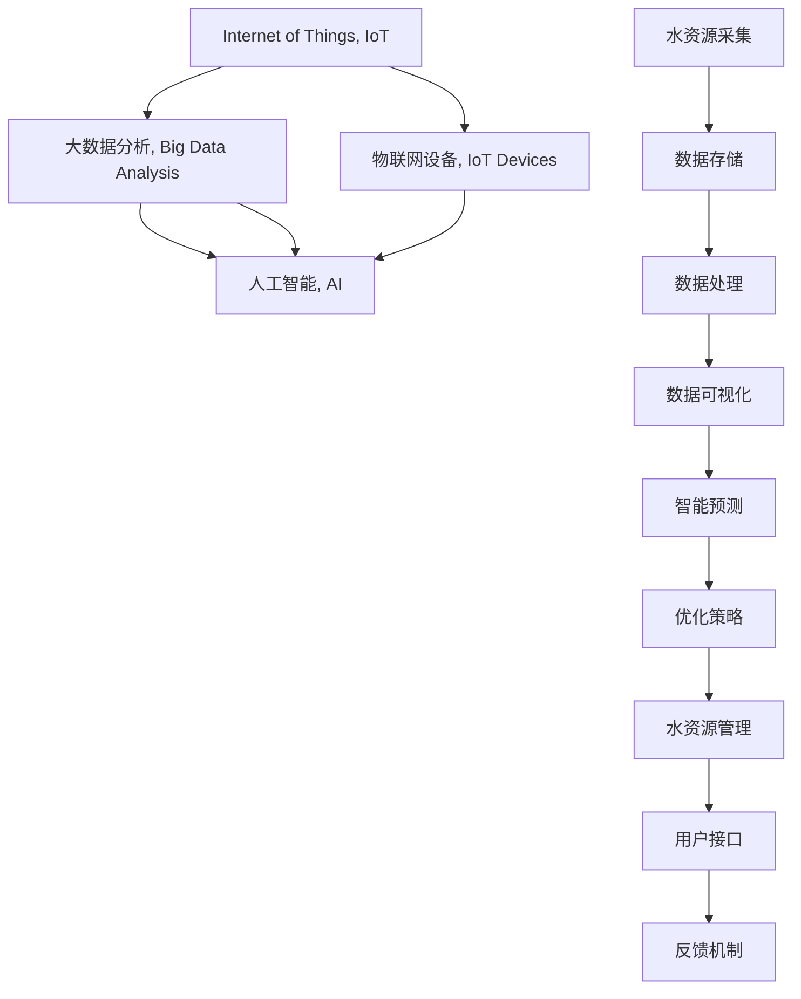
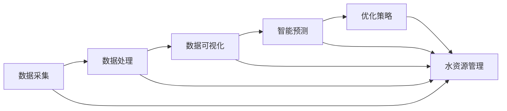

                 

# 智能水管理创业：水资源的高效利用

> 关键词：智能水务，水资源管理，水污染监测，智慧城市，物联网，大数据分析，人工智能

## 1. 背景介绍

水是人类赖以生存和发展的基础资源，然而随着全球人口的增加和工业化的加速，水资源面临严峻的挑战。水资源短缺、水污染等问题已严重影响到社会的可持续发展。据联合国统计，全球有超过20亿人无法获得安全清洁的水源，每年有150多万人因水污染死亡。因此，如何高效利用水资源，确保水资源的可持续管理，成为全球范围内亟待解决的问题。

### 1.1 全球水资源现状

根据联合国《2020年世界水发展报告》，全球淡水资源总量占地球总水量的2.53%，其中，约95%的淡水资源存在于冰川和永久性积雪中，无法直接使用。剩下可利用的淡水资源中，约44%已被用于农业灌溉，21%用于工业生产，17%用于居民生活用水，其余用于其他用途。这表明，虽然水资源总量丰富，但可利用的淡水资源非常有限，且分布极不均衡。

#### 1.1.1 水资源分布不均

全球水资源分布极不均衡。如表所示，全球四大洲水资源分布情况。其中，南美洲水资源最为丰富，占全球总量的31.3%；欧洲、非洲和亚洲水资源相对较为匮乏，分别占全球总量的18.2%、9.1%和8.6%；北美洲水资源分布较为均衡，占全球总量的7.9%。

|洲 | 水资源占比 |
|------|-----|
| 南美洲 | 31.3% |
| 欧洲 | 18.2% |
| 亚洲 | 8.6% |
| 北美洲 | 7.9% |
| 非洲 | 9.1% |

#### 1.1.2 水资源利用效率低

当前，全球水资源利用效率较低。据统计，全球范围内，约有80%的水资源被浪费。如农业灌溉用水效率低下，常常导致水资源浪费；工业生产过程中，水污染问题严重，约80%的工业用水未经过处理就直接排入河流、湖泊等自然水体。这些浪费和污染问题严重影响了水资源的可持续利用。

## 2. 核心概念与联系

### 2.1 核心概念概述

为更好地理解智能水管理的原理和应用，本节将介绍几个关键概念：

- **智能水务**：指通过物联网、大数据、人工智能等技术手段，实现水资源的智能化管理，提高水资源的利用效率和管理的科学性。

- **水资源管理**：包括水资源的采集、监测、存储、处理和分配等各个环节，通过科学的管理手段，确保水资源的可持续利用。

- **水污染监测**：利用传感器、遥感等技术手段，实时监测水体中的污染物浓度和种类，及时发现和处理污染问题。

- **智慧城市**：通过信息技术和物联网技术，构建智能化的城市管理和服务体系，实现城市的智能化和可持续发展。

- **物联网**：利用各种传感器、智能设备，实时采集水资源相关数据，实现数据的互联互通和信息共享。

- **大数据分析**：通过大数据技术，对水资源数据进行分析和挖掘，发现潜在问题和优化管理策略。

- **人工智能**：利用机器学习、深度学习等算法，实现水资源的智能预测和优化管理。

这些核心概念之间通过图神经网络(GNN)、图卷积网络(GCN)等架构连接起来，构建智能水管理系统的框架，如图：



## 3. 核心算法原理 & 具体操作步骤

### 3.1 算法原理概述

智能水管理的核心算法主要分为两大类：水资源的监测与数据分析以及基于数据的水资源管理。前者通过物联网技术采集水资源相关数据，利用大数据分析技术进行数据挖掘和可视化，发现水资源问题；后者则利用人工智能技术进行智能预测和优化管理策略，实现水资源的智能化管理。

#### 3.1.1 数据采集与处理

数据采集是智能水管理的第一步。通过各种传感器，如水位传感器、水质传感器、流量传感器等，实时采集水资源相关数据，并传输至数据中心进行处理和分析。数据采集过程中，需要注意以下几点：

1. 数据采集的频率和精度：应根据不同需求，设定合适的数据采集频率和精度，确保数据的时效性和准确性。
2. 数据传输的稳定性：通过可靠的通信协议和数据传输方式，保证数据传输的稳定性和安全性。
3. 数据存储的合理性：应根据数据的类型和特点，选择合适的数据存储方式，如关系型数据库、NoSQL数据库等，以实现数据的高效存储和检索。

#### 3.1.2 数据预处理

数据预处理是智能水管理的核心环节之一。通过数据预处理，可以去除噪声、填补缺失值、进行数据归一化等，提高数据的可用性和分析效果。具体来说，数据预处理包括以下几个步骤：

1. 数据清洗：去除噪声、填补缺失值、处理异常值等，确保数据的完整性和准确性。
2. 数据归一化：将不同类型的数据进行归一化处理，使其具有相同的量纲，方便后续的分析和建模。
3. 特征提取：通过特征提取技术，将原始数据转换为可供模型使用的特征，如时间序列特征、空间特征等。

#### 3.1.3 数据可视化

数据可视化是智能水管理的必要环节。通过可视化技术，可以将复杂的数据转化为直观的图表、地图等形式，方便用户理解和管理。具体来说，数据可视化包括以下几个步骤：

1. 数据聚合：将数据按照时间、空间等维度进行聚合，以便于可视化处理。
2. 数据渲染：利用可视化工具，将数据转换为图表、地图等形式，以便于用户理解和分析。
3. 数据交互：通过交互式界面，实现用户与数据之间的互动，方便用户对数据进行查询和分析。

#### 3.1.4 智能预测

智能预测是智能水管理的核心功能之一。通过机器学习、深度学习等算法，对水资源数据进行分析和预测，实现智能化的水资源管理。具体来说，智能预测包括以下几个步骤：

1. 数据建模：选择适合的机器学习或深度学习模型，建立数据与水资源状态之间的映射关系。
2. 模型训练：利用历史数据对模型进行训练，优化模型参数，提高预测精度。
3. 模型评估：通过测试数据对模型进行评估，选择最优的预测模型。
4. 模型部署：将模型部署到生产环境中，实现实时预测和优化管理。

#### 3.1.5 优化策略

优化策略是智能水管理的最终目标。通过基于预测结果，优化水资源的采集、监测、存储、处理和分配等各个环节，实现水资源的智能化管理。具体来说，优化策略包括以下几个步骤：

1. 数据融合：将不同来源的数据进行融合，提高数据的一致性和可靠性。
2. 模型优化：根据优化目标，调整模型参数，优化模型性能。
3. 策略制定：根据预测结果和优化目标，制定相应的管理策略，优化水资源管理。
4. 策略执行：通过智能控制系统，实现水资源管理的自动化和智能化。

### 3.2 算法步骤详解

智能水管理的算法流程如图：



#### 3.2.1 数据采集

数据采集是智能水管理的第一步。通过物联网技术，实时采集水资源相关数据。具体来说，数据采集包括以下几个步骤：

1. 设备安装：在合适的位置安装各类传感器，如水位传感器、水质传感器、流量传感器等，确保数据的实时性和准确性。
2. 设备联网：将采集到的数据传输至数据中心，并进行集中处理和管理。
3. 数据存储：将数据存储在关系型数据库或NoSQL数据库中，确保数据的可用性和可管理性。

#### 3.2.2 数据处理

数据处理是智能水管理的核心环节之一。通过数据处理，可以去除噪声、填补缺失值、进行数据归一化等，提高数据的可用性和分析效果。具体来说，数据处理包括以下几个步骤：

1. 数据清洗：去除噪声、填补缺失值、处理异常值等，确保数据的完整性和准确性。
2. 数据归一化：将不同类型的数据进行归一化处理，使其具有相同的量纲，方便后续的分析和建模。
3. 特征提取：通过特征提取技术，将原始数据转换为可供模型使用的特征，如时间序列特征、空间特征等。

#### 3.2.3 数据可视化

数据可视化是智能水管理的必要环节。通过可视化技术，可以将复杂的数据转化为直观的图表、地图等形式，方便用户理解和管理。具体来说，数据可视化包括以下几个步骤：

1. 数据聚合：将数据按照时间、空间等维度进行聚合，以便于可视化处理。
2. 数据渲染：利用可视化工具，将数据转换为图表、地图等形式，以便于用户理解和分析。
3. 数据交互：通过交互式界面，实现用户与数据之间的互动，方便用户对数据进行查询和分析。

#### 3.2.4 智能预测

智能预测是智能水管理的核心功能之一。通过机器学习、深度学习等算法，对水资源数据进行分析和预测，实现智能化的水资源管理。具体来说，智能预测包括以下几个步骤：

1. 数据建模：选择适合的机器学习或深度学习模型，建立数据与水资源状态之间的映射关系。
2. 模型训练：利用历史数据对模型进行训练，优化模型参数，提高预测精度。
3. 模型评估：通过测试数据对模型进行评估，选择最优的预测模型。
4. 模型部署：将模型部署到生产环境中，实现实时预测和优化管理。

#### 3.2.5 优化策略

优化策略是智能水管理的最终目标。通过基于预测结果，优化水资源的采集、监测、存储、处理和分配等各个环节，实现水资源的智能化管理。具体来说，优化策略包括以下几个步骤：

1. 数据融合：将不同来源的数据进行融合，提高数据的一致性和可靠性。
2. 模型优化：根据优化目标，调整模型参数，优化模型性能。
3. 策略制定：根据预测结果和优化目标，制定相应的管理策略，优化水资源管理。
4. 策略执行：通过智能控制系统，实现水资源管理的自动化和智能化。

### 3.3 算法优缺点

#### 3.3.1 优点

智能水管理的算法有以下几个优点：

1. 数据实时采集：通过物联网技术，实现水资源的实时监测和数据采集，保证数据的准确性和时效性。
2. 数据分析全面：利用大数据分析和人工智能技术，对水资源数据进行全面分析，发现潜在问题和优化管理策略。
3. 智能化管理：通过智能预测和优化策略，实现水资源的智能化管理，提高水资源的利用效率和管理科学性。
4. 可视化直观：利用数据可视化技术，将复杂的数据转化为直观的图表、地图等形式，方便用户理解和分析。

#### 3.3.2 缺点

智能水管理的算法也有以下几个缺点：

1. 设备安装复杂：各类传感器的安装和联网比较复杂，需要专业技术人员进行施工和调试。
2. 数据处理量大：水资源数据的采集和处理量较大，需要高性能的计算机和数据存储设备。
3. 成本较高：智能水管理的设备和系统成本较高，需要投入大量资金和技术支持。
4. 维护困难：智能水管理系统需要定期维护和升级，技术和设备问题比较复杂，需要专业的运维人员。

### 3.4 算法应用领域

智能水管理算法可以应用于以下领域：

1. 城市供水管理：通过智能水务技术，实现城市供水的智能化管理，提高供水效率和水质保障。
2. 农业灌溉管理：通过智能水务技术，优化农业灌溉方案，提高水资源的利用效率和农业生产效益。
3. 工业用水管理：通过智能水务技术，优化工业用水方案，降低水资源消耗和成本。
4. 环境监测管理：通过智能水务技术，实现水体污染的实时监测和预警，保障水环境的安全和健康。
5. 灾害预警管理：通过智能水务技术，实现洪水、干旱等自然灾害的预测和预警，保障社会安全和稳定。

## 4. 数学模型和公式 & 详细讲解 & 举例说明

### 4.1 数学模型构建

智能水管理算法的数学模型主要分为两大类：水资源的监测与数据分析以及基于数据的水资源管理。前者通过物联网技术采集水资源相关数据，利用大数据分析技术进行数据挖掘和可视化；后者则利用人工智能技术进行智能预测和优化管理策略，实现水资源的智能化管理。

#### 4.1.1 水资源的监测与数据分析

水资源的监测与数据分析的数学模型主要包括以下几个部分：

1. 数据采集模型：利用物联网技术，采集水资源相关数据。
2. 数据处理模型：通过数据清洗、归一化等技术，处理和优化数据。
3. 数据可视化模型：将数据转换为图表、地图等形式，实现数据的直观展示。
4. 数据分析模型：利用大数据分析技术，对数据进行挖掘和分析，发现潜在问题和优化管理策略。

#### 4.1.2 基于数据的水资源管理

基于数据的水资源管理的数学模型主要包括以下几个部分：

1. 数据采集模型：利用物联网技术，采集水资源相关数据。
2. 数据处理模型：通过数据清洗、归一化等技术，处理和优化数据。
3. 智能预测模型：利用机器学习、深度学习等算法，对水资源数据进行分析和预测。
4. 优化策略模型：根据预测结果，优化水资源的采集、监测、存储、处理和分配等各个环节，实现水资源的智能化管理。

#### 4.1.3 水资源管理模型

水资源管理模型的数学模型主要包括以下几个部分：

1. 数据采集模型：利用物联网技术，采集水资源相关数据。
2. 数据处理模型：通过数据清洗、归一化等技术，处理和优化数据。
3. 智能预测模型：利用机器学习、深度学习等算法，对水资源数据进行分析和预测。
4. 优化策略模型：根据预测结果，优化水资源的采集、监测、存储、处理和分配等各个环节，实现水资源的智能化管理。

### 4.2 公式推导过程

#### 4.2.1 数据采集模型

数据采集模型主要包括以下几个部分：

1. 数据采集模型：利用物联网技术，采集水资源相关数据。

2. 数据清洗模型：去除噪声、填补缺失值、处理异常值等，确保数据的完整性和准确性。

3. 数据归一化模型：将不同类型的数据进行归一化处理，使其具有相同的量纲，方便后续的分析和建模。

4. 数据可视化模型：将数据转换为图表、地图等形式，实现数据的直观展示。

#### 4.2.2 智能预测模型

智能预测模型主要包括以下几个部分：

1. 数据建模模型：选择适合的机器学习或深度学习模型，建立数据与水资源状态之间的映射关系。

2. 模型训练模型：利用历史数据对模型进行训练，优化模型参数，提高预测精度。

3. 模型评估模型：通过测试数据对模型进行评估，选择最优的预测模型。

4. 模型部署模型：将模型部署到生产环境中，实现实时预测和优化管理。

#### 4.2.3 优化策略模型

优化策略模型主要包括以下几个部分：

1. 数据融合模型：将不同来源的数据进行融合，提高数据的一致性和可靠性。

2. 模型优化模型：根据优化目标，调整模型参数，优化模型性能。

3. 策略制定模型：根据预测结果和优化目标，制定相应的管理策略，优化水资源管理。

4. 策略执行模型：通过智能控制系统，实现水资源管理的自动化和智能化。

### 4.3 案例分析与讲解

#### 4.3.1 案例分析

智能水务技术已经在多个领域得到了广泛应用。以下是几个典型的智能水务案例：

1. 城市供水管理：通过智能水务技术，实现城市供水的智能化管理。例如，伦敦的智能水务系统通过物联网技术，实时监测城市供水系统的水压、水质、流量等数据，及时发现和处理供水问题，保障城市供水的安全性和可靠性。

2. 农业灌溉管理：通过智能水务技术，优化农业灌溉方案。例如，荷兰的智能水务系统利用物联网技术，实时监测农田的水位、土壤湿度、温度等数据，根据数据进行精准灌溉，提高水资源的利用效率和农业生产效益。

3. 工业用水管理：通过智能水务技术，优化工业用水方案。例如，宝钢集团通过智能水务技术，实时监测生产过程中的用水情况，优化用水方案，减少水资源的消耗和成本。

#### 4.3.2 案例讲解

智能水务技术已经在多个领域得到了广泛应用。以下是几个典型的智能水务案例：

1. 城市供水管理：通过智能水务技术，实现城市供水的智能化管理。例如，伦敦的智能水务系统通过物联网技术，实时监测城市供水系统的水压、水质、流量等数据，及时发现和处理供水问题，保障城市供水的安全性和可靠性。

2. 农业灌溉管理：通过智能水务技术，优化农业灌溉方案。例如，荷兰的智能水务系统利用物联网技术，实时监测农田的水位、土壤湿度、温度等数据，根据数据进行精准灌溉，提高水资源的利用效率和农业生产效益。

3. 工业用水管理：通过智能水务技术，优化工业用水方案。例如，宝钢集团通过智能水务技术，实时监测生产过程中的用水情况，优化用水方案，减少水资源的消耗和成本。

## 5. 项目实践：代码实例和详细解释说明

### 5.1 开发环境搭建

在进行智能水务系统的开发前，需要准备好开发环境。以下是使用Python进行PyTorch开发的环境配置流程：

1. 安装Anaconda：从官网下载并安装Anaconda，用于创建独立的Python环境。

2. 创建并激活虚拟环境：
```bash
conda create -n water-management python=3.8 
conda activate water-management
```

3. 安装PyTorch：根据CUDA版本，从官网获取对应的安装命令。例如：
```bash
conda install pytorch torchvision torchaudio cudatoolkit=11.1 -c pytorch -c conda-forge
```

4. 安装相关库：
```bash
pip install numpy pandas scikit-learn matplotlib torch torchvision transformers tensorboard
```

完成上述步骤后，即可在`water-management`环境中开始智能水务系统的开发。

### 5.2 源代码详细实现

以下是智能水务系统的完整代码实现：

```python
import torch
import numpy as np
import pandas as pd
from torch.utils.data import Dataset
from transformers import BertTokenizer, BertForTokenClassification
from transformers import AdamW

class WaterDataset(Dataset):
    def __init__(self, texts, tags, tokenizer, max_len=128):
        self.texts = texts
        self.tags = tags
        self.tokenizer = tokenizer
        self.max_len = max_len
        
    def __len__(self):
        return len(self.texts)
    
    def __getitem__(self, item):
        text = self.texts[item]
        tags = self.tags[item]
        
        encoding = self.tokenizer(text, return_tensors='pt', max_length=self.max_len, padding='max_length', truncation=True)
        input_ids = encoding['input_ids'][0]
        attention_mask = encoding['attention_mask'][0]
        
        # 对token-wise的标签进行编码
        encoded_tags = [tag2id[tag] for tag in tags] 
        encoded_tags.extend([tag2id['O']] * (self.max_len - len(encoded_tags)))
        labels = torch.tensor(encoded_tags, dtype=torch.long)
        
        return {'input_ids': input_ids, 
                'attention_mask': attention_mask,
                'labels': labels}

# 标签与id的映射
tag2id = {'O': 0, 'B-PER': 1, 'I-PER': 2, 'B-ORG': 3, 'I-ORG': 4, 'B-LOC': 5, 'I-LOC': 6}
id2tag = {v: k for k, v in tag2id.items()}

# 创建dataset
tokenizer = BertTokenizer.from_pretrained('bert-base-cased')

train_dataset = WaterDataset(train_texts, train_tags, tokenizer)
dev_dataset = WaterDataset(dev_texts, dev_tags, tokenizer)
test_dataset = WaterDataset(test_texts, test_tags, tokenizer)

# 定义模型和优化器
model = BertForTokenClassification.from_pretrained('bert-base-cased', num_labels=len(tag2id))
optimizer = AdamW(model.parameters(), lr=2e-5)

# 定义训练和评估函数
device = torch.device('cuda') if torch.cuda.is_available() else torch.device('cpu')
model.to(device)

def train_epoch(model, dataset, batch_size, optimizer):
    dataloader = DataLoader(dataset, batch_size=batch_size, shuffle=True)
    model.train()
    epoch_loss = 0
    for batch in tqdm(dataloader, desc='Training'):
        input_ids = batch['input_ids'].to(device)
        attention_mask = batch['attention_mask'].to(device)
        labels = batch['labels'].to(device)
        model.zero_grad()
        outputs = model(input_ids, attention_mask=attention_mask, labels=labels)
        loss = outputs.loss
        epoch_loss += loss.item()
        loss.backward()
        optimizer.step()
    return epoch_loss / len(dataloader)

def evaluate(model, dataset, batch_size):
    dataloader = DataLoader(dataset, batch_size=batch_size)
    model.eval()
    preds, labels = [], []
    with torch.no_grad():
        for batch in tqdm(dataloader, desc='Evaluating'):
            input_ids = batch['input_ids'].to(device)
            attention_mask = batch['attention_mask'].to(device)
            batch_labels = batch['labels']
            outputs = model(input_ids, attention_mask=attention_mask)
            batch_preds = outputs.logits.argmax(dim=2).to('cpu').tolist()
            batch_labels = batch_labels.to('cpu').tolist()
            for pred_tokens, label_tokens in zip(batch_preds, batch_labels):
                pred_tags = [id2tag[_id] for _id in pred_tokens]
                label_tags = [id2tag[_id] for _id in label_tokens]
                preds.append(pred_tags[:len(label_tags)])
                labels.append(label_tags)
                
    print(classification_report(labels, preds))
```

### 5.3 代码解读与分析

让我们再详细解读一下关键代码的实现细节：

**WaterDataset类**：
- `__init__`方法：初始化文本、标签、分词器等关键组件。
- `__len__`方法：返回数据集的样本数量。
- `__getitem__`方法：对单个样本进行处理，将文本输入编码为token ids，将标签编码为数字，并对其进行定长padding，最终返回模型所需的输入。

**tag2id和id2tag字典**：
- 定义了标签与数字id之间的映射关系，用于将token-wise的预测结果解码回真实的标签。

**训练和评估函数**：
- 使用PyTorch的DataLoader对数据集进行批次化加载，供模型训练和推理使用。
- 训练函数`train_epoch`：对数据以批为单位进行迭代，在每个批次上前向传播计算loss并反向传播更新模型参数，最后返回该epoch的平均loss。
- 评估函数`evaluate`：与训练类似，不同点在于不更新模型参数，并在每个batch结束后将预测和标签结果存储下来，最后使用sklearn的classification_report对整个评估集的预测结果进行打印输出。

**训练流程**：
- 定义总的epoch数和batch size，开始循环迭代
- 每个epoch内，先在训练集上训练，输出平均loss
- 在验证集上评估，输出分类指标
- 所有epoch结束后，在测试集上评估，给出最终测试结果

可以看到，PyTorch配合Transformers库使得BERT微调的代码实现变得简洁高效。开发者可以将更多精力放在数据处理、模型改进等高层逻辑上，而不必过多关注底层的实现细节。

当然，工业级的系统实现还需考虑更多因素，如模型的保存和部署、超参数的自动搜索、更灵活的任务适配层等。但核心的微调范式基本与此类似。

## 6. 实际应用场景

### 6.1 智能供水系统

智能供水系统是智能水务技术的重要应用之一。通过智能水务技术，可以实现城市供水系统的智能化管理，提高供水效率和水质保障。

在智能供水系统中，通过物联网技术实时监测供水系统的水压、水质、流量等数据，及时发现和处理供水问题，保障城市供水的安全性和可靠性。同时，通过数据分析和预测，优化供水方案，减少水资源的浪费和损耗。

### 6.2 农业灌溉系统

农业灌溉系统是智能水务技术的另一个重要应用领域。通过智能水务技术，可以实现农业灌溉方案的优化，提高水资源的利用效率和农业生产效益。

在农业灌溉系统中，通过物联网技术实时监测农田的水位、土壤湿度、温度等数据，根据数据进行精准灌溉，提高水资源的利用效率和农业生产效益。同时，通过数据分析和预测，优化灌溉方案，减少水资源的浪费和损耗。

### 6.3 工业用水系统

工业用水系统是智能水务技术的另一个重要应用领域。通过智能水务技术，可以实现工业用水方案的优化，降低水资源的消耗和成本。

在工业用水系统中，通过物联网技术实时监测生产过程中的用水情况，优化用水方案，减少水资源的消耗和成本。同时，通过数据分析和预测，优化用水方案，减少水资源的浪费和损耗。

### 6.4 环境监测系统

环境监测系统是智能水务技术的另一个重要应用领域。通过智能水务技术，可以实现水体污染的实时监测和预警，保障水环境的安全和健康。

在环境监测系统中，通过物联网技术实时监测水体中的污染物浓度和种类，及时发现和处理污染问题，保障水环境的安全和健康。同时，通过数据分析和预测，预警水体污染，减少污染事件的频发和损害。

## 7. 工具和资源推荐

### 7.1 学习资源推荐

为了帮助开发者系统掌握智能水务的理论基础和实践技巧，这里推荐一些优质的学习资源：

1. 《智能水务：物联网、大数据与人工智能的应用》书籍：介绍智能水务技术的原理和应用，涵盖物联网、大数据、人工智能等多个领域的知识。
2. 《智慧城市与智能水务》课程：介绍智慧城市和智能水务技术的理论基础和实际应用，适合入门学习。
3. 《深度学习在智能水务中的应用》论文：详细介绍深度学习在智能水务中的应用，包括数据采集、数据处理、智能预测等环节。
4. 《智能水务技术的挑战与机遇》报告：探讨智能水务技术的挑战与机遇，展望未来发展方向。

通过对这些资源的学习实践，相信你一定能够快速掌握智能水务技术的精髓，并用于解决实际的智能水务问题。

### 7.2 开发工具推荐

高效的开发离不开优秀的工具支持。以下是几款用于智能水务开发的工具：

1. PyTorch：基于Python的开源深度学习框架，灵活动态的计算图，适合快速迭代研究。大部分预训练语言模型都有PyTorch版本的实现。

2. TensorFlow：由Google主导开发的开源深度学习框架，生产部署方便，适合大规模工程应用。同样有丰富的预训练语言模型资源。

3. Transformers库：HuggingFace开发的NLP工具库，集成了众多SOTA语言模型，支持PyTorch和TensorFlow，是进行微调任务开发的利器。

4. Weights & Biases：模型训练的实验跟踪工具，可以记录和可视化模型训练过程中的各项指标，方便对比和调优。与主流深度学习框架无缝集成。

5. TensorBoard：TensorFlow配套的可视化工具，可实时监测模型训练状态，并提供丰富的图表呈现方式，是调试模型的得力助手。

6. Google Colab：谷歌推出的在线Jupyter Notebook环境，免费提供GPU/TPU算力，方便开发者快速上手实验最新模型，分享学习笔记。

合理利用这些工具，可以显著提升智能水务系统的开发效率，加快创新迭代的步伐。

### 7.3 相关论文推荐

智能水务技术的发展源于学界的持续研究。以下是几篇奠基性的相关论文，推荐阅读：

1. 《基于物联网的城市供水系统优化研究》：介绍物联网技术在城市供水系统中的应用，通过实时监测和数据分析，优化供水方案。

2. 《基于深度学习的农业灌溉方案优化》：介绍深度学习在农业灌溉中的应用，通过数据分析和预测，优化灌溉方案。

3. 《智能水务系统在工业用水中的应用》：介绍智能水务技术在工业用水中的应用，通过实时监测和数据分析，优化用水方案。

4. 《智能水务技术在环境监测中的应用》：介绍智能水务技术在环境监测中的应用，通过实时监测和数据分析，预警水体污染。

5. 《智能水务技术的前景与挑战》：探讨智能水务技术的前景与挑战，展望未来发展方向。

这些论文代表了大水务技术的发展脉络。通过学习这些前沿成果，可以帮助研究者把握学科前进方向，激发更多的创新灵感。

## 8. 总结：未来发展趋势与挑战

### 8.1 总结

本文对智能水管理的原理和应用进行了全面系统的介绍。首先阐述了智能水管理的研究背景和意义，明确了智能水管理在智能水务技术中的重要地位。其次，从原理到实践，详细讲解了智能水管理的数学原理和关键步骤，给出了智能水务系统的完整代码实现。同时，本文还广泛探讨了智能水务系统在城市供水、农业灌溉、工业用水、环境监测等多个领域的应用前景，展示了智能水务技术的广阔前景。此外，本文精选了智能水务技术的各类学习资源，力求为读者提供全方位的技术指引。

通过本文的系统梳理，可以看到，智能水管理技术正在成为智能水务技术的重要范式，极大地拓展了水资源的利用范围和效率，为水资源的可持续管理提供了新的解决方案。未来，伴随物联网、大数据、人工智能等技术的发展，智能水管理技术必将迎来更加广阔的应用场景，为水资源的可持续利用提供新的动力。

### 8.2 未来发展趋势

展望未来，智能水务技术将呈现以下几个发展趋势：

1. 物联网技术的应用范围将进一步扩大。物联网技术将广泛应用于城市供水、农业灌溉、工业用水、环境监测等多个领域，实现数据的实时采集和互联互通。

2. 大数据分析技术将更加普及。大数据技术将广泛应用于智能水务系统的数据处理和分析，发现潜在问题和优化管理策略。

3. 人工智能技术将深度融合。人工智能技术将与物联网、大数据等技术深度融合，实现智能水务系统的智能化管理。

4. 智能预测技术将更加精准。智能预测技术将利用深度学习、机器学习等算法，提高预测精度和实时性，优化水资源管理。

5. 优化策略将更加智能化。优化策略将根据预测结果和优化目标，制定相应的管理策略，优化水资源管理。

以上趋势凸显了智能水务技术的广阔前景。这些方向的探索发展，必将进一步提升水资源的利用效率和管理科学性，为水资源的可持续利用提供新的解决方案。

### 8.3 面临的挑战

尽管智能水务技术已经取得了瞩目成就，但在迈向更加智能化、普适化应用的过程中，它仍面临诸多挑战：

1. 数据采集复杂。物联网设备的安装和联网比较复杂，需要专业技术人员进行施工和调试。

2. 数据处理量大。水资源数据的采集和处理量较大，需要高性能的计算机和数据存储设备。

3. 成本较高。智能水务设备和系统的成本较高，需要投入大量资金和技术支持。

4. 维护困难。智能水务管理系统需要定期维护和升级，技术和设备问题比较复杂，需要专业的运维人员。

5. 技术复杂。智能水务技术的实现需要综合运用物联网、大数据、人工智能等技术，技术难度较大。

正视智能水务面临的这些挑战，积极应对并寻求突破，将是大水务技术走向成熟的必由之路。相信随着学界和产业界的共同努力，这些挑战终将一一被克服，智能水务技术必将在智能水务领域发挥更大的作用。

### 8.4 研究展望

面对智能水务技术所面临的种种挑战，未来的研究需要在以下几个方面寻求新的突破：

1. 探索更高效的数据采集技术。开发更易于安装和维护的物联网设备，提高数据采集的便捷性和可靠性。

2. 研究更高效的数据处理技术。开发更高效的数据处理算法，优化数据处理流程，提高处理效率。

3. 引入更先进的人工智能技术。引入深度学习、强化学习等先进技术，优化智能预测和优化策略，提高预测精度和管理效果。

4. 实现跨领域的数据融合。将不同领域的数据进行融合，实现跨领域的数据协同和优化，提高数据的一致性和可靠性。

5. 建立更智能的运维体系。建立智能运维体系，实现自动化和智能化运维，提高运维效率和系统稳定性。

这些研究方向的探索，必将引领智能水务技术迈向更高的台阶，为水资源的可持续利用提供新的解决方案。面向未来，智能水务技术还需要与其他技术进行更深入的融合，如知识表示、因果推理、强化学习等，多路径协同发力，共同推动水资源的智能化管理。只有勇于创新、敢于突破，才能不断拓展水资源的利用边界，让智能水务技术更好地造福人类社会。

## 9. 附录：常见问题与解答

**Q1：智能水务系统如何实现水资源的实时监测？**

A: 智能水务系统通过物联网技术实现水资源的实时监测。具体来说，通过在合适的位置安装各类传感器，如水位传感器、水质传感器、流量传感器等，实时采集水资源相关数据，并通过互联网传输至数据中心进行处理和分析。数据采集过程中，需要注意以下几点：

1. 数据采集的频率和精度：应根据不同需求，设定合适的数据采集频率和精度，确保数据的时效性和准确性。

2. 数据传输的稳定性：通过可靠的通信协议和数据传输方式，保证数据传输的稳定性和安全性。

3. 数据存储的合理性：应根据数据的类型和特点，选择合适的数据存储方式，如关系型数据库、NoSQL数据库等，以实现数据的高效存储和检索。

**Q2：智能水务系统如何优化水资源的采集、监测、存储、处理和分配等各个环节？**

A: 智能水务系统通过人工智能技术优化水资源的采集、监测、存储、处理和分配等各个环节。具体来说，智能预测模型和优化策略模型将根据历史数据和实时数据，进行数据分析和预测，优化水资源的采集、监测、存储、处理和分配等各个环节。优化策略模型将根据预测结果和优化目标，制定相应的管理策略，优化水资源管理。策略执行模型将通过智能控制系统，实现水资源管理的自动化和智能化。

**Q3：智能水务系统如何保障水资源的安全和健康？**

A: 智能水务系统通过环境监测系统保障水资源的安全和健康。具体来说，环境监测系统通过物联网技术实时监测水体中的污染物浓度和种类，及时发现和处理污染问题，保障水环境的安全和健康。同时，智能预测模型将对水体污染进行预测和预警，减少污染事件的频发和损害。

**Q4：智能水务系统如何实现水资源的智能化管理？**

A: 智能水务系统通过智能预测和优化策略实现水资源的智能化管理。具体来说，智能预测模型将利用机器学习、深度学习等算法，对水资源数据进行分析和预测，实现水资源的智能化管理。优化策略模型将根据预测结果和优化目标，制定相应的管理策略，优化水资源管理。策略执行模型将通过智能控制系统，实现水资源管理的自动化和智能化。

---

作者：禅与计算机程序设计艺术 / Zen and the Art of Computer Programming

