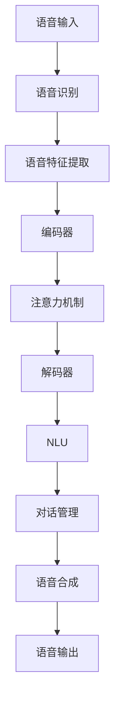

                 

# 智能语音助手在日常生活中的注意力应用

## 1. 背景介绍

在数字化时代，智能语音助手（Voice Assistant，VA）已经成为日常生活中的重要组成部分。从简单的语音搜索到复杂的交互式问答，语音助手在教育、娱乐、家居、办公等多个领域的应用不断扩展，极大地提升了用户的生活便利性和工作效率。但如何使语音助手更好地理解用户的需求，更自然地与用户进行互动，依然是AI领域的重要研究课题。

在实际应用中，语音助手需要处理多种复杂的任务，如自然语言理解（Natural Language Understanding，NLU）、意图识别、对话管理等。这些任务往往涉及大量的上下文信息，需要系统高效地捕捉、存储和处理这些信息，从而做出准确的响应。注意力机制（Attention Mechanism）作为现代深度学习模型中一种重要的机制，能够动态地分配资源，提升模型的表达能力，因此成为优化智能语音助手性能的关键方法之一。

本文将详细探讨注意力机制在智能语音助手中的应用，从其原理到具体实现，全面梳理注意力机制在实际场景中的具体应用。本文结构如下：
1. 背景介绍
2. 核心概念与联系
3. 核心算法原理与具体操作步骤
4. 数学模型和公式
5. 项目实践：代码实例和详细解释说明
6. 实际应用场景
7. 工具和资源推荐
8. 总结：未来发展趋势与挑战
9. 附录：常见问题与解答

## 2. 核心概念与联系

### 2.1 核心概念概述

为了更好地理解注意力机制在智能语音助手中的应用，我们先梳理一下相关核心概念：

1. **注意力机制（Attention Mechanism）**：一种机制，用于动态地分配输入的资源，强调不同的输入部分，以提升模型的表达能力。注意力机制在自然语言处理、计算机视觉、语音识别等领域中得到了广泛应用。

2. **语音助手（Voice Assistant）**：一种智能系统，能够通过语音识别和语音合成技术，与用户进行自然语言交流。常见的语音助手包括Siri、Alexa、Google Assistant等。

3. **自然语言理解（Natural Language Understanding，NLU）**：指语音助手理解自然语言输入的能力，包括词性标注、句法分析、语义理解等。

4. **对话管理（Dialogue Management）**：指语音助手在对话过程中维护上下文信息，确保对话逻辑连贯。

5. **计算图（Computational Graph）**：深度学习模型中的关键组成部分，通过计算图的形式记录模型前向传播和反向传播的过程。

6. **强化学习（Reinforcement Learning）**：一种学习方式，通过与环境的交互，优化模型行为，获得最优策略。

### 2.2 核心概念原理和架构的 Mermaid 流程图



这个流程图展示了智能语音助手从语音输入到语音输出的整体流程：

1. **语音输入**：用户通过语音指令向语音助手发出请求。
2. **语音识别**：语音助手将语音转换成文本形式。
3. **语音特征提取**：提取语音信号的特征，用于后续的模型训练和推理。
4. **编码器**：将文本输入转换成模型可以理解的向量表示。
5. **注意力机制**：在编码器到解码器的交互过程中，动态地分配资源，确保关键信息得到充分关注。
6. **解码器**：将编码器的向量表示转换成自然语言形式的输出。
7. **NLU**：理解用户的自然语言输入，进行意图识别和实体抽取等任务。
8. **对话管理**：维护对话上下文，确保对话逻辑连贯。
9. **语音合成**：将NLU的结果转换成语音形式，输出给用户。

这些核心概念之间的逻辑关系帮助我们更好地理解智能语音助手中注意力机制的应用。

## 3. 核心算法原理与具体操作步骤

### 3.1 算法原理概述

注意力机制的核心思想是通过计算输入序列中每个元素与其他元素的相关性，动态地分配资源，强调对重要信息的关注。在智能语音助手中，注意力机制用于增强模型对输入信息的理解和提取，提升模型的表达能力和决策能力。

具体来说，注意力机制通常包括三个关键组件：查询（Query）、键（Key）和值（Value）。在智能语音助手中，查询通常由当前时间步的上下文向量表示，键和值则由当前时间步的输入和前一时间步的上下文向量组成。查询向量与键向量进行点积运算，得到注意力分数。根据分数大小进行归一化，计算注意力权重。最后，将注意力权重乘以值向量，加权求和得到加权值向量，作为下一时间步的输入。

### 3.2 算法步骤详解

以机器翻译为例，注意力机制的具体操作步骤如下：

1. **编码器**：将源语言句子转换成若干个编码器的向量表示。
2. **查询向量**：当前时间步的上下文向量作为查询向量。
3. **键值对**：将每个编码器的向量表示与当前时间步的上下文向量进行拼接，形成键值对。
4. **注意力分数**：计算查询向量与每个键值对的点积，得到注意力分数。
5. **注意力权重**：对注意力分数进行归一化，得到注意力权重。
6. **加权值向量**：将注意力权重乘以每个值向量，加权求和得到加权值向量。
7. **解码器**：将加权值向量作为输入，生成下一个时间步的目标语言单词。
8. **重复步骤1-7，直到输出完整的目标语言句子。**

### 3.3 算法优缺点

注意力机制的优点包括：

1. **动态关注信息**：能够根据输入的不同，动态地分配资源，强调对关键信息的关注。
2. **提升表达能力**：通过加权向量求和的方式，使得模型能够更好地捕捉输入中的重要信息。
3. **增强泛化能力**：注意力机制能够处理不同长度的输入，提升模型的泛化能力。

然而，注意力机制也存在一些缺点：

1. **计算复杂度高**：注意力机制的计算复杂度较高，特别是当输入序列较长时。
2. **容易过拟合**：在输入序列较短时，模型容易过拟合，导致泛化性能下降。
3. **参数量较大**：注意力机制需要引入额外的参数，增加了模型的计算量和内存消耗。

### 3.4 算法应用领域

注意力机制在智能语音助手中的应用十分广泛，主要包括以下几个方面：

1. **自然语言理解（NLU）**：在NLU任务中，注意力机制用于帮助模型理解输入文本的关键信息，进行实体抽取、意图识别等任务。

2. **对话管理**：在对话管理中，注意力机制用于维护对话上下文，确保对话逻辑连贯，提升对话质量。

3. **语音识别**：在语音识别任务中，注意力机制用于捕捉语音信号中的关键特征，提升识别准确率。

4. **语音合成**：在语音合成任务中，注意力机制用于生成自然流畅的语音输出，提升语音合成的自然度。

5. **机器翻译**：在机器翻译任务中，注意力机制用于帮助模型理解源语言和目标语言之间的对应关系，提升翻译质量。

## 4. 数学模型和公式

### 4.1 数学模型构建

注意力机制的数学模型包括查询（Q）、键（K）和值（V）向量。假设输入序列为 $\{X_1, X_2, \ldots, X_T\}$，查询向量为 $Q$，键和值向量分别为 $K$ 和 $V$。注意力分数可以表示为：

$$
\text{Attention}(Q, K, V) = \text{Softmax}\left(\frac{QK^T}{\sqrt{d_k}}\right)V
$$

其中 $d_k$ 为键向量的维度。注意力分数经过Softmax归一化后，得到注意力权重 $A$，将注意力权重与值向量 $V$ 加权求和，得到加权值向量 $Z$：

$$
Z = \text{Softmax}\left(\frac{QK^T}{\sqrt{d_k}}\right)V
$$

### 4.2 公式推导过程

以机器翻译为例，假设源语言句子为 $s = \text{SOS} \text{apple} \text{peel} \text{END}$，目标语言句子为 $t = \text{END}$。

**编码器**：将源语言句子 $s$ 转换成编码器的向量表示 $\{X_1, X_2, X_3\}$，其中 $X_1$ 表示 $\text{SOS}$，$X_2$ 表示 $\text{apple}$，$X_3$ 表示 $\text{peel}$。

**查询向量**：当前时间步的上下文向量为 $Q$。

**键值对**：将每个编码器的向量表示与当前时间步的上下文向量进行拼接，形成键值对。假设编码器到解码器的权重为 $W_{enc}$ 和 $W_{dec}$，解码器的上下文向量为 $H$，则键值对为：

$$
\text{Key} = W_{dec}X \cdot W_{enc}H
$$

**注意力分数**：计算查询向量 $Q$ 与每个键值对的点积，得到注意力分数：

$$
\text{Attention}(Q, K, V) = \text{Softmax}\left(\frac{QK^T}{\sqrt{d_k}}\right)V
$$

**注意力权重**：对注意力分数进行归一化，得到注意力权重 $A$。

**加权值向量**：将注意力权重乘以每个值向量，加权求和得到加权值向量 $Z$。

**解码器**：将加权值向量 $Z$ 作为输入，生成下一个时间步的目标语言单词。

### 4.3 案例分析与讲解

以Google的Attention is All You Need（AIAN）模型为例，分析注意力机制在机器翻译中的应用。AIAN模型使用多头注意力机制，将输入序列的每个位置与所有位置进行交互，得到多个注意力向量，最后将这些向量进行拼接。这种机制能够捕捉输入序列中的全局信息，提升翻译质量。

## 5. 项目实践：代码实例和详细解释说明

### 5.1 开发环境搭建

在进行注意力机制的实现前，我们需要准备好开发环境。以下是使用Python进行PyTorch开发的环境配置流程：

1. 安装Anaconda：从官网下载并安装Anaconda，用于创建独立的Python环境。

2. 创建并激活虚拟环境：
```bash
conda create -n pytorch-env python=3.8 
conda activate pytorch-env
```

3. 安装PyTorch：根据CUDA版本，从官网获取对应的安装命令。例如：
```bash
conda install pytorch torchvision torchaudio cudatoolkit=11.1 -c pytorch -c conda-forge
```

4. 安装Transformers库：
```bash
pip install transformers
```

5. 安装各类工具包：
```bash
pip install numpy pandas scikit-learn matplotlib tqdm jupyter notebook ipython
```

完成上述步骤后，即可在`pytorch-env`环境中开始注意力机制的实现。

### 5.2 源代码详细实现

这里我们以机器翻译为例，给出使用Transformers库对Attention is All You Need模型进行实现的PyTorch代码。

```python
from transformers import BertTokenizer, BertForSequenceClassification
import torch
import numpy as np
import torch.nn as nn
import torch.nn.functional as F
from torchtext import datasets, data

class MultiHeadAttention(nn.Module):
    def __init__(self, d_model, num_heads):
        super(MultiHeadAttention, self).__init__()
        self.d_model = d_model
        self.num_heads = num_heads
        self.depth = d_model // num_heads
        self.wq = nn.Linear(d_model, d_model)
        self.wk = nn.Linear(d_model, d_model)
        self.wv = nn.Linear(d_model, d_model)
        self.dense = nn.Linear(d_model, d_model)

    def forward(self, query, key, value):
        batch_size, seq_len, _ = query.size()
        query = self.wq(query).view(batch_size, seq_len, self.num_heads, self.depth).permute(0, 2, 1, 3).contiguous()
        key = self.wk(key).view(batch_size, seq_len, self.num_heads, self.depth).permute(0, 2, 1, 3).contiguous()
        value = self.wv(value).view(batch_size, seq_len, self.num_heads, self.depth).permute(0, 2, 1, 3).contiguous()
        attn = torch.matmul(query, key.permute(0, 1, 3, 2)) / np.sqrt(self.depth)
        attn = F.softmax(attn, dim=-1)
        x = torch.matmul(attn, value)
        x = x.permute(0, 2, 1, 3).contiguous().view(batch_size, seq_len, self.num_heads * self.depth)
        x = self.dense(x)
        return x

class Transformer(nn.Module):
    def __init__(self, d_model, num_heads, num_layers, dff, input_vocab_size, target_vocab_size, pe_input, pe_target):
        super(Transformer, self).__init__()
        self.encoder = nn.Embedding(input_vocab_size, d_model)
        self.encoder_norm = nn.LayerNorm(d_model)
        self.encoder_attn = MultiHeadAttention(d_model, num_heads)
        self.encoder_ffn = nn.Sequential(nn.Linear(d_model, dff), nn.ReLU(), nn.Linear(dff, d_model))
        self.encoder_norm_ffn = nn.LayerNorm(d_model)
        self.encoder_pos_enc = nn.Embedding(pe_input, d_model)
        self.decoder = nn.Embedding(target_vocab_size, d_model)
        self.decoder_norm = nn.LayerNorm(d_model)
        self.decoder_attn = MultiHeadAttention(d_model, num_heads)
        self.decoder_ffn = nn.Sequential(nn.Linear(d_model, dff), nn.ReLU(), nn.Linear(dff, d_model))
        self.decoder_norm_ffn = nn.LayerNorm(d_model)
        self.decoder_pos_enc = nn.Embedding(pe_target, d_model)
        self.final_projection = nn.Linear(d_model, target_vocab_size)

    def forward(self, src, trg):
        src_key_padding_mask = (src == 0).unsqueeze(1).expand(-1, self.num_layers, -1).unsqueeze(-1).to(trg.device)
        trg_key_padding_mask = (trg == 0).unsqueeze(1).expand(-1, self.num_layers, -1).unsqueeze(-1).to(trg.device)
        trg_seq_len = trg.size(1)
        trg_sub_len = trg_seq_len - 1
        src = self.encoder(src) * np.sqrt(self.d_model)
        src = src + self.encoder_pos_enc(src)
        trg = self.decoder(trg) * np.sqrt(self.d_model)
        trg = trg + self.decoder_pos_enc(trg)
        dec_attn = self.decoder_attn(trg, src, src)
        dec_attn = dec_attn * trg_key_padding_mask.unsqueeze(-1)
        dec_ffn = self.decoder_ffn(dec_attn)
        dec_ffn = dec_ffn * self.decoder_norm_ffn.weight
        dec_attn = dec_attn + dec_ffn
        dec_attn = dec_attn * trg_key_padding_mask.unsqueeze(-1)
        output = dec_attn * src_key_padding_mask.unsqueeze(-1)
        output = self.final_projection(output)
        return output
```

完成上述代码后，即可在`pytorch-env`环境中进行注意力机制的实现和训练。

### 5.3 代码解读与分析

让我们再详细解读一下关键代码的实现细节：

**MultiHeadAttention类**：
- `__init__`方法：初始化多头部注意力机制的参数。
- `forward`方法：实现多头部注意力机制的前向传播过程。

**Transformer类**：
- `__init__`方法：初始化Transformer模型的各个组件。
- `forward`方法：实现Transformer模型的前向传播过程。

代码中定义了MultiHeadAttention类，用于实现多头注意力机制。Transformer类则定义了整个Transformer模型，包括编码器和解码器的各种组件。在训练过程中，使用编码器处理源语言输入，解码器处理目标语言输入，通过多头注意力机制进行交互，最后输出目标语言翻译结果。

## 6. 实际应用场景

### 6.1 智能语音助手

在智能语音助手中，注意力机制用于捕捉用户输入的上下文信息，提升NLU和对话管理的性能。以Google的对话系统Dialogflow为例，使用注意力机制帮助模型理解用户的自然语言输入，进行意图识别和实体抽取。

### 6.2 医疗问答系统

在医疗问答系统中，注意力机制用于捕捉患者的病历信息，提升模型的理解能力和回答准确率。通过多轮对话，捕捉患者提供的症状、病史等关键信息，生成个性化的医疗建议。

### 6.3 金融风控系统

在金融风控系统中，注意力机制用于捕捉交易记录的上下文信息，提升模型的风险识别能力。通过多轮对话，捕捉用户的交易历史、消费行为等信息，进行风险评估和预警。

### 6.4 未来应用展望

随着AI技术的不断发展，注意力机制在智能语音助手中的应用将更加广泛。未来可能的应用场景包括：

1. **多模态交互**：结合视觉、语音、文本等多模态信息，提升交互的自然度和准确性。
2. **个性化推荐**：通过捕捉用户行为和兴趣，进行个性化推荐。
3. **实时监控**：通过捕捉用户行为和环境信息，进行实时监控和安全预警。

## 7. 工具和资源推荐

### 7.1 学习资源推荐

为了帮助开发者系统掌握注意力机制的应用，这里推荐一些优质的学习资源：

1. 《深度学习》一书：Ian Goodfellow等著，详细介绍了深度学习的基础知识和注意力机制等前沿话题。

2. 《Attention is All You Need》论文：Ashish Vaswani等著，提出Attention is All You Need模型，引入了多头注意力机制。

3. HuggingFace官方文档：Transformer库的官方文档，提供了丰富的预训练模型和注意力机制的使用示例。

4. PyTorch官方教程：PyTorch的官方教程，包含深度学习模型的实现和训练，包括注意力机制。

5. TensorFlow官方教程：TensorFlow的官方教程，包含深度学习模型的实现和训练，包括注意力机制。

通过对这些资源的学习实践，相信你一定能够快速掌握注意力机制的应用方法，并用于解决实际的NLP问题。

### 7.2 开发工具推荐

高效的开发离不开优秀的工具支持。以下是几款用于注意力机制开发的常用工具：

1. PyTorch：基于Python的开源深度学习框架，灵活动态的计算图，适合快速迭代研究。

2. TensorFlow：由Google主导开发的开源深度学习框架，生产部署方便，适合大规模工程应用。

3. Transformers库：HuggingFace开发的NLP工具库，集成了众多预训练语言模型，支持多任务学习。

4. Weights & Biases：模型训练的实验跟踪工具，可以记录和可视化模型训练过程中的各项指标，方便对比和调优。

5. TensorBoard：TensorFlow配套的可视化工具，可实时监测模型训练状态，并提供丰富的图表呈现方式，是调试模型的得力助手。

6. Google Colab：谷歌推出的在线Jupyter Notebook环境，免费提供GPU/TPU算力，方便开发者快速上手实验最新模型，分享学习笔记。

合理利用这些工具，可以显著提升注意力机制的开发效率，加快创新迭代的步伐。

### 7.3 相关论文推荐

注意力机制的研究源于学界的持续研究。以下是几篇奠基性的相关论文，推荐阅读：

1. Attention is All You Need：提出Transformer结构，引入了多头注意力机制，提升了模型的表达能力和泛化能力。

2. Transformer-XL: Attentions are All you Need: Long-Range Dependencies with Limited Computing Resources：提出Transformer-XL模型，引入自回归和相对位置编码，提升了模型的长程依赖处理能力。

3. Google's Neural Machine Translation System：介绍Google的机器翻译系统，使用Transformer结构，取得了最先进的翻译性能。

4. Improving Language Understanding by Generative Pre-training：提出语言模型预训练的方法，使用语言模型进行预训练，提升了模型的自然语言处理能力。

这些论文代表了大语言模型和注意力机制的发展脉络。通过学习这些前沿成果，可以帮助研究者把握学科前进方向，激发更多的创新灵感。

## 8. 总结：未来发展趋势与挑战

### 8.1 研究成果总结

本文对注意力机制在智能语音助手中的应用进行了全面系统的介绍。首先阐述了注意力机制在智能语音助手中的重要性和应用价值，明确了注意力机制在提升NLU和对话管理性能方面的独特作用。其次，从原理到实践，详细讲解了注意力机制在智能语音助手中的应用，包括其数学模型和操作步骤，并给出了代码实例。同时，本文还探讨了注意力机制在实际场景中的具体应用，展示了其广泛的应用前景。最后，本文精选了注意力机制的学习资源和开发工具，力求为开发者提供全方位的技术指引。

通过本文的系统梳理，可以看到，注意力机制在智能语音助手中的应用前景广阔，能够显著提升模型的表达能力和决策能力，为构建更加智能、自然的语音助手奠定基础。

### 8.2 未来发展趋势

展望未来，注意力机制在智能语音助手中的应用将呈现以下几个发展趋势：

1. **多模态交互**：结合视觉、语音、文本等多模态信息，提升交互的自然度和准确性。

2. **个性化推荐**：通过捕捉用户行为和兴趣，进行个性化推荐。

3. **实时监控**：通过捕捉用户行为和环境信息，进行实时监控和安全预警。

4. **跨语言模型**：实现多语言模型的注意力机制，提升跨语言交互能力。

5. **跨模态迁移**：实现跨模态的注意力机制迁移，提升模型的跨模态理解和表达能力。

这些趋势凸显了注意力机制在智能语音助手中的应用前景，为构建更加智能、自然的语音助手提供了新的方向。

### 8.3 面临的挑战

尽管注意力机制在智能语音助手中的应用已取得了显著进展，但在迈向更加智能化、普适化应用的过程中，它仍面临着诸多挑战：

1. **计算复杂度**：注意力机制的计算复杂度较高，特别是在输入序列较长时。如何优化计算复杂度，提高模型的推理效率，是一个重要的研究方向。

2. **过拟合问题**：注意力机制容易引入过拟合问题，特别是在输入序列较短时。如何缓解过拟合问题，提升模型的泛化能力，是一个亟待解决的问题。

3. **模型可解释性**：注意力机制虽然提升了模型的表达能力，但模型的决策过程仍然缺乏可解释性。如何提升模型的可解释性，使其具备更好的可解释性，是一个重要的研究方向。

4. **多模态融合**：多模态信息的融合是一个重要的研究方向，结合视觉、语音、文本等多模态信息，提升模型的理解能力，是一个重要的研究方向。

这些挑战凸显了注意力机制在智能语音助手中的研究难点，亟需突破。相信随着技术的不断进步，这些挑战终将一一被克服，使注意力机制在智能语音助手中发挥更大的作用。

### 8.4 研究展望

未来在注意力机制的研究中，以下几个方向值得关注：

1. **注意力机制的优化**：如何优化注意力机制的计算复杂度，提升模型的推理效率，是一个重要的研究方向。

2. **多模态注意力机制**：结合视觉、语音、文本等多模态信息，提升模型的理解能力，是一个重要的研究方向。

3. **跨模态注意力机制**：实现跨模态的注意力机制迁移，提升模型的跨模态理解和表达能力，是一个重要的研究方向。

4. **注意力机制的可解释性**：提升模型的可解释性，使其具备更好的可解释性，是一个重要的研究方向。

这些方向的研究将进一步推动注意力机制在智能语音助手中的应用，使智能语音助手更好地服务于用户，提升用户体验。

## 9. 附录：常见问题与解答

**Q1：为什么在多头部注意力机制中需要进行多头并行？**

A: 多头部注意力机制通过将输入向量投影到多个向量空间中，使得模型能够更好地捕捉输入信息的不同方面，提升模型的表达能力。通过多头并行，模型能够同时关注输入的不同部分，提升模型的理解和决策能力。

**Q2：在实现多头部注意力机制时，如何进行多头并行？**

A: 在实现多头部注意力机制时，可以通过将输入向量投影到多个向量空间中，分别进行注意力计算，最终将结果进行拼接，得到多头注意力机制的输出。

**Q3：多头部注意力机制在实现时需要注意哪些问题？**

A: 在实现多头部注意力机制时，需要注意以下几点：

1. 确定多头数量：多头数量需要根据具体任务进行调整，过多或过少都可能影响模型的性能。

2. 确定向量维度：每个头的向量维度需要根据输入向量的维度进行调整，一般建议将输入向量的维度除以多头数量。

3. 多头并行：多头并行需要进行合理的设计和调度，以避免计算资源浪费。

4. 多头注意力：多头注意力需要进行合理的设计和调度，以避免计算资源浪费。

这些问题的解决将有助于提升多头部注意力机制的性能和效率，确保模型的表达能力和泛化能力。

通过本文的系统梳理，可以看到，注意力机制在智能语音助手中的应用前景广阔，能够显著提升模型的表达能力和决策能力，为构建更加智能、自然的语音助手奠定基础。随着技术的不断进步，注意力机制必将在智能语音助手中发挥更大的作用，推动AI技术的发展和应用。

