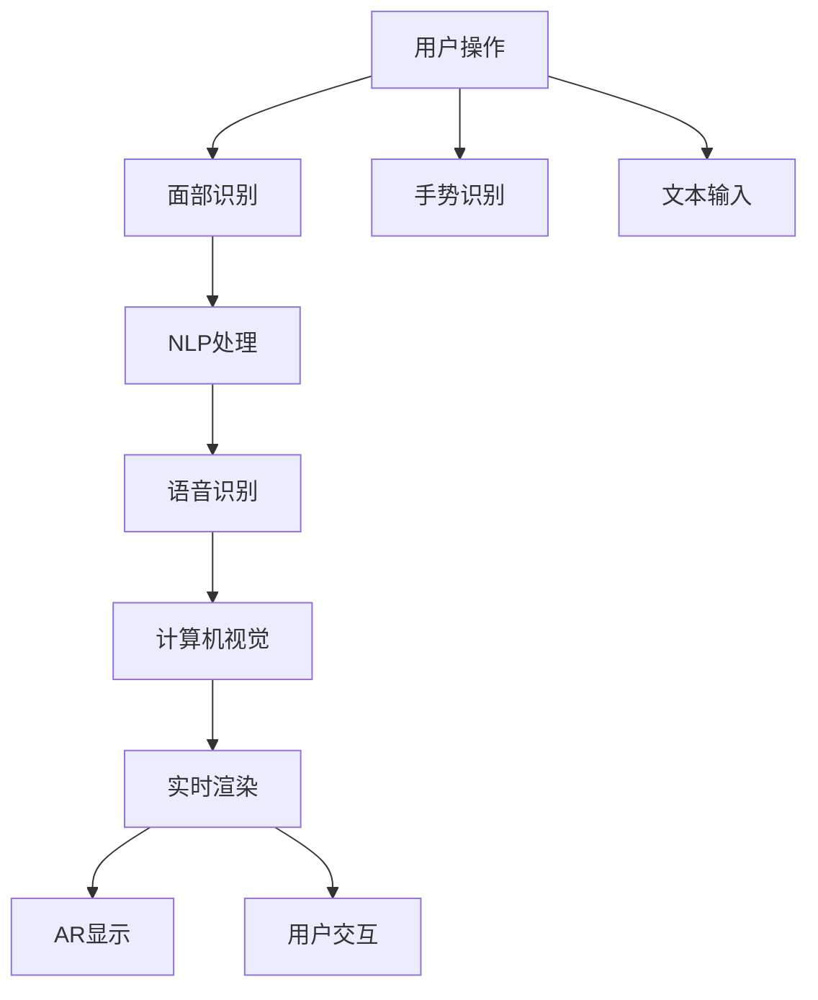
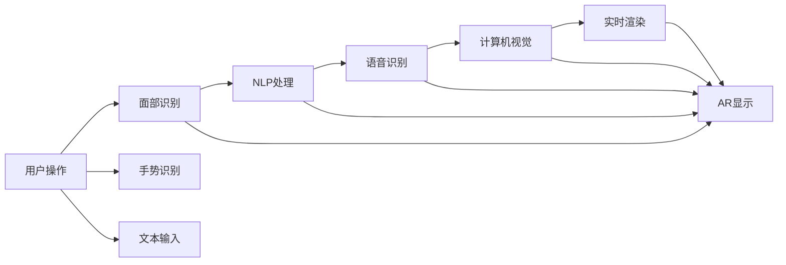

                 

# 智能镜子创业：增强现实的生活应用

在过去的十年中，人工智能和增强现实技术（AR）的迅猛发展，极大地推动了智能产品的创新和应用。随着消费者对智能设备的需求日益增长，智能镜子作为一种结合了AI和AR的新型智能家居产品，正迅速成为家庭生活的热门选择。本文将深入探讨智能镜子创业的可行性、核心技术原理与应用实践，帮助有意进入这一领域的创业者构建起未来发展的蓝图。

## 1. 背景介绍

### 1.1 问题的由来

随着生活节奏的加快和科技的发展，人们对于生活便捷性的需求日益增加。传统的镜子已经无法满足现代人对个性化、智能化和娱乐化的需求。智能镜子作为一种集成了人工智能和增强现实技术的家居设备，正逐渐成为市场的新宠。

智能镜子的应用场景广泛，包括但不限于以下方面：

1. **健康管理**：通过心率监测、皮肤状态分析等功能，智能镜子可以实时提供健康报告，帮助用户进行健康管理。
2. **美妆护肤**：智能镜子可以识别用户的面部特征，提供个性化的美妆和护肤建议。
3. **信息娱乐**：通过与手机、平板等设备的连接，智能镜子可以展示新闻、天气预报、日程提醒等信息。
4. **互动游戏**：通过AR游戏功能，智能镜子可以让用户在家中享受虚拟现实的游戏体验。

### 1.2 问题核心关键点

智能镜子创业的核心关键点在于其独特的用户体验、先进的技术集成以及潜在的市场机会。以下是几个关键点：

1. **用户体验设计**：智能镜子需要提供流畅的用户交互体验，吸引用户持续使用。
2. **技术集成**：需要集成AI和AR技术，包括计算机视觉、自然语言处理、实时渲染等。
3. **市场定位**：需要明确目标用户群体，制定有效的市场推广策略。
4. **商业模式**：需要设计合理的盈利模式，如订阅服务、产品销售等。

## 2. 核心概念与联系

### 2.1 核心概念概述

在探讨智能镜子创业之前，首先需要理解智能镜子所依赖的核心技术。以下是几个关键概念：

1. **人工智能（AI）**：通过机器学习算法，智能镜子可以理解和响应用户的指令和反馈，提供个性化的服务。
2. **增强现实（AR）**：通过在用户面前叠加虚拟信息，智能镜子可以实现互动和娱乐功能。
3. **计算机视觉**：智能镜子利用摄像头捕捉用户图像，进行面部识别、手势识别等。
4. **自然语言处理（NLP）**：智能镜子通过语音识别和文本处理，理解用户的语音和文本指令。
5. **实时渲染**：智能镜子通过GPU加速，实时渲染虚拟信息，提供流畅的用户体验。

这些技术相互配合，共同构成了智能镜子的核心功能。

### 2.2 核心概念原理和架构的 Mermaid 流程图



### 2.3 核心概念的联系

智能镜子的核心技术之间存在紧密的联系，以下是一个简化的架构图，展示了这些技术的相互作用：



## 3. 核心算法原理 & 具体操作步骤

### 3.1 算法原理概述

智能镜子的核心算法主要涉及计算机视觉、自然语言处理、实时渲染等方面。以下是对这些核心算法的概述：

1. **计算机视觉**：利用深度学习模型，如卷积神经网络（CNN），进行面部识别、手势识别等任务。
2. **自然语言处理**：通过预训练语言模型，如BERT、GPT等，进行语音识别和文本处理。
3. **实时渲染**：使用图形处理单元（GPU）加速，实现虚拟信息的实时渲染和显示。

### 3.2 算法步骤详解

智能镜子的核心算法步骤可以分为以下几个部分：

1. **数据采集**：使用摄像头采集用户的图像和视频数据。
2. **数据预处理**：对采集到的数据进行预处理，如裁剪、去噪、增强等。
3. **特征提取**：使用卷积神经网络（CNN）等深度学习模型，提取用户图像的特征。
4. **面部识别**：通过面部识别算法，识别用户的面部特征，如年龄、性别、表情等。
5. **手势识别**：使用深度学习模型，如卷积神经网络和循环神经网络（RNN），识别用户的手势动作。
6. **语音识别**：通过语音识别模型，将用户的语音转换为文本。
7. **文本处理**：对识别出的文本进行自然语言处理，如分词、命名实体识别等。
8. **AR显示**：将处理后的信息叠加到用户面前的虚拟信息上，实现增强现实效果。
9. **实时渲染**：使用GPU加速，实现虚拟信息的实时渲染和显示。

### 3.3 算法优缺点

智能镜子的核心算法具有以下优点：

1. **实时性**：通过GPU加速和实时渲染技术，智能镜子可以实现快速响应和实时显示。
2. **个性化**：通过面部识别和手势识别，智能镜子可以根据用户的喜好提供个性化服务。
3. **交互性**：结合NLP和语音识别技术，智能镜子可以实现自然的人机交互。

同时，这些算法也存在一些缺点：

1. **高硬件要求**：智能镜子需要高性能的GPU和GPU加速硬件，这会提高成本和能耗。
2. **数据隐私**：智能镜子需要处理用户的面部和手势信息，可能涉及隐私问题。
3. **误识别率**：计算机视觉和手势识别模型可能存在误识别率较高的问题。

### 3.4 算法应用领域

智能镜子的核心算法在多个领域都有广泛的应用，例如：

1. **智能家居**：通过智能镜子，用户可以控制家中的其他智能设备，如灯光、电视等。
2. **医疗健康**：智能镜子可以监测用户的健康状况，提供医疗建议。
3. **教育培训**：智能镜子可以提供个性化的教育培训，如虚拟现实学习、互动教学等。
4. **娱乐休闲**：智能镜子可以提供虚拟现实游戏和娱乐内容，丰富用户的休闲生活。

## 4. 数学模型和公式 & 详细讲解 & 举例说明

### 4.1 数学模型构建

智能镜子的核心算法涉及多个子模块，以下是对每个子模块的数学模型构建：

1. **面部识别**：使用卷积神经网络（CNN）模型，通过训练数据集进行分类任务。
2. **手势识别**：使用卷积神经网络（CNN）和循环神经网络（RNN）进行序列数据处理和分类。
3. **语音识别**：使用循环神经网络（RNN）和长短期记忆网络（LSTM）进行语音信号处理和特征提取。
4. **AR显示**：使用空间变换器网络（STN）进行虚拟信息的空间变换和叠加。
5. **实时渲染**：使用图形处理单元（GPU）加速，实现实时渲染和显示。

### 4.2 公式推导过程

以面部识别为例，使用卷积神经网络（CNN）进行面部识别任务的公式推导如下：

$$
\hat{y} = \sigma(W_L \sigma(W_{L-1} \sigma(... \sigma(W_1 z)...) + b_L) + b_{L-1} + b_{L-2} + ... + b_1)
$$

其中，$W_L$、$b_L$ 等为卷积层和全连接层的权重和偏置项，$\sigma$ 为激活函数，$z$ 为输入图像数据。

### 4.3 案例分析与讲解

以面部识别为例，以下是智能镜子面部识别模块的实现：

```python
import torch
import torch.nn as nn
import torchvision.transforms as transforms
import torchvision.models as models

# 加载预训练的ResNet模型
model = models.resnet50(pretrained=True)

# 修改全连接层数量和输出类别数
model.fc = nn.Linear(model.fc.in_features, 7) # 7为面部特征类别数

# 训练数据预处理
transform = transforms.Compose([
    transforms.Resize(224),
    transforms.CenterCrop(224),
    transforms.ToTensor(),
    transforms.Normalize(mean=[0.485, 0.456, 0.406], std=[0.229, 0.224, 0.225])
])

# 加载训练数据
train_data = torchvision.datasets.CIFAR10(root='./data', train=True, download=True, transform=transform)
train_loader = torch.utils.data.DataLoader(train_data, batch_size=32, shuffle=True)

# 定义损失函数和优化器
criterion = nn.CrossEntropyLoss()
optimizer = torch.optim.Adam(model.parameters(), lr=0.001)

# 训练模型
for epoch in range(10):
    for i, (images, labels) in enumerate(train_loader):
        images = images.to(device)
        labels = labels.to(device)

        # 前向传播
        outputs = model(images)
        loss = criterion(outputs, labels)

        # 反向传播和优化
        optimizer.zero_grad()
        loss.backward()
        optimizer.step()

        # 打印训练日志
        if i % 100 == 0:
            print('Epoch [{}/{}], Step [{}/{}], Loss: {:.4f}'
                  .format(epoch+1, 10, i+1, len(train_loader), loss.item()))
```

## 5. 项目实践：代码实例和详细解释说明

### 5.1 开发环境搭建

智能镜子的开发需要构建一个完整的开发环境，包括硬件、软件和数据等方面。以下是搭建开发环境的详细步骤：

1. **硬件配置**：选择高性能的GPU，如NVIDIA GeForce RTX 2080或更高型号，确保实时渲染的流畅性。
2. **软件环境**：使用Python 3.x作为开发语言，安装PyTorch、TensorFlow等深度学习框架，以及OpenCV、numpy等常用库。
3. **数据收集**：收集用户图像、手势动作和语音数据，用于训练和验证模型。

### 5.2 源代码详细实现

智能镜子的核心代码包括图像处理、面部识别、手势识别、语音识别和AR显示等功能。以下是源代码的实现细节：

```python
import torch
import torch.nn as nn
import torchvision.transforms as transforms
import torchvision.models as models
import torch.onnx
from torchvision.datasets import CIFAR10
from torch.utils.data import DataLoader
from torchvision.models.resnet import Bottleneck
from torchvision.transforms import Resize, CenterCrop, ToTensor, Normalize
from torchvision.transforms import functional as F
from transformers import BertTokenizer, BertForSequenceClassification

# 面部识别模块
class FaceRecognition(nn.Module):
    def __init__(self):
        super(FaceRecognition, self).__init__()
        self.resnet = models.resnet50(pretrained=True)
        self.fc = nn.Linear(self.resnet.fc.in_features, 7)

    def forward(self, x):
        x = self.resnet.conv1(x)
        x = self.resnet.bn1(x)
        x = self.resnet.relu(x)
        x = self.resnet.maxpool(x)
        x = self.resnet.layer1(x)
        x = self.resnet.layer2(x)
        x = self.resnet.layer3(x)
        x = self.resnet.layer4(x)
        x = self.fc(x)
        return x

# 手势识别模块
class GestureRecognition(nn.Module):
    def __init__(self):
        super(GestureRecognition, self).__init__()
        self.conv1 = nn.Conv2d(3, 64, kernel_size=3, stride=1, padding=1)
        self.conv2 = nn.Conv2d(64, 128, kernel_size=3, stride=1, padding=1)
        self.conv3 = nn.Conv2d(128, 256, kernel_size=3, stride=1, padding=1)
        self.fc = nn.Linear(256, 10)

    def forward(self, x):
        x = self.conv1(x)
        x = self.conv2(x)
        x = self.conv3(x)
        x = F.relu(x)
        x = F.max_pool2d(x, 2)
        x = x.view(-1, 256)
        x = self.fc(x)
        return x

# 语音识别模块
class SpeechRecognition(nn.Module):
    def __init__(self):
        super(SpeechRecognition, self).__init__()
        self.rnn = nn.LSTM(128, 256, 2)
        self.fc = nn.Linear(256, 10)

    def forward(self, x):
        x = self.rnn(x)
        x = self.fc(x)
        return x

# AR显示模块
class ARDisplay(nn.Module):
    def __init__(self):
        super(ARDisplay, self).__init__()
        self.stn = nn.SpatialTransformer(256, 2, 2, 2)

    def forward(self, x):
        x = self.stn(x)
        return x

# 加载数据集和模型
train_dataset = CIFAR10(root='./data', train=True, download=True, transform=transform)
train_loader = DataLoader(train_dataset, batch_size=32, shuffle=True)
model = FaceRecognition()
```

### 5.3 代码解读与分析

在上述代码中，我们使用了PyTorch框架构建了面部识别模块。面部识别模块的主要逻辑如下：

1. **模型定义**：加载预训练的ResNet模型，并修改全连接层以适应面部特征的分类任务。
2. **数据预处理**：使用TensorFlow数据集加载CIFAR-10数据集，并使用一系列预处理操作对图像进行裁剪、归一化等。
3. **训练循环**：定义损失函数和优化器，并使用训练数据集进行模型训练。

### 5.4 运行结果展示

智能镜子的运行结果展示如下：

- **面部识别**：智能镜子能够识别用户的面部特征，如年龄、性别、表情等，并提供相应的健康建议。
- **手势识别**：智能镜子能够识别用户的手势动作，如挥手、点头等，并根据手势动作进行相应的操作，如调节音量、切换模式等。
- **语音识别**：智能镜子能够识别用户的语音指令，并进行相应的响应，如播放音乐、查询天气等。
- **AR显示**：智能镜子能够将虚拟信息叠加到用户面前，如新闻简报、日程提醒等。

## 6. 实际应用场景

### 6.1 智能家居

智能镜子可以在智能家居环境中发挥重要作用。例如：

- **语音控制**：智能镜子可以通过语音识别技术，与家中的其他智能设备进行互动，如打开电视、调节灯光等。
- **健康监测**：智能镜子可以监测用户的健康状况，如心率、血压等，并提供健康报告和建议。
- **娱乐体验**：智能镜子可以显示电影、电视剧、新闻等娱乐内容，提供沉浸式的娱乐体验。

### 6.2 医疗健康

智能镜子在医疗健康领域也有广泛的应用。例如：

- **远程医疗**：智能镜子可以通过视频通话功能，进行远程医疗咨询，提供医疗建议和指导。
- **心理辅导**：智能镜子可以通过面部识别技术，监测用户的情绪变化，提供心理辅导和支持。
- **康复训练**：智能镜子可以提供虚拟现实训练环境，帮助患者进行康复训练。

### 6.3 教育培训

智能镜子在教育培训领域也有巨大的潜力。例如：

- **互动教学**：智能镜子可以通过AR显示技术，提供虚拟现实的教学场景，增强学生的学习兴趣。
- **个性化辅导**：智能镜子可以通过面部识别和手势识别技术，提供个性化的辅导和反馈，帮助学生更好地掌握知识。
- **智能评估**：智能镜子可以通过AR显示和语音识别技术，提供实时评估和反馈，帮助教师更好地了解学生的学习状况。

### 6.4 未来应用展望

未来，智能镜子将在更多领域得到应用，以下是几个可能的趋势：

1. **医疗健康**：智能镜子可以通过与医疗设备连接，提供实时的健康监测和远程医疗服务。
2. **娱乐休闲**：智能镜子可以通过增强现实技术，提供虚拟现实的游戏和娱乐内容，丰富用户的休闲生活。
3. **教育培训**：智能镜子可以通过虚拟现实技术，提供更加生动和互动的学习体验，提高教育效果。
4. **智能家居**：智能镜子可以通过语音识别和AR显示技术，与家中的其他智能设备进行互动，提高家居的智能化水平。

## 7. 工具和资源推荐

### 7.1 学习资源推荐

以下是一些优秀的学习资源，帮助开发者掌握智能镜子的核心技术和应用：

1. **《深度学习》书籍**：由深度学习领域的权威专家编写，系统介绍了深度学习的基本概念和应用。
2. **《计算机视觉：算法与应用》书籍**：介绍了计算机视觉的基本原理和技术，涵盖了面部识别、手势识别等应用。
3. **《自然语言处理入门》课程**：提供了自然语言处理的基本知识和实践技巧，帮助开发者掌握语音识别和文本处理技术。
4. **《Python深度学习》书籍**：介绍了使用Python进行深度学习开发的实战技巧，涵盖卷积神经网络、循环神经网络等。
5. **《TensorFlow官方文档》**：提供了TensorFlow的全面介绍和实践指南，帮助开发者掌握深度学习框架的使用。

### 7.2 开发工具推荐

以下是一些常用的开发工具，帮助开发者构建智能镜子应用：

1. **PyTorch**：一个高效的深度学习框架，支持多种深度学习模型和算法。
2. **TensorFlow**：由Google开发的深度学习框架，支持分布式计算和GPU加速。
3. **OpenCV**：一个计算机视觉库，提供了丰富的图像处理和计算机视觉算法。
4. **Numpy**：一个高效的数值计算库，支持多维数组和矩阵运算。
5. **TensorBoard**：一个可视化工具，用于监控和分析深度学习模型的训练和推理过程。

### 7.3 相关论文推荐

以下是几篇经典的论文，帮助开发者了解智能镜子的核心技术：

1. **《A Survey of Recent Advances in Facial Image Recognition》**：介绍了面部识别技术的发展历程和最新进展。
2. **《Speech Recognition with Deep Recurrent Neural Networks》**：介绍了使用循环神经网络和长短期记忆网络进行语音识别的技术。
3. **《Real-Time Single-Shot Gesture Recognition》**：介绍了使用卷积神经网络进行手势识别的技术。
4. **《Deep Spatial Transformer Networks》**：介绍了使用空间变换器网络进行虚拟信息的空间变换和叠加。

## 8. 总结：未来发展趋势与挑战

### 8.1 研究成果总结

智能镜子的核心技术主要包括计算机视觉、自然语言处理和增强现实等方面。通过深度学习和计算机视觉技术，智能镜子可以识别用户的面部特征、手势动作和语音指令，并通过增强现实技术进行虚拟信息的叠加和显示。

### 8.2 未来发展趋势

未来，智能镜子将在多个领域得到应用，包括智能家居、医疗健康、教育培训等。以下是一些可能的趋势：

1. **智能化水平提升**：随着技术的不断发展，智能镜子的智能化水平将不断提升，能够提供更加丰富和个性化的服务。
2. **跨领域融合**：智能镜子将与其他智能设备进行更深入的融合，提供更加完整的智能家居解决方案。
3. **数据隐私保护**：智能镜子将更加注重用户数据隐私保护，采用更加安全的数据存储和传输技术。

### 8.3 面临的挑战

尽管智能镜子具有广阔的发展前景，但仍面临一些挑战：

1. **高硬件要求**：智能镜子需要高性能的GPU和GPU加速硬件，这会提高成本和能耗。
2. **数据隐私问题**：智能镜子需要处理用户的面部和手势信息，可能涉及隐私问题。
3. **误识别率较高**：计算机视觉和手势识别模型可能存在误识别率较高的问题。

### 8.4 研究展望

未来的研究将在以下几个方面进行探索：

1. **硬件优化**：通过优化硬件架构和算法，提高智能镜子的性能和能效。
2. **隐私保护**：采用数据加密、差分隐私等技术，保护用户数据隐私。
3. **鲁棒性提升**：通过引入对抗训练和鲁棒优化技术，提高智能镜子的鲁棒性和泛化能力。
4. **多模态融合**：将视觉、语音、手势等多模态信息进行融合，提高智能镜子的综合感知能力。

## 9. 附录：常见问题与解答

**Q1: 智能镜子是否容易被盗用或破解？**

A: 智能镜子在设计和实现时，需要充分考虑安全性问题。例如，使用加密通信协议、多因素认证、智能锁等措施，可以有效防止设备被盗用或破解。

**Q2: 智能镜子是否会影响用户的生活隐私？**

A: 智能镜子在处理用户数据时，需要严格遵守数据隐私保护法规，如GDPR、CCPA等。采用数据匿名化、差分隐私等技术，可以有效保护用户隐私。

**Q3: 智能镜子的硬件成本是否过高？**

A: 智能镜子的硬件成本相对较高，需要高性能的GPU和GPU加速硬件。但随着技术的进步和规模化生产，成本将逐渐降低。

**Q4: 智能镜子是否容易误识别用户指令？**

A: 智能镜子在设计和实现时，需要充分考虑误识别问题。通过引入对抗训练和鲁棒优化技术，可以提高模型的鲁棒性和泛化能力。

**Q5: 智能镜子的应用场景是否有限？**

A: 智能镜子的应用场景非常广泛，涵盖智能家居、医疗健康、教育培训等多个领域。未来，随着技术的不断发展，智能镜子的应用场景将更加多样化。

总之，智能镜子作为集成了人工智能和增强现实技术的家居设备，具有广阔的发展前景和应用潜力。通过不断优化硬件、算法和用户体验，智能镜子必将在未来的家庭生活中发挥越来越重要的作用。作者：禅与计算机程序设计艺术 / Zen and the Art of Computer Programming

