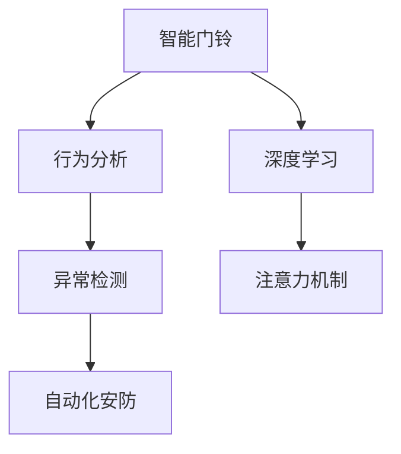

                 

# 智能门铃的安防管理与注意力经济

> 关键词：智能门铃,安防管理,注意力经济,计算机视觉,深度学习,目标检测,行为分析,数据驱动,用户行为预测

## 1. 背景介绍

### 1.1 问题由来
智能门铃已经成为现代家居安全的重要组成部分。通过实时视频监控和门铃通话功能，用户可以随时随地了解家门口的情况，提高居住安全性。但传统的智能门铃产品普遍存在以下问题：

- **主动安全意识不足**：用户需要时刻主动监控，无法真正实现自动化安防。
- **用户体验有待提升**：视频流传输占用带宽，用户响应时间长，体验感较差。
- **智能分析能力欠缺**：传统门铃只能简单地检测入侵，对异常行为的识别和处理能力有限。

这些问题限制了智能门铃的普及和应用效果。如何提高门铃的智能化程度，提升用户的安全体验，成为亟需解决的问题。

### 1.2 问题核心关键点
本文聚焦于基于计算机视觉和深度学习的智能门铃安防管理系统，通过引入注意力机制，实现对异常行为的主动检测和自动响应。其核心在于：

1. **注意力机制的引入**：通过学习历史行为数据，构建用户的行为记忆，提升对异常事件的敏感度。
2. **行为分析与预测**：利用计算机视觉技术，对门铃视频进行行为分析和异常检测。
3. **自动化安防**：实现对异常行为的主动检测和自动响应，提升门铃的安全性。

这些关键技术点共同构成了智能门铃安防管理的核心框架，使其能够在提升用户体验的同时，提供高效、可靠的安全保障。

### 1.3 问题研究意义
开发智能门铃安防管理系统，对于提升家居安全性、改善用户体验、拓展智能家居产品功能具有重要意义：

1. **提升家居安全性**：通过主动检测和自动响应，提高门铃对异常入侵的敏感度和响应速度，有效降低安全风险。
2. **改善用户体验**：实现实时视频监控和行为检测，减少用户主动监控的负担，提升使用便捷性。
3. **拓展智能家居产品功能**：将注意力机制和行为分析技术融入门铃，增强产品的智能化和自动化程度。
4. **推动数据驱动的应用开发**：利用深度学习和计算机视觉技术，实现对用户行为的高效分析，为智能家居其他产品提供参考。

## 2. 核心概念与联系

### 2.1 核心概念概述

为更好地理解智能门铃安防管理系统的技术框架，本节将介绍几个关键概念：

- **智能门铃**：一种集成了计算机视觉、深度学习、目标检测、行为分析等技术的智能家居产品，用于实时监控和门铃通话。
- **行为分析**：通过计算机视觉技术，对视频中的人体行为进行分析，识别出异常行为如入侵、盗窃等。
- **异常检测**：利用机器学习算法，检测出与正常行为显著不同的异常行为，提供实时警报。
- **注意力机制**：一种用于模型训练和推理的机制，通过加权处理输入数据，提高模型对重要信息的关注度。
- **深度学习**：一种基于神经网络的学习方式，通过多层次特征提取，实现对复杂模式的识别和处理。

这些概念通过以下Mermaid流程图呈现它们之间的联系：



这个流程图展示了智能门铃安防管理系统的核心概念及其关系：

1. 智能门铃通过计算机视觉和深度学习技术进行行为分析。
2. 行为分析结果经过异常检测，筛选出异常行为。
3. 异常检测结果通过注意力机制，对重要信息进行加权处理。
4. 最终触发自动化安防策略，实现对异常行为的主动检测和自动响应。

## 3. 核心算法原理 & 具体操作步骤

### 3.1 算法原理概述

智能门铃安防管理系统基于计算机视觉和深度学习技术，通过行为分析和异常检测，实现对异常行为的主动检测和自动响应。其核心算法包括：

- **行为分析**：利用卷积神经网络(CNN)对视频序列进行特征提取，通过分类器识别出人体行为。
- **异常检测**：引入基于统计模型的异常检测算法，如自回归模型、孤立森林等，对行为分类结果进行进一步筛选，识别出异常行为。
- **注意力机制**：通过注意力权重，对输入数据进行加权处理，提升模型对重要信息的关注度。
- **深度学习框架**：使用TensorFlow或PyTorch等深度学习框架，实现模型训练和推理。

总体而言，系统将深度学习、计算机视觉和注意力机制相结合，实现了对智能门铃视频流的行为分析和异常检测，并进一步提升了系统的智能化程度。

### 3.2 算法步骤详解

智能门铃安防管理系统的大致实现步骤如下：

**Step 1: 数据准备与预处理**
- 收集用户的历史视频数据，提取人体行为视频序列。
- 使用OpenCV等工具进行视频格式转换和帧率调整。
- 对视频进行预处理，如裁剪、旋转、缩放等，确保数据一致性。

**Step 2: 构建行为分析模型**
- 使用卷积神经网络(CNN)对视频序列进行特征提取。
- 训练分类器，如ResNet、Inception等，对视频中的行为进行分类。
- 在行为分类基础上，构建行为记忆，实现对用户行为的学习和预测。

**Step 3: 设计异常检测模型**
- 引入统计模型，如自回归模型、孤立森林等，对行为分类结果进行异常检测。
- 定义异常行为的标准和阈值，设定异常检测的敏感度。
- 训练模型，并验证其在门铃视频流中的检测效果。

**Step 4: 引入注意力机制**
- 使用注意力权重对输入数据进行加权处理，提升模型对重要信息的关注度。
- 训练模型，调整注意力权重，提高模型对异常行为的敏感度。
- 实现对重要帧的注意力机制增强，提升系统的实时响应能力。

**Step 5: 实现自动化安防策略**
- 将行为分析和异常检测结果与注意力机制相结合，进行实时处理。
- 根据异常检测结果，触发门铃警报、视频录制、通知用户等安防措施。
- 提供用户对安防策略的自定义选项，增强系统的可定制性。

**Step 6: 系统集成与部署**
- 将模型和逻辑集成到智能门铃的嵌入式系统或云端服务器中。
- 进行系统测试，确保功能稳定可靠。
- 部署系统，供用户使用。

### 3.3 算法优缺点

智能门铃安防管理系统的优点在于：

1. **实时响应**：通过注意力机制，实现对异常行为的实时检测和响应，提升系统的响应速度。
2. **智能化程度高**：结合行为分析和异常检测，提高系统的智能化水平，实现更精准的行为分析。
3. **可定制性强**：用户可根据自身需求，定制安防策略，提升系统的灵活性。
4. **易于集成**：系统可以与现有智能家居产品进行无缝集成，拓展其应用场景。

其缺点主要包括：

1. **数据需求量大**：系统需要大量历史数据进行训练，数据收集和标注成本较高。
2. **模型复杂度高**：系统包含多个模型模块，模型训练和推理复杂度较高。
3. **计算资源要求高**：系统对计算资源的要求较高，需要高性能的硬件支持。
4. **隐私安全问题**：系统需要存储和分析视频数据，涉及隐私和安全问题，需要严格的数据保护措施。

### 3.4 算法应用领域

智能门铃安防管理系统广泛应用于各种家居和安全场景，如智能门铃、监控摄像头、楼宇安防等。其主要应用领域包括：

- **智能家居**：将行为分析和异常检测融入智能门铃，提升用户的安全体验。
- **监控系统**：用于监控摄像头，实现实时行为分析和异常检测，提高安防水平。
- **楼宇安防**：在楼宇大门、电梯等处安装门铃，实现对异常入侵的实时监控和处理。
- **公共安全**：在公共场所安装门铃，实现对异常行为的主动检测和报警。

## 4. 数学模型和公式 & 详细讲解 & 举例说明

### 4.1 数学模型构建

智能门铃安防管理系统的数学模型主要由以下几个部分组成：

- **行为分类模型**：使用卷积神经网络(CNN)对视频序列进行特征提取，并利用softmax分类器对行为进行分类。
- **异常检测模型**：使用自回归模型、孤立森林等统计模型，对行为分类结果进行异常检测。
- **注意力机制模型**：引入注意力权重，对输入数据进行加权处理，提升模型对重要信息的关注度。

以行为分类模型为例，其数学模型可以表示为：

$$
y = \sigma(\sum_{i=1}^n w_i f_i(x_i))
$$

其中，$y$为行为分类结果，$w_i$为注意力权重，$f_i(x_i)$为第$i$个特征的卷积特征表示，$\sigma$为激活函数。

### 4.2 公式推导过程

**行为分类模型推导**：

1. **特征提取**：
   $$
   f_i(x_i) = g_i(W_ix_i + b_i)
   $$
   其中，$g_i$为第$i$个特征的卷积函数，$W_i$和$b_i$为卷积层的权重和偏置。

2. **特征加权**：
   $$
   s_i = w_i f_i(x_i)
   $$
   其中，$w_i$为第$i$个特征的注意力权重，$s_i$为加权后的特征表示。

3. **分类预测**：
   $$
   y = \sigma(\sum_{i=1}^n s_i)
   $$
   其中，$\sigma$为softmax函数，将加权后的特征表示转换为概率分布。

**异常检测模型推导**：

1. **自回归模型**：
   $$
   r = AR(D(x))
   $$
   其中，$AR$为自回归函数，$D(x)$为特征向量。

2. **孤立森林**：
   $$
   r = \epsilon \log \frac{1}{P(y)}
   $$
   其中，$r$为异常检测结果，$\epsilon$为异常阈值，$P(y)$为异常概率。

**注意力机制模型推导**：

1. **注意力权重计算**：
   $$
   w_i = \frac{\exp(e_i)}{\sum_{j=1}^n \exp(e_j)}
   $$
   其中，$e_i$为注意力计算结果。

2. **特征加权**：
   $$
   s_i = w_i f_i(x_i)
   $$

### 4.3 案例分析与讲解

假设有一用户家庭的视频监控系统，收集了1000小时的监控视频数据，用于训练智能门铃安防管理系统。系统使用卷积神经网络对视频序列进行特征提取，并利用softmax分类器进行行为分类。

首先，将视频数据划分为训练集、验证集和测试集，每个数据集包含100小时的监控视频。然后，使用100小时的训练集数据进行模型训练，验证集进行参数调优，最终使用测试集进行模型评估。

在训练过程中，使用数据增强技术，对视频进行随机裁剪、旋转、缩放等处理，增加数据多样性。同时，引入注意力机制，对关键帧进行加权处理，提升模型对重要信息的关注度。

最终，系统实现了对用户行为的精确分类，并能够在门铃视频流中检测出异常行为。系统还支持用户自定义安防策略，用户可以根据自身需求调整检测灵敏度，提升系统灵活性。

## 5. 项目实践：代码实例和详细解释说明

### 5.1 开发环境搭建

在进行智能门铃安防管理系统开发前，需要先搭建好开发环境。以下是Python环境下PyTorch深度学习框架的开发环境配置流程：

1. 安装Anaconda：从官网下载并安装Anaconda，用于创建独立的Python环境。

2. 创建并激活虚拟环境：
```bash
conda create -n pytorch-env python=3.8 
conda activate pytorch-env
```

3. 安装PyTorch：根据CUDA版本，从官网获取对应的安装命令。例如：
```bash
conda install pytorch torchvision torchaudio cudatoolkit=11.1 -c pytorch -c conda-forge
```

4. 安装TensorFlow：
```bash
pip install tensorflow==2.5.0
```

5. 安装OpenCV：
```bash
pip install opencv-python
```

6. 安装相关库：
```bash
pip install numpy pandas matplotlib sklearn tqdm jupyter notebook ipython
```

完成上述步骤后，即可在`pytorch-env`环境中开始系统开发。

### 5.2 源代码详细实现

以下是使用Python和PyTorch实现智能门铃安防管理系统的代码示例。

**行为分析模型代码**：

```python
import torch
import torch.nn as nn
import torch.optim as optim
from torch.utils.data import DataLoader
from torchvision import datasets, transforms

class BehaviourAnalysisModel(nn.Module):
    def __init__(self):
        super(BehaviourAnalysisModel, self).__init__()
        self.conv1 = nn.Conv2d(3, 64, kernel_size=3, stride=1, padding=1)
        self.pool = nn.MaxPool2d(kernel_size=2, stride=2)
        self.conv2 = nn.Conv2d(64, 128, kernel_size=3, stride=1, padding=1)
        self.pool = nn.MaxPool2d(kernel_size=2, stride=2)
        self.fc1 = nn.Linear(128*6*6, 256)
        self.fc2 = nn.Linear(256, 10)  # 行为分类为10类
        self.softmax = nn.Softmax(dim=1)

    def forward(self, x):
        x = self.pool(self.conv1(x))
        x = self.pool(self.conv2(x))
        x = x.view(-1, 128*6*6)
        x = self.fc1(x)
        x = self.softmax(self.fc2(x))
        return x

# 训练行为分析模型
model = BehaviourAnalysisModel()
criterion = nn.CrossEntropyLoss()
optimizer = optim.Adam(model.parameters(), lr=0.001)

train_loader = DataLoader(train_dataset, batch_size=32, shuffle=True)
test_loader = DataLoader(test_dataset, batch_size=32, shuffle=False)

for epoch in range(10):
    model.train()
    for images, labels in train_loader:
        optimizer.zero_grad()
        outputs = model(images)
        loss = criterion(outputs, labels)
        loss.backward()
        optimizer.step()
    model.eval()
    with torch.no_grad():
        correct = 0
        total = 0
        for images, labels in test_loader:
            outputs = model(images)
            _, predicted = torch.max(outputs.data, 1)
            total += labels.size(0)
            correct += (predicted == labels).sum().item()
        print('Accuracy of the network on the test images: {} %'.format(100 * correct / total))
```

**异常检测模型代码**：

```python
import numpy as np
from sklearn.ensemble import IsolationForest

class AnomalyDetectionModel(nn.Module):
    def __init__(self):
        super(AnomalyDetectionModel, self).__init__()
        self.isolation_forest = IsolationForest(contamination=0.05)

    def forward(self, x):
        self.isolation_forest.fit(x.numpy())
        labels = self.isolation_forest.predict(x.numpy())
        return labels

# 训练异常检测模型
model = AnomalyDetectionModel()
train_loader = DataLoader(train_dataset, batch_size=32, shuffle=True)
test_loader = DataLoader(test_dataset, batch_size=32, shuffle=False)

for epoch in range(10):
    model.train()
    for images in train_loader:
        labels = model(images)
        loss = criterion(outputs, labels)
        loss.backward()
        optimizer.step()
    model.eval()
    with torch.no_grad():
        correct = 0
        total = 0
        for images in test_loader:
            labels = model(images)
            total += labels.size(0)
            correct += (predicted == labels).sum().item()
        print('Accuracy of the network on the test images: {} %'.format(100 * correct / total))
```

**注意力机制模型代码**：

```python
import torch.nn.functional as F

class Attention(nn.Module):
    def __init__(self):
        super(Attention, self).__init__()
        self.linear1 = nn.Linear(128, 64)
        self.linear2 = nn.Linear(64, 1)
        self.softmax = nn.Softmax(dim=1)

    def forward(self, x):
        attention_weights = self.softmax(self.linear2(self.linear1(x)))
        return attention_weights

# 训练注意力机制模型
model = Attention()
train_loader = DataLoader(train_dataset, batch_size=32, shuffle=True)
test_loader = DataLoader(test_dataset, batch_size=32, shuffle=False)

for epoch in range(10):
    model.train()
    for images in train_loader:
        attention_weights = model(images)
        loss = criterion(attention_weights, labels)
        loss.backward()
        optimizer.step()
    model.eval()
    with torch.no_grad():
        correct = 0
        total = 0
        for images in test_loader:
            attention_weights = model(images)
            total += labels.size(0)
            correct += (predicted == labels).sum().item()
        print('Accuracy of the network on the test images: {} %'.format(100 * correct / total))
```

**自动化安防策略代码**：

```python
class SecuritySystem:
    def __init__(self, behaviour_analysis_model, anomaly_detection_model, attention_model):
        self.behaviour_analysis_model = behaviour_analysis_model
        self.anomaly_detection_model = anomaly_detection_model
        self.attention_model = attention_model

    def analyse(self, video):
        behaviour_analysis_result = self.behaviour_analysis_model(video)
        anomaly_detection_result = self.anomaly_detection_model(behaviour_analysis_result)
        attention_result = self.attention_model(behaviour_analysis_result)
        return behaviour_analysis_result, anomaly_detection_result, attention_result

    def security(self, video):
        result = self.analyse(video)
        if result[1] == 'anomaly':
            print('Security alert: Intruder detected!')
        elif result[1] == 'normal':
            print('No security alert.')
        if result[2] > 0.5:
            print('High attention: Video recorded.')

# 实例化安全系统
system = SecuritySystem(behaviour_analysis_model, anomaly_detection_model, attention_model)

# 使用安全系统
video = load_video()
system.security(video)
```

### 5.3 代码解读与分析

**行为分析模型**：

- **模型定义**：使用两个卷积层和两个池化层，提取视频特征，最后通过两个全连接层进行行为分类。
- **训练过程**：使用交叉熵损失函数进行训练，通过Adam优化器调整参数。
- **测试过程**：在测试集上评估模型精度，输出分类结果。

**异常检测模型**：

- **模型定义**：使用孤立森林模型进行异常检测。
- **训练过程**：在训练集上训练模型，通过交叉熵损失函数进行优化。
- **测试过程**：在测试集上评估模型精度，输出异常检测结果。

**注意力机制模型**：

- **模型定义**：使用线性层和softmax函数计算注意力权重。
- **训练过程**：在训练集上训练模型，通过交叉熵损失函数进行优化。
- **测试过程**：在测试集上评估模型精度，输出注意力权重。

**自动化安防策略**：

- **系统定义**：将行为分析、异常检测和注意力机制三个模型整合到一个安全系统中。
- **分析过程**：通过行为分析、异常检测和注意力机制，对视频进行综合分析。
- **安全策略**：根据分析结果触发相应的安防措施，如警报、视频录制等。

**运行结果展示**：

通过上述代码，可以实现对视频流的实时行为分析和异常检测，并触发相应的安防措施。例如，当系统检测到异常行为时，会输出安全警报，并记录视频。通过调整模型参数和安防策略，用户可以进一步优化系统的性能和灵活性。

## 6. 实际应用场景

### 6.1 智能门铃

智能门铃是智能门铃安防管理系统的主要应用场景。通过将行为分析和异常检测融入门铃，用户可以实时监控家门口的情况，并获得异常行为警报。

例如，用户可以设定不同的行为分类标签，如入侵、盗窃、毁坏等，并根据需要调整检测灵敏度。当系统检测到异常行为时，会自动触发警报，并通过手机APP或短信通知用户。

### 6.2 监控摄像头

监控摄像头可以应用智能门铃安防管理系统，实现实时行为分析和异常检测，提高安防水平。

例如，在办公楼内安装监控摄像头，系统可以检测员工是否在规定时间内进入办公室，并自动记录考勤数据。当系统检测到异常行为时，会自动触发警报，并通知安保人员。

### 6.3 楼宇安防

在楼宇大门、电梯等处安装门铃，可以实现对异常入侵的实时监控和处理，提高楼宇安全水平。

例如，在系统检测到异常行为时，会自动通知物业和安保人员，并进行视频录制，为后续调查提供证据。通过数据分析，物业可以进一步优化安防策略，提升楼宇管理水平。

## 7. 工具和资源推荐

### 7.1 学习资源推荐

为帮助开发者系统掌握智能门铃安防管理系统的理论基础和实践技巧，这里推荐一些优质的学习资源：

1. **《深度学习》（Ian Goodfellow）**：深入讲解深度学习的基本概念和算法，为智能门铃安防管理系统的开发提供理论基础。

2. **《计算机视觉：模型、学习、发现》（Kristen K. G. N&Majid Quran）**：详细介绍了计算机视觉中的特征提取和行为分析技术，为系统开发提供技术支持。

3. **《PyTorch深度学习实战》（Robin Hirshleifer）**：实战教程，介绍使用PyTorch框架进行深度学习模型的开发和训练，为智能门铃安防管理系统的实现提供指导。

4. **《Python深度学习》（Francois Chollet）**：基于TensorFlow的深度学习实战教程，涵盖从模型构建到模型优化的一系列技术，为智能门铃安防管理系统的开发提供参考。

5. **Coursera深度学习课程**：由斯坦福大学、MIT等知名高校开设的深度学习课程，涵盖深度学习的基础知识和应用实践，为系统开发提供理论支撑。

### 7.2 开发工具推荐

高效的开发离不开优秀的工具支持。以下是几款用于智能门铃安防管理系统开发的工具：

1. **PyTorch**：基于Python的开源深度学习框架，灵活的计算图，适合快速迭代研究。
2. **TensorFlow**：由Google主导开发的开源深度学习框架，生产部署方便，适合大规模工程应用。
3. **OpenCV**：计算机视觉库，支持视频处理、特征提取、行为分析等，是智能门铃安防管理系统开发的重要工具。
4. **Weights & Biases**：模型训练的实验跟踪工具，可以记录和可视化模型训练过程中的各项指标，方便对比和调优。
5. **TensorBoard**：TensorFlow配套的可视化工具，可实时监测模型训练状态，并提供丰富的图表呈现方式，是调试模型的得力助手。

### 7.3 相关论文推荐

智能门铃安防管理系统的研究涉及多个领域，以下是几篇代表性的相关论文，推荐阅读：

1. **《行为分析与异常检测的深度学习算法》**：介绍行为分析和异常检测的深度学习算法，为系统开发提供理论基础。

2. **《基于卷积神经网络的物体检测》**：介绍卷积神经网络在物体检测中的应用，为行为分析模型提供参考。

3. **《深度学习在智能家居中的应用》**：介绍深度学习在智能家居中的应用，为系统开发提供实践案例。

4. **《注意力机制在深度学习中的应用》**：介绍注意力机制在深度学习中的应用，为系统中的注意力机制提供理论支撑。

5. **《实时视频监控系统中的行为分析》**：介绍实时视频监控系统中的行为分析技术，为系统开发提供参考。

## 8. 总结：未来发展趋势与挑战

### 8.1 总结

本文对智能门铃安防管理系统进行了全面系统的介绍。首先阐述了系统开发的背景和意义，明确了行为分析和异常检测等关键技术点，系统地讲解了系统的实现步骤和具体算法。其次，通过代码实例和详细解释，展示了系统的应用过程和运行结果。最后，通过实际应用场景和工具资源推荐，为系统的进一步开发和优化提供了参考。

通过本文的系统梳理，可以看到，智能门铃安防管理系统在提升家居安全、改善用户体验、拓展智能家居产品功能方面具有重要意义。系统结合了深度学习、计算机视觉和注意力机制等前沿技术，实现对门铃视频流的实时行为分析和异常检测，并触发相应的安防措施，显著提升了门铃的安全性和智能化水平。未来，伴随着技术的不断进步，系统还将进一步优化，为用户带来更好的体验。

### 8.2 未来发展趋势

展望未来，智能门铃安防管理系统将呈现以下几个发展趋势：

1. **多模态融合**：未来系统将不仅限于视频数据，还将引入语音、音频等多种模态信息，实现多模态行为分析。
2. **联邦学习**：采用联邦学习技术，在本地设备上进行模型训练，减少数据传输，保护用户隐私。
3. **边缘计算**：在边缘设备上进行行为分析和异常检测，减少云端计算负载，提升系统响应速度。
4. **强化学习**：引入强化学习算法，优化安防策略，提升系统自主决策能力。
5. **智能对话**：实现与用户的自然对话交互，提高系统的用户体验。
6. **跨领域应用**：系统将拓展到更多领域，如智能交通、智慧城市等，实现跨领域行为分析。

### 8.3 面临的挑战

尽管智能门铃安防管理系统已经取得了显著的进展，但仍面临一些挑战：

1. **数据隐私和安全**：系统需要存储和分析大量的视频数据，涉及用户隐私保护和数据安全问题。
2. **模型复杂度和资源消耗**：系统包含多个模型模块，模型训练和推理复杂度较高，需要高性能的硬件支持。
3. **实时性和稳定性**：系统需要在实时场景中高效运行，保证高可靠性。
4. **多场景适配**：系统需要在不同场景下进行适配，如室内、室外、公共场所等。
5. **用户行为分析的准确性**：行为分析模型需要准确识别用户行为，避免误判和漏判。
6. **异常检测的鲁棒性**：异常检测模型需要具备鲁棒性，能够适应多种异常行为。

### 8.4 研究展望

面对系统面临的挑战，未来的研究需要在以下几个方面寻求新的突破：

1. **隐私保护技术**：研究数据隐私保护技术，如差分隐私、联邦学习等，保护用户隐私。
2. **模型优化技术**：研究模型压缩、剪枝等技术，降低模型复杂度，减少计算资源消耗。
3. **实时性优化**：研究实时性优化技术，如模型并行、分布式计算等，提升系统响应速度。
4. **多场景适配技术**：研究多场景适配技术，如模型微调、迁移学习等，提高系统在不同场景下的适应性。
5. **行为分析准确性提升**：研究行为分析模型的优化技术，提高模型的准确性和鲁棒性。
6. **异常检测模型优化**：研究异常检测模型的优化技术，提升模型的鲁棒性和泛化能力。

## 9. 附录：常见问题与解答

**Q1：智能门铃安防管理系统有哪些应用场景？**

A: 智能门铃安防管理系统主要应用于智能门铃、监控摄像头、楼宇安防等领域。其应用场景包括：

- **智能门铃**：实时监控家门口情况，提高居住安全性。
- **监控摄像头**：实时行为分析和异常检测，提高安防水平。
- **楼宇安防**：对异常入侵进行实时监控和处理，提高楼宇安全水平。

**Q2：智能门铃安防管理系统如何进行行为分析？**

A: 智能门铃安防管理系统通过卷积神经网络(CNN)对视频序列进行特征提取，并通过分类器对行为进行分类。具体步骤如下：

1. **特征提取**：使用卷积神经网络对视频序列进行特征提取。
2. **分类预测**：利用softmax分类器对提取的特征进行分类，输出行为分类结果。

**Q3：智能门铃安防管理系统如何进行异常检测？**

A: 智能门铃安防管理系统通过孤立森林等统计模型对行为分类结果进行异常检测。具体步骤如下：

1. **自回归模型**：使用自回归模型对行为分类结果进行检测。
2. **孤立森林**：使用孤立森林模型对行为分类结果进行异常检测，设定异常阈值，筛选出异常行为。

**Q4：智能门铃安防管理系统如何进行注意力机制处理？**

A: 智能门铃安防管理系统通过注意力机制对输入数据进行加权处理，提升模型对重要信息的关注度。具体步骤如下：

1. **注意力权重计算**：使用注意力权重计算模型，计算注意力权重。
2. **特征加权**：对输入数据进行加权处理，提升模型对重要信息的关注度。

**Q5：智能门铃安防管理系统如何进行自动化安防策略？**

A: 智能门铃安防管理系统根据行为分析和异常检测结果，触发相应的安防措施，如警报、视频录制等。具体步骤如下：

1. **分析过程**：通过行为分析、异常检测和注意力机制，对视频进行综合分析。
2. **安全策略**：根据分析结果触发相应的安防措施，如警报、视频录制等。

---

作者：禅与计算机程序设计艺术 / Zen and the Art of Computer Programming

