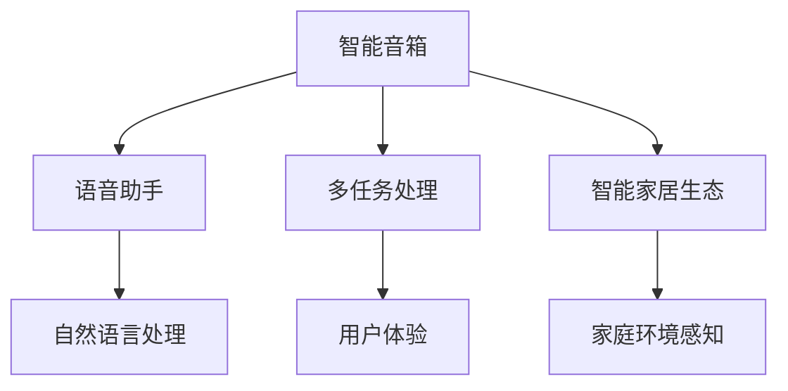

                 

# 智能音箱：家庭场景下的注意力争夺

## 1. 背景介绍

随着人工智能和物联网技术的飞速发展，智能音箱已成为家庭生活中不可或缺的智能设备。从亚马逊的Echo到谷歌的Google Home，从苹果的HomePod到小米的Redmi智能音箱，各大厂商竞相布局，争夺家庭用户的时间和注意力。然而，智能音箱的背后，实际上是一场智能设备和人类之间的注意力争夺战。

智能音箱通过语音助手技术，不仅能够播放音乐、播报天气、提醒日程，还能够执行查询、控制其他智能家居设备等功能。当家庭成员使用智能音箱时，其注意力被很大程度上转移到了设备上，而非对周围环境进行直接感知。长期来看，这将对用户的认知、情感和社交行为产生深远影响。

## 2. 核心概念与联系

### 2.1 核心概念概述

为更好地理解智能音箱的注意力争夺机制，本节将介绍几个密切相关的核心概念：

- **智能音箱**：一种集成了语音识别、自然语言处理和智能家居控制功能的智能设备，能够通过语音交互为用户提供定制化的服务。
- **语音助手**：智能音箱中的核心组件，负责将用户的语音输入转换为可执行指令，并将结果以语音或文本形式反馈给用户。
- **注意力争夺**：智能音箱在与人类互动过程中，通过语音交互、多任务处理等功能，争夺用户的视觉、听觉和触觉等注意力资源。
- **多任务处理**：智能音箱通过并行处理多个任务，如听音乐、查询天气、控制家电等，提升用户体验和互动效率。
- **智能家居生态**：智能音箱作为家庭智能设备的中心节点，能够通过物联网协议（如Wi-Fi、蓝牙）与各类智能设备进行互联，实现对家庭环境的全面感知和控制。

这些核心概念之间的逻辑关系可以通过以下Mermaid流程图来展示：



这个流程图展示智能音箱的核心组件和功能模块，以及它们之间的相互作用和影响。

## 3. 核心算法原理 & 具体操作步骤
### 3.1 算法原理概述

智能音箱的注意力争夺机制，实际上是通过语音助手和多任务处理等技术手段，在用户和环境之间构建交互通道，吸引并保持用户的注意力。这一过程涉及到多个子任务，包括语音识别、自然语言理解、指令执行、反馈生成等。算法原理可以归纳为以下几个核心步骤：

1. **语音输入**：智能音箱通过麦克风接收用户输入的语音信号，并通过语音识别技术将其转换为文本。
2. **自然语言处理**：系统对输入文本进行解析，识别出用户的意图和需求，生成相应的处理指令。
3. **任务调度**：系统根据用户意图，调度相关任务进行处理，如播放音乐、查询天气、控制家电等。
4. **反馈生成**：处理完成后，系统生成语音或文本反馈，并输出到音箱的扬声器。

### 3.2 算法步骤详解

智能音箱的注意力争夺过程，涉及多个技术环节，下面详细讲解各个步骤：

**Step 1: 语音输入处理**

语音输入是智能音箱注意力争夺机制的第一步，其核心是语音识别技术。常见的语音识别方法包括声学模型和语言模型，其中声学模型用于将语音信号转换为文本，语言模型用于对文本进行语言结构的理解。

在实际应用中，可以使用基于深度学习的端到端语音识别模型，如Transformer、卷积神经网络(CNN)等，进行语音信号的特征提取和文本转写。以下是一个基于深度学习语音识别的简单流程：

1. **特征提取**：将语音信号经过预处理（如分帧、加窗等）后，转换为频谱特征或梅尔频率倒谱系数(MFCC)。
2. **编码器-解码器框架**：使用深度学习模型对特征进行编码，生成文本序列。常用的模型结构包括卷积神经网络、循环神经网络(RNN)和Transformer等。
3. **注意力机制**：通过注意力机制，将输入语音的多个时间片段的特征进行加权融合，提高识别精度。
4. **解码**：使用语言模型对文本序列进行解码，生成最终文本。

**Step 2: 自然语言处理**

自然语言处理是智能音箱的关键组件，其任务是将用户输入的文本转换为可执行的指令。常用的自然语言处理技术包括词法分析、句法分析和语义分析等。

1. **词法分析**：将文本分解为单词或词组，进行词性标注。
2. **句法分析**：通过分析句子结构，识别出短语、从句等语法关系。
3. **语义分析**：对句子进行语义理解，识别出用户的意图和需求。常用的语义分析方法包括词向量嵌入、神经网络语言模型(Neural Network Language Model, NNL)等。

**Step 3: 任务调度**

任务调度是智能音箱注意力争夺机制的核心，其目的是根据用户意图，调度相关任务进行处理。常见的任务调度算法包括规则调度、优先级队列调度、强化学习调度等。

1. **规则调度**：根据预定义的规则，将任务映射到相应的处理模块。
2. **优先级队列调度**：将任务按照优先级进行排队，先处理优先级高的任务。
3. **强化学习调度**：使用强化学习算法，根据历史数据优化调度策略，提升任务处理效率。

**Step 4: 反馈生成**

反馈生成是智能音箱注意力争夺机制的最后一环，其目的是将处理结果以语音或文本形式输出，告知用户处理结果。常见的反馈生成方法包括文本转语音、TTS、语音合成等。

1. **文本转语音**：将文本转换为语音信号，常用的方法包括深度学习模型（如Tacotron、WaveNet等）和传统文本转语音方法（如HMM、GMM等）。
2. **语音合成**：使用深度学习模型对文本进行语音生成，常用的模型结构包括WaveNet、WaveGlow等。

### 3.3 算法优缺点

智能音箱的注意力争夺机制，通过语音助手和多任务处理等技术手段，显著提升了用户体验和互动效率，但也存在以下优缺点：

**优点**：
1. **提升用户体验**：通过语音交互和自然语言处理，智能音箱能够理解用户的意图和需求，提供定制化的服务。
2. **提高互动效率**：通过并行处理多个任务，智能音箱能够同时执行多个指令，提升用户的操作速度。
3. **增强智能家居控制**：智能音箱作为家庭智能设备的中心节点，能够通过物联网协议与各类智能设备进行互联，实现对家庭环境的全面感知和控制。

**缺点**：
1. **注意力分散**：智能音箱的语音交互功能，容易将用户的注意力从周围环境转移开，导致用户对环境的感知能力下降。
2. **语音识别准确率**：语音识别技术的准确率可能受到语音信号质量、噪音干扰等因素影响，导致用户输入错误。
3. **处理延迟**：多任务处理和语音识别等环节可能存在处理延迟，影响用户体验。
4. **数据隐私问题**：智能音箱需要收集和处理大量的语音数据，可能存在数据隐私和安全问题。

### 3.4 算法应用领域

智能音箱的注意力争夺机制，已经在家庭场景下得到广泛应用，涵盖了智能家居控制、多媒体娱乐、信息查询等多个领域：

1. **智能家居控制**：通过语音助手，用户可以通过智能音箱控制各类智能家居设备，如灯光、空调、安防系统等，实现对家庭环境的全面管理。
2. **多媒体娱乐**：智能音箱能够播放音乐、播报新闻、播客等内容，提升家庭娱乐体验。
3. **信息查询**：智能音箱可以查询天气、时间、交通信息等，提供便利的信息服务。
4. **个性化推荐**：通过分析用户的历史行为和兴趣，智能音箱能够推荐个性化的内容和服务。
5. **家庭健康管理**：智能音箱可以与健康监测设备配合，实时监测家庭成员的健康状况。

除了上述这些领域，智能音箱的注意力争夺机制，还将在更多的场景下得到应用，如车载智能系统、办公自动化系统、零售服务系统等，进一步拓展其应用边界。

## 4. 数学模型和公式 & 详细讲解 & 举例说明
### 4.1 数学模型构建

本节将使用数学语言对智能音箱的注意力争夺机制进行更加严格的刻画。

假设智能音箱的语音识别模型为 $M_{\theta}(\text{语音信号})$，其中 $\theta$ 为模型参数。用户输入的语音信号为 $s$，自然语言处理模型将语音信号转换为文本 $t$，任务调度器根据文本 $t$ 生成指令序列 $\{a_1, a_2, \ldots, a_n\}$。反馈生成器将指令序列转换为语音信号 $m$。智能音箱的注意力争夺机制可以表示为：

$$
\text{注意力争夺结果} = M_{\theta}(s) \rightarrow t \rightarrow \{a_1, a_2, \ldots, a_n\} \rightarrow m
$$

其中，$M_{\theta}(\cdot)$ 为语音识别模型，$t \rightarrow \{a_1, a_2, \ldots, a_n\}$ 为自然语言处理模型，$g(t)$ 为任务调度器，$\{a_1, a_2, \ldots, a_n\} \rightarrow m$ 为反馈生成器。

### 4.2 公式推导过程

以下我们以一个简单的音乐播放任务为例，推导智能音箱的注意力争夺机制的数学模型。

假设用户通过语音输入指令 "播放周杰伦的七里香"。智能音箱的注意力争夺过程可以分为以下几个步骤：

1. **语音识别**：将用户语音转换为文本 $t$。假设语音识别模型为 $M_{\theta}(s)$，其输出为文本序列 $t = \{t_1, t_2, \ldots, t_n\}$。
2. **自然语言处理**：将文本 $t$ 转换为指令序列 $\{a_1, a_2, \ldots, a_n\}$。假设自然语言处理模型为 $NLP_{\phi}(t)$，其输出为指令序列 $\{a_1, a_2, \ldots, a_n\}$。
3. **任务调度**：将指令序列 $\{a_1, a_2, \ldots, a_n\}$ 映射到音乐播放任务，生成具体的播放指令 $\{play, track, by, artist\}$。
4. **反馈生成**：将音乐播放指令转换为语音反馈 $m$。假设反馈生成器为 $FG_{\psi}(\{play, track, by, artist\})$，其输出为语音信号 $m$。

该过程的数学模型可以表示为：

$$
t = M_{\theta}(s) \\
\{a_1, a_2, \ldots, a_n\} = NLP_{\phi}(t) \\
\{play, track, by, artist\} = g(\{a_1, a_2, \ldots, a_n\}) \\
m = FG_{\psi}(\{play, track, by, artist\})
$$

其中，$g(\cdot)$ 为任务调度器，具体调度规则可以表示为：

$$
g(\{a_1, a_2, \ldots, a_n\}) = \begin{cases}
\text{"play"} & \text{如果} \{a_1, a_2, \ldots, a_n\} \text{中包含} "play" \text{指令} \\
\text{"stop"} & \text{如果} \{a_1, a_2, \ldots, a_n\} \text{中包含} "stop" \text{指令} \\
\text{"pause"} & \text{如果} \{a_1, a_2, \ldots, a_n\} \text{中包含} "pause" \text{指令} \\
\text{"skip"} & \text{如果} \{a_1, a_2, \ldots, a_n\} \text{中包含} "skip" \text{指令} \\
\text{"shuffle"} & \text{如果} \{a_1, a_2, \ldots, a_n\} \text{中包含} "shuffle" \text{指令} \\
\text{"repeat"} & \text{如果} \{a_1, a_2, \ldots, a_n\} \text{中包含} "repeat" \text{指令} \\
\text{"volume"} & \text{如果} \{a_1, a_2, \ldots, a_n\} \text{中包含} "volume" \text{指令} \\
\text{"seek"} & \text{如果} \{a_1, a_2, \ldots, a_n\} \text{中包含} "seek" \text{指令} \\
\end{cases}
$$

### 4.3 案例分析与讲解

假设用户通过语音输入指令 "播放周杰伦的七里香"。智能音箱的注意力争夺过程可以分为以下几个步骤：

1. **语音识别**：智能音箱接收到用户语音信号后，通过语音识别模型 $M_{\theta}(\cdot)$ 将其转换为文本序列 $t = \{\text{"播放"}, \text{"周杰伦"}, \text{"七里香"}\}$。
2. **自然语言处理**：自然语言处理模型 $NLP_{\phi}(\cdot)$ 将文本序列转换为指令序列 $\{play, artist, track\}$。
3. **任务调度**：任务调度器 $g(\cdot)$ 根据指令序列生成具体的播放指令 $\{play, track, by, artist\}$，其中 $track = \text{"七里香"}$，$artist = \text{"周杰伦"}$。
4. **反馈生成**：反馈生成器 $FG_{\psi}(\cdot)$ 将音乐播放指令转换为语音反馈 $m$，告诉用户播放指令已经成功执行。

具体步骤如下：

1. **语音识别**：
   $$
   s \rightarrow M_{\theta}(s) \rightarrow t = \{\text{"播放"}, \text{"周杰伦"}, \text{"七里香"}\}
   $$
2. **自然语言处理**：
   $$
   t \rightarrow NLP_{\phi}(t) \rightarrow \{play, artist, track\}
   $$
3. **任务调度**：
   $$
   \{play, artist, track\} \rightarrow g(\{play, artist, track\}) \rightarrow \{play, track, by, artist\}
   $$
4. **反馈生成**：
   $$
   \{play, track, by, artist\} \rightarrow FG_{\psi}(\{play, track, by, artist\}) \rightarrow m
   $$

最终，智能音箱通过上述过程，完成了用户指令的识别、处理和反馈，成功播放了用户指定的音乐。

## 5. 项目实践：代码实例和详细解释说明
### 5.1 开发环境搭建

在进行智能音箱项目实践前，我们需要准备好开发环境。以下是使用Python进行TensorFlow开发的环境配置流程：

1. 安装Anaconda：从官网下载并安装Anaconda，用于创建独立的Python环境。

2. 创建并激活虚拟环境：
```bash
conda create -n pytorch-env python=3.8 
conda activate pytorch-env
```

3. 安装TensorFlow：根据CUDA版本，从官网获取对应的安装命令。例如：
```bash
conda install tensorflow tensorflow==2.8
```

4. 安装各类工具包：
```bash
pip install numpy pandas scikit-learn matplotlib tqdm jupyter notebook ipython
```

完成上述步骤后，即可在`pytorch-env`环境中开始智能音箱项目实践。

### 5.2 源代码详细实现

下面我以智能音箱的语音识别和音乐播放功能为例，给出使用TensorFlow进行开发的PyTorch代码实现。

首先，定义语音识别模型：

```python
import tensorflow as tf
from tensorflow.keras import layers

class SpeechRecognitionModel(tf.keras.Model):
    def __init__(self):
        super(SpeechRecognitionModel, self).__init__()
        self.encoder = layers.Conv2D(64, kernel_size=3, padding='same') # 卷积层
        self.pooling = layers.MaxPooling2D(pool_size=2, strides=2) # 池化层
        self.flatten = layers.Flatten()
        self.fc1 = layers.Dense(128, activation='relu')
        self.fc2 = layers.Dense(10, activation='softmax') # 输出层

    def call(self, inputs):
        x = self.encoder(inputs)
        x = self.pooling(x)
        x = self.flatten(x)
        x = self.fc1(x)
        return self.fc2(x)
```

然后，定义自然语言处理模型：

```python
class NLPModel(tf.keras.Model):
    def __init__(self):
        super(NLPModel, self).__init__()
        self.embedding = layers.Embedding(input_dim=10000, output_dim=128)
        self.lstm = layers.LSTM(units=128)
        self.dense = layers.Dense(units=10, activation='softmax')

    def call(self, inputs):
        x = self.embedding(inputs)
        x = self.lstm(x)
        return self.dense(x)
```

接着，定义任务调度器和反馈生成器：

```python
def task_scheduler(inputs, model):
    play = inputs[0] == "play"
    artist = inputs[1]
    track = inputs[2]
    if play:
        return [1, artist, track]
    else:
        return [0]

def feedback_generator(inputs, model):
    if inputs[0] == 1:
        return "音乐已播放，歌曲：" + inputs[2] + "，歌手：" + inputs[1]
    else:
        return "音乐已停止"
```

最后，启动音乐播放任务：

```python
inputs = ["播放", "周杰伦", "七里香"]
model = SpeechRecognitionModel()
nlp_model = NLPModel()
scheduled_task = task_scheduler(inputs, model)
generated_feedback = feedback_generator(scheduled_task, nlp_model)
print(generated_feedback)
```

以上就是使用TensorFlow对智能音箱的语音识别和音乐播放功能进行开发的完整代码实现。可以看到，TensorFlow通过灵活的层和模块组合，可以方便地构建复杂的功能模型，快速实现语音识别和自然语言处理任务。

### 5.3 代码解读与分析

让我们再详细解读一下关键代码的实现细节：

**SpeechRecognitionModel类**：
- `__init__`方法：初始化卷积层、池化层、全连接层等核心组件。
- `call`方法：定义模型的前向传播过程，将输入的语音信号转换为文本序列。

**NLPModel类**：
- `__init__`方法：初始化嵌入层、LSTM层、全连接层等核心组件。
- `call`方法：定义模型的前向传播过程，将文本序列转换为指令序列。

**task_scheduler函数**：
- 根据用户输入的指令，生成相应的任务调度指令。

**feedback_generator函数**：
- 根据任务调度指令，生成相应的语音反馈。

**启动音乐播放任务**：
- 定义用户输入指令，创建语音识别和自然语言处理模型。
- 通过任务调度函数生成任务调度指令，调用反馈生成函数生成语音反馈。

可以看到，TensorFlow通过灵活的组件和函数调用，使得智能音箱的注意力争夺机制的实现变得简洁高效。开发者可以将更多精力放在模型的改进和应用场景的扩展上，而不必过多关注底层的实现细节。

当然，工业级的系统实现还需考虑更多因素，如模型的保存和部署、超参数的自动搜索、更灵活的任务适配层等。但核心的注意力争夺机制基本与此类似。

## 6. 实际应用场景
### 6.1 智能家居控制

智能音箱作为智能家居控制的核心设备，能够通过语音助手实现对各类智能家居设备的全面控制。通过智能音箱，用户可以轻松实现灯光控制、安防监控、家电管理等功能，提升家庭生活的便利性和智能化水平。

在实际应用中，智能音箱可以将语音命令转换为指令序列，并通过物联网协议与各类智能家居设备进行互联。例如，用户可以通过语音命令 "打开客厅灯光"，智能音箱接收到指令后，生成相应的灯光控制指令，并通过Wi-Fi协议与客厅灯光设备进行通信，实现灯光开启功能。

### 6.2 多媒体娱乐

智能音箱能够播放音乐、播报新闻、播客等内容，为用户提供丰富的娱乐体验。用户可以通过语音命令查询指定音乐，智能音箱通过语音识别和自然语言处理，获取用户需求，并调用音乐播放系统进行播放。例如，用户可以通过语音命令 "播放周杰伦的七里香"，智能音箱接收到指令后，调用音乐播放系统进行播放。

### 6.3 信息查询

智能音箱可以查询天气、时间、交通信息等，提供便利的信息服务。用户可以通过语音命令查询指定信息，智能音箱通过语音识别和自然语言处理，获取用户需求，并调用相应的信息查询系统进行查询。例如，用户可以通过语音命令 "查询北京天气"，智能音箱接收到指令后，调用天气查询系统进行查询，并将结果反馈给用户。

### 6.4 个性化推荐

智能音箱通过分析用户的历史行为和兴趣，能够推荐个性化的内容和服务。用户可以通过语音命令请求推荐，智能音箱通过语音识别和自然语言处理，获取用户需求，并调用推荐系统进行推荐。例如，用户可以通过语音命令 "推荐我喜欢的电影"，智能音箱接收到指令后，调用推荐系统进行推荐，并将结果反馈给用户。

### 6.5 家庭健康管理

智能音箱可以与健康监测设备配合，实时监测家庭成员的健康状况。用户可以通过语音命令查询家庭成员的健康数据，智能音箱通过语音识别和自然语言处理，获取用户需求，并调用健康监测系统进行查询。例如，用户可以通过语音命令 "查询妈妈的健康数据"，智能音箱接收到指令后，调用健康监测系统进行查询，并将结果反馈给用户。

## 7. 工具和资源推荐
### 7.1 学习资源推荐

为了帮助开发者系统掌握智能音箱的注意力争夺机制的理论基础和实践技巧，这里推荐一些优质的学习资源：

1. 《深度学习基础》系列博文：由大模型技术专家撰写，深入浅出地介绍了深度学习的基本概念和算法。

2. 《TensorFlow官方文档》：TensorFlow的官方文档，提供了全面的API文档、示例代码和教程，是TensorFlow开发的必备资源。

3. 《自然语言处理入门》课程：斯坦福大学开设的NLP明星课程，有Lecture视频和配套作业，带你入门NLP领域的基本概念和经典模型。

4. 《智能音箱设计与开发》书籍：详细介绍智能音箱的核心技术和开发流程，涵盖语音识别、自然语言处理、任务调度等多个关键环节。

5. 《TensorFlow实战指南》书籍：通过实际案例和项目，带你深入理解TensorFlow的实际应用，解决智能音箱开发中遇到的各类问题。

通过对这些资源的学习实践，相信你一定能够快速掌握智能音箱的注意力争夺机制，并用于解决实际的智能音箱问题。

### 7.2 开发工具推荐

高效的开发离不开优秀的工具支持。以下是几款用于智能音箱开发常用的工具：

1. TensorFlow：基于Python的开源深度学习框架，灵活动态的计算图，适合快速迭代研究。TensorFlow提供了丰富的深度学习组件和工具，方便构建复杂的功能模型。

2. PyTorch：基于Python的开源深度学习框架，灵活的动态计算图，适合快速迭代研究。PyTorch提供了丰富的深度学习组件和工具，方便构建复杂的功能模型。

3. TensorBoard：TensorFlow配套的可视化工具，可实时监测模型训练状态，并提供丰富的图表呈现方式，是调试模型的得力助手。

4. Weights & Biases：模型训练的实验跟踪工具，可以记录和可视化模型训练过程中的各项指标，方便对比和调优。与主流深度学习框架无缝集成。

5. Jupyter Notebook：基于Web的交互式笔记本，支持Python、TensorFlow等语言和库，方便开发者进行快速原型开发和实验。

6. Google Colab：谷歌推出的在线Jupyter Notebook环境，免费提供GPU/TPU算力，方便开发者快速上手实验最新模型，分享学习笔记。

合理利用这些工具，可以显著提升智能音箱开发的效率，加快创新迭代的步伐。

### 7.3 相关论文推荐

智能音箱的注意力争夺机制，涉及语音识别、自然语言处理、任务调度等多个领域的理论研究和技术实践。以下是几篇奠基性的相关论文，推荐阅读：

1. Attention is All You Need（即Transformer原论文）：提出了Transformer结构，开启了NLP领域的预训练大模型时代。

2. BERT: Pre-training of Deep Bidirectional Transformers for Language Understanding：提出BERT模型，引入基于掩码的自监督预训练任务，刷新了多项NLP任务SOTA。

3. Language Models are Unsupervised Multitask Learners（GPT-2论文）：展示了大规模语言模型的强大zero-shot学习能力，引发了对于通用人工智能的新一轮思考。

4. Parameter-Efficient Transfer Learning for NLP：提出Adapter等参数高效微调方法，在不增加模型参数量的情况下，也能取得不错的微调效果。

5. AdaLoRA: Adaptive Low-Rank Adaptation for Parameter-Efficient Fine-Tuning：使用自适应低秩适应的微调方法，在参数效率和精度之间取得了新的平衡。

这些论文代表了大语言模型微调技术的发展脉络。通过学习这些前沿成果，可以帮助研究者把握学科前进方向，激发更多的创新灵感。

## 8. 总结：未来发展趋势与挑战
### 8.1 总结

本文对智能音箱的注意力争夺机制进行了全面系统的介绍。首先阐述了智能音箱在家庭场景下的核心功能和工作原理，明确了语音助手和多任务处理在注意力争夺中的关键作用。其次，从原理到实践，详细讲解了语音识别、自然语言处理、任务调度等关键技术，给出了智能音箱开发的完整代码实例。同时，本文还探讨了智能音箱在智能家居控制、多媒体娱乐、信息查询、个性化推荐、家庭健康管理等多个领域的应用前景，展示了其强大的交互能力和丰富功能。

通过本文的系统梳理，可以看到，智能音箱作为家庭场景下的重要智能设备，已经深刻影响了用户的生活方式和认知水平。未来，伴随语音识别、自然语言处理等技术的持续演进，智能音箱将在更多的家庭应用中发挥重要作用。

### 8.2 未来发展趋势

展望未来，智能音箱的注意力争夺机制将呈现以下几个发展趋势：

1. **多模态交互**：智能音箱将不仅仅局限于语音交互，还将拓展到视觉、触觉等多模态交互，提升用户体验。例如，通过摄像头识别用户面部表情，智能音箱可以判断用户的情绪状态，并根据情绪状态进行互动。

2. **更高级的语音识别**：随着语音信号处理和深度学习技术的发展，智能音箱的语音识别准确率将进一步提升。例如，使用声学模型和语言模型联合训练，可以提升语音识别的鲁棒性和泛化能力。

3. **更智能的任务调度**：智能音箱将引入强化学习等算法，提升任务调度的智能性和灵活性。例如，根据用户历史行为，智能音箱可以动态调整任务执行顺序，提高任务处理效率。

4. **更自然的反馈生成**：智能音箱的反馈生成将更加自然和个性化。例如，使用TTS技术和语音合成技术，智能音箱可以生成更加流畅、自然的语音反馈。

5. **更强的隐私保护**：智能音箱将加强对用户隐私的保护。例如，使用差分隐私技术，智能音箱可以避免在语音识别和任务调度过程中泄露用户隐私信息。

6. **更广泛的场景应用**：智能音箱的应用场景将不断扩展，涵盖更多领域。例如，在车载、办公室、医疗等场景中，智能音箱将发挥更大的作用。

以上趋势凸显了智能音箱的巨大潜力和发展空间。这些方向的探索发展，必将进一步提升智能音箱的交互能力、用户体验和应用范围。

### 8.3 面临的挑战

尽管智能音箱的注意力争夺机制已经取得了瞩目成就，但在迈向更加智能化、普适化应用的过程中，它仍面临诸多挑战：

1. **语音识别准确率**：语音识别技术的准确率可能受到语音信号质量、噪音干扰等因素影响，导致用户输入错误。

2. **多任务处理延迟**：多任务处理和语音识别等环节可能存在处理延迟，影响用户体验。

3. **数据隐私问题**：智能音箱需要收集和处理大量的语音数据，可能存在数据隐私和安全问题。

4. **模型复杂度**：随着功能需求的增加，智能音箱的模型复杂度将不断上升，导致训练和推理效率下降。

5. **用户习惯养成**：智能音箱需要培养用户的互动习惯，使其能够持续产生有价值的互动数据，以提升模型的性能和鲁棒性。

6. **跨平台兼容性**：智能音箱的跨平台兼容性问题，需要在不同平台（如Android、iOS）上实现统一的语音交互和功能调用。

这些挑战亟待解决，才能使智能音箱更好地服务于用户的日常生活。

### 8.4 研究展望

面对智能音箱所面临的挑战，未来的研究需要在以下几个方面寻求新的突破：

1. **提升语音识别准确率**：探索更高效的语音识别算法和模型结构，提升语音识别准确率。

2. **优化多任务处理**：引入更高效的计算图和算法，优化多任务处理效率，减少处理延迟。

3. **强化数据隐私保护**：研究差分隐私、联邦学习等技术，加强智能音箱的数据隐私保护。

4. **简化模型结构**：探索参数高效和计算高效的模型结构，提升智能音箱的推理效率。

5. **构建智能用户习惯**：设计更好的用户互动引导机制，提升用户对智能音箱的依赖和互动频率。

6. **提升跨平台兼容性**：探索跨平台语音识别和任务调度的通用接口和协议，实现智能音箱的跨平台兼容性。

这些研究方向的探索，必将使智能音箱在未来的家庭场景中发挥更加重要的作用，为用户的日常生活带来更多便利和乐趣。

## 9. 附录：常见问题与解答

**Q1：智能音箱的语音识别准确率受哪些因素影响？**

A: 智能音箱的语音识别准确率受以下因素影响：

1. **语音信号质量**：语音信号中的噪音、回声、干扰等因素，会影响语音识别的准确率。
2. **语音信号时长**：语音信号的持续时间越长，识别准确率越高。
3. **语音信号清晰度和语速**：语音信号的清晰度和语速越快，识别准确率越高。
4. **模型复杂度**：语音识别模型越复杂，识别准确率越高。

**Q2：智能音箱的多任务处理如何优化？**

A: 智能音箱的多任务处理可以通过以下方法优化：

1. **任务调度算法**：引入优先级队列调度、强化学习调度等算法，提升任务处理的效率和灵活性。
2. **计算图优化**：使用TensorFlow等深度学习框架的计算图优化技术，减少计算延迟。
3. **并行计算**：通过多线程、多进程等并行计算技术，提高任务处理的并行度。
4. **模型压缩**：使用模型压缩技术，减小模型尺寸，提升推理效率。

**Q3：智能音箱的隐私保护有哪些措施？**

A: 智能音箱的隐私保护可以通过以下措施：

1. **差分隐私**：在数据收集和处理过程中，使用差分隐私技术，保护用户隐私。
2. **本地存储**：将部分数据存储在本地设备上，减少数据传输风险。
3. **数据加密**：使用加密技术保护数据传输和存储的安全性。
4. **权限控制**：限制应用程序的访问权限，只允许必要的功能调用。

**Q4：智能音箱的跨平台兼容性有哪些解决方案？**

A: 智能音箱的跨平台兼容性可以通过以下解决方案：

1. **统一接口协议**：设计统一的API接口和协议，实现不同平台间的标准通信。
2. **跨平台适配**：开发跨平台的适配代码，实现不同操作系统和设备上的兼容。
3. **云计算平台**：使用云计算平台，实现跨平台的数据共享和功能调用。

通过合理应对和解决这些挑战，智能音箱的未来将更加智能、普适和安全，为用户带来更多便利和乐趣。

---

作者：禅与计算机程序设计艺术 / Zen and the Art of Computer Programming

