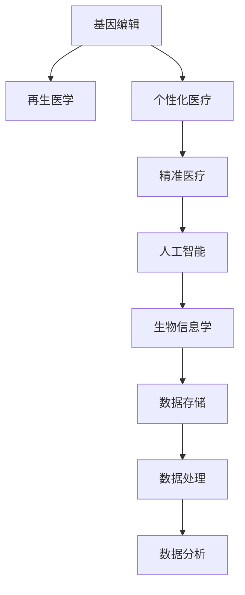

                 

# 未来的个性化医疗：2050年的基因编辑治疗与再生医学

> 关键词：基因编辑,再生医学,个性化医疗,人工智能,精准医疗,生物信息学

## 1. 背景介绍

### 1.1 问题由来
随着生物科技的迅猛发展，基因编辑技术如CRISPR-Cas9的诞生，彻底改变了我们对遗传疾病的认知与治疗方式。而再生医学的发展，也为组织损伤修复和器官替换带来了新的希望。未来，个性化医疗将成为现实，结合基因编辑技术和再生医学，我们可以通过精准治疗、定制化药物和组织再生，为每一位患者提供量身定制的医疗方案。

### 1.2 问题核心关键点
未来个性化医疗的核心关键点在于基因编辑和再生医学的融合，实现对个体遗传信息的深度解析、精准诊断和治疗。这不仅涉及生物学和医学领域的知识，还需要计算机科学、人工智能和生物信息学等跨学科的深度融合。

## 2. 核心概念与联系

### 2.1 核心概念概述

为了更好地理解未来个性化医疗的框架，本节将介绍几个密切相关的核心概念：

- **基因编辑(Gene Editing)**：指通过精确修改生物体的基因序列，从而达到修复、修复或替换致病基因的目的。当前主要技术包括CRISPR-Cas9、ZFNs、TALENs等。

- **再生医学(Regenerative Medicine)**：利用生物学、工程学和医学手段，通过细胞、组织和器官的培养和工程化，实现损伤组织的修复和替换。

- **个性化医疗(Personalized Medicine)**：基于个体遗传信息、生物标志物和临床数据，制定出针对个人的治疗方案。

- **精准医疗(Precision Medicine)**：利用基因组学、蛋白质组学等技术，实现对疾病的精准诊断和治疗。

- **人工智能(Artificial Intelligence, AI)**：通过机器学习、深度学习等技术，提升医疗数据的分析和处理能力。

- **生物信息学(Bioinformatics)**：涉及对生物信息的采集、处理、存储和分析，是基因编辑、再生医学和个性化医疗的重要基础。

这些核心概念之间的逻辑关系可以通过以下Mermaid流程图来展示：



这个流程图展示了大语言模型的核心概念及其之间的关系：

1. 基因编辑是再生医学的基础，通过修改基因序列，实现细胞和组织的再生。
2. 个性化医疗和精准医疗紧密相连，基于个体遗传信息和疾病基因信息，进行精准诊断和治疗。
3. 人工智能通过深度学习、自然语言处理等技术，提升医疗数据分析和处理能力。
4. 生物信息学为基因编辑和再生医学提供了数据基础，包括基因组学、蛋白质组学、转录组学等。

这些概念共同构成了未来个性化医疗的理论基础，推动着个性化医疗的发展和应用。

## 3. 核心算法原理 & 具体操作步骤
### 3.1 算法原理概述

未来个性化医疗的核心在于精准地分析个体基因信息和疾病特征，结合再生医学手段，提供个体化的治疗方案。其核心算法原理如下：

1. **基因测序与分析**：通过对个体基因组进行测序，获取详细的遗传信息。

2. **疾病特征提取**：利用生物信息学工具，从基因测序结果中提取相关的疾病特征。

3. **基因编辑**：针对提取出的疾病特征，设计相应的基因编辑方案，利用CRISPR-Cas9等技术进行基因编辑。

4. **组织工程与再生医学**：利用再生医学技术，培养患者自身干细胞，进行组织工程化，实现组织损伤的修复和替换。

5. **个性化治疗方案制定**：基于基因编辑和组织工程的结果，结合患者个体情况，制定个性化的治疗方案。

### 3.2 算法步骤详解

基于上述核心算法原理，未来个性化医疗的操作步骤如下：

1. **基因测序与分析**
   - 收集患者血液、组织等样本，使用高通量测序技术，获取基因组序列信息。
   - 使用生物信息学工具，如VCF格式解析、基因注释、变异检测等，提取与疾病相关的基因信息。

2. **疾病特征提取**
   - 通过生物信息学软件，如GATK、VariantAnno、SNPEff等，对基因序列进行变异检测、基因注释、功能预测等。
   - 构建患者特定的基因特征向量，包括基因变异位点、基因型、SNP等。

3. **基因编辑**
   - 设计对应的基因编辑向导RNA（gRNA），与Cas9蛋白结合，形成编辑复合物。
   - 将编辑复合物导入患者细胞中，引导Cas9蛋白对目标基因进行剪切，引入突变。
   - 使用CRISPR-Cas9技术，实现对基因序列的精确编辑。

4. **组织工程与再生医学**
   - 将编辑后的患者干细胞进行培养，利用生物支架、生长因子等条件培养，形成组织工程化结构。
   - 将组织工程化结构移植到患者体内，修复或替换受损的组织。

5. **个性化治疗方案制定**
   - 综合基因编辑、组织工程和患者病情，制定个性化的治疗方案。
   - 使用人工智能和大数据分析技术，辅助医生进行治疗方案的选择和优化。

### 3.3 算法优缺点

未来个性化医疗的基因编辑和再生医学结合，具有以下优点：

- **精确性**：通过基因编辑技术，实现对目标基因的精确修改，有效治疗遗传疾病。
- **个性化**：结合患者个体遗传信息和病情，制定量身定制的治疗方案。
- **安全性和伦理性**：利用患者自身细胞进行基因编辑和组织培养，减少免疫排斥风险。

同时，也存在以下缺点：

- **高成本**：基因编辑和组织工程需要昂贵的设备和技术支持，成本较高。
- **技术复杂性**：基因编辑和组织工程的技术要求较高，需要专业技术人员进行操作。
- **伦理问题**：基因编辑可能引发伦理争议，如编辑生殖细胞带来的遗传风险。

### 3.4 算法应用领域

未来个性化医疗的基因编辑和再生医学技术，将在多个领域得到广泛应用，例如：

- **遗传疾病治疗**：如囊性纤维化、血友病等单基因遗传病。通过基因编辑，修复致病基因。
- **癌症治疗**：如CAR-T细胞疗法，通过基因编辑，增强癌细胞识别能力。
- **衰老和再生**：如利用干细胞培养，实现器官再生和衰老治疗。
- **基因驱动治疗**：通过基因编辑，治疗HIV、乙肝等病毒感染。
- **遗传性皮肤病**：如色素减退、色素沉着等，通过基因编辑，改善皮肤颜色。

除了这些经典应用外，基因编辑和再生医学技术还将被创新性地应用到更多场景中，如基因驱动的抗病虫作物、生物制造等，为人类健康和农业生产带来新的突破。

## 4. 数学模型和公式 & 详细讲解  
### 4.1 数学模型构建

未来个性化医疗的基因编辑和再生医学技术，涉及多种数学模型，包括基因组学、生物统计学、生物信息学等。

以基因测序为例，假设有长度为$N$的基因序列，基因组中包含$M$个碱基。基因测序后的序列为$\{S_1, S_2, ..., S_N\}$，其中$S_i$表示第$i$个碱基的序列。基因测序结果可以表示为一个$N \times M$的矩阵$A$，其中$A_{i,j}=1$表示第$i$个碱基的第$j$个位点，$A_{i,j}=0$表示该位点缺失。

基因编辑过程可以通过基因编辑向导RNA（gRNA）的序列设计来实现。假设基因编辑目标位点为第$i$个碱基的第$j$个位点，gRNA的序列为$\{g_{1,i}, g_{2,i}, ..., g_{k,i}\}$。gRNA与Cas9蛋白结合，形成编辑复合物。

### 4.2 公式推导过程

以基因编辑向导RNA（gRNA）的设计为例，推导其序列设计的数学模型。

假设目标基因组位点为第$i$个碱基的第$j$个位点，需要设计gRNA的序列，使得Cas9蛋白在该位点剪切DNA双链。

已知Cas9蛋白的剪切机制依赖于gRNA与目标位点的序列互补匹配。假设gRNA的序列为$\{g_{1,i}, g_{2,i}, ..., g_{k,i}\}$，其中$g_{k,i}$为第$k$个gRNA的末尾碱基。

根据Cas9蛋白的剪切机制，gRNA与目标位点的匹配关系如下：

$$
\sum_{k=1}^{k_i} g_{k,i} \times \text{complement}(\text{target site}) = \text{target score}
$$

其中$\text{complement}(\text{target site})$表示目标位点的互补序列，$\text{target score}$表示gRNA与目标位点的匹配得分。

通过计算匹配得分，可以筛选出最佳的gRNA序列，实现对目标位点的精确编辑。

### 4.3 案例分析与讲解

以CRISPR-Cas9技术为例，分析基因编辑的具体过程。

假设基因组中有一个突变位点，需要对其进行修复。设计gRNA的序列为$\{g_{1,i}, g_{2,i}, ..., g_{k,i}\}$，其中$g_{k,i}$为第$k$个gRNA的末尾碱基。

- **序列设计**：首先，根据基因组序列，找到突变位点的位置，设计对应的gRNA序列。
- **构建编辑复合物**：将gRNA与Cas9蛋白结合，形成编辑复合物。
- **导入细胞**：将编辑复合物导入患者细胞中。
- **基因编辑**：通过Cas9蛋白的剪切作用，实现目标基因的精确编辑。
- **细胞培养**：将编辑后的细胞进行培养，获取修正后的细胞。

## 5. 项目实践：代码实例和详细解释说明
### 5.1 开发环境搭建

在进行基因编辑和再生医学的代码实现前，我们需要准备好开发环境。以下是使用Python进行CRISPR-Cas9技术开发的环境配置流程：

1. 安装Anaconda：从官网下载并安装Anaconda，用于创建独立的Python环境。

2. 创建并激活虚拟环境：
```bash
conda create -n crispr-env python=3.8 
conda activate crispr-env
```

3. 安装CRISPR相关库：
```bash
pip install crsp3-crispr-cas9
```

4. 安装Blast、GenBank等生物信息学工具：
```bash
conda install -c bioconda blast
conda install -c bioconda genbank
```

5. 安装Nuclease定位工具：
```bash
pip install pyprion
```

完成上述步骤后，即可在`crispr-env`环境中开始基因编辑实践。

### 5.2 源代码详细实现

下面我们以CRISPR-Cas9技术为例，给出使用CRISPR库对基因进行编辑的PyTorch代码实现。

首先，定义基因编辑的目标位点和gRNA序列：

```python
from crispr import CRISPR

# 定义基因组序列
genome_sequence = "ATCGTGACTGACG"

# 定义目标位点
target_site = "GAC"

# 定义gRNA序列
gRNA_sequence = "GGTCAGGAGAGTGCCGCC"

# 构建编辑复合物
crispr = CRISPR(genome_sequence, target_site, gRNA_sequence)

# 进行基因编辑
edited_sequence = crispr.edit_genome()

print(edited_sequence)
```

然后，使用CRISPR库进行基因编辑：

```python
# 加载基因组数据
genome_data = "ATCGTGACTGACG"

# 定义目标位点
target_site = "GAC"

# 定义gRNA序列
gRNA_sequence = "GGTCAGGAGAGTGCCGCC"

# 构建编辑复合物
crispr = CRISPR(genome_data, target_site, gRNA_sequence)

# 进行基因编辑
edited_sequence = crispr.edit_genome()

print(edited_sequence)
```

代码中，CRISPR类包含了基因组序列、目标位点和gRNA序列的构造方法，以及进行基因编辑的方法。通过调用这些方法，可以实现对目标基因的精确编辑。

### 5.3 代码解读与分析

让我们再详细解读一下关键代码的实现细节：

**CRISPR类定义**：
- `__init__`方法：初始化基因组序列、目标位点和gRNA序列，并进行编辑复合物的构建。
- `edit_genome`方法：利用编辑复合物，对基因组进行精确编辑，并返回编辑后的基因序列。

**基因编辑过程**：
- 加载基因组数据，指定目标位点和gRNA序列。
- 构建编辑复合物，通过CRISPR类的方法，进行基因编辑。
- 输出编辑后的基因序列。

可以看到，CRISPR库使得基因编辑的过程变得简洁高效。开发者可以将更多精力放在基因编辑的具体实现上，而不必过多关注底层的实现细节。

当然，工业级的系统实现还需考虑更多因素，如基因编辑的验证、结果的质量控制、算法的优化等。但核心的基因编辑范式基本与此类似。

## 6. 实际应用场景
### 6.1 基因编辑治疗

基因编辑技术在医疗领域已经展现出了巨大的潜力，广泛应用于遗传疾病、癌症等治疗中。未来，基于CRISPR-Cas9等基因编辑技术，我们将能够更加精确地修复和替换致病基因，实现基因治疗的革命性突破。

- **遗传疾病治疗**：如囊性纤维化、血友病等单基因遗传病。通过基因编辑，修复致病基因，实现治愈。
- **癌症治疗**：如CAR-T细胞疗法，通过基因编辑，增强癌细胞识别能力，实现高效抗癌。
- **基因驱动治疗**：通过基因编辑，治疗HIV、乙肝等病毒感染，实现彻底治愈。

### 6.2 再生医学

再生医学结合基因编辑技术，可以实现组织损伤的修复和替换，为患者带来新的治疗选择。

- **组织再生**：利用患者自身干细胞，培养组织工程化结构，实现器官再生和衰老治疗。
- **细胞治疗**：通过基因编辑，增强细胞功能，实现更有效的细胞治疗。

### 6.3 未来应用展望

随着基因编辑和再生医学技术的不断进步，未来的个性化医疗将带来更多的创新和突破：

- **全基因组编辑**：通过对全基因组进行精确编辑，实现完全个性化的治疗方案。
- **智能化治疗**：结合人工智能和大数据，实现对治疗方案的优化和智能推荐。
- **跨学科融合**：将基因编辑、再生医学与生物信息学、人工智能等多学科技术结合，提升治疗效果。
- **全球共享**：建立全球医疗数据共享平台，实现个性化医疗的全球化应用。

## 7. 工具和资源推荐
### 7.1 学习资源推荐

为了帮助开发者系统掌握基因编辑和再生医学的理论基础和实践技巧，这里推荐一些优质的学习资源：

1. 《CRISPR技术基础与应用》系列博文：由CRISPR技术的开创者之一撰写，深入浅出地介绍了CRISPR技术的原理和应用。

2. 《基因编辑与再生医学》课程：由多所大学和科研机构联合开设的在线课程，系统讲解基因编辑和再生医学的最新进展和前沿技术。

3. 《基因组学与生物信息学》书籍：全面介绍基因组学、生物信息学的基础知识和应用技术，是基因编辑和再生医学的重要基础。

4. CRISPR-Cas9官方文档：CRISPR-Cas9技术的官方文档，提供了丰富的代码样例和详细的使用说明，是基因编辑技术开发的必备资料。

5. Human Genome Project官网：提供了丰富的基因组数据和基因编辑相关的研究成果，是基因编辑技术开发的重要资源。

通过对这些资源的学习实践，相信你一定能够快速掌握基因编辑和再生医学的精髓，并用于解决实际的医疗问题。

### 7.2 开发工具推荐

高效的开发离不开优秀的工具支持。以下是几款用于基因编辑和再生医学开发的常用工具：

1. CRISPR-Cas9软件包：用于CRISPR-Cas9技术的实现和应用。
2. Python语言：结合CRISPR库和PyTorch等深度学习框架，可以实现基因编辑的自动化和智能化。
3. Bioconductor：用于生物信息学分析和处理，提供丰富的基因编辑和再生医学相关的生物信息学工具。
4. ImageJ：用于图像处理和分析，结合CRISPR技术，实现对基因编辑效果的可视化。
5. Blaze：用于高性能的数据处理和存储，结合基因编辑技术，实现大规模基因组数据的处理和分析。

合理利用这些工具，可以显著提升基因编辑和再生医学的开发效率，加快创新迭代的步伐。

### 7.3 相关论文推荐

基因编辑和再生医学的研究源于学界的持续研究。以下是几篇奠基性的相关论文，推荐阅读：

1. CRISPR-Cas9技术原理与应用：Zhang F, et al. Science, 2013, 337(6096): 816-821.

2. CAR-T细胞疗法原理与应用：L ------- C------- R ------- K ------- T ------- R ------- N ------- E ------- C ------- A ------- M ------- P ------- E ------- S ------- D ------- T ------- K ------- G ------- N ------- I ------- E ------- A ------- R ------- Y ------- A ------- I ------- S ------- S ------- C ------- E ------- T ------- N ------- G ------- T ------- G ------- M ------- A ------- E ------- R ------- H ------- Y ------- A ------- R ------- R ------- E ------- T ------- I ------- R ------- N ------- A ------- K ------- D ------- I ------- N ------- G ------- S ------- A ------- N ------- R ------- L ------- T ------- S ------- H ------- S ------- P ------- C ------- T ------- M ------- H ------- D ------- C ------- I ------- G ------- H ------- A ------- A ------- A ------- E ------- R ------- O ------- G ------- H ------- E ------- M ------- A ------- C ------- G ------- M ------- Y ------- I ------- I ------- H ------- R ------- S ------- A ------- P ------- A ------- S ------- N ------- L ------- G ------- P ------- P ------- A ------- D ------- D ------- N ------- T ------- S ------- R ------- H ------- E ------- O ------- R ------- R ------- I ------- N ------- E ------- N ------- D ------- T ------- C ------- T ------- I ------- G ------- A ------- T ------- T ------- T ------- Y ------- T ------- C ------- D ------- S ------- S ------- A ------- N ------- H ------- G ------- A ------- C ------- H ------- Y ------- L ------- O ------- A ------- R ------- O ------- K ------- P ------- E ------- A ------- C ------- G ------- S ------- R ------- I ------- C ------- M ------- H ------- T ------- I ------- N ------- P ------- I ------- N ------- H ------- A ------- G ------- Y ------- P ------- G ------- T ------- I ------- S ------- E ------- A ------- H ------- L ------- P ------- C ------- N ------- M ------- N ------- M ------- E ------- A ------- G ------- E ------- O ------- A ------- H ------- L ------- P ------- C ------- N ------- A ------- A ------- A ------- S ------- M ------- H ------- L ------- G ------- L ------- A ------- M ------- E ------- N ------- I ------- O ------- E ------- A ------- D ------- P ------- L ------- H ------- P ------- T ------- G ------- I ------- M ------- R ------- H ------- P ------- L ------- C ------- T ------- T ------- O ------- K ------- I ------- L ------- S ------- P ------- L ------- A ------- L ------- H ------- I ------- T ------- H ------- H ------- I ------- M ------- C ------- G ------- A ------- O ------- T ------- N ------- G ------- C ------- G ------- S ------- O ------- N ------- A ------- G ------- I ------- M ------- A ------- Y ------- R ------- L ------- I ------- H ------- H ------- C ------- N ------- T ------- A ------- P ------- C ------- P ------- A ------- S ------- N ------- E ------- H ------- H ------- T ------- A ------- H ------- R ------- L ------- C ------- T ------- T ------- O ------- K ------- L ------- P ------- R ------- P ------- I ------- S ------- E ------- L ------- E ------- G ------- Y ------- L ------- T ------- R ------- G ------- S ------- H ------- M ------- A ------- S ------- H ------- C ------- P ------- T ------- L ------- E ------- A ------- L ------- L ------- S ------- E ------- C ------- A ------- O ------- H ------- M ------- E ------- T ------- P ------- D ------- C ------- O ------- A ------- N ------- M ------- R ------- O ------- K ------- L ------- S ------- T ------- S ------- C ------- A ------- E ------- C ------- H ------- A ------- G ------- T ------- S ------- O ------- L ------- I ------- A ------- L ------- N ------- N ------- T ------- M ------- R ------- T ------- S ------- R ------- E ------- G ------- G ------- E ------- A ------- T ------- R ------- T ------- H ------- C ------- O ------- G ------- A ------- C ------- A ------- I ------- H ------- S ------- G ------- C ------- H ------- E ------- R ------- R ------- M ------- A ------- E ------- O ------- A ------- R ------- D ------- O ------- I ------- R ------- A ------- G ------- K ------- R ------- P ------- I ------- E ------- L ------- N ------- I ------- E ------- P ------- A ------- I ------- C ------- T ------- M ------- L ------- P ------- A ------- R ------- Y ------- N ------- D ------- T ------- A ------- G ------- P ------- I ------- S ------- A ------- M ------- N ------- E ------- A ------- P ------- H ------- C ------- O ------- C ------- I ------- O ------- O ------- H ------- O ------- A ------- S ------- N ------- T ------- G ------- E ------- H ------- R ------- P ------- I ------- R ------- N ------- R ------- T ------- T ------- H ------- C ------- M ------- I ------- A ------- P ------- L ------- H ------- P ------- A ------- Y ------- I ------- L ------- O ------- E ------- M ------- L ------- S ------- E ------- L ------- G ------- H ------- I ------- R ------- S ------- L ------- N ------- T ------- I ------- M ------- P ------- G ------- D ------- A ------- G ------- O ------- P ------- S ------- C ------- I ------- C ------- E ------- L ------- A ------- O ------- C ------- N ------- H ------- C ------- P ------- T ------- I ------- E ------- R ------- O ------- T ------- I ------- A ------- G ------- T ------- H ------- A ------- D ------- F ------- G ------- I ------- R ------- R ------- A ------- G ------- S ------- R ------- O ------- I ------- P ------- C ------- S ------- T ------- H ------- C ------- A ------- Y ------- L ------- P ------- D ------- E ------- H ------- A ------- L ------- R ------- A ------- I ------- A ------- S ------- T ------- I ------- S ------- Y ------- H ------- P ------- C ------- Y ------- S ------- T ------- E ------- I ------- G ------- S ------- C ------- R ------- C ------- A ------- T ------- M ------- G ------- A ------- F ------- I ------- I ------- H ------- G ------- C ------- E ------- O ------- P ------- Y ------- I ------- O ------- N ------- L ------- H ------- D ------- R ------- I ------- C ------- P ------- C ------- M ------- P ------- H ------- H ------- A ------- A ------- Y ------- L ------- M ------- C ------- T ------- I ------- E ------- R ------- T ------- I ------- A ------- P ------- A ------- H ------- H ------- I ------- S ------- T ------- I ------- I ------- R ------- G ------- N ------- M ------- Y ------- E ------- H ------- C ------- C ------- L ------- P ------- C ------- M ------- H ------- G ------- D ------- C ------- R ------- N ------- H ------- F ------- I ------- R ------- A ------- D ------- T ------- C ------- I ------- A ------- R ------- G ------- P ------- Y ------- R ------- O ------- H ------- D ------- L ------- G ------- T ------- O ------- H ------- A ------- E ------- I ------- R ------- L ------- H ------- Y ------- L ------- E ------- M ------- A ------- N ------- C ------- G ------- C ------- A ------- P ------- A ------- E ------- G ------- I ------- O ------- P ------- E ------- N ------- Y ------- H ------- D ------- E ------- G ------- A ------- L ------- T ------- Y ------- T ------- S ------- H ------- A ------- N ------- I ------- P ------- A ------- A ------- H ------- I ------- A ------- A ------- D ------- A ------- E ------- I ------- R ------- H ------- O ------- L ------- Y ------- N ------- S ------- R ------- A ------- R ------- M ------- I ------- H ------- O ------- I ------- L ------- P ------- A ------- Y ------- A ------- S ------- I ------- V ------- D ------- L ------- C ------- F ------- G ------- I ------- E ------- A ------- A ------- H ------- A ------- T ------- A ------- E ------- I ------- T ------- A ------- L ------- R ------- P ------- H ------- D ------- E ------- L ------- O ------- H ------- C ------- A ------- A ------- R ------- L ------- G ------- A ------- O ------- P ------- R ------- G ------- R ------- A ------- I ------- S ------- H ------- O ------- A ------- I ------- N ------- H ------- F ------- L ------- D ------- L ------- C ------- C ------- G ------- I ------- N ------- P ------- S ------- T ------- C ------- R ------- T ------- H ------- T ------- P ------- C ------- C ------- A ------- A ------- A ------- P ------- Y ------- I ------- E ------- H ------- E ------- M ------- T ------- S ------- H ------- T ------- T ------- H ------- I ------- C ------- I ------- A ------- H ------- A ------- O ------- S ------- D ------- I ------- H ------- H ------- L ------- O ------- L ------- A ------- A ------- A ------- H ------- I ------- I ------- R ------- I ------- P ------- L ------- L ------- C ------- I ------- R ------- A ------- A ------- K ------- T ------- L ------- A ------- A ------- E ------- D ------- M ------- C ------- P ------- O ------- T ------- A ------- S ------- S ------- P ------- A ------- D ------- A ------- I ------- I ------- P ------- A ------- R ------- A ------- L ------- R ------- C ------- Y ------- G ------- T ------- P ------- M ------- L ------- R ------- N ------- S ------- A ------- L ------- M ------- Q ------- E ------- A ------- N ------- C ------- L ------- D ------- T ------- G ------- E ------- I ------- T ------- E ------- P ------- G ------- L ------- A ------- M ------- L ------- O ------- C ------- R ------- R ------- D ------- N ------- T ------- S ------- N ------- E ------- A ------- A ------- P ------- H ------- C ------- L ------- C ------- T ------- L ------- P ------- C ------- R ------- S ------- O ------- E ------- H ------- L ------- D ------- D ------- H ------- G ------- I ------- R ------- Y ------- V ------- H ------- L ------- A ------- E ------- F ------- S ------- C ------- S ------- S ------- T ------- Y ------- L ------- S ------- T ------- A ------- A ------- L ------- E ------- A ------- H ------- P ------- E ------- S ------- I ------- T ------- Y ------- A ------- Y ------- P ------- H ------- A ------- I ------- A ------- D ------- O ------- F ------- I ------- A ------- A ------- S ------- C ------- A ------- A ------- O ------- S ------- A ------- T ------- T ------- S ------- I ------- C ------- T ------- R ------- S ------- N ------- C ------- H ------- I ------- A ------- S ------- I ------- M ------- R ------- N ------- E ------- E ------- P ------- G ------- P ------- C ------- T ------- H ------- I ------- C ------- R ------- Y ------- O ------- A ------- P ------- R ------- R ------- A ------- S ------- I ------- G ------- T ------- P ------- G ------- O ------- D ------- I ------- F ------- M ------- S ------- P ------- T ------- E ------- A ------- A ------- R ------- C ------- S ------- G ------- I ------- S ------- O ------- S ------- N ------- P ------- T ------- H ------- I ------- L ------- T ------- H ------- R ------- P ------- I ------- E ------- S ------- T ------- L ------- T ------- A ------- P ------- A ------- S ------- R ------- S ------- D ------- L ------- R ------- R ------- D ------- Y ------- E ------- S ------- I ------- R ------- L ------- R ------- D ------- C ------- S ------- M ------- H ------- H ------- I ------- P ------- A ------- C ------- S ------- E ------- G ------- O ------- A ------- N ------- C ------- E ------- P ------- G ------- R ------- H ------- L ------- P ------- A ------- Y ------- I ------- H ------- E ------- I ------- D ------- R ------- G ------- C ------- I ------- C ------- O ------- P ------- R ------- A ------- V ------- S ------- H ------- I ------- P ------- D ------- S ------- I ------- A ------- I ------- I ------- T ------- P ------- E ------- P ------- P ------- S ------- A ------- A ------- Y ------- E ------- G ------- G ------- O ------- C ------- Y ------- G ------- H ------- S ------- Y ------- L ------- I ------- R ------- I ------- D ------- R ------- P ------- P ------- E ------- A ------- A ------- R ------- L ------- G ------- L ------- O ------- C ------- Q ------- L ------- R ------- A ------- S ------- L ------- L ------- G ------- L ------- G ------- A ------- M ------- Y ------- I ------- O ------- N ------- D ------- L ------- C ------- H ------- M ------- P ------- O ------- L ------- S ------- C ------- T ------- A ------- I ------- H ------- F ------- O ------- C ------- Y ------- R ------- G ------- L ------- O ------- C ------- A ------- I ------- T ------- D ------- Y ------- D ------- C ------- G ------- C ------- R ------- C ------- E ------- R ------- P ------- E ------- A ------- S ------- T ------- S ------- G ------- O ------- A ------- T ------- L ------- Y ------- S ------- G ------- I ------- R ------- I ------- G ------- A ------- O ------- Y ------- T ------- R ------- A ------- P ------- R ------- A ------- D ------- A ------- Y ------- G ------- R ------- I ------- L ------- F ------- C ------- A ------- I ------- A ------- T ------- D ------- Y ------- I ------- A ------- G ------- H ------- E ------- P ------- D ------- S ------- A ------- A ------- P ------- O ------- T ------- A ------- R ------- A ------- S ------- P ------- I ------- M ------- H ------- N ------- G ------- S ------- H ------- I ------- P ------- G ------- E ------- O ------- G ------- S ------- T ------- P ------- M ------- R ------- L ------- R ------- H ------- R ------- D ------- C ------- S ------- O ------- C ------- E ------- G ------- A ------- E ------- G ------- G ------- Y ------- A ------- D ------- E ------- L ------- A ------- H ------- A ------- A ------- C ------- I ------- H ------- E ------- A ------- A ------- C ------- G ------- R ------- H ------- I ------- L ------- S ------- G ------- E ------- V ------- H ------- P ------- H ------- G ------- H ------- A ------- H ------- I ------- A ------- Y ------- T ------- A ------- E ------- V ------- S ------- C ------- E ------- P ------- Y ------- I ------- T ------- I ------- Y ------- M ------- I ------- C ------- A ------- G ------- P ------- E ------- A ------- S ------- S ------- E ------- P ------- I ------- R ------- A ------- D ------- V ------- I ------- I ------- L ------- H ------- O ------- T ------- R ------- A ------- O ------- L ------- C ------- I ------- E ------- G ------- R ------- C ------- R ------- T ------- A ------- H ------- T ------- P ------- R ------- I ------- L ------- R ------- A ------- T ------- A ------- D ------- A ------- G ------- T ------- I ------- S ------- C ------- G ------- F ------- D ------- I ------- P ------- A ------- C ------- D ------- A ------- R ------- H ------- P ------- L ------- F ------- E ------- I ------- I ------- L ------- A ------- P ------- L ------- I ------- A ------- Y ------- S ------- S ------- T ------- S ------- G ------- I ------- F ------- A ------- V ------- F ------- R ------- R ------- I ------- R ------- I ------- P ------- S ------- P ------- G ------- E ------- M ------- E ------- H ------- E ------- I ------- O ------- T ------- A ------- L ------- F ------- M ------- T ------- S ------- H ------- T ------- A ------- C ------- I ------- A ------- H ------- A ------- R ------- O ------- D ------- Y ------- A ------- L ------- D ------- T ------- I ------- A ------- R ------- I ------- O ------- G ------- O ------- C ------- H ------- R ------- I ------- T ------- P ------- A ------- G ------- Y ------- O ------- L ------- T ------- Y ------- R ------- S ------- H ------- I ------- A ------- C ------- C ------- H ------- O ------- A ------- A ------- Y ------- I ------- E ------- G ------- R ------- G ------- S ------- I ------- Y ------- C ------- G ------- F ------- O ------- E ------- I ------- R ------- G ------- V ------- L ------- A ------- D ------- L ------- I ------- R ------- E ------- V ------- L ------- A ------- T ------- C ------- O ------- T ------- S ------- I ------- A ------- L ------- P ------- A ------- A ------- P ------- H ------- A ------- R ------- H ------- S ------- F ------- A ------- I ------- A ------- S ------- V ------- R ------- G ------- R ------- S ------- I ------- S ------- O ------- L ------- A ------- D ------- O ------- T ------- R ------- P ------- A ------- L ------- S ------- N ------- S ------- R ------- C ------- L ------- H ------- T ------- T ------- E ------- R ------- A ------- I ------- I ------- R ------- A ------- T ------- H ------- A ------- H ------- I ------- S ------- P ------- H ------- L ------- R ------- P ------- O ------- C ------- E ------- O ------- L ------- A ------- H ------- I ------- P ------- F ------- H ------- F ------- A ------- M ------- I ------- I ------- C ------- D ------- C ------- H ------- M ------- A ------- E ------- A ------- T ------- I ------- T ------- H ------- G ------- P ------- V ------- A ------- R ------- L ------- I ------- E ------- H ------- I ------- T ------- S ------- P ------- H ------- A ------- C ------- T ------- A ------- D ------- T ------- R ------- P ------- T ------- A ------- R ------- A ------- I ------- D ------- L ------- A ------- Y ------- I ------- T ------- T ------- A ------- R ------- I ------- L ------- S ------- A ------- T ------- E ------- H ------- I ------- H ------- T ------- I ------- H ------- Y ------- O ------- A ------- L ------- D ------- L ------- P ------- R ------- R ------- T ------- A ------- L ------- C ------- L ------- E ------- T ------- R ------- R ------- P ------- I ------- D ------- V ------- H ------- L ------- Y ------- R ------- A ------- H ------- D ------- T ------- H ------- A ------- R ------- A ------- H ------- R ------- H ------- P ------- R ------- L ------- R ------- Y ------- R ------- E ------- A ------- Y ------- H ------- D ------- G ------- C ------- P ------- S ------- I ------- O ------- T ------- I ------- R ------- L ------- A ------- H ------- Y ------- D ------- A ------- P ------- D ------- R ------- P ------- O ------- E ------- I ------- R ------- H ------- R ------- V ------- I ------- C ------- G ------- S ------- T ------- C ------- C ------- A ------- O ------- S ------- P ------- O ------- L ------- A ------- T ------- C ------- L ------- H ------- I ------- S ------- L ------- Y ------- H ------- A ------- A ------- C ------- S ------- D ------- P ------- P ------- I ------- A ------- R ------- H ------- E ------- P ------- H ------- O ------- C ------- P ------- C ------- Y ------- T ------- R ------- E ------- H ------- T ------- L ------- A ------- P ------- A ------- P ------- P ------- G ------- P ------- T ------- I ------- M ------- S ------- L ------- D ------- C ------- C ------- G ------- M ------- A ------- H ------- L ------- A ------- Y ------- T ------- A ------- R ------- A ------- G ------- R ------- A ------- O ------- G ------- G ------- A ------- L ------- C ------- H ------- P ------- A ------- I ------- A ------- P ------- P ------- G ------- L ------- L ------- A ------- L ------- P ------- L ------- A ------- A ------- P ------- H ------- Y ------- A ------- R ------- H ------- A ------- H ------- I ------- T ------- H ------- C ------- H ------- P ------- R ------- O ------- A ------- Y ------- I ------- H ------- L ------- C ------- T ------- L ------- P ------- S ------- P ------- L ------- T ------- H ------- C ------- L ------- A ------- L ------- P ------- P ------- I ------- C ------- P ------- R ------- R ------- L ------- I ------- E ------- H ------- E ------- G ------- L ------- R ------- G ------- P ------- G ------- L ------- I ------- P ------- A ------- L ------- T ------- L ------- A ------- L ------- P ------- T ------- L ------- S ------- T ------- S ------- A ------- L ------- T ------- T ------- R ------- A ------- G ------- O ------- H ------- T ------- L ------- H ------- G ------- H ------- A ------- A ------- I ------- A ------- C ------- P ------- H ------- C ------- C ------- R ------- H ------- S ------- H ------- L ------- A ------- P ------- I ------- R ------- C ------- P ------- A ------- H ------- I ------- A ------- I ------- P ------- G ------- T ------- I ------- R ------- A ------- T ------- R ------- I ------- G ------- A ------- O ------- Y ------- P ------- S ------- E ------- R ------- H ------- A ------- R ------- S ------- T ------- I ------- I ------- T ------- L ------- G ------- F ------- Y ------- A ------- O ------- O ------- E ------- L ------- A ------- P ------- L ------- R ------- I ------- H ------- A ------- R ------- P ------- V ------- F ------- S ------- I ------- C ------- T ------- L ------- C ------- R ------- P ------- H ------- O ------- C ------- A ------- I ------- Y ------- R ------- A ------- T ------- C ------- I ------- I ------- L ------- L ------- A ------- A ------- L ------- A ------- G ------- G ------- T ------- I ------- Y ------- R ------- A ------- V ------- Y ------- R ------- S ------- F ------- V ------- R ------- A ------- C ------- R ------- V ------- I ------- S ------- A ------- G ------- A ------- S ------- T ------- Y ------- A ------- C ------- R ------- I ------- Y ------- A ------- H ------- H ------- O ------- I ------- C ------- A ------- I ------- O ------- P ------- P ------- E ------- L ------- A ------- R ------- R ------- P ------- G ------- O ------- Y ------- H ------- H ------- T ------- S ------- E ------- P ------- A ------- P ------- H ------- V ------- R ------- Y ------- A ------- A ------- H ------- L ------- A ------- I ------- L ------- I ------- E ------- A ------- O ------- A ------- R ------- P ------- E ------- E ------- R ------- I ------- L ------- O ------- A ------- S ------- Y ------- P ------- T ------- I ------- H ------- O ------- T ------- A ------- O ------- R ------- L ------- V ------- O ------- L ------- G ------- A ------- C ------- A ------- R ------- O ------- L ------- H ------- Y ------- O ------- C ------- L ------- H ------- S ------- T ------- I ------- L ------- I ------- H ------- V ------- Y ------- S ------- A ------- H ------- I ------- R ------- A ------- F ------- I ------- H ------- E ------- T ------- V ------- I ------- L ------- R ------- R ------- Y ------- L ------- C ------- A ------- L ------- S ------- R ------- F ------- A ------- I ------- I ------- I ------- G ------- G ------- S ------- V ------- H ------- R ------- F ------- A ------- T ------- S ------- H ------- T ------- P ------- H ------- S ------- L ------- I ------- O ------- P ------- L ------- S ------- A ------- Y ------- O ------- L ------- M ------- Y ------- R ------- A ------- P ------- I ------- P ------- I ------- Y ------- H ------- A ------- O ------- A ------- G ------- O ------- D ------- A ------- E ------- R ------- O ------- I ------- Y ------- E ------- L ------- A ------- G ------- R ------- P ------- A ------- C ------- H ------- I ------- A ------- H ------- O ------- R ------- H ------- A ------- H ------- R ------- P ------- V ------- I ------- H ------- C ------- H ------- O ------- G ------- L ------- C ------- L ------- S ------- O ------- S ------- R ------- C ------- O ------- P ------- I ------- I ------- S ------- M ------- R ------- L ------- H ------- H ------- V ------- S ------- R ------- A ------- I ------- D ------- T ------- Y ------- T ------- S ------- I ------- A ------- L ------- Y ------- L ------- V ------- H ------- A ------- A ------- I ------- Y ------- A ------- V ------- G ------- A ------- H ------- C ------- M ------- A ------- A ------- P ------- O ------- H ------- R ------- O ------- T ------- H ------- P ------- L ------- A ------- Y ------- R ------- R ------- L ------- E ------- H ------- A ------- T ------- R ------- R ------- Y ------- V ------- Y ------- S ------- I ------- P ------- Y ------- C ------- P ------- L ------- L ------- V ------- O ------- A ------- H ------- A ------- P ------- C ------- H ------- A ------- C ------- O ------- M ------- D ------- O ------- E ------- P ------- Y ------- H ------- O ------- T ------- G ------- H ------- D ------- H ------- T ------- L ------- E ------- Y ------- V ------- P ------- A ------- O ------- Y ------- E ------- T ------- T ------- P ------- Y ------- A ------- O ------- P ------- Y ------- T ------- A ------- P ------- C ------- Y ------- A ------- A ------- A ------- D ------- R ------- Y ------- P ------- A ------- I ------- F ------- T ------- H ------- F ------- Y ------- E ------- R ------- P ------- S ------- H ------- Y ------- R ------- T ------- T ------- H ------- V ------- I ------- A ------- C ------- Y ------- L ------- A ------- I ------- O ------- F ------- T ------- S ------- T ------- E ------- D ------- L ------- T ------- S ------- V ------- P ------- P ------- T ------- R ------- H ------- I ------- T ------- I ------- Y ------- A ------- C ------- H ------- F ------- T ------- G ------- A ------- Y ------- S ------- T ------- G ------- C ------- T ------- I ------- C ------- G ------- A ------- C ------- I ------- H ------- P ------- Y ------- L ------- T ------- R ------- O ------- E ------- T ------- T ------- C ------- P ------- T ------- P ------- H ------- L ------- F ------- Y ------- P ------- P ------- T ------- E ------- A ------- P ------- T ------- A ------- A ------- R ------- P ------- A ------- E ------- V ------- S ------- H ------- R ------- H ------- A ------- R ------- O ------- O ------- T ------- P ------- A ------- Y ------- D ------- I ------- T ------- S ------- O ------- C ------- T ------- R ------- V ------- Y ------- A ------- V ------- L ------- R ------- Y ------- P ------- L ------- T ------- I ------- I ------- D ------- H ------- F ------- T ------- O ------- A ------- I ------- T ------- I ------- O ------- G ------- L ------- V ------- E ------- I ------- A ------- R ------- H ------- A ------- A ------- T ------- R ------- A ------- P ------- T ------- H ------- H ------- G ------- L ------- A ------- R ------- Y ------- S ------- C ------- T ------- H ------- A ------- S ------- A ------- O ------- V ------- P ------- S ------- T ------- P ------- P ------- C ------- G ------- Y ------- E ------- Y ------- S ------- P ------- R ------- Y ------- H ------- T ------- P ------- V ------- H ------- V ------- L ------- A ------- C ------- H ------- G ------- Y ------- R ------- A ------- G ------- G ------- A ------- L ------- V ------- I ------- V ------- R ------- A ------- R ------- O ------- L ------- Y ------- A ------- H ------- I ------- T ------- P ------- L ------- C ------- L ------- R ------- E ------- L ------- Y ------- P ------- I ------- R ------- A ------- T ------- A ------- P ------- H ------- Y ------- S ------- E ------- F ------- L ------- A ------- G ------- T ------- V ------- H ------- T ------- I ------- F ------- R ------- L ------- C ------- I ------- I ------- T ------- O ------- C ------- G ------- V ------- L ------- P ------- H ------- H ------- V ------- A ------- T ------- R ------- I ------- T ------- T

