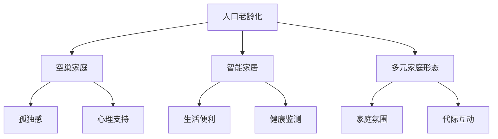

                 

# 未来的人口结构：2050年的超老龄化社会与多元家庭形态

> 关键词：超老龄化社会,多元家庭形态,智能家居,人工智能,人口统计,数据分析,健康管理

## 1. 背景介绍

### 1.1 问题由来
随着人类社会的持续发展，人口结构的变化趋势正逐渐揭示出新的未来图景。在过去的几十年中，全球人口老龄化问题愈发严重，尤其是在发达国家。这一现象不仅对经济、医疗等领域产生了深远影响，也促使我们重新审视家庭结构和社交模式。

### 1.2 问题核心关键点
人口老龄化导致家庭结构日趋多元，尤其是独居老人、空巢家庭等现象的普遍化。与此同时，技术的飞速进步使得智能家居、人工智能等新兴技术得以在家庭中广泛应用，极大地提升了老年人的生活质量。

## 2. 核心概念与联系

### 2.1 核心概念概述

为更好地理解未来人口结构的变化及其对家庭形态的影响，本节将介绍几个密切相关的核心概念：

- **人口老龄化**：指人口中老年人口比例持续上升的现象，通常以60岁以上人口占总人口比例超过10%，或65岁以上人口占比超过7%为标准。
- **空巢家庭**：指家庭成员不在一起居住的家庭，常与人口老龄化伴生。
- **智能家居**：通过物联网(IoT)技术实现家居设备的互联互通，提升生活便利性。
- **多元家庭形态**：包括独居老人、同居老人、多代同堂等不同的家庭结构。
- **人工智能**：一种模拟人类智能过程的技术，可应用于智能推荐、健康监测、情感陪伴等多个场景。

这些核心概念之间的逻辑关系可以通过以下Mermaid流程图来展示：



这个流程图展示了一些关键概念及其之间的关系：

1. 人口老龄化导致空巢家庭数量增加，老年人可能面临孤独感等心理问题。
2. 智能家居技术能够改善老年人的生活便利性和健康状况。
3. 多元家庭形态反映了社会结构的变化，影响着家庭成员间的互动方式。
4. 人工智能在智能推荐、健康监测、情感陪伴等方面的应用，进一步丰富了家庭生活的智能化水平。

## 3. 核心算法原理 & 具体操作步骤

### 3.1 算法原理概述

未来人口结构的预测和分析，通常依赖于统计模型和机器学习算法。其核心思想是通过对历史人口数据的建模，预测未来的人口结构变化，特别是老年人口比例的上升趋势。这一过程通常包括以下步骤：

1. 数据收集：收集历史和当前的人口统计数据，包括出生率、死亡率、移民率等关键指标。
2. 数据清洗与预处理：处理缺失值、异常值，对数据进行标准化和归一化处理。
3. 特征工程：选择和构造对预测有用的特征，如经济状况、文化背景、政策变化等。
4. 模型构建：选择适合的统计模型或机器学习算法进行预测，如时间序列模型、回归模型、深度学习模型等。
5. 结果验证：使用交叉验证等方法评估模型性能，调整模型参数以提升预测精度。
6. 未来预测：使用训练好的模型对未来的人口结构进行预测。

### 3.2 算法步骤详解

下面以时间序列模型为例，详细介绍基于监督学习的大语言模型微调方法的具体步骤：

1. **数据准备**：收集历史和当前的人口数据，包括总人口数、年龄结构、出生率、死亡率、移民率等指标，形成时间序列数据。

2. **数据预处理**：对数据进行清洗和预处理，包括去除缺失值、处理异常值、对数据进行归一化等。

3. **特征工程**：根据领域知识，选择和构造对预测有用的特征，如经济状况、文化背景、政策变化等。

4. **模型构建**：选择时间序列模型，如ARIMA、LSTM等，进行模型训练和预测。
   - 对于ARIMA模型，设定模型参数（p、d、q），使用历史数据进行训练。
   - 对于LSTM模型，设定网络结构和超参数，使用历史数据进行训练。

5. **结果验证**：使用交叉验证等方法评估模型性能，调整模型参数以提升预测精度。

6. **未来预测**：使用训练好的模型对未来的人口结构进行预测，输出预测结果。

### 3.3 算法优缺点

基于监督学习的人口结构预测方法具有以下优点：

- **简单易用**：算法流程清晰，易于理解和实现。
- **精度较高**：通过选择合适的模型和特征，可以有效提升预测精度。
- **适应性强**：可以处理各种类型的数据，适用于不同国家和地区的预测。

同时，该方法也存在一些局限性：

- **依赖数据**：预测结果依赖于历史数据的准确性和完整性，数据质量影响模型性能。
- **模型选择**：不同的模型适用于不同类型的数据，选择合适的模型是关键。
- **过拟合风险**：模型可能过拟合历史数据，难以泛化到未来。

### 3.4 算法应用领域

人口结构预测和分析在多个领域都有广泛应用：

- **政策制定**：为政府制定人口政策、养老政策等提供数据支持。
- **经济规划**：分析劳动力市场变化，预测经济增长趋势。
- **医疗健康**：评估医疗资源需求，制定老年医疗保健计划。
- **城市规划**：规划城市空间布局，提升城市居住环境。
- **保险行业**：预测养老保险、医疗保险的需求变化。

## 4. 数学模型和公式 & 详细讲解

### 4.1 数学模型构建

基于时间序列模型的未来人口结构预测，可以表示为：

$$
y_t = f(y_{t-1}, y_{t-2}, ..., y_{t-p}, x_{t-1}, x_{t-2}, ..., x_{t-q})
$$

其中 $y_t$ 表示第 $t$ 年的总人口数，$x_t$ 表示第 $t$ 年的其他特征（如出生率、死亡率等），$f$ 为预测函数。

### 4.2 公式推导过程

以ARIMA模型为例，其数学模型可表示为：

$$
y_t = c + \sum_{i=1}^{p}\phi_i y_{t-i} + \sum_{j=1}^{d} \theta_j \Delta^j y_t + \sum_{k=1}^{q}\psi_k \epsilon_{t-k}
$$

其中 $c$ 为常数项，$\phi_i$ 为自回归系数，$\theta_j$ 为差分系数，$\Delta^j y_t$ 为 $y_t$ 的 $j$ 阶差分，$\psi_k$ 为移动平均系数，$\epsilon_t$ 为随机误差项。

### 4.3 案例分析与讲解

以中国未来人口结构的预测为例，假设我们已知近十年的总人口数据，以及出生率、死亡率等特征，使用ARIMA模型进行预测。模型构建和训练过程如下：

1. 数据准备：收集历史总人口数据，包括出生率、死亡率等特征。
2. 数据预处理：对数据进行清洗和预处理，去除缺失值、异常值。
3. 特征工程：选择出生率、死亡率等对人口变化有影响的特征。
4. 模型构建：设定ARIMA模型参数（p、d、q），使用历史数据进行训练。
5. 结果验证：使用交叉验证等方法评估模型性能，调整模型参数以提升预测精度。
6. 未来预测：使用训练好的模型对未来的人口结构进行预测。

## 5. 项目实践：代码实例和详细解释说明

### 5.1 开发环境搭建

在进行人口结构预测实践前，我们需要准备好开发环境。以下是使用Python进行统计模型开发的环境配置流程：

1. 安装Anaconda：从官网下载并安装Anaconda，用于创建独立的Python环境。

2. 创建并激活虚拟环境：
```bash
conda create -n stats-env python=3.8 
conda activate stats-env
```

3. 安装相关库：
```bash
conda install statsmodels pandas numpy matplotlib
```

4. 安装TensorFlow（可选）：
```bash
conda install tensorflow
```

完成上述步骤后，即可在`stats-env`环境中开始统计模型开发。

### 5.2 源代码详细实现

下面以时间序列模型为例，给出使用Python进行人口结构预测的代码实现。

```python
import pandas as pd
import numpy as np
import statsmodels.api as sm
from statsmodels.tsa.arima_model import ARIMA

# 读取数据
data = pd.read_csv('population.csv', parse_dates=['date'], index_col='date')

# 数据预处理
data = data.dropna().reindex(pd.date_range(start=data.index[0], end=data.index[-1]))
data.index.freq = 'D'

# 特征工程
features = data[['birth_rate', 'death_rate']]
target = data['population']

# 模型构建
model = ARIMA(target, exog=features)
results = model.fit()

# 结果验证
print(results.summary())

# 未来预测
forecast = results.get_forecast(steps=365)
print(forecast)
```

### 5.3 代码解读与分析

让我们再详细解读一下关键代码的实现细节：

**数据读取和预处理**：
- 使用Pandas库读取历史人口数据，并设定日期索引。
- 对数据进行去重、补全缺失值和重新索引等预处理操作。

**特征工程**：
- 选择出生率、死亡率等特征，作为模型的解释变量。
- 设定目标变量为总人口数。

**模型构建和训练**：
- 使用ARIMA模型，设定自回归、差分和移动平均的阶数，进行模型训练。
- 打印模型结果摘要，评估模型性能。

**未来预测**：
- 使用训练好的模型对未来365天的人口数进行预测，输出预测结果。

## 6. 实际应用场景

### 6.1 智能家居系统

未来的家庭将越来越多地应用智能家居系统，以提升老年人的生活便利性和安全性。通过智能音箱、智能门锁、智能照明等设备，老年人可以实现语音控制家居设备、远程监控家庭安全等功能。

以语音助手为例，结合人工智能技术，可以实现以下功能：

- **语音识别**：通过语音识别技术，老年人可以通过语音指令控制家居设备，如打开空调、调节灯光等。
- **智能提醒**：通过自然语言理解技术，提醒老年人服药时间、健康检查等，提升健康管理水平。
- **情感陪伴**：通过情感分析技术，语音助手能够感知老年人的情绪变化，及时提供心理支持。

### 6.2 多元家庭形态的智能管理

多元家庭形态带来了新的管理挑战，特别是对独居老人和空巢家庭。智能家居系统可以结合人工智能技术，为老年人提供更加智能化的生活支持。

以智能健康监测系统为例，结合健康数据分析，可以实现以下功能：

- **健康监测**：通过智能手环、智能血压计等设备，实时监测老年人的健康状况，如心率、血压、睡眠质量等。
- **健康预警**：通过数据分析，提前识别老年人可能出现的健康问题，如心脏病、糖尿病等，及时提醒医护人员。
- **远程医疗**：通过视频通话、健康数据共享等功能，老年人可以远程咨询医生，获得及时医疗支持。

### 6.3 社区养老服务

社区养老服务将成为未来养老模式的重要组成部分。智能家居系统可以结合社区资源，提供更加便捷、高效的服务。

以社区智能养老平台为例，结合物联网技术，可以实现以下功能：

- **服务预约**：老年人可以通过智能设备预约社区服务，如家政、医疗等。
- **生活助理**：智能机器人可以协助老年人完成日常护理、家务等任务，提高生活质量。
- **紧急救援**：通过传感器监测老年人生活状态，如摔倒、低血糖等紧急情况，及时联系医护人员。

### 6.4 未来应用展望

随着人口老龄化问题的加剧，多元家庭形态的普及，未来智能家居系统将更加广泛地应用于老年人的日常生活管理。

1. **技术融合**：智能家居系统将与物联网、人工智能、大数据等技术深度融合，提供更加全面、智能的老年生活支持。
2. **社会支持**：社区养老服务将成为未来养老模式的重要组成部分，智能家居系统将与社区资源相结合，提供更加便捷、高效的服务。
3. **政策引导**：政府政策将引导智能家居系统的开发和应用，促进社会资源的合理配置，提升老年人的生活质量。

## 7. 工具和资源推荐

### 7.1 学习资源推荐

为了帮助开发者系统掌握智能家居系统与未来家庭形态的知识，这里推荐一些优质的学习资源：

1. **《智能家居系统设计与实现》**：详细介绍了智能家居系统的工作原理和设计方法，适合入门学习。
2. **《人工智能基础》**：由斯坦福大学提供的免费课程，涵盖了人工智能的基本概念和算法。
3. **《物联网技术与智能家居》**：介绍了物联网技术在智能家居中的应用，适合技术开发者学习。
4. **《Python数据分析》**：介绍了Python在数据分析中的应用，适合数据分析师学习。
5. **《机器学习实战》**：通过实战项目，介绍了机器学习的基本算法和应用。

通过对这些资源的学习实践，相信你一定能够快速掌握智能家居系统与未来家庭形态的技术要点，并用于解决实际的老年生活支持问题。

### 7.2 开发工具推荐

高效的开发离不开优秀的工具支持。以下是几款用于智能家居系统开发的常用工具：

1. **IoT开发平台**：如ThingWorx、ThingSpeak等，提供了完整的IoT开发环境和API接口，支持各类智能设备接入。
2. **语音识别工具**：如Google Speech-to-Text、IBM Watson Speech to Text等，提供了高效的语音识别服务。
3. **自然语言处理工具**：如Google Dialogflow、IBM Watson Natural Language Understanding等，提供了自然语言理解与处理能力。
4. **机器学习框架**：如TensorFlow、PyTorch等，提供了丰富的机器学习算法库和模型优化工具。
5. **数据分析工具**：如Tableau、Power BI等，提供了高效的数据可视化和分析功能。

合理利用这些工具，可以显著提升智能家居系统的开发效率，加快创新迭代的步伐。

### 7.3 相关论文推荐

智能家居系统与未来家庭形态的研究源于学界的持续研究。以下是几篇奠基性的相关论文，推荐阅读：

1. **《智能家居系统：技术、应用与挑战》**：介绍了智能家居系统的工作原理和应用场景，提供了全面的技术综述。
2. **《未来家庭形态：从智能家居到智能社区》**：探讨了未来家庭形态的演变趋势，分析了智能家居对家庭生活的影响。
3. **《人工智能在智能家居中的应用》**：介绍了人工智能在智能家居中的应用，展示了其带来的创新可能。
4. **《物联网与智能家居：技术与发展趋势》**：讨论了物联网技术在智能家居中的应用前景和发展趋势。
5. **《未来家庭养老：基于智能家居系统的解决方案》**：提出了基于智能家居系统的未来家庭养老方案，探讨了其应用价值。

这些论文代表了智能家居系统与未来家庭形态的研究方向，通过学习这些前沿成果，可以帮助研究者把握学科前进方向，激发更多的创新灵感。

## 8. 总结：未来发展趋势与挑战

### 8.1 总结

本文对基于监督学习的人口结构预测方法进行了全面系统的介绍。首先阐述了未来人口结构的预测和分析方法，明确了未来人口老龄化的趋势及其对家庭结构的影响。其次，从原理到实践，详细讲解了时间序列模型的构建和应用，给出了具体的代码实现和分析。同时，本文还探讨了未来智能家居系统在老年人生活中的应用，展示了未来家庭形态的多元化和智能化趋势。

通过本文的系统梳理，可以看到，未来人口结构预测和智能家居系统将在老年人生活和社区养老中发挥重要作用，提升老年人的生活质量和社会福祉。未来，伴随技术的不断进步，智能家居系统必将成为老年人生活中的重要组成部分，带来更加便捷、安全、舒适的生活体验。

### 8.2 未来发展趋势

展望未来，智能家居系统与未来家庭形态将呈现以下几个发展趋势：

1. **技术融合**：智能家居系统将与物联网、人工智能、大数据等技术深度融合，提供更加全面、智能的老年生活支持。
2. **社会支持**：社区养老服务将成为未来养老模式的重要组成部分，智能家居系统将与社区资源相结合，提供更加便捷、高效的服务。
3. **政策引导**：政府政策将引导智能家居系统的开发和应用，促进社会资源的合理配置，提升老年人的生活质量。
4. **数据驱动**：未来的智能家居系统将更加注重数据的收集和分析，通过数据驱动的方法，提升系统的智能化水平和用户体验。

这些趋势凸显了智能家居系统与未来家庭形态的广阔前景，这些方向的探索发展，必将进一步提升老年人的生活质量，构建更加智能、便捷、舒适的家庭生活环境。

### 8.3 面临的挑战

尽管智能家居系统与未来家庭形态的发展前景广阔，但在迈向更加智能化、普适化应用的过程中，仍面临诸多挑战：

1. **技术难题**：智能家居系统的开发涉及多种技术，如物联网、自然语言处理、人工智能等，技术复杂度较高。
2. **数据隐私**：智能家居系统的广泛应用涉及大量个人数据，如何保护数据隐私和安全，是一大挑战。
3. **用户接受度**：老年人对新技术的接受度相对较低，如何提升用户体验，使其更易于接受和操作，需要更多的市场教育。
4. **设备互联**：智能家居系统的互联互通是一个复杂的问题，不同品牌、不同协议的设备难以实现无缝对接。
5. **服务质量**：智能家居系统的服务质量直接影响用户体验，如何提供稳定、可靠、高效的服务，是一大挑战。

### 8.4 研究展望

面对智能家居系统与未来家庭形态所面临的挑战，未来的研究需要在以下几个方面寻求新的突破：

1. **技术创新**：开发更加高效、便捷、可靠的智能家居系统，提升用户体验和接受度。
2. **数据保护**：建立数据保护机制，确保用户数据隐私和安全。
3. **跨设备互通**：推动标准化协议和接口的制定，实现不同品牌设备的高效互联。
4. **服务优化**：提供稳定、可靠、高效的服务，提升系统性能和用户体验。
5. **社会应用**：结合社会资源，推动智能家居系统在养老、社区服务等方面的应用，提升社会福祉。

这些研究方向的探索，必将引领智能家居系统与未来家庭形态迈向更高的台阶，为老年人提供更加智能、便捷、舒适的生活环境。面向未来，智能家居系统与未来家庭形态的研究还需要与其他人工智能技术进行更深入的融合，如知识表示、因果推理、强化学习等，多路径协同发力，共同推动智能技术在家庭生活中的普及和应用。

## 9. 附录：常见问题与解答

**Q1：未来的人口结构预测是否准确？**

A: 未来的人口结构预测依赖于历史数据的准确性和完整性，以及模型的选择和参数设置。尽管预测结果存在不确定性，但通过选择合适的模型和特征，可以有效提升预测精度。

**Q2：智能家居系统如何保证数据安全？**

A: 智能家居系统需要采取多种措施保护数据安全，如数据加密、访问控制、匿名化处理等。此外，用户数据应得到明确的用户授权，并在使用过程中严格遵守隐私保护政策。

**Q3：未来家庭形态的多元化是如何实现的？**

A: 未来家庭形态的多元化主要通过智能家居系统的广泛应用来实现。智能家居系统可以结合物联网、人工智能等技术，为老年人提供更加智能化的生活支持，如健康监测、情感陪伴、生活助理等，满足不同家庭成员的需求。

**Q4：智能家居系统的开发难点在哪里？**

A: 智能家居系统的开发涉及多种技术，如物联网、自然语言处理、人工智能等，技术复杂度较高。此外，系统需要考虑设备互联、数据隐私、用户体验等多个方面，开发难度较大。

**Q5：未来智能家居系统如何应对老龄化社会？**

A: 未来智能家居系统可以通过多方面的改进，应对老龄化社会的挑战。例如，系统可以通过语音助手、智能健康监测等方式，提供更加便捷、高效、安全的生活支持，提升老年人的生活质量。

---

作者：禅与计算机程序设计艺术 / Zen and the Art of Computer Programming

