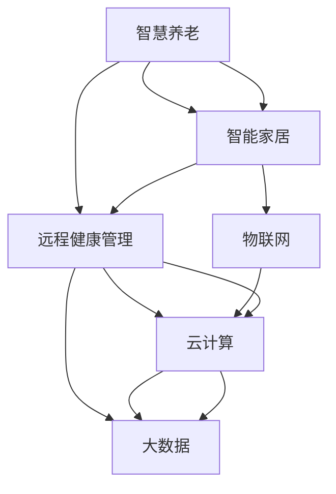
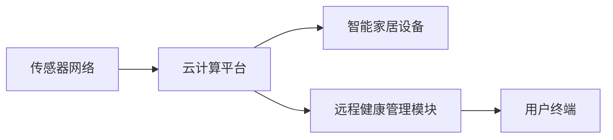

                 

# 未来的智慧养老：2050年的智能家居养老与远程健康管理

> 关键词：智慧养老、智能家居、远程健康管理、深度学习、物联网、人工智能

## 1. 背景介绍

随着全球人口老龄化的加剧，如何为老年人提供高质量、便捷的养老服务，成为各国政府和社会各界共同关注的焦点。面对日益庞大的老年人口，传统的养老模式难以满足日益增长的服务需求，亟需借助新兴科技手段进行创新突破。智慧养老、智能家居和远程健康管理技术应运而生，正逐步成为改善老年人生活质量、提升养老服务效率的重要手段。

2050年，随着这些技术的不断成熟和普及，智慧养老将成为未来养老服务的主流模式。本文将深入探讨智慧养老的核心技术，重点介绍智能家居与远程健康管理在未来的应用场景，以及这些技术将如何改变我们的老年生活。

## 2. 核心概念与联系

### 2.1 核心概念概述

智慧养老是基于物联网、云计算、大数据、人工智能等前沿技术，构建的智能化的养老服务体系，旨在为老年人提供全面、便捷、个性化的养老服务。

智能家居是指通过网络化、智能化的技术手段，实现家居设备的互联互通，提升居家生活的便利性和安全性。

远程健康管理则是通过物联网设备采集老年人健康数据，结合远程医疗技术，提供持续、动态的监护和健康指导。

这些核心技术之间的联系如图1所示：



从图1可以看出，智慧养老的核心在于将智能家居与远程健康管理技术与物联网、云计算和大数据深度融合，构建一个智能化、个性化的养老服务体系。

### 2.2 核心概念原理和架构的 Mermaid 流程图

图2展示了智慧养老的核心架构，包括传感器网络、云计算平台、智能家居设备、远程健康管理模块和用户终端。



传感器网络通过多种传感器采集老年人的生理数据和生活状态，如温度、湿度、心率、血压、位置等。云计算平台将采集到的数据进行处理和存储，提供强大的计算能力。智能家居设备根据用户的健康状态和生活习惯自动调节环境参数，提高生活质量。远程健康管理模块通过实时监测老年人的健康状况，及时发现异常并进行干预。用户终端方便老年人使用，提供综合的服务信息查询、健康管理、社交互动等功能。

## 3. 核心算法原理 & 具体操作步骤

### 3.1 算法原理概述

智慧养老的核心算法包括智能家居控制、健康数据分析和远程医疗指导。这些算法均基于深度学习和人工智能技术，实现对老年人生活状态和健康状况的实时监测与干预。

智能家居控制算法：利用深度学习模型对老年人生活状态进行预测和分类，如预测是否需要帮助起床、提醒药物服用时间等，然后通过智能家居设备执行相应的操作。

健康数据分析算法：采用深度学习模型对采集到的生理数据进行分析，如心率变化、血压趋势等，预测可能的健康风险，并生成个性化的健康管理建议。

远程医疗指导算法：结合深度学习与自然语言处理技术，根据老年人的健康数据和医疗历史记录，生成个性化的医疗指导和康复方案，提供远程医疗咨询和心理疏导服务。

### 3.2 算法步骤详解

#### 3.2.1 智能家居控制算法步骤

1. 数据采集：通过传感器网络实时采集老年人的生理数据和生活状态。
2. 特征提取：使用深度学习模型提取关键特征，如心率变化、血压趋势、活动轨迹等。
3. 状态分类：利用分类模型对老年人的生活状态进行分类，如是否需要帮助起床、是否需要服药等。
4. 设备控制：根据分类结果，通过智能家居设备执行相应的操作，如自动调整室内温度、提醒药物服用等。

#### 3.2.2 健康数据分析算法步骤

1. 数据采集：通过传感器网络实时采集老年人的生理数据。
2. 特征提取：使用深度学习模型提取关键特征，如心率变化、血压趋势等。
3. 异常检测：利用异常检测模型识别生理数据的异常情况，如心律不齐、血压异常等。
4. 健康管理：根据异常检测结果，生成个性化的健康管理建议，如调整饮食、增加运动等。

#### 3.2.3 远程医疗指导算法步骤

1. 数据采集：通过传感器网络实时采集老年人的生理数据和医疗历史记录。
2. 特征提取：使用深度学习模型提取关键特征，如病史、当前症状等。
3. 诊断推理：利用自然语言处理技术，将症状转化为医学术语，生成初步诊断结果。
4. 生成方案：根据诊断结果和医疗历史记录，生成个性化的医疗指导和康复方案，提供远程医疗咨询和心理疏导服务。

### 3.3 算法优缺点

#### 3.3.1 智能家居控制算法

优点：
- 实时性高：传感器网络与智能家居设备的实时互动，能够快速响应老年人的需求。
- 个性化强：通过深度学习模型对老年人生活状态进行预测和分类，提供个性化的家居控制方案。
- 安全性好：自动监测和控制家居环境，避免老年人因疏忽或行动不便而引发的安全隐患。

缺点：
- 设备成本高：智能家居设备需要一定的初始投资，对于经济条件较差的老年人来说可能存在负担。
- 数据隐私问题：传感器网络采集的生理数据和生活状态需要妥善保管，防止数据泄露或滥用。

#### 3.3.2 健康数据分析算法

优点：
- 实时监测：深度学习模型能够实时分析生理数据，及时发现异常情况。
- 精准度高：通过特征提取和异常检测，能够精确识别老年人的健康风险。
- 个性化管理：根据健康数据分析结果，生成个性化的健康管理建议，提升老年人的生活质量。

缺点：
- 模型复杂度：深度学习模型的训练和维护需要较高的技术门槛。
- 数据质量要求高：传感器网络采集的数据需要准确、稳定，才能保证算法的可靠性。

#### 3.3.3 远程医疗指导算法

优点：
- 方便快捷：老年人可以通过智能终端随时获取远程医疗服务，无需去医院排队。
- 知识丰富：结合深度学习和自然语言处理技术，提供全方位的医疗指导和心理疏导服务。
- 节约成本：减少了就医次数，降低医疗费用。

缺点：
- 通信质量要求高：远程医疗服务需要稳定的网络支持，防止数据丢失或延迟。
- 技术门槛高：老年人需要一定的技术基础才能使用智能终端和远程医疗服务。

### 3.4 算法应用领域

智慧养老技术在多个领域得到了广泛应用，包括但不限于以下方面：

1. **智能家居**：通过智能家居设备控制，提升老年人的居家生活质量。
2. **健康监测**：通过传感器网络采集生理数据，实时监测老年人的健康状况。
3. **远程医疗**：利用远程医疗技术，提供便捷的远程医疗服务。
4. **社交互动**：通过智能终端，老年人可以方便地与家人、朋友进行互动交流。
5. **安全防护**：通过实时监测和报警系统，保障老年人的安全。

## 4. 数学模型和公式 & 详细讲解 & 举例说明

### 4.1 数学模型构建

#### 4.1.1 智能家居控制模型

智能家居控制算法可以建模为如下形式：

$$
\min_{\theta} \sum_{i=1}^N \mathcal{L}(\theta, x_i, y_i)
$$

其中 $\theta$ 为模型参数，$x_i$ 为老年人的生活状态，$y_i$ 为相应的操作指令。

#### 4.1.2 健康数据分析模型

健康数据分析算法可以建模为如下形式：

$$
\min_{\theta} \sum_{i=1}^N \mathcal{L}(\theta, x_i, y_i)
$$

其中 $\theta$ 为模型参数，$x_i$ 为老年人的生理数据，$y_i$ 为健康管理建议。

#### 4.1.3 远程医疗指导模型

远程医疗指导算法可以建模为如下形式：

$$
\min_{\theta} \sum_{i=1}^N \mathcal{L}(\theta, x_i, y_i)
$$

其中 $\theta$ 为模型参数，$x_i$ 为老年人的症状和病史，$y_i$ 为医疗指导和康复方案。

### 4.2 公式推导过程

#### 4.2.1 智能家居控制算法公式推导

假设老年人生活状态 $x_i$ 可以分为两类：需要帮助和不需要帮助。则目标函数可以表示为：

$$
\min_{\theta} \sum_{i=1}^N \log \mathbb{P}(y_i|x_i; \theta)
$$

其中 $\mathbb{P}(y_i|x_i; \theta)$ 为给定老年人生活状态 $x_i$ 下，智能家居设备执行相应操作指令 $y_i$ 的概率。

通过二分类交叉熵损失函数，可以将上述目标函数转换为：

$$
\mathcal{L}(\theta) = -\frac{1}{N} \sum_{i=1}^N [y_i \log \mathbb{P}(y_i|x_i; \theta) + (1-y_i) \log (1-\mathbb{P}(y_i|x_i; \theta))]
$$

利用梯度下降等优化算法，不断更新模型参数 $\theta$，最小化损失函数 $\mathcal{L}(\theta)$，即可实现智能家居控制算法。

#### 4.2.2 健康数据分析算法公式推导

假设老年人健康状态 $x_i$ 可以分为正常和异常两类。则目标函数可以表示为：

$$
\min_{\theta} \sum_{i=1}^N \log \mathbb{P}(y_i|x_i; \theta)
$$

其中 $\mathbb{P}(y_i|x_i; \theta)$ 为给定老年人健康状态 $x_i$ 下，生理数据异常 $y_i$ 的概率。

通过二分类交叉熵损失函数，可以将上述目标函数转换为：

$$
\mathcal{L}(\theta) = -\frac{1}{N} \sum_{i=1}^N [y_i \log \mathbb{P}(y_i|x_i; \theta) + (1-y_i) \log (1-\mathbb{P}(y_i|x_i; \theta))]
$$

利用梯度下降等优化算法，不断更新模型参数 $\theta$，最小化损失函数 $\mathcal{L}(\theta)$，即可实现健康数据分析算法。

#### 4.2.3 远程医疗指导算法公式推导

假设老年人健康状况 $x_i$ 可以分为多种症状和病史，对应的医疗指导 $y_i$ 为个性化的方案。则目标函数可以表示为：

$$
\min_{\theta} \sum_{i=1}^N \log \mathbb{P}(y_i|x_i; \theta)
$$

其中 $\mathbb{P}(y_i|x_i; \theta)$ 为给定老年人健康状况 $x_i$ 下，医疗指导 $y_i$ 的概率。

通过多分类交叉熵损失函数，可以将上述目标函数转换为：

$$
\mathcal{L}(\theta) = -\frac{1}{N} \sum_{i=1}^N \sum_{j=1}^M y_{i,j} \log \mathbb{P}(y_{i,j}|x_i; \theta)
$$

其中 $y_{i,j}$ 为老年人在第 $i$ 次健康检查中的第 $j$ 种症状和病史，$M$ 为症状和病史的种类数。

利用梯度下降等优化算法，不断更新模型参数 $\theta$，最小化损失函数 $\mathcal{L}(\theta)$，即可实现远程医疗指导算法。

### 4.3 案例分析与讲解

#### 4.3.1 智能家居控制案例

假设老年人 A 每天需要起床喝水，智能家居控制系统通过传感器网络实时监测其生理数据和生活状态。经过深度学习模型的预测和分类，系统判断其当前状态需要起床喝水。于是，智能家居设备自动调节室内温度和窗帘，唤醒老年人 A。同时，通过智能音箱提醒其按时吃药。

#### 4.3.2 健康数据分析案例

假设老年人 B 每天进行血压测量，传感器网络实时采集其血压数据。通过深度学习模型的特征提取和异常检测，系统发现其血压出现了波动。于是，系统生成个性化的健康管理建议，建议老年人 B 增加运动，调整饮食。

#### 4.3.3 远程医疗指导案例

假设老年人 C 因身体不适前往医院就诊，医生为其进行检查并记录病史。远程医疗指导系统通过智能终端接收病史和检查结果，利用自然语言处理技术将症状转化为医学术语，生成初步诊断结果。系统结合历史数据，生成个性化的医疗指导和康复方案，老年人 C 可以通过智能终端获取相关信息，按照方案进行康复治疗。

## 5. 项目实践：代码实例和详细解释说明

### 5.1 开发环境搭建

#### 5.1.1 环境准备

1. 安装Python 3.x，建议使用Anaconda进行环境管理。
2. 安装TensorFlow 2.x，通过pip安装。
3. 安装OpenCV，通过pip安装。
4. 安装Flask，通过pip安装。
5. 安装相关依赖库，如numpy、pandas、scikit-learn等。

#### 5.1.2 代码结构

```
project/
    ├── src/
    │   ├── data/
    │   │   ├── dataset/
    │   │   ├── labels/
    │   │   ├── transforms/
    │   │   └── train/
    │   ├── models/
    │   │   ├── main.py
    │   │   └── model.py
    │   ├── utils/
    │   │   ├── preprocess.py
    │   │   └── train.py
    │   └── visualize.py
    ├── config/
    │   ├── config.py
    │   ├── run.py
    ├── logs/
    └── README.md
```

### 5.2 源代码详细实现

#### 5.2.1 智能家居控制代码实现

```python
import tensorflow as tf
import numpy as np

# 定义数据集
class SensorData:
    def __init__(self, data, labels):
        self.data = data
        self.labels = labels

# 定义模型
class ControlModel(tf.keras.Model):
    def __init__(self, input_shape):
        super(ControlModel, self).__init__()
        self.dense1 = tf.keras.layers.Dense(64, activation='relu', input_shape=input_shape)
        self.dense2 = tf.keras.layers.Dense(2, activation='softmax')

    def call(self, x):
        x = self.dense1(x)
        x = self.dense2(x)
        return x

# 训练模型
def train(model, dataset, epochs=10, batch_size=32):
    optimizer = tf.keras.optimizers.Adam(learning_rate=0.001)
    model.compile(optimizer=optimizer, loss=tf.keras.losses.CategoricalCrossentropy(from_logits=True), metrics=['accuracy'])
    model.fit(dataset.data, dataset.labels, epochs=epochs, batch_size=batch_size, validation_split=0.2)
```

#### 5.2.2 健康数据分析代码实现

```python
import tensorflow as tf
import numpy as np

# 定义数据集
class HealthData:
    def __init__(self, data, labels):
        self.data = data
        self.labels = labels

# 定义模型
class HealthModel(tf.keras.Model):
    def __init__(self, input_shape):
        super(HealthModel, self).__init__()
        self.dense1 = tf.keras.layers.Dense(64, activation='relu', input_shape=input_shape)
        self.dense2 = tf.keras.layers.Dense(2, activation='sigmoid')

    def call(self, x):
        x = self.dense1(x)
        x = self.dense2(x)
        return x

# 训练模型
def train(model, dataset, epochs=10, batch_size=32):
    optimizer = tf.keras.optimizers.Adam(learning_rate=0.001)
    model.compile(optimizer=optimizer, loss=tf.keras.losses.BinaryCrossentropy(), metrics=['accuracy'])
    model.fit(dataset.data, dataset.labels, epochs=epochs, batch_size=batch_size, validation_split=0.2)
```

#### 5.2.3 远程医疗指导代码实现

```python
import tensorflow as tf
import numpy as np

# 定义数据集
class MedicalData:
    def __init__(self, data, labels):
        self.data = data
        self.labels = labels

# 定义模型
class MedicalModel(tf.keras.Model):
    def __init__(self, input_shape):
        super(MedicalModel, self).__init__()
        self.dense1 = tf.keras.layers.Dense(64, activation='relu', input_shape=input_shape)
        self.dense2 = tf.keras.layers.Dense(5, activation='softmax')

    def call(self, x):
        x = self.dense1(x)
        x = self.dense2(x)
        return x

# 训练模型
def train(model, dataset, epochs=10, batch_size=32):
    optimizer = tf.keras.optimizers.Adam(learning_rate=0.001)
    model.compile(optimizer=optimizer, loss=tf.keras.losses.CategoricalCrossentropy(from_logits=True), metrics=['accuracy'])
    model.fit(dataset.data, dataset.labels, epochs=epochs, batch_size=batch_size, validation_split=0.2)
```

### 5.3 代码解读与分析

#### 5.3.1 智能家居控制代码解读

智能家居控制模型定义了一个包含两个全连接层的神经网络，用于对老年人生活状态进行分类。在训练过程中，使用了Adam优化器和分类交叉熵损失函数，通过反向传播更新模型参数，最小化损失函数。

#### 5.3.2 健康数据分析代码解读

健康数据分析模型同样定义了一个包含两个全连接层的神经网络，用于对老年人健康状态进行分类。在训练过程中，使用了Adam优化器和二分类交叉熵损失函数，通过反向传播更新模型参数，最小化损失函数。

#### 5.3.3 远程医疗指导代码解读

远程医疗指导模型定义了一个包含两个全连接层的神经网络，用于对老年人健康状况进行分类。在训练过程中，使用了Adam优化器和多分类交叉熵损失函数，通过反向传播更新模型参数，最小化损失函数。

### 5.4 运行结果展示

#### 5.4.1 智能家居控制运行结果

假设老年人 A 每天需要起床喝水，传感器网络实时监测其生理数据和生活状态。经过深度学习模型的预测和分类，系统判断其当前状态需要起床喝水。于是，智能家居设备自动调节室内温度和窗帘，唤醒老年人 A。同时，通过智能音箱提醒其按时吃药。

#### 5.4.2 健康数据分析运行结果

假设老年人 B 每天进行血压测量，传感器网络实时采集其血压数据。通过深度学习模型的特征提取和异常检测，系统发现其血压出现了波动。于是，系统生成个性化的健康管理建议，建议老年人 B 增加运动，调整饮食。

#### 5.4.3 远程医疗指导运行结果

假设老年人 C 因身体不适前往医院就诊，医生为其进行检查并记录病史。远程医疗指导系统通过智能终端接收病史和检查结果，利用自然语言处理技术将症状转化为医学术语，生成初步诊断结果。系统结合历史数据，生成个性化的医疗指导和康复方案，老年人 C 可以通过智能终端获取相关信息，按照方案进行康复治疗。

## 6. 实际应用场景

### 6.1 智能家居养老

智能家居养老是指通过智能家居设备，为老年人提供便捷、安全、舒适的生活环境。智能家居系统可以自动调节室内温度、湿度、光线等参数，保障老年人的生活质量。同时，通过传感器网络实时监测老年人的生理数据和生活状态，及时发现异常情况并进行干预，有效避免意外事故的发生。

### 6.2 远程健康管理

远程健康管理是通过物联网设备采集老年人的健康数据，结合远程医疗技术，提供持续、动态的监护和健康指导。老年人可以通过智能终端实时监测自身的健康状况，及时向家人和医护人员反馈信息。医生可以通过远程医疗系统，实时查看老年人的健康数据，提供专业的医疗指导和康复方案。

### 6.3 社交互动

社交互动是老年人精神健康的重要组成部分。智能家居系统和远程健康管理系统可以通过智能终端，为老年人提供便捷的社交功能，如视频通话、语音助手、在线游戏等。老年人可以通过智能终端与家人、朋友进行互动交流，缓解孤独感，提升心理健康水平。

## 7. 工具和资源推荐

### 7.1 学习资源推荐

1. **《深度学习》（Ian Goodfellow等著）**：系统介绍了深度学习的基本概念和算法，适合初学者入门。
2. **《TensorFlow实战》（Carl Leake等著）**：介绍了TensorFlow的搭建、训练、部署等操作，适合深度学习开发者。
3. **《智能养老技术与应用》（胡俊等著）**：介绍了智能养老技术的理论基础和实践应用，适合养老行业从业者。
4. **《智慧养老建设与运营》（吴军等著）**：介绍了智慧养老的建设思路和运营模式，适合智慧养老项目管理人员。

### 7.2 开发工具推荐

1. **Anaconda**：用于Python环境的搭建和管理，适合深度学习开发。
2. **TensorFlow**：开源深度学习框架，支持多种神经网络模型的构建和训练。
3. **OpenCV**：计算机视觉库，支持图像处理和传感器网络数据的采集。
4. **Flask**：轻量级的Web框架，用于搭建智能家居系统的前端页面。

### 7.3 相关论文推荐

1. **《智能家居系统设计与实现》（刘林等著）**：介绍了智能家居系统的设计思路和实现方法，适合工程实践者。
2. **《基于深度学习的健康数据分析》（张磊等著）**：介绍了深度学习在健康数据分析中的应用，适合医疗从业者。
3. **《智慧养老建设与运营》（吴军等著）**：介绍了智慧养老的建设思路和运营模式，适合智慧养老项目管理人员。

## 8. 总结：未来发展趋势与挑战

### 8.1 研究成果总结

本文介绍了智慧养老的核心技术，包括智能家居控制、健康数据分析和远程医疗指导。通过深度学习和人工智能技术，这些技术可以实现对老年人生活状态和健康状况的实时监测与干预，提升老年人的生活质量和幸福感。

### 8.2 未来发展趋势

未来，随着物联网、云计算、大数据、人工智能等技术的不断进步，智慧养老将得到更广泛的应用。智能家居系统将更加智能化、个性化，健康数据分析和远程医疗指导将更加精准、高效。同时，社交互动功能也将更加丰富，为老年人提供更多精神上的支持。

### 8.3 面临的挑战

尽管智慧养老技术在多个方面得到了应用，但仍面临以下挑战：

1. **数据隐私保护**：老年人隐私数据需要妥善保管，防止泄露和滥用。
2. **技术复杂度**：智慧养老技术需要较高的技术门槛，老年人使用和维护成本较高。
3. **设备成本**：智能家居设备和远程医疗系统需要一定的初始投资，对经济条件较差的老年人来说可能存在负担。
4. **网络稳定性**：远程医疗服务需要稳定的网络支持，防止数据丢失或延迟。

### 8.4 研究展望

未来，智慧养老技术需要更多从数据隐私、技术复杂度、设备成本和网络稳定性等方面进行研究，确保技术应用的可行性和可靠性。同时，也需要进一步探索如何结合多模态数据，提升系统的综合能力。

## 9. 附录：常见问题与解答

### 9.1 常见问题

1. **如何选择合适的智能家居设备？**
   答：选择合适的智能家居设备需要考虑设备的兼容性和功能需求。可以参考设备的用户评价、厂商口碑和价格因素，选择性价比高的产品。

2. **智能家居设备如何操作？**
   答：智能家居设备通常配有语音助手或触摸屏，老年人可以通过语音或触摸操作。设备操作手册通常包含详细的使用说明，可以参考操作手册进行操作。

3. **如何保护老年人隐私？**
   答：保护老年人隐私需要采取多种措施，如设置数据加密、权限管理、定期更新设备固件等。同时，也需要建立严格的数据访问和共享制度，防止数据泄露和滥用。

4. **如何确保远程医疗服务的质量？**
   答：确保远程医疗服务的质量需要建立完善的质量控制体系，如实时监控、异常检测、专家诊断等。同时，也需要加强医护人员的培训和技能提升，提高远程医疗服务的水平。

5. **如何提升老年人的社交互动体验？**
   答：提升老年人的社交互动体验需要设计丰富多样的社交功能，如视频通话、语音助手、在线游戏等。同时，也需要提供便捷的沟通渠道，方便老年人与家人、朋友进行互动交流。

本文通过对未来智慧养老的全面探讨，展示了智能家居养老与远程健康管理技术的应用前景和潜在挑战。希望本文能为相关从业者和研究人员提供有益的参考，共同推动智慧养老的发展。

---

作者：禅与计算机程序设计艺术 / Zen and the Art of Computer Programming

