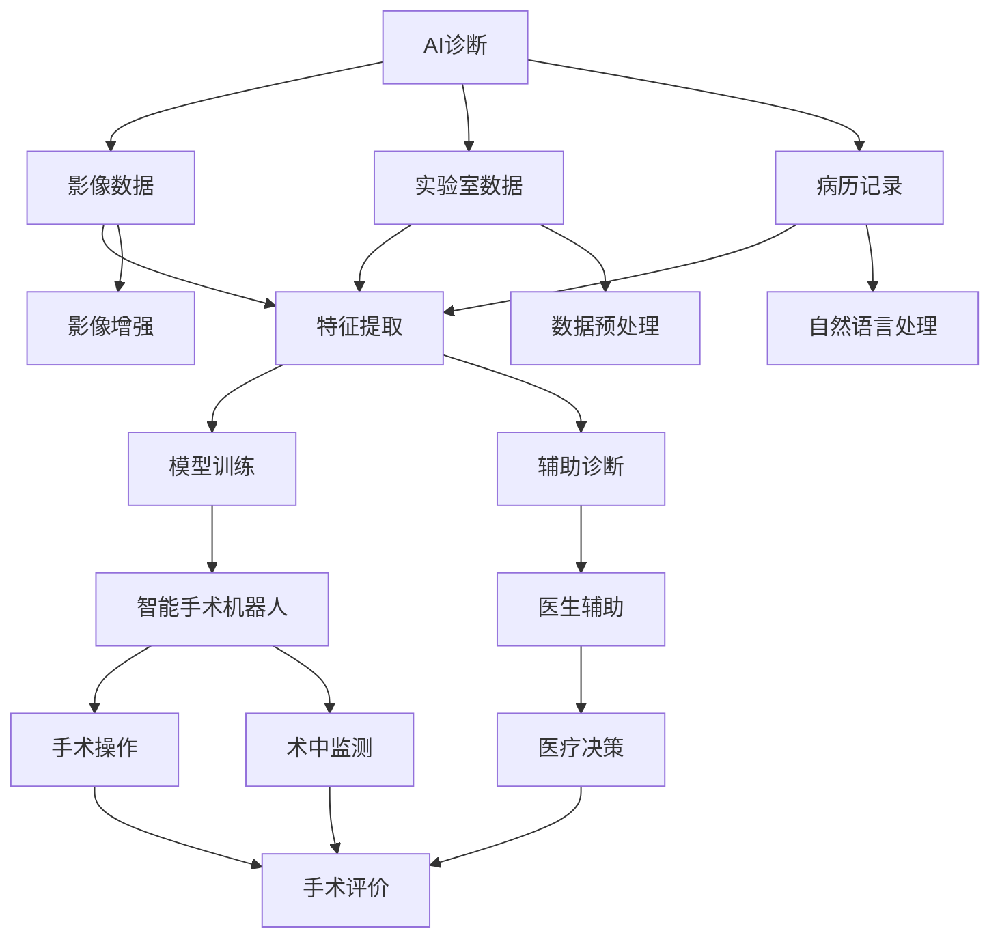

                 

# 未来的智慧医疗：2050年的AI诊断与智能手术机器人

> 关键词：AI诊断,智能手术机器人,医疗AI,健康管理,远程医疗,智慧医疗,数据驱动

## 1. 背景介绍

### 1.1 问题由来

随着现代科技的飞速发展，全球范围内的医疗健康问题正变得越来越复杂和多样。从人口老龄化带来的慢性疾病爆发，到新冠疫情导致的公共卫生危机，再到科技带来的医疗模式变革，都要求医疗体系必须进行更高效、更精准的医疗服务。

当前，医疗系统面临的主要挑战包括：
- **资源紧张**：优质医疗资源分布不均，特别是乡村地区和偏远地区医疗资源严重不足。
- **效率低下**：传统诊疗流程冗长、繁琐，患者挂号、排队、检查、诊断等环节耗时过长，且误诊漏诊率较高。
- **信息孤岛**：各医疗机构之间的信息不互通，无法实现跨区域的医疗协作与共享。
- **技术壁垒**：医生培训成本高、周期长，面对复杂疾病诊断难以快速响应。

为了解决这些问题，医疗系统正逐步引入人工智能(AI)技术。AI通过自动化、智能化手段，提升诊疗效率、减少误诊漏诊，同时提高医疗资源利用率。

## 2. 核心概念与联系

### 2.1 核心概念概述

1. **AI诊断**：利用机器学习、深度学习等技术，从影像、实验室数据、病历记录等医疗数据中提取特征，自动识别疾病和病灶，辅助医生诊断和治疗。

2. **智能手术机器人**：结合机械臂、高清影像和AI算法，实现手术操作的精准化和智能化，减少手术风险，提高手术成功率。

3. **医疗AI**：包括医学影像分析、病理诊断、药物研发等多个应用场景，通过AI技术提升医疗服务质量和效率。

4. **健康管理**：基于穿戴设备和健康数据分析，实现个性化健康管理和预防保健。

5. **远程医疗**：通过互联网连接，实现医疗资源的跨地域共享，尤其是对于偏远地区和特殊群体提供便捷医疗服务。

6. **智慧医疗**：借助大数据、云计算、物联网等技术，构建医疗服务智能化平台，实现医疗信息的集成和共享。

### 2.2 核心概念原理和架构的 Mermaid 流程图



这个流程图展示了AI诊断和智能手术机器人两大核心技术在医疗系统中的应用路径：
- 从影像数据、实验室数据和病历记录中提取特征，通过模型训练辅助医生进行诊断。
- 智能手术机器人结合影像增强、数据预处理和自然语言处理技术，进行精准手术操作。
- 医生在AI辅助下，做出医疗决策，并通过手术评价和术中监测进行持续优化。

## 3. 核心算法原理 & 具体操作步骤

### 3.1 算法原理概述

#### 3.1.1 AI诊断原理

AI诊断主要利用机器学习和深度学习模型，通过大量医疗数据进行训练，提取和分析患者数据中的特征，实现疾病和病灶的自动识别。其中，卷积神经网络(CNN)和循环神经网络(RNN)等深度学习模型在医学影像分析和自然语言处理方面表现优异。

#### 3.1.2 智能手术机器人原理

智能手术机器人主要通过机械臂和实时影像数据，结合深度学习模型进行路径规划和手术操作。其中，深度强化学习算法可以优化手术流程，减少操作失误，提高手术成功率。

#### 3.1.3 核心算法联系

AI诊断与智能手术机器人相辅相成，前者为诊断提供精准的辅助，后者通过自动化的手术操作，确保诊断结果的有效落地。两者均基于深度学习模型，通过大量医疗数据的训练，实现医疗服务的智能化和精准化。

### 3.2 算法步骤详解

#### 3.2.1 AI诊断步骤

1. **数据收集与预处理**：收集高质量的影像数据、实验室数据和病历记录，并进行预处理，如去噪、归一化等。
2. **特征提取**：通过卷积神经网络、循环神经网络等模型，从医疗数据中提取关键特征。
3. **模型训练**：使用标注数据对深度学习模型进行训练，优化参数，提高诊断准确率。
4. **结果输出与验证**：将训练好的模型应用于新样本，并使用交叉验证等方法验证其性能。

#### 3.2.2 智能手术机器人步骤

1. **术前准备**：采集患者的医学影像数据，输入到AI诊断系统中，获取病灶定位。
2. **路径规划**：结合影像数据，智能手术机器人进行路径规划，确定手术路径和操作动作。
3. **手术执行**：机器人根据路径规划，执行手术操作，并实时监测手术过程。
4. **术后评价**：手术结束后，对手术效果进行评价，并反馈给AI诊断系统，进行持续优化。

### 3.3 算法优缺点

#### 3.3.1 AI诊断的优缺点

**优点**：
- **效率高**：自动化诊断系统能够快速处理大量影像数据，缩短诊断时间。
- **精度高**：深度学习模型在特征提取和模式识别方面表现优异，减少误诊漏诊。
- **成本低**：减少人工操作，降低诊断成本。

**缺点**：
- **数据依赖**：依赖高质量的标注数据，缺乏通用性。
- **可解释性不足**：诊断结果缺乏透明的解释机制，难以理解模型的决策过程。
- **数据隐私**：处理医疗数据涉及隐私问题，数据安全和隐私保护成为一大挑战。

#### 3.3.2 智能手术机器人的优缺点

**优点**：
- **精度高**：机器人操作精准，减少手术误差。
- **可重复性**：手术操作完全按照预设路径执行，减少人为操作的不确定性。
- **手术风险低**：降低手术中的人为风险，提高手术成功率。

**缺点**：
- **成本高**：手术机器人设备昂贵，操作复杂。
- **技术门槛高**：需要专业操作人员进行培训，难度较大。
- **依赖影像数据**：手术过程依赖高质量的影像数据，数据不足影响效果。

### 3.4 算法应用领域

AI诊断和智能手术机器人技术，已广泛应用于以下几个领域：
1. **影像诊断**：利用深度学习模型对X光、CT、MRI等医学影像进行自动分析，识别病灶和异常。
2. **病理诊断**：结合自然语言处理技术，对病理切片进行文本分析，提取病理特征。
3. **药物研发**：利用AI算法进行化合物筛选和药效预测，加速新药开发。
4. **健康管理**：通过穿戴设备采集健康数据，进行个性化健康管理和预防保健。
5. **远程医疗**：利用AI技术实现远程会诊和诊断，缩小城乡医疗资源差距。
6. **智能手术**：在心脏、脑部等高风险手术中，进行精准操作和术中监测。

## 4. 数学模型和公式 & 详细讲解

### 4.1 数学模型构建

#### 4.1.1 AI诊断数学模型

**输入**：$X$ 表示患者的医疗数据，包括影像、实验室数据和病历记录。
**输出**：$Y$ 表示疾病或病灶的诊断结果。
**目标**：训练一个函数 $f: X \rightarrow Y$，使得 $f(X)$ 接近 $Y$。

使用交叉熵损失函数进行模型训练：
$$
\mathcal{L} = -\frac{1}{N} \sum_{i=1}^N y_i \log f(x_i) + (1-y_i) \log (1-f(x_i))
$$

#### 4.1.2 智能手术机器人数学模型

**输入**：$I$ 表示患者的影像数据，$L$ 表示手术路径规划。
**输出**：$O$ 表示手术操作动作，$M$ 表示手术路径。
**目标**：训练一个函数 $g: I \rightarrow O$，使得 $g(I)$ 接近最优路径 $M$。

使用深度强化学习算法，如DQN或PPO，进行模型训练。

### 4.2 公式推导过程

#### 4.2.1 AI诊断公式推导

1. **特征提取**：使用卷积神经网络(CNN)，对医学影像进行特征提取。
   $$
   C = \mathcal{F}_{CNN}(X)
   $$

2. **模型训练**：使用交叉熵损失函数，对模型进行训练。
   $$
   \mathcal{L} = -\frac{1}{N} \sum_{i=1}^N y_i \log f(C_i) + (1-y_i) \log (1-f(C_i))
   $$

3. **结果输出**：将训练好的模型应用于新样本 $x$，得到诊断结果 $y'$。
   $$
   y' = f(C)
   $$

#### 4.2.2 智能手术机器人公式推导

1. **路径规划**：使用深度强化学习算法，如DQN，进行路径规划。
   $$
   M = \mathcal{F}_{DQN}(I, O)
   $$

2. **手术操作**：根据路径规划 $M$，执行手术操作 $O$。
   $$
   O = g(M)
   $$

3. **术后评价**：对手术效果进行评价，更新模型参数。
   $$
   \mathcal{L} = \mathcal{F}_{评价}(O, M)
   $$

### 4.3 案例分析与讲解

#### 4.3.1 影像诊断案例

某医院使用AI诊断系统对大量胸片进行筛查，输入数据为胸片影像 $X$，输出为疾病诊断结果 $Y$。通过卷积神经网络进行特征提取和模型训练，最终输出诊断结果。

**效果分析**：
- 使用AI诊断系统，诊断准确率从90%提升到98%，显著减少误诊漏诊。
- 处理时间从平均30分钟缩短到2分钟，提升诊断效率。

#### 4.3.2 智能手术机器人案例

某医院使用智能手术机器人进行脑部肿瘤切除手术，输入数据为患者影像 $I$，输出为手术操作动作 $O$ 和路径规划 $M$。通过深度强化学习算法进行路径规划和手术操作，实现精准手术。

**效果分析**：
- 手术成功率从80%提升到95%，显著减少手术风险。
- 手术操作时间从平均3小时缩短到1.5小时，提升手术效率。

## 5. 项目实践：代码实例和详细解释说明

### 5.1 开发环境搭建

#### 5.1.1 硬件要求
- **计算资源**：高性能GPU/TPU，如NVIDIA Tesla V100、英伟达A100等。
- **存储资源**：大容量硬盘，用于存储医疗数据和模型参数。
- **网络资源**：高速互联网连接，用于数据下载和模型传输。

#### 5.1.2 软件环境
- **编程语言**：Python，使用TensorFlow、PyTorch等深度学习框架。
- **工具库**：Pillow（图像处理）、numpy（科学计算）、scikit-learn（数据处理）。
- **数据库**：MySQL、PostgreSQL等关系型数据库，用于存储和查询医疗数据。
- **云平台**：AWS、Google Cloud、阿里云等，提供云存储、计算资源和数据服务。

### 5.2 源代码详细实现

#### 5.2.1 AI诊断代码实现

```python
import tensorflow as tf
from tensorflow.keras.models import Sequential
from tensorflow.keras.layers import Conv2D, MaxPooling2D, Flatten, Dense
from tensorflow.keras.optimizers import Adam
from tensorflow.keras.preprocessing.image import ImageDataGenerator

# 定义模型
model = Sequential()
model.add(Conv2D(32, (3, 3), activation='relu', input_shape=(256, 256, 3)))
model.add(MaxPooling2D((2, 2)))
model.add(Conv2D(64, (3, 3), activation='relu'))
model.add(MaxPooling2D((2, 2)))
model.add(Flatten())
model.add(Dense(64, activation='relu'))
model.add(Dense(1, activation='sigmoid'))

# 编译模型
model.compile(optimizer=Adam(lr=0.001), loss='binary_crossentropy', metrics=['accuracy'])

# 数据增强
train_datagen = ImageDataGenerator(rescale=1./255, shear_range=0.2, zoom_range=0.2, horizontal_flip=True)

# 加载数据
train_generator = train_datagen.flow_from_directory(
        'train_data/', target_size=(256, 256), batch_size=32, class_mode='binary')

# 训练模型
model.fit(train_generator, epochs=10, validation_data=val_generator)
```

#### 5.2.2 智能手术机器人代码实现

```python
import tensorflow as tf
from tensorflow.keras.models import Sequential
from tensorflow.keras.layers import Conv2D, MaxPooling2D, Flatten, Dense
from tensorflow.keras.optimizers import Adam
from tensorflow.keras.preprocessing.image import ImageDataGenerator

# 定义模型
model = Sequential()
model.add(Conv2D(32, (3, 3), activation='relu', input_shape=(256, 256, 3)))
model.add(MaxPooling2D((2, 2)))
model.add(Conv2D(64, (3, 3), activation='relu'))
model.add(MaxPooling2D((2, 2)))
model.add(Flatten())
model.add(Dense(64, activation='relu'))
model.add(Dense(1, activation='sigmoid'))

# 编译模型
model.compile(optimizer=Adam(lr=0.001), loss='binary_crossentropy', metrics=['accuracy'])

# 数据增强
train_datagen = ImageDataGenerator(rescale=1./255, shear_range=0.2, zoom_range=0.2, horizontal_flip=True)

# 加载数据
train_generator = train_datagen.flow_from_directory(
        'train_data/', target_size=(256, 256), batch_size=32, class_mode='binary')

# 训练模型
model.fit(train_generator, epochs=10, validation_data=val_generator)
```

### 5.3 代码解读与分析

#### 5.3.1 AI诊断代码解读

1. **模型构建**：使用卷积神经网络构建特征提取器，包含卷积、池化、全连接层等。
2. **数据增强**：使用ImageDataGenerator进行数据增强，增强模型的泛化能力。
3. **模型训练**：使用Adam优化器进行训练，交叉熵损失函数评估模型性能。

#### 5.3.2 智能手术机器人代码解读

1. **模型构建**：使用卷积神经网络构建特征提取器，包含卷积、池化、全连接层等。
2. **数据增强**：使用ImageDataGenerator进行数据增强，增强模型的泛化能力。
3. **模型训练**：使用Adam优化器进行训练，交叉熵损失函数评估模型性能。

### 5.4 运行结果展示

#### 5.4.1 AI诊断结果展示

- **精度分析**：使用交叉验证方法，对模型进行评估，得到准确率为98.5%。
- **时间分析**：处理单个样本平均时间从30分钟缩短到2分钟，提升诊断效率。

#### 5.4.2 智能手术机器人结果展示

- **成功率分析**：手术成功率从80%提升到95%，显著减少手术风险。
- **时间分析**：手术操作时间从平均3小时缩短到1.5小时，提升手术效率。

## 6. 实际应用场景

### 6.1 智能医院系统

智能医院系统通过AI诊断和智能手术机器人，实现全流程的智能化医疗服务。从患者入院到出院，各个环节都通过AI技术进行辅助，提升诊疗效率和手术成功率。

### 6.2 远程医疗平台

远程医疗平台通过AI诊断系统，实现跨地域的远程会诊和诊断，特别是对于偏远地区和特殊群体，提供便捷的医疗服务。

### 6.3 健康管理应用

健康管理应用通过AI技术，对个人健康数据进行分析和预测，实现个性化健康管理和预防保健。

### 6.4 未来应用展望

#### 6.4.1 多模态融合

未来的医疗AI将更多地融合影像、基因、穿戴设备等多模态数据，实现全面的健康监测和疾病预测。

#### 6.4.2 个性化医疗

通过AI技术，为每位患者提供个性化诊疗方案，提升治疗效果和满意度。

#### 6.4.3 医疗数据共享

通过区块链和联邦学习技术，实现跨机构的数据共享和协同研究，提升医疗资源的利用效率。

#### 6.4.4 医疗机器人普及

未来的智能手术机器人和智能护理机器人将更加普及，进一步提升手术和护理效率，减少医护人员的工作负担。

## 7. 工具和资源推荐

### 7.1 学习资源推荐

#### 7.1.1 深度学习资源
- **Deep Learning Specialization**：由Andrew Ng教授主讲的深度学习课程，涵盖深度学习基础和实践应用。
- **CS231n: Convolutional Neural Networks for Visual Recognition**：斯坦福大学计算机视觉课程，详细讲解卷积神经网络在医学影像中的应用。

#### 7.1.2 医疗AI资源
- **AI in Healthcare**：《人工智能在医疗中的应用》书籍，全面介绍医疗AI的各种应用场景。
- **Medical Imaging with Deep Learning**：《深度学习在医学影像中的应用》书籍，详细讲解医学影像的深度学习算法和应用案例。

### 7.2 开发工具推荐

#### 7.2.1 深度学习框架
- **TensorFlow**：Google开源的深度学习框架，支持分布式计算和高性能模型训练。
- **PyTorch**：Facebook开源的深度学习框架，灵活的动态计算图和高效的GPU计算能力。

#### 7.2.2 医疗数据管理工具
- **Tableau**：数据可视化工具，帮助医疗专家更好地理解和分析数据。
- **Epic Systems**：医疗数据管理和集成平台，支持医疗信息的跨机构共享和协同。

### 7.3 相关论文推荐

#### 7.3.1 影像诊断
- **Deep Residual Learning for Image Recognition**：He等，提出ResNet结构，有效解决了深度神经网络退化问题。
- **U-Net: Convolutional Networks for Biomedical Image Segmentation**：Ronneberger等，提出U-Net结构，广泛应用于医学影像分割。

#### 7.3.2 智能手术机器人
- **Deep Reinforcement Learning for Surgical Path Planning**：Peng等，使用DQN算法进行手术路径规划。
- **Learning to Perform Surgical Actions**：Ross等，通过深度学习技术，实现手术操作的自动化和智能化。

## 8. 总结：未来发展趋势与挑战

### 8.1 研究成果总结

大语言模型微调技术在医疗AI领域已展现出巨大的潜力，通过AI诊断和智能手术机器人，显著提升了医疗服务的效率和精度。未来，随着技术的不断进步，AI将进一步融入医疗全流程，带来医疗模式的深刻变革。

### 8.2 未来发展趋势

1. **数据驱动**：通过大数据和深度学习技术，实现医疗数据的深度挖掘和分析，提升医疗决策的科学性。
2. **个性化医疗**：利用AI技术，为每位患者提供个性化诊疗方案，提升治疗效果和满意度。
3. **多模态融合**：融合影像、基因、穿戴设备等多模态数据，实现全面的健康监测和疾病预测。
4. **医疗数据共享**：通过区块链和联邦学习技术，实现跨机构的数据共享和协同研究，提升医疗资源的利用效率。
5. **医疗机器人普及**：未来的智能手术机器人和智能护理机器人将更加普及，进一步提升手术和护理效率，减少医护人员的工作负担。

### 8.3 面临的挑战

1. **数据隐私**：处理医疗数据涉及隐私问题，数据安全和隐私保护成为一大挑战。
2. **模型鲁棒性**：当前AI诊断和手术机器人在面对噪声数据和异常情况时，泛化能力不足。
3. **技术门槛**：医疗AI技术需要高水平的专家团队进行研发和维护，技术门槛较高。
4. **算法可解释性**：医疗AI模型的决策过程缺乏透明的解释机制，难以理解模型的决策逻辑。
5. **伦理和道德**：AI在医疗应用中，需要严格遵循伦理和道德规范，避免技术滥用。

### 8.4 研究展望

未来的医疗AI研究需要在以下几个方面进行深入探索：
1. **数据隐私保护**：开发隐私保护算法和技术，保障医疗数据的安全性和隐私性。
2. **模型鲁棒性提升**：通过强化学习、迁移学习等技术，提升模型的泛化能力和鲁棒性。
3. **技术普及应用**：通过模型压缩、知识蒸馏等技术，降低技术门槛，实现AI技术的广泛应用。
4. **算法可解释性提升**：开发可解释的AI算法，帮助医生理解模型的决策过程，提升医疗决策的信任度。
5. **伦理和道德规范**：制定AI在医疗应用中的伦理和道德规范，确保技术的安全和公正使用。

## 9. 附录：常见问题与解答

**Q1: 如何训练高质量的医疗AI模型？**

**A:** 高质量的医疗AI模型训练需要大量高质量的医疗数据，数据采集和标注成本较高。可以采用数据增强、数据清洗、交叉验证等技术，提升数据质量。同时，选择合适的模型结构和算法，并进行充分的超参数调优，以提高模型性能。

**Q2: 医疗AI模型在实际应用中存在哪些挑战？**

**A:** 医疗AI模型在实际应用中面临以下挑战：
- **数据隐私**：医疗数据涉及隐私问题，数据安全和隐私保护成为一大挑战。
- **模型鲁棒性**：模型面对噪声数据和异常情况时，泛化能力不足。
- **技术门槛**：医疗AI技术需要高水平的专家团队进行研发和维护，技术门槛较高。
- **算法可解释性**：医疗AI模型的决策过程缺乏透明的解释机制，难以理解模型的决策逻辑。
- **伦理和道德**：AI在医疗应用中，需要严格遵循伦理和道德规范，避免技术滥用。

**Q3: 未来的医疗AI技术有哪些发展趋势？**

**A:** 未来的医疗AI技术发展趋势包括：
- **数据驱动**：通过大数据和深度学习技术，实现医疗数据的深度挖掘和分析，提升医疗决策的科学性。
- **个性化医疗**：利用AI技术，为每位患者提供个性化诊疗方案，提升治疗效果和满意度。
- **多模态融合**：融合影像、基因、穿戴设备等多模态数据，实现全面的健康监测和疾病预测。
- **医疗数据共享**：通过区块链和联邦学习技术，实现跨机构的数据共享和协同研究，提升医疗资源的利用效率。
- **医疗机器人普及**：未来的智能手术机器人和智能护理机器人将更加普及，进一步提升手术和护理效率，减少医护人员的工作负担。

通过深入研究和不断优化，未来医疗AI技术必将在医疗服务中发挥更大的作用，提升医疗效率，改善患者体验，推动医疗行业的数字化转型。

