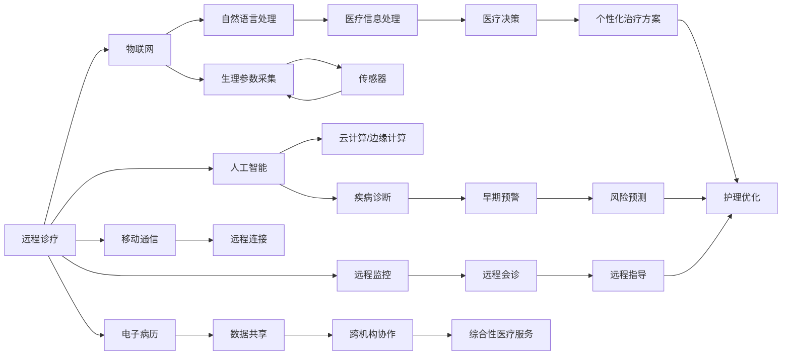

                 

## 1. 背景介绍

### 1.1 问题由来

随着科技的不断进步，人类对医疗的依赖程度也在逐渐加深。医疗体系正面临多重挑战：人口老龄化、医疗资源分布不均、疾病种类繁多、医疗费用高涨等。传统医疗模式在这些问题面前显得力不从心。特别是2020年新冠疫情的爆发，揭示了远程诊疗的巨大潜力，促使全球加速推动医疗系统的数字化转型。

在疫情冲击下，远程诊疗、智能护理等新技术在医疗领域大放异彩。通过人工智能技术，可以实现实时远程监控、精准疾病诊断、个性化治疗方案制定等，极大提高了医疗效率和患者满意度。未来，伴随技术的进一步成熟和应用场景的拓展，远程诊疗和智能护理将成为智慧医疗的主要形态，推动医疗系统向着更加智能化、个性化、高效化的方向发展。

### 1.2 问题核心关键点

智慧医疗的核心在于通过先进的技术手段，提升医疗服务的质量和效率。远程诊疗和智能护理正是这一理念的具体体现：

- **远程诊疗**：通过先进的通信技术和人工智能技术，实现医生与患者、医疗设备和医疗机构的远程连接，打破地域限制，提供高质量的医疗服务。
- **智能护理**：利用传感器、机器学习和大数据分析等技术，实时监控和分析患者的生理参数，提前预测疾病风险，及时调整护理方案，提升护理效果。

本文将深入探讨远程诊疗和智能护理的技术原理与实践方法，结合具体案例分析，展示其在未来智慧医疗中的应用前景。

## 2. 核心概念与联系

### 2.1 核心概念概述

智慧医疗涵盖多个领域和多个环节，包括但不限于远程诊疗、智能护理、电子病历、医疗大数据等。本文重点关注远程诊疗和智能护理。

- **远程诊疗**：利用互联网和移动通信技术，将患者与医生连接起来，实现医疗服务的远程化、移动化。常见的技术手段包括视频会议、远程监测、电子病历等。
- **智能护理**：通过传感器和智能设备采集患者的生理参数，利用机器学习和数据分析技术，实时监控和预测患者的健康状况，及时调整护理措施。

这两者的实现离不开以下几个关键技术：

- **人工智能与机器学习**：用于疾病诊断、智能决策等。
- **物联网**：用于生理参数的采集与传输。
- **云计算与边缘计算**：用于数据存储与处理。
- **自然语言处理**：用于医疗信息的自动处理与分析。
- **移动通信**：用于远程连接。

这些技术之间存在紧密的联系，共同构成了智慧医疗的完整框架。通过技术整合，可以实现从疾病预防、早期诊断、治疗、护理到康复的全过程智能化管理。

### 2.2 核心概念原理和架构的 Mermaid 流程图



## 3. 核心算法原理 & 具体操作步骤

### 3.1 算法原理概述

远程诊疗和智能护理涉及的核心算法包括：

- **图像识别与分类**：用于识别和分类医疗影像，如X光片、CT扫描等。
- **自然语言处理**：用于分析医疗记录、患者问答等文本信息，提供智能诊断建议。
- **信号处理与数据分析**：用于生理参数的实时监控和分析，预测疾病风险。
- **推荐系统**：用于个性化治疗方案的推荐。

这些算法通常基于深度学习技术，利用大量的医疗数据进行预训练，并在此基础上进行微调。预训练-微调范式可以显著提升算法的性能，降低对标注数据的需求。

### 3.2 算法步骤详解

远程诊疗和智能护理的实现流程大致如下：

1. **数据采集与传输**：
   - 利用物联网技术，通过传感器采集患者的生理参数（如心率、血压、血糖等）。
   - 采集的视频、音频等医疗信息通过移动通信网络传输到云端。

2. **数据预处理**：
   - 将采集到的数据进行清洗、格式转换、归一化等预处理，为后续算法输入准备数据。
   - 利用自然语言处理技术，对医疗记录、患者问答等文本信息进行分词、实体识别、情感分析等处理。

3. **模型训练与微调**：
   - 选择合适的深度学习模型（如卷积神经网络、循环神经网络、Transformer等）进行训练。
   - 利用大量医疗数据进行预训练，得到通用医疗知识表示。
   - 根据特定应用场景，进行微调，适应具体任务需求。

4. **实时推理与反馈**：
   - 将预处理后的数据输入训练好的模型，进行实时推理，得到诊断结果、风险预警、护理建议等。
   - 利用云计算平台，对推理结果进行分布式计算，提高处理效率。
   - 通过移动通信网络，将推理结果反馈给医生或患者，提供实时指导。

5. **反馈优化与迭代**：
   - 根据医生的反馈，对模型进行迭代优化，进一步提升诊断准确性和护理效果。
   - 利用用户反馈数据，持续优化算法，实现自我学习与适应。

### 3.3 算法优缺点

远程诊疗和智能护理算法具有以下优点：

- **实时性**：利用云计算与边缘计算，能够实现实时处理和反馈，提高医疗效率。
- **广泛性**：基于深度学习，适应性强，能够应用于多种医疗场景。
- **个性化**：通过个性化的推荐系统，提供量身定制的治疗方案。
- **低成本**：减少对医疗资源的依赖，降低医疗成本。

同时，也存在以下缺点：

- **数据隐私**：医疗数据的隐私保护问题较为敏感，需加强数据加密和隐私保护措施。
- **算法复杂性**：深度学习模型训练复杂，需要大量计算资源。
- **模型解释性**：深度学习模型的黑盒特性，可能导致诊断结果难以解释，降低医生和患者的信任度。
- **技术门槛高**：医疗领域的应用场景复杂，对技术要求较高，需要跨学科人才。

### 3.4 算法应用领域

远程诊疗和智能护理技术在多个领域得到了广泛应用，包括但不限于：

- **医院管理**：通过电子病历、远程会诊、医疗影像分析等技术，提升医院运营效率。
- **公共卫生**：利用远程监控和预警系统，及时发现和应对突发公共卫生事件。
- **慢性病管理**：通过传感器采集生理参数，实时监控慢性病患者的健康状况，提供个性化护理建议。
- **养老护理**：利用远程诊疗和智能护理，提升老年人的医疗保障和生活质量。
- **远程教学**：通过医疗专家远程授课，提升医学教育的质量和覆盖面。

未来，随着技术的进一步发展和应用场景的拓展，远程诊疗和智能护理将应用于更多领域，为人类健康事业注入新的动力。

## 4. 数学模型和公式 & 详细讲解 & 举例说明

### 4.1 数学模型构建

远程诊疗和智能护理涉及的数学模型包括但不限于：

- **卷积神经网络**：用于医疗影像分类，模型结构为：$y = Wx + b$，其中 $W$ 为卷积核，$x$ 为输入图像，$y$ 为分类结果。
- **循环神经网络**：用于医疗文本分析，模型结构为：$h_t = f(h_{t-1}, x_t)$，其中 $h_t$ 为隐藏状态，$f$ 为激活函数，$x_t$ 为输入文本。
- **支持向量机**：用于疾病诊断，模型结构为：$\min_{w, b} \frac{1}{2} ||w||^2 + C\sum_{i=1}^n h_i(y_i(w \cdot x_i + b))$，其中 $h_i$ 为决策函数，$w$ 为权重向量，$b$ 为偏置，$C$ 为正则化参数。

### 4.2 公式推导过程

以卷积神经网络为例，其分类公式为：

$$
y = Wx + b
$$

其中 $W$ 为卷积核，$x$ 为输入图像，$b$ 为偏置，$y$ 为分类结果。假设 $x \in \mathbb{R}^m$，$W \in \mathbb{R}^{n \times m}$，$b \in \mathbb{R}^n$，$y \in \mathbb{R}^n$。

对于输入图像 $x$，卷积核 $W$ 进行卷积操作，得到特征图 $h = Wx$，然后加上偏置 $b$，并通过激活函数 $f$ 映射得到分类结果 $y$：

$$
y = f(Wx + b)
$$

常见的激活函数有 ReLU、Sigmoid、Tanh 等。激活函数的作用是增加模型的非线性性，提升模型的表达能力。

### 4.3 案例分析与讲解

以智能护理中的生理参数监测为例，假设传感器采集到患者的脉搏、血压、血糖等生理参数，将这些参数输入卷积神经网络进行分类：

1. **数据预处理**：将采集到的生理参数进行归一化、去噪、采样等预处理。
2. **卷积操作**：将预处理后的数据输入卷积神经网络，通过多个卷积层提取特征。
3. **全连接层**：将卷积层输出的特征图输入全连接层，进行分类预测。
4. **激活函数**：对全连接层的输出进行 ReLU 激活，得到最终分类结果。
5. **损失函数**：使用交叉熵损失函数衡量分类结果与真实标签之间的差异，最小化损失函数，更新模型参数。

## 5. 项目实践：代码实例和详细解释说明

### 5.1 开发环境搭建

远程诊疗和智能护理的实现需要强大的计算资源和数据处理能力。以下是使用 Python 进行开发的环境配置流程：

1. **安装 Python**：从官网下载并安装 Python 3.x。
2. **安装 PyTorch**：使用 pip 安装 PyTorch 深度学习框架。
3. **安装 TensorFlow**：使用 pip 安装 TensorFlow 深度学习框架。
4. **安装 Keras**：使用 pip 安装 Keras 深度学习框架。
5. **安装 OpenCV**：使用 pip 安装 OpenCV 计算机视觉库。
6. **安装 scikit-learn**：使用 pip 安装 scikit-learn 机器学习库。
7. **安装 NLTK**：使用 pip 安装 NLTK 自然语言处理库。

完成上述步骤后，即可在 Python 环境中进行远程诊疗和智能护理的开发。

### 5.2 源代码详细实现

以智能护理中的生理参数监测为例，给出使用 Python 进行卷积神经网络训练的代码实现。

```python
import torch
import torch.nn as nn
import torch.optim as optim
import torchvision.transforms as transforms
from torch.utils.data import DataLoader
from torchvision.datasets import CIFAR10

# 定义卷积神经网络模型
class Net(nn.Module):
    def __init__(self):
        super(Net, self).__init__()
        self.conv1 = nn.Conv2d(1, 32, 3, 1)
        self.conv2 = nn.Conv2d(32, 64, 3, 1)
        self.fc1 = nn.Linear(64 * 8 * 8, 128)
        self.fc2 = nn.Linear(128, 10)

    def forward(self, x):
        x = self.conv1(x)
        x = nn.functional.relu(x)
        x = self.conv2(x)
        x = nn.functional.relu(x)
        x = nn.functional.max_pool2d(x, 2)
        x = x.view(-1, 64 * 8 * 8)
        x = self.fc1(x)
        x = nn.functional.relu(x)
        x = self.fc2(x)
        output = nn.functional.softmax(x, dim=1)
        return output

# 定义训练函数
def train(model, device, train_loader, optimizer, epoch):
    model.train()
    for batch_idx, (data, target) in enumerate(train_loader):
        data, target = data.to(device), target.to(device)
        optimizer.zero_grad()
        output = model(data)
        loss = nn.functional.cross_entropy(output, target)
        loss.backward()
        optimizer.step()
        if batch_idx % 100 == 0:
            print('Train Epoch: {} [{}/{} ({:.0f}%)]\tLoss: {:.6f}'.format(
                epoch, batch_idx * len(data), len(train_loader.dataset),
                100. * batch_idx / len(train_loader), loss.item()))

# 定义测试函数
def test(model, device, test_loader):
    model.eval()
    test_loss = 0
    correct = 0
    with torch.no_grad():
        for data, target in test_loader:
            data, target = data.to(device), target.to(device)
            output = model(data)
            test_loss += nn.functional.cross_entropy(output, target, reduction='sum').item()
            pred = output.argmax(dim=1, keepdim=True)
            correct += pred.eq(target.view_as(pred)).sum().item()

    test_loss /= len(test_loader.dataset)
    print('Test set: Average loss: {:.4f}, Accuracy: {}/{} ({:.0f}%)\n'.format(
        test_loss, correct, len(test_loader.dataset),
        100. * correct / len(test_loader.dataset)))

# 训练模型
net = Net().to(device)
optimizer = optim.Adam(net.parameters(), lr=0.001)
train_loader = DataLoader(CIFAR10(root='./data', train=True, download=True, transform=transforms.ToTensor()), batch_size=64, shuffle=True)
test_loader = DataLoader(CIFAR10(root='./data', train=False, download=True, transform=transforms.ToTensor()), batch_size=64, shuffle=False)

for epoch in range(10):
    train(net, device, train_loader, optimizer, epoch)
    test(net, device, test_loader)
```

以上代码实现了一个简单的卷积神经网络模型，用于对 CIFAR-10 数据集进行分类。通过改变卷积核大小、激活函数、全连接层等超参数，可以进一步优化模型的性能。

### 5.3 代码解读与分析

代码中的关键步骤包括：

1. **定义卷积神经网络模型**：通过继承 nn.Module，定义模型结构，包括卷积层、激活函数、全连接层等。
2. **定义训练函数**：通过循环遍历数据集，计算损失函数，反向传播更新模型参数。
3. **定义测试函数**：通过循环遍历数据集，计算测试集上的损失和准确率。
4. **训练模型**：通过循环迭代训练函数，对模型进行训练，并在测试集上评估性能。

代码中的超参数包括学习率、批大小等，需要通过实验确定最优值。此外，还可以使用数据增强、正则化等技术进一步提升模型性能。

## 6. 实际应用场景

### 6.1 智能养老

智能养老是远程诊疗和智能护理的重要应用场景之一。通过智能穿戴设备采集老年人的生理参数，如心率、血压、血氧饱和度等，结合卷积神经网络、循环神经网络等算法，实现实时健康监测和预警。

具体实现流程如下：

1. **数据采集**：通过智能手环、智能手表等设备采集老年人的生理参数。
2. **数据传输**：通过移动通信网络将采集到的数据传输到云端。
3. **数据处理**：对传输数据进行清洗、归一化等预处理。
4. **模型训练**：利用历史数据对卷积神经网络、循环神经网络等模型进行训练，得到通用医疗知识表示。
5. **实时推理**：将实时采集的数据输入训练好的模型，进行实时监控和预警。
6. **反馈优化**：根据医生的反馈，对模型进行迭代优化，提升诊断准确性和护理效果。

智能养老的实现可以有效减少老年人的医疗费用，提升老年人的生活质量。

### 6.2 远程诊疗

远程诊疗是远程诊疗技术的重要应用场景之一。通过视频会议、远程监控等技术，实现医生与患者的远程连接，提升医疗服务的可及性和效率。

具体实现流程如下：

1. **数据采集**：通过摄像头、麦克风等设备采集患者的症状描述、医疗影像等。
2. **数据传输**：通过移动通信网络将采集到的数据传输到云端。
3. **数据处理**：对传输数据进行分词、实体识别、情感分析等预处理。
4. **模型训练**：利用大量医疗数据对自然语言处理模型进行预训练，并在此基础上进行微调，得到适合特定任务的模型。
5. **实时推理**：将患者描述输入训练好的模型，进行实时分析，提供诊断建议和治疗方案。
6. **反馈优化**：根据医生的反馈，对模型进行迭代优化，提升诊断准确性和护理效果。

远程诊疗的实现可以有效缓解医疗资源不足的问题，提高医疗服务的覆盖面和效率。

### 6.3 慢性病管理

慢性病管理是智能护理的重要应用场景之一。通过传感器采集慢性病患者的生理参数，结合卷积神经网络、循环神经网络等算法，实现实时健康监测和护理优化。

具体实现流程如下：

1. **数据采集**：通过智能穿戴设备采集慢性病患者的生理参数，如血糖、血压、心率等。
2. **数据传输**：通过移动通信网络将采集到的数据传输到云端。
3. **数据处理**：对传输数据进行清洗、归一化等预处理。
4. **模型训练**：利用历史数据对卷积神经网络、循环神经网络等模型进行训练，得到适合特定任务的模型。
5. **实时推理**：将实时采集的数据输入训练好的模型，进行实时监控和护理优化。
6. **反馈优化**：根据医生的反馈，对模型进行迭代优化，提升诊断准确性和护理效果。

慢性病管理的实现可以有效减少慢性病患者的医疗费用，提升慢性病管理的效率和效果。

## 7. 工具和资源推荐

### 7.1 学习资源推荐

为了帮助开发者系统掌握远程诊疗和智能护理的理论基础和实践技巧，这里推荐一些优质的学习资源：

1. 《深度学习》（周志华著）：系统介绍了深度学习的基本概念、原理和应用，是深度学习领域的经典教材。
2. 《Python深度学习》（Francois Chollet著）：详细讲解了 TensorFlow、Keras 等深度学习框架的实现原理和应用场景。
3. 《机器学习实战》（Peter Harrington著）：通过实际案例讲解了机器学习的基本算法和应用，适合入门学习。
4. Coursera 的《Deep Learning Specialization》：由深度学习领域的专家 Andrew Ng 授课，系统讲解了深度学习的基本概念和应用。
5. Kaggle 的数据集和竞赛：提供了丰富的医疗数据集和机器学习竞赛，适合实战练习。

通过对这些资源的学习实践，相信你一定能够快速掌握远程诊疗和智能护理的核心技术，并用于解决实际的医疗问题。

### 7.2 开发工具推荐

高效的开发离不开优秀的工具支持。以下是几款用于远程诊疗和智能护理开发的常用工具：

1. Python：开源且广泛使用的编程语言，生态丰富，适合深度学习和数据处理。
2. PyTorch：基于 Python 的开源深度学习框架，灵活动态的计算图，适合快速迭代研究。
3. TensorFlow：由 Google 主导开发的开源深度学习框架，生产部署方便，适合大规模工程应用。
4. Keras：基于 TensorFlow 和 Theano 的深度学习框架，简单易用，适合快速搭建模型。
5. OpenCV：计算机视觉库，提供了丰富的图像处理和分析工具，适合医疗影像分析。
6. scikit-learn：机器学习库，提供了各种常用的机器学习算法和工具，适合数据处理和模型训练。

合理利用这些工具，可以显著提升远程诊疗和智能护理的开发效率，加快创新迭代的步伐。

### 7.3 相关论文推荐

远程诊疗和智能护理技术的发展源于学界的持续研究。以下是几篇奠基性的相关论文，推荐阅读：

1. Convolutional Neural Networks for Medical Imaging（卷积神经网络在医学影像中的应用）：提出了卷积神经网络在医学影像分类中的应用，显著提高了医学影像识别的准确性。
2. Long Short-Term Memory Networks for Health Care（长短时记忆网络在医疗中的应用）：提出了长短时记忆网络在医疗文本分析中的应用，提升了医疗文本处理的效率和效果。
3. Machine Learning and Artificial Intelligence in the Age of Medicine（机器学习与人工智能在医学中的应用）：系统介绍了机器学习与人工智能在医疗中的各种应用，包括疾病诊断、医疗影像分析等。
4. Deep Learning in Healthcare（深度学习在医疗中的应用）：介绍了深度学习在医疗中的各种应用，包括疾病预测、基因分析等。
5. Medical Image Analysis with Deep Learning：An Overview（基于深度学习的医学图像分析概述）：系统介绍了基于深度学习的医学图像分析技术，包括卷积神经网络、生成对抗网络等。

这些论文代表了大语言模型微调技术的发展脉络。通过学习这些前沿成果，可以帮助研究者把握学科前进方向，激发更多的创新灵感。

## 8. 总结：未来发展趋势与挑战

### 8.1 研究成果总结

远程诊疗和智能护理技术在医疗领域的应用已经取得了显著成效。通过深度学习和大数据技术，实现了实时健康监测、个性化治疗方案制定、跨机构协作等，提升了医疗服务的质量和效率。

### 8.2 未来发展趋势

未来，远程诊疗和智能护理技术将呈现以下几个发展趋势：

1. **技术集成化**：通过与物联网、云计算、边缘计算等技术的深度融合，实现更加智能化、高效化的医疗服务。
2. **数据共享化**：建立数据共享平台，实现医疗数据跨机构、跨地域的共享，提升医疗资源的利用效率。
3. **应用场景多样化**：拓展应用场景，应用于老年护理、慢性病管理、公共卫生等领域，推动智慧医疗的全面发展。
4. **个性化医疗**：通过机器学习和大数据分析，实现个性化治疗方案的制定和调整，提升医疗服务的精准性和效果。
5. **跨学科发展**：促进医学、计算机科学、人工智能等领域的交叉融合，推动医疗技术的发展。

### 8.3 面临的挑战

尽管远程诊疗和智能护理技术已经取得了显著进展，但在迈向更加智能化、普适化应用的过程中，仍面临诸多挑战：

1. **数据隐私和安全**：医疗数据的隐私保护问题较为敏感，需加强数据加密和隐私保护措施。
2. **技术标准化**：远程诊疗和智能护理技术涉及多种技术手段，需要建立统一的技术标准和规范。
3. **医生和患者的信任度**：深度学习模型的黑盒特性，可能导致诊断结果难以解释，降低医生和患者的信任度。
4. **模型复杂性和计算资源**：深度学习模型的训练复杂，需要大量计算资源，限制了模型的应用场景。
5. **伦理和法律问题**：医疗数据的使用涉及伦理和法律问题，需制定相关法规和规范。

### 8.4 研究展望

面对远程诊疗和智能护理所面临的挑战，未来的研究需要在以下几个方面寻求新的突破：

1. **数据隐私保护**：开发更加高效的数据加密和隐私保护技术，保护患者隐私。
2. **模型解释性**：开发更加透明的深度学习模型，提高医生和患者的信任度。
3. **技术标准化**：制定统一的技术标准和规范，推动远程诊疗和智能护理技术的规范化应用。
4. **跨学科合作**：促进医学、计算机科学、人工智能等领域的交叉融合，推动医疗技术的发展。

## 9. 附录：常见问题与解答

**Q1：远程诊疗和智能护理技术如何实现？**

A: 远程诊疗和智能护理技术主要基于深度学习和大数据技术，利用大量医疗数据进行预训练，并在此基础上进行微调。具体实现包括数据采集与传输、数据预处理、模型训练与微调、实时推理与反馈、反馈优化与迭代等步骤。

**Q2：数据隐私和安全如何保护？**

A: 医疗数据的隐私和安全保护是远程诊疗和智能护理技术面临的重要问题。需采取以下措施：
1. 数据加密：对医疗数据进行加密处理，防止数据泄露。
2. 数据脱敏：对医疗数据进行脱敏处理，去除敏感信息。
3. 权限控制：建立严格的权限控制机制，防止未经授权的访问。
4. 安全传输：通过 SSL/TLS 等安全协议，保障数据传输安全。

**Q3：远程诊疗和智能护理技术的应用场景有哪些？**

A: 远程诊疗和智能护理技术可以应用于多种医疗场景，包括但不限于：
1. 医院管理：通过电子病历、远程会诊、医疗影像分析等技术，提升医院运营效率。
2. 公共卫生：利用远程监控和预警系统，及时发现和应对突发公共卫生事件。
3. 慢性病管理：通过传感器采集生理参数，实时监控慢性病患者的健康状况，提供个性化护理建议。
4. 养老护理：利用远程诊疗和智能护理，提升老年人的医疗保障和生活质量。
5. 远程教学：通过医疗专家远程授课，提升医学教育的质量和覆盖面。

**Q4：未来远程诊疗和智能护理技术的发展方向有哪些？**

A: 未来，远程诊疗和智能护理技术将朝以下几个方向发展：
1. 技术集成化：通过与物联网、云计算、边缘计算等技术的深度融合，实现更加智能化、高效化的医疗服务。
2. 数据共享化：建立数据共享平台，实现医疗数据跨机构、跨地域的共享，提升医疗资源的利用效率。
3. 应用场景多样化：拓展应用场景，应用于老年护理、慢性病管理、公共卫生等领域，推动智慧医疗的全面发展。
4. 个性化医疗：通过机器学习和大数据分析，实现个性化治疗方案的制定和调整，提升医疗服务的精准性和效果。
5. 跨学科发展：促进医学、计算机科学、人工智能等领域的交叉融合，推动医疗技术的发展。

**Q5：远程诊疗和智能护理技术面临的挑战有哪些？**

A: 远程诊疗和智能护理技术面临以下挑战：
1. 数据隐私和安全：医疗数据的隐私保护问题较为敏感，需加强数据加密和隐私保护措施。
2. 技术标准化：远程诊疗和智能护理技术涉及多种技术手段，需要建立统一的技术标准和规范。
3. 医生和患者的信任度：深度学习模型的黑盒特性，可能导致诊断结果难以解释，降低医生和患者的信任度。
4. 技术复杂性和计算资源：深度学习模型的训练复杂，需要大量计算资源，限制了模型的应用场景。
5. 伦理和法律问题：医疗数据的使用涉及伦理和法律问题，需制定相关法规和规范。

---

作者：禅与计算机程序设计艺术 / Zen and the Art of Computer Programming

