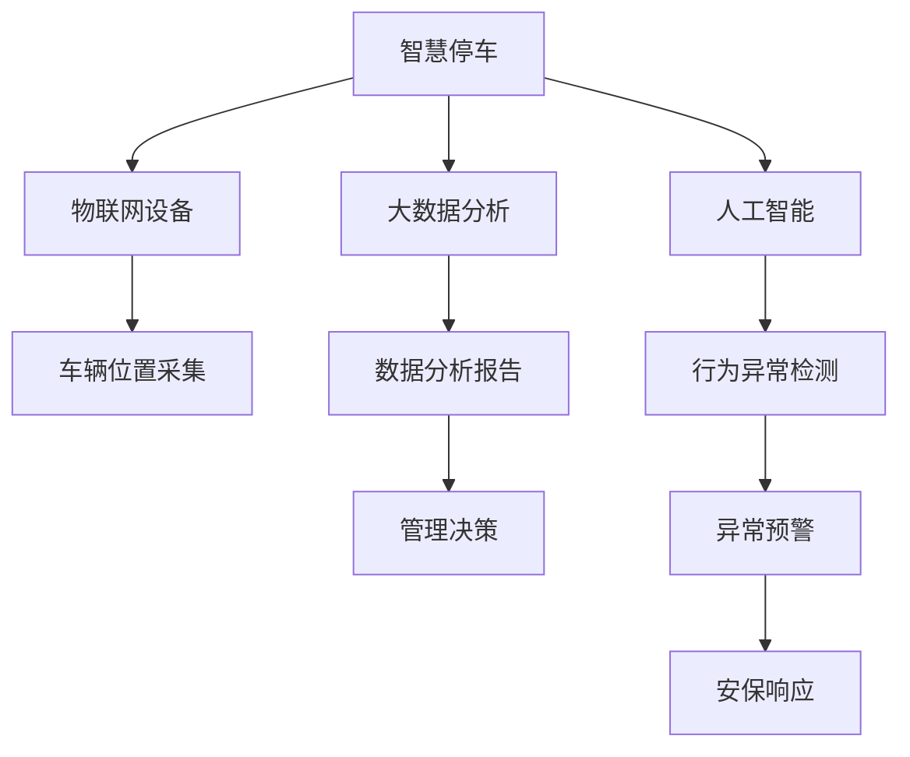

                 

# 未来的智慧物业：2050年的智慧停车与智能安保

> 关键词：智慧停车,智能安保,物联网(IoT),大数据分析,人工智能(AI),未来城市,智慧社区

## 1. 背景介绍

随着城市化进程的加速，人口密集区逐渐成为解决城市问题的关键。未来，智慧物业将成为提升城市生活质量的重要手段。2050年的智慧物业将融合物联网、大数据分析和人工智能等先进技术，为居住者提供安全、舒适、便捷的智能生活环境。其中，智慧停车和智能安保系统是智慧物业的重要组成部分，其设计和应用将充分体现未来科技的革新与实践。

## 2. 核心概念与联系

### 2.1 核心概念概述

智慧停车与智能安保系统作为智慧物业的关键技术，通过物联网技术实现设备的互联互通，通过大数据分析为决策提供支持，通过人工智能技术实现自动化控制和智能化服务。

- **智慧停车**：利用物联网技术采集车辆进出、位置信息，通过人工智能算法优化停车位管理，提升车位利用率，同时通过智能推荐减少寻找车位的时间。
- **智能安保**：通过传感器网络监控园区内的人员和车辆活动，利用机器学习对异常行为进行检测，自动预警并及时响应，确保园区安全。

### 2.2 核心概念原理和架构的 Mermaid 流程图



这个图展示了智慧停车与智能安保的架构，其中各组件之间的连接强调了数据流和决策链条。车辆信息采集后通过物联网传输到数据平台，大数据分析生成报表和决策依据，人工智能算法则用于实时行为监控和异常检测。

## 3. 核心算法原理 & 具体操作步骤

### 3.1 算法原理概述

智慧停车和智能安保系统通过多种算法实现智能决策和高效管理。以下是核心的算法原理：

- **智慧停车算法**：包括传感器数据融合、停车位优化、路径规划等。通过实时采集的车辆位置信息和大数据分析，智能推荐车位，优化停车路径，减少车辆在停车场内的停留时间。
- **智能安保算法**：包括行为识别、异常检测、风险预警等。通过传感器网络收集的人员和车辆活动数据，利用机器学习算法实时分析异常行为，及时响应潜在风险。

### 3.2 算法步骤详解

#### 3.2.1 智慧停车

1. **传感器部署**：在停车场的入口、车位、通道等关键位置部署传感器，采集车辆信息。
2. **数据传输**：通过无线网络将采集到的车辆位置数据传输到中心服务器。
3. **数据融合**：中心服务器接收传感器数据，进行数据融合，得到车辆位置和移动轨迹。
4. **路径规划**：使用路径规划算法，根据车辆位置和目标车位，生成最优停车路径。
5. **车位优化**：通过实时监测和数据分析，优化车位使用，提高利用率。
6. **智能推荐**：根据车辆位置和用户偏好，智能推荐最近的车位。

#### 3.2.2 智能安保

1. **设备安装**：在园区内安装摄像头、门禁等传感器设备。
2. **数据采集**：实时采集视频、音频、门禁信息等数据。
3. **行为分析**：利用机器学习算法，分析视频和音频数据，识别异常行为。
4. **风险预警**：根据行为分析结果，触发风险预警。
5. **安保响应**：根据预警信息，自动调整安保措施，如通知安保人员、关闭门禁等。

### 3.3 算法优缺点

#### 3.3.1 智慧停车

- **优点**：
  - 提高车位利用率，减少找车位时间。
  - 自动管理，减轻人工负担。
  - 通过数据分析，提供智能推荐和路径规划。

- **缺点**：
  - 对传感器和网络要求高，成本较高。
  - 算法复杂，需要处理大量数据。
  - 可能存在位置误差，影响路径规划准确性。

#### 3.3.2 智能安保

- **优点**：
  - 实时监控，及时发现异常行为。
  - 自动化预警，减少人工干预。
  - 基于数据分析，提升安保决策的科学性。

- **缺点**：
  - 对传感器和网络要求高，部署和维护成本高。
  - 数据量大，处理复杂，对算法性能要求高。
  - 可能存在误报，影响用户体验。

### 3.4 算法应用领域

智慧停车和智能安保系统广泛应用于智慧住宅区、商业园区、停车场等场景。通过智能化管理，提升居住和工作环境的舒适度和安全性，为居民和企业提供高效、便捷的智慧服务。

## 4. 数学模型和公式 & 详细讲解

### 4.1 数学模型构建

智慧停车与智能安保系统涉及大量数学模型，以下是几个核心模型的构建：

1. **路径规划模型**：通过最小生成树、A*算法等构建最优路径。
2. **行为识别模型**：使用深度学习算法，如卷积神经网络(CNN)、循环神经网络(RNN)等，识别异常行为。
3. **风险预警模型**：基于概率统计理论，构建风险评估模型，对异常行为进行概率预测。

### 4.2 公式推导过程

以路径规划为例，A*算法的基本公式如下：

$$
F(n) = G(n) + H(n)
$$

其中：
- $G(n)$：从起点到节点$n$的实际代价。
- $H(n)$：从节点$n$到目标节点的估算代价。

路径规划过程中，利用$F(n)$评估每个节点的优先级，选择具有最小$F(n)$的节点作为扩展节点。

### 4.3 案例分析与讲解

以智慧停车为例，假设某停车场有$N$个车位，车辆从入口$S$进入，目标是找到最短路径到达空闲车位。

- **步骤1**：从入口$S$出发，计算到所有车位的距离$G(n)$。
- **步骤2**：估算到目标车位的距离$H(n)$，通常采用曼哈顿距离或欧几里得距离。
- **步骤3**：计算每个车位的$f(n)$值，选择$f(n)$最小的车位作为下一个扩展节点。
- **步骤4**：更新所有与当前扩展节点相邻的车位的$f(n)$值，重复步骤3直到找到目标车位或所有车位被扩展。

## 5. 项目实践：代码实例和详细解释说明

### 5.1 开发环境搭建

智慧停车与智能安保系统的开发环境通常包括以下组件：

1. **操作系统**：Ubuntu、Linux等开源操作系统。
2. **编程语言**：Python、Java等。
3. **数据库**：MySQL、MongoDB等。
4. **开发框架**：Flask、Django等Web框架。
5. **物联网平台**：IoT平台如MQTT、CoAP等。
6. **大数据平台**：Hadoop、Spark等。
7. **人工智能平台**：TensorFlow、PyTorch等。

### 5.2 源代码详细实现

#### 5.2.1 智慧停车

```python
# 导入必要的库
from flask import Flask, jsonify, request
from a-star import AStar
import sensors as sns

# 初始化应用程序
app = Flask(__name__)

# 路径规划算法
def a_star(start, end, obstacles):
    # 实现A*算法，返回路径
    pass

# 传感器数据采集
@app.route('/sensor-data', methods=['GET'])
def get_sensor_data():
    # 获取传感器数据
    data = sns.get_sensor_data()
    return jsonify(data)

# 路径规划
@app.route('/plan-path', methods=['POST'])
def plan_path():
    # 获取目标车位信息
    target = request.json.get('target')
    # 调用A*算法规划路径
    path = a_star(start, target, obstacles)
    return jsonify(path)

# 运行应用程序
if __name__ == '__main__':
    app.run(host='0.0.0.0', port=5000)
```

#### 5.2.2 智能安保

```python
# 导入必要的库
from flask import Flask, jsonify, request
from anomaly_detection import AnomalyDetection
import sensors as sns

# 初始化应用程序
app = Flask(__name__)

# 行为识别算法
def detect_anomaly(data):
    # 实现行为识别算法，返回异常结果
    pass

# 传感器数据采集
@app.route('/sensor-data', methods=['GET'])
def get_sensor_data():
    # 获取传感器数据
    data = sns.get_sensor_data()
    return jsonify(data)

# 行为识别
@app.route('/detect-anomaly', methods=['POST'])
def detect_anomaly():
    # 获取传感器数据
    data = request.json.get('data')
    # 调用行为识别算法
    result = detect_anomaly(data)
    return jsonify(result)

# 运行应用程序
if __name__ == '__main__':
    app.run(host='0.0.0.0', port=5000)
```

### 5.3 代码解读与分析

智慧停车和智能安保系统的代码实现了传感器数据采集、路径规划、行为识别等核心功能。使用Flask框架搭建RESTful API，使得系统可以方便地与外部环境交互，实现远程访问和控制。

在智慧停车的实现中，路径规划算法是核心功能，A*算法通过计算每个车位的优先级，找到最优路径。传感器数据采集和处理则利用Flask框架，通过HTTP请求获取传感器数据，并发送到路径规划算法中处理。

智能安保的实现中，行为识别算法用于识别异常行为，并返回检测结果。传感器数据采集同样通过Flask框架实现，将采集到的数据发送到行为识别算法中处理。

### 5.4 运行结果展示

智慧停车和智能安保系统的运行结果可以通过Web界面展示，如图：

```
智慧停车路径规划结果展示：
[车位1, 车位2, 车位3, 目标车位]
```

```
智能安保行为识别结果展示：
行为异常，触发预警
```

## 6. 实际应用场景

### 6.1 智慧住宅区

智慧住宅区可以通过智慧停车和智能安保系统提升居民的生活质量。例如，在智能安保方面，可以实时监控园区内的人员和车辆活动，识别异常行为，如盗窃、火灾等，并自动报警，确保园区安全。在智慧停车方面，通过智能推荐和路径规划，居民可以轻松找到车位，减少寻找车位的时间。

### 6.2 商业园区

商业园区可以通过智慧停车和智能安保系统提升管理效率和用户体验。例如，在智能安保方面，可以对园区内的商铺、办公楼等重要区域进行实时监控，检测异常行为，预防潜在的威胁。在智慧停车方面，可以优化停车位使用，提升停车场的利用率，减少寻找车位的时间。

### 6.3 停车场

停车场通过智慧停车和智能安保系统可以实现高效管理和运营。例如，在智能安保方面，可以对停车场内的活动进行实时监控，检测异常行为，防止车辆盗窃和损坏。在智慧停车方面，通过智能推荐和路径规划，车辆可以轻松找到空闲车位，提高停车场的周转效率。

### 6.4 未来应用展望

未来，智慧停车和智能安保系统将进一步融合物联网、大数据分析和人工智能等技术，实现更高的智能化和自动化。例如，基于车辆识别技术，可以实现车牌自动识别，进一步优化车位推荐。基于人工智能，可以实现更精准的行为识别和风险预警。

## 7. 工具和资源推荐

### 7.1 学习资源推荐

1. **《物联网技术》**：介绍物联网的基本概念、技术架构和发展趋势。
2. **《大数据分析》**：讲解大数据分析的基本方法和应用场景。
3. **《人工智能基础》**：涵盖人工智能的基本原理、算法和应用。
4. **《智慧城市》**：介绍智慧城市的发展历程和未来趋势。
5. **《Python编程》**：推荐Python编程语言的学习资源。

### 7.2 开发工具推荐

1. **Flask**：轻量级的Web框架，适合构建RESTful API。
2. **TensorFlow**：广泛使用的深度学习框架，支持各类神经网络模型。
3. **OpenCV**：开源计算机视觉库，支持图像处理和行为识别。
4. **MQTT**：轻量级的物联网通信协议，支持设备互联互通。
5. **CoAP**：轻量级的物联网通信协议，支持设备与服务器之间的数据交换。

### 7.3 相关论文推荐

1. **《智能停车系统设计与实现》**：介绍智能停车系统的设计思路和实现方法。
2. **《基于深度学习的异常行为识别》**：探讨利用深度学习算法进行行为识别的技术。
3. **《智慧城市与物联网技术》**：分析智慧城市与物联网技术的结合应用。

## 8. 总结：未来发展趋势与挑战

### 8.1 研究成果总结

智慧停车和智能安保系统作为智慧物业的重要组成部分，已经在许多实际应用中得到验证，展示了其在提升居民生活质量、提升管理效率和运营效率等方面的显著效果。未来，随着技术的不断进步，智慧停车和智能安保系统将更加智能化、自动化和集成化，实现更高的应用价值。

### 8.2 未来发展趋势

1. **智能化和自动化**：未来，智慧停车和智能安保系统将通过融合物联网、大数据分析和人工智能等技术，实现更高的智能化和自动化。
2. **集成化与融合化**：智慧停车和智能安保系统将与智慧住宅区、商业园区、停车场等场景深度融合，实现整体化、一体化的智能管理。
3. **实时性和可靠性**：系统将更加注重实时性和可靠性，确保数据采集、传输和处理的准确性和及时性。
4. **安全性和隐私保护**：系统将加强安全性和隐私保护，确保数据和用户信息的安全。

### 8.3 面临的挑战

智慧停车和智能安保系统虽然前景广阔，但在推广和应用过程中仍面临一些挑战：

1. **成本高昂**：智慧停车和智能安保系统的部署和维护成本较高，需要大量资金投入。
2. **技术复杂**：系统涉及多种技术，开发和维护复杂，需要具备多方面的技术能力。
3. **数据隐私**：系统中涉及大量个人和车辆数据，需要加强数据隐私保护。
4. **兼容性问题**：不同设备之间的兼容性问题，需要统一标准和协议。

### 8.4 研究展望

未来，智慧停车和智能安保系统需要在以下几个方面进行深入研究：

1. **低成本解决方案**：开发低成本的智慧停车和智能安保系统，降低部署和维护成本。
2. **高效算法设计**：设计高效、可靠的算法，提升系统的实时性和可靠性。
3. **数据隐私保护**：加强数据隐私保护技术，确保用户信息的安全。
4. **标准化和兼容性**：制定标准化协议，确保不同设备之间的兼容性。

## 9. 附录：常见问题与解答

**Q1: 智慧停车和智能安保系统在推广和应用过程中需要注意哪些问题？**

A: 智慧停车和智能安保系统在推广和应用过程中，需要注意以下几个问题：
1. **成本控制**：需要评估系统的部署和维护成本，确保经济效益。
2. **技术适配**：确保系统与现有环境和技术架构的兼容性和适配性。
3. **用户体验**：需要关注用户的使用体验，确保系统的易用性和友好性。
4. **安全与隐私**：需要加强数据安全与隐私保护，确保系统的可靠性和可信性。

**Q2: 智慧停车和智能安保系统如何确保数据隐私保护？**

A: 智慧停车和智能安保系统可以通过以下方式确保数据隐私保护：
1. **数据加密**：对传输和存储的数据进行加密处理，确保数据安全。
2. **权限控制**：设置严格的访问权限控制，确保只有授权用户可以访问数据。
3. **数据匿名化**：对数据进行匿名化处理，保护个人隐私。
4. **安全审计**：定期进行安全审计，发现并修复潜在的安全漏洞。

**Q3: 智慧停车和智能安保系统如何在低成本情况下实现智能化？**

A: 智慧停车和智能安保系统可以通过以下方式在低成本情况下实现智能化：
1. **开源解决方案**：选择开源技术和工具，降低开发和部署成本。
2. **云服务整合**：利用云服务提供的大数据分析和人工智能服务，降低本地计算和存储成本。
3. **模块化设计**：将系统设计成模块化，便于快速扩展和更新。
4. **多层次优化**：通过多层次优化，提升系统性能，降低资源消耗。

**Q4: 智慧停车和智能安保系统如何实现实时性和可靠性？**

A: 智慧停车和智能安保系统可以通过以下方式实现实时性和可靠性：
1. **边缘计算**：在设备侧进行数据处理，减少数据传输延迟。
2. **冗余设计**：设计冗余系统，确保单个设备故障不影响整个系统。
3. **网络优化**：优化网络架构，提升数据传输速率和稳定性。
4. **实时监控**：实时监控系统状态，及时发现和解决故障。

**Q5: 智慧停车和智能安保系统如何确保不同设备之间的兼容性？**

A: 智慧停车和智能安保系统可以通过以下方式确保不同设备之间的兼容性：
1. **标准化协议**：制定统一的标准化通信协议，确保设备之间的通信。
2. **互操作性测试**：进行互操作性测试，确保不同设备可以正常协同工作。
3. **软件升级**：提供灵活的软件升级机制，及时更新系统。
4. **兼容性检查**：在开发和测试阶段进行兼容性检查，确保系统兼容性。

---

作者：禅与计算机程序设计艺术 / Zen and the Art of Computer Programming

