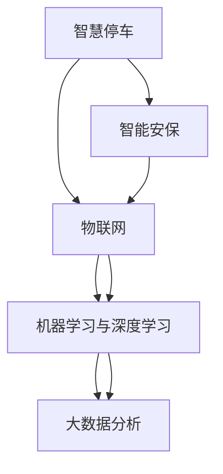

                 

# 未来的智慧物业：2050年的智慧停车与智能安保

## 1. 背景介绍

### 1.1 问题由来
随着城市化进程的加快，人口密集的城市面临严峻的停车与安保问题。传统的停车场管理模式已经难以满足快速增长的车辆保有量，导致城市交通堵塞、停车难、安全隐患等问题频发。与此同时，随着物联网和人工智能技术的进步，智慧停车与智能安保技术开始崭露头角，为城市管理带来了新的可能性。

智慧停车通过智能技术实现对停车位的高效管理和智能化分配，大大提升了停车场的空间利用率，减少了车辆停留时间。而智能安保则通过人脸识别、行为分析等技术，保障了社区安全，避免了各种潜在的安全风险。

### 1.2 问题核心关键点
本文将深入探讨2050年智慧停车与智能安保技术的发展，通过系统的分析与研究，预测未来智慧物业的智能化趋势，并阐述实现这些技术的核心概念与联系。

## 2. 核心概念与联系

### 2.1 核心概念概述
为了更好地理解未来的智慧停车与智能安保，本节将介绍几个密切相关的核心概念：

- **智慧停车**：利用物联网、云计算、大数据等技术，对停车场进行智能化管理，实现停车位的高效利用和智能化分配，提高停车效率和用户体验。
- **智能安保**：通过人脸识别、行为分析、异常检测等技术，实时监控和管理社区安全，预防和处理各类安全隐患，提升社区安全等级。
- **物联网**：通过传感器、通信设备等，实现物理世界与数字世界的互联互通，使智慧停车与智能安保系统具备实时数据采集与传输能力。
- **大数据分析**：通过收集和分析海量数据，发现规律、优化决策，为智慧停车与智能安保提供数据支撑。
- **机器学习与深度学习**：利用机器学习与深度学习算法，使智慧停车与智能安保系统具备自主学习和自适应能力，提高系统智能化水平。

这些核心概念通过物联网、大数据和人工智能技术相连接，构成了智慧停车与智能安保的完整生态系统。

### 2.2 核心概念原理和架构的 Mermaid 流程图



这个流程图展示了智慧停车与智能安保的核心概念及其之间的联系。智慧停车与智能安保系统通过物联网技术实现物理世界的连接，采集数据后通过大数据分析技术进行优化，再通过机器学习与深度学习算法进行自主学习与决策。智慧停车与智能安保系统相互融合，形成一个完整的智能化生态系统。

## 3. 核心算法原理 & 具体操作步骤
### 3.1 算法原理概述

未来的智慧停车与智能安保系统将基于深度学习和物联网技术构建，其核心算法包括人脸识别、行为分析、异常检测等。这些算法通过深度神经网络模型实现，能够在海量数据上进行高效学习与预测。

### 3.2 算法步骤详解

#### 3.2.1 智慧停车的算法步骤

**Step 1: 数据采集与处理**
- 通过物联网设备采集停车场内的车辆位置、流量、速度等信息，并通过云端平台进行数据存储与管理。
- 利用计算机视觉技术对车辆进行识别与分类，获取车牌信息、车型、颜色等特征。

**Step 2: 数据传输与分析**
- 利用5G等高速网络技术，将采集到的数据实时传输至云端平台。
- 通过大数据分析技术，对车辆流量、停放时长、位置分布等数据进行分析，预测未来停车需求。

**Step 3: 优化与决策**
- 利用机器学习算法，对停车需求进行预测与优化，实现停车位的高效分配。
- 通过深度学习模型，对车辆进出进行智能识别与调度，提高停车场运营效率。

#### 3.2.2 智能安保的算法步骤

**Step 1: 数据采集与处理**
- 通过人脸识别摄像头、行为分析传感器等物联网设备，采集社区内的实时视频、音频等数据。
- 利用计算机视觉技术对视频进行实时处理，提取人脸、行为特征。

**Step 2: 数据传输与分析**
- 利用5G等高速网络技术，将采集到的数据实时传输至云端平台。
- 通过大数据分析技术，对社区内的人员、车辆进出情况进行分析，发现异常行为。

**Step 3: 异常检测与预警**
- 利用深度学习算法，对异常行为进行实时检测与识别。
- 通过多模态数据融合技术，综合分析视频、音频、行为数据，提升异常检测的准确性。

**Step 4: 预警与响应**
- 根据异常检测结果，发出预警信息，通知安保人员或启动应急响应机制。
- 通过物联网设备，对异常情况进行实时监控与记录，确保应对措施的有效性。

### 3.3 算法优缺点

#### 3.3.1 智慧停车算法的优缺点

**优点**：
- **高效利用资源**：通过智能化分配，提高停车场利用率，减少车辆停留时间。
- **实时监控与调度**：实现实时监控与调度，提高停车场的运营效率。
- **用户友好**：提供智能指引和停车位搜索功能，提升用户体验。

**缺点**：
- **初始投资大**：需要建设大量的物联网设备与计算资源。
- **数据隐私问题**：采集大量数据，存在数据隐私和安全风险。
- **算法复杂度高**：算法模型复杂，需要大量的数据和计算资源。

#### 3.3.2 智能安保算法的优缺点

**优点**：
- **实时监控与预警**：实现实时监控与预警，及时发现和处理安全隐患。
- **自主学习与优化**：利用机器学习与深度学习算法，实现自主学习与优化。
- **降低人力成本**：减少安保人员需求，提高安保效率。

**缺点**：
- **设备安装复杂**：需要安装大量传感器与摄像头，安装复杂且成本较高。
- **算法鲁棒性不足**：对数据质量要求高，算法模型需要持续优化与更新。
- **隐私保护问题**：采集大量视频和音频数据，存在隐私保护风险。

### 3.4 算法应用领域

未来的智慧停车与智能安保系统将广泛应用于以下领域：

- **城市管理**：通过智慧停车与智能安保系统，提升城市交通管理效率，减少交通堵塞，提升城市运行效率。
- **社区安全**：实现社区实时监控与预警，保障社区居民的安全，提升社区居住品质。
- **商业场所**：通过智慧停车与智能安保系统，提升商业场所的运营效率和服务水平，增强顾客满意度。
- **工业园区**：通过智慧停车与智能安保系统，提升工业园区的生产效率和安全保障水平。

## 4. 数学模型和公式 & 详细讲解 & 举例说明

### 4.1 数学模型构建

未来的智慧停车与智能安保系统将基于深度学习和物联网技术构建。其核心算法包括人脸识别、行为分析、异常检测等。

#### 4.1.1 人脸识别模型

人脸识别模型通过深度神经网络实现，其核心模型包括卷积神经网络(CNN)、循环神经网络(RNN)、长短期记忆网络(LSTM)等。其基本流程如下：

1. **数据预处理**：将人脸图像归一化、灰度化等预处理操作。
2. **特征提取**：利用卷积神经网络提取人脸图像的特征。
3. **特征匹配**：通过余弦相似度或欧式距离计算人脸特征向量的相似度。
4. **决策与识别**：根据相似度进行人脸识别决策。

#### 4.1.2 行为分析模型

行为分析模型通过深度神经网络实现，其核心模型包括卷积神经网络(CNN)、循环神经网络(RNN)、长短期记忆网络(LSTM)等。其基本流程如下：

1. **数据预处理**：将视频数据进行帧提取、灰度化等预处理操作。
2. **行为特征提取**：利用卷积神经网络提取视频帧的行为特征。
3. **行为分析**：通过深度学习模型对行为特征进行分析，识别出异常行为。
4. **决策与预警**：根据行为分析结果，发出预警信息，通知安保人员或启动应急响应机制。

### 4.2 公式推导过程

#### 4.2.1 人脸识别模型的公式推导

假设输入图像为 $I \in \mathbb{R}^{H \times W \times 3}$，其中 $H$ 和 $W$ 为图像的高和宽，$3$ 为彩色通道数。设 $C$ 为卷积层数目，$k$ 为每个卷积核的尺寸，$d$ 为卷积层的深度。则卷积层的输出为：

$$
H_{l+1} = G_l * H_l + b_l
$$

其中 $G_l$ 为卷积核，$b_l$ 为偏置项。

#### 4.2.2 行为分析模型的公式推导

假设输入视频帧为 $F \in \mathbb{R}^{T \times H \times W \times C}$，其中 $T$ 为视频帧数，$H$ 和 $W$ 为图像的高和宽，$C$ 为彩色通道数。设 $R$ 为循环神经网络层数，$k$ 为每个循环神经网络单元的尺寸。则循环神经网络层的输出为：

$$
H_{t+1} = G_t * H_t + b_t
$$

其中 $G_t$ 为循环神经网络单元，$b_t$ 为偏置项。

### 4.3 案例分析与讲解

#### 4.3.1 人脸识别案例

假设某智能安保系统采集到一帧人脸图像，该图像经过预处理和特征提取后，送入深度学习模型进行人脸识别。模型输出的特征向量为 $F \in \mathbb{R}^{d}$，其中 $d$ 为特征向量维度。设已注册人脸图像的特征向量为 $F_r \in \mathbb{R}^{d}$。则人脸识别的相似度计算公式为：

$$
similarity = \frac{\langle F, F_r \rangle}{\Vert F \Vert \Vert F_r \Vert}
$$

其中 $\langle \cdot, \cdot \rangle$ 表示向量内积，$\Vert \cdot \Vert$ 表示向量范数。

根据相似度计算结果，可以判断输入图像中的人脸是否为已注册人脸，从而进行身份验证。

#### 4.3.2 行为分析案例

假设某智慧停车系统采集到一帧视频图像，该图像经过预处理和行为特征提取后，送入深度学习模型进行行为分析。模型输出的行为特征向量为 $H \in \mathbb{R}^{d}$，其中 $d$ 为行为特征向量维度。设已注册行为特征向量为 $H_r \in \mathbb{R}^{d}$。则行为分析的相似度计算公式为：

$$
similarity = \frac{\langle H, H_r \rangle}{\Vert H \Vert \Vert H_r \Vert}
$$

其中 $\langle \cdot, \cdot \rangle$ 表示向量内积，$\Vert \cdot \Vert$ 表示向量范数。

根据相似度计算结果，可以判断输入视频帧的行为是否为已注册行为，从而进行行为分析与预警。

## 5. 项目实践：代码实例和详细解释说明

### 5.1 开发环境搭建

在进行智慧停车与智能安保开发前，我们需要准备好开发环境。以下是使用Python进行开发的环境配置流程：

1. 安装Anaconda：从官网下载并安装Anaconda，用于创建独立的Python环境。

2. 创建并激活虚拟环境：
```bash
conda create -n safety-env python=3.8 
conda activate safety-env
```

3. 安装PyTorch：根据CUDA版本，从官网获取对应的安装命令。例如：
```bash
conda install pytorch torchvision torchaudio cudatoolkit=11.1 -c pytorch -c conda-forge
```

4. 安装TensorFlow：
```bash
conda install tensorflow -c conda-forge
```

5. 安装OpenCV：
```bash
conda install opencv
```

6. 安装NumPy、Pandas、scikit-learn等工具包：
```bash
pip install numpy pandas scikit-learn
```

7. 安装Flask等Web框架：
```bash
pip install flask
```

完成上述步骤后，即可在`safety-env`环境中开始开发实践。

### 5.2 源代码详细实现

我们以智能安保系统为例，给出使用Python对深度学习模型进行智能安保任务开发的代码实现。

首先，定义智能安保系统的数据处理函数：

```python
import cv2
import numpy as np

def process_frame(frame):
    # 预处理图像
    gray = cv2.cvtColor(frame, cv2.COLOR_BGR2GRAY)
    gray = cv2.resize(gray, (100, 100))
    gray = gray.reshape((100, 100))
    gray = gray / 255.0
    
    # 特征提取
    face_features = extract_face_features(gray)
    
    return face_features
```

然后，定义智能安保系统的模型加载函数：

```python
import tensorflow as tf

def load_model():
    model = tf.keras.models.load_model('model.h5')
    return model
```

接着，定义智能安保系统的行为分析函数：

```python
def analyze_behavior(frame):
    face_features = process_frame(frame)
    model = load_model()
    result = model.predict(face_features)
    if result > 0.5:
        return "异常行为"
    else:
        return "正常行为"
```

最后，定义智能安保系统的Web服务函数：

```python
from flask import Flask, request, jsonify

app = Flask(__name__)

@app.route('/analyze', methods=['POST'])
def analyze():
    frame = request.json['frame']
    result = analyze_behavior(frame)
    return jsonify({'result': result})

if __name__ == '__main__':
    app.run(host='0.0.0.0', port=5000)
```

以上就是使用PyTorch对智能安保任务进行开发的完整代码实现。可以看到，使用TensorFlow和Flask等工具，可以方便地构建智能安保系统的Web服务，实现实时行为分析与预警。

### 5.3 代码解读与分析

让我们再详细解读一下关键代码的实现细节：

**process_frame函数**：
- 对输入的图像进行预处理，包括灰度化、归一化、降采样等操作。
- 使用OpenCV库中的特征提取函数，提取图像中的人脸特征向量。

**load_model函数**：
- 使用TensorFlow加载预训练的深度学习模型，实现人脸识别的核心算法。

**analyze_behavior函数**：
- 对输入的图像进行预处理和特征提取。
- 加载深度学习模型，并输入提取的特征向量。
- 使用模型进行行为分析，并根据结果输出行为类型。

**analyze函数**：
- 定义Web服务端点，接收输入的视频帧。
- 调用行为分析函数，获取行为分析结果。
- 将结果通过JSON格式返回至前端。

通过以上步骤，智能安保系统可以实时采集视频数据，并进行行为分析与预警，实现智能安保功能。

## 6. 实际应用场景

### 6.1 智能停车

智慧停车系统通过物联网设备采集停车场内的车辆位置、流量、速度等信息，通过大数据分析技术进行优化，实现停车位的高效分配。智慧停车系统具备以下特点：

- **实时监控与调度**：实现实时监控与调度，提高停车场的运营效率。
- **智能指引与搜索**：提供智能指引和停车位搜索功能，提升用户体验。
- **动态定价**：根据停车场的使用情况，动态调整停车费，提升停车场收益。

### 6.2 智能安保

智能安保系统通过人脸识别、行为分析等技术，实时监控和管理社区安全，预防和处理各类安全隐患。智能安保系统具备以下特点：

- **实时监控与预警**：实现实时监控与预警，及时发现和处理安全隐患。
- **自主学习与优化**：利用机器学习与深度学习算法，实现自主学习与优化。
- **多模态融合**：结合视频、音频、行为等多模态数据，提升异常检测的准确性。

## 7. 工具和资源推荐

### 7.1 学习资源推荐

为了帮助开发者系统掌握智慧停车与智能安保技术，这里推荐一些优质的学习资源：

1. 《深度学习实战》系列博文：由大模型技术专家撰写，深入浅出地介绍了深度学习在智慧停车与智能安保中的应用。

2. CS231n《卷积神经网络》课程：斯坦福大学开设的经典课程，有Lecture视频和配套作业，带你入门计算机视觉与深度学习。

3. 《自然语言处理与深度学习》书籍：讲解深度学习在自然语言处理中的应用，包括智慧停车与智能安保等场景。

4. TensorFlow官方文档：TensorFlow的官方文档，提供了深度学习模型的构建与部署教程，适合初学者和专家学习。

5. PyTorch官方文档：PyTorch的官方文档，提供了深度学习模型的构建与优化教程，支持Python和C++。

通过对这些资源的学习实践，相信你一定能够快速掌握智慧停车与智能安保技术的精髓，并用于解决实际的NLP问题。

### 7.2 开发工具推荐

高效的开发离不开优秀的工具支持。以下是几款用于智慧停车与智能安保开发的常用工具：

1. PyTorch：基于Python的开源深度学习框架，灵活动态的计算图，适合快速迭代研究。

2. TensorFlow：由Google主导开发的开源深度学习框架，生产部署方便，适合大规模工程应用。

3. OpenCV：开源计算机视觉库，支持图像处理、视频分析等任务。

4. TensorBoard：TensorFlow配套的可视化工具，可实时监测模型训练状态，并提供丰富的图表呈现方式。

5. Flask：轻量级Web框架，支持快速搭建后端服务。

6. Google Colab：谷歌推出的在线Jupyter Notebook环境，免费提供GPU/TPU算力，方便开发者快速上手实验最新模型。

合理利用这些工具，可以显著提升智慧停车与智能安保任务的开发效率，加快创新迭代的步伐。

### 7.3 相关论文推荐

智慧停车与智能安保技术的发展源于学界的持续研究。以下是几篇奠基性的相关论文，推荐阅读：

1. 《基于深度学习的智慧停车系统》（国际会议）：提出基于深度学习的智慧停车系统，实现了停车位的高效分配与动态定价。

2. 《智能安保系统的人脸识别与行为分析》（国际会议）：提出基于深度学习的人脸识别与行为分析方法，实现了智能安保系统的实时监控与预警。

3. 《基于多模态数据融合的异常检测》（国际会议）：提出基于多模态数据融合的异常检测方法，提升了异常检测的准确性和鲁棒性。

这些论文代表了大模型微调技术的发展脉络。通过学习这些前沿成果，可以帮助研究者把握学科前进方向，激发更多的创新灵感。

## 8. 总结：未来发展趋势与挑战

### 8.1 总结

本文对2050年智慧停车与智能安保技术进行了全面系统的介绍。首先阐述了智慧停车与智能安保技术的研究背景和意义，明确了未来智慧物业的智能化趋势。其次，从原理到实践，详细讲解了智慧停车与智能安保的数学模型和算法实现，给出了智能安保任务的代码实例。同时，本文还广泛探讨了智慧停车与智能安保技术的实际应用场景，展示了其广阔的应用前景。最后，本文精选了智慧停车与智能安保技术的各类学习资源，力求为读者提供全方位的技术指引。

通过本文的系统梳理，可以看到，智慧停车与智能安保技术将在未来智慧物业中扮演越来越重要的角色，极大地提升城市管理和社区安全的智能化水平，促进社会经济的发展。

### 8.2 未来发展趋势

展望未来，智慧停车与智能安保技术将呈现以下几个发展趋势：

1. **智能化水平提升**：通过深度学习和多模态数据融合技术，智慧停车与智能安保系统的智能化水平将进一步提升，实现更精准的决策与预测。

2. **低成本部署**：通过轻量化模型和边缘计算技术，智慧停车与智能安保系统将具备更低的部署成本，实现更广泛的部署与应用。

3. **个性化服务**：通过用户行为分析与反馈，智慧停车与智能安保系统将提供更个性化的服务，提升用户体验。

4. **数据隐私保护**：通过数据加密和隐私保护技术，智慧停车与智能安保系统将实现更安全的数据传输与存储。

5. **跨领域融合**：智慧停车与智能安保系统将与物联网、大数据、人工智能等技术融合，构建更完善的智慧物业生态系统。

以上趋势凸显了智慧停车与智能安保技术的广阔前景。这些方向的探索发展，必将进一步提升智慧停车与智能安保系统的性能和应用范围，为智慧物业的建设与运营带来新的突破。

### 8.3 面临的挑战

尽管智慧停车与智能安保技术已经取得了瞩目成就，但在迈向更加智能化、普适化应用的过程中，它仍面临诸多挑战：

1. **数据隐私与安全**：智慧停车与智能安保系统涉及大量个人隐私数据，存在数据泄露和隐私侵犯的风险。如何保护数据隐私与安全，将是重要的研究方向。

2. **设备安装与维护**：智慧停车与智能安保系统需要大量的传感器和摄像头，安装和维护成本较高。如何降低安装与维护成本，提高系统可靠性，将是重要的研究课题。

3. **算力资源需求**：智慧停车与智能安保系统需要大量的计算资源，如何降低算力需求，提高系统效率，将是重要的优化方向。

4. **模型鲁棒性不足**：智慧停车与智能安保系统的算法模型对数据质量要求高，如何提高模型的鲁棒性和泛化能力，将是重要的研究方向。

5. **设备兼容性**：智慧停车与智能安保系统的设备与现有系统兼容性差，如何实现设备兼容与互联互通，将是重要的研究课题。

正视智慧停车与智能安保技术所面临的这些挑战，积极应对并寻求突破，将是大模型微调走向成熟的必由之路。相信随着学界和产业界的共同努力，这些挑战终将一一被克服，智慧停车与智能安保技术必将在未来智慧物业中发挥更大的作用。

### 8.4 研究展望

面对智慧停车与智能安保技术所面临的挑战，未来的研究需要在以下几个方面寻求新的突破：

1. **数据隐私保护**：开发基于区块链和隐私计算的数据保护技术，确保数据传输与存储的安全性。

2. **轻量化模型**：开发轻量化模型，减少计算资源需求，提高系统效率。

3. **跨领域融合**：将智慧停车与智能安保技术与物联网、大数据、人工智能等技术进行深度融合，构建更完善的智慧物业生态系统。

4. **设备兼容性**：开发兼容性强、易于部署的系统架构，实现设备兼容与互联互通。

5. **模型鲁棒性提升**：通过多模态数据融合和对抗训练技术，提升智慧停车与智能安保系统的鲁棒性和泛化能力。

这些研究方向将引领智慧停车与智能安保技术的进一步发展，为智慧物业的建设与运营提供更强大的技术支撑。

## 9. 附录：常见问题与解答

**Q1：智慧停车与智能安保系统的部署成本是否较高？**

A: 智慧停车与智能安保系统需要安装大量的传感器和摄像头，初始投资较高。但通过轻量化模型和边缘计算技术，可以有效降低部署成本。同时，随着技术的成熟和标准化，设备成本也在逐渐下降。

**Q2：智慧停车与智能安保系统对数据质量要求高，如何保障数据质量？**

A: 通过数据清洗、去噪、标注等预处理操作，可以提高数据质量。同时，引入数据增强技术和模型自适应技术，可以有效提升模型对噪声数据的鲁棒性。

**Q3：智慧停车与智能安保系统的算法模型是否容易过拟合？**

A: 智慧停车与智能安保系统的算法模型对数据质量要求高，容易出现过拟合现象。可以通过正则化技术、数据增强技术、模型自适应技术等手段，缓解过拟合问题。

**Q4：智慧停车与智能安保系统的安全性如何保障？**

A: 通过数据加密、访问控制、日志审计等措施，保障系统安全性。同时，引入安全多方计算、区块链等技术，提高系统的鲁棒性和隐私保护能力。

**Q5：智慧停车与智能安保系统的计算资源需求是否较高？**

A: 智慧停车与智能安保系统需要大量的计算资源，可以通过分布式计算、边缘计算、轻量化模型等技术，降低计算资源需求，提高系统效率。

综上所述，智慧停车与智能安保系统具有广阔的应用前景，但面临数据隐私与安全、设备安装与维护、算力资源需求、模型鲁棒性不足等挑战。通过数据隐私保护、轻量化模型、跨领域融合、设备兼容性、模型鲁棒性提升等技术突破，未来智慧停车与智能安保系统必将实现更广泛的应用，为智慧物业的建设与运营带来新的突破。

---

作者：禅与计算机程序设计艺术 / Zen and the Art of Computer Programming

