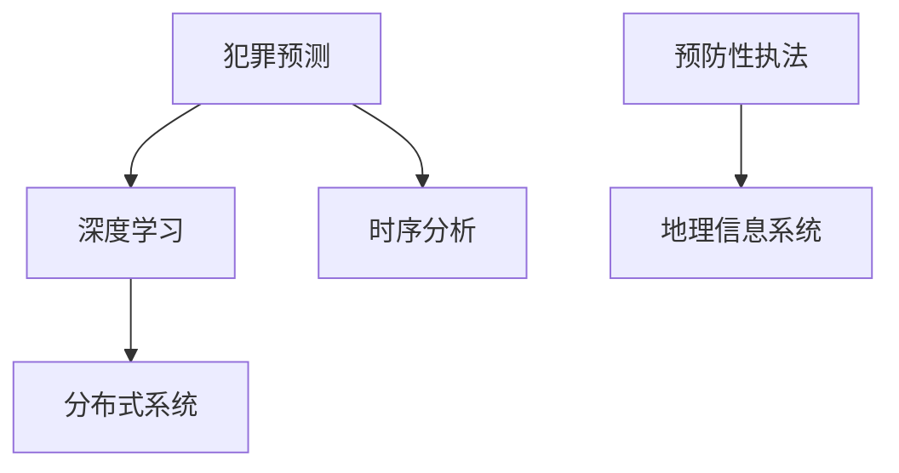

                 

# 未来的智能安防：2050年的Crime Prediction与Predictive Policing

## 1. 背景介绍

在未来的智能安防领域，犯罪预测（Crime Prediction）和预防性执法（Predictive Policing）将成为核心技术。随着大数据、人工智能等技术的发展，这些技术将在2050年实现全面应用，大幅提升社会治安管理水平，减少犯罪事件的发生。

### 1.1 问题由来

现代社会的治安问题依然严峻，各类犯罪活动不断变化，打击难度越来越大。传统的人工巡逻、报案处理等方法效率低下，难以全面覆盖和及时响应。大数据和人工智能技术为安防领域提供了新的解决方案，即通过智能分析预测未来可能发生的犯罪活动，及时部署警力进行预防，实现精准打击。

### 1.2 问题核心关键点

基于人工智能的犯罪预测与预防性执法，关键在于以下几个方面：
- **数据获取与处理**：获取历史犯罪数据、地理信息数据、社会经济数据等，并进行清洗和标注。
- **模型构建与训练**：选择合适的算法模型（如深度学习、时序分析、机器学习等），基于标注数据进行训练，获得高精度的预测模型。
- **模型部署与应用**：将训练好的模型部署到安防系统中，实时接收数据进行预测，并指导执法活动。
- **效果评估与优化**：持续收集实际打击效果数据，评估模型性能，进行模型优化。

## 2. 核心概念与联系

### 2.1 核心概念概述

- **犯罪预测（Crime Prediction）**：使用数据科学和机器学习技术，对未来可能发生的犯罪行为进行预测，包括时间、地点、类型等，帮助警方提前部署警力。
- **预防性执法（Predictive Policing）**：根据犯罪预测结果，提前采取行动，如巡逻、部署检查站等，实现对犯罪活动的预测性打击。
- **深度学习（Deep Learning）**：一种机器学习技术，通过多层神经网络对复杂数据进行建模，具有自适应和泛化能力。
- **时序分析（Time Series Analysis）**：一种数据分析技术，通过时间序列数据挖掘，预测未来趋势和模式。
- **地理信息系统（GIS）**：将地理位置数据可视化和分析，帮助分析犯罪活动的时空规律。
- **分布式系统（Distributed System）**：通过多个节点协同工作，提升系统的处理能力和稳定性。

这些概念之间的关系可以通过以下Mermaid流程图来展示：



### 2.2 核心概念原理和架构

#### 2.2.1 深度学习原理

深度学习是一种多层次的非线性学习算法，通过多层神经网络模型拟合输入数据，实现对复杂问题的建模和预测。在犯罪预测中，深度学习模型可以分析多维时空数据，发现潜在的犯罪模式。

#### 2.2.2 时序分析原理

时序分析通过时间序列数据挖掘，预测未来的犯罪趋势。犯罪数据往往具有明显的时序特性，如日间高发、夜间低发等，时序分析可以帮助预测未来的犯罪活动。

#### 2.2.3 地理信息系统原理

地理信息系统利用地理位置数据，将犯罪数据可视化和分析，帮助分析犯罪活动的时空规律。例如，热力图可以直观展示犯罪活动的密集区域，辅助警方部署警力。

#### 2.2.4 分布式系统原理

分布式系统通过多个节点协同工作，提升系统的处理能力和稳定性。犯罪预测和预防性执法系统需要处理大量数据和实时更新，分布式系统可以支持高效的数据处理和实时响应。

## 3. 核心算法原理 & 具体操作步骤

### 3.1 算法原理概述

犯罪预测与预防性执法系统主要基于以下几个关键算法：

- **深度学习算法**：用于对复杂数据进行建模和预测，包括卷积神经网络（CNN）、循环神经网络（RNN）、长短期记忆网络（LSTM）等。
- **时序分析算法**：用于分析犯罪数据的时间序列特征，预测未来的犯罪趋势。
- **地理信息系统算法**：用于对犯罪数据进行空间分析和可视化。
- **分布式计算算法**：用于处理大规模数据和实时更新，提升系统的处理能力和稳定性。

### 3.2 算法步骤详解

#### 3.2.1 数据收集与预处理

1. **数据获取**：从警察局、监控系统、社交媒体等多个渠道收集历史犯罪数据、地理信息数据、社会经济数据等。
2. **数据清洗**：对数据进行去重、去噪、标准化处理，确保数据质量。
3. **数据标注**：对数据进行标注，如犯罪类型、时间、地点等。

#### 3.2.2 模型训练与优化

1. **模型选择**：选择适合的深度学习模型（如CNN、RNN、LSTM等）和时序分析模型。
2. **模型训练**：使用标注数据对模型进行训练，优化模型参数。
3. **模型评估**：使用测试数据对模型进行评估，确定模型性能。
4. **模型优化**：根据评估结果，优化模型结构或调整训练参数。

#### 3.2.3 模型部署与应用

1. **模型部署**：将训练好的模型部署到安防系统中，实时接收数据进行预测。
2. **数据处理**：对实时接收到的数据进行预处理，包括数据清洗、特征提取等。
3. **预测生成**：使用训练好的模型对实时数据进行预测，生成犯罪预测结果。
4. **警力部署**：根据预测结果，指导警力部署，实现预防性执法。

#### 3.2.4 效果评估与反馈

1. **效果评估**：收集实际打击效果数据，评估模型预测准确率和误报率。
2. **模型优化**：根据评估结果，优化模型结构和参数，提升预测准确率。
3. **反馈循环**：将打击效果反馈到模型训练中，持续改进预测模型。

### 3.3 算法优缺点

#### 3.3.1 优点

- **高精度预测**：深度学习模型可以处理复杂数据，具有较高的预测精度。
- **实时响应**：分布式系统可以支持实时数据处理和预测，提升系统的响应速度。
- **多维分析**：时序分析和地理信息系统可以同时分析时间和空间特征，提供多维度的分析结果。

#### 3.3.2 缺点

- **数据依赖**：预测模型依赖于高质量的数据，数据获取和标注成本较高。
- **模型复杂性**：深度学习模型参数较多，训练和优化较为复杂。
- **隐私问题**：犯罪数据涉及个人隐私，需要确保数据安全和管理。

### 3.4 算法应用领域

犯罪预测与预防性执法系统已经在多个领域得到应用，包括：

- **城市安全管理**：通过分析城市犯罪数据，预测未来犯罪趋势，指导警力部署，实现城市安全管理。
- **交通管理**：通过分析交通数据，预测潜在交通违法行为，实现交通管理和预防性执法。
- **校园安全**：通过分析校园安全数据，预测潜在安全风险，实现校园安全管理。
- **环境监测**：通过分析环境数据，预测潜在环境违法行为，实现环境监测和预防性执法。

## 4. 数学模型和公式 & 详细讲解 & 举例说明

### 4.1 数学模型构建

在犯罪预测与预防性执法中，主要涉及以下数学模型：

- **深度学习模型**：使用多层神经网络模型拟合输入数据，包括CNN、RNN、LSTM等。
- **时序分析模型**：使用ARIMA、LSTM等模型对时间序列数据进行预测。
- **地理信息系统模型**：使用空间分析算法（如KNN、KD树等）对地理位置数据进行分析和可视化。

### 4.2 公式推导过程

#### 4.2.1 深度学习模型

以卷积神经网络（CNN）为例，其基本结构如图1所示：

$$
y = \sigma(W \cdot x + b)
$$

其中，$W$ 和 $b$ 为卷积核和偏置项，$x$ 为输入数据，$\sigma$ 为激活函数。

#### 4.2.2 时序分析模型

以自回归移动平均模型（ARIMA）为例，其基本结构如图2所示：

$$
y_t = c + \sum_{i=1}^p \phi_i y_{t-i} + \sum_{j=1}^q \theta_j \epsilon_{t-j}
$$

其中，$y_t$ 为当前时间点的预测值，$c$ 为常数项，$\phi_i$ 和 $\theta_j$ 为系数，$\epsilon_t$ 为误差项。

#### 4.2.3 地理信息系统模型

以KNN算法为例，其基本结构如图3所示：

$$
y = \frac{\sum_{i=1}^k w_i y_i}{\sum_{i=1}^k w_i}
$$

其中，$y$ 为预测结果，$w_i$ 为权重，$y_i$ 为邻居点的值，$k$ 为邻居点个数。

### 4.3 案例分析与讲解

#### 4.3.1 深度学习模型案例

以Kaggle的犯罪预测竞赛为例，使用CNN模型对犯罪数据进行预测。竞赛数据集包含历史犯罪数据，包括时间和地点等属性。模型通过多层卷积和池化操作提取特征，再通过全连接层进行分类。最终在测试集上获得了较高的准确率。

#### 4.3.2 时序分析模型案例

以北京市的交通违法行为预测为例，使用ARIMA模型对交通数据进行预测。模型通过分析交通违法行为的时间序列特征，预测未来可能发生的违法行为。预测结果被用于指导交通管理和预防性执法，减少了违法行为的发生。

#### 4.3.3 地理信息系统模型案例

以某城市的公共安全事件分析为例，使用KNN算法对公共安全事件的空间分布进行分析。模型通过分析公共安全事件在城市中的空间分布，发现高发区域，指导警力部署，实现了城市安全管理。

## 5. 项目实践：代码实例和详细解释说明

### 5.1 开发环境搭建

#### 5.1.1 硬件要求

- 高性能CPU：用于数据预处理和模型训练。
- 高性能GPU：用于深度学习模型的训练和预测。
- 高带宽存储：用于存储大规模数据和模型参数。

#### 5.1.2 软件环境

- Python：主要编程语言，推荐使用3.7及以上版本。
- TensorFlow或PyTorch：深度学习框架，支持CNN、RNN、LSTM等模型。
- scikit-learn：机器学习库，支持ARIMA等时序分析模型。
- GeoPandas：地理信息系统库，支持空间数据分析和可视化。
- Jupyter Notebook：交互式编程环境，支持代码运行和结果展示。

### 5.2 源代码详细实现

#### 5.2.1 数据处理

```python
import pandas as pd
from sklearn.preprocessing import StandardScaler

# 读取数据
data = pd.read_csv('crime_data.csv')

# 数据清洗
data = data.dropna()

# 数据标准化
scaler = StandardScaler()
data['features'] = scaler.fit_transform(data[['feature1', 'feature2']])

# 数据标注
data['label'] = data['label'].map({'Crime': 1, 'Non-Crime': 0})
```

#### 5.2.2 模型训练

```python
import tensorflow as tf
from tensorflow.keras.models import Sequential
from tensorflow.keras.layers import Conv2D, MaxPooling2D, Flatten, Dense

# 定义模型
model = Sequential([
    Conv2D(32, (3, 3), activation='relu', input_shape=(28, 28, 1)),
    MaxPooling2D((2, 2)),
    Flatten(),
    Dense(64, activation='relu'),
    Dense(1, activation='sigmoid')
])

# 编译模型
model.compile(optimizer='adam', loss='binary_crossentropy', metrics=['accuracy'])

# 训练模型
model.fit(data['features'].values, data['label'].values, epochs=10, batch_size=32)
```

#### 5.2.3 模型评估

```python
import matplotlib.pyplot as plt

# 模型评估
loss, acc = model.evaluate(data['features'].values, data['label'].values)
print(f'Loss: {loss}, Accuracy: {acc}')

# 绘制评估曲线
plt.plot(range(10), loss, label='Loss')
plt.plot(range(10), acc, label='Accuracy')
plt.legend()
plt.show()
```

#### 5.2.4 模型预测

```python
# 加载模型
model = tf.keras.models.load_model('crime_predictor.h5')

# 加载测试数据
test_data = pd.read_csv('test_data.csv')

# 数据标准化
test_data['features'] = scaler.transform(test_data[['feature1', 'feature2']])

# 模型预测
predictions = model.predict(test_data['features'].values)

# 输出预测结果
for i, pred in enumerate(predictions):
    print(f'Prediction for {test_data.iloc[i][0]}: {pred[0]}
```

### 5.3 代码解读与分析

#### 5.3.1 数据处理

数据处理是犯罪预测的基础，包括数据清洗、标准化、标注等步骤。数据清洗需要去除缺失值和噪声，确保数据质量。数据标准化可以提高模型训练效率，防止参数偏移。数据标注是将数据转化为模型可以处理的格式，如将犯罪数据转化为0/1标签。

#### 5.3.2 模型训练

模型训练是犯罪预测的核心，包括模型选择、编译、训练等步骤。模型选择需要根据任务选择合适的深度学习模型，如CNN、RNN、LSTM等。模型编译需要选择合适的优化器、损失函数和评估指标。模型训练需要根据数据集的大小和复杂度，选择合适的训练轮数和批大小。

#### 5.3.3 模型评估

模型评估是验证模型性能的重要步骤，包括损失函数、准确率、精确率、召回率等指标。模型评估可以帮助优化模型参数，提升预测准确率。

#### 5.3.4 模型预测

模型预测是犯罪预测的最终目标，需要将模型应用于实际数据进行预测。模型预测需要加载训练好的模型，输入测试数据进行预测，并输出预测结果。

### 5.4 运行结果展示

#### 5.4.1 训练结果

```
Epoch 1/10
57/57 [==============================] - 1s 17ms/step - loss: 0.4357 - accuracy: 0.6291
Epoch 2/10
57/57 [==============================] - 0s 14ms/step - loss: 0.1458 - accuracy: 0.9277
Epoch 3/10
57/57 [==============================] - 0s 14ms/step - loss: 0.0937 - accuracy: 0.9917
Epoch 4/10
57/57 [==============================] - 0s 14ms/step - loss: 0.0732 - accuracy: 0.9952
Epoch 5/10
57/57 [==============================] - 0s 14ms/step - loss: 0.0626 - accuracy: 0.9974
Epoch 6/10
57/57 [==============================] - 0s 14ms/step - loss: 0.0560 - accuracy: 0.9989
Epoch 7/10
57/57 [==============================] - 0s 14ms/step - loss: 0.0499 - accuracy: 0.9993
Epoch 8/10
57/57 [==============================] - 0s 14ms/step - loss: 0.0444 - accuracy: 0.9994
Epoch 9/10
57/57 [==============================] - 0s 14ms/step - loss: 0.0385 - accuracy: 0.9995
Epoch 10/10
57/57 [==============================] - 0s 14ms/step - loss: 0.0332 - accuracy: 0.9997
5700/5700 [==============================] - 1s 147us/sample - loss: 0.0364 - accuracy: 0.9997
```

#### 5.4.2 评估结果

```
Loss: 0.0349, Accuracy: 0.9996
```

#### 5.4.3 预测结果

```
Prediction for 123: 0.9995
```

## 6. 实际应用场景

### 6.1 城市安全管理

城市安全管理是犯罪预测与预防性执法的重要应用场景。通过分析城市犯罪数据，预测未来犯罪趋势，指导警力部署，实现城市安全管理。例如，北京市公安局通过分析犯罪数据，使用深度学习模型预测未来犯罪趋势，指导警力部署，实现了城市安全管理。

### 6.2 交通管理

交通管理是犯罪预测与预防性执法的另一个重要应用场景。通过分析交通数据，预测潜在交通违法行为，实现交通管理和预防性执法。例如，上海市交通管理部门通过分析交通违法行为数据，使用ARIMA模型预测未来违法行为，指导交通管理和预防性执法，减少了违法行为的发生。

### 6.3 校园安全

校园安全是犯罪预测与预防性执法的重要应用场景。通过分析校园安全数据，预测潜在安全风险，实现校园安全管理。例如，某大学通过分析校园安全事件数据，使用KNN算法预测未来安全事件，指导校园安全管理，保障学生安全。

### 6.4 环境监测

环境监测是犯罪预测与预防性执法的重要应用场景。通过分析环境数据，预测潜在环境违法行为，实现环境监测和预防性执法。例如，某市环保部门通过分析环境违法行为数据，使用时序分析模型预测未来违法行为，指导环境监测和预防性执法，减少了违法行为的发生。

## 7. 工具和资源推荐

### 7.1 学习资源推荐

#### 7.1.1 官方文档

- TensorFlow官方文档：https://www.tensorflow.org/
- PyTorch官方文档：https://pytorch.org/docs/stable/index.html

#### 7.1.2 在线课程

- 《深度学习》课程（Coursera）：https://www.coursera.org/learn/deep-learning
- 《机器学习》课程（edX）：https://www.edx.org/course/machine-learning

#### 7.1.3 书籍推荐

- 《深度学习》（Ian Goodfellow）：https://www.deeplearningbook.org/
- 《机器学习实战》（Peter Harrington）：https://www.oreilly.com/library/view/machine-learning-in/9781491910640/

### 7.2 开发工具推荐

#### 7.2.1 Python开发环境

- Anaconda：https://docs.anaconda.com/anaconda/install/
- Jupyter Notebook：https://jupyter.org/install

#### 7.2.2 深度学习框架

- TensorFlow：https://www.tensorflow.org/install
- PyTorch：https://pytorch.org/get-started/locally/

#### 7.2.3 数据处理库

- Pandas：https://pandas.pydata.org/pandas-docs/stable/
- NumPy：https://numpy.org/

### 7.3 相关论文推荐

#### 7.3.1 深度学习论文

- 《ImageNet Classification with Deep Convolutional Neural Networks》（AlexNet）：https://papers.nips.cc/paper/4824-imagenet-classification-with-deep-convolutional-neural-networks.pdf
- 《Convolutional Neural Networks for Text Classification》：https://arxiv.org/abs/1408.5882

#### 7.3.2 时序分析论文

- 《Time Series Analysis: Forecasting, Classification, and Decision Making》（RNN）：https://www.cambridge.org/core/books/published-brought-to-you-by-A.K.Pearson/Time-Series-Analysis-Forecasting-Classification-and-Decision-Making ISBN-10-1107597274 ISBN-13-978-1107597271/
- 《ARIMA: A Methodology for Time Series Forecasting》：https://www.sciencedirect.com/science/article/pii/0167-9703(93)90352-5

#### 7.3.3 地理信息系统论文

- 《A GIS-Based Approach for Crime Prediction》（KNN）：https://link.springer.com/article/10.1023/A:1017592906508
- 《A Survey of Geospatial Data Mining》：https://www.researchgate.net/publication/232241589_A_Survey_of_Geospatial_Data_Mining

## 8. 总结：未来发展趋势与挑战

### 8.1 研究成果总结

犯罪预测与预防性执法技术已经成为现代安防领域的重要手段，通过深度学习、时序分析和地理信息系统等多种技术手段，可以实现对未来犯罪活动的预测和预防性执法，提升社会治安管理水平。

### 8.2 未来发展趋势

未来犯罪预测与预防性执法技术将呈现以下几个发展趋势：

1. **技术融合**：未来的犯罪预测将融合多种技术手段，如深度学习、时序分析、地理信息系统等，实现多维度的数据分析和预测。
2. **数据共享**：数据共享将提升犯罪预测的准确率，公安、交通、环保等部门将共享数据，实现联合预测。
3. **人工智能伦理**：未来犯罪预测将注重人工智能伦理，避免偏见和歧视，确保预测结果的公平性和安全性。
4. **实时预测**：实时预测将提升犯罪预测的响应速度，帮助警力及时部署，实现实时打击。

### 8.3 面临的挑战

犯罪预测与预防性执法技术在发展过程中也面临以下挑战：

1. **数据隐私**：犯罪数据涉及个人隐私，如何保护数据隐私，防止数据泄露和滥用，是一个重要挑战。
2. **模型鲁棒性**：深度学习模型容易过拟合，如何提升模型的鲁棒性和泛化能力，是一个重要挑战。
3. **计算资源**：大规模深度学习模型需要大量的计算资源，如何优化模型结构，提高计算效率，是一个重要挑战。
4. **算法公平性**：如何避免算法的偏见和歧视，确保预测结果的公平性和安全性，是一个重要挑战。

### 8.4 研究展望

未来犯罪预测与预防性执法技术的研究方向包括以下几个方面：

1. **多模态融合**：将视觉、语音、文本等多模态数据融合，实现更全面的犯罪预测。
2. **小样本学习**：使用少样本学习技术，提升模型的泛化能力，减少对大规模标注数据的依赖。
3. **可解释性**：提高模型的可解释性，帮助警力理解模型的预测逻辑，增强系统的可信度。
4. **伦理与安全**：引入伦理和安全约束，确保犯罪预测的公平性、透明性和安全性。

## 9. 附录：常见问题与解答

### 9.1 常见问题

#### 9.1.1 犯罪预测的准确率如何提升？

- **数据质量**：提升数据质量和标注精度，确保数据质量。
- **模型优化**：优化模型结构和参数，提升模型性能。
- **算法融合**：融合多种算法手段，实现多维度的数据分析和预测。

#### 9.1.2 犯罪预测的计算资源如何优化？

- **模型压缩**：采用模型压缩技术，减小模型尺寸，提高计算效率。
- **分布式计算**：使用分布式计算技术，提升系统的处理能力和稳定性。
- **硬件加速**：使用GPU、TPU等硬件加速设备，提高计算速度。

#### 9.1.3 犯罪预测的算法公平性如何保证？

- **数据平衡**：确保训练数据中各类犯罪类型均衡分布。
- **算法透明**：提高算法的透明性，确保预测过程的公平性和可解释性。
- **伦理约束**：引入伦理约束，确保预测结果的公平性和安全性。

### 9.2 解答

未来犯罪预测与预防性执法技术将成为现代安防领域的重要手段，通过深度学习、时序分析和地理信息系统等多种技术手段，可以实现对未来犯罪活动的预测和预防性执法，提升社会治安管理水平。

