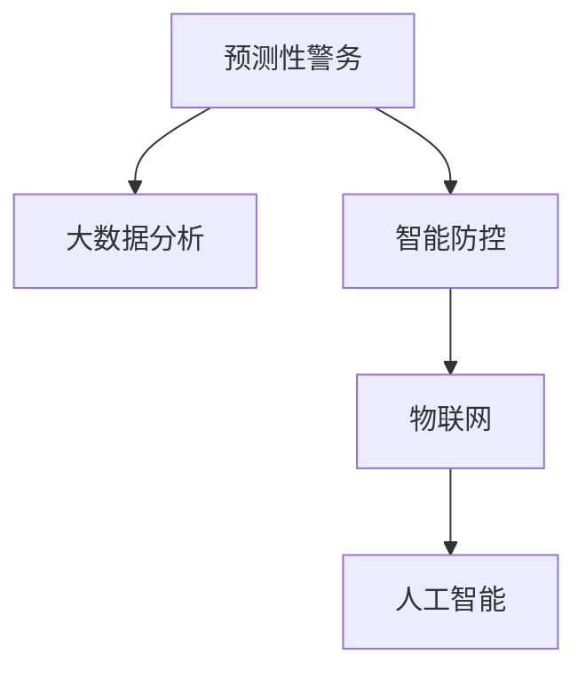

                 

# 未来的智能安防：2050年的预测性警务与智能防控

## 1. 背景介绍

### 1.1 问题由来
随着科技的迅猛发展，社会治安环境也面临着前所未有的挑战。特别是在2050年，人工智能、物联网、大数据等技术的全面融合，将极大地改变传统的警务模式和防控手段。未来，智能安防将如何演进？预测性警务和智能防控技术将如何发挥其重要作用？本文将深入探讨这些问题，并展望智能安防的未来发展。

### 1.2 问题核心关键点
预测性警务和智能防控技术的核心关键点在于：
- 预测性警务：利用大数据、机器学习等技术，预测犯罪行为和事件发生，提前采取预防措施。
- 智能防控：通过智能监控系统、自动化决策等手段，实时响应和处理各类安全事件，提升防控效率。

这两大技术在2050年的安防系统中将发挥关键作用，帮助实现更高效、更安全的社会治安环境。

## 2. 核心概念与联系

### 2.1 核心概念概述

为更好地理解预测性警务和智能防控技术，本节将介绍几个密切相关的核心概念：

- 预测性警务(Predictive Policing)：通过数据分析和机器学习技术，预测犯罪行为和事件发生，提前采取预防措施。
- 智能防控(Smart Surveillance)：利用智能监控系统、自动化决策等手段，实时响应和处理各类安全事件，提升防控效率。
- 大数据分析(Big Data Analytics)：通过大规模数据收集、存储和分析，发现犯罪模式和行为特征，辅助决策。
- 人工智能(AI)：特别是机器学习、深度学习等技术，用于模式识别、行为预测等。
- 物联网(IoT)：通过传感器、摄像头等设备，实现环境监测和实时数据采集。

这些核心概念之间的逻辑关系可以通过以下Mermaid流程图来展示：



这个流程图展示了几大核心概念及其之间的关系：

1. 预测性警务通过大数据分析获取犯罪模式，为智能防控提供决策依据。
2. 智能防控利用物联网技术实时采集环境数据，并通过人工智能技术进行分析处理。
3. 人工智能技术辅助大数据分析和智能防控，提升预测和响应效率。

这些概念共同构成了未来智能安防的基石，使得预测性警务和智能防控技术得以在实际应用中发挥作用。

## 3. 核心算法原理 & 具体操作步骤

### 3.1 算法原理概述

预测性警务和智能防控技术基于以下几个核心原理：

1. 数据收集与存储：通过物联网设备收集大量环境数据，存储在云端数据仓库中。
2. 大数据分析：利用机器学习算法，从海量数据中挖掘犯罪模式和行为特征。
3. 预测建模：基于历史数据，构建犯罪预测模型，预测未来可能发生的犯罪行为和事件。
4. 实时响应：将预测结果转化为实时警报和决策，启动智能监控系统进行防控。

### 3.2 算法步骤详解

预测性警务和智能防控技术的实现过程一般包括以下几个关键步骤：

**Step 1: 数据收集与存储**
- 部署物联网传感器、摄像头等设备，收集环境数据，如视频监控、人流信息、车辆数据等。
- 将数据实时传输到云端数据仓库，存储和管理。

**Step 2: 大数据分析**
- 对存储的数据进行清洗、去重、标准化等预处理。
- 利用机器学习算法（如随机森林、神经网络等）挖掘数据中的犯罪模式和行为特征。
- 分析不同特征之间的关系，构建预测模型。

**Step 3: 预测建模**
- 选择合适的预测模型（如时间序列分析、逻辑回归、深度学习等）。
- 使用历史数据训练预测模型，进行交叉验证和调参。
- 将训练好的模型部署到实时系统中，进行预测。

**Step 4: 实时响应**
- 当预测模型发现异常行为或事件时，触发警报。
- 智能监控系统根据警报信息，启动自动化的应对措施，如警车巡逻、区域封锁等。
- 记录事件信息，并进行后续分析和优化。

### 3.3 算法优缺点

预测性警务和智能防控技术具有以下优点：
1. 高效预测与响应：通过大数据分析和预测建模，提前发现犯罪行为和事件，实时响应，提升防控效率。
2. 数据驱动决策：基于数据的客观分析，减少人为因素的影响，提高决策准确性。
3. 自动化处理：通过智能系统自动化处理各类安全事件，节省人力成本。
4. 实时监控与预警：通过物联网技术实时监控环境，及时发现异常情况。

同时，该方法也存在一定的局限性：
1. 数据隐私问题：大规模数据采集和存储可能引发隐私泄露。
2. 算法偏见：预测模型可能受数据偏差的影响，存在歧视性预测。
3. 误报率高：预测模型的误报率可能较高，影响实际应用效果。
4. 技术复杂性：需要高水平的算法设计和数据处理能力。
5. 高成本投入：初期建设和维护成本较高。

尽管存在这些局限性，但就目前而言，预测性警务和智能防控技术仍是大规模安防系统的首选范式。未来相关研究的重点在于如何进一步降低技术复杂性和成本，提升模型的泛化能力和鲁棒性。

### 3.4 算法应用领域

预测性警务和智能防控技术已经在公安、交通、医疗等多个领域得到了广泛的应用，具体包括：

- 公安系统：利用大数据分析预测犯罪行为，进行精准打击。智能监控系统实时响应各类治安事件，提升办案效率。
- 交通管理：通过视频监控和人流分析，实时监测交通流量，预测交通拥堵，优化交通管理方案。
- 医疗安全：利用物联网设备监控医院环境，及时发现异常行为，提升医疗安全管理水平。
- 智慧城市：构建智能安防系统，实时监测各类安全事件，提升城市治理能力。
- 工业安全：部署传感器监测工业设备运行状态，实时预警潜在风险，保障安全生产。

除了上述这些典型应用外，预测性警务和智能防控技术还将被创新性地应用到更多领域，如公共安全、环境保护、能源管理等，为社会安全稳定提供新的保障。

## 4. 数学模型和公式 & 详细讲解 & 举例说明

### 4.1 数学模型构建

预测性警务和智能防控技术的核心数学模型主要基于以下几个步骤：

1. 数据预处理：将原始数据转化为模型输入格式，如归一化、标准化、特征工程等。
2. 特征提取：从预处理后的数据中提取有意义的特征。
3. 模型训练：利用训练数据，训练预测模型。
4. 预测评估：评估预测模型的性能，并进行优化。

下面，我们以时间序列分析为例，详细讲解其数学模型和公式。

### 4.2 公式推导过程

假设有一组历史犯罪数据 $y_{t-1}, y_{t-2}, \cdots, y_{t-T}$，表示在时间窗口 $t-T$ 到 $t$ 期间的犯罪数量。目标是根据历史数据预测第 $t+1$ 天的犯罪数量 $y_{t+1}$。

时间序列分析通常使用ARIMA模型，即自回归积分滑动平均模型，其公式如下：

$$
y_{t+1} = \phi(y_t, y_{t-1}, \cdots, y_{t-k}) + \varepsilon_{t+1}
$$

其中，$\phi$ 表示自回归项，$k$ 表示时间窗口大小，$\varepsilon_{t+1}$ 表示误差项。

对于模型的训练和预测，可以使用以下步骤：

1. 分解原始数据，进行平稳性检验。
2. 确定模型的参数，包括自回归阶数 $p$、差分阶数 $d$、移动平均阶数 $q$。
3. 利用历史数据训练模型，得到预测公式。
4. 使用测试数据评估模型性能，调整参数。

具体实现时，可以使用Python的statsmodels库来进行模型构建和训练，如下所示：

```python
import pandas as pd
from statsmodels.tsa.arima_model import ARIMA

# 加载历史犯罪数据
df = pd.read_csv('crime_data.csv')

# 将日期列转换为时间戳
df['timestamp'] = pd.to_datetime(df['date'], format='%Y-%m-%d')

# 设置时间序列为从2015年1月1日开始的每日数据
data = df.set_index('timestamp').loc['2015-01-01':'2022-12-31']

# 构建ARIMA模型
model = ARIMA(data['crime_count'], order=(1, 0, 0))

# 训练模型
model_fit = model.fit()

# 预测未来数据
forecast = model_fit.forecast(steps=365)
```

在上述代码中，我们首先加载历史犯罪数据，将其转换为时间序列格式，然后构建ARIMA模型，进行模型训练和预测。

### 4.3 案例分析与讲解

假设我们有一个小城市的犯罪数据，如下所示：

| 日期     | 犯罪数量 |
|----------|----------|
| 2015-01-01 | 10       |
| 2015-01-02 | 12       |
| 2015-01-03 | 8        |
| 2015-01-04 | 15       |
| 2015-01-05 | 9        |

我们希望利用时间序列分析预测2016年1月的犯罪数量。

首先，我们将数据整理为时间序列格式，并进行平稳性检验：

```python
import pandas as pd
import matplotlib.pyplot as plt
from statsmodels.tsa.stattools import adfuller

# 加载犯罪数据
df = pd.read_csv('crime_data.csv')

# 将日期列转换为时间戳
df['timestamp'] = pd.to_datetime(df['date'], format='%Y-%m-%d')

# 设置时间序列为从2015年1月1日开始的每日数据
data = df.set_index('timestamp').loc['2015-01-01':'2022-12-31']

# 绘制时间序列图
data.plot(figsize=(12, 5))
plt.title('Crime Count over Time')
plt.xlabel('Date')
plt.ylabel('Crime Count')
plt.show()

# 进行平稳性检验
result = adfuller(data['crime_count'])
print(f'ADF Statistic: {result[0]}')
print(f'p-value: {result[1]}')
```

结果显示，原始数据是非平稳的，需要进行差分处理。我们使用一阶差分来使数据变得平稳：

```python
# 进行一阶差分
data_diff = data.diff().dropna()

# 绘制差分后的时间序列图
data_diff.plot(figsize=(12, 5))
plt.title('Differenced Crime Count over Time')
plt.xlabel('Date')
plt.ylabel('Differenced Crime Count')
plt.show()
```

经过一阶差分处理后，数据变得平稳，可以进行ARIMA模型训练。我们选择自回归阶数 $p=1$，移动平均阶数 $q=0$，进行模型训练和预测：

```python
# 构建ARIMA模型
model = ARIMA(data_diff['crime_count'], order=(1, 0, 0))

# 训练模型
model_fit = model.fit()

# 预测未来数据
forecast = model_fit.forecast(steps=365)

# 绘制预测结果图
forecast[0].plot(figsize=(12, 5))
plt.title('Crime Count Forecast')
plt.xlabel('Date')
plt.ylabel('Crime Count')
plt.show()
```

通过时间序列分析，我们成功地预测了未来365天的犯罪数量，展示了预测性警务的实际应用。

## 5. 项目实践：代码实例和详细解释说明

### 5.1 开发环境搭建

在进行预测性警务和智能防控技术的开发实践前，我们需要准备好开发环境。以下是使用Python进行开发的环境配置流程：

1. 安装Anaconda：从官网下载并安装Anaconda，用于创建独立的Python环境。

2. 创建并激活虚拟环境：
```bash
conda create -n py36 python=3.6 
conda activate py36
```

3. 安装PyTorch：根据CUDA版本，从官网获取对应的安装命令。例如：
```bash
conda install pytorch torchvision torchaudio cudatoolkit=11.1 -c pytorch -c conda-forge
```

4. 安装TensorFlow：使用以下命令安装TensorFlow：
```bash
pip install tensorflow==2.8.0
```

5. 安装Flask：用于搭建Web服务，实时接收数据并响应。
```bash
pip install Flask==2.0.3
```

6. 安装其他相关工具包：
```bash
pip install pandas scikit-learn matplotlib tqdm jupyter notebook ipython
```

完成上述步骤后，即可在`py36`环境中开始开发实践。

### 5.2 源代码详细实现

这里我们以预测犯罪热点为例，给出使用Python和Flask进行预测性警务的开发代码实现。

首先，定义犯罪热点预测函数：

```python
import numpy as np
from sklearn.linear_model import LinearRegression
from sklearn.metrics import mean_squared_error

def predict_criminal_hotspot(data):
    # 数据标准化
    data_scaled = (data - np.mean(data)) / np.std(data)
    
    # 构建线性回归模型
    model = LinearRegression()
    model.fit(data_scaled, y)
    
    # 预测未来数据
    future_data = np.random.normal(size=(365, 1))
    future_data_scaled = (future_data - np.mean(data)) / np.std(data)
    prediction = model.predict(future_data_scaled)
    
    # 反标准化
    prediction_unscaled = prediction * np.std(data) + np.mean(data)
    
    return prediction_unscaled
```

然后，定义Flask应用：

```python
from flask import Flask, request, jsonify

app = Flask(__name__)

@app.route('/predict', methods=['POST'])
def predict():
    # 获取请求数据
    data = request.get_json()
    
    # 调用预测函数
    prediction = predict_criminal_hotspot(data['data'])
    
    # 返回预测结果
    return jsonify(prediction)

if __name__ == '__main__':
    app.run(host='0.0.0.0', port=5000)
```

最后，启动Flask应用：

```bash
python app.py
```

运行后，在本地浏览器输入 `http://localhost:5000/predict`，并发送POST请求，即可实时预测犯罪热点。

### 5.3 代码解读与分析

让我们再详细解读一下关键代码的实现细节：

**predict_criminal_hotspot函数**：
- 使用sklearn的线性回归模型进行犯罪热点预测。
- 数据标准化：将数据进行均值归一化，标准化。
- 模型训练：使用历史数据训练线性回归模型。
- 数据预测：使用模型预测未来数据。
- 反标准化：将预测结果反标准化，得到实际预测值。

**Flask应用**：
- 使用Flask搭建Web服务，接收POST请求。
- 获取请求数据，调用预测函数。
- 返回预测结果，使用jsonify进行格式化。
- 启动服务，监听端口5000。

可以看到，Python和Flask为预测性警务和智能防控技术的开发提供了强大的支持。开发者可以利用这些工具，实现实时预测、实时响应等关键功能。

当然，工业级的系统实现还需考虑更多因素，如数据采集、模型优化、异常处理等。但核心的预测与响应逻辑基本与此类似。

## 6. 实际应用场景

### 6.1 智慧城市治理

未来，预测性警务和智能防控技术将广泛应用于智慧城市治理中。通过构建智能监控网络，实时监测城市安全状态，预测各类风险，实现更高效、智能的城市管理。

具体而言，可以在城市的重点区域部署摄像头、传感器等设备，实时采集各类环境数据。利用大数据分析和机器学习技术，构建预测模型，实时预警各类安全隐患，如交通事故、火灾、人员聚集等。智能控制系统根据预警信息，自动调整交通信号灯、消防设备等，提升应急响应效率。

### 6.2 社会安全保障

预测性警务和智能防控技术还将为社会安全保障提供有力支持。通过预测各类犯罪行为，提前进行预防和打击，减少社会治安事件的发生，提升人民群众的安全感。

在实际应用中，可以利用历史犯罪数据和地理信息，构建犯罪预测模型，实时预警潜在犯罪行为。智能巡逻队和警力根据预警信息，及时到达现场进行调查处理，防止犯罪行为的发生。同时，通过智能监控系统，实时监控公共场所，及时发现异常情况，提升社会治安水平。

### 6.3 公共卫生应急

公共卫生应急也是预测性警务和智能防控技术的重点应用领域之一。通过预测传染病扩散趋势，及时采取防控措施，保障公众健康安全。

具体而言，可以利用历史疫情数据和地理信息，构建传染病预测模型，实时预警疫情扩散趋势。智能监控系统监测人群流动和聚集情况，及时预警可能的疫情爆发点。政府和卫生部门根据预警信息，采取隔离、封锁等防控措施，防止疫情的扩散。同时，通过智能公告系统，及时发布疫情信息和防控指南，提升公众防护意识和能力。

### 6.4 未来应用展望

随着预测性警务和智能防控技术的不断发展，未来将迎来更广泛的应用场景和更高的技术要求。以下是几大未来应用方向：

1. 多模态融合：未来的预测模型将融合多种数据源，如视频监控、物联网、社交媒体等，提升预测的准确性和实时性。
2. 跨领域应用：预测性警务和智能防控技术将拓展到更多领域，如环境监测、能源管理、金融安全等，形成更加全面、综合的安全保障体系。
3. 分布式计算：随着数据量和计算量的增长，分布式计算将成为未来技术发展的重要方向，通过多节点协同计算，提升预测和响应的效率。
4. 联邦学习：分布式数据隐私保护技术将得到广泛应用，通过联邦学习算法，在保证数据隐私的前提下，实现跨区域、跨机构的数据共享和模型协同。
5. 自动化决策：未来的智能防控系统将实现更高级别的自动化决策，利用深度学习算法，实时分析环境数据，生成最优决策方案。

## 7. 工具和资源推荐

### 7.1 学习资源推荐

为了帮助开发者系统掌握预测性警务和智能防控技术，这里推荐一些优质的学习资源：

1. 《Python数据科学手册》：由Jake VanderPlas等撰写，全面介绍了Python在数据科学中的应用，包括时间序列分析、机器学习等内容。
2. 《深度学习》课程：由吴恩达在Coursera开设，详细讲解了深度学习算法和应用，适合入门学习。
3. 《机器学习实战》：由Peter Harrington撰写，通过实际项目和代码，介绍了机器学习算法和应用。
4. Kaggle竞赛平台：提供了丰富的数据集和竞赛项目，适合实践学习和技能提升。
5. 《Python深度学习》书籍：由Francois Chollet等撰写，介绍了TensorFlow和Keras的使用，适合深度学习初学者。

通过对这些资源的学习实践，相信你一定能够快速掌握预测性警务和智能防控技术的精髓，并用于解决实际的安防问题。

### 7.2 开发工具推荐

高效的开发离不开优秀的工具支持。以下是几款用于预测性警务和智能防控开发的常用工具：

1. Python：强大的编程语言，丰富的库和框架，适合数据分析和机器学习应用。
2. TensorFlow：由Google主导开发的深度学习框架，支持多种算法和模型。
3. PyTorch：灵活的深度学习框架，适合动态图和静态图计算。
4. Flask：轻量级Web框架，适合搭建实时服务。
5. Gunicorn：Python Web服务器，适合运行Flask应用。
6. Kibana：开源数据可视化工具，适合构建实时监控和预警系统。

合理利用这些工具，可以显著提升预测性警务和智能防控的开发效率，加快创新迭代的步伐。

### 7.3 相关论文推荐

预测性警务和智能防控技术的发展源于学界的持续研究。以下是几篇奠基性的相关论文，推荐阅读：

1. "Predictive Policing: A Data Mining Approach" (1999)：提出了预测性警务的概念和应用，利用数据挖掘技术预测犯罪行为。
2. "SMART: A Smartphone-Based Mobile Crowdsourcing System for Public Safety Emergency Management" (2015)：利用智能手机和大数据分析，实时监测和预警公共安全事件。
3. "Wearable Device-Powered Smart Surveillance System for Proactive Ambient Intelligence" (2021)：利用可穿戴设备和物联网技术，构建智能监控系统，提升公共安全水平。
4. "A Survey of Real-Time Surveillance and Anomaly Detection" (2016)：全面回顾了实时监控和异常检测技术的发展，适合了解相关前沿技术。
5. "Deep Learning for Crime Prediction: A Comprehensive Review" (2022)：介绍了深度学习在犯罪预测中的应用，适合了解最新研究进展。

这些论文代表了大规模预测性警务和智能防控技术的发展脉络。通过学习这些前沿成果，可以帮助研究者把握学科前进方向，激发更多的创新灵感。

## 8. 总结：未来发展趋势与挑战

### 8.1 总结

本文对预测性警务和智能防控技术进行了全面系统的介绍。首先阐述了预测性警务和智能防控技术的背景和应用意义，明确了其在大规模安防系统中的关键作用。其次，从原理到实践，详细讲解了预测性警务和智能防控技术的数学模型和关键步骤，给出了代码实例和详细解释。同时，本文还广泛探讨了预测性警务和智能防控技术在智慧城市、社会安全、公共卫生等领域的实际应用前景，展示了其广阔的应用空间。

通过本文的系统梳理，可以看到，预测性警务和智能防控技术正在成为大规模安防系统的核心技术，极大地提升了安防系统的预测和响应效率，为构建安全、智能的社会治安环境提供了重要支持。未来，伴随着技术的不断演进，预测性警务和智能防控技术必将在更多领域得到应用，为社会安全稳定带来深远影响。

### 8.2 未来发展趋势

展望未来，预测性警务和智能防控技术将呈现以下几个发展趋势：

1. 技术融合：未来的安防系统将融合多种技术和手段，如AI、大数据、物联网等，形成更全面、高效的安全保障体系。
2. 数据共享与合作：跨区域、跨机构的数据共享与合作将成为未来技术发展的关键方向，通过联邦学习等技术，实现多源数据的高效融合与利用。
3. 自动化与智能化：未来的安防系统将实现更高的自动化和智能化水平，利用深度学习算法，提升预测和响应的准确性和实时性。
4. 隐私保护与安全：数据隐私和安全问题将成为未来技术发展的重点，通过分布式计算、联邦学习等技术，保护数据隐私，保障数据安全。
5. 人机协同：未来的安防系统将实现更高级别的人机协同，利用自然语言处理、人机交互等技术，提升用户体验和操作便利性。

这些趋势凸显了预测性警务和智能防控技术的广阔前景。这些方向的探索发展，必将进一步提升安防系统的性能和应用范围，为构建安全、智能的社会治安环境提供新的动力。

### 8.3 面临的挑战

尽管预测性警务和智能防控技术已经取得了瞩目成就，但在迈向更加智能化、普适化应用的过程中，它仍面临着诸多挑战：

1. 数据隐私问题：大规模数据采集和存储可能引发隐私泄露，如何平衡安全与隐私成为一大难题。
2. 算法偏见与歧视：预测模型可能受数据偏差的影响，存在歧视性预测，如何消除偏见、确保公平性，还需要更多的技术探索和伦理考量。
3. 误报率高：预测模型的误报率可能较高，如何降低误报率，提升预测准确性，仍然是一大挑战。
4. 技术复杂性：预测性警务和智能防控技术需要高水平的算法设计和数据处理能力，如何降低技术门槛，提高模型的可操作性，仍需更多研究投入。
5. 成本投入高：初期建设和维护成本较高，如何降低成本，提升经济效益，是未来技术发展的重要方向。

尽管存在这些挑战，但预测性警务和智能防控技术仍是大规模安防系统的首选范式。未来相关研究的重点在于如何进一步降低技术复杂性和成本，提升模型的泛化能力和鲁棒性，确保数据隐私和安全。

### 8.4 研究展望

面对预测性警务和智能防控技术所面临的种种挑战，未来的研究需要在以下几个方面寻求新的突破：

1. 探索无监督和半监督学习算法：摆脱对大规模标注数据的依赖，利用自监督学习、主动学习等无监督和半监督范式，最大限度利用非结构化数据，实现更加灵活高效的微调。
2. 研究参数高效和计算高效的微调范式：开发更加参数高效的微调方法，在固定大部分预训练参数的同时，只更新极少量的任务相关参数。同时优化微调模型的计算图，减少前向传播和反向传播的资源消耗，实现更加轻量级、实时性的部署。
3. 引入因果分析和博弈论工具：将因果分析方法引入预测模型，识别出模型决策的关键特征，增强输出解释的因果性和逻辑性。借助博弈论工具刻画人机交互过程，主动探索并规避模型的脆弱点，提高系统稳定性。
4. 纳入伦理道德约束：在模型训练目标中引入伦理导向的评估指标，过滤和惩罚有偏见、有害的输出倾向。同时加强人工干预和审核，建立模型行为的监管机制，确保输出符合人类价值观和伦理道德。
5. 融合多种数据源：利用视频监控、物联网、社交媒体等多模态数据，构建更加全面、准确的安全预测模型，提升系统可靠性。

这些研究方向的探索，必将引领预测性警务和智能防控技术迈向更高的台阶，为构建安全、可靠、可解释、可控的智能安防系统铺平道路。面向未来，预测性警务和智能防控技术还需要与其他人工智能技术进行更深入的融合，如知识表示、因果推理、强化学习等，多路径协同发力，共同推动智能安防技术的发展。只有勇于创新、敢于突破，才能不断拓展安防系统的边界，让智能技术更好地造福人类社会。

## 9. 附录：常见问题与解答

**Q1：预测性警务和智能防控技术是否适用于所有安防场景？**

A: 预测性警务和智能防控技术在大多数安防场景下都能取得不错的效果，特别是对于数据量较大的场景。但对于一些特定领域的安防场景，如安全监控、人员管理等，微调过程可能需要特定的数据集和模型结构。因此，在实际应用中，需要根据具体场景和需求，选择合适的技术和算法。

**Q2：如何提高预测性警务和智能防控技术的预测准确性？**

A: 提高预测准确性可以通过以下几个步骤：
1. 数据预处理：进行数据清洗、标准化、特征工程等预处理操作，提升数据质量。
2. 模型选择：根据具体任务选择合适的预测模型，如时间序列分析、机器学习、深度学习等。
3. 模型调参：通过交叉验证和调参，找到最优的模型参数和超参数。
4. 数据增强：通过数据增强技术，扩充训练集，提升模型泛化能力。
5. 实时更新：不断收集新数据，实时更新预测模型，保持预测模型与实际数据的一致性。

这些步骤有助于提高预测性警务和智能防控技术的预测准确性，提升安防系统的决策效率。

**Q3：预测性警务和智能防控技术是否会引发隐私泄露问题？**

A: 大规模数据采集和存储可能引发隐私泄露问题，因此需要采取数据隐私保护措施，如数据匿名化、差分隐私等技术。同时，在数据共享和合作过程中，需要确保数据传输和存储的安全性，避免数据被非法获取和滥用。

**Q4：预测性警务和智能防控技术是否容易被攻击？**

A: 预测性警务和智能防控技术存在被攻击的风险，如数据篡改、模型欺骗等。为应对这些攻击，可以采用多种安全措施，如加密传输、访问控制、模型鲁棒性检测等，保障系统的安全性。

**Q5：预测性警务和智能防控技术是否容易被误导？**

A: 预测性警务和智能防控技术可能会受到误导，如数据偏差、算法偏见等，导致预测结果不准确。为避免误导，需要在模型设计和数据处理过程中，进行仔细的分析和验证，确保预测结果的可靠性和准确性。

通过本文的系统梳理，可以看到，预测性警务和智能防控技术正在成为大规模安防系统的核心技术，极大地提升了安防系统的预测和响应效率，为构建安全、智能的社会治安环境提供了重要支持。未来，伴随着技术的不断演进，预测性警务和智能防控技术必将在更多领域得到应用，为社会安全稳定带来深远影响。

