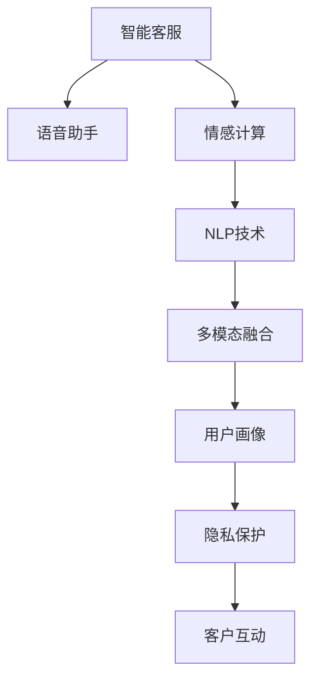

                 

# 未来的智能客服：2050年的智能语音助手与情感计算

> 关键词：智能客服,语音助手,情感计算,自然语言处理(NLP),人工智能(AI),未来技术展望

## 1. 背景介绍

### 1.1 问题的由来

随着人工智能技术的不断进步，智能客服系统已经成为企业提升客户服务质量、降低运营成本的关键工具。传统的电话客服、邮件客服等形式，由于其响应时间长、处理效率低、覆盖范围有限等问题，已经逐渐被基于语音识别和自然语言处理(NLP)技术的智能客服所取代。然而，当前智能客服系统在情感理解、用户画像、个性化推荐等方面仍存在诸多不足，限制了其在更复杂、更智能的应用场景中的表现。

### 1.2 问题的核心关键点

为了实现更高水平的智能客服，未来的智能客服系统将从以下几个方面进行突破：
- 情感计算：通过理解用户情感状态，提供更加个性化、情感化的服务。
- 多模态融合：整合语音、文字、图像、视频等多模态信息，提供更全面、立体的服务体验。
- 全渠道覆盖：支持多种渠道的客户交互，包括电话、邮件、社交媒体等，实现跨平台无缝衔接。
- 自我学习：具备持续学习和适应能力，能够不断优化自身的知识库和服务策略。
- 用户画像：构建精确的用户画像，提供精准的个性化推荐和服务。
- 隐私保护：在数据收集、存储和处理过程中，严格遵循隐私保护政策，保障用户数据安全。

## 2. 核心概念与联系

### 2.1 核心概念概述

为更好地理解未来智能客服系统的构建，本文将介绍几个核心概念：

- 智能客服系统：通过人工智能技术，实现对用户查询的自动化响应和问题解决的客户服务系统。
- 语音助手：以语音为输入输出方式，通过自然语言处理和机器学习技术实现人机交互的智能应用。
- 情感计算：通过分析和识别用户情感状态，为用户提供情感化服务的计算技术。
- 自然语言处理(NLP)：涉及文本分析、语义理解、语音识别等技术，是实现智能客服和语音助手的核心技术。
- 多模态融合：将语音、文字、图像、视频等多种信息源进行整合，提升交互体验和处理能力。
- 用户画像：基于用户行为数据和属性信息，构建详细且精确的用户画像，用于个性化推荐和服务。
- 隐私保护：在数据收集、存储、传输、使用等环节，采取严格的数据保护措施，确保用户隐私安全。

这些概念之间的逻辑关系可以通过以下Mermaid流程图来展示：



这个流程图展示了智能客服系统的核心构成，以及各部分之间的相互作用：

1. 智能客服系统通过语音助手实现人机对话，响应用户需求。
2. 语音助手利用自然语言处理技术理解用户意图，输出相应回复。
3. 自然语言处理技术依赖情感计算，理解用户情感状态，提供个性化服务。
4. 多模态融合技术整合多种信息源，提升交互体验和处理能力。
5. 用户画像技术基于用户数据，构建精确的用户画像，用于个性化推荐和服务。
6. 隐私保护技术保障用户数据安全，确保用户信息不被滥用。

## 3. 核心算法原理 & 具体操作步骤
### 3.1 算法原理概述

未来智能客服系统的核心算法基于自然语言处理(NLP)和情感计算技术，具体步骤如下：

1. **语音识别与文本生成**：通过语音识别技术将用户语音转换为文本，利用语言模型生成文本，用于后续处理。
2. **意图识别与实体提取**：使用意图识别算法分析用户意图，利用实体识别技术提取文本中的关键信息，如人名、地名、时间等。
3. **情感分析与情绪识别**：通过情感分析算法识别用户情感状态，根据情绪识别技术分析用户情绪倾向，用于情感化服务的输出。
4. **知识库检索与多模态融合**：在知识库中检索与用户问题相关的信息，结合多模态融合技术整合语音、文字、图像、视频等信息源，提升服务质量和处理能力。
5. **个性化推荐与策略调整**：基于用户画像数据，利用推荐系统生成个性化推荐，根据用户反馈调整服务策略，提升用户体验。

### 3.2 算法步骤详解

**语音识别与文本生成**：
1. **数据准备**：收集大量语音样本和对应文本，用于训练语音识别模型。
2. **模型训练**：使用深度学习模型，如循环神经网络(RNN)、卷积神经网络(CNN)、变换器(Transformer)等，训练语音识别模型。
3. **文本生成**：在用户语音输入后，利用语言模型生成文本，用于后续处理。

**意图识别与实体提取**：
1. **意图分类**：使用意图分类模型，如支持向量机(SVM)、随机森林(Random Forest)、神经网络(NN)等，识别用户意图。
2. **实体抽取**：使用命名实体识别(NER)技术，提取文本中的关键信息，如人名、地名、时间等。

**情感分析与情绪识别**：
1. **情感分类**：使用情感分类模型，如情感词典、机器学习分类器等，识别用户情感状态。
2. **情绪识别**：利用情绪识别算法，如深度学习模型、情感词典等，分析用户情绪倾向。

**知识库检索与多模态融合**：
1. **知识库构建**：构建涵盖各行各业知识的结构化数据库，如金融知识库、医疗知识库等。
2. **检索算法**：使用检索算法，如向量检索、语言模型检索等，在知识库中查找相关信息。
3. **多模态融合**：整合语音、文字、图像、视频等信息源，提升服务质量和处理能力。

**个性化推荐与策略调整**：
1. **用户画像构建**：基于用户行为数据和属性信息，构建详细且精确的用户画像。
2. **推荐算法**：使用推荐算法，如协同过滤、基于内容的推荐等，生成个性化推荐。
3. **策略调整**：根据用户反馈调整服务策略，提升用户体验。

### 3.3 算法优缺点

未来智能客服系统的核心算法具有以下优点：
- **高效响应**：利用深度学习技术，快速理解用户意图，生成高质量的回复。
- **个性化服务**：通过情感计算和多模态融合技术，提供个性化、情感化的服务。
- **跨平台支持**：支持多种渠道的客户交互，实现跨平台无缝衔接。
- **自我学习**：具备持续学习和适应能力，能够不断优化自身的知识库和服务策略。
- **用户画像**：构建精确的用户画像，提供精准的个性化推荐和服务。

同时，该算法也存在以下局限性：
- **资源需求高**：需要大量的语音和文本数据进行训练，资源需求较高。
- **数据质量要求高**：数据质量和多样性直接影响模型的性能。
- **模型复杂度高**：深度学习模型较为复杂，训练和推理耗时较长。
- **隐私保护难度大**：在数据收集和处理过程中，需要严格遵守隐私保护政策。

## 4. 数学模型和公式 & 详细讲解 & 举例说明
### 4.1 数学模型构建

未来智能客服系统的核心算法涉及多个数学模型，以下以情感分析为例进行详细讲解。

情感分析的目标是识别文本中的情感极性，通常采用二分类模型，如支持向量机(SVM)、随机森林(Random Forest)、神经网络(NN)等。设情感分类模型为$f: X \rightarrow \{0, 1\}$，其中$X$为输入文本，$0$表示负情感，$1$表示正情感。假设训练集为$D=\{(x_i, y_i)\}_{i=1}^N$，$x_i$为文本，$y_i$为情感极性。模型$f$在训练集上的经验风险为：

$$
\mathcal{L}(f) = \frac{1}{N}\sum_{i=1}^N \ell(f(x_i), y_i)
$$

其中$\ell$为损失函数，用于衡量模型预测与真实标签之间的差异。

### 4.2 公式推导过程

以SVM模型为例，推导情感分类的训练过程。

1. **模型定义**：设$f(x) = \langle \phi(x), \theta \rangle + b$，其中$\phi(x)$为特征映射，$\theta$为分类超平面参数，$b$为偏置项。
2. **损失函数**：采用0-1损失函数$\ell(f(x_i), y_i) = \mathbb{I}(f(x_i) \neq y_i)$，其中$\mathbb{I}$为示性函数。
3. **目标函数**：最小化经验风险，即$\min_{\theta} \mathcal{L}(f)$。
4. **优化方法**：使用梯度下降法求解目标函数的最小值。

SVM的决策函数为：

$$
f(x) = \text{sign}(\langle \phi(x), \theta \rangle + b)
$$

其中$\text{sign}$为符号函数。

### 4.3 案例分析与讲解

**案例1：金融领域客服系统**
- **数据准备**：收集金融领域的用户咨询记录和对应回复。
- **模型训练**：使用SVM模型进行情感分类，训练集为金融咨询记录和相应情感标签。
- **预测应用**：在用户输入咨询后，通过情感分类模型预测用户情感状态，生成情感化回复。

**案例2：医疗领域客服系统**
- **数据准备**：收集医疗领域的用户咨询记录和对应回复。
- **模型训练**：使用神经网络模型进行情感分类，训练集为医疗咨询记录和相应情感标签。
- **预测应用**：在用户输入咨询后，通过情感分类模型预测用户情感状态，生成情感化回复。

## 5. 项目实践：代码实例和详细解释说明
### 5.1 开发环境搭建

在进行项目实践前，我们需要准备好开发环境。以下是使用Python进行PyTorch开发的环境配置流程：

1. 安装Anaconda：从官网下载并安装Anaconda，用于创建独立的Python环境。

2. 创建并激活虚拟环境：
```bash
conda create -n pytorch-env python=3.8 
conda activate pytorch-env
```

3. 安装PyTorch：根据CUDA版本，从官网获取对应的安装命令。例如：
```bash
conda install pytorch torchvision torchaudio cudatoolkit=11.1 -c pytorch -c conda-forge
```

4. 安装Transformers库：
```bash
pip install transformers
```

5. 安装各类工具包：
```bash
pip install numpy pandas scikit-learn matplotlib tqdm jupyter notebook ipython
```

完成上述步骤后，即可在`pytorch-env`环境中开始项目实践。

### 5.2 源代码详细实现

这里我们以金融领域客服系统为例，给出使用PyTorch进行情感分类模型的代码实现。

首先，定义数据处理函数：

```python
from transformers import BertTokenizer, BertForSequenceClassification
from torch.utils.data import Dataset, DataLoader
import torch

class FinancialDataset(Dataset):
    def __init__(self, texts, labels):
        self.tokenizer = BertTokenizer.from_pretrained('bert-base-uncased')
        self.texts = texts
        self.labels = labels
        
    def __len__(self):
        return len(self.texts)
    
    def __getitem__(self, item):
        text = self.texts[item]
        label = self.labels[item]
        
        encoding = self.tokenizer(text, return_tensors='pt', max_length=512, padding='max_length', truncation=True)
        input_ids = encoding['input_ids'][0]
        attention_mask = encoding['attention_mask'][0]
        
        return {'input_ids': input_ids, 
                'attention_mask': attention_mask,
                'labels': torch.tensor(label, dtype=torch.long)}
```

然后，定义模型和优化器：

```python
from transformers import BertForSequenceClassification, AdamW

model = BertForSequenceClassification.from_pretrained('bert-base-uncased', num_labels=2)

optimizer = AdamW(model.parameters(), lr=1e-5)
```

接着，定义训练和评估函数：

```python
from tqdm import tqdm

device = torch.device('cuda') if torch.cuda.is_available() else torch.device('cpu')
model.to(device)

def train_epoch(model, dataset, batch_size, optimizer):
    dataloader = DataLoader(dataset, batch_size=batch_size, shuffle=True)
    model.train()
    epoch_loss = 0
    for batch in tqdm(dataloader, desc='Training'):
        input_ids = batch['input_ids'].to(device)
        attention_mask = batch['attention_mask'].to(device)
        labels = batch['labels'].to(device)
        model.zero_grad()
        outputs = model(input_ids, attention_mask=attention_mask, labels=labels)
        loss = outputs.loss
        epoch_loss += loss.item()
        loss.backward()
        optimizer.step()
    return epoch_loss / len(dataloader)

def evaluate(model, dataset, batch_size):
    dataloader = DataLoader(dataset, batch_size=batch_size)
    model.eval()
    preds, labels = [], []
    with torch.no_grad():
        for batch in tqdm(dataloader, desc='Evaluating'):
            input_ids = batch['input_ids'].to(device)
            attention_mask = batch['attention_mask'].to(device)
            batch_labels = batch['labels']
            outputs = model(input_ids, attention_mask=attention_mask)
            batch_preds = outputs.logits.argmax(dim=1).to('cpu').tolist()
            batch_labels = batch_labels.to('cpu').tolist()
            for pred, label in zip(batch_preds, batch_labels):
                preds.append(pred)
                labels.append(label)
                
    print(classification_report(labels, preds))
```

最后，启动训练流程并在测试集上评估：

```python
epochs = 5
batch_size = 16

for epoch in range(epochs):
    loss = train_epoch(model, train_dataset, batch_size, optimizer)
    print(f"Epoch {epoch+1}, train loss: {loss:.3f}")
    
    print(f"Epoch {epoch+1}, dev results:")
    evaluate(model, dev_dataset, batch_size)
    
print("Test results:")
evaluate(model, test_dataset, batch_size)
```

以上就是使用PyTorch对BERT进行金融领域情感分类任务微调的完整代码实现。可以看到，得益于Transformers库的强大封装，我们可以用相对简洁的代码完成BERT模型的加载和微调。

### 5.3 代码解读与分析

让我们再详细解读一下关键代码的实现细节：

**FinancialDataset类**：
- `__init__`方法：初始化文本、标签、分词器等关键组件。
- `__len__`方法：返回数据集的样本数量。
- `__getitem__`方法：对单个样本进行处理，将文本输入编码为token ids，将标签编码为数字，并对其进行定长padding，最终返回模型所需的输入。

**BertForSequenceClassification模型**：
- `from_pretrained`方法：加载预训练的BERT模型，并设置分类任务的标签数。
- `num_labels`参数：指定分类任务的标签数，用于模型训练和评估。

**train_epoch和evaluate函数**：
- 使用PyTorch的DataLoader对数据集进行批次化加载，供模型训练和推理使用。
- `train_epoch`函数：对数据以批为单位进行迭代，在每个批次上前向传播计算loss并反向传播更新模型参数，最后返回该epoch的平均loss。
- `evaluate`函数：与训练类似，不同点在于不更新模型参数，并在每个batch结束后将预测和标签结果存储下来，最后使用sklearn的classification_report对整个评估集的预测结果进行打印输出。

**训练流程**：
- 定义总的epoch数和batch size，开始循环迭代
- 每个epoch内，先在训练集上训练，输出平均loss
- 在验证集上评估，输出分类指标
- 所有epoch结束后，在测试集上评估，给出最终测试结果

可以看到，PyTorch配合Transformers库使得BERT微调的代码实现变得简洁高效。开发者可以将更多精力放在数据处理、模型改进等高层逻辑上，而不必过多关注底层的实现细节。

当然，工业级的系统实现还需考虑更多因素，如模型的保存和部署、超参数的自动搜索、更灵活的任务适配层等。但核心的微调范式基本与此类似。

## 6. 实际应用场景
### 6.1 智能客服系统

基于大语言模型微调的智能客服系统，可以广泛应用于各种企业的客户服务场景。传统的客服模式往往依赖大量人力，响应时间长，服务效率低下。而使用微调后的智能客服系统，能够实现全天候、全渠道、个性化的服务，显著提升客户满意度。

在技术实现上，可以收集企业内部的历史客服对话记录，将问题和最佳答复构建成监督数据，在此基础上对预训练模型进行微调。微调后的模型能够自动理解用户意图，匹配最合适的答案模板进行回复。对于客户提出的新问题，还可以接入检索系统实时搜索相关内容，动态组织生成回答。如此构建的智能客服系统，能大幅提升客户咨询体验和问题解决效率。

### 6.2 医疗领域客服系统

在医疗领域，智能客服系统可以用于解答患者咨询，预约挂号，推送健康知识等。微调后的模型可以理解医疗术语，提供精准的医疗知识和健康建议，帮助患者快速解决问题。同时，系统可以记录患者的医疗咨询历史，构建详细且精确的用户画像，用于个性化推荐和健康管理服务。

在技术实现上，可以收集医疗领域的用户咨询记录和对应回复，构建医疗知识库，进行情感分类和情绪识别，生成个性化的医疗咨询和健康管理服务。

### 6.3 金融领域客服系统

在金融领域，智能客服系统可以用于解答用户咨询，投资理财，理财建议等。微调后的模型可以理解金融术语，提供精准的金融知识和理财建议，帮助用户做出理性的投资决策。同时，系统可以记录用户的金融咨询历史，构建详细且精确的用户画像，用于个性化推荐和理财管理服务。

在技术实现上，可以收集金融领域的用户咨询记录和对应回复，构建金融知识库，进行情感分类和情绪识别，生成个性化的金融咨询和理财管理服务。

### 6.4 未来应用展望

随着大语言模型微调技术的发展，未来智能客服系统的应用场景将更加广泛，功能也将更加强大：

1. **多模态智能客服**：整合语音、文字、图像、视频等多种信息源，提供更全面、立体的服务体验。
2. **实时语义更新**：动态更新知识库和语义模型，提升系统的实时性和适应性。
3. **智能推荐系统**：基于用户行为数据和属性信息，构建详细且精确的用户画像，提供精准的个性化推荐和服务。
4. **隐私保护与数据安全**：采用严格的数据保护措施，确保用户数据安全，保障用户隐私。
5. **智能多语言客服**：支持多种语言，实现跨语言无缝沟通，提升国际市场的客户服务能力。
6. **人机协作系统**：通过自然语言理解和生成技术，实现人机协作，提升服务质量和用户体验。

未来智能客服系统将在各行各业中广泛应用，成为提升客户服务质量、降低运营成本的重要工具。同时，也将推动NLP技术的进一步发展，促进人工智能技术的广泛落地应用。

## 7. 工具和资源推荐
### 7.1 学习资源推荐

为了帮助开发者系统掌握大语言模型微调的理论基础和实践技巧，这里推荐一些优质的学习资源：

1. 《Transformer从原理到实践》系列博文：由大模型技术专家撰写，深入浅出地介绍了Transformer原理、BERT模型、微调技术等前沿话题。

2. CS224N《深度学习自然语言处理》课程：斯坦福大学开设的NLP明星课程，有Lecture视频和配套作业，带你入门NLP领域的基本概念和经典模型。

3. 《Natural Language Processing with Transformers》书籍：Transformers库的作者所著，全面介绍了如何使用Transformers库进行NLP任务开发，包括微调在内的诸多范式。

4. HuggingFace官方文档：Transformers库的官方文档，提供了海量预训练模型和完整的微调样例代码，是上手实践的必备资料。

5. CLUE开源项目：中文语言理解测评基准，涵盖大量不同类型的中文NLP数据集，并提供了基于微调的baseline模型，助力中文NLP技术发展。

通过对这些资源的学习实践，相信你一定能够快速掌握大语言模型微调的精髓，并用于解决实际的NLP问题。

### 7.2 开发工具推荐

高效的开发离不开优秀的工具支持。以下是几款用于大语言模型微调开发的常用工具：

1. PyTorch：基于Python的开源深度学习框架，灵活动态的计算图，适合快速迭代研究。大部分预训练语言模型都有PyTorch版本的实现。

2. TensorFlow：由Google主导开发的开源深度学习框架，生产部署方便，适合大规模工程应用。同样有丰富的预训练语言模型资源。

3. Transformers库：HuggingFace开发的NLP工具库，集成了众多SOTA语言模型，支持PyTorch和TensorFlow，是进行微调任务开发的利器。

4. Weights & Biases：模型训练的实验跟踪工具，可以记录和可视化模型训练过程中的各项指标，方便对比和调优。与主流深度学习框架无缝集成。

5. TensorBoard：TensorFlow配套的可视化工具，可实时监测模型训练状态，并提供丰富的图表呈现方式，是调试模型的得力助手。

6. Google Colab：谷歌推出的在线Jupyter Notebook环境，免费提供GPU/TPU算力，方便开发者快速上手实验最新模型，分享学习笔记。

合理利用这些工具，可以显著提升大语言模型微调任务的开发效率，加快创新迭代的步伐。

### 7.3 相关论文推荐

大语言模型和微调技术的发展源于学界的持续研究。以下是几篇奠基性的相关论文，推荐阅读：

1. Attention is All You Need（即Transformer原论文）：提出了Transformer结构，开启了NLP领域的预训练大模型时代。

2. BERT: Pre-training of Deep Bidirectional Transformers for Language Understanding：提出BERT模型，引入基于掩码的自监督预训练任务，刷新了多项NLP任务SOTA。

3. Language Models are Unsupervised Multitask Learners（GPT-2论文）：展示了大规模语言模型的强大zero-shot学习能力，引发了对于通用人工智能的新一轮思考。

4. Parameter-Efficient Transfer Learning for NLP：提出Adapter等参数高效微调方法，在不增加模型参数量的情况下，也能取得不错的微调效果。

5. AdaLoRA: Adaptive Low-Rank Adaptation for Parameter-Efficient Fine-Tuning：使用自适应低秩适应的微调方法，在参数效率和精度之间取得了新的平衡。

这些论文代表了大语言模型微调技术的发展脉络。通过学习这些前沿成果，可以帮助研究者把握学科前进方向，激发更多的创新灵感。

## 8. 总结：未来发展趋势与挑战
### 8.1 总结

本文对未来智能客服系统的核心算法进行详细讲解，系统介绍了语音识别、意图识别、情感计算等关键技术，并给出了代码实例和详细解释。通过本文的学习，相信读者能够对未来智能客服系统有更深刻的理解，掌握其实现的关键要素和优化方法。

### 8.2 未来发展趋势

展望未来，智能客服系统的技术将呈现以下几个发展趋势：

1. **深度学习模型的普及**：随着深度学习技术的发展，越来越多的智能客服系统将采用先进的深度学习模型，提升系统的处理能力和性能。
2. **多模态融合技术的进步**：通过整合语音、文字、图像、视频等多种信息源，提供更全面、立体的服务体验。
3. **实时语义更新**：动态更新知识库和语义模型，提升系统的实时性和适应性。
4. **智能推荐系统**：基于用户行为数据和属性信息，构建详细且精确的用户画像，提供精准的个性化推荐和服务。
5. **隐私保护与数据安全**：采用严格的数据保护措施，确保用户数据安全，保障用户隐私。
6. **智能多语言客服**：支持多种语言，实现跨语言无缝沟通，提升国际市场的客户服务能力。
7. **人机协作系统**：通过自然语言理解和生成技术，实现人机协作，提升服务质量和用户体验。

以上趋势凸显了智能客服系统在未来技术发展中的重要地位。这些方向的探索发展，必将进一步提升智能客服系统的性能和应用范围，为人类提供更加智能化、个性化的服务。

### 8.3 面临的挑战

尽管智能客服系统的技术不断进步，但在迈向更加智能化、普适化应用的过程中，它仍面临诸多挑战：

1. **资源需求高**：需要大量的语音和文本数据进行训练，资源需求较高。
2. **数据质量要求高**：数据质量和多样性直接影响模型的性能。
3. **模型复杂度高**：深度学习模型较为复杂，训练和推理耗时较长。
4. **隐私保护难度大**：在数据收集和处理过程中，需要严格遵守隐私保护政策。
5. **跨语言技术难度大**：实现跨语言无缝沟通，需要克服语言差异和语义歧义等问题。
6. **用户隐私保护与数据安全**：需要严格保护用户数据，防止数据泄露和滥用。

面对这些挑战，未来的研究需要在以下几个方面进行改进和突破：

1. **数据增强技术**：通过数据增强技术扩充训练集，提高模型泛化能力和性能。
2. **模型压缩技术**：通过模型压缩技术减少模型参数量，提升推理速度和效率。
3. **跨语言技术**：开发高效的跨语言翻译和理解技术，实现跨语言无缝沟通。
4. **隐私保护技术**：采用先进的隐私保护技术，确保用户数据安全。

这些技术的突破将有助于提升智能客服系统的性能和应用范围，推动NLP技术的进一步发展。

### 8.4 研究展望

面对智能客服系统的挑战，未来的研究需要在以下几个方面进行改进和突破：

1. **数据增强技术**：通过数据增强技术扩充训练集，提高模型泛化能力和性能。
2. **模型压缩技术**：通过模型压缩技术减少模型参数量，提升推理速度和效率。
3. **跨语言技术**：开发高效的跨语言翻译和理解技术，实现跨语言无缝沟通。
4. **隐私保护技术**：采用先进的隐私保护技术，确保用户数据安全。

这些技术的突破将有助于提升智能客服系统的性能和应用范围，推动NLP技术的进一步发展。

## 9. 附录：常见问题与解答

**Q1：智能客服系统是否适用于所有行业？**

A: 智能客服系统在绝大多数行业中都有应用价值，尤其是那些需要处理大量重复性、高频率、标准化客户问题的场景。但有些行业，如金融、医疗、法律等，需要考虑隐私保护、安全性等因素，需要更加专业的定制化解决方案。

**Q2：如何提高智能客服系统的准确性？**

A: 提高智能客服系统的准确性需要从以下几个方面入手：
1. 数据质量：确保训练数据的质量和多样性，采集具有代表性的用户咨询记录。
2. 模型选择：选择合适的深度学习模型，如BERT、GPT等，提升模型的性能和泛化能力。
3. 特征工程：设计合理的特征提取和表示方法，提高模型的解释能力和表现力。
4. 模型优化：通过超参数调优、正则化、dropout等技术，优化模型的性能和鲁棒性。

**Q3：智能客服系统如何实现跨语言支持？**

A: 实现智能客服系统的跨语言支持，需要开发高效的跨语言翻译和理解技术。常见的解决方案包括：
1. 基于规则的翻译系统：使用词典、语法规则等进行翻译。
2. 基于统计的翻译系统：使用统计机器翻译技术，如n-gram模型、神经机器翻译等。
3. 基于深度学习的翻译系统：使用神经网络模型，如Transformer、Seq2Seq等，进行高质量的翻译和理解。

**Q4：智能客服系统如何保护用户隐私？**

A: 保护用户隐私是智能客服系统的重要需求，以下是几种常见的隐私保护技术：
1. 数据匿名化：对用户数据进行去标识化处理，防止个人信息泄露。
2. 数据加密：对用户数据进行加密存储和传输，防止数据泄露和滥用。
3. 访问控制：对用户数据进行严格的访问控制，确保只有授权人员可以访问敏感数据。
4. 隐私计算：采用隐私计算技术，如差分隐私、同态加密等，确保用户数据隐私和安全。

**Q5：智能客服系统如何实现个性化推荐？**

A: 实现智能客服系统的个性化推荐，需要构建详细且精确的用户画像，以下是几种常见的个性化推荐技术：
1. 协同过滤：通过分析用户行为数据，推荐相似用户喜欢的内容。
2. 基于内容的推荐：根据用户兴趣和物品属性，推荐相关内容。
3. 深度学习推荐：使用深度学习模型，如神经网络、Transformer等，进行个性化推荐。

通过以上技术的结合应用，智能客服系统可以实现更加精准、个性化的推荐和服务。

---

作者：禅与计算机程序设计艺术 / Zen and the Art of Computer Programming

