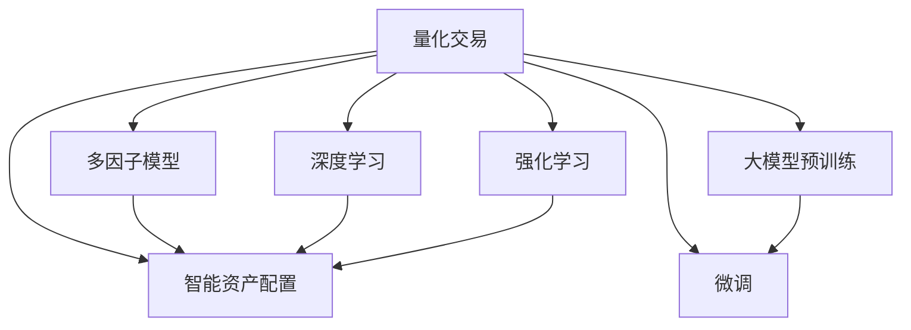

                 

# 未来的智能投资：2050年的AI量化交易与智能资产配置

在日益全球化和数字化的世界中，人工智能(AI)与金融投资的结合，正引领着一场前所未有的变革。未来，我们预期智能投资领域将迎来革命性的进展，AI量化交易和智能资产配置将不仅是金融科技的新趋势，更将成为金融决策的核心支柱。本文将深入探讨这一领域的关键概念、算法原理与具体操作步骤，并展望其未来发展趋势与挑战，旨在为读者提供一个全面的视角。

## 1. 背景介绍

### 1.1 问题由来

随着金融市场规模的不断扩大，传统投资方式已难以适应复杂多变的市场环境。这不仅增加了投资风险，也降低了投资收益。而人工智能技术，特别是机器学习和深度学习，正逐步改变这一局面。通过AI算法处理海量数据，投资者能够从数据中挖掘出更有价值的模式，辅助决策，实现风险分散和收益最大化。

### 1.2 问题核心关键点

AI量化交易与智能资产配置的核心在于如何利用数据驱动策略，通过算法自动化地做出投资决策。其核心问题包括以下几个方面：
- **数据处理**：从海量历史数据中提取有价值信息。
- **模型构建**：选择或设计合适的模型结构。
- **策略优化**：利用优化算法调整模型参数。
- **风险管理**：控制投资风险。

## 2. 核心概念与联系

### 2.1 核心概念概述

为了更好地理解未来的智能投资，我们需要掌握以下几个核心概念：

- **量化交易**：利用数学模型和计算机算法，自动执行交易策略的金融投资方式。
- **智能资产配置**：基于AI算法，动态调整资产组合比例以优化收益和风险的策略。
- **多因子模型**：结合多种因素（如市值、盈利、动量等）构建的投资模型。
- **深度学习**：通过神经网络等模型，从高维度数据中提取非线性关系的先进机器学习技术。
- **强化学习**：通过试错机制，学习最优投资策略的AI算法。
- **大模型预训练**：使用大规模数据对模型进行预训练，以获得更丰富的知识表示。
- **微调**：在预训练模型基础上，使用特定任务数据进行进一步训练，以适应新任务。

这些概念之间的逻辑关系可以通过以下Mermaid流程图来展示：



这个流程图展示了一系列关键概念及其之间的关联：量化交易通过多因子模型、深度学习和强化学习等多种方法辅助决策；智能资产配置则通过量化交易的策略进行动态调整；大模型预训练和微调技术为这些算法提供强大的知识基础。

## 3. 核心算法原理 & 具体操作步骤

### 3.1 算法原理概述

AI量化交易与智能资产配置的核心算法主要基于机器学习与深度学习的框架。其中，量化交易的核心在于建立高效的数学模型，智能资产配置的核心在于构建动态优化策略。

量化交易的算法原理可以概括为：
- **数据预处理**：收集历史数据，进行数据清洗和标准化处理。
- **特征工程**：构建对模型有用的特征变量。
- **模型训练**：使用历史数据训练机器学习模型。
- **策略回测**：在历史数据上验证策略效果。
- **实时交易**：使用训练好的模型实时做出交易决策。

智能资产配置的算法原理可以概括为：
- **目标函数**：构建优化目标，如最大化收益率或最小化风险。
- **约束条件**：设定资产组合的限制条件，如最大权重、多样化要求等。
- **优化算法**：使用优化算法（如遗传算法、粒子群算法）求解优化问题。
- **实时调整**：根据市场变化实时调整资产组合。

### 3.2 算法步骤详解

#### 量化交易算法步骤

1. **数据收集与预处理**：
   - 从股票、期货、外汇等金融市场获取历史数据。
   - 对数据进行清洗、归一化等预处理。
   
2. **特征工程**：
   - 提取有意义的特征，如股票的市值、PE值、动量等。
   - 构建复合指标，如动量-市值比率、收益率-波动率比率等。
   
3. **模型训练**：
   - 选择合适的模型，如线性回归、支持向量机等。
   - 使用历史数据进行模型训练，确定模型参数。
   
4. **策略回测**：
   - 在历史数据上验证策略效果，统计收益、风险等指标。
   - 对策略进行优化调整。

5. **实时交易**：
   - 使用训练好的模型进行实时交易。
   - 监控市场变化，适时调整交易策略。

#### 智能资产配置算法步骤

1. **构建优化目标**：
   - 设定优化目标，如最大化夏普比率、最小化波动率等。
   - 确定约束条件，如资产比例、流动性要求等。
   
2. **选择优化算法**：
   - 根据问题特点选择合适的优化算法，如遗传算法、粒子群算法等。
   - 对算法进行参数调优，提高优化效果。
   
3. **求解优化问题**：
   - 使用算法求解优化问题，得到资产配置方案。
   - 对配置方案进行验证和调整。

4. **实时调整**：
   - 根据市场变化实时调整资产配置。
   - 监控资产表现，及时做出调整。

### 3.3 算法优缺点

AI量化交易与智能资产配置的算法具有以下优点：
- **效率高**：通过自动化算法，提高交易和资产配置的效率。
- **覆盖广**：能够处理大量复杂数据，挖掘更多投资机会。
- **可扩展性**：易于扩展到多种资产和市场。

其缺点包括：
- **依赖数据质量**：模型效果受数据质量影响较大。
- **复杂度高**：算法复杂，需要专业知识。
- **易受市场冲击**：在市场剧烈波动时，策略可能失效。

### 3.4 算法应用领域

AI量化交易与智能资产配置的应用领域广泛，涵盖了股票、期货、外汇、债券等多种资产类型。在实际应用中，以下领域尤为突出：

- **高频交易**：利用算法在极短时间内进行高频交易，实现收益最大化。
- **量化对冲**：通过多因子模型对冲市场风险，提高投资稳健性。
- **智能投顾**：结合量化交易和智能资产配置，提供个性化投资建议。
- **算法套利**：通过识别市场套利机会，实现低风险高收益。

## 4. 数学模型和公式 & 详细讲解 & 举例说明

### 4.1 数学模型构建

在智能投资中，数学模型的构建是关键。以量化交易中的线性回归模型为例，其数学模型可以表示为：

$$
y = \beta_0 + \sum_{i=1}^{n}\beta_ix_i + \epsilon
$$

其中，$y$ 为目标变量（如股票收益率），$x_i$ 为特征变量（如市值、PE值等），$\beta_0$ 和 $\beta_i$ 为模型参数，$\epsilon$ 为误差项。

### 4.2 公式推导过程

以线性回归为例，推导其优化目标函数和求解过程：

1. **目标函数**：
   - 最小化均方误差（Mean Squared Error, MSE）：
   $$
   L(\beta) = \frac{1}{2N}\sum_{i=1}^{N}(y_i - \hat{y}_i)^2
   $$
   其中，$\hat{y}_i = \beta_0 + \sum_{i=1}^{n}\beta_ix_i$。

2. **求解过程**：
   - 通过求导得到梯度向量：
   $$
   \frac{\partial L(\beta)}{\partial \beta} = \frac{1}{N}\sum_{i=1}^{N}(x_i - \bar{x})(y_i - \hat{y}_i)
   $$
   - 使用梯度下降算法更新参数：
   $$
   \beta_{t+1} = \beta_t - \eta \frac{\partial L(\beta)}{\partial \beta}
   $$
   其中，$\eta$ 为学习率，$t$ 为迭代次数。

### 4.3 案例分析与讲解

以某股票量化交易策略为例，我们假设历史数据中某股票的股价为 $x$，收益率 $y$，使用线性回归模型进行拟合。在模型训练阶段，我们收集了100个历史数据点，如下表所示：

| 股价 $x$  | 收益率 $y$ |
|----------|---------|
| 100.00   | 0.01    |
| 101.00   | 0.02    |
| ...      | ...     |
| 110.00   | 0.03    |

构建线性回归模型，求解 $\beta_0$ 和 $\beta_1$，使得预测的收益与实际收益误差最小化。经过计算，我们得到最优参数 $\beta_0 = 0.001$，$\beta_1 = 0.02$。此时，模型的预测公式为：

$$
\hat{y} = 0.001 + 0.02x
$$

在模型验证阶段，我们将前95个数据点的预测结果与实际结果进行对比，计算均方误差：

$$
MSE = \frac{1}{95}\sum_{i=1}^{95}(y_i - \hat{y}_i)^2 = 0.0001
$$

该模型的均方误差为0.0001，表现良好。在实际交易中，我们使用训练好的模型进行实时预测和交易，以期获取更高的收益。

## 5. 项目实践：代码实例和详细解释说明

### 5.1 开发环境搭建

在开始实践前，我们需要准备好开发环境。以下是使用Python进行PyTorch开发的环境配置流程：

1. 安装Anaconda：从官网下载并安装Anaconda，用于创建独立的Python环境。
2. 创建并激活虚拟环境：
```bash
conda create -n pytorch-env python=3.8 
conda activate pytorch-env
```
3. 安装PyTorch：根据CUDA版本，从官网获取对应的安装命令。例如：
```bash
conda install pytorch torchvision torchaudio cudatoolkit=11.1 -c pytorch -c conda-forge
```
4. 安装Transformers库：
```bash
pip install transformers
```
5. 安装各类工具包：
```bash
pip install numpy pandas scikit-learn matplotlib tqdm jupyter notebook ipython
```

完成上述步骤后，即可在`pytorch-env`环境中开始项目实践。

### 5.2 源代码详细实现

这里我们以量化交易中的线性回归模型为例，给出使用Transformers库进行线性回归模型训练的PyTorch代码实现。

首先，定义数据集类：

```python
from torch.utils.data import Dataset
import pandas as pd
import numpy as np

class StockData(Dataset):
    def __init__(self, data):
        self.data = data
        self.features = self.data.columns.drop('label')
        self.target = self.data['label']
        self.scaler = StandardScaler()
        
    def __len__(self):
        return len(self.data)
    
    def __getitem__(self, idx):
        features = self.data.iloc[idx][self.features].to_numpy().reshape(1, -1)
        target = self.data.iloc[idx]['label'].to_numpy().reshape(1, -1)
        features = self.scaler.fit_transform(features)
        return features, target
```

然后，定义模型类：

```python
from torch import nn, optim
from transformers import AutoModel, AutoTokenizer

class LinearRegression(nn.Module):
    def __init__(self, input_dim):
        super(LinearRegression, self).__init__()
        self.linear = nn.Linear(input_dim, 1)
        
    def forward(self, x):
        return self.linear(x)
```

接着，定义训练函数：

```python
def train(model, train_loader, optimizer, device, n_epochs=100, batch_size=32):
    model.to(device)
    criterion = nn.MSELoss()
    for epoch in range(n_epochs):
        model.train()
        for features, target in train_loader:
            features, target = features.to(device), target.to(device)
            optimizer.zero_grad()
            output = model(features)
            loss = criterion(output, target)
            loss.backward()
            optimizer.step()
```

最后，启动训练流程并在测试集上评估：

```python
data = pd.read_csv('stock_data.csv')
train_data, test_data = train_test_split(data, test_size=0.2, random_state=42)
train_dataset = StockData(train_data)
test_dataset = StockData(test_data)
train_loader = DataLoader(train_dataset, batch_size=32)
test_loader = DataLoader(test_dataset, batch_size=32)

model = LinearRegression(len(train_dataset.features))
optimizer = optim.SGD(model.parameters(), lr=0.01)
device = 'cuda' if torch.cuda.is_available() else 'cpu'

train(model, train_loader, optimizer, device)
test_loss = calculate_loss(test_dataset)
print(f'Test loss: {test_loss:.4f}')
```

以上就是使用PyTorch进行线性回归模型训练的完整代码实现。可以看到，Transformers库使得模型训练的实现变得简洁高效。

### 5.3 代码解读与分析

让我们再详细解读一下关键代码的实现细节：

**StockData类**：
- `__init__`方法：初始化数据集，包括特征、标签和数据标准化器。
- `__len__`方法：返回数据集大小。
- `__getitem__`方法：对单个样本进行处理，将其转换为模型输入和输出。

**LinearRegression类**：
- 继承自`nn.Module`，定义模型的前向传播函数。

**train函数**：
- 定义训练过程，包括模型前向传播、计算损失、反向传播和参数更新。
- 使用`nn.MSELoss`作为损失函数，优化器使用`optim.SGD`。
- 在训练过程中，通过`device`参数指定使用GPU或CPU进行计算。

**启动训练流程**：
- 从CSV文件中加载数据集。
- 对数据集进行划分，得到训练集和测试集。
- 创建训练和测试数据集，定义批处理大小。
- 定义模型和优化器，设置训练轮数。
- 在GPU或CPU上训练模型，并在测试集上计算损失。

可以看出，PyTorch配合Transformers库使得量化交易模型的开发变得简单便捷。开发者可以将更多精力放在数据处理、模型改进等高层逻辑上，而不必过多关注底层的实现细节。

## 6. 实际应用场景

### 6.1 智能投顾

智能投顾系统通过集成量化交易和智能资产配置技术，为投资者提供个性化的投资建议。例如，某智能投顾系统基于深度学习算法，结合历史数据和实时市场信息，动态调整资产配置，优化投资组合。该系统能够实时监测市场变化，及时调整投资策略，为投资者提供最优的投资建议。

### 6.2 高频交易

高频交易系统利用算法在极短时间内进行大量交易，以获取微小的价格差异带来的收益。例如，某高频交易系统使用深度学习算法，构建多因子模型，实时监测市场波动，动态调整交易策略，实现高频交易。该系统能够在大规模数据下高效识别市场机会，快速做出交易决策。

### 6.3 算法套利

算法套利系统通过识别市场中的套利机会，利用算法快速执行交易，获取低风险高收益。例如，某算法套利系统使用强化学习算法，实时分析市场数据，寻找无风险套利机会，并通过AI算法自动化执行交易。该系统能够在大数据背景下高效识别和执行套利机会，实现稳定收益。

## 7. 工具和资源推荐

### 7.1 学习资源推荐

为了帮助开发者系统掌握AI量化交易与智能资产配置的理论基础和实践技巧，这里推荐一些优质的学习资源：

1. 《Python量化交易》：详细介绍了使用Python进行量化交易的实战技巧。
2. 《金融时间序列分析》：涵盖了金融时间序列建模和预测的理论与实践。
3. 《深度学习在金融中的应用》：介绍了深度学习在金融领域的多项应用，包括量化交易和智能资产配置。
4. Kaggle量化交易竞赛：参与实际量化交易竞赛，实战提升量化交易能力。
5. Coursera《金融工程》课程：斯坦福大学开设的金融工程课程，包含量化交易的许多经典模型和算法。

通过对这些资源的学习实践，相信你一定能够快速掌握AI量化交易与智能资产配置的精髓，并用于解决实际的金融问题。

### 7.2 开发工具推荐

高效的开发离不开优秀的工具支持。以下是几款用于AI量化交易与智能资产配置开发的常用工具：

1. PyTorch：基于Python的开源深度学习框架，灵活动态的计算图，适合快速迭代研究。大部分预训练语言模型都有PyTorch版本的实现。
2. TensorFlow：由Google主导开发的开源深度学习框架，生产部署方便，适合大规模工程应用。同样有丰富的预训练语言模型资源。
3. Transformers库：HuggingFace开发的NLP工具库，集成了众多SOTA语言模型，支持PyTorch和TensorFlow，是进行量化交易和智能资产配置开发的利器。
4. Weights & Biases：模型训练的实验跟踪工具，可以记录和可视化模型训练过程中的各项指标，方便对比和调优。与主流深度学习框架无缝集成。
5. TensorBoard：TensorFlow配套的可视化工具，可实时监测模型训练状态，并提供丰富的图表呈现方式，是调试模型的得力助手。

合理利用这些工具，可以显著提升AI量化交易与智能资产配置任务的开发效率，加快创新迭代的步伐。

### 7.3 相关论文推荐

AI量化交易与智能资产配置的发展源于学界的持续研究。以下是几篇奠基性的相关论文，推荐阅读：

1. Long Short-Term Memory Networks：提出LSTM网络，用于处理时间序列数据，为量化交易提供了新的思路。
2. Deep Learning in Asset Allocation：使用深度学习算法优化资产配置，展示了深度学习在金融领域的应用前景。
3. High-Frequency Trading using Deep Learning：通过深度学习模型进行高频交易，展示了深度学习在算法套利中的应用。
4. Exploring the Limits of Deep Learning in Algorithmic Trading：探讨深度学习在量化交易中的极限和挑战，提供了深度学习应用的新方向。
5. Deep Learning in Asset Management：使用深度学习算法优化资产管理，展示了深度学习在智能投顾中的应用。

这些论文代表了大语言模型微调技术的发展脉络。通过学习这些前沿成果，可以帮助研究者把握学科前进方向，激发更多的创新灵感。

## 8. 总结：未来发展趋势与挑战

### 8.1 总结

本文对AI量化交易与智能资产配置的原理和实践进行了全面系统的介绍。首先阐述了其背景和应用意义，明确了该技术在金融投资中的重要价值。其次，从原理到实践，详细讲解了量化交易和资产配置的数学模型和操作步骤，给出了具体代码实现。同时，本文还广泛探讨了该技术在智能投顾、高频交易、算法套利等多个领域的实际应用，展示了其广阔的前景。

通过本文的系统梳理，可以看到，AI量化交易与智能资产配置技术正在成为金融决策的新趋势，极大地拓展了金融投资的应用边界，催生了更多的落地场景。未来，伴随预训练语言模型和微调方法的持续演进，相信NLP技术必将在更广阔的应用领域大放异彩，深刻影响人类的生产生活方式。

### 8.2 未来发展趋势

展望未来，AI量化交易与智能资产配置技术将呈现以下几个发展趋势：

1. **模型规模不断增大**：随着算力成本的下降和数据规模的扩张，量化交易和资产配置模型将更加复杂，包含更多维度和更深入的特征。
2. **技术融合加速**：深度学习与强化学习、自然语言处理等技术的融合，将带来更多跨领域的创新应用。
3. **个性化定制化**：AI技术将进一步细化，为不同投资者提供定制化的投资策略。
4. **实时化智能化**：通过实时数据处理和智能化算法，实现投资决策的快速反应和高准确性。
5. **多模态数据融合**：结合金融数据、非金融数据（如社交媒体、新闻等），实现更全面、更深入的金融市场分析。

以上趋势凸显了AI量化交易与智能资产配置技术的广阔前景。这些方向的探索发展，必将进一步提升金融投资的系统性能和应用范围，为金融决策带来革命性变革。

### 8.3 面临的挑战

尽管AI量化交易与智能资产配置技术已经取得了瞩目成就，但在迈向更加智能化、普适化应用的过程中，它仍面临着诸多挑战：

1. **数据质量问题**：金融数据的获取、清洗和标准化仍然是技术难点。
2. **模型复杂性**：复杂的模型结构可能导致过拟合和解释性差。
3. **市场波动风险**：高频交易和算法套利在市场波动时可能失效。
4. **合规性和风险管理**：复杂的算法模型增加了合规和风险管理难度。
5. **技术壁垒高**：量化交易和智能资产配置需要较强的专业背景和数据处理能力。

### 8.4 研究展望

面对AI量化交易与智能资产配置所面临的挑战，未来的研究需要在以下几个方面寻求新的突破：

1. **数据治理与质量提升**：开发高效的数据治理技术，提高数据的质量和可用性。
2. **模型简化与解释性**：简化模型结构，提高模型的解释性和可解释性。
3. **鲁棒性与稳健性**：增强模型的鲁棒性，提高其在市场波动时的稳定性。
4. **合规性与风险管理**：开发合规性评估工具，优化风险管理策略。
5. **技术普及与教育**：提升技术普及度，降低技术壁垒，促进更多投资者使用。

这些研究方向的探索，必将引领AI量化交易与智能资产配置技术迈向更高的台阶，为金融决策提供更加智能、可靠、透明的支持。面向未来，AI量化交易与智能资产配置技术需要与其他金融科技技术进行更深入的融合，共同推动金融科技的进步。总之，AI量化交易与智能资产配置技术还需要在数据、算法、工程、业务等多个维度协同发力，才能真正实现其在金融投资中的价值。

---

作者：禅与计算机程序设计艺术 / Zen and the Art of Computer Programming

