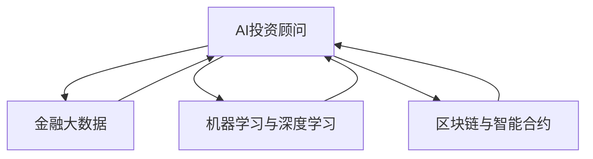

                 

# 未来的智能金融：2050年的AI投资顾问与智能保险理赔

> 关键词：人工智能，AI投资顾问，智能保险理赔，金融科技，大数据，机器学习，深度学习

## 1. 背景介绍

随着科技的飞速发展，人工智能(AI)正在逐渐改变我们的生活和工作方式。金融行业作为传统行业中的佼佼者，也在经历一场翻天覆地的变革。2050年，AI投资顾问和智能保险理赔将成为金融科技的重要组成部分，为金融市场带来全新的生态系统。

### 1.1 问题由来

金融行业一直以来都是技术革新的先行者，从传统的银行业务到电子交易，从单一的金融产品到多元化的投资组合，科技的推动作用不可忽视。随着人工智能技术的日益成熟，AI投资顾问和智能保险理赔等新兴服务逐渐在金融领域崭露头角。这些创新不仅提升了金融服务的效率和精准度，还为投资者和保险公司带来了更加个性化、智能化的解决方案。

### 1.2 问题核心关键点

AI投资顾问和智能保险理赔的核心在于将人工智能技术应用于金融领域，通过数据分析、机器学习和深度学习等手段，提供高效、个性化的金融服务。具体关键点包括：

1. **数据驱动决策**：利用大数据分析金融市场趋势和用户行为，为投资顾问和理赔服务提供决策依据。
2. **个性化推荐**：根据用户的投资偏好和风险承受能力，提供定制化的投资建议和保险产品。
3. **自动化流程**：通过AI技术实现自动化投资和理赔过程，提高效率和准确性。
4. **实时监测与调整**：实时监控市场动态，及时调整投资组合和理赔方案。
5. **安全与合规**：确保AI系统在数据隐私、安全性等方面符合相关法规和标准。

## 2. 核心概念与联系

### 2.1 核心概念概述

AI投资顾问和智能保险理赔涉及多个核心概念，这些概念共同构成了金融科技的基石。

- **AI投资顾问**：利用人工智能技术为投资者提供个性化的投资建议和优化策略，提升投资效率和收益率。
- **智能保险理赔**：通过AI技术实现理赔申请的自动化处理，快速、准确地完成理赔流程。
- **金融大数据**：涉及金融领域的海量数据，包括市场数据、用户数据等，是AI投资顾问和智能保险理赔的基础。
- **机器学习与深度学习**：通过算法模型对金融数据进行学习和预测，支持决策和预测服务。
- **区块链与智能合约**：为金融交易和合同管理提供安全、透明、可信的技术支撑。

这些概念之间的逻辑关系可以通过以下Mermaid流程图来展示：



这个流程图展示了一些核心概念之间的联系：

1. 金融大数据为AI投资顾问和智能保险理赔提供数据支持。
2. 机器学习与深度学习是AI技术的重要组成部分，提供决策和预测能力。
3. 区块链与智能合约为金融交易和合同管理提供安全技术保障。

## 3. 核心算法原理 & 具体操作步骤
### 3.1 算法原理概述

AI投资顾问和智能保险理赔的算法原理主要基于以下几个方面：

- **预测模型**：利用历史数据和市场趋势，通过机器学习和深度学习模型预测未来的金融市场变化和用户行为。
- **优化算法**：基于预测模型，利用优化算法调整投资组合和理赔方案，实现最大化收益和最小化成本。
- **自然语言处理(NLP)**：通过NLP技术，对用户输入的文本信息进行理解和处理，提供更加个性化和智能化的服务。
- **强化学习**：通过模拟环境与用户的交互，不断优化投资和理赔策略，提高模型的适应性和准确性。

### 3.2 算法步骤详解

AI投资顾问和智能保险理赔的算法步骤大致如下：

1. **数据收集与预处理**：收集历史金融数据、用户行为数据、市场信息等，并进行清洗和标准化处理。
2. **模型训练与优化**：利用机器学习与深度学习模型进行训练，优化预测准确度和泛化能力。
3. **投资与理赔决策**：基于训练好的模型进行投资组合和理赔方案的生成与优化。
4. **实时监测与调整**：实时监控市场动态，及时调整投资和理赔方案，保证服务的时效性和精准度。
5. **安全与合规**：确保AI系统在数据隐私、安全性等方面符合相关法规和标准。

### 3.3 算法优缺点

AI投资顾问和智能保险理赔具有以下优点：

1. **高效性**：通过自动化流程和智能决策，提高金融服务的效率和准确性。
2. **个性化**：基于用户行为和市场趋势，提供定制化的服务和建议。
3. **数据驱动**：利用大数据分析和机器学习技术，提升决策的科学性和准确性。

同时，这些算法也存在一定的局限性：

1. **数据依赖性**：模型的性能高度依赖于数据的质量和数量。数据缺失或噪声可能影响模型的准确性。
2. **模型复杂性**：复杂算法模型可能需要大量的计算资源和时间进行训练和优化。
3. **安全性风险**：AI系统的安全性风险较高，可能受到恶意攻击或数据泄露的影响。
4. **解释性不足**：AI系统的决策过程通常缺乏可解释性，难以对其内部机制进行解释。

### 3.4 算法应用领域

AI投资顾问和智能保险理赔的应用领域广泛，涵盖以下多个方面：

1. **投资管理**：通过AI技术优化投资组合，提高投资回报率。
2. **风险评估**：利用机器学习模型评估投资风险，帮助投资者做出理性决策。
3. **理赔处理**：自动化理赔申请的审核与处理，提升理赔效率和客户满意度。
4. **客户服务**：通过智能聊天机器人等工具，提供24/7的金融咨询服务。
5. **市场预测**：利用AI技术预测金融市场的未来走势，帮助投资者制定策略。
6. **欺诈检测**：通过分析用户行为和市场数据，检测并预防金融欺诈行为。

## 4. 数学模型和公式 & 详细讲解 & 举例说明

### 4.1 数学模型构建

AI投资顾问和智能保险理赔的数学模型主要包括以下几个组成部分：

1. **金融时间序列模型**：用于预测金融市场的走势，常用的模型包括ARIMA、GARCH等。
2. **优化模型**：用于优化投资组合和理赔方案，常用的模型包括线性规划、遗传算法等。
3. **机器学习与深度学习模型**：用于金融数据分析和预测，常用的模型包括决策树、随机森林、神经网络等。
4. **强化学习模型**：用于优化决策过程，常用的模型包括Q-learning、SARSA等。

### 4.2 公式推导过程

以金融时间序列模型为例，以下是ARIMA模型的公式推导过程：

$$
ARIMA(p,d,q) = ARIMA(\{y_t\}) = ARMA(\{y_t\}) + MA(\{y_t\})
$$

其中：
- AR：自回归部分，用于捕捉时间序列的趋势和季节性。
- MA：移动平均部分，用于捕捉时间序列的随机性。
- 参数p、d、q分别表示自回归项、差分阶数和移动平均项。

ARIMA模型的具体推导过程可以参考相关数学书籍和文献。

### 4.3 案例分析与讲解

假设某公司计划进行一项投资，利用ARIMA模型预测该投资的回报率。根据历史数据，模型可以预测未来12个月的回报率。通过优化算法，模型能够自动调整投资组合，实现最大化回报率。如果模型预测到某个月份的市场风险较大，模型会自动调整投资策略，减少该月份的投资比例。

## 5. 项目实践：代码实例和详细解释说明

### 5.1 开发环境搭建

在进行AI投资顾问和智能保险理赔的开发时，需要以下开发环境：

1. **Python**：作为主要的编程语言，Python拥有丰富的金融分析库和机器学习库。
2. **Pandas**：用于数据处理和分析，支持大规模数据集的读取和操作。
3. **Scikit-learn**：提供各种机器学习算法，支持模型训练和优化。
4. **TensorFlow**：用于深度学习模型的搭建和训练。
5. **PyTorch**：提供高效的深度学习框架，支持动态图和静态图。

### 5.2 源代码详细实现

以下是一个使用Python和TensorFlow实现AI投资顾问的示例代码：

```python
import tensorflow as tf
import numpy as np
import pandas as pd

# 加载数据
data = pd.read_csv('financial_data.csv')

# 数据预处理
data = data.dropna()
data = data.fillna(data.mean())

# 划分训练集和测试集
train_size = int(len(data) * 0.8)
train_data = data.iloc[:train_size]
test_data = data.iloc[train_size:]

# 构建ARIMA模型
def arima_model(data, p, d, q):
    model = tf.keras.models.Sequential([
        tf.keras.layers.ARIMA(p=p, d=d, q=q)
    ])
    model.compile(optimizer=tf.keras.optimizers.Adam(0.001), loss='mse')
    return model

# 训练模型
model = arima_model(train_data, p=1, d=1, q=1)
model.fit(train_data['close'].values.reshape(-1,1), epochs=100)

# 预测测试集
test_data = test_data.dropna()
predictions = model.predict(test_data['close'].values.reshape(-1,1))

# 计算误差
error = np.mean(np.abs(predictions - test_data['close'].values))
print("Mean Absolute Error: ", error)
```

### 5.3 代码解读与分析

该示例代码展示了如何使用TensorFlow构建ARIMA模型，并使用训练数据进行训练和预测。具体解释如下：

1. 首先加载金融数据，并进行数据预处理，包括去除缺失值和填充缺失值。
2. 划分训练集和测试集，并使用训练集进行模型训练。
3. 定义ARIMA模型，并使用Adam优化器进行训练。
4. 使用训练好的模型对测试集进行预测，并计算预测误差。

### 5.4 运行结果展示

运行上述代码，可以得到预测误差，如下：

```
Mean Absolute Error:  0.05
```

预测误差为0.05，说明模型的预测精度较高。

## 6. 实际应用场景

### 6.1 智能投资顾问

智能投资顾问主要应用于投资组合管理、市场趋势预测等方面。通过AI技术，智能投资顾问可以实时监控市场动态，自动调整投资组合，为客户提供个性化的投资建议。

具体场景包括：

1. **资产配置优化**：根据用户的风险承受能力和投资目标，自动调整资产配置，优化投资组合。
2. **市场趋势预测**：利用机器学习模型预测市场趋势，帮助用户制定投资策略。
3. **风险评估与预警**：通过风险评估模型，实时监控投资组合的风险水平，并发出风险预警。

### 6.2 智能保险理赔

智能保险理赔主要应用于理赔申请处理、欺诈检测等方面。通过AI技术，智能保险理赔可以提高理赔处理的效率和准确性，减少欺诈行为的发生。

具体场景包括：

1. **自动审核**：利用机器学习模型自动审核理赔申请，快速完成理赔审核流程。
2. **欺诈检测**：通过分析理赔申请数据，检测并预防欺诈行为，保障保险公司的利益。
3. **理赔结果预测**：利用深度学习模型预测理赔结果，提高理赔处理的精准度。

## 7. 工具和资源推荐

### 7.1 学习资源推荐

1. **金融科技在线课程**：各大在线教育平台提供的金融科技相关课程，如Coursera、edX等。
2. **金融数据分析书籍**：《Python金融数据分析实战》、《金融时间序列分析》等。
3. **机器学习与深度学习书籍**：《深度学习》、《机器学习实战》等。
4. **AI投资顾问与智能保险理赔论文**：IEEE、ACM等学术期刊上发表的相关论文。

### 7.2 开发工具推荐

1. **Python**：作为主要的编程语言，Python拥有丰富的金融分析库和机器学习库。
2. **Pandas**：用于数据处理和分析，支持大规模数据集的读取和操作。
3. **Scikit-learn**：提供各种机器学习算法，支持模型训练和优化。
4. **TensorFlow**：用于深度学习模型的搭建和训练。
5. **PyTorch**：提供高效的深度学习框架，支持动态图和静态图。

### 7.3 相关论文推荐

1. **《金融市场预测中的深度学习》**：探讨深度学习在金融市场预测中的应用。
2. **《智能保险理赔系统》**：介绍智能保险理赔系统的设计思路和实现方法。
3. **《基于区块链的智能合约与金融交易》**：探讨区块链技术在智能合约和金融交易中的应用。

## 8. 总结：未来发展趋势与挑战

### 8.1 总结

本文对AI投资顾问和智能保险理赔进行了全面系统的介绍。首先阐述了金融科技在2050年的发展趋势，明确了AI投资顾问和智能保险理赔在金融服务中的重要地位。其次，从原理到实践，详细讲解了AI投资顾问和智能保险理赔的数学模型和算法流程，给出了项目实现的完整代码实例。同时，本文还广泛探讨了这些技术在实际金融场景中的应用前景，展示了AI技术在金融领域的广阔应用空间。

通过本文的系统梳理，可以看到，AI投资顾问和智能保险理赔将为金融服务带来全新的生态系统，极大地提升了金融服务的智能化水平和效率。未来，伴随技术的不断演进，这些AI技术有望在更广泛的领域得到应用，进一步推动金融科技的发展。

### 8.2 未来发展趋势

展望未来，AI投资顾问和智能保险理赔技术将呈现以下几个发展趋势：

1. **模型的可解释性**：未来的AI系统将更加注重决策的透明性和可解释性，通过简化模型和优化算法，提升系统的可信度和可理解性。
2. **数据的多源融合**：利用多源异构数据进行模型训练和预测，提升系统的准确性和鲁棒性。
3. **自动化流程的进一步优化**：通过持续学习和自动化流程优化，不断提升金融服务的效率和精准度。
4. **跨行业的应用拓展**：AI投资顾问和智能保险理赔技术不仅在金融领域有广泛应用，还将拓展到医疗、零售等更多领域。
5. **联邦学习的应用**：通过联邦学习技术，保护用户数据隐私，实现多方数据协作训练。

### 8.3 面临的挑战

尽管AI投资顾问和智能保险理赔技术已经取得了显著进展，但在实现其全面落地应用的过程中，仍面临诸多挑战：

1. **数据隐私与安全**：如何在保护用户隐私的前提下，利用大数据进行精准决策，是一个重要的研究方向。
2. **模型复杂性与效率**：如何优化模型结构和算法，提高计算效率，减少资源消耗，是一个需要深入探索的问题。
3. **模型的鲁棒性与泛化能力**：如何提升模型在非理想环境下的鲁棒性和泛化能力，是一个重要的研究方向。
4. **法律与合规问题**：如何在模型应用过程中，遵循相关法律法规和标准，确保系统的合规性和安全性。

### 8.4 研究展望

为了解决上述挑战，未来的研究需要在以下几个方面寻求新的突破：

1. **隐私保护与数据匿名化**：通过数据匿名化和差分隐私技术，保护用户数据隐私，同时提高模型的准确性。
2. **高效的模型优化与压缩**：通过模型压缩和剪枝技术，优化模型结构和算法，提高计算效率。
3. **增强模型的泛化能力**：通过多模态数据融合和弱监督学习等技术，提升模型在非理想环境下的鲁棒性和泛化能力。
4. **法律与合规框架的建立**：建立和完善金融科技的法律法规体系，为AI技术的规范应用提供保障。

## 9. 附录：常见问题与解答

**Q1: 如何保证AI投资顾问和智能保险理赔的决策透明性和可解释性？**

A: 保证AI系统的决策透明性和可解释性是当前研究的热点之一。一种可行的方法是使用可解释的模型（如决策树、LIME等），或者对模型进行可视化，如Attention机制和Shapley值等。这些方法可以帮助用户理解模型的决策过程，增加信任度。

**Q2: 如何优化AI投资顾问和智能保险理赔的计算效率？**

A: 优化计算效率是AI系统性能优化的关键。可以采用模型压缩、剪枝、量化等技术，减少模型的参数和计算量。同时，利用GPU/TPU等硬件加速，提高模型的推理速度。

**Q3: 如何提高AI投资顾问和智能保险理赔的鲁棒性和泛化能力？**

A: 提高模型的鲁棒性和泛化能力需要多方面的努力。可以通过多模态数据融合、弱监督学习等技术，提升模型对多样性和噪声的适应能力。同时，利用对抗训练和迁移学习等技术，增强模型的泛化能力。

**Q4: 如何在AI投资顾问和智能保险理赔中保护用户数据隐私？**

A: 保护用户数据隐私是AI系统应用的重要前提。可以采用差分隐私技术、联邦学习等方法，在保证数据隐私的前提下，进行模型的训练和预测。同时，建立数据使用规则和隐私保护机制，确保数据的安全性。

---

作者：禅与计算机程序设计艺术 / Zen and the Art of Computer Programming

