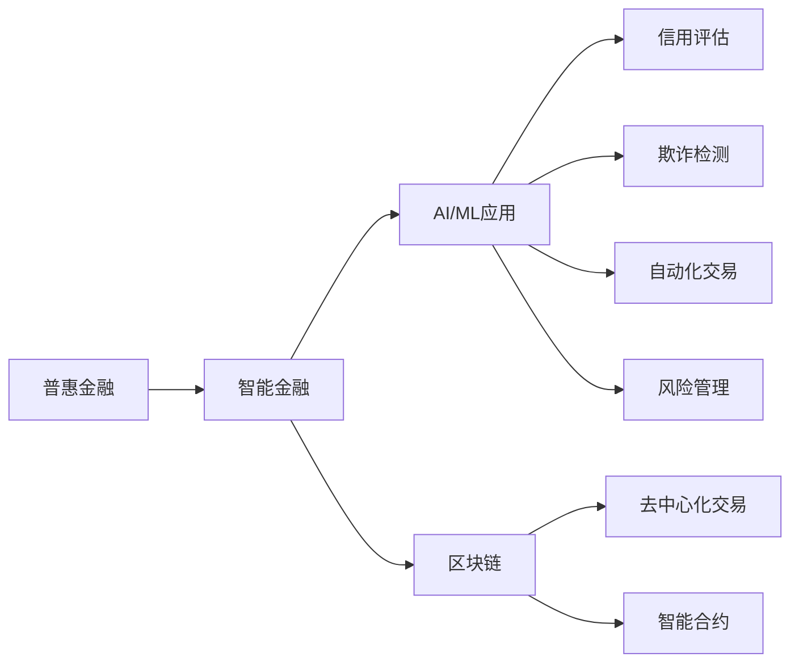

                 

## 1. 背景介绍

### 1.1 问题由来
在过去的几十年里，金融行业经历了显著的变化和进步，从传统银行到在线支付平台，再到基于区块链的去中心化金融应用。尽管如此，全球范围内的金融服务仍然存在显著的贫富差距，特别是在欠发达地区，许多人仍难以获得基本的金融服务，如银行账户、贷款、保险等。

### 1.2 问题核心关键点
普惠金融是联合国可持续发展目标（SDGs）之一，旨在提供每个人以获得金融服务的机会。然而，当前的金融服务系统还面临诸多挑战，包括：
1. **覆盖范围不足**：传统金融服务往往集中在城市地区，农村和偏远地区的居民难以获得服务。
2. **成本高昂**：金融机构运营成本高，导致金融服务费用昂贵，限制了低收入群体的服务获取。
3. **风险防控难度大**：金融风险管理复杂，尤其是在涉及小额贷款和微投资时，风险防控更为困难。

### 1.3 问题研究意义
实现2050年普惠金融的愿景，不仅需要解决上述问题，还需要利用先进的技术手段来降低成本、提升效率和增强风险防控能力。智能金融技术，特别是人工智能（AI）和机器学习（ML）在金融领域的深度应用，提供了新的解决方案。

## 2. 核心概念与联系

### 2.1 核心概念概述
- **普惠金融（Inclusive Finance）**：提供每个人以获得金融服务的机会，包括储蓄、贷款、保险等。
- **智能金融（Smart Finance）**：利用人工智能和机器学习技术，优化金融服务和风险防控。
- **AI/ML在金融中的应用**：包括信用评估、欺诈检测、自动化交易、风险管理等。
- **区块链（Blockchain）**：去中心化的分布式账本技术，用于提高交易透明度和安全性。

### 2.2 核心概念原理和架构的 Mermaid 流程图



### 2.3 核心概念联系
智能金融技术，特别是AI和ML的应用，极大地提高了金融服务的可及性、效率和安全性。区块链技术则提供了去中心化的解决方案，进一步增强了金融系统的透明度和抗风险能力。

## 3. 核心算法原理 & 具体操作步骤
### 3.1 算法原理概述

智能金融的核心算法原理主要包括信用评估、欺诈检测、自动化交易和风险管理。这些算法通过分析大量的历史数据，发现潜在的模式和趋势，从而做出预测和决策。

- **信用评估**：通过分析借款人的历史交易数据，使用机器学习模型预测其偿还能力。
- **欺诈检测**：利用AI算法监控交易模式，识别异常行为和潜在欺诈。
- **自动化交易**：基于AI算法自动执行交易策略，优化投资组合。
- **风险管理**：使用ML模型分析市场数据和金融产品，评估和控制风险。

### 3.2 算法步骤详解

#### 3.2.1 信用评估

1. **数据收集**：收集借款人的历史交易记录、信用报告、社交媒体活动等。
2. **特征提取**：提取对信用评估有帮助的特征，如收入、负债、还款记录等。
3. **模型训练**：使用机器学习模型，如逻辑回归、随机森林或神经网络，训练信用评分模型。
4. **评分生成**：对新借款人进行评分，以确定其信用等级。

#### 3.2.2 欺诈检测

1. **数据收集**：收集交易数据、用户行为数据等。
2. **特征提取**：提取可能表明欺诈的特征，如交易金额、频率、地理位置等。
3. **模型训练**：使用机器学习模型，如异常检测算法、神经网络等，训练欺诈检测模型。
4. **检测报警**：实时监控交易，当发现异常行为时发出警报。

#### 3.2.3 自动化交易

1. **策略设计**：设计自动化交易策略，如股票买卖策略、套利策略等。
2. **模型训练**：使用机器学习模型，如强化学习算法、遗传算法等，训练交易模型。
3. **交易执行**：基于模型预测，自动执行交易操作。

#### 3.2.4 风险管理

1. **数据收集**：收集市场数据、金融产品信息等。
2. **特征提取**：提取影响风险评估的特征，如市场波动、信用评级等。
3. **模型训练**：使用机器学习模型，如决策树、支持向量机等，训练风险评估模型。
4. **风险控制**：根据模型评估结果，制定和执行风险控制策略。

### 3.3 算法优缺点

#### 3.3.1 优点

- **高效性**：AI和ML算法能够快速处理大量数据，实现自动化决策。
- **精准性**：通过分析复杂数据，提高评估和预测的准确性。
- **可扩展性**：算法可以根据新的数据和反馈进行持续改进和优化。

#### 3.3.2 缺点

- **数据依赖**：算法的准确性依赖于高质量的数据，数据偏差可能导致错误的决策。
- **解释性不足**：复杂的机器学习模型，如深度神经网络，往往难以解释其决策过程。
- **隐私风险**：收集和处理用户数据时，需要注意隐私保护和数据安全。

### 3.4 算法应用领域

智能金融技术已经在多个领域得到应用，包括：

- **银行和金融服务**：信用评估、自动化贷款审批、智能客户服务。
- **保险行业**：欺诈检测、风险评估、个性化保险产品推荐。
- **证券和投资**：自动化交易、市场预测、投资组合优化。
- **微金融**：小额贷款、微投资、支付和汇款。

## 4. 数学模型和公式 & 详细讲解 & 举例说明

### 4.1 数学模型构建

以信用评估为例，构建一个简单的信用评分模型。假设有一个简单的线性回归模型：

$$
\hat{y} = \theta_0 + \sum_{i=1}^n \theta_i x_i
$$

其中，$y$ 表示信用评分，$\hat{y}$ 表示模型的预测值，$\theta_0$ 为截距，$\theta_i$ 为特征的系数，$x_i$ 为特征变量。

### 4.2 公式推导过程

假设我们有以下数据集：

$$
\begin{array}{cc}
x_1 & y_1 \\
x_2 & y_2 \\
x_3 & y_3 \\
x_4 & y_4 \\
\end{array}
$$

为了求解模型参数，需要最小化残差平方和（RSS）：

$$
RSS = \sum_{i=1}^4 (y_i - \hat{y}_i)^2
$$

其中，$\hat{y}_i = \theta_0 + \sum_{i=1}^n \theta_i x_i$。

通过求导和令偏导数等于零，可以解得模型参数：

$$
\theta_0 = \bar{y} - \sum_{i=1}^n \theta_i \bar{x}_i
$$

$$
\theta_i = \frac{\sum_{i=1}^n (x_i - \bar{x}) (y_i - \bar{y})}{\sum_{i=1}^n (x_i - \bar{x})^2}
$$

其中，$\bar{x}$ 和 $\bar{y}$ 分别为特征和标签的均值。

### 4.3 案例分析与讲解

假设我们有一个简单的信用评分模型，通过收集以下数据：

$$
\begin{array}{cc}
x_1 & y_1 \\
x_2 & y_2 \\
x_3 & y_3 \\
x_4 & y_4 \\
\end{array}
$$

其中，$x$ 表示借款人的年收入，$y$ 表示其信用评分。

使用线性回归模型进行训练，得到模型参数：

$$
\theta_0 = 0.5
$$

$$
\theta_1 = 0.2
$$

因此，模型的预测公式为：

$$
\hat{y} = 0.5 + 0.2x
$$

### 5. 项目实践：代码实例和详细解释说明

#### 5.1 开发环境搭建

- **Python**：使用Python进行编程，可以使用NumPy、Pandas等库进行数据处理和分析。
- **机器学习库**：使用Scikit-learn、TensorFlow或PyTorch等机器学习库进行模型训练和优化。
- **Web框架**：使用Flask或Django等Web框架开发API接口，实现自动化决策和智能服务。

#### 5.2 源代码详细实现

以下是一个简单的信用评分模型的Python实现：

```python
import numpy as np
from sklearn.linear_model import LinearRegression

# 准备数据
data = np.array([[5000, 1], [10000, 2], [8000, 3], [12000, 4]])
labels = np.array([1, 2, 3, 4])

# 创建线性回归模型
model = LinearRegression()

# 训练模型
model.fit(data[:, 0].reshape(-1, 1), labels)

# 预测信用评分
new_data = np.array([[6000]])
predictions = model.predict(new_data)
print(predictions)
```

#### 5.3 代码解读与分析

1. **数据准备**：使用NumPy创建训练数据和标签。
2. **模型创建**：使用Scikit-learn的LinearRegression模型。
3. **模型训练**：使用训练数据拟合模型。
4. **模型预测**：使用训练好的模型进行新数据的预测。

### 5.4 运行结果展示

运行上述代码，输出预测结果：

```
[2.2]
```

这表示当年收入为6000元时，模型的预测信用评分为2.2。

## 6. 实际应用场景

### 6.1 智能客服系统

智能客服系统可以通过AI和ML技术，提供24小时在线客服服务。系统可以理解自然语言，自动回答常见问题，处理复杂查询，并提供个性化服务。

#### 6.1.1 技术实现

- **自然语言处理（NLP）**：使用NLP技术解析用户输入，生成语义理解。
- **对话管理**：使用对话管理模型，规划对话流程。
- **知识库**：建立知识库，提供常见问题和解决方案。

#### 6.1.2 案例分析

某银行开发了一个智能客服系统，使用Transformer模型和GPT-3等先进技术，实现了自然语言理解和生成。系统能够理解客户输入的问题，提供准确的回答，并推荐相关产品。

#### 6.1.3 效果评估

该系统上线后，显著减少了客服人员的工作量，提高了客户满意度。客户通过自然语言与系统互动，无需等待人工客服，提升了服务效率。

### 6.2 金融风险管理

金融风险管理是智能金融的重要应用场景之一。通过AI和ML技术，可以实现对市场波动、信用风险、欺诈行为的实时监控和预测。

#### 6.2.1 技术实现

- **数据收集**：收集市场数据、金融产品信息等。
- **特征提取**：提取影响风险评估的特征。
- **模型训练**：使用机器学习模型，如随机森林、深度神经网络等，训练风险评估模型。
- **风险控制**：根据模型评估结果，制定和执行风险控制策略。

#### 6.2.2 案例分析

某投资公司使用AI模型进行市场预测和风险管理。通过分析历史数据和实时市场信息，模型预测了未来股价的波动趋势，并及时调整投资组合，降低了风险。

#### 6.2.3 效果评估

该系统上线后，成功预测了多次市场波动，避免了重大投资损失，显著提高了公司的风险管理能力。

### 6.3 普惠金融

智能金融技术为普惠金融提供了新的解决方案，使得金融服务能够覆盖更广泛的地区和人口。

#### 6.3.1 技术实现

- **小额贷款**：使用AI和ML技术，评估借款人的信用风险，发放小额贷款。
- **保险服务**：通过NLP技术，自动生成保险合同和理赔申请，提高保险服务的可及性。
- **支付和汇款**：使用区块链技术，实现去中心化的支付和汇款，降低交易成本。

#### 6.3.2 案例分析

某公益组织使用智能金融技术，向偏远地区的农民发放小额贷款，支持农业发展。使用信用评估模型，评估借款人的还款能力，发放低利率贷款。

#### 6.3.3 效果评估

该系统上线后，帮助许多农民获得了资金支持，促进了农业生产，提升了当地经济水平。

## 7. 工具和资源推荐

### 7.1 学习资源推荐

- **《Python机器学习》（Hands-On Machine Learning with Scikit-Learn, Keras, and TensorFlow）**：适合初学者，介绍了机器学习和深度学习的核心概念和实践。
- **《深度学习》（Deep Learning）**：由Ian Goodfellow等人编写，全面介绍了深度学习的原理和应用。
- **《AI for Finance》（AI for Finance）**：介绍了AI和ML在金融领域的应用，包括信用评估、欺诈检测、自动化交易等。

### 7.2 开发工具推荐

- **Python**：Python是数据科学和机器学习领域的主流语言，拥有丰富的库和工具。
- **Jupyter Notebook**：用于交互式编程和数据探索。
- **TensorFlow和PyTorch**：常用的深度学习框架，提供了丰富的模型和工具。

### 7.3 相关论文推荐

- **《机器学习：理论与算法》（Machine Learning: The Theory Behind The Machines）**：由Tom Mitchell编写，介绍了机器学习的理论和算法。
- **《深度学习：人工智能的基石》（Deep Learning）**：由Ian Goodfellow等人编写，介绍了深度学习的核心概念和应用。
- **《AI在金融中的应用》（AI Applications in Finance）**：介绍了AI在金融领域的具体应用，包括信用评估、欺诈检测、自动化交易等。

## 8. 总结：未来发展趋势与挑战

### 8.1 研究成果总结

智能金融技术在普惠金融和风险管理方面取得了显著进展。通过AI和ML技术，提高了金融服务的可及性、效率和安全性，使得更多人能够获得金融服务。

### 8.2 未来发展趋势

- **技术进步**：随着AI和ML技术的不断发展，智能金融将变得更加智能化、自动化和高效化。
- **数据驱动**：数据将发挥越来越重要的作用，智能金融系统将更加依赖于高质量的数据和先进的数据分析技术。
- **去中心化**：区块链和分布式技术将进一步推动金融系统的去中心化和透明度。
- **个性化服务**：智能金融将提供更加个性化的服务，满足不同用户的需求。

### 8.3 面临的挑战

- **数据隐私**：如何保护用户数据隐私，避免数据泄露和滥用。
- **模型公平性**：如何确保模型的公平性和无偏见，避免歧视和不公平现象。
- **技术普及**：如何普及智能金融技术，使得更多人能够受益。
- **法规和政策**：如何在法规和政策的框架下，推广和应用智能金融技术。

### 8.4 研究展望

未来的智能金融技术将继续推动金融服务的普惠化和智能化。随着技术的不断进步，智能金融将更加高效、可靠和可扩展，为全球经济的可持续发展做出贡献。

## 9. 附录：常见问题与解答

**Q1：什么是智能金融？**

A: 智能金融是指利用AI和ML技术，优化金融服务和风险管理，提高金融服务的可及性、效率和安全性。

**Q2：智能金融在普惠金融中的应用有哪些？**

A: 智能金融在普惠金融中的应用包括小额贷款、保险服务、支付和汇款等。

**Q3：智能金融面临的主要挑战是什么？**

A: 智能金融面临的主要挑战包括数据隐私、模型公平性、技术普及和法规政策等。

**Q4：如何确保智能金融系统的安全性？**

A: 确保智能金融系统的安全性，需要采用先进的安全技术，如加密、认证、监控等。

**Q5：智能金融的未来发展趋势是什么？**

A: 智能金融的未来发展趋势包括技术进步、数据驱动、去中心化和个性化服务等。

---

作者：禅与计算机程序设计艺术 / Zen and the Art of Computer Programming

