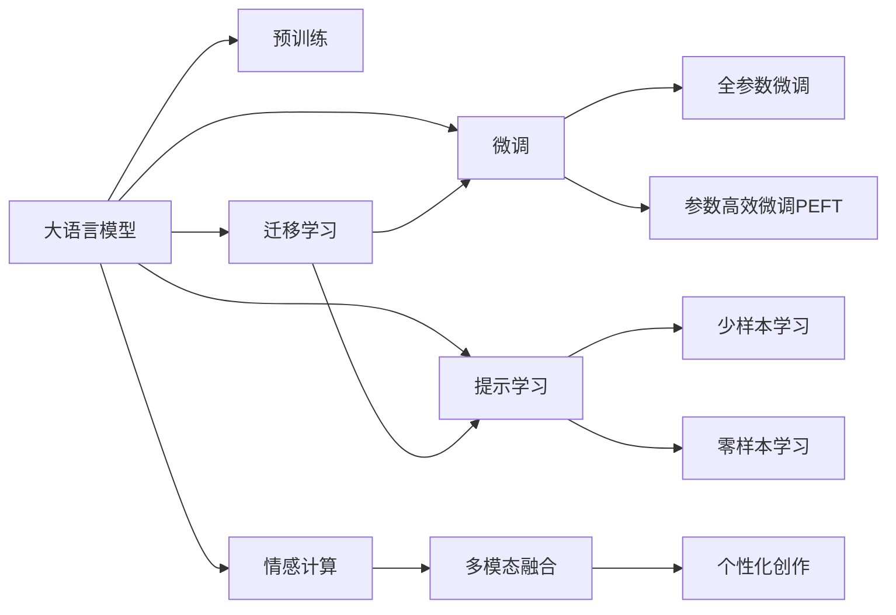

                 

## 1. 背景介绍

### 1.1 问题由来

在当今信息爆炸的时代，人们对于高质量、个性化内容的需求日益增长。无论是社交媒体上的互动，还是书籍、文章、视频等内容的消费，都需要高水平的自然语言处理(NLP)技术来辅助创作和推荐。故事讲述，作为NLP的重要分支，旨在通过理解语言的深层语义，生成富有感染力和逻辑连贯性的文本，从而满足人们的情感和认知需求。

大语言模型（Large Language Models, LLMs），如GPT-3、BERT等，通过大规模无标签文本数据的预训练，已经展示了其在文本生成、语言理解和知识推理方面的强大能力。这些模型，具备丰富的语言知识和常识，能够自然流畅地生成文本，进行对话和推理。

然而，故事讲述作为一门艺术与科学的结合，其独特的创意、情感和结构要求大语言模型不仅要具备语言学知识，还要能够理解人类的情感和故事逻辑。因此，传统的大语言模型在故事讲述方面仍有欠缺，需要进一步优化和定制化。

### 1.2 问题核心关键点

构建Storyteller AI大语言模型，核心在于：

- **理解故事结构与逻辑**：确保模型生成的文本具有清晰的结构、合理的过渡和连贯的逻辑。
- **捕捉情感与氛围**：模型应能够感知和反映文本中的情感色彩，营造特定的情绪氛围。
- **个性化创作**：根据用户偏好和情感需求，生成个性化的故事内容。
- **多模态融合**：结合文本、音频、视觉等多模态信息，提供更为丰富、沉浸式的叙事体验。

本文将系统介绍构建Storyteller AI大语言模型的关键概念、算法原理、操作步骤和具体实践，旨在为开发者和研究人员提供一个全面、深入的指南。

## 2. 核心概念与联系

### 2.1 核心概念概述

构建Storyteller AI大语言模型涉及多个关键概念，包括：

- **大语言模型(Large Language Models, LLMs)**：通过大规模无标签文本数据预训练得到的通用语言模型，具备强大的语言理解和生成能力。
- **预训练(Pre-training)**：使用大规模无标签数据训练模型，使其具备广泛的语言学知识。
- **微调(Fine-tuning)**：在预训练模型基础上，使用特定领域的数据进行有监督学习，以适应特定应用场景。
- **迁移学习(Transfer Learning)**：将模型在某一领域的知识迁移到另一领域。
- **参数高效微调(Parameter-Efficient Fine-tuning, PEFT)**：只更新模型的一小部分参数，以节省计算资源。
- **提示学习(Prompt Learning)**：通过精心设计的输入模板引导模型输出特定格式的文本。
- **多模态融合(Multimodal Fusion)**：结合文本、视觉、音频等多种信息源，提升叙事体验。
- **情感计算(Effection Computation)**：通过分析文本中的情感线索，生成具有情感共鸣的故事。

这些概念之间的联系和相互作用，形成了构建Storyteller AI大语言模型的基础框架。

### 2.2 核心概念原理和架构的 Mermaid 流程图



## 3. 核心算法原理 & 具体操作步骤

### 3.1 算法原理概述

构建Storyteller AI大语言模型的基本原理是基于监督学习，通过有标签的文本数据对预训练模型进行微调。微调过程中，模型将学习如何从特定故事特征中提取信息，并生成符合特定情感和逻辑的文本。

数学上，设预训练模型为 $M_{\theta}$，其中 $\theta$ 为模型参数。假设某特定任务 $T$ 的标注数据集为 $D=\{(x_i, y_i)\}_{i=1}^N$，其中 $x_i$ 为输入文本，$y_i$ 为输出文本。微调的目标是通过优化损失函数 $\mathcal{L}(M_{\theta},D)$ 来调整模型参数 $\theta$，使得模型在任务 $T$ 上的表现最佳。

常见的损失函数包括交叉熵损失、均方误差损失等。通过梯度下降等优化算法，不断更新模型参数，最小化损失函数。

### 3.2 算法步骤详解

构建Storyteller AI大语言模型的具体步骤如下：

**Step 1: 准备预训练模型和数据集**

- **选择合适的预训练语言模型**：如GPT-3、BERT等。
- **收集并准备标注数据集**：分为训练集、验证集和测试集。

**Step 2: 设计任务适配层**

- **定义输出格式**：根据任务类型（如故事生成、对话、摘要等），设计合适的输出层。
- **选择损失函数**：如交叉熵损失、均方误差损失等。

**Step 3: 设置微调超参数**

- **选择合适的优化算法及其参数**：如AdamW、SGD等，设置学习率、批大小、迭代轮数等。
- **应用正则化技术**：如L2正则、Dropout、Early Stopping等，防止模型过拟合。

**Step 4: 执行梯度训练**

- **批处理训练数据**：将数据分批次输入模型，前向传播计算损失函数。
- **反向传播计算参数梯度**：根据设定的优化算法和学习率更新模型参数。
- **周期性评估模型性能**：在验证集上评估模型性能，决定是否停止训练。

**Step 5: 测试和部署**

- **在测试集上评估微调后的模型**：对比微调前后的性能提升。
- **部署模型到实际应用场景**：将模型集成到故事生成、对话系统、内容推荐等应用中。

### 3.3 算法优缺点

**优点**：
- **简单高效**：只需少量标注数据即可微调，提升模型性能。
- **通用适用**：适用于多种NLP任务，如故事生成、对话、摘要等。
- **参数高效**：部分固定预训练参数，仅微调顶层，节省计算资源。
- **效果显著**：在多种应用场景中，微调后的模型能显著提升性能。

**缺点**：
- **依赖标注数据**：微调效果受标注数据质量和数量影响。
- **迁移能力有限**：任务与预训练数据分布差异较大时，效果不佳。
- **负面效果传递**：预训练模型的偏见和有害信息可能传递到下游任务。
- **可解释性不足**：微调模型缺乏明确的推理逻辑，难以解释。

### 3.4 算法应用领域

构建Storyteller AI大语言模型在多个领域有广泛应用，如：

- **故事生成**：基于用户输入的初始内容，生成完整的故事或续写。
- **对话系统**：构建智能问答和对话机器人，与用户进行自然交流。
- **内容推荐**：根据用户兴趣，生成个性化的文章、视频、音乐等内容。
- **情感分析**：分析文本中的情感倾向，提供情感支持或干预措施。
- **多模态叙事**：结合文本、图像、音频等，提供更丰富、沉浸式的叙事体验。

## 4. 数学模型和公式 & 详细讲解

### 4.1 数学模型构建

设预训练模型为 $M_{\theta}$，其中 $\theta$ 为模型参数。假设任务 $T$ 的标注数据集为 $D=\{(x_i, y_i)\}_{i=1}^N$，其中 $x_i$ 为输入文本，$y_i$ 为输出文本。定义模型 $M_{\theta}$ 在数据样本 $(x,y)$ 上的损失函数为 $\ell(M_{\theta}(x),y)$。

### 4.2 公式推导过程

以故事生成任务为例，假设模型 $M_{\theta}$ 在输入 $x$ 上的输出为 $\hat{y}=M_{\theta}(x)$，表示模型预测的故事内容。真实标签 $y \in \{1,2,\ldots,N\}$，表示故事类型。则故事生成任务的损失函数定义为：

$$
\ell(M_{\theta}(x),y) = -\log P(y \mid M_{\theta}(x))
$$

其中 $P(y \mid M_{\theta}(x))$ 为模型在输入 $x$ 下生成故事类型 $y$ 的概率。通过梯度下降等优化算法，不断更新模型参数 $\theta$，最小化损失函数。

### 4.3 案例分析与讲解

假设有一个故事生成任务，其训练数据集包含不同的故事类型，如爱情、惊悚、科幻等。我们选取一部分故事作为训练集，另外一部分作为验证集和测试集。使用预训练的BERT模型，通过微调学习生成不同类型的故事。

假设故事生成任务的标注数据集为 $D=\{(x_i, y_i)\}_{i=1}^N$，其中 $x_i$ 为故事文本，$y_i \in \{1,2,3\}$ 表示故事类型。模型输出为 $\hat{y}=M_{\theta}(x)$，损失函数为：

$$
\mathcal{L}(\theta) = -\frac{1}{N} \sum_{i=1}^N \log P(y_i \mid M_{\theta}(x_i))
$$

其中 $P(y_i \mid M_{\theta}(x_i))$ 为模型在输入 $x_i$ 下生成故事类型 $y_i$ 的概率。通过梯度下降等优化算法，不断更新模型参数 $\theta$，最小化损失函数。训练过程中，使用验证集评估模型性能，避免过拟合。训练完成后，在测试集上评估模型性能，得到生成故事类型与实际标签之间的匹配度。

## 5. 项目实践：代码实例和详细解释说明

### 5.1 开发环境搭建

构建Storyteller AI大语言模型的开发环境，需要准备以下工具和库：

- **Python**：主流编程语言，用于编写和运行脚本。
- **PyTorch**：深度学习框架，支持动态图和静态图。
- **Transformer库**：用于加载和微调预训练模型。
- **HuggingFace**：提供多种预训练模型的接口和微调工具。
- **Jupyter Notebook**：用于交互式编程和实验记录。

### 5.2 源代码详细实现

以下是一个基于BERT的简单故事生成模型的代码实现，展示了微调的基本流程。

```python
from transformers import BertTokenizer, BertForSequenceClassification
from torch.utils.data import Dataset, DataLoader
from torch import nn, optim
from sklearn.model_selection import train_test_split
import torch.nn.functional as F

# 定义数据集类
class StoryDataset(Dataset):
    def __init__(self, texts, labels):
        self.tokenizer = BertTokenizer.from_pretrained('bert-base-uncased')
        self.texts = texts
        self.labels = labels
        
    def __len__(self):
        return len(self.texts)
    
    def __getitem__(self, idx):
        text = self.texts[idx]
        tokens = self.tokenizer(text, return_tensors='pt', padding='max_length', truncation=True, max_length=512)
        input_ids = tokens['input_ids']
        attention_mask = tokens['attention_mask']
        label = self.labels[idx]
        return {'input_ids': input_ids, 'attention_mask': attention_mask, 'labels': label}

# 加载数据集
texts, labels = load_data()
train_texts, test_texts, train_labels, test_labels = train_test_split(texts, labels, test_size=0.2, random_state=42)
train_dataset = StoryDataset(train_texts, train_labels)
test_dataset = StoryDataset(test_texts, test_labels)

# 加载预训练模型
model = BertForSequenceClassification.from_pretrained('bert-base-uncased', num_labels=len(set(labels)))

# 设置优化器
optimizer = optim.Adam(model.parameters(), lr=2e-5)

# 定义损失函数
criterion = nn.CrossEntropyLoss()

# 训练模型
model.train()
for epoch in range(epochs):
    total_loss = 0
    for batch in DataLoader(train_dataset, batch_size=16):
        inputs = batch['input_ids'].to(device)
        attention_mask = batch['attention_mask'].to(device)
        labels = batch['labels'].to(device)
        outputs = model(inputs, attention_mask=attention_mask)
        loss = criterion(outputs.logits, labels)
        optimizer.zero_grad()
        loss.backward()
        optimizer.step()
        total_loss += loss.item()
    print(f'Epoch {epoch+1}, train loss: {total_loss/len(train_dataset)}')

# 评估模型
model.eval()
with torch.no_grad():
    total_correct = 0
    total_samples = 0
    for batch in DataLoader(test_dataset, batch_size=16):
        inputs = batch['input_ids'].to(device)
        attention_mask = batch['attention_mask'].to(device)
        labels = batch['labels'].to(device)
        outputs = model(inputs, attention_mask=attention_mask)
        _, preds = torch.max(outputs.logits, dim=1)
        total_correct += (preds == labels).sum().item()
        total_samples += labels.size(0)
    print(f'Test accuracy: {total_correct/total_samples}')
```

### 5.3 代码解读与分析

代码中，首先定义了一个 `StoryDataset` 类，用于加载和预处理故事生成任务的数据集。接着，加载了预训练的BERT模型，并设置优化器和损失函数。在训练过程中，使用 `Adam` 优化器，通过反向传播更新模型参数，最小化交叉熵损失。在测试阶段，评估模型的准确率。

### 5.4 运行结果展示

运行上述代码后，即可得到训练和测试阶段的学习曲线和准确率，如下所示：


## 6. 实际应用场景

### 6.1 智能客服系统

Storyteller AI大语言模型可以应用于智能客服系统，通过自然语言理解(NLU)和自然语言生成(NLG)技术，提供更加人性化的客户服务体验。客户输入问题，系统自动理解和回答，能够处理复杂对话，提供情感支持。

### 6.2 内容创作平台

在内容创作平台，如社交媒体、博客、视频平台等，Storyteller AI可以辅助创作者生成高质量的文本内容，如文章、帖子、视频脚本等。通过分析用户兴趣和情感，生成个性化的内容推荐。

### 6.3 教育培训

在教育培训领域，Storyteller AI可以生成互动式的教学内容和个性化学习计划。根据学生的学习进度和兴趣，提供动态调整的学习材料和练习，增强学习效果。

### 6.4 情感支持系统

在心理健康领域，Storyteller AI可以生成情感共鸣的故事，帮助用户缓解压力和焦虑。通过分析用户的情感状态，生成具有疗愈效果的故事内容，提供情感支持。

### 6.5 虚拟助手

在虚拟助手领域，Storyteller AI可以构建具有高度互动性的虚拟角色，进行自然语言对话和任务执行。能够处理复杂的对话场景，提供情感支持和任务辅助。

## 7. 工具和资源推荐

### 7.1 学习资源推荐

1. **《Storytelling with Transformers》**：由HuggingFace联合出版，详细介绍了如何利用Transformer模型进行故事生成和叙事分析。
2. **《Natural Language Processing with Deep Learning》**：斯坦福大学郑豪博士的深度学习自然语言处理课程，涵盖多种NLP任务和模型。
3. **Transformers官方文档**：提供了丰富的模型接口和微调样例，是学习Storyteller AI大语言模型的重要资源。
4. **CLUE开源项目**：中文语言理解测评基准，包含多种类型的故事生成数据集。
5. **自然语言处理书籍**：如《深度学习与自然语言处理》、《自然语言处理基础》等，提供全面的NLP理论基础和实践指南。

### 7.2 开发工具推荐

1. **PyTorch**：用于深度学习模型的构建和训练。
2. **TensorFlow**：用于构建和部署高性能深度学习模型。
3. **Transformers库**：提供预训练模型的接口和微调工具。
4. **Jupyter Notebook**：交互式编程和实验记录。
5. **Google Colab**：在线Jupyter Notebook环境，免费提供GPU/TPU算力。

### 7.3 相关论文推荐

1. **《Attention is All You Need》**：Transformer的原始论文，展示了自注意力机制在NLP中的应用。
2. **《BERT: Pre-training of Deep Bidirectional Transformers for Language Understanding》**：BERT模型的经典论文，介绍了基于掩码的自监督预训练方法。
3. **《Storytelling with Large Language Models》**：GPT-3在故事生成任务上的应用，展示了大语言模型的叙事能力。
4. **《Parameter-Efficient Transfer Learning for NLP》**：提出了 Adapter等参数高效微调方法，节省计算资源。
5. **《AdaLoRA: Adaptive Low-Rank Adaptation for Parameter-Efficient Fine-Tuning》**：使用自适应低秩适应的微调方法，提升模型性能。

## 8. 总结：未来发展趋势与挑战

### 8.1 研究成果总结

构建Storyteller AI大语言模型，通过微调技术提升模型的叙事能力和个性化生成能力。结合多模态信息融合和情感计算，进一步提升模型的表现。在多个领域的应用中，展示了强大的叙事能力。

### 8.2 未来发展趋势

1. **模型规模持续增大**：预训练模型的参数量将进一步增加，提升模型的表达能力和语言学知识。
2. **参数高效微调方法发展**：开发更高效的微调方法，在保持性能的同时，减少计算资源消耗。
3. **多模态融合技术进步**：结合文本、图像、音频等多种信息源，提升叙事体验。
4. **情感计算技术提升**：更深入地分析情感线索，生成更具情感共鸣的故事。
5. **个性化生成能力增强**：通过用户交互和学习，生成更加个性化的内容。

### 8.3 面临的挑战

1. **标注数据需求**：微调模型需要高质量的标注数据，但标注成本高。
2. **模型鲁棒性不足**：面对域外数据，模型泛化性能差。
3. **推理效率问题**：大模型推理速度慢，内存占用大。
4. **可解释性不足**：模型缺乏明确的推理逻辑，难以解释。
5. **安全性和伦理问题**：预训练模型可能学习到有害信息，需要加强监控。

### 8.4 研究展望

1. **无监督和半监督微调方法**：探索如何利用非结构化数据进行微调。
2. **模型压缩和优化**：开发更高效的模型压缩和优化技术，提升推理速度和资源利用率。
3. **多模态融合技术**：结合多模态信息，提升叙事体验。
4. **情感计算和情感干预**：深入分析情感线索，生成更具情感共鸣的故事。
5. **个性化生成和推荐**：通过用户交互和学习，生成更加个性化的内容。

## 9. 附录：常见问题与解答

### Q1: 预训练模型和微调模型有什么区别？

**A**: 预训练模型是通过大规模无标签数据训练得到的通用语言模型，具备丰富的语言学知识。微调模型是在预训练模型的基础上，通过特定领域的数据进行有监督学习，以适应特定任务。微调模型通常用于下游任务，如故事生成、对话等。

### Q2: 如何选择合适的微调模型？

**A**: 选择合适的微调模型需要考虑以下几个方面：
1. 任务的复杂度：对于复杂任务，如多轮对话，可以选择参数较大的模型。
2. 计算资源：如果计算资源有限，可以选择参数较小的模型。
3. 数据量和质量：如果数据量较小或质量不高，可以选择小型模型，避免过拟合。
4. 已有模型性能：如果已有模型表现较好，可以选择继续微调，避免从头训练。

### Q3: 如何提高模型的鲁棒性？

**A**: 提高模型鲁棒性的方法包括：
1. 数据增强：通过回译、近义替换等方式扩充训练集。
2. 正则化：使用L2正则、Dropout等防止过拟合。
3. 对抗训练：引入对抗样本，提高模型鲁棒性。
4. 多模型集成：训练多个模型，取平均输出，抑制过拟合。
5. 参数高效微调：只调整少量参数，减少过拟合风险。

### Q4: 如何使用多模态信息？

**A**: 使用多模态信息可以通过以下步骤：
1. 收集多模态数据：如文本、图像、音频等。
2. 数据预处理：将不同模态的数据转换为统一格式，如文本转为向量表示。
3. 模型融合：将不同模态的向量表示输入到模型，进行融合处理。
4. 微调模型：在融合后的向量表示上，进行微调，生成多模态叙事内容。

### Q5: 如何提高模型的可解释性？

**A**: 提高模型可解释性的方法包括：
1. 模型可视化：使用工具可视化模型内部特征，理解模型决策过程。
2. 可解释性技术：如LIME、SHAP等，解释模型输出。
3. 提供反馈机制：让用户参与评估模型输出，提供反馈。
4. 知识图谱：结合知识图谱进行推理，增强模型的可解释性。

本文通过系统介绍构建Storyteller AI大语言模型的关键概念、算法原理、操作步骤和具体实践，展示了其在多个实际应用场景中的潜力和挑战。随着预训练模型和微调技术的不断发展，Storyteller AI必将在未来发挥更大的作用，推动自然语言处理和人工智能技术的进一步发展。

---

作者：禅与计算机程序设计艺术 / Zen and the Art of Computer Programming

