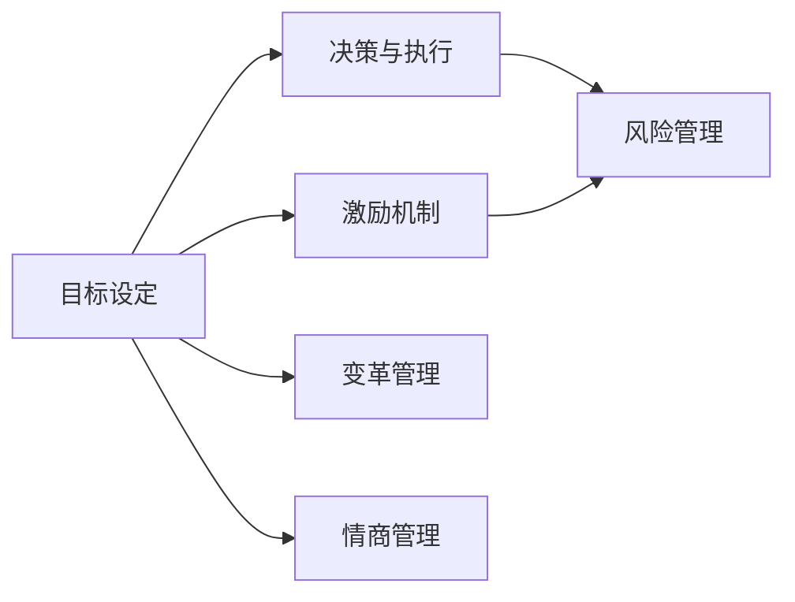

                 

# 构建个人领导力体系的方法论

在现代社会，领导力已不再是单一的管理技能，而是涵盖组织能力、沟通技巧、决策力、创新思维等多个维度的综合素质。构建个人领导力体系，不仅需要理论指导，更需要实际操作方法和技巧。本文将从背景介绍、核心概念与联系、核心算法原理、数学模型构建、项目实践、实际应用场景、工具和资源推荐、总结与展望等多个角度，深入探讨如何系统构建个人领导力体系。

## 1. 背景介绍

### 1.1 问题由来
在互联网和信息化的浪潮下，企业的竞争环境日趋激烈，如何在纷繁复杂的市场环境中脱颖而出，成为众多企业的共同挑战。这不仅要求管理者具备过硬的业务能力，更需具备强大的领导力。领导力不仅能引领团队向目标前进，还能在变革时代中为组织注入新的活力。因此，构建个人领导力体系，成为每一个管理者提升自身竞争力、实现企业发展的关键。

### 1.2 问题核心关键点
构建个人领导力体系的核心关键点在于如何将领导力转化为实际行动，从而在团队和组织中发挥最大效能。以下是构建领导力体系的主要关注点：

1. **目标设定**：清晰的目标能指导团队前进方向。
2. **激励与团队合作**：有效的激励机制能提升团队士气，合作精神能增强团队凝聚力。
3. **决策与执行**：高效的决策和执行力能保证组织快速响应市场变化。
4. **风险管理**：识别和应对风险的能力，能保障组织稳定发展。
5. **变革管理**：在不断变化的环境中，领导力能引导组织实现转型和创新。
6. **情商管理**：通过高情商管理，提升团队沟通和协作效率。

### 1.3 问题研究意义
构建个人领导力体系对于提升管理者的综合素质，推动企业创新发展具有重要意义。

1. **提升管理效率**：构建系统化的领导力体系，有助于管理者更高效地管理团队，实现目标。
2. **促进组织创新**：通过构建领导力体系，管理者能更好地推动组织变革，引领企业创新。
3. **增强团队凝聚力**：有效的激励机制和团队合作精神能提升团队凝聚力和战斗力。
4. **提升决策质量**：系统化的决策模型和流程能提升决策的准确性和执行力。
5. **应对风险挑战**：科学的风险管理体系能帮助企业更好地应对市场变化和挑战。

## 2. 核心概念与联系

### 2.1 核心概念概述

构建个人领导力体系涉及多个核心概念，包括目标设定、激励机制、决策与执行、风险管理、变革管理、情商管理等。这些概念之间相互关联，形成了一个完整的领导力体系框架。

1. **目标设定**：
   - **SMART原则**：具体（Specific）、可衡量（Measurable）、可达成（Achievable）、相关（Relevant）、时限（Time-bound）的目标设定方法。
2. **激励机制**：
   - **双因素理论**：通过工作内容本身和外部报酬来激励员工。
3. **决策与执行**：
   - **决策树模型**：通过决策树来模拟和优化决策过程。
4. **风险管理**：
   - **VaR模型**：价值在险值模型，用于评估和管理金融风险。
5. **变革管理**：
   - **McKinsey 7S模型**：包括策略（Strategy）、结构（Structure）、系统（System）、风格（Style）、员工（Staff）、技能（Skill）、共享价值观（Shared Values）。
6. **情商管理**：
   - **Goleman 情商理论**：包括自我意识、自我调节、动机驱动、同理心和社交技能。

这些概念之间的逻辑关系可以通过以下Mermaid流程图来展示：



这个流程图展示了各个概念之间的相互作用和联系。

## 3. 核心算法原理 & 具体操作步骤

### 3.1 算法原理概述

构建个人领导力体系的主要算法原理基于行为分析与优化，旨在通过数据分析和优化算法，指导领导者在不同情境下采取最佳行为，以实现领导力的最大化。

具体而言，构建领导力体系的过程包括以下步骤：

1. **数据收集与分析**：通过问卷调查、绩效评估、行为观察等方式，收集有关领导力的数据。
2. **模型构建**：建立决策树、回归模型、情感分析模型等，用于预测和优化领导行为。
3. **行为优化**：根据模型预测结果，对领导行为进行调整和优化，提升领导力。

### 3.2 算法步骤详解

构建个人领导力体系的主要算法步骤分为以下几个阶段：

**Step 1: 数据收集与预处理**
- **问卷调查**：设计包含目标设定、激励机制、决策与执行、风险管理、变革管理、情商管理等多个维度的问卷，收集领导者的行为数据。
- **绩效评估**：通过上级评估、同级评估、下级评估等方式，对领导者的绩效进行评估。
- **行为观察**：通过行为观察和记录，获得领导者在实际情境下的行为数据。
- **数据预处理**：清洗数据，处理缺失值和异常值，进行特征工程，提取关键特征。

**Step 2: 模型构建与训练**
- **决策树模型**：使用决策树算法，对领导行为进行分类和预测。
- **回归模型**：使用线性回归、逻辑回归等算法，对领导行为进行数值预测。
- **情感分析模型**：使用情感分析算法，评估领导者的情商水平和情绪状态。
- **模型训练**：使用训练集数据，训练各类模型，优化模型参数。

**Step 3: 行为优化与反馈**
- **行为优化**：根据模型预测结果，对领导行为进行调整和优化。例如，对于决策树模型预测的错误决策，领导者可进行复盘和改进。
- **反馈机制**：建立反馈机制，定期收集团队和员工的反馈，评估领导行为的实际效果。
- **持续改进**：根据反馈结果，不断优化领导行为和决策过程。

### 3.3 算法优缺点

构建个人领导力体系的算法具有以下优点：

1. **系统化**：通过数据分析和优化算法，构建系统的领导力模型，指导领导者采取最佳行为。
2. **实时性**：能够实时监测和调整领导行为，及时响应市场变化和团队需求。
3. **可量化**：通过定量分析和评估，能够准确衡量领导力的各项指标。

同时，该算法也存在以下局限性：

1. **数据依赖**：构建模型需要大量高质量的数据，数据获取和处理成本较高。
2. **复杂性**：模型构建和优化过程较为复杂，需要具备较强的数据分析能力。
3. **应用场景限制**：部分模型和算法可能不适用于所有情境，需要根据实际情况进行选择。

### 3.4 算法应用领域

构建个人领导力体系的算法广泛应用于企业、政府、非营利组织等多个领域，具体应用场景包括：

1. **企业领导力提升**：通过数据分析和优化算法，提升企业领导者的决策质量、团队合作能力、风险管理水平等。
2. **政府公务员培训**：帮助政府公务员提升领导能力，增强公共服务质量。
3. **非营利组织管理**：提升非营利组织领导者的管理和激励能力，增强组织效率和社会影响力。

## 4. 数学模型和公式 & 详细讲解 & 举例说明

### 4.1 数学模型构建

构建个人领导力体系的主要数学模型包括决策树模型、回归模型、情感分析模型等。以下以决策树模型为例，介绍其构建过程。

**决策树模型**：用于对领导行为进行分类和预测，其构建过程如下：

1. **数据准备**：准备包含决策节点、决策结果的数据集。
2. **特征选择**：选择对决策结果影响较大的特征。
3. **模型训练**：使用决策树算法，训练模型，优化模型参数。
4. **模型评估**：使用测试集数据，评估模型性能。

### 4.2 公式推导过程

以决策树模型为例，其公式推导过程如下：

1. **信息熵计算**：
   $$
   H(X) = -\sum_{i=1}^{n}p_i\log_2p_i
   $$
   其中 $p_i$ 为类别 $i$ 的样本比例。

2. **信息增益计算**：
   $$
   IG(A) = H(X) - \sum_{i=1}^{n}\frac{|D_i|}{|D|}H(X|A=i)
   $$
   其中 $A$ 为决策节点特征，$D_i$ 为特征 $A$ 取值为 $i$ 的子集，$|D_i|$ 为子集大小。

3. **决策树构建**：
   $$
   \text{tree} = \text{build\_tree}(D, A)
   $$

   其中 $\text{build\_tree}$ 为决策树构建函数。

### 4.3 案例分析与讲解

以企业领导力提升为例，以下是一个简单的决策树构建和应用过程：

**案例背景**：一家科技公司的管理者，需要对市场变化和产品研发进行决策。

**数据收集**：收集公司历史决策数据、市场调研报告、研发进度等数据。

**特征选择**：选择市场份额、研发投入、用户反馈等特征。

**模型训练**：使用决策树算法，构建决策树模型。

**模型应用**：根据模型预测结果，管理者可以判断是否进行产品迭代、市场推广等决策。

## 5. 项目实践：代码实例和详细解释说明

### 5.1 开发环境搭建

在进行领导力体系构建实践前，我们需要准备好开发环境。以下是使用Python进行PyTorch开发的环境配置流程：

1. 安装Anaconda：从官网下载并安装Anaconda，用于创建独立的Python环境。

2. 创建并激活虚拟环境：
```bash
conda create -n pytorch-env python=3.8 
conda activate pytorch-env
```

3. 安装PyTorch：根据CUDA版本，从官网获取对应的安装命令。例如：
```bash
conda install pytorch torchvision torchaudio cudatoolkit=11.1 -c pytorch -c conda-forge
```

4. 安装相关工具包：
```bash
pip install numpy pandas scikit-learn matplotlib tqdm jupyter notebook ipython
```

完成上述步骤后，即可在`pytorch-env`环境中开始领导力体系构建实践。

### 5.2 源代码详细实现

以下是一个简单的决策树模型构建和应用代码示例，假设我们有一个包含决策节点、决策结果的数据集 `data.csv`。

```python
import pandas as pd
from sklearn.tree import DecisionTreeClassifier
from sklearn.model_selection import train_test_split

# 数据准备
data = pd.read_csv('data.csv')

# 特征选择
X = data[['市场份额', '研发投入', '用户反馈']]
y = data['决策结果']

# 数据划分
X_train, X_test, y_train, y_test = train_test_split(X, y, test_size=0.2, random_state=42)

# 模型训练
clf = DecisionTreeClassifier()
clf.fit(X_train, y_train)

# 模型评估
print('Accuracy:', clf.score(X_test, y_test))
```

### 5.3 代码解读与分析

让我们再详细解读一下关键代码的实现细节：

**数据准备**：
- `pd.read_csv('data.csv')`：读取数据集，并将其转化为Pandas DataFrame对象。

**特征选择**：
- `X = data[['市场份额', '研发投入', '用户反馈']]`：从数据集中提取决策树模型的输入特征。

**模型训练**：
- `clf = DecisionTreeClassifier()`：初始化决策树分类器。
- `clf.fit(X_train, y_train)`：使用训练集数据，训练决策树模型。

**模型评估**：
- `print('Accuracy:', clf.score(X_test, y_test))`：在测试集上评估模型性能，输出准确率。

## 6. 实际应用场景

### 6.1 企业领导力提升

在企业领导力提升场景中，决策树模型可以帮助管理者在复杂多变的环境中做出更加科学和高效的决策。

具体应用过程如下：

1. **数据收集**：收集企业历史决策数据、市场调研报告、研发进度等数据。
2. **特征选择**：选择对决策结果影响较大的特征，如市场份额、研发投入、用户反馈等。
3. **模型训练**：使用决策树算法，构建决策树模型。
4. **模型应用**：根据模型预测结果，管理者可以判断是否进行产品迭代、市场推广等决策。

### 6.2 政府公务员培训

在政府公务员培训场景中，决策树模型可以帮助公务员提升决策和执行能力。

具体应用过程如下：

1. **数据收集**：收集政府决策历史数据、政策效果评估报告、民众反馈等数据。
2. **特征选择**：选择对政策效果影响较大的特征，如政策措施、执行力度、社会影响等。
3. **模型训练**：使用决策树算法，构建决策树模型。
4. **模型应用**：根据模型预测结果，公务员可以判断是否调整政策措施、改进执行方法等。

### 6.3 非营利组织管理

在非营利组织管理场景中，情感分析模型可以帮助领导者提升团队合作和激励效果。

具体应用过程如下：

1. **数据收集**：收集员工问卷调查数据、绩效评估报告、行为观察记录等数据。
2. **特征选择**：选择对团队合作和激励效果影响较大的特征，如员工满意度、激励机制、工作环境等。
3. **模型训练**：使用情感分析算法，构建情感分析模型。
4. **模型应用**：根据模型预测结果，领导者可以优化激励机制、改善工作环境等。

## 7. 工具和资源推荐

### 7.1 学习资源推荐

为了帮助开发者系统掌握领导力体系的理论基础和实践技巧，这里推荐一些优质的学习资源：

1. **《领导力与管理学》系列课程**：来自Coursera等平台，涵盖领导力管理的多个方面，包括目标设定、激励机制、决策与执行等。
2. **《Leadership Challenge》一书**：由James Kouzes和Barry Posner所著，系统介绍了领导力的多个维度和具体实践。
3. **Goleman情商理论课程**：由情商研究专家Aaron Beck教授讲解，深入浅出地介绍了情商理论及其在领导力中的应用。

通过对这些资源的学习实践，相信你一定能够快速掌握构建领导力体系的理论基础和实践技巧。

### 7.2 开发工具推荐

高效的开发离不开优秀的工具支持。以下是几款用于领导力体系构建开发的常用工具：

1. **Jupyter Notebook**：交互式编程环境，支持Python、R等多种编程语言，方便数据可视化、代码编写和结果展示。
2. **TensorFlow**：由Google主导开发的深度学习框架，生产部署方便，适合大规模工程应用。
3. **PyTorch**：基于Python的开源深度学习框架，灵活动态的计算图，适合快速迭代研究。
4. **scikit-learn**：开源机器学习库，提供多种机器学习算法和工具，方便模型构建和优化。
5. **Weights & Biases**：模型训练的实验跟踪工具，可以记录和可视化模型训练过程中的各项指标，方便对比和调优。

合理利用这些工具，可以显著提升领导力体系构建任务的开发效率，加快创新迭代的步伐。

### 7.3 相关论文推荐

领导力体系构建的研究源于学界的持续研究。以下是几篇奠基性的相关论文，推荐阅读：

1. **The Five Dysfunctions of a Team**：Patrick Lencioni所著，通过分析团队五大障碍，探讨如何构建高效团队。
2. **The Transformational Leader**：Burns所著，探讨了变革型领导的概念及其对组织的影响。
3. **The Servant Leader**：James Kouzes和Barry Posner所著，介绍了服务型领导的概念及其在实际应用中的效果。

这些论文代表了大规模语言模型微调技术的发展脉络。通过学习这些前沿成果，可以帮助研究者把握学科前进方向，激发更多的创新灵感。

## 8. 总结：未来发展趋势与挑战

### 8.1 研究成果总结

本文对构建个人领导力体系的方法论进行了全面系统的介绍。首先阐述了领导力体系构建的背景和意义，明确了在复杂多变的环境下，构建系统化的领导力体系对于提升管理者的综合素质，推动企业创新发展的重要性。其次，从核心概念与联系、核心算法原理、数学模型构建、项目实践等多个角度，详细讲解了如何构建领导力体系。

通过本文的系统梳理，可以看到，构建个人领导力体系对于提升管理者的综合素质，推动企业创新发展具有重要意义。

### 8.2 未来发展趋势

展望未来，领导力体系构建技术将呈现以下几个发展趋势：

1. **数据驱动**：随着大数据技术的普及，基于数据驱动的领导力体系构建将更为常见。
2. **AI辅助**：AI技术将被广泛应用于领导力体系的构建和优化，提升决策的科学性和准确性。
3. **模型融合**：多种模型的融合使用将带来更全面的领导力分析，帮助领导者做出更为精准的决策。
4. **实时反馈**：通过实时监测和反馈，领导力体系能够动态调整和优化，提高决策的灵活性和适应性。
5. **跨文化应用**：领导力体系将在全球范围内推广和应用，适应不同文化背景的管理需求。

以上趋势凸显了领导力体系构建技术的广阔前景。这些方向的探索发展，必将进一步提升管理者的综合素质，推动组织不断创新和进步。

### 8.3 面临的挑战

尽管领导力体系构建技术已经取得了瞩目成就，但在迈向更加智能化、普适化应用的过程中，它仍面临着诸多挑战：

1. **数据质量**：领导力体系构建需要高质量的数据，但数据获取和处理成本较高。
2. **模型复杂性**：构建和优化模型需要较强的数据分析和算法优化能力。
3. **应用场景限制**：部分模型和算法可能不适用于所有情境，需要根据实际情况进行选择。
4. **算法可解释性**：领导力体系构建模型通常较为复杂，难以解释其内部工作机制和决策逻辑。

### 8.4 研究展望

面对领导力体系构建面临的挑战，未来的研究需要在以下几个方面寻求新的突破：

1. **提高数据质量**：通过数据清洗、数据增强等手段，提高数据质量，降低数据依赖。
2. **简化模型**：开发更加参数高效、计算高效的模型，提升模型的实时性和可解释性。
3. **多模型融合**：将多种模型的优势进行融合，提升领导力体系的整体性能。
4. **提升算法可解释性**：通过引入因果分析、博弈论等工具，增强领导力体系的可解释性和可控性。

这些研究方向的探索，必将引领领导力体系构建技术迈向更高的台阶，为构建安全、可靠、可解释、可控的智能系统铺平道路。面向未来，领导力体系构建技术还需要与其他人工智能技术进行更深入的融合，如知识表示、因果推理、强化学习等，多路径协同发力，共同推动自然语言理解和智能交互系统的进步。只有勇于创新、敢于突破，才能不断拓展领导力体系的边界，让智能技术更好地造福人类社会。

## 9. 附录：常见问题与解答

**Q1：构建领导力体系需要哪些关键步骤？**

A: 构建领导力体系的主要关键步骤包括：
1. 数据收集与预处理。
2. 模型构建与训练。
3. 行为优化与反馈。

**Q2：如何选择合适的特征进行领导力分析？**

A: 选择对领导力结果影响较大的特征，通常需要考虑以下因素：
1. 历史数据：分析历史决策和行为数据，选择对结果影响较大的特征。
2. 领域知识：结合领域专家的知识和经验，选择具有实际意义的特征。
3. 重要性评估：通过重要性评估方法，选择对领导力结果影响最大的特征。

**Q3：构建领导力体系需要哪些工具和资源？**

A: 构建领导力体系需要的工具和资源包括：
1. 开发环境：如Anaconda、Jupyter Notebook等。
2. 开发工具：如PyTorch、TensorFlow、scikit-learn等。
3. 学习资源：如Coursera、Khan Academy等平台提供的领导力管理课程。

**Q4：领导力体系构建过程中需要注意哪些问题？**

A: 领导力体系构建过程中需要注意的问题包括：
1. 数据质量：确保数据的准确性和完整性。
2. 模型选择：选择合适的模型，避免过拟合和欠拟合。
3. 反馈机制：建立有效的反馈机制，及时调整和优化领导行为。

**Q5：领导力体系构建的实际应用场景有哪些？**

A: 领导力体系构建的实际应用场景包括：
1. 企业领导力提升：帮助企业管理者做出科学决策，提升团队合作和执行力。
2. 政府公务员培训：提升公务员的决策和执行能力。
3. 非营利组织管理：增强组织效率和社会影响力。

---

作者：禅与计算机程序设计艺术 / Zen and the Art of Computer Programming

