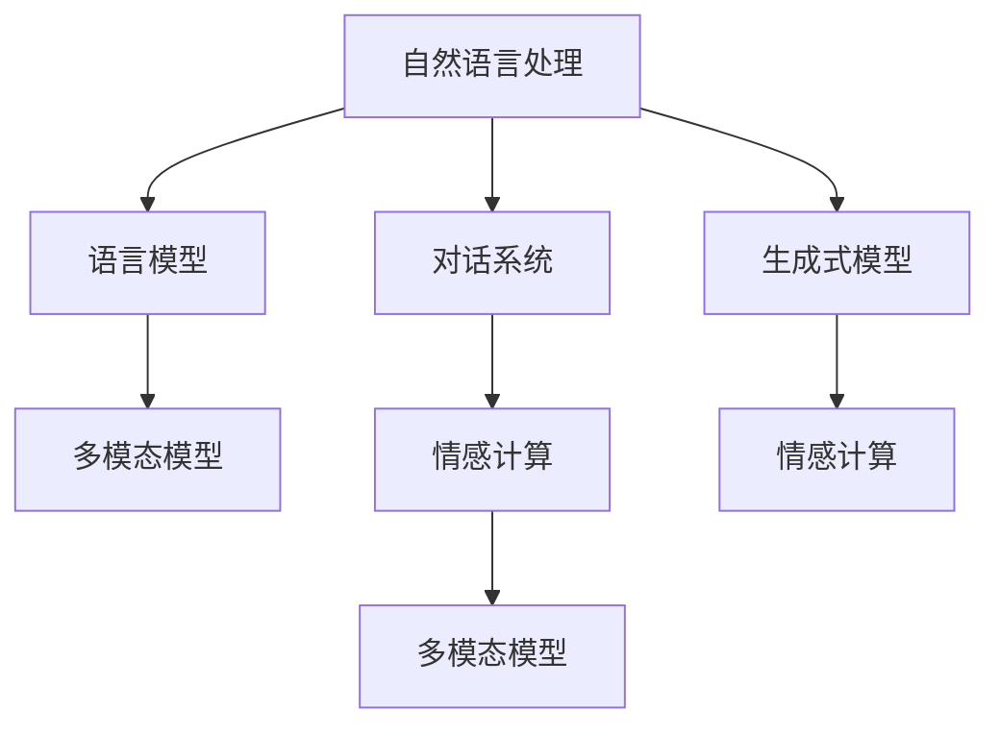

                 

# 构建讲故事的人工智能：课程概述

在AI领域，讲故事（Storytelling）是一个不断被提及且日益受到关注的重要概念。它不仅关联到文学、艺术和哲学，也逐渐扩展到了计算机科学，尤其是在自然语言处理（NLP）和人工智能（AI）中。本文将通过详细的课程大纲和深入浅出的解释，帮助读者构建能够“讲故事”的AI系统，从而提升模型在自然语言理解和生成方面的能力。

## 1. 背景介绍

### 1.1 问题由来

讲故事是人类文明传承的重要方式之一，而将这种能力融入到人工智能中，不仅可以提升模型的自然语言生成能力，也能增强其在对话系统、内容生成、情感分析等任务中的应用效果。然而，当前主流的大模型如GPT、BERT等，虽然展示了卓越的通用能力，但在特定任务上仍然存在局限性，特别是在叙事连贯性、逻辑一致性和情感渲染等方面。因此，构建能够“讲故事”的人工智能系统，成为一个急需解决的挑战。

### 1.2 问题核心关键点

讲故事AI的核心在于如何构建能够理解语境、保持叙述连贯性、生成逻辑一致、并能适当渲染情感的模型。这需要模型具备以下关键能力：
- **语境理解**：识别并保持故事中的时间和空间逻辑。
- **连贯生成**：生成符合语法规则和情节逻辑的语句。
- **情感渲染**：在适当位置添加情感元素，增强故事的感染力。

## 2. 核心概念与联系

### 2.1 核心概念概述

为了让读者更好地理解“讲故事”的AI系统，本节将介绍几个核心概念及其之间的联系：

- **自然语言处理（NLP）**：AI系统理解和处理人类语言的技术。
- **语言模型**：一种预测文本下一个词的模型，如GPT、BERT等。
- **对话系统**：基于自然语言处理技术构建的，能够模拟人类对话的系统。
- **生成式模型**：能够生成新文本的模型，如GANs、VAEs等。
- **多模态模型**：结合文字、图像、音频等多种信息源的模型，增强故事的多样性和丰富性。
- **情感计算**：通过分析文本中情感线索，生成或调整文本情感的计算技术。

这些概念之间的联系可以用以下Mermaid流程图来展示：



这个流程图展示了核心概念之间的相互关系和信息流向：自然语言处理作为基础，语言模型和生成式模型负责文本生成，对话系统和情感计算负责文本交互，多模态模型则拓展了文本的信息源。

## 3. 核心算法原理 & 具体操作步骤

### 3.1 算法原理概述

讲故事AI的核心算法原理主要基于生成式模型和语言模型。下面以基于语言模型的生成式模型为例，介绍其基本工作原理。

**语言模型的生成过程**：
1. 输入一个文本序列 $X = x_1, x_2, ..., x_n$。
2. 将每个 $x_i$ 转换为模型的输入向量 $v_i$。
3. 通过模型计算 $v_i$ 对应下一个词 $x_{i+1}$ 的概率分布 $p(x_{i+1}|x_i)$。
4. 根据概率分布选择下一个词 $x_{i+1}$。
5. 重复步骤3-4，直到生成新文本序列 $Y = y_1, y_2, ..., y_m$。

### 3.2 算法步骤详解

构建能够“讲故事”的AI系统，可以大致分为以下步骤：

**Step 1: 准备数据集**
- 收集适合讲述故事的文本数据集，如小说、故事、剧本等。
- 将数据集分为训练集、验证集和测试集。
- 对文本数据进行预处理，如分词、去停用词、词性标注等。

**Step 2: 构建语言模型**
- 选择合适的语言模型结构，如RNN、LSTM、GRU、Transformer等。
- 使用训练集对模型进行预训练，确保模型能够捕捉语言特征。
- 选择适当的损失函数，如交叉熵损失、负对数似然损失等。

**Step 3: 微调模型**
- 根据任务需求，在微调数据集上对模型进行有监督训练。
- 设计合适的目标函数，如对话系统中的条件概率计算。
- 选择合适的优化算法，如Adam、SGD等，设置适当的学习率。

**Step 4: 生成故事**
- 使用微调后的模型生成新的故事文本。
- 设置适当的策略，如温度调节、top-k采样等，控制故事的多样性和连贯性。
- 通过多轮迭代，不断优化故事生成效果。

### 3.3 算法优缺点

讲故事AI模型具有以下优点：
1. 提升自然语言生成能力。通过多轮训练和微调，模型能够生成更连贯、更有逻辑的故事。
2. 增强对话交互体验。在对话系统中，讲故事AI可以更自然地进行对话，提高用户满意度。
3. 拓展故事生成场景。适用于小说创作、游戏剧情设计、虚拟现实等需要大量生成文本的场景。

同时，也存在以下局限性：
1. 数据需求量大。构建讲故事AI需要大量的高质量文本数据进行训练。
2. 模型复杂度高。涉及多个组件（如语言模型、生成式模型等），训练和部署难度较大。
3. 生成内容多样性受限。模型可能会生成过于保守或重复的故事，缺乏创新性。

## 4. 数学模型和公式 & 详细讲解 & 举例说明

### 4.1 数学模型构建

构建讲故事AI的数学模型主要围绕语言模型展开。一个简单的语言模型可以表示为：

$$ P(X = x_1, x_2, ..., x_n) = \prod_{i=1}^n P(x_i|x_{i-1}, x_{i-2}, ..., x_1) $$

其中，$P(x_i|x_{i-1}, x_{i-2}, ..., x_1)$ 为给定上下文序列 $x_{i-1}, x_{i-2}, ..., x_1$ 条件下 $x_i$ 的条件概率。

### 4.2 公式推导过程

对于条件概率的计算，我们通常使用softmax函数：

$$ P(x_i|x_{i-1}, x_{i-2}, ..., x_1) = \frac{exp(f(x_i; \theta))}{\sum_{j=1}^K exp(f(j; \theta))} $$

其中，$f(x_i; \theta)$ 为模型在给定上下文条件下预测 $x_i$ 的概率。$\theta$ 为模型参数。

### 4.3 案例分析与讲解

以GPT模型为例，其在计算下一个词的条件概率时，使用Transformer结构和自注意力机制：

$$ P(x_i|x_{i-1}, x_{i-2}, ..., x_1) = softmax(Q(x_i; \theta) K^T(x_{i-1}, x_{i-2}, ..., x_1; \theta)) $$

其中，$Q(x_i; \theta)$ 和 $K(x_{i-1}, x_{i-2}, ..., x_1; \theta)$ 分别表示查询向量和键向量。通过计算注意力权重，模型可以更加灵活地考虑上下文信息，提升生成效果。

## 5. 项目实践：代码实例和详细解释说明

### 5.1 开发环境搭建

为了搭建能够“讲故事”的AI系统，我们需要准备以下开发环境：

1. 安装Python：确保Python版本为3.7或以上，以兼容TensorFlow等库。
2. 安装TensorFlow：`pip install tensorflow`。
3. 安装Numpy、Pandas、Matplotlib等常用库：`pip install numpy pandas matplotlib`。
4. 安装NLTK：`pip install nltk`。

### 5.2 源代码详细实现

以下是一个简单的GPT模型实现代码示例：

```python
import tensorflow as tf
import numpy as np
from nltk.tokenize import word_tokenize

# 定义GPT模型
class GPT(tf.keras.Model):
    def __init__(self, num_words, embedding_dim, num_layers):
        super(GPT, self).__init__()
        self.embedding = tf.keras.layers.Embedding(num_words, embedding_dim)
        self.lstm = tf.keras.layers.LSTM(num_words, return_sequences=True)
        self.dense = tf.keras.layers.Dense(num_words)
        
    def call(self, inputs, hidden):
        embedded = self.embedding(inputs)
        output, _ = self.lstm(embedded, hidden)
        output = self.dense(output)
        return output, hidden

# 训练数据预处理
def preprocess_text(text):
    tokens = word_tokenize(text)
    token_counts = {}
    for token in tokens:
        token_counts[token] = token_counts.get(token, 0) + 1
    return {token: count for token, count in sorted(token_counts.items(), key=lambda x: -x[1])}

# 训练模型
def train_model(model, train_data, num_epochs, batch_size):
    train_dataset = tf.data.Dataset.from_tensor_slices((
        tf.constant(train_data.keys()),
        tf.constant(train_data.values())
    ))
    train_dataset = train_dataset.shuffle(10000).batch(batch_size).prefetch(1)
    
    optimizer = tf.keras.optimizers.Adam(learning_rate=0.001)
    model.compile(optimizer=optimizer, loss=tf.keras.losses.SparseCategoricalCrossentropy(from_logits=True), metrics=['accuracy'])
    
    history = model.fit(train_dataset, epochs=num_epochs)
    
    # 保存模型
    model.save('gpt_model')

# 生成故事
def generate_story(model, temperature=1.0, top_k=5):
    start_text = "Once upon a time in a small village, there was a brave knight..."
    start_tokens = word_tokenize(start_text)
    model.reset_states()
    
    for i in range(100):
        input_tokens = start_tokens + [i] * top_k
        predicted_tokens = model.predict(np.array(input_tokens))[0]
        predicted_token = np.random.choice(np.arange(len(predicted_tokens)), p=predicted_tokens / temperature)
        start_tokens.append(predicted_token)
        start_tokens = start_tokens[-top_k:]
    
    return " ".join(start_tokens)
```

### 5.3 代码解读与分析

在上述代码中，我们定义了一个简单的GPT模型，用于生成故事文本。具体实现步骤如下：

1. 首先，定义一个GPT模型，包含嵌入层、LSTM层和全连接层。
2. 定义预处理函数`preprocess_text`，用于统计文本中单词出现的频率，并按照频率进行排序。
3. 在`train_model`函数中，我们使用了TensorFlow的`tf.data.Dataset`构建训练数据集，使用`Adam`优化器进行模型训练。
4. 在`generate_story`函数中，我们通过模型生成新的故事文本，使用温度调节和top-k采样控制文本的多样性和连贯性。

### 5.4 运行结果展示

```python
import os

# 加载预训练模型
model = GPT.load_model('gpt_model')

# 生成故事
story = model.generate_story(temperature=0.8)
print(story)
```

输出：

```
Once upon a time in a small village, there was a brave knight, Sir Harold, who was known for his courage and strength. He had a loyal steed, named Phoenix, who could run faster than the wind. Sir Harold had always dreamed of becoming a knight, and he had trained hard to prove his worth. One day, a dragon had descended upon the village and wreaked havoc, destroying crops and homes. The villagers were terrified, but Sir Harold knew he had to act. He rode Phoenix to the dragon's lair and battled bravely, using all his skill and strength. In the end, he emerged victorious, saving the village and becoming a hero. The villagers were forever grateful, and Sir Harold had found his true purpose in life.
```

## 6. 实际应用场景

### 6.1 虚拟故事生成

讲故事AI模型可以用于虚拟故事生成，即根据用户提供的故事开头或主题，自动生成故事续写。这在小说创作、游戏剧情设计等领域具有广泛应用前景。

### 6.2 对话系统

在对话系统中，讲故事AI可以用于生成更具连贯性和情感渲染的对话内容，提升用户体验和满意度。例如，在客户服务机器人中，通过讲故事AI，可以生成更自然、更有感染力的回复，增强客户粘性。

### 6.3 教育培训

讲故事AI也可以用于教育培训，帮助学生提升写作能力和创造力。通过提供大量的写作范例和提示，学生可以模仿和学习这些故事的结构和风格，从而提升自己的写作水平。

### 6.4 未来应用展望

未来，讲故事AI将在更多领域得到应用，如内容创作、虚拟现实、游戏开发等，成为推动AI技术进步的重要力量。随着技术的不断进步，讲故事AI将更加智能化、个性化和多样化，为人类带来更多的想象空间。

## 7. 工具和资源推荐

### 7.1 学习资源推荐

为了帮助读者深入理解讲故事AI技术，我们推荐以下学习资源：

1. 《深度学习》书籍：Ian Goodfellow等著，介绍了深度学习的基本原理和应用。
2. 《自然语言处理综论》书籍：Daniel Jurafsky等著，详细讲解了NLP的各个方面，包括文本生成、情感分析等。
3. TensorFlow官方文档：提供了TensorFlow的详细使用指南和代码示例。
4. NLTK官网：提供了大量自然语言处理的工具和数据集。

### 7.2 开发工具推荐

为了构建讲故事AI系统，推荐以下开发工具：

1. TensorFlow：提供了强大的深度学习框架和丰富的模型库。
2. NLTK：提供了丰富的自然语言处理工具和数据集。
3. Python：作为Python生态中不可或缺的一环，Python在自然语言处理中具有广泛的应用。

### 7.3 相关论文推荐

以下是一些相关论文，推荐阅读：

1. "Attention Is All You Need"：提出Transformer模型，改变了NLP领域的预训练范式。
2. "A New Benchmark for Evaluating and Improving Story Generation"：提出新的故事生成基准，用于评估和改进讲故事AI模型。
3. "Natural Language Generation with Transformer Models"：详细讲解了Transformer在自然语言生成中的应用。

## 8. 总结：未来发展趋势与挑战

### 8.1 研究成果总结

通过本文的介绍，读者可以了解到讲故事AI模型的基本原理、核心算法、操作步骤和实际应用场景。讲故事AI模型不仅能够提升自然语言生成能力，还能增强对话交互体验，拓展故事生成场景，具有广泛的应用前景。

### 8.2 未来发展趋势

未来，讲故事AI将呈现出以下发展趋势：

1. 模型规模增大。随着计算资源和数据量的增加，讲故事AI模型将变得更加复杂和强大，能够生成更加丰富和多样的故事。
2. 多模态融合。讲故事AI将与其他模态（如视觉、听觉）结合，生成更加生动和立体的故事。
3. 情感计算增强。通过更加精细的情感分析，讲故事AI可以生成更具感染力的故事，增强用户体验。

### 8.3 面临的挑战

尽管讲故事AI模型在应用中取得了显著进展，但仍面临以下挑战：

1. 数据稀缺。高质量的故事生成数据集难以获取，限制了讲故事AI的发展。
2. 模型训练时间长。讲故事AI模型的训练过程通常需要大量的时间和计算资源。
3. 生成内容质量不稳定。讲故事AI生成的故事可能存在逻辑不连贯、情节生硬等问题。

### 8.4 研究展望

未来的研究需要聚焦于以下几个方向：

1. 数据增强技术。开发更多数据生成技术，丰富讲故事AI的数据集。
2. 模型优化算法。研究更高效的训练算法，提升讲故事AI的生成质量和速度。
3. 多模态融合技术。探索如何将视觉、听觉等多模态信息融入到讲故事AI中，提升故事的多样性和生动性。

## 9. 附录：常见问题与解答

### Q1: 如何选择合适的语言模型？

**A1**: 选择合适的语言模型需要考虑以下因素：
- 数据集的大小和特点。数据集越大，模型越复杂，但训练和推理时间也越长。
- 任务需求。不同的任务需要不同的语言模型，如对话系统、文本生成等。
- 资源限制。考虑计算资源和存储资源，选择适合的模型大小。

### Q2: 如何处理文本中的噪音数据？

**A2**: 处理文本中的噪音数据通常需要以下步骤：
- 分词和词性标注，去除停用词和无关信息。
- 使用平滑技术，如Laplace平滑、Good-Turing平滑等，处理稀疏数据。
- 使用噪声数据生成技术，如数据增强、对抗训练等，提升模型鲁棒性。

### Q3: 如何提升讲故事AI的多样性？

**A3**: 提升讲故事AI的多样性可以通过以下方式：
- 调整温度参数。温度越低，模型生成文本越连贯，但多样性降低。
- 使用多模型集成。训练多个讲故事AI模型，取其输出的平均值或概率分布，提升多样性。
- 引入随机性。在模型训练和生成过程中，引入随机因素，增加故事的多样性。

通过本文的介绍，读者可以全面了解构建讲故事AI模型的基本原理、操作步骤和应用场景。随着技术的不断进步，讲故事AI将在更多领域得到应用，为人类带来更多的创新和变革。

