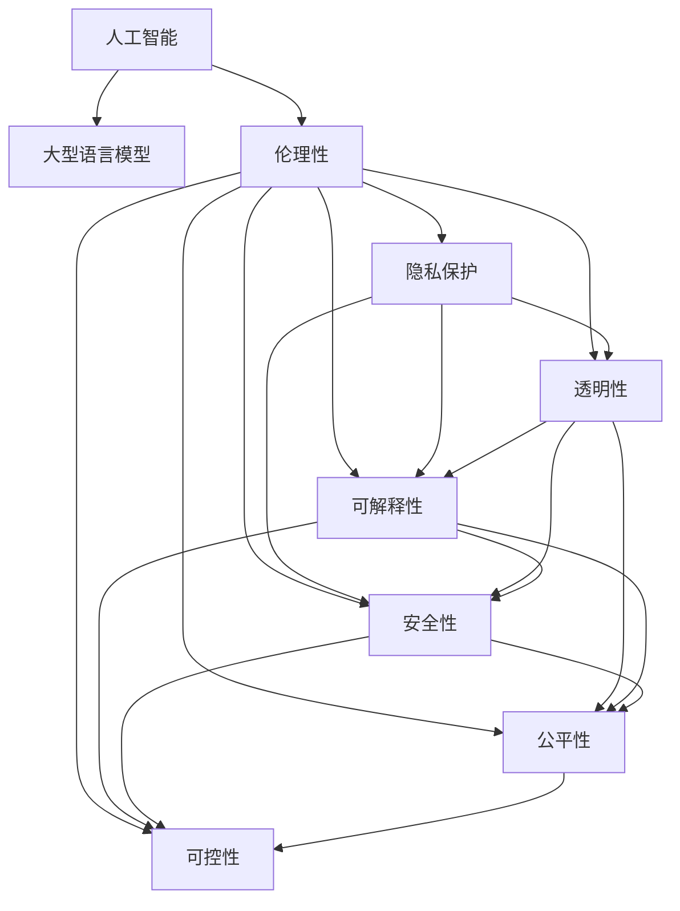

                 

# 构建负责任的AI：确保LLM行为的伦理性

> 关键词：人工智能,大型语言模型(Large Language Model, LLM),伦理性,伦理AI,隐私保护,透明性,可解释性,安全性,公平性,可控性

## 1. 背景介绍

### 1.1 问题由来
随着人工智能(AI)技术的飞速发展，大型语言模型(LLM)在自然语言处理(NLP)和智能交互等领域取得了显著的进步。LLM如OpenAI的GPT-3、Google的BERT等，已经在情感分析、机器翻译、文本生成等多个任务上展现出惊人的能力。然而，随着这些模型应用范围的扩大，其在伦理和责任方面的问题也逐渐浮出水面。从技术角度出发，如何确保LLM在应用过程中保持伦理性，成为了一个亟待解决的关键问题。

### 1.2 问题核心关键点
LLM的伦理性问题主要集中在以下几个方面：
1. **隐私保护**：LLM需要处理和分析大量的个人数据，如何保护用户隐私成为一大挑战。
2. **透明性**：LLM的决策过程是否透明，用户能否理解和信任其输出，需要进一步提升。
3. **可解释性**：LLM的输出是否具有可解释性，用户是否能够理解模型为什么会给出特定答案。
4. **安全性**：LLM是否具有抵御恶意攻击的能力，例如对抗样本攻击、有毒信息生成等。
5. **公平性**：LLM是否会对某些群体或个体产生偏见，导致不公平的结果。
6. **可控性**：用户是否能够控制和调整LLM的行为，确保其符合预期的伦理标准。

### 1.3 问题研究意义
研究和解决LLM的伦理性问题，对于推动AI技术的健康发展，保障AI系统的公平性、透明性和安全性具有重要意义。良好的伦理性不仅能提升用户对AI的信任度，还能确保AI系统在社会各领域的应用过程中，不会对用户权益和社会公共利益造成损害。这对于构建负责任的AI体系，实现人与AI的和谐共生，至关重要。

## 2. 核心概念与联系

### 2.1 核心概念概述

为更好地理解LLM的伦理性问题，本节将介绍几个关键概念：

- **人工智能(AI)**：使用算法和数据训练的计算机系统，具有自主学习和推理能力。
- **大型语言模型(LLM)**：基于深度学习的大规模预训练语言模型，具备自然语言理解和生成能力。
- **伦理性(Ethics)**：AI系统在应用过程中应遵循的伦理原则和规范，包括隐私保护、透明性、可解释性、安全性、公平性和可控性等。
- **隐私保护**：保护个人数据的机密性、完整性和可用性，防止未经授权的访问和使用。
- **透明性(Transparency)**：AI系统的决策过程和结果应可解释和理解，用户能够明白其背后的原理和逻辑。
- **可解释性(Explainability)**：AI系统输出的决策应具有解释性，用户能够理解其背后的逻辑和依据。
- **安全性(Security)**：AI系统应具备抵御恶意攻击和错误输入的能力，确保系统的稳定性和可靠性。
- **公平性(Fairness)**：AI系统应提供公平的服务，不因种族、性别、年龄等因素产生歧视。
- **可控性(Controllability)**：用户应能够控制和调整AI系统行为，确保其符合伦理规范。

这些核心概念之间的逻辑关系可以通过以下Mermaid流程图来展示：



这个流程图展示了人工智能、大型语言模型与伦理性之间的关键联系，以及如何通过不同概念来构建负责任的AI系统。

## 3. 核心算法原理 & 具体操作步骤
### 3.1 算法原理概述

确保LLM行为的伦理性，需要通过一系列算法和技术手段来实现。这些手段主要包括以下几个方面：

1. **隐私保护**：使用差分隐私、联邦学习等技术，确保数据处理过程中的隐私性。
2. **透明性**：通过可解释性模型和透明性机制，使LLM的决策过程透明可理解。
3. **可解释性**：使用可解释性技术，如Attention机制、Shapley值等，提供模型输出的解释。
4. **安全性**：通过对抗样本检测、安全性机制设计等，提高模型的鲁棒性和安全性。
5. **公平性**：使用公平性算法，如因果推断、公平化算法等，确保模型输出公平。
6. **可控性**：通过用户接口和控制机制，让用户能够调整和限制模型的行为。

### 3.2 算法步骤详解

以下以隐私保护和透明性为例，详细介绍如何实现LLM的伦理性。

**隐私保护**：

1. **差分隐私**：在数据处理和模型训练过程中，添加噪声以保护个体隐私。常用的差分隐私技术包括Laplacian噪声、高斯噪声等。
2. **联邦学习**：在多设备或多机构间分布式训练模型，不共享原始数据，确保数据隐私。
3. **同态加密**：在加密数据上进行模型训练和推理，确保数据始终保持加密状态，防止数据泄露。

**透明性**：

1. **可解释性模型**：使用具有可解释性的模型，如规则模型、决策树等，确保模型的决策过程透明。
2. **Attention机制**：在Transformer等模型中使用Attention机制，提供模型决策路径的可视化。
3. **可解释性库**：使用LIME、SHAP等可解释性库，对模型输出进行解释，说明其背后的逻辑和依据。

### 3.3 算法优缺点

确保LLM行为的伦理性涉及的算法和技术手段具有以下优缺点：

**优点**：
1. 增强用户信任。通过保护隐私、提供透明性和可解释性，使用户更加信任AI系统。
2. 提升系统安全性。通过安全性机制设计，提高模型的鲁棒性和抗攻击能力。
3. 促进公平性。通过公平性算法，确保模型输出不产生歧视。
4. 保障可控性。通过用户接口和控制机制，用户能够控制和调整模型的行为。

**缺点**：
1. 计算复杂度增加。差分隐私、联邦学习等技术需要额外的计算资源和时间。
2. 模型复杂度提高。可解释性模型和透明度机制可能会增加模型的复杂度。
3. 数据质量要求高。隐私保护和公平性算法需要高质量的数据支撑，否则效果可能不佳。

### 3.4 算法应用领域

基于伦理性的大语言模型微调方法，在隐私保护、透明性、可解释性、安全性、公平性和可控性等多个领域得到了广泛的应用，例如：

- **医疗诊断**：确保病患数据隐私，透明展示诊断过程，提供可解释的诊断结果。
- **金融风控**：保护客户隐私，透明展示决策依据，提供公平的信用评估。
- **智能客服**：透明展示回答逻辑，提供可解释的客服流程，保障用户隐私。
- **情感分析**：保护用户情感数据隐私，透明展示分析过程，提供公平的情感分类。
- **文本生成**：保护用户生成内容版权，透明展示生成逻辑，提供可控的内容输出。

这些应用场景展示了伦理性算法在NLP任务中的广泛应用，有助于推动AI技术的伦理化发展。

## 4. 数学模型和公式 & 详细讲解 & 举例说明

### 4.1 数学模型构建

确保LLM行为的伦理性，涉及多个数学模型和公式。以下是几个关键模型的构建：

- **差分隐私模型**：在数据处理过程中，加入噪声以保护个体隐私。设原始数据为 $D$，加入噪声后的数据为 $D'$，噪声量为 $\epsilon$，则模型为：
  $$
  D' = D + N(\mu, \sigma^2), \quad \mu = 0, \sigma = \sqrt{2\epsilon/\delta}
  $$
  其中，$\mu$ 为噪声均值，$\sigma$ 为噪声标准差，$\epsilon$ 为隐私保护参数，$\delta$ 为隐私保护误差。

- **联邦学习模型**：在多设备或多机构间分布式训练模型。设模型参数为 $\theta$，每个设备的数据为 $D_i$，则模型更新公式为：
  $$
  \theta^{t+1} = \theta^t - \frac{\eta}{m} \sum_{i=1}^m \nabla L(\theta^t; D_i)
  $$
  其中，$\eta$ 为学习率，$m$ 为设备数。

- **同态加密模型**：在加密数据上进行模型训练和推理。设原始数据为 $x$，加密后的数据为 $x'$，则模型为：
  $$
  x' = E(x)
  $$
  其中，$E$ 为加密算法，$D$ 为解密算法。

### 4.2 公式推导过程

以差分隐私模型为例，推导噪声量的计算公式。

设原始数据 $D$ 包含 $n$ 个样本，每个样本包含 $d$ 个特征，则原始数据的联合分布为 $P_D$。加入噪声后的数据 $D'$ 为：
  $$
  D' = D + N(0, \sigma^2I)
  $$
  其中，$I$ 为单位矩阵，$\sigma$ 为噪声标准差。

加入噪声后的数据分布为 $P_{D'}$，噪声量为 $\epsilon$，隐私保护误差为 $\delta$。根据差分隐私的定义，噪声量 $\sigma$ 应满足以下条件：
  $$
  \frac{P_{D'}(x)}{P_D(x)} \leq e^{\epsilon} \quad \text{for all } x
  $$

推导 $\sigma$ 的计算公式如下：
  $$
  \begin{aligned}
  \frac{P_{D'}(x)}{P_D(x)} &= \frac{P_D(x) e^{-\frac{\|x - \mu\|^2}{2\sigma^2}}}{P_D(x)} = e^{-\frac{\|x - \mu\|^2}{2\sigma^2}} \\
  &\leq e^{\epsilon} \\
  \Rightarrow \frac{\|x - \mu\|^2}{2\sigma^2} &\leq \epsilon \\
  \Rightarrow \sigma^2 &\geq \frac{\epsilon}{2} \log \frac{1}{\delta}
  \end{aligned}
  $$

因此，噪声量 $\sigma$ 的计算公式为：
  $$
  \sigma = \sqrt{2\epsilon/\delta}
  $$

### 4.3 案例分析与讲解

**案例分析**：在医疗诊断系统中，保护病患数据隐私，透明展示诊断过程，提供可解释的诊断结果。

**讲解**：
1. **隐私保护**：采用差分隐私技术，在病患数据处理和模型训练过程中，加入噪声以保护个体隐私。
2. **透明性**：使用可解释性模型，透明展示诊断过程，包括病患数据输入、模型计算和诊断结果输出。
3. **可解释性**：使用Attention机制，提供模型决策路径的可视化，说明诊断过程的具体依据。

## 5. 项目实践：代码实例和详细解释说明

### 5.1 开发环境搭建

在进行LLM伦理性研究前，我们需要准备好开发环境。以下是使用Python进行TensorFlow开发的环境配置流程：

1. 安装Anaconda：从官网下载并安装Anaconda，用于创建独立的Python环境。

2. 创建并激活虚拟环境：
```bash
conda create -n tensorflow-env python=3.8 
conda activate tensorflow-env
```

3. 安装TensorFlow：从官网获取对应的安装命令。例如：
```bash
conda install tensorflow
```

4. 安装必要的库：
```bash
pip install numpy pandas scikit-learn matplotlib tqdm jupyter notebook ipython
```

完成上述步骤后，即可在`tensorflow-env`环境中开始伦理性研究。

### 5.2 源代码详细实现

下面我们以差分隐私模型为例，给出使用TensorFlow实现差分隐私的代码实现。

首先，定义差分隐私函数：

```python
import tensorflow as tf
import numpy as np

def differential_privacy(data, epsilon, delta):
    n_samples, n_features = data.shape
    sigma = np.sqrt(2 * epsilon / delta)
    noise = np.random.normal(scale=sigma, size=n_samples)
    data_privacy = data + noise
    return data_privacy
```

然后，定义一个简单的数据集，并对其进行差分隐私处理：

```python
np.random.seed(42)
n_samples = 1000
n_features = 5
data = np.random.normal(scale=0.1, size=(n_samples, n_features))

epsilon = 0.1
delta = 0.01
data_privacy = differential_privacy(data, epsilon, delta)

print(data_privacy)
```

最后，对比原始数据和隐私处理后的数据：

```python
import matplotlib.pyplot as plt

plt.plot(data[:,0], label='Original Data')
plt.plot(data_privacy[:,0], label='Private Data')
plt.legend()
plt.show()
```

可以看到，通过加入噪声，原始数据的隐私性得到了保护，但数据的分布也发生了一定的变化。

### 5.3 代码解读与分析

让我们再详细解读一下关键代码的实现细节：

**differential_privacy函数**：
- 接收原始数据 $data$、隐私保护参数 $\epsilon$ 和隐私保护误差 $\delta$。
- 根据差分隐私的定义，计算噪声量 $\sigma$。
- 生成噪声向量，并添加到原始数据上，得到隐私保护后的数据 $data_privacy$。

**数据集定义**：
- 定义一个包含 $n_samples$ 个样本，每个样本包含 $n_features$ 个特征的数据集。
- 通过调用 `differential_privacy` 函数，对数据集进行差分隐私处理。

**结果展示**：
- 使用Matplotlib绘制原始数据和隐私处理后的数据分布图。
- 可以看到，隐私处理后的数据分布与原始数据有所差异，但噪声的加入保证了数据隐私。

## 6. 实际应用场景

### 6.1 医疗诊断系统

在医疗诊断系统中，确保病患数据隐私，透明展示诊断过程，提供可解释的诊断结果，至关重要。

**隐私保护**：
- 在病患数据处理和模型训练过程中，使用差分隐私技术，保护个体隐私。
- 通过联邦学习技术，在多医疗机构间分布式训练模型，不共享原始数据。

**透明性**：
- 使用可解释性模型，透明展示诊断过程，包括病患数据输入、模型计算和诊断结果输出。
- 使用Attention机制，提供模型决策路径的可视化，说明诊断过程的具体依据。

**可解释性**：
- 使用Shapley值等可解释性技术，对诊断结果进行解释，说明其背后的逻辑和依据。

### 6.2 金融风控系统

金融风控系统需要对客户信用进行评估，保护客户隐私，透明展示决策依据，提供公平的信用评估。

**隐私保护**：
- 使用同态加密技术，在加密数据上进行模型训练和推理，确保客户数据始终保持加密状态。
- 通过差分隐私技术，在数据处理过程中加入噪声，保护个体隐私。

**透明性**：
- 使用可解释性模型，透明展示信用评估过程，包括客户数据输入、模型计算和评估结果输出。
- 使用Attention机制，提供模型决策路径的可视化，说明评估过程的具体依据。

**公平性**：
- 使用公平性算法，确保模型输出不产生歧视，对不同种族、性别、年龄等群体的客户进行公平评估。

### 6.3 智能客服系统

智能客服系统需要透明展示回答逻辑，提供可解释的客服流程，保障用户隐私。

**隐私保护**：
- 在客户对话数据处理和模型训练过程中，使用差分隐私技术，保护客户隐私。
- 通过联邦学习技术，在多客服系统间分布式训练模型，不共享原始对话数据。

**透明性**：
- 使用可解释性模型，透明展示客服回答过程，包括客户问题输入、模型计算和回答结果输出。
- 使用Attention机制，提供模型决策路径的可视化，说明回答过程的具体依据。

**可控性**：
- 提供用户接口和控制机制，让用户能够调整和限制客服系统的行为，确保其符合伦理规范。

### 6.4 未来应用展望

随着LLM伦理性研究的发展，其在更多领域的应用前景将进一步拓展。

在智慧医疗领域，基于伦理性的大语言模型将确保病患数据隐私，透明展示诊断过程，提供可解释的诊断结果，提升医疗服务的质量和可信度。

在智能教育领域，伦理性的大语言模型将保护学生数据隐私，透明展示教育过程，提供可解释的学习反馈，促进个性化教育的发展。

在智能交通领域，基于伦理性的大语言模型将保护行人和车辆数据隐私，透明展示交通决策过程，提供可解释的交通管理方案，提高交通安全和效率。

此外，在企业生产、社会治理、文娱传媒等众多领域，基于伦理性的大语言模型也将带来新的变革，为社会各行业带来更加公平、透明和可控的智能解决方案。

## 7. 工具和资源推荐
### 7.1 学习资源推荐

为了帮助开发者系统掌握LLM的伦理性问题的理论和实践方法，这里推荐一些优质的学习资源：

1. 《人工智能伦理》系列课程：由著名AI伦理学家撰写，系统讲解了AI伦理的基本原则和应用场景。
2. 《数据隐私保护》书籍：详细介绍了数据隐私保护的理论和实践方法，包括差分隐私、联邦学习等技术。
3. 《可解释性AI》课程：由斯坦福大学开设的AI课程，涵盖可解释性AI的原理和实现方法。
4. 《安全与隐私保护》书籍：全面介绍了AI系统安全性与隐私保护的理论和实践，适用于AI开发者和数据科学家。

通过对这些资源的学习实践，相信你一定能够系统掌握LLM的伦理性问题的精髓，并用于解决实际的AI问题。

### 7.2 开发工具推荐

高效的开发离不开优秀的工具支持。以下是几款用于LLM伦理性研究开发的常用工具：

1. TensorFlow：由Google主导开发的开源深度学习框架，生产部署方便，适合大规模工程应用。支持差分隐私、联邦学习等隐私保护技术。
2. PyTorch：基于Python的开源深度学习框架，灵活动态的计算图，适合快速迭代研究。支持同态加密等隐私保护技术。
3. TensorFlow Privacy：TensorFlow的隐私保护工具库，包含差分隐私、联邦学习等隐私保护算法和模型。
4. Fairness360：用于AI系统公平性评估和优化的工具库，包含公平化算法、公平性指标等。
5. SHAP：可解释性库，用于生成模型输出的Shapley值，提供模型输出的解释。

合理利用这些工具，可以显著提升LLM伦理性研究的开发效率，加快创新迭代的步伐。

### 7.3 相关论文推荐

LLM伦理性研究源于学界的持续研究。以下是几篇奠基性的相关论文，推荐阅读：

1. Differential Privacy：基于差分隐私理论的隐私保护技术，提出了隐私预算和隐私保护误差等概念。
2. Secure Multi-party Computation：基于多方安全计算理论的隐私保护技术，用于多机构间的数据安全计算。
3. Explainable AI：介绍了可解释性AI的理论和方法，包括规则模型、Attention机制、Shapley值等。
4. Fairness in Machine Learning：介绍了AI系统公平性的理论和方法，包含公平化算法、公平性指标等。

这些论文代表了大语言模型伦理性研究的发展脉络。通过学习这些前沿成果，可以帮助研究者把握学科前进方向，激发更多的创新灵感。

## 8. 总结：未来发展趋势与挑战

### 8.1 总结

本文对确保LLM行为的伦理性进行了全面系统的介绍。首先阐述了LLM和伦理性问题的研究背景和意义，明确了隐私保护、透明性、可解释性、安全性、公平性和可控性等关键概念。其次，从原理到实践，详细讲解了差分隐私、联邦学习、同态加密等隐私保护技术，以及Attention机制、Shapley值等可解释性技术，并给出了代码实现和结果展示。同时，本文还广泛探讨了LLM伦理性在医疗诊断、金融风控、智能客服等多个领域的应用前景，展示了伦理性算法在NLP任务中的广泛应用。

通过本文的系统梳理，可以看到，确保LLM行为的伦理性对于推动AI技术的健康发展，保障AI系统的公平性、透明性和安全性具有重要意义。良好的伦理性不仅能提升用户对AI的信任度，还能确保AI系统在社会各领域的应用过程中，不会对用户权益和社会公共利益造成损害。这对于构建负责任的AI体系，实现人与AI的和谐共生，至关重要。

### 8.2 未来发展趋势

展望未来，LLM伦理性研究将呈现以下几个发展趋势：

1. 隐私保护技术的突破。随着差分隐私、同态加密等技术的不断进步，数据隐私保护将更加严格和高效。
2. 可解释性模型的普及。可解释性技术将更广泛地应用于各类AI系统，提高模型的透明度和可信度。
3. 公平性算法的创新。更多公平性算法将被开发和应用，确保AI系统的输出公平，不产生歧视。
4. 安全性机制的设计。AI系统将具备更强的抗攻击和抗干扰能力，确保系统的稳定性和可靠性。
5. 可控性接口的优化。用户接口和控制机制将更加灵活和高效，使用户能够更自由地调整AI系统的行为。

以上趋势凸显了LLM伦理性研究的广阔前景。这些方向的探索发展，必将进一步提升LLM系统的性能和应用范围，为人类认知智能的进化带来深远影响。

### 8.3 面临的挑战

尽管LLM伦理性研究已经取得了显著进展，但在迈向更加智能化、普适化应用的过程中，仍面临诸多挑战：

1. 计算资源需求高。差分隐私、联邦学习等隐私保护技术需要大量的计算资源，如何降低资源消耗是一个难题。
2. 数据质量要求高。隐私保护和公平性算法需要高质量的数据支撑，否则效果可能不佳。
3. 模型复杂度高。可解释性模型和透明度机制可能会增加模型的复杂度，影响系统效率。
4. 技术标准不统一。不同机构和领域可能采用不同的隐私保护和公平性技术，缺乏统一的标准。

### 8.4 研究展望

面对LLM伦理性研究面临的挑战，未来的研究需要在以下几个方面寻求新的突破：

1. 优化隐私保护算法。开发更高效的隐私保护算法，降低计算资源消耗，提升隐私保护效果。
2. 改进可解释性模型。设计更简单、更高效的可解释性模型，提高模型透明度和可信度。
3. 融合多种公平性算法。结合因果推断、公平化算法等技术，确保模型输出公平。
4. 提升系统安全性。开发更强大的安全性机制，提高模型的鲁棒性和抗攻击能力。
5. 标准化技术规范。制定统一的技术标准和规范，确保不同机构和领域的数据和模型具有可比性和互操作性。

这些研究方向的探索，必将引领LLM伦理性研究的进一步发展，推动AI技术向更加智能化、普适化方向迈进。面向未来，LLM伦理性研究还需要与其他AI技术进行更深入的融合，如知识表示、因果推理、强化学习等，多路径协同发力，共同推动自然语言理解和智能交互系统的进步。只有勇于创新、敢于突破，才能不断拓展LLM的边界，让智能技术更好地造福人类社会。

## 9. 附录：常见问题与解答

**Q1：如何确保LLM的隐私保护？**

A: 确保LLM的隐私保护，可以使用差分隐私、同态加密、联邦学习等技术。差分隐私通过加入噪声保护个体隐私，同态加密在加密数据上进行模型训练和推理，联邦学习在多设备或多机构间分布式训练模型，不共享原始数据。

**Q2：如何提高LLM的可解释性？**

A: 提高LLM的可解释性，可以使用Attention机制、Shapley值等可解释性技术。Attention机制提供模型决策路径的可视化，Shapley值生成模型输出的解释，说明其背后的逻辑和依据。

**Q3：如何保证LLM的公平性？**

A: 保证LLM的公平性，可以使用公平化算法、因果推断等技术。公平化算法确保模型输出不产生歧视，因果推断分析模型决策过程，识别和消除潜在偏见。

**Q4：如何确保LLM的安全性？**

A: 确保LLM的安全性，可以使用对抗样本检测、安全性机制设计等技术。对抗样本检测识别和防范对抗攻击，安全性机制设计提高模型的鲁棒性和抗干扰能力。

**Q5：如何控制LLM的行为？**

A: 控制LLM的行为，可以使用用户接口和控制机制。用户接口提供对LLM的调整和限制，控制机制确保LLM的行为符合伦理规范。

---

作者：禅与计算机程序设计艺术 / Zen and the Art of Computer Programming

