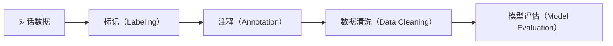

                 

# 标记和注释对话数据：最佳实践

## 1. 背景介绍

对话数据在自然语言处理（NLP）和人工智能（AI）领域的应用日益广泛。从聊天机器人、虚拟助手到智能客服，对话数据在众多领域中都扮演着关键角色。然而，高质量的对话数据对于这些应用的性能至关重要。标记和注释对话数据，是获取高质量数据的重要步骤，但过程复杂且成本高昂。本文将介绍对话数据标记和注释的最佳实践，包括数据收集、标注、清洗、评估和存储等环节。

## 2. 核心概念与联系

### 2.1 核心概念概述

在讨论对话数据标记和注释的最佳实践之前，需要首先理解以下几个核心概念：

- **对话数据**：指两个或多个用户之间通过文字、语音或图像形式进行的交流记录。对话数据可以是多轮的，其中每一轮对话都包含一段文本信息。
- **标记（Labeling）**：指为对话数据中的文本信息添加特定的标注或标签，以便于机器学习模型识别和理解。
- **注释（Annotation）**：指为对话数据中的特定部分添加详细的描述或解释，通常用于提供更多上下文信息。
- **数据清洗（Data Cleaning）**：指对标记和注释过的对话数据进行检查和修正，以确保数据质量和一致性。
- **评估（Evaluation）**：指通过评估模型在标注数据上的性能来验证标注的质量和一致性。

这些概念之间的联系紧密，标注和注释是数据清洗的前提，而数据清洗又为模型评估提供基础。

### 2.2 核心概念原理和架构的 Mermaid 流程图



## 3. 核心算法原理 & 具体操作步骤

### 3.1 算法原理概述

对话数据标记和注释的核心算法原理基于标注理论，即通过人为介入对对话数据进行加工和整理，使其更加适合机器学习模型的需求。这包括以下几个关键步骤：

- **数据收集**：收集对话数据，确保数据的多样性和代表性。
- **标记设计**：定义合适的标记系统，以反映对话数据中的关键信息。
- **注释生成**：为标记系统添加详细注释，解释标记的含义和上下文。
- **数据清洗**：检查标记和注释的一致性，修正错误和遗漏。
- **模型评估**：使用评估指标和工具，验证标记和注释的效果。

### 3.2 算法步骤详解

#### 3.2.1 数据收集

数据收集是对话数据标记和注释的第一步，也是最关键的一步。高质量的对话数据必须具有以下特点：

- **多样性**：覆盖不同的对话场景、用户群体和话题。
- **代表性**：反映对话数据的真实情况，避免偏差。
- **丰富性**：包含足够的信息，以便于后续分析和建模。

数据收集的方法包括：

- **在线对话记录**：从社交媒体、论坛、客户服务中心等在线平台收集对话数据。
- **电话录音转录**：将电话录音转录为文本，并进行标注和注释。
- **问卷调查**：通过问卷调查收集用户对话数据。
- **模拟对话**：根据实际应用场景，构建模拟对话并记录。

#### 3.2.2 标记设计

标记设计是指为对话数据中的文本信息定义合适的标记系统。标记系统应包括以下几个关键元素：

- **标记类型**：如意图、实体、情感等。
- **标记层级**：如会话、轮次、语句等。
- **标记定义**：对每个标记进行详细定义，确保一致性。

标记设计的关键是与业务需求紧密结合，确保标记能够反映对话数据的关键信息。例如，意图标注可以是“询问产品信息”、“预订服务”、“投诉”等。

#### 3.2.3 注释生成

注释生成是指为每个标记添加详细的解释或上下文。注释应包括以下几个关键要素：

- **标记解释**：对每个标记进行详细解释，包括标记的意义和应用场景。
- **上下文信息**：提供对话数据的背景信息，如对话双方的角色、对话的目的等。
- **错误示例**：提供错误的标记示例，以避免混淆。

注释生成的目的是提高标记的可解释性和一致性，帮助后续的数据清洗和模型评估。

#### 3.2.4 数据清洗

数据清洗是指对标记和注释过的对话数据进行检查和修正，以确保数据质量和一致性。数据清洗的步骤包括：

- **一致性检查**：检查标记和注释是否一致，是否符合定义。
- **错误修正**：修正错误的标记和注释，确保数据准确。
- **重复数据处理**：处理重复或冗余的数据，提高数据质量。

数据清洗是对话数据标记和注释过程中的重要环节，需要细致入微地检查和修正，以确保数据的高质量。

#### 3.2.5 模型评估

模型评估是指通过评估模型在标注数据上的性能来验证标注的质量和一致性。评估指标包括：

- **准确率**：模型正确识别标注的比例。
- **召回率**：模型识别出的标注占实际标注的比例。
- **F1分数**：综合准确率和召回率的指标。
- **AUC**：评估模型区分正负样本的能力。

模型评估的目的是确保标注和注释的质量，为后续的模型训练和优化提供基础。

### 3.3 算法优缺点

#### 3.3.1 优点

- **准确性高**：通过人工介入，确保标记和注释的准确性。
- **灵活性高**：可以根据实际需求灵活设计标记和注释系统。
- **可解释性强**：标记和注释能够提供详细的解释，帮助理解对话数据。

#### 3.3.2 缺点

- **成本高**：标记和注释需要大量人工介入，成本高昂。
- **速度慢**：标记和注释过程耗时较长，效率较低。
- **依赖人工**：标记和注释的质量依赖于标注者的专业水平和一致性。

### 3.4 算法应用领域

对话数据标记和注释的应用领域广泛，包括但不限于：

- **智能客服**：用于构建智能客服系统的训练数据。
- **虚拟助手**：用于训练虚拟助手模型，提高交互体验。
- **客户服务**：用于收集和分析客户服务数据，改进服务质量。
- **社交媒体分析**：用于分析社交媒体对话数据，挖掘用户情感和需求。
- **医疗对话**：用于构建医疗对话系统，提高医疗服务的智能化水平。

## 4. 数学模型和公式 & 详细讲解 & 举例说明

### 4.1 数学模型构建

对话数据标记和注释的数学模型主要基于标注理论，通过定义合适的标记系统和注释体系，对对话数据进行加工和整理。以下是一个简单的数学模型：

- **意图标记系统**：将对话数据分为多个意图类别，如“询问产品信息”、“预订服务”、“投诉”等。
- **实体标记系统**：识别对话数据中的实体，如人名、地名、时间等。
- **情感标记系统**：标注对话数据中的情感倾向，如“积极”、“消极”、“中性”等。

### 4.2 公式推导过程

以意图标记为例，假设有一个包含 $n$ 个对话数据的集合 $D$，每个对话数据包含 $m$ 个标记 $y_i$。意图标记的数学模型可以表示为：

$$
y_i = \{a_1, a_2, ..., a_k\}, \quad i \in \{1, 2, ..., n\}
$$

其中 $k$ 为意图类别数，$a_1, a_2, ..., a_k$ 为意图类别。假设有一个监督学习模型 $M$，根据训练集 $D$ 对意图进行标注。模型的输出为：

$$
\hat{y}_i = M(x_i), \quad x_i \in D
$$

模型的损失函数为：

$$
L = \frac{1}{n} \sum_{i=1}^n \ell(\hat{y}_i, y_i)
$$

其中 $\ell$ 为损失函数，常用的有交叉熵损失、余弦相似度损失等。

### 4.3 案例分析与讲解

假设有一个包含 100 个对话数据的集合 $D$，每个对话数据包含 3 个标记 $y_i$，分别是“询问产品信息”、“预订服务”和“投诉”。通过监督学习模型 $M$，对 $D$ 中的每个对话数据进行标注，并计算损失函数 $L$。假设 $M$ 的输出与 $D$ 的标注一致，则 $L$ 的值为 0。

## 5. 项目实践：代码实例和详细解释说明

### 5.1 开发环境搭建

在对话数据标记和注释的实践中，通常需要使用 Python 和相关 NLP 库，如 NLTK、SpaCy 等。以下是一个 Python 环境搭建的示例：

1. 安装 Python 和 Anaconda
2. 创建虚拟环境
3. 安装 NLTK 和 SpaCy 库

```bash
conda create -n dialogue-environment python=3.8
conda activate dialogue-environment
pip install nltk spaCy
```

### 5.2 源代码详细实现

下面是一个简单的 Python 代码示例，用于从 CSV 文件中读取对话数据，并进行意图和实体标记的示例：

```python
import pandas as pd
import spacy
import nltk

# 加载 SpaCy 模型
nlp = spacy.load('en_core_web_sm')

# 读取 CSV 文件
data = pd.read_csv('dialogue_data.csv')

# 定义标记系统
intents = {'询问产品信息': 0, '预订服务': 1, '投诉': 2}
entities = ['人名', '地名', '时间']

# 处理每行数据
for row in data.itertuples():
    text = row.text
    doc = nlp(text)
    intent = None
    entities_list = []
    for ent in doc.ents:
        if ent.label_ in entities:
            entities_list.append(ent.label_)
        if ent.text in intents:
            intent = ent.text
    row.intent = intent
    row.entities = entities_list

# 将处理后的数据写入新的 CSV 文件
data.to_csv('annotated_data.csv', index=False)
```

### 5.3 代码解读与分析

这段代码使用 Pandas 和 SpaCy 库读取和处理对话数据。首先，加载 SpaCy 的英文模型，然后读取包含对话数据的 CSV 文件。定义意图和实体的标记系统，并遍历每一行对话数据，使用 SpaCy 的实体识别功能识别对话中的实体，并根据意图标记系统进行意图标注。最后将处理后的数据写入新的 CSV 文件。

### 5.4 运行结果展示

运行上述代码后，将得到一个新的 CSV 文件，其中包含标注后的意图和实体信息。例如：

| text                     | intent | entities        |
|--------------------------|--------|-----------------|
| 您好，我想了解产品信息 | 询问产品信息| ['人名']        |
| 请问可以预订一下服务吗   | 预订服务  | ['地名', '时间']|
| 我要投诉               | 投诉    | []              |

## 6. 实际应用场景

### 6.1 智能客服

智能客服系统需要大量的对话数据进行训练。对话数据标记和注释是构建高质量智能客服系统的第一步。通过对客户服务对话数据进行标记和注释，可以构建出包含用户意图和实体信息的标注数据集，从而训练出高精度的智能客服模型。

### 6.2 虚拟助手

虚拟助手需要理解用户输入的意图和上下文，从而提供合适的响应。对话数据标记和注释可以帮助虚拟助手模型更好地理解用户的意图和对话内容，提供更准确、自然的响应。

### 6.3 客户服务分析

客户服务分析需要收集和分析客户与客服之间的对话数据。通过对对话数据进行标记和注释，可以提取出客户的意图、实体和情感等信息，用于改进客户服务流程和提升服务质量。

### 6.4 未来应用展望

未来，对话数据标记和注释技术将进一步发展，主要方向包括：

- **自动化标注**：利用人工智能和机器学习技术，自动标注对话数据，降低人工标注的成本和难度。
- **多模态数据融合**：将对话数据与其他多模态数据（如语音、图像）融合，提高对话分析的准确性。
- **跨语言标注**：对多语言对话数据进行标记和注释，推动跨语言自然语言处理技术的发展。

## 7. 工具和资源推荐

### 7.1 学习资源推荐

- **NLTK 和 SpaCy 官方文档**：包含大量示例和详细说明，是学习对话数据标记和注释的入门资料。
- **Dialogue Resources 网站**：提供大量的对话数据集和标注资源，是学习对话数据分析的绝佳资源。
- **Kaggle 竞赛**：Kaggle 上有很多关于对话数据标注的竞赛，可以学习其他标注者的方法和技巧。

### 7.2 开发工具推荐

- **PyTorch**：用于构建对话数据分析和建模的深度学习框架。
- **NLTK**：用于自然语言处理的 Python 库，包含大量的数据集和标注资源。
- **SpaCy**：用于处理和分析自然语言文本的 Python 库。

### 7.3 相关论文推荐

- **"Dialogue Data Preparation for Neural Machine Translation"**：介绍对话数据标记和注释的方法和工具，以及它们在机器翻译中的应用。
- **"Annotating Conversational Data for Natural Language Understanding"**：详细介绍对话数据标记和注释的系统方法和评估指标。
- **"Data Labeling in NLP: Challenges and Solutions"**：讨论对话数据标记和注释中的挑战和解决方案，提供实际应用中的最佳实践。

## 8. 总结：未来发展趋势与挑战

### 8.1 研究成果总结

对话数据标记和注释技术在自然语言处理和人工智能领域中发挥着重要作用。通过标注和注释对话数据，可以构建高质量的训练数据集，推动模型性能的提升。该技术已经成为许多 NLP 应用的重要前提和基础。

### 8.2 未来发展趋势

未来，对话数据标记和注释技术将向着自动化、多模态融合和跨语言标注等方向发展，进一步提升对话数据分析和建模的准确性和效率。

### 8.3 面临的挑战

对话数据标记和注释技术面临的主要挑战包括：

- **数据质量和一致性**：如何确保标注数据的质量和一致性，避免标注偏差。
- **标注成本和效率**：人工标注成本高，标注过程耗时长，如何提高标注效率和降低成本。
- **跨语言标注**：不同语言之间的标注标准和规则不一致，如何统一跨语言标注。

### 8.4 研究展望

未来的研究重点包括：

- **自动化标注**：利用人工智能和机器学习技术，自动标注对话数据。
- **多模态融合**：将对话数据与其他多模态数据（如语音、图像）融合，提高对话分析的准确性。
- **跨语言标注**：研究跨语言对话数据的标注方法和工具，推动跨语言自然语言处理技术的发展。

## 9. 附录：常见问题与解答

### Q1：对话数据标记和注释需要多少标注者？

**A1**：标注者的数量应该足够多，以确保标注数据的一致性和可靠性。通常，建议标注者数量至少是对话数据数量的 3-5 倍。

### Q2：如何确保对话数据标注的一致性？

**A2**：标注一致性可以通过以下方法确保：

- **制定标注规范**：为每个标注者制定统一的标注规范和标准。
- **多人标注**：使用多人标注，交叉检查标注结果，确保一致性。
- **标注培训**：对标注者进行培训，提高标注质量和一致性。

### Q3：对话数据标记和注释需要多长时间？

**A3**：对话数据标记和注释的时间取决于数据量和标注系统的复杂度。通常，标注一个对话数据集需要数周到数月不等。

### Q4：对话数据标记和注释需要哪些工具？

**A4**：对话数据标记和注释需要以下工具：

- **文本编辑器**：如 Sublime Text、Atom 等，用于编辑对话数据。
- **数据处理库**：如 Pandas、NumPy 等，用于数据处理和清洗。
- **NLP 库**：如 NLTK、SpaCy 等，用于处理和分析对话数据。

### Q5：对话数据标记和注释的评估指标有哪些？

**A5**：对话数据标记和注释的评估指标包括：

- **准确率**：标注结果与实际结果相符的比例。
- **召回率**：标注结果中包含实际结果的比例。
- **F1 分数**：综合准确率和召回率的指标。
- **AUC**：评估标注结果的区分度。

---

作者：禅与计算机程序设计艺术 / Zen and the Art of Computer Programming

