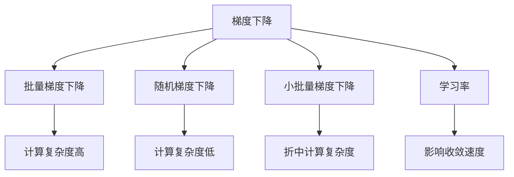

                 

# 梯度下降优化：从理论到实践

> 关键词：梯度下降, 优化算法, 损失函数, 学习率, 梯度积累, 反向传播

## 1. 背景介绍

### 1.1 问题由来
在深度学习中，优化算法是训练神经网络模型的关键。它负责调整模型参数，使损失函数最小化。梯度下降(GD)是其中最常用的优化算法，简单而有效。但在实际应用中，梯度下降还有各种变体，如批量梯度下降(BGD)、随机梯度下降(SGD)、小批量梯度下降(Mini-Batch GD)等，它们各自适用于不同的场景。

### 1.2 问题核心关键点
梯度下降算法通过计算损失函数对模型参数的梯度，以迭代的方式调整参数，从而最小化损失函数。其核心在于如何选择合适的学习率、如何处理数据集、如何应对模型复杂度等问题。本博客将深入探讨这些问题，并给出具体实现和优化方法。

## 2. 核心概念与联系

### 2.1 核心概念概述

为更好地理解梯度下降算法，本节将介绍几个密切相关的核心概念：

- 梯度下降（Gradient Descent）：一种通过迭代更新模型参数来最小化损失函数的算法。
- 学习率（Learning Rate）：每次迭代时调整模型参数的步长，影响算法的收敛速度和稳定性。
- 批量梯度下降（Batch Gradient Descent）：每次迭代使用全批量数据计算梯度，计算复杂度较高但收敛稳定。
- 随机梯度下降（Stochastic Gradient Descent）：每次迭代只使用一个样本计算梯度，计算复杂度低但收敛不稳定。
- 小批量梯度下降（Mini-Batch Gradient Descent）：每次迭代使用一小批样本计算梯度，折中两者。

这些概念之间的逻辑关系可以通过以下Mermaid流程图来展示：



这个流程图展示了几大核心概念之间的关联：

1. 梯度下降是优化算法的总称，包括批量梯度下降、随机梯度下降等。
2. 学习率影响算法的收敛速度，过大或过小都可能导致算法失效。
3. 批量梯度下降收敛稳定但计算复杂度高，适用于数据集较大的情况。
4. 随机梯度下降计算复杂度低但收敛不稳定，适用于数据集较小的情况。
5. 小批量梯度下降是两者的折中方案，平衡计算复杂度和收敛稳定性。

这些核心概念共同构成了梯度下降算法的理论基础，指导我们如何选择合适的算法和调整参数。

## 3. 核心算法原理 & 具体操作步骤

### 3.1 算法原理概述

梯度下降算法的基本原理是通过迭代更新模型参数，使得损失函数最小化。每次迭代时，通过计算损失函数对模型参数的梯度，以一定步长（即学习率）调整参数，直到收敛。

形式化地，假设模型参数为 $\theta$，损失函数为 $\mathcal{L}(\theta)$，则梯度下降算法的迭代公式为：

$$
\theta_{t+1} = \theta_t - \eta \nabla_{\theta}\mathcal{L}(\theta_t)
$$

其中，$\eta$ 为学习率，$\nabla_{\theta}\mathcal{L}(\theta_t)$ 为损失函数对参数 $\theta$ 的梯度，$t$ 为迭代次数。

梯度下降算法的工作流程如下：

1. 随机初始化模型参数 $\theta_0$。
2. 计算当前参数 $\theta_t$ 下的损失函数梯度 $\nabla_{\theta}\mathcal{L}(\theta_t)$。
3. 更新模型参数 $\theta_{t+1}$。
4. 重复步骤2-3，直至达到预设的停止条件（如达到最大迭代次数或损失函数收敛）。

### 3.2 算法步骤详解

梯度下降算法的具体操作步骤如下：

**Step 1: 数据准备**

- 收集训练数据集 $D=\{(x_i,y_i)\}_{i=1}^N$，其中 $x_i$ 为输入，$y_i$ 为输出标签。
- 将数据集划分为训练集、验证集和测试集。
- 初始化模型参数 $\theta$。

**Step 2: 选择损失函数**

- 根据具体任务选择合适的损失函数，如交叉熵损失、均方误差损失等。

**Step 3: 选择优化算法**

- 根据数据集大小和计算资源，选择合适的优化算法，如批量梯度下降、随机梯度下降、小批量梯度下降等。

**Step 4: 设置超参数**

- 确定学习率 $\eta$、批大小 $batch\_size$、迭代轮数 $epoch\_num$ 等超参数。

**Step 5: 执行梯度下降**

- 在训练集上以批为单位进行迭代，每次计算梯度并更新模型参数。
- 在每个epoch结束时，在验证集上评估模型性能。
- 重复迭代直至达到停止条件。

**Step 6: 测试和部署**

- 在测试集上评估模型性能。
- 使用训练好的模型进行实际应用。

### 3.3 算法优缺点

梯度下降算法具有以下优点：

- 简单直观，易于理解和实现。
- 适用于各类线性或非线性模型，泛化能力较强。

但同时也存在一些缺点：

- 对超参数敏感，学习率过大或过小都会导致算法失效。
- 在局部最优解附近收敛速度较慢，可能需要较长时间才能找到全局最优解。
- 计算复杂度高，特别是当数据集较大时。

### 3.4 算法应用领域

梯度下降算法广泛应用于各类深度学习模型的训练，如卷积神经网络(CNN)、循环神经网络(RNN)、生成对抗网络(GAN)等。其应用领域包括但不限于：

- 计算机视觉：图像分类、目标检测、图像生成等任务。
- 自然语言处理：文本分类、机器翻译、情感分析等任务。
- 语音识别：语音识别、语音生成等任务。
- 推荐系统：物品推荐、用户行为预测等任务。

梯度下降算法的应用不仅限于深度学习领域，其基本思想也可以应用于线性回归、逻辑回归等传统机器学习模型。

## 4. 数学模型和公式 & 详细讲解 & 举例说明

### 4.1 数学模型构建

本节将使用数学语言对梯度下降算法进行更加严格的刻画。

记模型参数为 $\theta = [\theta_1, \theta_2, ..., \theta_d]$，其中 $d$ 为模型参数的维数。假设损失函数为 $\mathcal{L}(\theta)$，则梯度下降算法的迭代公式为：

$$
\theta_{t+1} = \theta_t - \eta \nabla_{\theta}\mathcal{L}(\theta_t)
$$

其中，$\nabla_{\theta}\mathcal{L}(\theta_t)$ 为损失函数对参数 $\theta$ 的梯度，可以通过反向传播算法高效计算。

### 4.2 公式推导过程

以一个简单的线性回归问题为例，推导梯度下降算法的公式。

假设有一个线性回归模型 $y = w_1 x_1 + w_2 x_2 + \cdots + w_n x_n + b$，其中 $x = [x_1, x_2, ..., x_n]^T$ 为输入特征向量，$y$ 为输出目标，$w = [w_1, w_2, ..., w_n]^T$ 为模型权重，$b$ 为偏置项。

损失函数通常采用均方误差（MSE）损失：

$$
\mathcal{L}(w, b) = \frac{1}{2N}\sum_{i=1}^N (y_i - (w_1 x_{i,1} + w_2 x_{i,2} + \cdots + w_n x_{i,n} + b))^2
$$

其中 $N$ 为样本数量。

对损失函数求偏导，得到权重 $w$ 和偏置 $b$ 的梯度：

$$
\nabla_{w}\mathcal{L}(w,b) = \frac{1}{N} \sum_{i=1}^N -2(x_{i,1}y_i + x_{i,2}y_i + \cdots + x_{i,n}y_i)
$$

$$
\nabla_{b}\mathcal{L}(w,b) = \frac{1}{N} \sum_{i=1}^N -2y_i
$$

梯度下降算法的迭代公式为：

$$
\begin{aligned}
w_{t+1} &= w_t - \eta \nabla_{w}\mathcal{L}(w_t,b_t) \\
b_{t+1} &= b_t - \eta \nabla_{b}\mathcal{L}(w_t,b_t)
\end{aligned}
$$

其中，$\eta$ 为学习率。

### 4.3 案例分析与讲解

以一个简单的二元分类问题为例，分析梯度下降算法的运行过程。

假设有一个二元分类模型 $y = \theta_0 x_0 + \theta_1 x_1 + \cdots + \theta_n x_n + b$，其中 $x = [x_0, x_1, ..., x_n]^T$ 为输入特征向量，$y$ 为输出目标，$\theta = [\theta_0, \theta_1, ..., \theta_n]^T$ 为模型权重，$b$ 为偏置项。

损失函数通常采用二元交叉熵损失：

$$
\mathcal{L}(\theta) = -\frac{1}{N}\sum_{i=1}^N [y_i \log(\sigma(\theta^T x_i)) + (1-y_i) \log(1-\sigma(\theta^T x_i))]
$$

其中 $\sigma(z) = \frac{1}{1+\exp(-z)}$ 为 sigmoid 函数。

对损失函数求偏导，得到权重 $\theta$ 和偏置 $b$ 的梯度：

$$
\nabla_{\theta}\mathcal{L}(\theta) = \frac{1}{N} \sum_{i=1}^N [(\sigma(\theta^T x_i)-y_i) x_i]^T
$$

$$
\nabla_{b}\mathcal{L}(\theta) = \frac{1}{N} \sum_{i=1}^N (\sigma(\theta^T x_i)-y_i)
$$

梯度下降算法的迭代公式为：

$$
\begin{aligned}
\theta_{t+1} &= \theta_t - \eta \nabla_{\theta}\mathcal{L}(\theta_t) \\
b_{t+1} &= b_t - \eta \nabla_{b}\mathcal{L}(\theta_t)
\end{aligned}
$$

其中，$\eta$ 为学习率。

## 5. 项目实践：代码实例和详细解释说明

### 5.1 开发环境搭建

在进行梯度下降优化实践前，我们需要准备好开发环境。以下是使用Python进行PyTorch开发的环境配置流程：

1. 安装Anaconda：从官网下载并安装Anaconda，用于创建独立的Python环境。

2. 创建并激活虚拟环境：
```bash
conda create -n pytorch-env python=3.8 
conda activate pytorch-env
```

3. 安装PyTorch：根据CUDA版本，从官网获取对应的安装命令。例如：
```bash
conda install pytorch torchvision torchaudio cudatoolkit=11.1 -c pytorch -c conda-forge
```

4. 安装各类工具包：
```bash
pip install numpy pandas scikit-learn matplotlib tqdm jupyter notebook ipython
```

完成上述步骤后，即可在`pytorch-env`环境中开始梯度下降优化的实践。

### 5.2 源代码详细实现

这里我们以线性回归问题为例，给出使用PyTorch实现梯度下降优化的PyTorch代码实现。

首先，定义线性回归模型的前向传播函数和损失函数：

```python
import torch
import torch.nn as nn
import torch.optim as optim

class LinearRegression(nn.Module):
    def __init__(self, input_size, output_size):
        super(LinearRegression, self).__init__()
        self.linear = nn.Linear(input_size, output_size)
    
    def forward(self, x):
        y_pred = self.linear(x)
        return y_pred

def mse_loss(y_true, y_pred):
    return (y_true - y_pred)**2

# 准备数据集
x = torch.randn(100, 1)
y = 2*x + torch.randn(100, 1)  # 生成随机噪声

# 初始化模型
model = LinearRegression(1, 1)
optimizer = optim.SGD(model.parameters(), lr=0.01)

# 训练模型
for epoch in range(100):
    optimizer.zero_grad()
    y_pred = model(x)
    loss = mse_loss(y, y_pred)
    loss.backward()
    optimizer.step()
    
    if (epoch+1) % 10 == 0:
        print(f'epoch {epoch+1}, loss={loss.item()}, y_pred={y_pred}')
```

然后，定义训练和评估函数：

```python
from sklearn.metrics import mean_squared_error

def train_epoch(model, optimizer, x_train, y_train, batch_size):
    model.train()
    loss_sum = 0.0
    for batch in range(0, len(x_train), batch_size):
        x_batch = x_train[batch:batch+batch_size]
        y_batch = y_train[batch:batch+batch_size]
        y_pred = model(x_batch)
        loss = mse_loss(y_batch, y_pred)
        loss_sum += loss.item()
        optimizer.zero_grad()
        loss.backward()
        optimizer.step()
    return loss_sum / len(x_train) 

def evaluate(model, x_test, y_test):
    model.eval()
    y_pred = model(x_test)
    y_true = y_test
    mse = mean_squared_error(y_true, y_pred)
    return mse
```

最后，启动训练流程并在测试集上评估：

```python
x_train = x
y_train = y
x_test = x
y_test = y

# 训练模型
optimizer = optim.SGD(model.parameters(), lr=0.01)
for epoch in range(100):
    loss = train_epoch(model, optimizer, x_train, y_train, batch_size=50)
    print(f'epoch {epoch+1}, loss={loss:.4f}')
    
# 评估模型
mse = evaluate(model, x_test, y_test)
print(f'mse={mse:.4f}')
```

以上就是使用PyTorch实现梯度下降优化的完整代码实现。可以看到，PyTorch的高级API和模块化设计使得梯度下降的实现变得简洁高效。

### 5.3 代码解读与分析

让我们再详细解读一下关键代码的实现细节：

**LinearRegression类**：
- `__init__`方法：初始化线性回归模型，使用`nn.Linear`定义线性层。
- `forward`方法：定义前向传播函数，将输入 `x` 通过线性层得到预测值 `y_pred`。

**mse_loss函数**：
- 定义均方误差损失函数，计算预测值 `y_pred` 与真实值 `y_true` 之间的均方误差。

**train_epoch函数**：
- 在训练集上以批为单位进行迭代，每次计算梯度并更新模型参数。
- 记录每个epoch的总损失。

**evaluate函数**：
- 在测试集上评估模型性能，计算均方误差。

**训练流程**：
- 定义总的epoch数，开始循环迭代
- 每个epoch内，在训练集上训练，输出平均loss
- 重复上述步骤直至达到预设的迭代轮数

可以看到，PyTorch的Tensor和Autograd机制使得梯度下降算法的实现变得简单高效，大大降低了代码的复杂度。开发者可以将更多精力放在模型设计和优化上，而不必过多关注底层的实现细节。

当然，工业级的系统实现还需考虑更多因素，如模型的保存和部署、超参数的自动搜索、更灵活的任务适配层等。但核心的梯度下降算法基本与此类似。

## 6. 实际应用场景

### 6.1 智能推荐系统

智能推荐系统需要根据用户的历史行为数据，预测其对未来物品的偏好。梯度下降算法可以用于优化推荐模型，使模型学习到用户行为的模式和规律，进而推荐用户可能感兴趣的商品。

在技术实现上，可以收集用户浏览、点击、评分等行为数据，将其转化为向量形式输入模型，使用梯度下降算法最小化预测值与真实标签之间的损失，逐步优化模型参数。微调后的推荐模型可以实时根据用户的实时行为进行推荐，提升用户的购物体验。

### 6.2 金融风险管理

金融领域面临大量的风险预测问题，如信用风险评估、市场波动预测等。梯度下降算法可以用于优化风险预测模型，使模型能够准确预测金融市场中的风险和波动，为金融决策提供有力支持。

在技术实现上，可以收集金融市场的历史数据和实时数据，将其转化为向量形式输入模型，使用梯度下降算法最小化预测值与真实标签之间的损失，逐步优化模型参数。微调后的风险预测模型可以实时监测金融市场，预测未来趋势，及时采取风险管理措施。

### 6.3 自动驾驶系统

自动驾驶系统需要对复杂的道路环境进行理解和决策，梯度下降算法可以用于优化决策模型，使模型能够准确识别道路中的障碍物、行人、车辆等，做出最优的行驶决策。

在技术实现上，可以收集道路环境的高分辨率图像和实时数据，将其转化为向量形式输入模型，使用梯度下降算法最小化预测值与真实标签之间的损失，逐步优化模型参数。微调后的决策模型可以实时分析道路环境，做出准确无误的驾驶决策，提升行车的安全性和舒适性。

### 6.4 未来应用展望

随着深度学习技术的不断发展，梯度下降算法的应用领域将不断拓展，推动更多行业和领域的智能化升级。

在智慧医疗领域，梯度下降算法可以用于优化医学影像诊断模型，使模型能够准确识别病灶、分析病情，辅助医生进行诊断和治疗。

在智能教育领域，梯度下降算法可以用于优化学习推荐模型，使模型能够根据学生的学习情况和行为，推荐合适的学习资源和内容，提高学习效果。

在智能交通领域，梯度下降算法可以用于优化交通流量预测模型，使模型能够准确预测交通流量，优化交通信号，提升交通管理水平。

此外，在更多新兴领域如智能家居、智慧农业等，梯度下降算法也将发挥重要作用，推动人工智能技术的深度应用。

## 7. 工具和资源推荐

### 7.1 学习资源推荐

为了帮助开发者系统掌握梯度下降算法的理论基础和实践技巧，这里推荐一些优质的学习资源：

1. 《深度学习》课程：斯坦福大学开设的深度学习课程，由深度学习领域的权威教授讲授，内容全面覆盖深度学习的基础和前沿。
2. 《神经网络与深度学习》书籍：Michael Nielsen的神经网络经典教材，深入浅出地介绍了神经网络和深度学习的基本原理和算法。
3. PyTorch官方文档：PyTorch的官方文档，详细介绍了PyTorch的核心功能和API，包括深度学习模型的构建和优化。
4. TensorFlow官方文档：TensorFlow的官方文档，提供了TensorFlow的全面介绍和实战教程，覆盖了深度学习模型的构建和优化。
5. PyTorch Tutorials：PyTorch的官方教程，提供了一系列深度学习模型的实践案例和代码实现。

通过对这些资源的学习实践，相信你一定能够快速掌握梯度下降算法的精髓，并用于解决实际的优化问题。

### 7.2 开发工具推荐

高效的开发离不开优秀的工具支持。以下是几款用于梯度下降优化开发的常用工具：

1. PyTorch：基于Python的开源深度学习框架，灵活动态的计算图，适合快速迭代研究。大部分深度学习模型都有PyTorch版本的实现。
2. TensorFlow：由Google主导开发的开源深度学习框架，生产部署方便，适合大规模工程应用。同样有丰富的深度学习模型资源。
3. Keras：Keras是一个高级神经网络API，可以在TensorFlow、Theano和CNTK等后端上运行，适合快速搭建深度学习模型。
4. JAX：一个高性能的自动微分库，支持动态图和静态图，适合高性能计算和深度学习模型的构建和优化。
5. PyTorch Lightning：一个基于PyTorch的快速原型开发框架，提供了一系列的工具和组件，使深度学习模型的构建和优化变得简单高效。

合理利用这些工具，可以显著提升梯度下降优化的开发效率，加快创新迭代的步伐。

### 7.3 相关论文推荐

梯度下降算法的发展源于学界的持续研究。以下是几篇奠基性的相关论文，推荐阅读：

1. R. M. Dudley, C. B. Burges, L. K. Saul: "Pattern Recognition and Machine Learning"（2006）：经典机器学习教材，详细介绍了各种机器学习算法及其应用。
2. Y. Bengio, I. Goodfellow, A. Courville: "Deep Learning"（2015）：深度学习领域的经典教材，全面介绍了深度学习的基本原理和算法。
3. J. Duchi, E. Hazan, Y. Singer: "Adaptive Subgradient Methods for Online Learning and Stochastic Optimization"（2011）：介绍了基于梯度下降的在线学习算法。
4. T. Minka: "Divide and Conquer for Fast Adaptive Learning"（2004）：提出了随机梯度下降算法的变体Adaptive Gradient Descent。
5. M. Sutskever, L. Krtick, J. Vinyals: "On the importance of initialization and momentum in deep learning"（2013）：研究了深度学习模型的初始化和动量调整对性能的影响。

这些论文代表了大规模语言模型微调技术的发展脉络。通过学习这些前沿成果，可以帮助研究者把握学科前进方向，激发更多的创新灵感。

## 8. 总结：未来发展趋势与挑战

### 8.1 总结

本文对梯度下降算法进行了全面系统的介绍。首先阐述了梯度下降算法的背景和核心思想，明确了其在深度学习中的重要地位。其次，从原理到实践，详细讲解了梯度下降算法的数学模型和优化步骤，给出了具体的实现代码。同时，本文还广泛探讨了梯度下降算法在推荐系统、金融风险管理、自动驾驶系统等实际应用场景中的应用前景，展示了其广泛的适用性。最后，本文推荐了相关的学习资源和开发工具，力求为读者提供全方位的技术指引。

通过本文的系统梳理，可以看到，梯度下降算法作为深度学习模型的核心优化算法，简单而有效，在深度学习模型的训练和优化中扮演着至关重要的角色。相信随着深度学习技术的不断发展，梯度下降算法将得到更广泛的应用，为更多的行业和领域带来智能化升级。

### 8.2 未来发展趋势

展望未来，梯度下降算法的应用领域将不断拓展，推动更多行业和领域的智能化升级。

1. 模型规模持续增大。随着算力成本的下降和数据规模的扩张，深度学习模型的参数量还将持续增长。超大规模语言模型蕴含的丰富知识，有望支撑更加复杂多变的优化任务。
2. 优化算法不断改进。未来将涌现更多高效的优化算法，如AdaGrad、Adam、L-BFGS等，优化算法的不断改进将进一步提升模型的训练效率和性能。
3. 自适应优化算法兴起。基于学习率自适应调整的优化算法将得到更广泛的应用，如RMSprop、Adagrad等，使模型在训练过程中自动调整学习率，提升优化效果。
4. 分布式优化成为趋势。随着大规模模型和数据集的出现，分布式优化成为必要选择。梯度下降算法的分布式优化研究将不断深入，使训练过程更加高效。
5. 混合优化算法出现。结合不同优化算法的混合优化算法将更加高效，如AdaMomentum、AdaAdam等，兼顾梯度下降和动量的优点，进一步提升优化效果。

以上趋势凸显了梯度下降算法的广阔前景。这些方向的探索发展，必将进一步提升深度学习模型的训练效率和性能，推动人工智能技术的快速发展。

### 8.3 面临的挑战

尽管梯度下降算法已经取得了显著成效，但在迈向更加智能化、普适化应用的过程中，仍面临诸多挑战：

1. 超参数调优困难。梯度下降算法的超参数调整复杂且敏感，如何选择适当的学习率、批大小、迭代轮数等参数，仍然是一个难题。
2. 模型复杂度增加。深度学习模型的复杂度不断提高，优化算法需要处理更多参数和更大数据集，计算资源需求增大。
3. 训练时间长。深度学习模型的训练时间较长，如何加速训练过程，缩短模型训练时间，是一个重要研究方向。
4. 优化算法鲁棒性不足。深度学习模型的鲁棒性不足，面对噪声数据和异常情况，优化算法容易失效。
5. 可解释性不足。深度学习模型的决策过程难以解释，如何增强模型的可解释性，仍是一个重要研究课题。

这些挑战需要研究人员不断探索和优化，才能使梯度下降算法在深度学习模型的训练和优化中发挥更大的作用。

### 8.4 研究展望

未来梯度下降算法的研究方向可以概括为以下几个方面：

1. 探索新的优化算法。研究更加高效和鲁棒的优化算法，如AdaGrad、Adam、L-BFGS等，以适应更加复杂和大规模的深度学习模型。
2. 研究自适应优化算法。开发能够自适应调整学习率的优化算法，如RMSprop、Adagrad等，使模型在训练过程中自动调整学习率，提升优化效果。
3. 研究分布式优化算法。研究高效的分布式优化算法，如Distributed Gradient Descent等，使大规模深度学习模型的训练过程更加高效。
4. 研究混合优化算法。结合不同优化算法的混合优化算法，如AdaMomentum、AdaAdam等，兼顾梯度下降和动量的优点，进一步提升优化效果。
5. 研究自适应学习率。研究自适应学习率的算法，如AdaDelta、AdaGrad等，使模型在训练过程中自动调整学习率，提升优化效果。

这些研究方向将推动梯度下降算法在深度学习模型的训练和优化中发挥更大的作用，为人工智能技术的深度应用提供更坚实的理论基础和实践技术。

## 9. 附录：常见问题与解答

**Q1：如何选择合适的学习率？**

A: 学习率的选择对梯度下降算法的影响较大，过小会导致收敛缓慢，过大会导致算法失效。一般来说，学习率的选择可以根据以下几个方法进行：
1. 固定学习率：根据经验设定一个固定的学习率，如0.01、0.001等。
2. 学习率衰减：根据训练进度逐步减小学习率，如每隔一定epoch或一定时间步长减小一半学习率。
3. 学习率调整：根据模型性能自动调整学习率，如在训练过程中根据损失函数的变动情况调整学习率。

**Q2：如何避免梯度消失和梯度爆炸？**

A: 梯度消失和梯度爆炸是深度学习模型训练过程中常见的问题，可以使用以下方法避免：
1. 使用ReLU、LeakyReLU等非饱和激活函数，避免梯度消失。
2. 使用Batch Normalization等归一化技术，避免梯度爆炸。
3. 使用残差连接等技术，减少网络深度。

**Q3：梯度下降算法是否适用于所有深度学习模型？**

A: 梯度下降算法适用于大多数深度学习模型，包括卷积神经网络、循环神经网络、生成对抗网络等。但也有一些特殊情况需要特别注意：
1. 卷积神经网络：由于卷积层的参数较大，可以使用小批量梯度下降算法进行优化。
2. 循环神经网络：由于梯度反向传播时会产生梯度消失和梯度爆炸问题，需要使用LSTM、GRU等门控循环单元来避免。
3. 生成对抗网络：由于GAN模型的训练复杂度较高，需要使用优化器进行优化，如Adam、SGD等。

**Q4：如何处理大规模数据集？**

A: 处理大规模数据集时，可以使用以下方法：
1. 分批处理：将大规模数据集分为若干个小批数据集，逐步进行优化。
2. 分布式处理：使用分布式计算框架，如Hadoop、Spark等，将数据集分布到多台机器上进行优化。
3. 数据采样：使用数据采样技术，如随机抽样、分层抽样等，减少数据集大小，提高优化效率。

**Q5：如何处理梯度爆炸和梯度消失问题？**

A: 梯度爆炸和梯度消失是深度学习模型训练过程中常见的问题，可以使用以下方法避免：
1. 使用梯度截断：对梯度进行截断，限制梯度大小，避免梯度爆炸。
2. 使用归一化技术：使用Batch Normalization等归一化技术，避免梯度消失。
3. 使用残差连接：使用残差连接技术，减少网络深度，避免梯度消失和梯度爆炸。

这些方法可以有效地避免梯度爆炸和梯度消失问题，提高深度学习模型的训练效果。

---

作者：禅与计算机程序设计艺术 / Zen and the Art of Computer Programming

