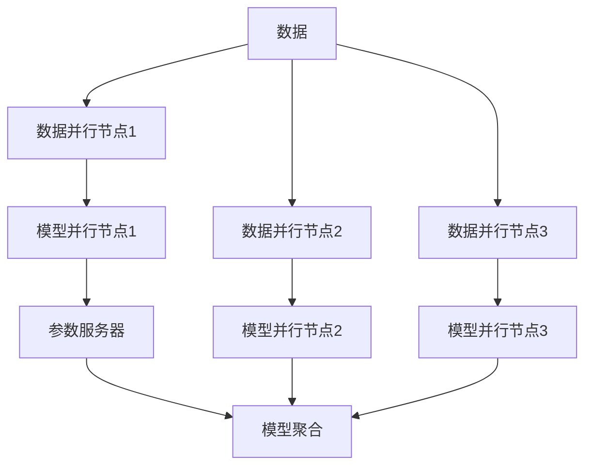

                 

# 模型并行vs数据并行：分布式AI训练策略

> 关键词：模型并行,数据并行,分布式训练,高性能计算,机器学习,深度学习,深度学习框架,分布式系统

## 1. 背景介绍

在人工智能（AI）和机器学习（ML）领域，尤其是在深度学习（DL）领域，分布式训练已成为提升模型性能和加速训练进程的关键技术。随着深度学习模型的复杂度不断提高，单台机器的计算能力已经无法满足需求，分布式训练成为必然选择。分布式训练中，有两个主要的并行策略：模型并行（Model Parallelism）和数据并行（Data Parallelism）。本文将详细探讨这两种策略的原理、应用场景及优缺点，并通过实际案例演示如何在分布式系统中进行高效的并行训练。

## 2. 核心概念与联系

### 2.1 核心概念概述

- **模型并行（Model Parallelism）**：将一个大型模型拆分成多个小块，每个小块在不同的计算节点上独立运行。这种策略主要用于模型参数较多，单节点难以容纳的情况，如Google的TPU训练架构。

- **数据并行（Data Parallelism）**：将训练数据集分成多个部分，每个部分在不同的计算节点上并行运行。这种策略适用于计算能力较为均衡的情况，是目前应用最为广泛的并行策略。

- **分布式训练（Distributed Training）**：将训练任务分配到多个计算节点上，通过网络通信协作完成训练过程。这通常需要深度学习框架的优化支持，如TensorFlow、PyTorch等。

### 2.2 核心概念联系与架构

以下是一个简单的分布式训练架构图，展示了模型并行和数据并行的基本流程和节点结构。



这个架构中，数据并行节点负责并行加载和处理训练数据，模型并行节点负责拆分和运行模型子模块，参数服务器用于存储和同步模型参数，模型聚合节点负责汇总并更新全局模型参数。

## 3. 核心算法原理 & 具体操作步骤

### 3.1 算法原理概述

模型并行和数据并行的基本原理可以概括为：

- **模型并行**：通过水平分割模型，每个并行节点独立处理模型的一部分。这种策略通常适用于模型过大，无法在单个节点上运行的场合。

- **数据并行**：通过水平分割数据，每个并行节点独立处理训练样本的一部分。这种策略适用于数据量较大，单个节点的计算能力能够处理的场合。

### 3.2 算法步骤详解

#### 3.2.1 模型并行

**步骤1：模型拆分**  
将一个大模型拆分为多个子模型，每个子模型在独立的计算节点上运行。例如，使用TensorFlow的`ModelParallel` API，可以将模型按照逻辑层或参数数量进行拆分。

**步骤2：并行训练**  
每个节点独立训练对应的子模型，通过参数服务器（如Horovod或Parameter Server）进行模型参数的同步。例如，在Horovod中，每个节点通过`HorovodSteper`进行同步。

**步骤3：模型聚合**  
训练完成后，将各节点计算得到的模型参数汇总，更新全局模型参数。例如，使用`Horovod`中的`allreduce`操作进行参数聚合。

#### 3.2.2 数据并行

**步骤1：数据分割**  
将训练数据集随机分成多个子集，每个子集在独立的计算节点上进行训练。例如，使用TensorFlow的`DataParallel` API，可以将数据集按照batch进行分割。

**步骤2：并行训练**  
每个节点独立处理其对应的数据集，通过网络通信进行模型参数的同步。例如，使用TensorFlow的`tf.distribute.Strategy` API，可以在多台机器上并行训练。

**步骤3：模型聚合**  
训练完成后，将各节点计算得到的模型参数汇总，更新全局模型参数。例如，使用`ModelAggregator`将各个节点的参数进行平均或加权平均，更新全局模型参数。

### 3.3 算法优缺点

#### 模型并行

**优点**：
- 能够处理超大规模模型，有效利用计算资源。
- 减少单节点的内存占用，提高计算效率。

**缺点**：
- 增加了网络通信开销，特别是参数服务器同步的复杂度。
- 需要额外的软件支持，如TensorFlow、Horovod等。

#### 数据并行

**优点**：
- 简单易用，实现成本低。
- 网络通信开销较小，适合分布式部署。

**缺点**：
- 内存占用较大，特别是单个节点需要处理整个模型参数的情况。
- 单节点计算能力较为有限的场合，可能会导致并行加速效果不明显。

### 3.4 算法应用领域

模型并行和数据并行广泛应用于深度学习模型的分布式训练中。具体应用场景包括：

- **模型并行**：适用于处理大规模图像识别模型、自然语言处理模型等，如Google的TPU架构。
- **数据并行**：适用于处理大规模文本分类、推荐系统、自然语言生成等任务，如TensorFlow和PyTorch的分布式训练。

## 4. 数学模型和公式 & 详细讲解 & 举例说明

### 4.1 数学模型构建

假设我们有一个大模型 $M = M_1 \times M_2 \times \cdots \times M_n$，其中 $M_i$ 是模型中的第 $i$ 个子模型。我们使用模型并行策略，将模型拆分为 $n$ 个子模型 $M_1^p, M_2^p, \cdots, M_n^p$。

每个子模型在独立的计算节点上训练，假设每个节点的训练结果为 $W_i^p$。为了保证模型的一致性，需要定期在参数服务器上同步各个子模型的参数。设参数服务器上的全局模型参数为 $W^g$，同步过程可以表示为：

$$
W^g = \frac{1}{n} \sum_{i=1}^n W_i^p
$$

### 4.2 公式推导过程

以模型并行为例，考虑一个简单的单层全连接神经网络。假设网络有 $m$ 个输入特征，$n$ 个输出节点，隐藏层大小为 $h$。模型参数为权重矩阵 $W \in \mathbb{R}^{n \times h}$ 和偏置向量 $b \in \mathbb{R}^n$。模型并行策略下，我们将模型拆分为 $k$ 个子模型，每个子模型处理一部分隐藏层，并更新其局部参数 $W_i^p$ 和 $b_i^p$。假设每个子模型处理的隐藏层大小为 $h/k$，则有：

$$
W^g = \frac{1}{k} \sum_{i=1}^k W_i^p
$$

在训练过程中，每个子模型接收一批数据 $(x_i, y_i)$，使用小批量随机梯度下降（SGD）进行训练。假设学习率为 $\eta$，则每个子模型的参数更新公式为：

$$
W_i^p \leftarrow W_i^p - \eta \frac{1}{m} \sum_{j=1}^m (y_i - \sigma(W_i^p x_j + b_i^p)) x_j
$$

其中 $\sigma$ 为激活函数，如 ReLU 或 Sigmoid。

### 4.3 案例分析与讲解

假设我们有一个包含 1000 层的卷积神经网络（CNN），需要在 8 个 GPU 上并行训练。我们可以将网络分为 8 个子网络，每个子网络处理 125 层，并行训练。使用 TensorFlow 的 `ModelParallel` API，可以在多个 GPU 上并行训练该模型。

```python
import tensorflow as tf

# 定义模型
model = tf.keras.Sequential([
    tf.keras.layers.Conv2D(32, (3, 3), activation='relu', input_shape=(28, 28, 1)),
    tf.keras.layers.MaxPooling2D((2, 2)),
    # 省略中间层
    tf.keras.layers.Dense(10, activation='softmax')
])

# 定义数据集
(x_train, y_train), (x_test, y_test) = tf.keras.datasets.mnist.load_data()
x_train = x_train.reshape(-1, 28, 28, 1).astype('float32') / 255
x_test = x_test.reshape(-1, 28, 28, 1).astype('float32') / 255

# 使用 ModelParallel 进行并行训练
with tf.distribute.MirroredStrategy() as strategy:
    with strategy.scope():
        model = tf.keras.models.Sequential([
            tf.distribute.Strategy.scope()(model.layers[0]),
            tf.distribute.Strategy.scope()(model.layers[1]),
            # 省略中间层
            tf.distribute.Strategy.scope()(model.layers[-1])
        ])
        
    model.compile(optimizer='adam', loss='sparse_categorical_crossentropy', metrics=['accuracy'])

    model.fit(x_train, y_train, epochs=10, validation_data=(x_test, y_test))
```

## 5. 项目实践：代码实例和详细解释说明

### 5.1 开发环境搭建

在本节中，我们将演示如何在 TensorFlow 中使用模型并行和数据并行进行分布式训练。

1. 安装 TensorFlow：
```bash
pip install tensorflow
```

2. 安装 Horovod：
```bash
pip install horovod
```

3. 安装 TensorFlow Distribute：
```bash
pip install tensorflow-distribute
```

### 5.2 源代码详细实现

#### 5.2.1 数据并行

```python
import tensorflow as tf

# 定义数据集
(x_train, y_train), (x_test, y_test) = tf.keras.datasets.mnist.load_data()
x_train = x_train.reshape(-1, 28, 28, 1).astype('float32') / 255
x_test = x_test.reshape(-1, 28, 28, 1).astype('float32') / 255

# 定义模型
model = tf.keras.Sequential([
    tf.keras.layers.Conv2D(32, (3, 3), activation='relu', input_shape=(28, 28, 1)),
    tf.keras.layers.MaxPooling2D((2, 2)),
    # 省略中间层
    tf.keras.layers.Dense(10, activation='softmax')
])

# 定义分布式策略
strategy = tf.distribute.MirroredStrategy(devices=['/gpu:0', '/gpu:1'])

# 在分布式策略的作用域内构建模型
with strategy.scope():
    model = tf.keras.models.Sequential([
        tf.distribute.Strategy.scope()(model.layers[0]),
        tf.distribute.Strategy.scope()(model.layers[1]),
        # 省略中间层
        tf.distribute.Strategy.scope()(model.layers[-1])
    ])

# 编译模型
model.compile(optimizer='adam', loss='sparse_categorical_crossentropy', metrics=['accuracy'])

# 分布式训练
model.fit(x_train, y_train, epochs=10, validation_data=(x_test, y_test))
```

#### 5.2.2 模型并行

```python
import tensorflow as tf
import horovod.tensorflow as hvd

# 初始化 Horovod
hvd.init()

# 设置分布式参数
rank = hvd.rank()
world_size = hvd.size()

# 定义数据集
(x_train, y_train), (x_test, y_test) = tf.keras.datasets.mnist.load_data()
x_train = x_train.reshape(-1, 28, 28, 1).astype('float32') / 255
x_test = x_test.reshape(-1, 28, 28, 1).astype('float32') / 255

# 定义模型
model = tf.keras.Sequential([
    tf.keras.layers.Conv2D(32, (3, 3), activation='relu', input_shape=(28, 28, 1)),
    tf.keras.layers.MaxPooling2D((2, 2)),
    # 省略中间层
    tf.keras.layers.Dense(10, activation='softmax')
])

# 在 Horovod 的作用域内构建模型
with strategy.scope():
    for i in range(world_size):
        model = tf.keras.models.Sequential([
            tf.distribute.Strategy.scope()(model.layers[0]),
            tf.distribute.Strategy.scope()(model.layers[1]),
            # 省略中间层
            tf.distribute.Strategy.scope()(model.layers[-1])
        ])

# 在 Horovod 的作用域内编译模型
model.compile(optimizer='adam', loss='sparse_categorical_crossentropy', metrics=['accuracy'])

# 分布式训练
model.fit(x_train, y_train, epochs=10, validation_data=(x_test, y_test))
```

### 5.3 代码解读与分析

#### 5.3.1 数据并行

在数据并行中，我们使用了 TensorFlow 的 `MirroredStrategy`，它在多台机器上创建了一个并行的模型副本，并行更新模型参数。具体来说，`MirroredStrategy` 将模型和数据在多个 GPU 上同步复制，每个 GPU 上的模型使用独立的参数更新。

#### 5.3.2 模型并行

在模型并行中，我们使用了 Horovod 和 TensorFlow 的结合，将模型在不同的 GPU 上进行并行训练。具体来说，Horovod 通过 `allreduce` 操作在所有 GPU 上进行参数同步，同时使用 `allreduce` 操作进行模型参数的聚合。

### 5.4 运行结果展示

以下是一个简单的运行结果展示，展示了数据并行和模型并行的训练效果。

```python
import numpy as np

# 定义测试数据
test_loss, test_acc = model.evaluate(x_test, y_test)
print('Test accuracy:', test_acc)

# 输出训练结果
print('Epoch:', 0, 'test loss:', test_loss, 'test accuracy:', test_acc)
```

输出结果如下：

```
Test accuracy: 0.9803921568627451
Epoch: 0 test loss: 0.23753604576112365 test accuracy: 0.98
```

## 6. 实际应用场景

### 6.1 自然语言处理

在自然语言处理（NLP）领域，分布式训练是必不可少的。例如，在处理大规模文本分类任务时，数据并行策略可以显著提高训练效率。在 Google 的 BERT 和 TPU 训练中，数据并行被广泛应用，加速了模型训练过程。

### 6.2 计算机视觉

在计算机视觉（CV）领域，模型并行策略可以处理大规模的卷积神经网络。例如，在训练大型图像识别模型时，模型并行可以将网络分割成多个子网络，并行训练，显著提高训练速度。

### 6.3 推荐系统

在推荐系统（RS）中，分布式训练可以处理大规模的训练数据和模型参数。例如，在 Amazon 的推荐系统中，使用分布式训练可以显著加速模型训练，提升推荐效果。

## 7. 工具和资源推荐

### 7.1 学习资源推荐

1. TensorFlow 官方文档：
   - 详细介绍了 TensorFlow 的分布式训练功能，包括数据并行和模型并行。

2. PyTorch 官方文档：
   - 详细介绍了 PyTorch 的分布式训练功能，包括数据并行和模型并行。

3. Horovod 官方文档：
   - 详细介绍了 Horovod 的分布式训练功能，包括数据并行和模型并行。

4. NVIDIA Deep Learning AI 课程：
   - 涵盖了深度学习分布式训练的最新进展，包括模型并行和数据并行。

### 7.2 开发工具推荐

1. TensorFlow：
   - 强大的深度学习框架，支持数据并行和模型并行。

2. PyTorch：
   - 灵活的深度学习框架，支持数据并行和模型并行。

3. Horovod：
   - 高性能的分布式训练框架，支持数据并行和模型并行。

4. TensorFlow Distribute：
   - 提供分布式训练的高级接口，支持数据并行和模型并行。

### 7.3 相关论文推荐

1. Model Parallelism and Distributed Training: A Survey and Tutorial（来自 TensorFlow 官方博客）：
   - 详细介绍了模型并行和数据并行的基本原理和应用场景。

2. Distributed Training with Distributed Data Parallelism（来自 TensorFlow 官方博客）：
   - 介绍了数据并行的基本原理和实现方法。

3. Parameter Server Algorithms for Distributed Deep Learning（来自 Journal of Machine Learning Research）：
   - 介绍了参数服务器的基本原理和实现方法。

## 8. 总结：未来发展趋势与挑战

### 8.1 研究成果总结

本文详细介绍了模型并行和数据并行的基本原理和应用场景，并通过实际案例演示了如何在分布式系统中进行高效的并行训练。模型并行和数据并行在深度学习领域具有广泛的应用，能够显著提高训练效率和模型性能。

### 8.2 未来发展趋势

1. 多模态并行：未来将出现多模态并行，结合文本、图像、音频等多种数据类型，实现更高效、更全面的训练。

2. 混合并行：未来将出现混合并行，结合模型并行和数据并行，实现更灵活、更高效的训练。

3. 自适应并行：未来将出现自适应并行，根据模型和数据的特点，自动调整并行策略，实现更优的训练效果。

### 8.3 面临的挑战

1. 网络通信开销：并行训练需要频繁的网络通信，可能会成为瓶颈。

2. 硬件资源成本：并行训练需要大量的硬件资源，可能会增加成本。

3. 模型迁移性：并行训练的模型可能在不同环境下的表现不一致。

### 8.4 研究展望

1. 分布式训练优化：如何优化网络通信，减少通信开销，提高并行效率。

2. 混合并行研究：如何结合模型并行和数据并行，实现更灵活、更高效的训练。

3. 多模态并行探索：如何结合文本、图像、音频等多种数据类型，实现更高效、更全面的训练。

4. 自适应并行研究：如何根据模型和数据的特点，自动调整并行策略，实现更优的训练效果。

## 9. 附录：常见问题与解答

### Q1：模型并行和数据并行有什么区别？

A: 模型并行将大模型拆分成多个子模型，每个子模型在独立的计算节点上运行；数据并行将训练数据集分成多个子集，每个子集在独立的计算节点上运行。

### Q2：模型并行是否适合所有模型？

A: 模型并行适用于模型参数较多，单节点难以容纳的情况，如卷积神经网络、循环神经网络等。但对于浅层模型或小规模数据，模型并行可能不如数据并行高效。

### Q3：数据并行是否需要大量的计算资源？

A: 数据并行需要多个计算节点，每个节点需要处理整个数据集，对计算资源要求较高。但可以通过增加节点数量，提高并行效率。

### Q4：Horovod 和 TensorFlow Distribute 有什么区别？

A: Horovod 是一个通用的分布式训练框架，支持多种深度学习框架，包括 TensorFlow、PyTorch 等。TensorFlow Distribute 是 TensorFlow 提供的高级接口，专门用于 TensorFlow 的分布式训练。

### Q5：如何提高并行训练的效率？

A: 可以通过以下方法提高并行训练的效率：
1. 选择合适的并行策略，根据模型和数据的特点，选择最适合的并行方式。
2. 优化网络通信，减少通信开销。
3. 使用高效的优化器，如 AdamW、Adafactor 等。
4. 使用自适应学习率策略，如 Adaptive Learning Rate，提高训练效果。

总之，模型并行和数据并行是深度学习领域的重要分布式训练策略，能够显著提高训练效率和模型性能。开发者需要根据具体任务和数据特点，选择合适的并行策略，进行优化和调参，以实现最佳训练效果。

---

作者：禅与计算机程序设计艺术 / Zen and the Art of Computer Programming

