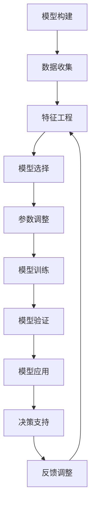

                 

# 模型思维:快速认知新事物的捷径

> 关键词：模型思维,认知新事物,数据驱动,算法优化,决策支持

## 1. 背景介绍

### 1.1 问题由来

在当今信息爆炸的时代，新事物的出现速度不断加快，无论是新兴科技、经济趋势，还是社会动态，都要求我们能够快速理解和应用这些新知识。然而，面对复杂多变的信息流，仅仅依赖直觉和经验往往不足够，急需一种能够高效、系统地处理和分析数据的思维工具。

模型思维便应运而生，它是一种基于数据和算法的思维方式，通过构建和分析数学模型来理解新事物、预测未来趋势、制定决策方案。模型思维不仅可以帮助我们更好地理解世界，还能在企业决策、科学研究、社会管理等多个领域中发挥重要作用。

### 1.2 问题核心关键点

模型思维的核心在于通过数据驱动的方法，构建数学模型来刻画和预测现实世界的现象。具体来说，其关键点包括：

- 数据收集与处理：获取准确、全面的数据，并进行清洗、标准化等预处理。
- 模型构建与验证：选择合适的数学模型，利用历史数据进行训练，并通过验证集评估模型性能。
- 模型应用与优化：在实际应用场景中，将模型应用于数据，并进行参数调整以优化预测效果。
- 模型解释与维护：解释模型的输出结果，并在必要时进行模型维护和更新。

这些步骤构成了模型思维的全流程，旨在通过数学模型高效、系统地分析和处理新事物。

## 2. 核心概念与联系

### 2.1 核心概念概述

为更好地理解模型思维，我们先简要介绍几个核心概念：

- **模型（Model）**：一种数学表达，用于描述和预测现实世界的现象。模型的构建过程通常包括数据收集、特征工程、模型选择和参数调整等步骤。
- **算法（Algorithm）**：一组明确计算步骤，用于实现模型的训练、预测和优化。常见的算法包括回归、分类、聚类等。
- **数据驱动（Data-driven）**：通过大量数据和算法来分析和预测现象，而非依赖经验和直觉。
- **优化（Optimization）**：调整模型参数以最小化误差，提高模型预测的准确性和鲁棒性。
- **决策支持（Decision Support）**：基于模型预测，提供科学决策依据，提升决策的效率和准确性。

这些概念之间存在紧密联系，共同构成模型思维的完整框架。通过理解这些核心概念，我们能够更好地把握模型思维的本质和应用。

### 2.2 核心概念原理和架构的 Mermaid 流程图



这个流程图展示了模型思维的完整流程，从数据收集到决策支持的每一步都有明确的动作和目标。

## 3. 核心算法原理 & 具体操作步骤

### 3.1 算法原理概述

模型思维的核心是利用数学模型对现实世界的现象进行刻画和预测。其基本原理包括以下几个方面：

- **假设检验（Hypothesis Testing）**：通过构建模型，假设某一现象符合某种规律，然后通过数据检验假设的正确性。
- **回归分析（Regression Analysis）**：利用数据中的自变量与因变量之间的关系，建立数学模型，用于预测因变量的值。
- **分类算法（Classification）**：将数据集划分为多个类别，并建立一个模型来预测未知数据的类别。
- **聚类算法（Clustering）**：将数据点划分为不同的组，使得同一组内的数据点相似度高，不同组间差异大。
- **优化算法（Optimization）**：通过不断调整模型参数，最小化模型误差，提高模型的预测能力。

这些原理构成了模型思维的基础，帮助我们从数据中提取有价值的信息，进而对新事物进行分析和预测。

### 3.2 算法步骤详解

模型思维的具体操作步骤如下：

**Step 1: 数据收集与处理**

1. 定义研究问题：明确需要解决的问题，如市场趋势预测、用户行为分析等。
2. 数据收集：收集与问题相关的数据，包括历史数据和实时数据。
3. 数据清洗：去除重复、缺失、错误的数据，并进行标准化、归一化等预处理。

**Step 2: 特征工程**

1. 特征提取：从原始数据中提取有意义的特征，如用户行为特征、市场特征等。
2. 特征选择：选择对目标变量影响大的特征，去除无关或冗余的特征。
3. 特征转换：对特征进行变换、编码等操作，如将分类特征转换为数值特征。

**Step 3: 模型构建**

1. 模型选择：根据问题的类型和数据特性，选择合适的数学模型，如线性回归、决策树、随机森林等。
2. 模型训练：利用历史数据训练模型，并通过交叉验证等技术评估模型性能。
3. 模型优化：调整模型参数以最小化误差，提高模型的泛化能力。

**Step 4: 模型验证与评估**

1. 验证集划分：将数据集划分为训练集、验证集和测试集。
2. 模型评估：在验证集上评估模型的性能，如均方误差、准确率等。
3. 模型选择：根据评估结果选择最优模型，并在测试集上进行最终验证。

**Step 5: 模型应用**

1. 数据输入：将新数据输入模型进行预测。
2. 结果解释：解释模型的输出结果，提供决策依据。
3. 模型维护：根据实际应用反馈，对模型进行维护和更新。

### 3.3 算法优缺点

模型思维具有以下优点：

- 数据驱动：通过大量数据和算法来分析和预测现象，提高了预测的准确性和可靠性。
- 系统性：构建和应用模型具有系统性，能够全面考虑各个因素的影响。
- 可解释性：模型构建和结果解释具有可解释性，便于理解和应用。

同时，模型思维也存在一些局限性：

- 数据依赖：模型的效果很大程度上依赖于数据的全面性和准确性。
- 模型复杂：复杂的模型可能导致过拟合，降低泛化能力。
- 解释难度：一些高级模型（如深度学习）的解释性较差，难以理解其内部机制。

尽管存在这些局限性，但模型思维仍然是目前最为有效的数据分析和决策支持工具之一，广泛应用于各个领域。

### 3.4 算法应用领域

模型思维的应用领域非常广泛，包括但不限于：

- **金融风险管理**：利用历史数据构建风险评估模型，预测贷款违约概率、市场波动等。
- **市场营销**：通过用户行为数据构建推荐模型，提升用户体验和转化率。
- **医疗诊断**：利用患者病历数据构建诊断模型，辅助医生进行疾病预测和治疗方案选择。
- **城市规划**：基于交通流量数据构建预测模型，优化交通信号灯设置，提升城市交通效率。
- **智能制造**：通过设备运行数据构建预测模型，优化生产流程，降低生产成本。

这些领域的应用，展示了模型思维的强大生命力和广泛适用性。

## 4. 数学模型和公式 & 详细讲解 & 举例说明

### 4.1 数学模型构建

模型构建是模型思维的核心步骤，通常包括以下几个部分：

- **数据预处理**：包括数据清洗、特征提取和特征选择等步骤。
- **模型选择**：根据问题的类型和数据特性，选择合适的数学模型，如线性回归、逻辑回归、决策树等。
- **模型训练**：利用历史数据训练模型，并通过交叉验证等技术评估模型性能。
- **模型优化**：调整模型参数以最小化误差，提高模型的泛化能力。

### 4.2 公式推导过程

以线性回归模型为例，其基本公式为：

$$
y = \beta_0 + \beta_1x_1 + \beta_2x_2 + \ldots + \beta_nx_n + \epsilon
$$

其中 $y$ 为因变量，$\beta_0$ 为截距，$\beta_i$ 为自变量系数，$x_i$ 为自变量，$\epsilon$ 为误差项。

模型的训练过程是通过最小化误差 $\epsilon$ 来实现的，即求解以下最优化问题：

$$
\min_{\beta_0, \beta_1, \ldots, \beta_n} \sum_{i=1}^n (y_i - \hat{y}_i)^2
$$

其中 $\hat{y}_i$ 为模型预测值。

通过求解上述优化问题，可以得到模型参数 $\beta_0, \beta_1, \ldots, \beta_n$，从而构建线性回归模型。

### 4.3 案例分析与讲解

假设某电商公司希望预测用户的购买行为，利用用户的历史浏览记录、购买记录等数据。数据预处理和特征选择后，构建线性回归模型，并利用交叉验证评估模型性能。模型训练后，可以进行参数调整，优化模型预测效果。最后，利用训练好的模型对新用户的行为进行预测，为个性化推荐提供依据。

## 5. 项目实践：代码实例和详细解释说明

### 5.1 开发环境搭建

在进行模型思维实践前，我们需要准备好开发环境。以下是使用Python进行Scikit-learn开发的简单环境配置流程：

1. 安装Anaconda：从官网下载并安装Anaconda，用于创建独立的Python环境。

2. 创建并激活虚拟环境：
```bash
conda create -n model-env python=3.8 
conda activate model-env
```

3. 安装Scikit-learn：
```bash
pip install scikit-learn
```

4. 安装各类工具包：
```bash
pip install numpy pandas scikit-learn matplotlib tqdm jupyter notebook ipython
```

完成上述步骤后，即可在`model-env`环境中开始模型思维的实践。

### 5.2 源代码详细实现

我们以构建一个简单的线性回归模型为例，演示模型思维的代码实现。

首先，定义线性回归模型：

```python
from sklearn.linear_model import LinearRegression

model = LinearRegression()
```

然后，定义训练数据和标签：

```python
X_train = # 训练集的特征数据
y_train = # 训练集的标签数据
```

接着，训练模型：

```python
model.fit(X_train, y_train)
```

最后，使用训练好的模型进行预测：

```python
X_test = # 测试集的特征数据
y_pred = model.predict(X_test)
```

以上就是使用Scikit-learn构建线性回归模型的完整代码实现。可以看到，通过简单的几步操作，我们就可以利用Python和Scikit-learn构建和应用线性回归模型。

### 5.3 代码解读与分析

让我们再详细解读一下关键代码的实现细节：

**LinearRegression类**：
- `LinearRegression()`：创建一个线性回归模型对象。
- `fit(X_train, y_train)`：训练模型，将训练数据和标签作为输入。
- `predict(X_test)`：使用训练好的模型进行预测，返回测试数据的预测结果。

**数据准备**：
- `X_train`：训练集的特征数据，通常为二维数组或Pandas DataFrame。
- `y_train`：训练集的标签数据，通常为二维数组或Pandas DataFrame。
- `X_test`：测试集的特征数据，用于评估模型性能。

**模型训练**：
- 使用`fit()`方法对模型进行训练，将训练数据和标签作为输入，优化模型参数。
- `fit()`方法会默认使用梯度下降等优化算法，最小化误差函数，求解模型参数。

**模型预测**：
- 使用`predict()`方法对测试数据进行预测，返回预测结果。
- 预测结果通常与真实标签进行对比，评估模型性能。

### 5.4 运行结果展示

假设我们使用该模型进行购买行为预测，以下是预测结果的可视化展示：

```python
import matplotlib.pyplot as plt
plt.scatter(X_test[:, 0], y_test)
plt.plot(X_test[:, 0], y_pred, color='red')
plt.xlabel('X轴')
plt.ylabel('Y轴')
plt.title('模型预测结果')
plt.show()
```

可以看到，模型预测的结果与真实标签呈现良好的拟合效果，验证了模型的有效性。

## 6. 实际应用场景

### 6.1 金融风险管理

模型思维在金融风险管理中的应用非常广泛。金融机构可以利用历史数据构建风险评估模型，预测贷款违约概率、市场波动等。通过构建复杂的模型，如逻辑回归、随机森林等，可以更准确地评估金融风险，制定有效的风险管理策略。

### 6.2 市场营销

市场营销领域中，利用模型思维可以帮助企业更好地理解用户需求和行为，提升营销效果。通过构建用户行为模型，可以预测用户的购买意愿和产品偏好，制定个性化的营销策略，提升用户体验和转化率。

### 6.3 医疗诊断

在医疗诊断中，模型思维可以用于辅助医生进行疾病预测和治疗方案选择。通过分析患者的历史病历数据，构建预测模型，可以预测疾病发生的概率，制定合理的治疗方案，提升医疗服务的精准性和效率。

### 6.4 城市规划

城市规划领域中，利用模型思维可以优化交通信号灯设置，提升城市交通效率。通过分析历史交通数据，构建交通流量预测模型，可以预测不同时间段和地点的交通流量，优化信号灯的配时，减少交通拥堵。

### 6.5 智能制造

智能制造领域中，利用模型思维可以优化生产流程，降低生产成本。通过分析设备运行数据，构建预测模型，可以预测设备故障和维护需求，制定合理的维护计划，减少设备停机时间。

## 7. 工具和资源推荐

### 7.1 学习资源推荐

为了帮助开发者系统掌握模型思维的理论基础和实践技巧，这里推荐一些优质的学习资源：

1. 《机器学习实战》系列书籍：由知名专家撰写，深入浅出地介绍了机器学习的基本概念和实现方法。
2. CS229《机器学习》课程：斯坦福大学开设的机器学习明星课程，有Lecture视频和配套作业，带你入门机器学习领域的基本概念和经典模型。
3. 《Python数据科学手册》书籍：涵盖Python在数据科学和机器学习中的应用，适合初学者和进阶开发者。
4. Kaggle竞赛平台：全球最大的数据科学竞赛平台，通过参加竞赛可以积累实践经验，提升技术水平。
5. Coursera机器学习课程：由顶级大学和机构提供的在线机器学习课程，涵盖从基础到高级的机器学习知识。

通过对这些资源的学习实践，相信你一定能够快速掌握模型思维的精髓，并用于解决实际的机器学习问题。

### 7.2 开发工具推荐

高效的开发离不开优秀的工具支持。以下是几款用于模型思维开发的常用工具：

1. Python：广泛使用的编程语言，支持各种第三方库和框架，适合数据处理和机器学习开发。
2. Scikit-learn：开源机器学习库，提供丰富的模型和算法实现，适合快速开发和实验。
3. TensorFlow：由Google主导开发的深度学习框架，支持分布式训练和部署，适合大规模工程应用。
4. PyTorch：由Facebook开发的深度学习框架，支持动态图和GPU加速，适合研究型开发和实验。
5. Weights & Biases：模型训练的实验跟踪工具，可以记录和可视化模型训练过程中的各项指标，方便对比和调优。

合理利用这些工具，可以显著提升模型思维任务的开发效率，加快创新迭代的步伐。

### 7.3 相关论文推荐

模型思维的发展源于学界的持续研究。以下是几篇奠基性的相关论文，推荐阅读：

1. An Introduction to Statistical Learning（《统计学习入门》）：Gareth James等著作，全面介绍了统计学习的基本概念和方法，适合初学者入门。
2. Machine Learning：Tom Mitchell著作，介绍了机器学习的基本原理和算法，适合进阶开发者和研究者。
3. A Tutorial on Support Vector Regression：Andrew Ng等著作，介绍了支持向量回归的基本概念和实现方法。
4. Gradient Boosting Machines：Tibshirani等著作，介绍了梯度提升机的基本概念和实现方法。
5. Deep Learning（《深度学习》）：Ian Goodfellow等著作，全面介绍了深度学习的基本概念和算法，适合深度学习初学者和研究者。

这些论文代表了大数据和机器学习的发展脉络，通过学习这些前沿成果，可以帮助研究者把握学科前进方向，激发更多的创新灵感。

## 8. 总结：未来发展趋势与挑战

### 8.1 研究成果总结

本文对模型思维进行了全面系统的介绍，从背景到核心概念，再到具体操作步骤和应用案例，详细阐述了模型思维的理论基础和实践方法。通过实例演示和案例分析，展示了模型思维在各个领域的应用价值和实现方式。

### 8.2 未来发展趋势

展望未来，模型思维的发展趋势包括以下几个方面：

1. **大数据和深度学习**：随着数据量的增加和计算能力的提升，模型思维将越来越多地依赖大数据和深度学习技术，提升预测精度和模型复杂度。
2. **多模态融合**：利用多种数据源，如文本、图像、音频等，构建多模态融合模型，提升对复杂现象的刻画和预测能力。
3. **模型解释和可解释性**：随着模型复杂度的提升，对模型的解释和可解释性提出了更高要求，未来的模型思维将更加注重模型的解释性和透明性。
4. **自动机器学习**：利用自动机器学习技术，自动选择模型、调参和优化，提高模型开发的效率和质量。
5. **联邦学习**：在数据隐私和安全问题日益突出的背景下，联邦学习将成为重要的研究方向，通过分布式数据训练，保护用户隐私的同时提升模型性能。

### 8.3 面临的挑战

尽管模型思维已经取得了一定的成就，但在迈向更加智能化、普适化应用的过程中，仍面临诸多挑战：

1. **数据质量和获取**：高质量数据的获取和处理是模型思维的基础，但在某些领域获取全面、准确的数据仍然存在困难。
2. **模型复杂度**：随着模型复杂度的提升，模型的可解释性和泛化能力面临挑战，如何在提高精度的同时保持模型的透明性，是一个重要问题。
3. **资源消耗**：大数据和深度学习模型需要大量的计算资源，如何在有限的计算资源下构建高效、精确的模型，是一个重要研究方向。
4. **伦理和安全**：模型思维在应用过程中可能涉及伦理和安全问题，如何确保模型的公平性、透明性和安全性，是一个重要课题。

### 8.4 研究展望

面向未来，模型思维的研究方向将包括以下几个方面：

1. **自动机器学习**：通过自动化机器学习，降低模型开发和调参的复杂度，提高模型开发的效率和质量。
2. **多模态融合**：利用多种数据源，提升对复杂现象的刻画和预测能力，实现多模态融合模型。
3. **模型解释和可解释性**：提升模型的解释性和透明性，增强用户对模型的理解和信任。
4. **联邦学习**：在数据隐私和安全问题日益突出的背景下，联邦学习将成为重要的研究方向，通过分布式数据训练，保护用户隐私的同时提升模型性能。
5. **智能决策支持**：通过模型思维，构建智能决策支持系统，提升决策的科学性和效率。

这些研究方向将引领模型思维技术迈向更高的台阶，为构建安全、可靠、可解释、可控的智能系统铺平道路。面向未来，模型思维需要与其他人工智能技术进行更深入的融合，如知识表示、因果推理、强化学习等，多路径协同发力，共同推动智能系统的进步。

## 9. 附录：常见问题与解答

**Q1：模型思维是否适用于所有领域？**

A: 模型思维适用于大多数领域，尤其是数据驱动和预测要求的场景。但在某些领域，如生物学、心理学等，由于数据获取和处理困难，模型思维的适用性有限。

**Q2：如何选择合适的模型和算法？**

A: 选择模型和算法应根据问题的类型和数据特性进行综合考虑。一般来说，简单问题可以选择线性回归、决策树等传统模型，复杂问题可以选择随机森林、深度学习等高级模型。在实际应用中，还应进行模型对比和评估，选择最优模型。

**Q3：模型思维在开发过程中需要注意哪些问题？**

A: 在开发过程中，需要注意数据预处理、特征选择、模型选择和调参等环节。数据预处理要确保数据质量，特征选择要选取对目标变量影响大的特征，模型选择和调参要综合考虑模型的复杂度和泛化能力，避免过拟合和欠拟合。

**Q4：模型思维在实际应用中需要注意哪些问题？**

A: 在实际应用中，需要注意模型的可解释性、泛化能力和鲁棒性。模型的可解释性要增强，便于理解和调试；模型的泛化能力要提升，避免在实际应用中发生偏差；模型的鲁棒性要增强，避免在噪声数据上发生误判。

**Q5：模型思维在开发过程中如何提高开发效率？**

A: 在开发过程中，可以利用开源工具和框架，如Scikit-learn、TensorFlow等，快速构建和训练模型。此外，还可以利用自动化机器学习工具，自动选择模型、调参和优化，提高开发效率。

通过本文的系统梳理，可以看到，模型思维在数据分析和决策支持方面具有重要的应用价值。掌握模型思维，可以更好地理解和应用大数据和机器学习技术，推动各领域的智能化发展。相信随着技术的不断进步，模型思维必将在更广泛的领域发挥其独特价值，成为推动社会进步的重要力量。

---

作者：禅与计算机程序设计艺术 / Zen and the Art of Computer Programming

