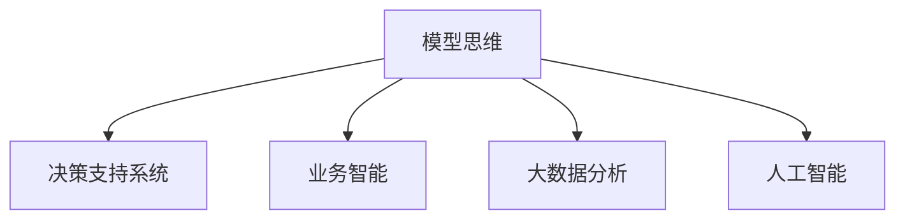

                 

# 模型思维与管理效率的优化

> 关键词：模型思维,管理效率优化,决策支持,智能管理,人工智能,模型训练,自动化

## 1. 背景介绍

### 1.1 问题由来
在信息时代，企业面临复杂多变的市场环境，要求能够及时、准确地做出高效决策。传统基于经验、直觉或手工统计的分析方法难以适应动态变化的市场需求。而通过模型思维，即运用数学模型、统计学方法和人工智能技术，对企业运营数据进行分析，辅助管理者做出更优决策，成为提升管理效率的重要手段。

### 1.2 问题核心关键点
模型思维的核心在于通过建立数学模型，对企业运营数据进行建模和预测，从而实现数据驱动的决策支持。这不仅包括传统的统计学模型（如回归分析、时间序列分析等），还包括新兴的机器学习与深度学习模型（如线性回归、决策树、神经网络等）。通过这些模型，可以从海量的数据中提取有价值的洞察，辅助管理者做出明智决策，提升管理效率。

### 1.3 问题研究意义
模型思维在管理中的应用，可以有效解决传统管理方法中存在的问题，提高决策的科学性和准确性，减少决策中的主观性和不确定性，从而提升管理效率。具体而言：

1. **提升决策速度**：模型思维通过自动化数据分析，减少了手动处理数据的时间和劳动力成本，加速决策过程。
2. **增强决策准确性**：模型提供了基于数据的客观分析结果，减少了人为偏见，提升决策质量。
3. **优化资源配置**：通过模型预测，企业可以更好地预测市场需求，优化库存、生产等资源配置。
4. **风险管理**：模型可以帮助识别潜在的风险点，提前采取措施，降低风险损失。
5. **促进创新**：模型思维提供了数据驱动的创新思路，助力企业不断优化产品、服务和运营流程。

## 2. 核心概念与联系

### 2.1 核心概念概述

为更好地理解模型思维在管理中的应用，本节将介绍几个密切相关的核心概念：

- **模型思维**：基于数学模型和统计分析方法，对企业运营数据进行建模和预测，辅助管理者做出决策的思维方式。
- **决策支持系统**（Decision Support System, DSS）：利用模型思维提供的数据分析结果，辅助管理者进行决策的系统。
- **业务智能**（Business Intelligence, BI）：通过数据收集、清洗、分析和可视化，支持企业战略决策和运营优化的技术。
- **大数据分析**：通过处理和分析海量数据，揭示数据背后的规律和趋势，支持企业决策的技术。
- **人工智能**：通过机器学习、深度学习等技术，实现对数据的智能分析和预测，提升决策支持系统的准确性。

这些核心概念之间的逻辑关系可以通过以下Mermaid流程图来展示：



这个流程图展示了模型思维与其他相关概念的连接关系：

1. 模型思维是决策支持系统的基础，提供了数据驱动的决策依据。
2. 决策支持系统是模型思维的具体应用，通过数据分析结果辅助管理者做出决策。
3. 业务智能和数据分析是模型思维的技术支持，提供了数据处理和分析工具。
4. 人工智能是模型思维的高级形式，通过自动化算法提升了决策的准确性和效率。

这些核心概念共同构成了管理决策的支持体系，使得企业能够更加科学、高效地进行决策。

## 3. 核心算法原理 & 具体操作步骤
### 3.1 算法原理概述

基于模型思维的管理效率优化，核心在于通过建立数学模型，对企业运营数据进行建模和预测，从而实现数据驱动的决策支持。模型思维的核心算法包括：

- **回归分析**：通过建立自变量与因变量之间的线性或非线性关系，预测因变量的未来值。
- **时间序列分析**：利用历史数据，预测未来的趋势和季节性变化。
- **分类和聚类**：将数据分成不同的类别或群体，识别数据中的模式和结构。
- **深度学习模型**：如神经网络、卷积神经网络（CNN）、循环神经网络（RNN）等，通过多层次的抽象表示，进行更复杂的预测和分类。
- **强化学习**：通过模拟真实环境中的决策过程，学习最优策略，优化资源配置。

这些算法通过数学模型的构建和训练，对数据进行处理和分析，最终提供决策支持。

### 3.2 算法步骤详解

基于模型思维的管理效率优化一般包括以下几个关键步骤：

**Step 1: 数据收集与清洗**
- 收集企业运营相关的数据，如销售数据、财务数据、供应链数据等。
- 对数据进行清洗，去除无效、重复或异常的数据。

**Step 2: 数据预处理**
- 对数据进行标准化、归一化等预处理操作，确保模型输入的一致性。
- 利用缺失值填充、数据平滑等技术，处理缺失数据和噪声。

**Step 3: 模型选择与构建**
- 根据问题的性质和数据的特征，选择合适的模型（如回归模型、时间序列模型、分类模型等）。
- 对模型进行参数调优和超参数设置，进行模型训练。

**Step 4: 模型评估与验证**
- 使用验证集对模型进行评估，衡量模型预测的准确性。
- 利用交叉验证、网格搜索等技术，进一步优化模型性能。

**Step 5: 模型应用与优化**
- 将训练好的模型应用于实际的管理决策中。
- 定期收集新数据，更新模型参数，保持模型性能。
- 引入反馈机制，持续优化模型，提升决策效果。

以上是模型思维在管理中的应用流程，通过这些步骤，企业可以有效地利用数据，辅助决策，提升管理效率。

### 3.3 算法优缺点

基于模型思维的管理效率优化方法具有以下优点：
1. 数据驱动：模型思维通过数据分析，提供客观的决策依据，减少了决策中的主观性和不确定性。
2. 自动化：模型自动处理和分析数据，减少了人工干预，提高了决策速度。
3. 可重复性：模型可以重复应用，提高了决策的一致性和稳定性。
4. 泛化性强：模型能够处理大量数据，提供具有普遍适用性的预测结果。
5. 可解释性：模型通过数学公式，提供了决策的逻辑和解释，便于管理者理解和接受。

同时，该方法也存在一定的局限性：
1. 数据质量要求高：模型结果的准确性依赖于输入数据的质量和完整性。
2. 模型复杂度较高：高级模型如深度学习模型，训练复杂，计算资源消耗大。
3. 对异常值敏感：模型可能对异常值和噪声数据产生较大偏差。
4. 模型维护难度大：模型需要定期更新和维护，确保其适应性。
5. 决策依赖模型：模型提供的是预测结果，决策仍需人工介入和判断。

尽管存在这些局限性，但就目前而言，基于模型思维的管理效率优化方法仍是大企业提升决策水平的重要手段。未来相关研究的重点在于如何进一步提高模型的泛化能力、自动化水平和可解释性，同时兼顾数据质量和资源消耗等因素。

### 3.4 算法应用领域

基于模型思维的管理效率优化方法，在多个领域中得到了广泛应用，具体包括：

- **销售预测**：通过时间序列分析、回归模型等，预测销售趋势，优化库存和采购计划。
- **财务分析**：利用回归模型、决策树等，分析财务数据，优化成本和收益。
- **客户细分**：通过聚类分析，将客户分成不同的群体，制定差异化的营销策略。
- **供应链管理**：利用预测模型，优化供应链流程，降低库存和运输成本。
- **市场竞争分析**：通过数据挖掘和分类模型，分析竞争对手情况，制定竞争策略。

除了这些传统领域，模型思维还在更多新兴领域中得到应用，如智慧城市、智能制造等，为企业的数字化转型升级提供了新的技术路径。

## 4. 数学模型和公式 & 详细讲解 & 举例说明
### 4.1 数学模型构建

本节将使用数学语言对基于模型思维的管理效率优化过程进行更加严格的刻画。

假设企业运营数据集为 $D=\{(x_i, y_i)\}_{i=1}^N$，其中 $x_i$ 为自变量向量，$y_i$ 为因变量向量。我们希望建立一个数学模型 $M$，使其能够预测新的自变量向量 $x^*$ 对应的因变量向量 $y^*$。

模型的数学形式为：

$$
M: x \rightarrow y
$$

其中 $M$ 可以是一个线性回归模型、时间序列模型、分类模型等。

模型的训练目标是最小化预测误差，即：

$$
\min_{M} \sum_{i=1}^N ||y_i - M(x_i)||^2
$$

使用均方误差（Mean Squared Error, MSE）作为损失函数：

$$
L(y, \hat{y}) = \frac{1}{N} \sum_{i=1}^N (y_i - \hat{y}_i)^2
$$

其中 $\hat{y}_i$ 为模型对 $y_i$ 的预测值。

### 4.2 公式推导过程

以线性回归模型为例，其数学形式为：

$$
y = \beta_0 + \sum_{j=1}^p \beta_j x_{j}
$$

其中 $\beta_0$ 为截距，$\beta_j$ 为自变量的系数向量。

模型的梯度更新公式为：

$$
\beta_{j}^{(t+1)} = \beta_{j}^{(t)} - \eta \frac{\partial L}{\partial \beta_{j}}
$$

其中 $\eta$ 为学习率。

具体推导过程如下：

1. 计算梯度：

$$
\frac{\partial L}{\partial \beta_{j}} = \frac{2}{N} \sum_{i=1}^N (x_{i,j} - \hat{x}_{i,j})y_i
$$

2. 更新参数：

$$
\beta_{j}^{(t+1)} = \beta_{j}^{(t)} - \eta \frac{\partial L}{\partial \beta_{j}}
$$

3. 迭代优化：重复上述过程，直到收敛。

通过上述过程，线性回归模型可以有效地预测因变量的值，辅助企业进行决策。

### 4.3 案例分析与讲解

**案例：销售预测**

假设某电商平台销售数据集 $D$ 包含自变量 $x_i = [x_{i,1}, x_{i,2}, ..., x_{i,p}]$，其中 $x_{i,j}$ 为自变量 $j$ 的取值，因变量 $y_i$ 为当月的销售额。

建立线性回归模型，用于预测下个月的销售额：

$$
\hat{y}_{i+1} = \beta_0 + \sum_{j=1}^p \beta_j x_{i+1,j}
$$

假设 $p=3$，模型中的系数 $\beta_0=10, \beta_1=5, \beta_2=-2, \beta_3=3$。

使用训练集 $D$ 进行模型训练，得到预测结果：

$$
\hat{y}_{i+1} = 10 + 5x_{i+1,1} - 2x_{i+1,2} + 3x_{i+1,3}
$$

在测试集上评估模型性能，得到均方误差：

$$
\text{MSE} = \frac{1}{N} \sum_{i=1}^N (y_i - \hat{y}_i)^2
$$

通过优化学习率和超参数，不断调整模型，以获得更好的预测效果。

## 5. 项目实践：代码实例和详细解释说明
### 5.1 开发环境搭建

在进行模型思维的实践前，我们需要准备好开发环境。以下是使用Python进行Scikit-learn开发的环境配置流程：

1. 安装Anaconda：从官网下载并安装Anaconda，用于创建独立的Python环境。

2. 创建并激活虚拟环境：
```bash
conda create -n model-env python=3.8 
conda activate model-env
```

3. 安装Scikit-learn：
```bash
conda install scikit-learn
```

4. 安装其他依赖库：
```bash
pip install pandas numpy matplotlib seaborn jupyter notebook ipython
```

完成上述步骤后，即可在`model-env`环境中开始模型思维的实践。

### 5.2 源代码详细实现

下面我们以销售预测为例，给出使用Scikit-learn进行线性回归模型训练的Python代码实现。

首先，定义数据处理函数：

```python
import pandas as pd
from sklearn.model_selection import train_test_split
from sklearn.linear_model import LinearRegression
from sklearn.metrics import mean_squared_error

def load_data(filename):
    data = pd.read_csv(filename)
    X = data.iloc[:, :-1].values
    y = data.iloc[:, -1].values
    return X, y

def train_model(X_train, y_train, X_test, y_test):
    model = LinearRegression()
    model.fit(X_train, y_train)
    y_pred = model.predict(X_test)
    mse = mean_squared_error(y_test, y_pred)
    return model, mse

def evaluate_model(model, X_test, y_test):
    y_pred = model.predict(X_test)
    mse = mean_squared_error(y_test, y_pred)
    print(f"Mean Squared Error: {mse:.3f}")
```

然后，加载数据并进行训练：

```python
filename = 'sales_data.csv'
X, y = load_data(filename)
X_train, X_test, y_train, y_test = train_test_split(X, y, test_size=0.2, random_state=42)

model, mse = train_model(X_train, y_train, X_test, y_test)
print(f"Training MSE: {mse:.3f}")
```

最后，评估模型并输出结果：

```python
evaluate_model(model, X_test, y_test)
```

以上就是使用Scikit-learn进行销售预测的完整代码实现。可以看到，Scikit-learn提供了简单易用的接口，可以快速实现线性回归模型的训练和评估。

### 5.3 代码解读与分析

让我们再详细解读一下关键代码的实现细节：

**load_data函数**：
- 读取销售数据集，并分割为自变量和因变量。
- 使用train_test_split函数将数据集分为训练集和测试集。

**train_model函数**：
- 创建线性回归模型，并使用训练集进行拟合。
- 使用训练好的模型对测试集进行预测。
- 计算预测值与真实值之间的均方误差。

**evaluate_model函数**：
- 使用测试集对模型进行评估，输出均方误差。

**主程序**：
- 加载数据集并分割。
- 训练模型并输出训练集上的均方误差。
- 评估模型并输出测试集上的均方误差。

通过以上代码，可以直观地理解线性回归模型的训练和评估过程。当然，在实际应用中，还需要进一步优化模型的参数，如学习率、正则化参数等，以获得更好的预测效果。

## 6. 实际应用场景
### 6.1 智能制造

基于模型思维的管理效率优化在智能制造领域中得到了广泛应用。传统制造企业依赖大量的人力资源进行生产和调度，效率低下且成本高昂。通过引入模型思维，可以实现以下目标：

- **生产调度优化**：利用线性规划、时间序列分析等模型，优化生产线的调度，提高生产效率和资源利用率。
- **设备维护预测**：建立预测模型，预测设备故障和维护需求，减少设备停机时间，降低维护成本。
- **质量控制**：通过数据挖掘和聚类分析，识别生产中的异常点，及时进行质量控制和纠正。

例如，某智能制造企业通过引入模型思维，利用时间序列分析对生产数据进行建模和预测，优化了生产线的调度，降低了生产成本，提高了产品质量和生产效率。

### 6.2 智慧城市

在智慧城市建设中，基于模型思维的管理效率优化方法也得到了广泛应用。智慧城市通过物联网、大数据等技术，实时采集城市运营数据，如交通流量、空气质量、公共服务需求等，通过模型思维进行分析，提升城市管理水平。

具体应用包括：

- **交通流量预测**：利用时间序列分析，预测城市交通流量，优化交通管理和调度和规划。
- **环境质量监测**：通过数据建模，实时监测环境质量，提前采取环境保护措施。
- **公共服务优化**：利用数据挖掘和聚类分析，识别公共服务需求，优化资源配置和服务质量。

例如，某智慧城市通过引入模型思维，利用回归模型和聚类分析，预测交通流量和环境质量，优化了城市交通和环境保护，提高了城市管理效率和居民生活质量。

### 6.3 金融风险管理

金融行业对数据的敏感性和复杂性要求较高，传统的经验分析和手工统计难以满足需求。基于模型思维的管理效率优化方法，通过数据驱动的预测和分析，有效提升了金融风险管理的水平。

具体应用包括：

- **信用风险评估**：利用分类和回归模型，评估客户信用风险，优化信贷决策。
- **市场风险预测**：通过时间序列分析，预测市场走势，优化资产配置和投资策略。
- **欺诈检测**：利用异常检测和聚类分析，识别交易异常行为，降低金融欺诈风险。

例如，某金融机构通过引入模型思维，利用分类模型和回归模型，评估客户信用风险，优化了信贷决策和资产配置，提升了金融服务质量和风险管理水平。

### 6.4 未来应用展望

随着模型思维的不断发展和应用，未来在更多领域中都将展现其巨大潜力。以下列举几个未来的应用场景：

1. **医疗健康**：通过模型思维，分析医疗数据，优化疾病预测和治疗方案，提升医疗服务质量。
2. **教育培训**：利用数据挖掘和聚类分析，识别学生的学习需求和潜力，制定个性化的教学方案，提高教育效果。
3. **农业管理**：通过模型思维，优化农业生产和资源管理，提高农作物产量和农业生产效率。
4. **环境保护**：利用数据建模，实时监测和预测环境变化，制定环境保护措施，提升环境保护效果。
5. **智能交通**：通过数据挖掘和分析，优化交通管理和调度，提升交通效率和安全性。

## 7. 工具和资源推荐
### 7.1 学习资源推荐

为了帮助开发者系统掌握模型思维的理论基础和实践技巧，这里推荐一些优质的学习资源：

1. 《机器学习实战》系列书籍：由机器学习领域的专家撰写，深入浅出地介绍了机器学习的基本概念和算法，适合初学者入门。
2. 《Python数据科学手册》书籍：涵盖了数据科学从数据收集、处理、分析和可视化到机器学习的全流程，适合掌握完整的分析流程。
3. Coursera《机器学习》课程：由斯坦福大学教授Andrew Ng主讲，系统讲解了机器学习的基本概念和算法，适合进一步提升理论基础。
4. Kaggle数据科学竞赛平台：提供了大量数据集和竞赛机会，通过实战练习，提升数据处理和模型优化能力。
5. GitHub开源项目：如TensorFlow、Scikit-learn等，提供了丰富的数据集和模型，适合进一步学习和应用。

通过对这些资源的学习实践，相信你一定能够快速掌握模型思维的精髓，并用于解决实际的NLP问题。

### 7.2 开发工具推荐

高效的开发离不开优秀的工具支持。以下是几款用于模型思维开发的常用工具：

1. Scikit-learn：基于Python的机器学习库，提供了丰富的算法和模型，适合数据处理和建模。
2. TensorFlow：由Google主导开发的深度学习框架，支持分布式计算和模型训练，适合大规模模型开发。
3. PyTorch：由Facebook主导开发的深度学习框架，提供了动态计算图和高效优化器，适合研究性质的模型开发。
4. Weights & Biases：模型训练的实验跟踪工具，可以记录和可视化模型训练过程中的各项指标，方便对比和调优。
5. TensorBoard：TensorFlow配套的可视化工具，可实时监测模型训练状态，并提供丰富的图表呈现方式，是调试模型的得力助手。

合理利用这些工具，可以显著提升模型思维的开发效率，加快创新迭代的步伐。

### 7.3 相关论文推荐

模型思维的发展源于学界的持续研究。以下是几篇奠基性的相关论文，推荐阅读：

1. "Linear Regression Analysis"：经典的线性回归论文，介绍了线性回归的基本概念和算法。
2. "Multivariate Time Series Forecasting"：介绍了时间序列分析的基本方法和应用。
3. "Classification and Regression Trees"：介绍了决策树的基本概念和算法。
4. "Deep Learning"：由Goodfellow等人合著的深度学习教材，全面介绍了深度学习的基本概念和算法。
5. "Deep Architectures for Large-Scale Image Recognition"：介绍了卷积神经网络（CNN）的基本概念和算法。

这些论文代表了大模型思维的发展脉络。通过学习这些前沿成果，可以帮助研究者把握学科前进方向，激发更多的创新灵感。

## 8. 总结：未来发展趋势与挑战
### 8.1 总结

本文对基于模型思维的管理效率优化方法进行了全面系统的介绍。首先阐述了模型思维在管理中的应用背景和意义，明确了模型思维在提升决策科学性和准确性方面的独特价值。其次，从原理到实践，详细讲解了模型思维的数学原理和关键步骤，给出了模型思维任务开发的完整代码实例。同时，本文还广泛探讨了模型思维在多个行业领域的应用前景，展示了模型思维的巨大潜力。

通过本文的系统梳理，可以看到，基于模型思维的管理效率优化方法正在成为管理决策的重要手段，极大地提升了决策的科学性和准确性，减少了决策中的主观性和不确定性。未来，伴随模型思维技术的不断演进，必将进一步提升管理效率，构建更加智能、高效的管理系统。

### 8.2 未来发展趋势

展望未来，模型思维在管理中的应用将呈现以下几个发展趋势：

1. **模型自动化**：随着模型优化算法的不断进步，模型的训练和优化将更加自动化，降低人工干预的难度。
2. **数据融合**：不同数据源的数据将更加紧密地融合，提供更全面、准确的信息支持。
3. **模型集成**：多种模型的组合使用将更加普遍，提高模型的泛化能力和适应性。
4. **智能决策**：通过引入智能决策技术，如强化学习、因果推断等，提升决策的智能性和实时性。
5. **模型自适应**：模型将具备更高的自适应能力，能够动态调整参数，应对数据分布的变化。

以上趋势凸显了模型思维的广泛应用前景，这些方向的探索发展，必将进一步提升管理效率，助力企业数字化转型。

### 8.3 面临的挑战

尽管模型思维在管理中的应用已经取得了一定的成果，但在迈向更加智能化、普适化应用的过程中，它仍面临诸多挑战：

1. **数据质量问题**：模型结果的准确性依赖于输入数据的质量和完整性，数据收集和处理过程中可能存在噪音和缺失。
2. **模型复杂度**：高级模型如深度学习模型，训练复杂，计算资源消耗大，需要持续的硬件投入和技术支持。
3. **模型解释性**：模型往往是一个"黑盒"系统，难以解释其内部工作机制和决策逻辑，难以得到管理层的信任和接受。
4. **模型维护**：模型需要定期更新和维护，确保其适应性，增加了额外的维护成本。
5. **模型应用难度**：模型的引入需要管理层和技术团队的共同协作，增加了应用的复杂度。

正视模型思维面临的这些挑战，积极应对并寻求突破，将是模型思维在管理中成功应用的保障。相信随着模型优化算法和技术支持的进步，这些挑战终将一一被克服。

### 8.4 研究展望

面对模型思维在管理中面临的挑战，未来的研究需要在以下几个方面寻求新的突破：

1. **数据预处理技术**：提升数据质量，减少噪音和缺失，确保模型训练的准确性。
2. **模型优化算法**：优化模型训练和优化算法，降低计算资源消耗，提升模型的泛化能力。
3. **模型解释性**：引入可解释性技术，如SHAP、LIME等，提升模型的透明度和可信度。
4. **模型应用框架**：开发更加易于应用的模型框架和工具，降低应用的复杂度。
5. **多模型融合**：研究多模型融合技术，提升模型的综合性能和适应性。

这些研究方向的探索，必将引领模型思维在管理中的应用走向更高的台阶，为构建智能、高效、可靠的管理系统铺平道路。面向未来，模型思维需要与其他管理技术进行更深入的融合，如业务智能、数据分析等，共同推动管理决策系统的进步。只有勇于创新、敢于突破，才能不断拓展模型思维的边界，让智能技术更好地服务于管理实践。

## 9. 附录：常见问题与解答

**Q1：模型思维是否适用于所有管理决策？**

A: 模型思维在大多数管理决策中都能取得不错的效果，特别是在数据量较大的情况下。但对于一些需要经验和判断的任务，如决策权重大、信息不完全等情况，仍然需要结合人的智慧和判断，以确保决策的全面性和合理性。

**Q2：如何选择合适的模型？**

A: 选择模型需要考虑数据的类型、问题的性质和目标。一般来说，回归分析适用于连续型数据和预测问题，分类模型适用于离散型数据和分类问题，时间序列分析适用于时间相关性强的数据。具体选择时，可以通过数据探索和初步建模，选择表现最佳的模型。

**Q3：模型思维的计算资源需求如何？**

A: 模型思维的计算资源需求取决于模型复杂度和数据量。对于简单的线性回归模型，计算资源需求较小；而对于复杂的深度学习模型，计算资源消耗较大。需要根据具体应用场景和数据规模，选择合适的计算资源和优化算法。

**Q4：模型思维的维护和更新难度大吗？**

A: 模型思维的维护和更新确实需要持续的技术支持和管理，但随着模型自动化和数据自动化的进步，维护和更新难度将逐步降低。同时，模型更新周期也可以根据实际需求进行灵活调整。

**Q5：模型思维如何与业务智能（BI）结合？**

A: 模型思维和业务智能（BI）可以相互补充，模型思维提供数据分析和预测，BI提供数据可视化和报表，两者结合可以提供更全面、更直观的决策支持。实际应用中，可以将模型思维的结果通过BI进行展示，辅助管理层进行决策。

通过以上问题的解答，可以更好地理解模型思维在管理中的应用，进一步推动其广泛应用和发展。总之，模型思维是提升管理效率的重要手段，需要持续的实践和优化，才能发挥其最大潜力。

