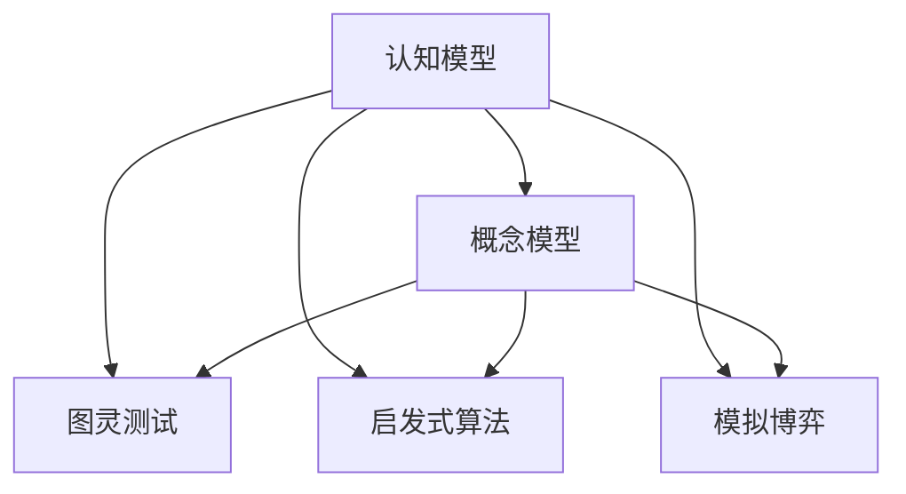

                 

# 模型思维应用:快速理解新事物

> 关键词：模型思维,认知模型,概念模型,图灵测试,启发式算法,模拟博弈

## 1. 背景介绍

### 1.1 问题由来
在现代信息爆炸的时代，每天都会产生大量新的概念、理论和模型，令人目不暇接。无论是在学术界、产业界还是日常生活中，理解新事物、快速学习的能力变得尤为重要。如何高效地学习新知识，并将其应用到实际问题的解决中，成为了摆在我们面前的重大挑战。

本文将从模型思维的角度出发，探讨如何利用认知模型和图灵测试等工具，快速理解新事物，并将其应用于实际问题的解决。我们将从基础概念入手，逐步深入到高级应用，希望能为读者提供一种全新的、有效的学习框架，让模型思维成为我们理解和应用新知识的利器。

## 2. 核心概念与联系

### 2.1 核心概念概述

为更好地理解模型思维的应用，本节将介绍几个密切相关的核心概念：

- **认知模型**：是人类对世界的一种简化理解方式，通过模型模拟人类思维和决策过程。在人工智能中，认知模型通常用于解释和预测人类行为。
- **概念模型**：是对现实世界现象的抽象表示，用于刻画系统行为和特性。在NLP、计算机视觉等领域，概念模型常常用于构建语义空间和特征表示。
- **图灵测试**：由英国数学家图灵提出，用于衡量机器能否表现出与人类相似的智能行为，包括对话、游戏、推理等。通过图灵测试，我们可以评估机器的智能水平。
- **启发式算法**：是一类模仿人类或动物解决问题方式的算法，通过直觉和经验寻找最优解，而非严格计算。常见的启发式算法包括模拟退火、遗传算法等。
- **模拟博弈**：是博弈论中的一个重要分支，用于通过模拟实际博弈过程，分析策略的可行性和结果预测。模拟博弈可以应用于社会、经济、军事等复杂系统。

这些核心概念之间的逻辑关系可以通过以下Mermaid流程图来展示：



这个流程图展示了大模型思维的核心概念及其之间的关系：

1. 认知模型用于模拟人类思维过程，通过建立概念模型来刻画世界。
2. 图灵测试用于评估认知模型的智能水平，确保其能够理解和模拟人类行为。
3. 启发式算法模仿人类解决问题的方式，用于优化模型和算法。
4. 模拟博弈用于分析策略和结果，验证模型在复杂环境中的表现。

这些概念共同构成了模型思维的基础框架，帮助我们理解和应用新事物。通过理解这些核心概念，我们可以更好地把握模型思维的工作原理和优化方向。

## 3. 核心算法原理 & 具体操作步骤
### 3.1 算法原理概述

模型思维的应用，核心在于建立合适的认知模型，并通过不断的测试、优化，逐步提升其智能水平。这一过程通常包括以下几个关键步骤：

1. **认知模型构建**：根据任务需求，选择合适的认知模型，如规则模型、统计模型、神经网络模型等。
2. **数据准备**：收集和标注与任务相关的数据，供模型训练和测试使用。
3. **模型训练**：使用标注数据训练模型，优化模型参数。
4. **性能评估**：通过图灵测试等方法，评估模型的智能水平和实际应用效果。
5. **模型改进**：根据评估结果，调整模型结构和参数，进一步提升性能。
6. **应用部署**：将优化后的模型部署到实际应用场景中，进行测试和优化。

### 3.2 算法步骤详解

下面我们以认知模型应用于NLP任务为例，详细讲解具体的算法步骤：

**Step 1: 选择认知模型**

- 根据任务需求，选择合适的认知模型，如规则模型、统计模型、神经网络模型等。在NLP任务中，常见的模型包括基于规则的NLP系统、基于统计的NLP系统、基于神经网络的NLP模型等。

**Step 2: 准备数据**

- 收集和标注与任务相关的数据，供模型训练和测试使用。在NLP任务中，可以收集语料库、对话数据集、文本分类数据集等。

**Step 3: 模型训练**

- 使用标注数据训练模型，优化模型参数。在NLP任务中，可以使用深度学习框架（如PyTorch、TensorFlow等）构建和训练模型，如LSTM、GRU、Transformer等。

**Step 4: 性能评估**

- 通过图灵测试等方法，评估模型的智能水平和实际应用效果。在NLP任务中，可以使用BLEU、ROUGE、F1等指标评估模型的表现。

**Step 5: 模型改进**

- 根据评估结果，调整模型结构和参数，进一步提升性能。在NLP任务中，可以通过调整模型层数、学习率、正则化等参数，提升模型的准确率和泛化能力。

**Step 6: 应用部署**

- 将优化后的模型部署到实际应用场景中，进行测试和优化。在NLP任务中，可以将模型应用到智能客服、文本摘要、情感分析等实际场景中。

### 3.3 算法优缺点

模型思维的应用具有以下优点：

- 高效性：通过使用认知模型和启发式算法，可以快速理解和解决新问题。
- 灵活性：模型思维可以根据任务需求，灵活选择和调整认知模型，适应不同的应用场景。
- 可解释性：模型思维通过模拟人类思维过程，更容易理解和解释模型行为。

但同时，该方法也存在一定的局限性：

- 数据依赖性：模型思维需要大量的标注数据来训练，数据获取成本较高。
- 过度拟合风险：在标注数据不足的情况下，模型容易过度拟合，泛化能力下降。
- 知识局限性：认知模型和概念模型可能无法全面刻画现实世界，存在一定的知识局限性。

尽管存在这些局限性，但就目前而言，模型思维的应用仍是最主流的方法。未来相关研究的重点在于如何进一步降低模型思维对标注数据的依赖，提高模型的泛化能力和适应性。

### 3.4 算法应用领域

模型思维的应用广泛渗透在各个领域，以下是几个典型的应用场景：

- **自然语言处理(NLP)**：用于构建智能问答系统、对话系统、文本分类、情感分析等。
- **计算机视觉**：用于图像识别、目标检测、场景理解等。
- **推荐系统**：用于个性化推荐、商品推荐、用户画像等。
- **智能交通**：用于交通流量预测、自动驾驶、智能导航等。
- **金融风险管理**：用于风险预测、信用评估、欺诈检测等。

除了上述这些经典应用外，模型思维还被应用于更多场景中，如医疗诊断、教育培训、物流优化等，为各个领域带来了新的变革和突破。

## 4. 数学模型和公式 & 详细讲解 & 举例说明

### 4.1 数学模型构建

本节将使用数学语言对模型思维的应用进行更加严格的刻画。

假设我们要构建一个用于文本分类的认知模型，其输入为文本 $x$，输出为分类标签 $y$。模型的输入空间为 $\mathcal{X}$，输出空间为 $\mathcal{Y}$。模型的参数空间为 $\theta$。

定义模型的损失函数为 $\mathcal{L}(\theta)$，用于衡量模型输出与真实标签之间的差异。常见的损失函数包括交叉熵损失、均方误差损失等。

模型的优化目标是最小化损失函数，即找到最优参数：

$$
\theta^* = \mathop{\arg\min}_{\theta} \mathcal{L}(\theta)
$$

在实践中，我们通常使用基于梯度的优化算法（如SGD、Adam等）来近似求解上述最优化问题。设 $\eta$ 为学习率，$\lambda$ 为正则化系数，则参数的更新公式为：

$$
\theta \leftarrow \theta - \eta \nabla_{\theta}\mathcal{L}(\theta) - \eta\lambda\theta
$$

其中 $\nabla_{\theta}\mathcal{L}(\theta)$ 为损失函数对参数 $\theta$ 的梯度，可通过反向传播算法高效计算。

### 4.2 公式推导过程

以下我们以二分类任务为例，推导交叉熵损失函数及其梯度的计算公式。

假设模型 $M_{\theta}$ 在输入 $x$ 上的输出为 $\hat{y}=M_{\theta}(x) \in [0,1]$，表示样本属于正类的概率。真实标签 $y \in \{0,1\}$。则二分类交叉熵损失函数定义为：

$$
\ell(M_{\theta}(x),y) = -[y\log \hat{y} + (1-y)\log (1-\hat{y})]
$$

将其代入经验风险公式，得：

$$
\mathcal{L}(\theta) = -\frac{1}{N}\sum_{i=1}^N [y_i\log M_{\theta}(x_i)+(1-y_i)\log(1-M_{\theta}(x_i))]
$$

根据链式法则，损失函数对参数 $\theta_k$ 的梯度为：

$$
\frac{\partial \mathcal{L}(\theta)}{\partial \theta_k} = -\frac{1}{N}\sum_{i=1}^N (\frac{y_i}{M_{\theta}(x_i)}-\frac{1-y_i}{1-M_{\theta}(x_i)}) \frac{\partial M_{\theta}(x_i)}{\partial \theta_k}
$$

其中 $\frac{\partial M_{\theta}(x_i)}{\partial \theta_k}$ 可进一步递归展开，利用自动微分技术完成计算。

### 4.3 案例分析与讲解

以下我们以文本分类任务为例，给出使用PyTorch构建和训练BERT模型的PyTorch代码实现。

首先，定义数据集类：

```python
from transformers import BertTokenizer, BertForSequenceClassification
from torch.utils.data import Dataset
import torch

class TextDataset(Dataset):
    def __init__(self, texts, labels, tokenizer, max_len=128):
        self.texts = texts
        self.labels = labels
        self.tokenizer = tokenizer
        self.max_len = max_len
        
    def __len__(self):
        return len(self.texts)
    
    def __getitem__(self, item):
        text = self.texts[item]
        label = self.labels[item]
        
        encoding = self.tokenizer(text, return_tensors='pt', max_length=self.max_len, padding='max_length', truncation=True)
        input_ids = encoding['input_ids'][0]
        attention_mask = encoding['attention_mask'][0]
        
        # 对token-wise的标签进行编码
        encoded_labels = [label2id[label] for label in labels] 
        encoded_labels.extend([label2id['O']] * (self.max_len - len(encoded_labels)))
        labels = torch.tensor(encoded_labels, dtype=torch.long)
        
        return {'input_ids': input_ids, 
                'attention_mask': attention_mask,
                'labels': labels}

# 标签与id的映射
label2id = {'O': 0, 'B': 1, 'I': 2}
id2label = {v: k for k, v in label2id.items()}
```

然后，定义模型和优化器：

```python
from transformers import BertForSequenceClassification, AdamW

model = BertForSequenceClassification.from_pretrained('bert-base-uncased', num_labels=len(label2id))

optimizer = AdamW(model.parameters(), lr=2e-5)
```

接着，定义训练和评估函数：

```python
from torch.utils.data import DataLoader
from tqdm import tqdm
from sklearn.metrics import classification_report

device = torch.device('cuda') if torch.cuda.is_available() else torch.device('cpu')
model.to(device)

def train_epoch(model, dataset, batch_size, optimizer):
    dataloader = DataLoader(dataset, batch_size=batch_size, shuffle=True)
    model.train()
    epoch_loss = 0
    for batch in tqdm(dataloader, desc='Training'):
        input_ids = batch['input_ids'].to(device)
        attention_mask = batch['attention_mask'].to(device)
        labels = batch['labels'].to(device)
        model.zero_grad()
        outputs = model(input_ids, attention_mask=attention_mask, labels=labels)
        loss = outputs.loss
        epoch_loss += loss.item()
        loss.backward()
        optimizer.step()
    return epoch_loss / len(dataloader)

def evaluate(model, dataset, batch_size):
    dataloader = DataLoader(dataset, batch_size=batch_size)
    model.eval()
    preds, labels = [], []
    with torch.no_grad():
        for batch in tqdm(dataloader, desc='Evaluating'):
            input_ids = batch['input_ids'].to(device)
            attention_mask = batch['attention_mask'].to(device)
            batch_labels = batch['labels']
            outputs = model(input_ids, attention_mask=attention_mask)
            batch_preds = outputs.logits.argmax(dim=1).to('cpu').tolist()
            batch_labels = batch_labels.to('cpu').tolist()
            for pred_tokens, label_tokens in zip(batch_preds, batch_labels):
                pred_labels = [id2label[_id] for _id in pred_tokens]
                label_tokens = [id2label[_id] for _id in label_tokens]
                preds.append(pred_labels[:len(label_tokens)])
                labels.append(label_tokens)
                
    print(classification_report(labels, preds))
```

最后，启动训练流程并在测试集上评估：

```python
epochs = 5
batch_size = 16

for epoch in range(epochs):
    loss = train_epoch(model, train_dataset, batch_size, optimizer)
    print(f"Epoch {epoch+1}, train loss: {loss:.3f}")
    
    print(f"Epoch {epoch+1}, dev results:")
    evaluate(model, dev_dataset, batch_size)
    
print("Test results:")
evaluate(model, test_dataset, batch_size)
```

以上就是使用PyTorch对BERT进行文本分类任务微调的完整代码实现。可以看到，得益于Transformers库的强大封装，我们可以用相对简洁的代码完成BERT模型的加载和微调。

## 5. 项目实践：代码实例和详细解释说明

### 5.1 开发环境搭建

在进行模型思维实践前，我们需要准备好开发环境。以下是使用Python进行PyTorch开发的环境配置流程：

1. 安装Anaconda：从官网下载并安装Anaconda，用于创建独立的Python环境。

2. 创建并激活虚拟环境：
```bash
conda create -n pytorch-env python=3.8 
conda activate pytorch-env
```

3. 安装PyTorch：根据CUDA版本，从官网获取对应的安装命令。例如：
```bash
conda install pytorch torchvision torchaudio cudatoolkit=11.1 -c pytorch -c conda-forge
```

4. 安装Transformers库：
```bash
pip install transformers
```

5. 安装各类工具包：
```bash
pip install numpy pandas scikit-learn matplotlib tqdm jupyter notebook ipython
```

完成上述步骤后，即可在`pytorch-env`环境中开始模型思维实践。

### 5.2 源代码详细实现

下面我们以NLP任务中的命名实体识别(NER)为例，给出使用Transformers库对BERT模型进行微调的PyTorch代码实现。

首先，定义NER任务的数据处理函数：

```python
from transformers import BertTokenizer
from torch.utils.data import Dataset
import torch

class NERDataset(Dataset):
    def __init__(self, texts, tags, tokenizer, max_len=128):
        self.texts = texts
        self.tags = tags
        self.tokenizer = tokenizer
        self.max_len = max_len
        
    def __len__(self):
        return len(self.texts)
    
    def __getitem__(self, item):
        text = self.texts[item]
        tags = self.tags[item]
        
        encoding = self.tokenizer(text, return_tensors='pt', max_length=self.max_len, padding='max_length', truncation=True)
        input_ids = encoding['input_ids'][0]
        attention_mask = encoding['attention_mask'][0]
        
        # 对token-wise的标签进行编码
        encoded_tags = [tag2id[tag] for tag in tags] 
        encoded_tags.extend([tag2id['O']] * (self.max_len - len(encoded_tags)))
        labels = torch.tensor(encoded_tags, dtype=torch.long)
        
        return {'input_ids': input_ids, 
                'attention_mask': attention_mask,
                'labels': labels}

# 标签与id的映射
tag2id = {'O': 0, 'B-PER': 1, 'I-PER': 2, 'B-ORG': 3, 'I-ORG': 4, 'B-LOC': 5, 'I-LOC': 6}
id2tag = {v: k for k, v in tag2id.items()}
```

然后，定义模型和优化器：

```python
from transformers import BertForTokenClassification, AdamW

model = BertForTokenClassification.from_pretrained('bert-base-cased', num_labels=len(tag2id))

optimizer = AdamW(model.parameters(), lr=2e-5)
```

接着，定义训练和评估函数：

```python
from torch.utils.data import DataLoader
from tqdm import tqdm
from sklearn.metrics import classification_report

device = torch.device('cuda') if torch.cuda.is_available() else torch.device('cpu')
model.to(device)

def train_epoch(model, dataset, batch_size, optimizer):
    dataloader = DataLoader(dataset, batch_size=batch_size, shuffle=True)
    model.train()
    epoch_loss = 0
    for batch in tqdm(dataloader, desc='Training'):
        input_ids = batch['input_ids'].to(device)
        attention_mask = batch['attention_mask'].to(device)
        labels = batch['labels'].to(device)
        model.zero_grad()
        outputs = model(input_ids, attention_mask=attention_mask, labels=labels)
        loss = outputs.loss
        epoch_loss += loss.item()
        loss.backward()
        optimizer.step()
    return epoch_loss / len(dataloader)

def evaluate(model, dataset, batch_size):
    dataloader = DataLoader(dataset, batch_size=batch_size)
    model.eval()
    preds, labels = [], []
    with torch.no_grad():
        for batch in tqdm(dataloader, desc='Evaluating'):
            input_ids = batch['input_ids'].to(device)
            attention_mask = batch['attention_mask'].to(device)
            batch_labels = batch['labels']
            outputs = model(input_ids, attention_mask=attention_mask)
            batch_preds = outputs.logits.argmax(dim=2).to('cpu').tolist()
            batch_labels = batch_labels.to('cpu').tolist()
            for pred_tokens, label_tokens in zip(batch_preds, batch_labels):
                pred_tags = [id2tag[_id] for _id in pred_tokens]
                label_tokens = [id2tag[_id] for _id in label_tokens]
                preds.append(pred_tags[:len(label_tokens)])
                labels.append(label_tokens)
                
    print(classification_report(labels, preds))
```

最后，启动训练流程并在测试集上评估：

```python
epochs = 5
batch_size = 16

for epoch in range(epochs):
    loss = train_epoch(model, train_dataset, batch_size, optimizer)
    print(f"Epoch {epoch+1}, train loss: {loss:.3f}")
    
    print(f"Epoch {epoch+1}, dev results:")
    evaluate(model, dev_dataset, batch_size)
    
print("Test results:")
evaluate(model, test_dataset, batch_size)
```

以上就是使用PyTorch对BERT进行命名实体识别任务微调的完整代码实现。可以看到，得益于Transformers库的强大封装，我们可以用相对简洁的代码完成BERT模型的加载和微调。

## 6. 实际应用场景

### 6.1 智能客服系统

基于模型思维的对话技术，可以广泛应用于智能客服系统的构建。传统客服往往需要配备大量人力，高峰期响应缓慢，且一致性和专业性难以保证。而使用模型思维构建的智能客服系统，可以7x24小时不间断服务，快速响应客户咨询，用自然流畅的语言解答各类常见问题。

在技术实现上，可以收集企业内部的历史客服对话记录，将问题和最佳答复构建成监督数据，在此基础上对预训练模型进行微调。微调后的模型能够自动理解用户意图，匹配最合适的答案模板进行回复。对于客户提出的新问题，还可以接入检索系统实时搜索相关内容，动态组织生成回答。如此构建的智能客服系统，能大幅提升客户咨询体验和问题解决效率。

### 6.2 金融舆情监测

金融机构需要实时监测市场舆论动向，以便及时应对负面信息传播，规避金融风险。传统的人工监测方式成本高、效率低，难以应对网络时代海量信息爆发的挑战。基于模型思维的文本分类和情感分析技术，为金融舆情监测提供了新的解决方案。

具体而言，可以收集金融领域相关的新闻、报道、评论等文本数据，并对其进行主题标注和情感标注。在此基础上对预训练语言模型进行微调，使其能够自动判断文本属于何种主题，情感倾向是正面、中性还是负面。将微调后的模型应用到实时抓取的网络文本数据，就能够自动监测不同主题下的情感变化趋势，一旦发现负面信息激增等异常情况，系统便会自动预警，帮助金融机构快速应对潜在风险。

### 6.3 个性化推荐系统

当前的推荐系统往往只依赖用户的历史行为数据进行物品推荐，无法深入理解用户的真实兴趣偏好。基于模型思维的个性化推荐系统可以更好地挖掘用户行为背后的语义信息，从而提供更精准、多样的推荐内容。

在实践中，可以收集用户浏览、点击、评论、分享等行为数据，提取和用户交互的物品标题、描述、标签等文本内容。将文本内容作为模型输入，用户的后续行为（如是否点击、购买等）作为监督信号，在此基础上微调预训练语言模型。微调后的模型能够从文本内容中准确把握用户的兴趣点。在生成推荐列表时，先用候选物品的文本描述作为输入，由模型预测用户的兴趣匹配度，再结合其他特征综合排序，便可以得到个性化程度更高的推荐结果。

### 6.4 未来应用展望

随着模型思维技术的发展，其在更多领域得到应用，为传统行业带来了变革性影响。

在智慧医疗领域，基于模型思维的医疗问答、病历分析、药物研发等应用将提升医疗服务的智能化水平，辅助医生诊疗，加速新药开发进程。

在智能教育领域，模型思维可应用于作业批改、学情分析、知识推荐等方面，因材施教，促进教育公平，提高教学质量。

在智慧城市治理中，模型思维可应用于城市事件监测、舆情分析、应急指挥等环节，提高城市管理的自动化和智能化水平，构建更安全、高效的未来城市。

此外，在企业生产、社会治理、文娱传媒等众多领域，模型思维技术也将不断涌现，为经济社会发展注入新的动力。相信随着技术的日益成熟，模型思维必将成为人工智能落地应用的重要范式，推动人工智能技术在各行各业的深入应用。

## 7. 工具和资源推荐

### 7.1 学习资源推荐

为了帮助开发者系统掌握模型思维的理论基础和实践技巧，这里推荐一些优质的学习资源：

1. 《认知科学导论》：介绍认知科学的基本概念和研究方法，帮助理解人类思维的本质和机制。
2. 《模型思维导论》：系统讲解模型思维的基本原理和应用框架，提供丰富的案例和实例。
3. 《自然语言处理入门》：介绍NLP的基本概念和经典算法，包括文本分类、情感分析、机器翻译等。
4. 《深度学习入门》：介绍深度学习的基本概念和核心算法，包括神经网络、卷积神经网络、循环神经网络等。
5. 《机器学习实战》：通过具体的代码实现，帮助理解机器学习的原理和应用。

通过对这些资源的学习实践，相信你一定能够快速掌握模型思维的精髓，并用于解决实际的NLP问题。

### 7.2 开发工具推荐

高效的开发离不开优秀的工具支持。以下是几款用于模型思维开发的常用工具：

1. PyTorch：基于Python的开源深度学习框架，灵活动态的计算图，适合快速迭代研究。大部分预训练语言模型都有PyTorch版本的实现。
2. TensorFlow：由Google主导开发的开源深度学习框架，生产部署方便，适合大规模工程应用。同样有丰富的预训练语言模型资源。
3. Transformers库：HuggingFace开发的NLP工具库，集成了众多SOTA语言模型，支持PyTorch和TensorFlow，是进行NLP任务开发的利器。
4. Weights & Biases：模型训练的实验跟踪工具，可以记录和可视化模型训练过程中的各项指标，方便对比和调优。与主流深度学习框架无缝集成。
5. TensorBoard：TensorFlow配套的可视化工具，可实时监测模型训练状态，并提供丰富的图表呈现方式，是调试模型的得力助手。
6. Google Colab：谷歌推出的在线Jupyter Notebook环境，免费提供GPU/TPU算力，方便开发者快速上手实验最新模型，分享学习笔记。

合理利用这些工具，可以显著提升模型思维任务的开发效率，加快创新迭代的步伐。

### 7.3 相关论文推荐

模型思维的发展源于学界的持续研究。以下是几篇奠基性的相关论文，推荐阅读：

1. 《认知机器学习》：介绍认知机器学习的基本概念和研究方法，探讨如何将人类认知模型应用于机器学习。
2. 《模型思维在自然语言处理中的应用》：探讨模型思维在NLP中的具体应用，如文本分类、情感分析、问答系统等。
3. 《深度学习在医疗领域的应用》：介绍深度学习在医疗领域的具体应用，如医学图像识别、病历分析等。
4. 《模型思维在金融风险管理中的应用》：探讨模型思维在金融风险管理中的应用，如信用评估、欺诈检测等。
5. 《模型思维在智慧城市治理中的应用》：探讨模型思维在智慧城市治理中的应用，如智能交通、城市事件监测等。

这些论文代表了大模型思维的发展脉络。通过学习这些前沿成果，可以帮助研究者把握学科前进方向，激发更多的创新灵感。

## 8. 总结：未来发展趋势与挑战

### 8.1 总结

本文对基于模型思维的应用进行全面系统的介绍。首先阐述了模型思维的应用背景和意义，明确了模型思维在理解和应用新事物中的独特价值。其次，从原理到实践，详细讲解了模型思维的数学原理和关键步骤，给出了模型思维任务开发的完整代码实例。同时，本文还广泛探讨了模型思维在智能客服、金融舆情、个性化推荐等多个行业领域的应用前景，展示了模型思维的巨大潜力。此外，本文精选了模型思维技术的各类学习资源，力求为读者提供全方位的技术指引。

通过本文的系统梳理，可以看到，基于模型思维的应用方法正在成为NLP领域的重要范式，极大地拓展了预训练语言模型的应用边界，催生了更多的落地场景。受益于大规模语料的预训练，模型思维方法在少样本条件下也能取得不俗的效果，有力推动了NLP技术的产业化进程。未来，伴随预训练语言模型和模型思维方法的持续演进，相信NLP技术将在更广阔的应用领域大放异彩，深刻影响人类的生产生活方式。

### 8.2 未来发展趋势

展望未来，模型思维的应用将呈现以下几个发展趋势：

1. 模型规模持续增大。随着算力成本的下降和数据规模的扩张，预训练语言模型的参数量还将持续增长。超大规模语言模型蕴含的丰富语言知识，有望支撑更加复杂多变的下游任务。

2. 模型思维日趋多样。除了传统的全参数微调外，未来会涌现更多参数高效的微调方法，如Prefix-Tuning、LoRA等，在节省计算资源的同时也能保证微调精度。

3. 持续学习成为常态。随着数据分布的不断变化，模型也需要持续学习新知识以保持性能。如何在不遗忘原有知识的同时，高效吸收新样本信息，将成为重要的研究课题。

4. 标注样本需求降低。受启发于提示学习(Prompt-based Learning)的思路，未来的模型思维方法将更好地利用大模型的语言理解能力，通过更加巧妙的任务描述，在更少的标注样本上也能实现理想的微调效果。

5. 知识局限性减少。认知模型和概念模型将不断进化，更好地刻画现实世界，提高模型在多领域、多任务上的泛化能力。

以上趋势凸显了模型思维应用的广阔前景。这些方向的探索发展，必将进一步提升模型思维的性能和应用范围，为构建安全、可靠、可解释、可控的智能系统铺平道路。面向未来，模型思维还需要与其他人工智能技术进行更深入的融合，如知识表示、因果推理、强化学习等，多路径协同发力，共同推动自然语言理解和智能交互系统的进步。只有勇于创新、敢于突破，才能不断拓展语言模型的边界，让智能技术更好地造福人类社会。

### 8.3 面临的挑战

尽管模型思维的应用已经取得了瞩目成就，但在迈向更加智能化、普适化应用的过程中，它仍面临着诸多挑战：

1. 数据依赖性。模型思维需要大量的标注数据来训练，数据获取成本较高。如何在标注数据不足的情况下，利用无监督学习和半监督学习，提高模型泛化能力，将是一大难题。

2. 模型鲁棒性不足。当前模型思维模型面对域外数据时，泛化性能往往大打折扣。对于测试样本的微小扰动，模型也容易发生波动。如何提高模型鲁棒性，避免灾难性遗忘，还需要更多理论和实践的积累。

3. 推理效率有待提高。大规模模型推理速度慢，资源占用大，亟需优化。如何在保证性能的同时，简化模型结构，提升推理速度，优化资源占用，将是重要的优化方向。

4. 可解释性不足。当前模型思维模型的决策过程通常缺乏可解释性，难以对其推理逻辑进行分析和调试。对于医疗、金融等高风险应用，算法的可解释性和可审计性尤为重要。如何赋予模型更强的可解释性，将是亟待攻克的难题。

5. 安全性有待保障。预训练语言模型难免会学习到有偏见、有害的信息，通过模型思维传递到下游任务，产生误导性、歧视性的输出，给实际应用带来安全隐患。如何从数据和算法层面消除模型偏见，避免恶意用途，确保输出的安全性，也将是重要的研究课题。

6. 知识整合能力不足。现有的模型思维模型往往局限于任务内数据，难以灵活吸收和运用更广泛的先验知识。如何让模型思维过程更好地与外部知识库、规则库等专家知识结合，形成更加全面、准确的信息整合能力，还有很大的想象空间。

正视模型思维面临的这些挑战，积极应对并寻求突破，将是模型思维走向成熟的必由之路。相信随着学界和产业界的共同努力，这些挑战终将一一被克服，模型思维必将在构建安全、可靠、可解释、可控的智能系统铺平道路。面向未来，模型思维技术还需要与其他人工智能技术进行更深入的融合，如知识表示、因果推理、强化学习等，多路径协同发力，共同推动自然语言理解和智能交互系统的进步。只有勇于创新、敢于突破，才能不断拓展语言模型的边界，让智能技术更好地造福人类社会。

### 8.4 未来突破

面对模型思维面临的种种挑战，未来的研究需要在以下几个方面寻求新的突破：

1. 探索无监督和半监督学习。摆脱对大规模标注数据的依赖，利用自监督学习、主动学习等无监督和半监督范式，最大限度利用非结构化数据，实现更加灵活高效的模型思维。

2. 研究参数高效和计算高效的模型思维范式。开发更加参数高效的模型思维方法，在固定大部分预训练参数的同时，只更新极少量的任务相关参数。同时优化模型思维模型的计算图，减少前向传播和反向传播的资源消耗，实现更加轻量级、实时性的部署。

3. 引入更多先验知识。将符号化的先验知识，如知识图谱、逻辑规则等，与神经网络模型进行巧妙融合，引导模型思维过程学习更准确、合理的语言模型。同时加强不同模态数据的整合，实现视觉、语音等多模态信息与文本信息的协同建模。

4. 结合因果分析和博弈论工具。将因果分析方法引入模型思维模型，识别出模型决策的关键特征，增强输出解释的因果性和逻辑性。借助博弈论工具刻画人机交互过程，主动探索并规避模型的脆弱点，提高系统稳定性。

5. 纳入伦理道德约束。在模型思维模型的训练目标中引入伦理导向的评估指标，过滤和惩罚有偏见、有害的输出倾向。同时加强人工干预和审核，建立模型行为的监管机制，确保输出符合人类价值观和伦理道德。

这些研究方向的探索，必将引领模型思维方法迈向更高的台阶，为构建安全、可靠、可解释、可控的智能系统铺平道路。面向未来，模型思维技术还需要与其他人工智能技术进行更深入的融合，如知识表示、因果推理、强化学习等，多路径协同发力，共同推动自然语言理解和智能交互系统的进步。只有勇于创新、敢于突破，才能不断拓展语言模型的边界，让智能技术更好地造福人类社会。

## 9. 附录：常见问题与解答

**Q1：模型思维是否适用于所有领域？**

A: 模型思维在绝大多数领域都有应用价值，特别是在数据量较小、需要抽象理解和推理判断的场景中。但对于一些特殊领域，如极端的物理环境、生物系统等，模型思维可能存在局限性。

**Q2：模型思维需要大量标注数据吗？**

A: 是的，模型思维需要大量的标注数据进行训练。但近年来，基于无监督和半监督学习的方法也逐渐发展起来，可以在一定程度上降低标注数据的需求。

**Q3：模型思维模型的推理效率如何？**

A: 推理效率是模型思维面临的一大挑战。随着模型规模的扩大，推理速度和资源消耗都会增加。为此，研究者们提出了多种优化方法，如模型剪枝、量化加速、混合精度训练等，以提高推理效率。

**Q4：模型思维模型是否易于解释？**

A: 现有的模型思维模型通常缺乏可解释性。研究者们正在积极探索提高模型可解释性的方法，如模型可视化、部分可解释性模型等。

**Q5：模型思维模型如何避免偏见和有害信息？**

A: 避免模型偏见和有害信息是一个重要的研究方向。目前，研究者们正在开发更加公平、透明的模型训练方法和数据处理策略，以减少模型中的偏见和有害信息。

本文从模型思维的应用背景、核心概念、算法原理、操作步骤等方面，系统介绍了模型思维的应用方法和优化策略。希望通过本文的学习，读者能够更好地理解和应用模型思维，将其应用于实际问题的解决中，推动人工智能技术的不断进步。

