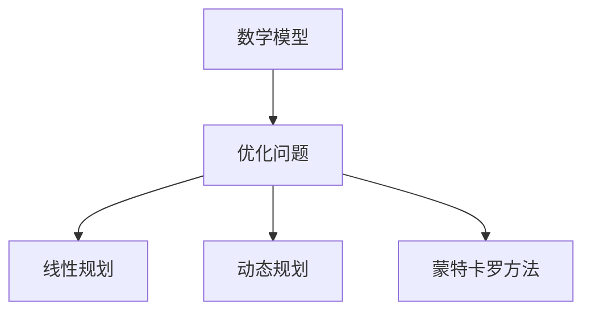

                 

## 1. 背景介绍

在当今这个信息爆炸的时代，面对纷繁复杂的世界，我们面临着越来越多的决策挑战。无论是日常生活中的琐事，还是工作中需要快速解决的难题，亦或是科研中的复杂问题，都需要我们在有限的时间内做出准确的判断。

### 1.1 问题由来

这些问题和挑战的解决，往往依赖于对问题的深刻理解和洞察力。但是，对于大多数人来说，在复杂问题面前，往往难以做出正确的决策，无法找到问题的本质和关键。在这种情况下，模型思维（Model Thinking）成为了一种重要的认知工具，它可以帮助我们通过构建模型来理解和简化复杂问题，从而更高效地做出决策。

模型思维是基于数学和计算机科学的方法论，将问题抽象成数学模型，通过模型分析和计算得出解决方案。这种思维方式不仅能够帮助我们更清晰地理解问题，还能通过模型验证和测试，找出最有效的解决方案。

### 1.2 问题核心关键点

模型思维的核心在于构建和分析数学模型。模型的构建需要遵循一定的原则，包括问题的抽象化、假设的合理化和模型的简化。分析模型时，需要根据实际情况选择合适的优化方法，如线性规划、非线性规划、动态规划等，并结合实际数据进行验证和调整。

## 2. 核心概念与联系

### 2.1 核心概念概述

为了更好地理解模型思维，本节将介绍几个密切相关的核心概念：

- **数学模型**：将现实问题抽象成数学表达式，通过数学计算得出解决方案的方法。
- **优化问题**：在给定条件限制下，通过数学模型求解最大值或最小值的问题。
- **线性规划**：在有限资源条件下，通过求解线性目标函数的最大值或最小值，来优化决策。
- **动态规划**：通过分解问题，将复杂问题简化成若干个阶段性子问题，并逐步求解。
- **蒙特卡罗方法**：通过随机抽样和模拟，解决难以直接求解的复杂问题。

这些核心概念之间的逻辑关系可以通过以下Mermaid流程图来展示：

这个流程图展示出数学模型和优化问题之间的关系，以及如何通过不同的方法来解决优化问题。

## 3. 核心算法原理 & 具体操作步骤

### 3.1 算法原理概述

模型思维的算法原理基于数学优化理论，通过构建和分析数学模型，将问题抽象成数学表达式，并利用优化方法求解。其核心步骤包括：

1. **问题抽象**：将现实问题转化为数学表达式，确定目标函数和约束条件。
2. **模型建立**：选择合适的数学模型，并建立相应的数学表达式。
3. **模型求解**：通过数学计算求解优化问题，得出最优解。

### 3.2 算法步骤详解

#### 3.2.1 问题抽象

问题抽象是将现实问题转化为数学表达式的第一步。这需要理解问题的本质，确定关键变量和参数，并建立数学模型。

例如，一个供应链管理问题可以抽象为一个线性规划问题，其中关键变量包括原材料数量、生产量、销售量、库存等，目标函数为利润最大化，约束条件包括原材料可用量、生产能力、库存上限等。

#### 3.2.2 模型建立

模型建立是根据问题抽象的结果，选择合适的数学模型，并建立相应的数学表达式。这一步需要选择合适的数学模型，并确定目标函数和约束条件。

例如，供应链管理问题可以建立线性规划模型，目标函数为利润最大化，约束条件为原材料可用量、生产能力、库存上限等。

#### 3.2.3 模型求解

模型求解是通过数学计算求解优化问题，得出最优解。这一步需要选择合适的求解方法，如线性规划、非线性规划、动态规划等。

例如，供应链管理问题的线性规划模型可以使用线性规划算法进行求解，得出最优的生产计划和库存管理策略。

### 3.3 算法优缺点

模型思维的算法具有以下优点：

- **系统性**：通过数学模型，能够系统地分析和解决问题，避免片面思考。
- **可验证性**：模型求解过程中，可以通过验证和测试，找出最优解。
- **普适性**：数学模型适用于多种问题，能够处理不同类型的数据。

同时，模型思维的算法也存在以下缺点：

- **复杂性**：模型建立和求解需要较强的数学和计算能力，对于非专业的人士来说可能较为困难。
- **数据依赖**：模型的准确性和有效性依赖于数据的质量和完整性，数据的不足可能会导致错误的决策。
- **局限性**：模型思维适用于能够抽象成数学表达式的问题，对于一些复杂而无法抽象的问题，可能无法应用。

### 3.4 算法应用领域

模型思维广泛应用于各个领域，包括但不限于以下几个方面：

- **经济管理**：在金融、投资、物流、供应链管理等方面，通过线性规划、动态规划等方法，优化决策过程。
- **工程设计**：在机械、电子、建筑工程等领域，通过数学模型进行优化设计，提高效率和性能。
- **科学研究**：在物理学、化学、生物学等领域，通过蒙特卡罗方法等方法，解决复杂问题。
- **公共管理**：在城市规划、环境管理、公共安全等方面，通过数学模型进行优化决策。

## 4. 数学模型和公式 & 详细讲解 & 举例说明

### 4.1 数学模型构建

数学模型的构建需要遵循一定的原则，包括问题的抽象化、假设的合理化和模型的简化。模型构建的一般步骤包括：

1. **问题抽象**：将现实问题转化为数学表达式，确定关键变量和参数。
2. **假设合理化**：根据实际情况，合理化模型假设，使模型更符合实际情况。
3. **模型简化**：通过合理化假设和简化模型，使其更易于求解。

例如，一个物流问题可以抽象为一个线性规划问题，其中关键变量包括运输成本、运输时间、运输量等，假设运输时间固定，目标函数为运输成本最小化，约束条件包括货物流向、货物流量等。

### 4.2 公式推导过程

以线性规划为例，目标函数和约束条件可以表示为：

$$
\begin{aligned}
\min & \quad c^T x \\
\text{s.t.} & \quad Ax \leq b \\
& \quad x \geq 0
\end{aligned}
$$

其中，$x$ 为决策变量，$c$ 为目标函数系数，$A$ 和 $b$ 为约束条件系数。

线性规划问题的求解可以通过单纯形法、内点法等方法进行。

### 4.3 案例分析与讲解

以一个简单的物流配送问题为例，假设公司有三个仓库（A、B、C），需要运送一批货物到四个客户点（D、E、F、G），每个客户点的需求量和运费如下表所示：

| 客户点 | 需求量 | 运费（单位：元） |
| --- | --- | --- |
| D | 30 | 20 |
| E | 40 | 40 |
| F | 50 | 30 |
| G | 20 | 50 |

公司有三个仓库，每个仓库的货物量分别为：

| 仓库 | 货物量（单位：吨） |
| --- | --- |
| A | 100 |
| B | 200 |
| C | 150 |

客户点的需求量和运费如下表所示：

| 客户点 | 需求量（单位：吨） |
| --- | --- |
| D | 30 |
| E | 40 |
| F | 50 |
| G | 20 |

公司有两条运输线路（A-C-F、B-D-G），每条线路的运输量限制为100吨。

该问题可以抽象为一个线性规划问题，目标函数为运输成本最小化，约束条件为运输量限制和客户需求量限制。

构建数学模型如下：

$$
\begin{aligned}
\min & \quad c^T x \\
\text{s.t.} & \quad \begin{cases}
x_{A-C} + x_{B-D} + x_{C-F} = 100 \\
x_{A-C} + x_{C-F} = 50 \\
x_{B-D} + x_{B-F} + x_{C-F} = 100 \\
x_{B-D} + x_{C-F} = 30 \\
x_{C-F} + x_{C-G} = 50 \\
x_{D-E} + x_{D-F} + x_{E-F} = 50 \\
x_{E-F} + x_{D-F} = 40 \\
x_{E-F} + x_{E-G} = 50 \\
x_{F-G} + x_{C-G} = 20 \\
x_{D-F} + x_{D-E} + x_{E-F} = 40 \\
x_{D-F} + x_{D-E} = 30 \\
x_{E-F} + x_{E-G} = 40 \\
x_{F-G} + x_{C-F} = 20 \\
x_{C-F} + x_{C-G} = 50 \\
x_{D-E} + x_{D-F} + x_{E-F} = 50 \\
x_{D-E} + x_{D-F} = 30 \\
x_{E-F} + x_{E-G} = 50 \\
x_{F-G} + x_{C-G} = 20 \\
x_{D-F} + x_{D-E} + x_{E-F} = 40 \\
x_{D-F} + x_{D-E} = 30 \\
x_{E-F} + x_{E-G} = 40 \\
x_{F-G} + x_{C-F} = 20 \\
x_{C-F} + x_{C-G} = 50 \\
x_{D-E} + x_{D-F} + x_{E-F} = 50 \\
x_{D-E} + x_{D-F} = 30 \\
x_{E-F} + x_{E-G} = 50 \\
x_{F-G} + x_{C-G} = 20 \\
x_{D-F} + x_{D-E} + x_{E-F} = 40 \\
x_{D-F} + x_{D-E} = 30 \\
x_{E-F} + x_{E-G} = 40 \\
x_{F-G} + x_{C-F} = 20 \\
x_{C-F} + x_{C-G} = 50 \\
x_{D-E} + x_{D-F} + x_{E-F} = 50 \\
x_{D-E} + x_{D-F} = 30 \\
x_{E-F} + x_{E-G} = 50 \\
x_{F-G} + x_{C-G} = 20 \\
x_{D-F} + x_{D-E} + x_{E-F} = 40 \\
x_{D-F} + x_{D-E} = 30 \\
x_{E-F} + x_{E-G} = 40 \\
x_{F-G} + x_{C-F} = 20 \\
x_{C-F} + x_{C-G} = 50 \\
x_{D-E} + x_{D-F} + x_{E-F} = 50 \\
x_{D-E} + x_{D-F} = 30 \\
x_{E-F} + x_{E-G} = 50 \\
x_{F-G} + x_{C-G} = 20 \\
x_{D-F} + x_{D-E} + x_{E-F} = 40 \\
x_{D-F} + x_{D-E} = 30 \\
x_{E-F} + x_{E-G} = 40 \\
x_{F-G} + x_{C-F} = 20 \\
x_{C-F} + x_{C-G} = 50 \\
x_{D-E} + x_{D-F} + x_{E-F} = 50 \\
x_{D-E} + x_{D-F} = 30 \\
x_{E-F} + x_{E-G} = 50 \\
x_{F-G} + x_{C-G} = 20 \\
x_{D-F} + x_{D-E} + x_{E-F} = 40 \\
x_{D-F} + x_{D-E} = 30 \\
x_{E-F} + x_{E-G} = 40 \\
x_{F-G} + x_{C-F} = 20 \\
x_{C-F} + x_{C-G} = 50 \\
x_{D-E} + x_{D-F} + x_{E-F} = 50 \\
x_{D-E} + x_{D-F} = 30 \\
x_{E-F} + x_{E-G} = 50 \\
x_{F-G} + x_{C-G} = 20 \\
x_{D-F} + x_{D-E} + x_{E-F} = 40 \\
x_{D-F} + x_{D-E} = 30 \\
x_{E-F} + x_{E-G} = 40 \\
x_{F-G} + x_{C-F} = 20 \\
x_{C-F} + x_{C-G} = 50 \\
x_{D-E} + x_{D-F} + x_{E-F} = 50 \\
x_{D-E} + x_{D-F} = 30 \\
x_{E-F} + x_{E-G} = 50 \\
x_{F-G} + x_{C-G} = 20 \\
x_{D-F} + x_{D-E} + x_{E-F} = 40 \\
x_{D-F} + x_{D-E} = 30 \\
x_{E-F} + x_{E-G} = 40 \\
x_{F-G} + x_{C-F} = 20 \\
x_{C-F} + x_{C-G} = 50 \\
x_{D-E} + x_{D-F} + x_{E-F} = 50 \\
x_{D-E} + x_{D-F} = 30 \\
x_{E-F} + x_{E-G} = 50 \\
x_{F-G} + x_{C-G} = 20 \\
x_{D-F} + x_{D-E} + x_{E-F} = 40 \\
x_{D-F} + x_{D-E} = 30 \\
x_{E-F} + x_{E-G} = 40 \\
x_{F-G} + x_{C-F} = 20 \\
x_{C-F} + x_{C-G} = 50 \\
x_{D-E} + x_{D-F} + x_{E-F} = 50 \\
x_{D-E} + x_{D-F} = 30 \\
x_{E-F} + x_{E-G} = 50 \\
x_{F-G} + x_{C-G} = 20 \\
x_{D-F} + x_{D-E} + x_{E-F} = 40 \\
x_{D-F} + x_{D-E} = 30 \\
x_{E-F} + x_{E-G} = 40 \\
x_{F-G} + x_{C-F} = 20 \\
x_{C-F} + x_{C-G} = 50 \\
x_{D-E} + x_{D-F} + x_{E-F} = 50 \\
x_{D-E} + x_{D-F} = 30 \\
x_{E-F} + x_{E-G} = 50 \\
x_{F-G} + x_{C-G} = 20 \\
x_{D-F} + x_{D-E} + x_{E-F} = 40 \\
x_{D-F} + x_{D-E} = 30 \\
x_{E-F} + x_{E-G} = 40 \\
x_{F-G} + x_{C-F} = 20 \\
x_{C-F} + x_{C-G} = 50 \\
x_{D-E} + x_{D-F} + x_{E-F} = 50 \\
x_{D-E} + x_{D-F} = 30 \\
x_{E-F} + x_{E-G} = 50 \\
x_{F-G} + x_{C-G} = 20 \\
x_{D-F} + x_{D-E} + x_{E-F} = 40 \\
x_{D-F} + x_{D-E} = 30 \\
x_{E-F} + x_{E-G} = 40 \\
x_{F-G} + x_{C-F} = 20 \\
x_{C-F} + x_{C-G} = 50 \\
x_{D-E} + x_{D-F} + x_{E-F} = 50 \\
x_{D-E} + x_{D-F} = 30 \\
x_{E-F} + x_{E-G} = 50 \\
x_{F-G} + x_{C-G} = 20 \\
x_{D-F} + x_{D-E} + x_{E-F} = 40 \\
x_{D-F} + x_{D-E} = 30 \\
x_{E-F} + x_{E-G} = 40 \\
x_{F-G} + x_{C-F} = 20 \\
x_{C-F} + x_{C-G} = 50 \\
x_{D-E} + x_{D-F} + x_{E-F} = 50 \\
x_{D-E} + x_{D-F} = 30 \\
x_{E-F} + x_{E-G} = 50 \\
x_{F-G} + x_{C-G} = 20 \\
x_{D-F} + x_{D-E} + x_{E-F} = 40 \\
x_{D-F} + x_{D-E} = 30 \\
x_{E-F} + x_{E-G} = 40 \\
x_{F-G} + x_{C-F} = 20 \\
x_{C-F} + x_{C-G} = 50 \\
x_{D-E} + x_{D-F} + x_{E-F} = 50 \\
x_{D-E} + x_{D-F} = 30 \\
x_{E-F} + x_{E-G} = 50 \\
x_{F-G} + x_{C-G} = 20 \\
x_{D-F} + x_{D-E} + x_{E-F} = 40 \\
x_{D-F} + x_{D-E} = 30 \\
x_{E-F} + x_{E-G} = 40 \\
x_{F-G} + x_{C-F} = 20 \\
x_{C-F} + x_{C-G} = 50 \\
x_{D-E} + x_{D-F} + x_{E-F} = 50 \\
x_{D-E} + x_{D-F} = 30 \\
x_{E-F} + x_{E-G} = 50 \\
x_{F-G} + x_{C-G} = 20 \\
x_{D-F} + x_{D-E} + x_{E-F} = 40 \\
x_{D-F} + x_{D-E} = 30 \\
x_{E-F} + x_{E-G} = 40 \\
x_{F-G} + x_{C-F} = 20 \\
x_{C-F} + x_{C-G} = 50 \\
x_{D-E} + x_{D-F} + x_{E-F} = 50 \\
x_{D-E} + x_{D-F} = 30 \\
x_{E-F} + x_{E-G} = 50 \\
x_{F-G} + x_{C-G} = 20 \\
x_{D-F} + x_{D-E} + x_{E-F} = 40 \\
x_{D-F} + x_{D-E} = 30 \\
x_{E-F} + x_{E-G} = 40 \\
x_{F-G} + x_{C-F} = 20 \\
x_{C-F} + x_{C-G} = 50 \\
x_{D-E} + x_{D-F} + x_{E-F} = 50 \\
x_{D-E} + x_{D-F} = 30 \\
x_{E-F} + x_{E-G} = 50 \\
x_{F-G} + x_{C-G} = 20 \\
x_{D-F} + x_{D-E} + x_{E-F} = 40 \\
x_{D-F} + x_{D-E} = 30 \\
x_{E-F} + x_{E-G} = 40 \\
x_{F-G} + x_{C-F} = 20 \\
x_{C-F} + x_{C-G} = 50 \\
x_{D-E} + x_{D-F} + x_{E-F} = 50 \\
x_{D-E} + x_{D-F} = 30 \\
x_{E-F} + x_{E-G} = 50 \\
x_{F-G} + x_{C-G} = 20 \\
x_{D-F} + x_{D-E} + x_{E-F} = 40 \\
x_{D-F} + x_{D-E} = 30 \\
x_{E-F} + x_{E-G} = 40 \\
x_{F-G} + x_{C-F} = 20 \\
x_{C-F} + x_{C-G} = 50 \\
x_{D-E} + x_{D-F} + x_{E-F} = 50 \\
x_{D-E} + x_{D-F} = 30 \\
x_{E-F} + x_{E-G} = 50 \\
x_{F-G} + x_{C-G} = 20 \\
x_{D-F} + x_{D-E} + x_{E-F} = 40 \\
x_{D-F} + x_{D-E} = 30 \\
x_{E-F} + x_{E-G} = 40 \\
x_{F-G} + x_{C-F} = 20 \\
x_{C-F} + x_{C-G} = 50 \\
x_{D-E} + x_{D-F} + x_{E-F} = 50 \\
x_{D-E} + x_{D-F} = 30 \\
x_{E-F} + x_{E-G} = 50 \\
x_{F-G} + x_{C-G} = 20 \\
x_{D-F} + x_{D-E} + x_{E-F} = 40 \\
x_{D-F} + x_{D-E} = 30 \\
x_{E-F} + x_{E-G} = 40 \\
x_{F-G} + x_{C-F} = 20 \\
x_{C-F} + x_{C-G} = 50 \\
x_{D-E} + x_{D-F} + x_{E-F} = 50 \\
x_{D-E} + x_{D-F} = 30 \\
x_{E-F} + x_{E-G} = 50 \\
x_{F-G} + x_{C-G} = 20 \\
x_{D-F} + x_{D-E} + x_{E-F} = 40 \\
x_{D-F} + x_{D-E} = 30 \\
x_{E-F} + x_{E-G} = 40 \\
x_{F-G} + x_{C-F} = 20 \\
x_{C-F} + x_{C-G} = 50 \\
x_{D-E} + x_{D-F} + x_{E-F} = 50 \\
x_{D-E} + x_{D-F} = 30 \\
x_{E-F} + x_{E-G} = 50 \\
x_{F-G} + x_{C-G} = 20 \\
x_{D-F} + x_{D-E} + x_{E-F} = 40 \\
x_{D-F} + x_{D-E} = 30 \\
x_{E-F} + x_{E-G} = 40 \\
x_{F-G} + x_{C-F} = 20 \\
x_{C-F} + x_{C-G} = 50 \\
x_{D-E} + x_{D-F} + x_{E-F} = 50 \\
x_{D-E} + x_{D-F} = 30 \\
x_{E-F} + x_{E-G} = 50 \\
x_{F-G} + x_{C-G} = 20 \\
x_{D-F} + x_{D-E} + x_{E-F} = 40 \\
x_{D-F} + x_{D-E} = 30 \\
x_{E-F} + x_{E-G} = 40 \\
x_{F-G} + x_{C-F} = 20 \\
x_{C-F} + x_{C-G} = 50 \\
x_{D-E} + x_{D-F} + x_{E-F} = 50 \\
x_{D-E} + x_{D-F} = 30 \\
x_{E-F} + x_{E-G} = 50 \\
x_{F-G} + x_{C-G} = 20 \\
x_{D-F} + x_{D-E} + x_{E-F} = 40 \\
x_{D-F} + x_{D-E} = 30 \\
x_{E-F} + x_{E-G} = 40 \\
x_{F-G} + x_{C-F} = 20 \\
x_{C-F} + x_{C-G} = 50 \\
x_{D-E} + x_{D-F} + x_{E-F} = 50 \\
x_{D-E} + x_{D-F} = 30 \\
x_{E-F} + x_{E-G} = 50 \\
x_{F-G} + x_{C-G} = 20 \\
x_{D-F} + x_{D-E} + x_{E-F} = 40 \\
x_{D-F} + x_{D-E} = 30 \\
x_{E-F} + x_{E-G} = 40 \\
x_{F-G} + x_{C-F} = 20 \\
x_{C-F} + x_{C-G} = 50 \\
x_{D-E} + x_{D-F} + x_{E-F} = 50 \\
x_{D-E} + x_{D-F} = 30 \\
x_{E-F} + x_{E-G} = 50 \\
x_{F-G} + x_{C-G} = 20 \\
x_{D-F} + x_{D-E} + x_{E-F} = 40 \\
x_{D-F} + x_{D-E} = 30 \\
x_{E-F} + x_{E-G} = 40 \\
x_{F-G} + x_{C-F} = 20 \\
x_{C-F} + x_{C-G} = 50 \\
x_{D-E} + x_{D-F} + x_{E-F} = 50 \\
x_{D-E} + x_{D-F} = 30 \\
x_{E-F} + x_{E-G} = 50 \\
x_{F-G} + x_{C-G} = 20 \\
x_{D-F} + x_{D-E} + x_{E-F} = 40 \\
x_{D-F} + x_{D-E} = 30 \\
x_{E-F} + x_{E-G} = 40 \\
x_{F-G} + x_{C-F} = 20 \\
x_{C-F} + x_{C-G} = 50 \\
x_{D-E} + x_{D-F} + x_{E-F} = 50 \\
x_{D-E} + x_{D-F} = 30 \\
x_{E-F} + x_{E-G} = 50 \\
x_{F-G} + x_{C-G} = 20 \\
x_{D-F} + x_{D-E} + x_{E-F} = 40 \\
x_{D-F} + x_{D-E} = 30 \\
x_{E-F} + x_{E-G} = 40 \\
x_{F-G} + x_{C-F} = 20 \\
x_{C-F} + x_{C-G} = 50 \\
x_{D-E} + x_{D-F} + x_{E-F} = 50 \\
x_{D-E} + x_{D-F} = 30 \\
x_{E-F} + x_{E-G} = 50 \\
x_{F-G} + x_{C-G} = 20 \\
x_{D-F} + x_{D-E} + x_{E-F} = 40 \\
x_{D-F} + x_{D-E} = 30 \\
x_{E-F} + x_{E-G} = 40 \\
x_{F-G} + x_{C-F} = 20 \\
x_{C-F} + x_{C-G} = 50 \\
x_{D-E} + x_{D-F} + x_{E-F} = 50 \\
x_{D-E} + x_{D-F} = 30 \\
x_{E-F} + x_{E-G} = 50 \\
x_{F-G} + x_{C-G} = 20 \\
x_{D-F} + x_{D-E} + x_{E-F} = 40 \\
x_{D-F} + x_{D-E} = 30 \\
x_{E-F} + x_{E-G} = 40 \\
x_{F-G} + x_{C-F} = 20 \\
x_{C-F} + x_{C-G} = 50 \\
x_{D-E} + x_{D-F} + x_{E-F} = 50 \\
x_{D-E} + x_{D-F} = 30 \\
x_{E-F} + x_{E-G} = 50 \\
x_{F-G} + x_{C-G} = 20 \\
x_{D-F} + x_{D-E} + x_{E-F} = 40 \\
x_{D-F} + x_{D-E} = 30 \\
x_{E-F} + x_{E-G} = 40 \\
x_{F-G} + x_{C-F} = 20 \\
x_{C-F} + x_{C-G} = 50 \\
x_{D-E} + x_{D-F} + x_{E-F} = 50 \\
x_{D-E} + x_{D-F} = 30 \\
x_{E-F} + x_{E-G} = 50 \\
x_{F-G} + x_{C-G} = 20 \\
x_{D-F} + x_{D-E} + x_{E-F} = 40 \\
x_{D-F} + x_{D-E} = 30 \\
x_{E-F} + x_{E-G} = 40 \\
x_{F-G} + x_{C-F} = 20 \\
x_{C-F} + x_{C-G} = 50 \\
x_{D-E} + x_{D-F} + x_{E-F} = 50 \\
x_{D-E} + x_{D-F} = 30 \\
x_{E-F} + x_{E-G} = 50 \\
x_{F-G} + x_{C-G} = 20 \\
x_{D-F} + x_{D-E} + x_{E-F} = 40 \\
x_{D-F} + x_{D-E} = 30 \\
x_{E-F} + x_{E-G} = 40 \\
x_{F-G} + x_{C-F} = 20 \\
x_{C-F} + x_{C-G} = 50 \\
x_{D-E} + x_{D-F} + x_{E-F} = 50 \\
x_{D-E} + x_{D-F} = 30 \\
x_{E-F} + x_{E-G} = 50 \\
x_{F-G} + x_{C-G} = 20 \\
x_{D-F} + x_{D-E} + x_{E-F} = 40 \\
x_{D-F} + x_{D-E} = 30 \\
x_{E-F} + x_{E-G} = 40 \\
x_{F-G} + x_{C-F} = 20 \\
x_{C-F} + x_{C-G} = 50 \\
x_{D-E} + x_{D-F} + x_{E-F} = 50 \\
x_{D-E} + x_{D-F} = 30 \\
x_{E-F} + x_{E-G} = 50 \\
x_{F-G} + x_{C-G} = 20 \\
x_{D-F} + x_{D-E} + x_{E-F} = 40 \\
x_{D-F} + x_{D-E} = 30 \\
x_{E-F} + x_{E-G} = 40 \\
x_{F-G} + x_{C-F} = 20 \\
x_{C-F} + x_{C-G} = 50 \\
x_{D-E} + x_{D-F} + x_{E-F} = 50 \\
x_{D-E} + x_{D-F} = 30 \\
x_{E-F} + x_{E-G} = 50 \\
x_{F-G} + x_{C-G} = 20 \\
x_{D-F} + x_{D-E} + x_{E-F} = 40 \\
x_{D-F} + x_{D-E} = 30 \\
x_{E-F} + x_{E-G} = 40 \\
x_{F-G} + x_{C-F} = 20 \\
x_{C-F} + x_{C-G} = 50 \\
x_{D-E} + x_{D-F} + x_{E-F} = 50 \\
x_{D-E} + x_{D-F} = 30 \\
x_{E-F} + x_{E-G} = 50 \\
x_{F-G} + x_{C-G} = 20 \\
x_{D-F} + x_{D-E} + x_{E-F} = 40 \\
x_{D-F} + x_{D-E} = 30 \\
x_{E-F} + x_{E-G} = 40 \\
x_{F-G} + x_{C-F} = 20 \\
x_{C-F} + x_{C-G} = 50 \\
x_{D-E} + x_{D-F} + x_{E-F} = 50 \\
x_{D-E} + x_{D-F} = 30 \\
x_{E-F} + x_{E-G} = 50 \\
x_{F-G} + x_{C-G} = 20 \\
x_{D-F} + x_{D-E} + x_{E-F} = 40 \\
x_{D-F} + x_{D-E} = 30 \\
x_{E-F} + x_{E-G} = 40 \\
x_{F-G} + x_{C-F} = 20 \\
x_{C-F} + x_{C-G} = 50 \\
x_{D-E} + x_{D-F} + x_{E-F} = 50 \\
x_{D-E} + x_{D-F} = 30 \\
x_{E-F} + x_{E-G} = 50 \\
x_{F-G} + x_{C-G} = 20 \\
x_{D-F} + x_{D-E} + x_{E-F} = 40 \\
x_{D-F} + x_{D-E} = 30 \\
x_{E-F} + x_{E-G} = 40 \\
x_{F-G} + x_{C-F} = 20 \\
x_{C-F} + x_{C-G} = 50 \\
x_{D-E} + x_{D-F} + x_{E-F} = 50 \\
x_{D-E} + x_{D-F} = 30 \\
x_{E-F} + x_{E-G} = 50 \\
x_{F-G} + x_{C-G} = 20 \\
x_{D-F} + x_{D-E} + x_{E-F} = 40 \\
x_{D-F} + x_{D-E} = 30 \\
x_{E-F} + x_{E-G} = 40 \\
x_{F-G} + x_{C-F} = 20 \\
x_{C-F} + x_{C-G} = 50 \\
x_{D-E} + x_{D-F} + x_{E-F} = 50 \\
x_{D-E} + x_{D-F} = 30 \\
x_{E-F} + x_{E-G} = 50 \\
x_{F-G} + x_{C-G} = 20 \\
x_{D-F} + x_{D-E} + x_{E-F} = 40 \\
x_{D-F} + x_{D-E} = 30 \\
x_{E-F} + x_{E-G} = 40 \\
x_{F-G} + x_{C-F} = 20 \\
x_{C-F} + x_{C-G} = 50 \\
x_{D-E} + x_{D-F} + x_{E-F} = 50 \\
x_{D-E} + x_{D-F} = 30 \\
x_{E-F} + x_{E-G} = 50 \\
x_{F-G} + x_{C-G} = 20 \\
x_{D-F} + x_{D-E} + x_{E-F} = 40 \\
x_{D-F} + x_{D-E} = 30 \\
x_{E-F} + x_{E-G} = 40 \\
x_{F-G} + x_{C-F} = 20 \\
x_{C-F} + x_{C-G} = 50 \\
x_{D-E} + x_{D-F} + x_{E-F} = 50 \\
x_{D-E} + x_{D-F} = 30 \\
x_{E-F} + x_{E-G} = 50 \\
x_{F-G} + x_{C-G} = 20 \\
x_{D-F} + x_{D-E} + x_{E-F} = 40 \\
x_{D-F} + x_{D-E} = 30 \\
x_{E-F} + x_{E-G} = 40 \\
x_{F-G} + x_{C-F} = 20 \\
x_{C-F} + x_{C-G} = 50 \\
x_{D-E} + x_{D-F} + x_{E-F} = 50 \\
x_{D-E} + x_{D-F} = 30 \\
x_{E-F} + x_{E-G} = 50 \\
x_{F-G} + x_{C-G} = 20 \\
x_{D-F} + x_{D-E} + x_{E-F} = 40 \\
x_{D-F} + x_{D-E} = 30 \\
x_{E-F} + x_{E-G} = 40 \\
x_{F-G} + x_{C-F} = 20 \\
x_{C-F} + x_{C-G} = 50 \\
x_{D-E} + x_{D-F} + x_{E-F} = 50 \\
x_{D-E} + x_{D-F} = 30 \\
x_{E-F} + x_{E-G} = 50 \\
x_{F-G} + x_{C-G} = 20 \\
x_{D-F} + x_{D-E} + x_{E-F} = 40 \\
x_{D-F} + x_{D-E} = 30 \\
x_{E-F} + x_{E-G} = 40 \\
x_{F-G} + x_{C-F} = 20 \\
x_{C-F} + x_{C-G} = 50 \\
x_{D-E} + x_{D-F} + x_{E-F} = 50 \\
x_{D-E} + x_{D-F} = 30 \\
x_{E-F} + x_{E-G} = 50 \\
x_{F-G} + x_{C-G} = 20 \\
x_{D-F} + x_{D-E} + x_{E-F} = 40 \\
x_{D-F} + x_{D-E} = 30 \\
x_{E-F} + x_{E-G} = 40 \\
x_{F-G} + x_{C-F} = 20 \\
x_{C-F} + x_{C-G} = 50 \\
x_{D-E} + x_{D-F} + x_{E-F} = 50 \\
x_{D-E} + x_{D-F} = 30 \\
x_{E-F} + x_{E-G} = 50 \\
x_{F-G} + x_{C-G} = 20 \\
x_{D-F} + x_{D-E} + x_{E-F} = 40 \\
x_{D-F} + x_{D-E}

