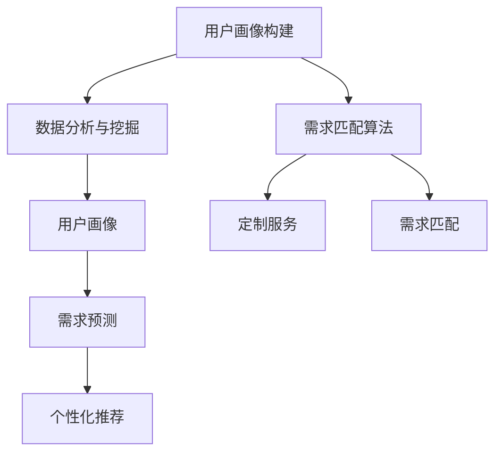

                 

# 欲望个性化算法：AI定制的需求满足策略

> 关键词：欲望个性化, 需求满足, 人工智能, 定制服务, 算法优化

## 1. 背景介绍

### 1.1 问题由来
在当今数字化、智能化的时代背景下，消费者对于产品和服务的需求日趋多样化和个性化。传统的大规模制造模式已经无法满足这一需求。以AI技术为核心的定制化生产、个性化服务成为了未来发展的方向。如何高效、精确地理解消费者的需求，并为其提供定制化的产品和服务，成为各个行业都在探索的问题。

### 1.2 问题核心关键点
欲望个性化算法的核心在于深度挖掘和理解消费者的个性化需求，通过高效算法实现个性化产品和服务的高效定制和交付。其核心点包括：

- 数据分析与挖掘：通过数据挖掘技术，发现消费者隐含的需求和偏好。
- 用户画像构建：综合多维度数据，构建详尽的用户画像。
- 需求匹配算法：基于用户画像，构建高效的需求匹配算法，实现个性化定制。
- 算法优化与评估：不断优化算法性能，确保定制服务的高效和准确。

## 2. 核心概念与联系

### 2.1 核心概念概述

为更好地理解欲望个性化算法的核心思想，本节将介绍几个关键概念：

- **欲望个性化**：指针对每个消费者的个性化需求，提供定制化的产品和服务。这需要深度理解消费者的心理、行为和偏好。
- **需求匹配算法**：指通过算法模型，将消费者的个性化需求与合适的产品或服务进行匹配。这一过程需要高效、准确的算法支持。
- **用户画像**：指通过数据分析和机器学习技术，构建详尽的用户特征模型，描述消费者的偏好、行为、历史记录等。
- **算法优化与评估**：指不断优化算法性能，确保定制服务的高效和准确。这包括模型训练、参数调整、数据更新等环节。

这些概念之间存在着紧密的联系，通过高效的数据分析和算法优化，能够准确匹配消费者的需求，实现个性化的定制服务。

### 2.2 核心概念原理和架构的 Mermaid 流程图



这个流程图展示了欲望个性化算法的核心流程：

1. **用户画像构建**：通过收集和分析用户的各项数据，如浏览记录、购买历史、社交媒体行为等，构建详尽的用户画像。
2. **数据分析与挖掘**：利用机器学习算法，从数据中挖掘出消费者的隐含需求和偏好。
3. **需求匹配算法**：基于用户画像和需求分析结果，构建高效的需求匹配算法，实现个性化定制。
4. **个性化推荐**：根据匹配结果，为用户推荐符合其需求的定制化产品和服务。
5. **定制服务**：根据推荐结果，提供定制化的产品和服务，满足消费者的需求。

## 3. 核心算法原理 & 具体操作步骤
### 3.1 算法原理概述

欲望个性化算法主要依赖数据驱动的机器学习和深度学习技术，通过构建用户画像、需求分析、个性化推荐等环节，实现对消费者需求的深度理解和高效定制。

算法核心思想是将消费者的各种行为数据进行聚类、分类、预测等处理，构建出详尽的用户画像，然后通过高效匹配算法，将个性化需求与合适的产品或服务匹配，最终实现定制化服务。

### 3.2 算法步骤详解

欲望个性化算法的实现步骤包括：

**Step 1: 数据收集与预处理**
- 收集用户的多维数据，包括浏览记录、购买历史、社交媒体行为等。
- 对数据进行清洗、去重、归一化等预处理，确保数据质量。

**Step 2: 用户画像构建**
- 利用机器学习算法，对用户数据进行聚类、分类等处理，构建详尽的用户画像。
- 用户画像通常包括用户的偏好、行为模式、兴趣等特征。

**Step 3: 需求分析与挖掘**
- 使用深度学习模型，如神经网络、强化学习等，对用户数据进行挖掘，提取消费者的隐含需求和偏好。
- 需求分析需要考虑到消费者的心理和行为特征，构建出详尽的需求模型。

**Step 4: 需求匹配算法设计**
- 基于用户画像和需求模型，设计高效的需求匹配算法。
- 需求匹配算法需要考虑多维度数据的组合，以实现精准匹配。

**Step 5: 个性化推荐**
- 根据匹配结果，为用户推荐符合其需求的定制化产品和服务。
- 推荐系统通常采用协同过滤、基于内容的推荐等方法。

**Step 6: 定制服务交付**
- 根据推荐结果，提供定制化的产品和服务，满足消费者的需求。
- 定制服务需要考虑生产效率、物流成本等因素。

### 3.3 算法优缺点

欲望个性化算法具有以下优点：
1. 高效匹配：通过高效算法，能够快速实现个性化需求与合适产品或服务的匹配。
2. 精准推荐：深度挖掘消费者的需求，提供精准的个性化推荐。
3. 动态调整：算法可以动态更新，适应消费者需求的变化。
4. 提升满意度：提供定制化的服务，满足消费者的个性化需求，提升满意度。

同时，该算法也存在一些局限性：
1. 数据依赖：算法的性能依赖于数据的质量和完整性，数据不足或质量不佳会影响效果。
2. 隐私风险：收集和分析用户数据可能涉及隐私问题，需要严格遵守数据保护法规。
3. 计算复杂：深度学习模型需要大量的计算资源，可能在实时性上存在瓶颈。
4. 模型解释：深度学习模型的复杂性可能导致其决策过程难以解释，影响用户的信任度。

### 3.4 算法应用领域

欲望个性化算法已经在多个领域得到了应用，如电商、旅游、医疗、教育等。

- **电商**：根据消费者的浏览记录、购买历史等数据，为其推荐个性化商品，提升销售额。
- **旅游**：根据消费者的旅行偏好、历史记录等，为其推荐个性化的旅游路线和目的地。
- **医疗**：根据患者的病史、基因信息等，为其推荐个性化的治疗方案。
- **教育**：根据学生的学习习惯、成绩等，为其推荐个性化的学习资源和辅导方案。

## 4. 数学模型和公式 & 详细讲解 & 举例说明

### 4.1 数学模型构建

欲望个性化算法涉及的数学模型包括：

- **用户画像构建**：多维度数据聚类算法，如K-means、层次聚类等。
- **需求分析与挖掘**：深度学习模型，如神经网络、长短时记忆网络（LSTM）等。
- **需求匹配算法**：协同过滤算法、基于内容的推荐算法等。

以协同过滤算法为例，其数学模型可以表示为：

$$
\text{推荐} = \mathbf{u}^T \mathbf{v} + \text{偏差项} + \text{噪声项}
$$

其中，$\mathbf{u}$ 和 $\mathbf{v}$ 分别是用户和物品的特征向量，偏差项和噪声项用于平滑预测误差。

### 4.2 公式推导过程

以下是协同过滤算法的详细推导过程：

**Step 1: 用户-物品矩阵构建**
假设用户集合为 $U$，物品集合为 $I$，用户对物品的评分矩阵为 $\mathbf{R} \in \mathbb{R}^{n \times m}$，其中 $n$ 为用户数量，$m$ 为物品数量。

**Step 2: 用户特征提取**
将用户特征 $\mathbf{u}_i \in \mathbb{R}^k$ 和物品特征 $\mathbf{v}_j \in \mathbb{R}^k$ 作为输入，构建用户-物品评分预测模型：

$$
\hat{R}_{i,j} = \mathbf{u}_i^T \mathbf{v}_j
$$

**Step 3: 协同过滤算法**
根据预测评分 $\hat{R}_{i,j}$，为每个用户推荐评分最高的 $k$ 个物品。推荐物品的评分阈值 $\theta$ 可以根据业务需求进行调整。

**Step 4: 模型评估**
利用均方误差等指标对协同过滤模型进行评估，不断优化模型参数，提高预测准确率。

### 4.3 案例分析与讲解

以亚马逊的个性化推荐系统为例，其核心算法便是协同过滤算法。亚马逊通过收集用户的浏览记录、购买历史等数据，构建详尽的用户画像和物品特征，然后使用协同过滤算法为用户推荐个性化商品，显著提升了用户的购买转化率和满意度。

## 5. 项目实践：代码实例和详细解释说明
### 5.1 开发环境搭建

在进行项目实践前，我们需要准备好开发环境。以下是使用Python进行项目开发的环境配置流程：

1. 安装Anaconda：从官网下载并安装Anaconda，用于创建独立的Python环境。

2. 创建并激活虚拟环境：
```bash
conda create -n recommendation-env python=3.8 
conda activate recommendation-env
```

3. 安装相关依赖库：
```bash
pip install pandas numpy scikit-learn torch torchvision transformers
```

4. 安装协同过滤推荐系统的库：
```bash
pip install surprise
```

完成上述步骤后，即可在`recommendation-env`环境中开始项目实践。

### 5.2 源代码详细实现

以下是使用Surprise库实现协同过滤算法的代码示例：

```python
from surprise import Dataset, Reader, SVD, accuracy
from surprise.model_selection import cross_validate

# 读取数据集
reader = Reader(rating_scale=(1, 5))
data = Dataset.load_from_df(df, reader)

# 训练模型
algo = SVD()
results = cross_validate(algo, data, measures=['RMSE', 'MAE'], cv=5, verbose=True)

# 输出评估结果
for result in results:
    print(result)

# 预测推荐
user_id = 1
item_ids = [2, 3, 4, 5]
predictions = algo.predict(user_id, item_ids)
for pred in predictions:
    print(pred)
```

### 5.3 代码解读与分析

让我们再详细解读一下关键代码的实现细节：

**Dataset类**：
- `load_from_df`方法：将数据框转换为Surprise支持的格式，供算法使用。

**SVD算法**：
- 使用SVD算法，对用户-物品评分矩阵进行预测。
- 通过交叉验证，评估模型的均方根误差（RMSE）和平均绝对误差（MAE）。

**cross_validate函数**：
- 使用交叉验证，评估模型的预测效果。
- 设置交叉验证次数为5，输出评估结果。

**predict方法**：
- 预测用户对指定物品的评分。
- 根据预测结果，输出推荐物品。

### 5.4 运行结果展示

运行上述代码，即可得到模型的评估结果和预测推荐。

## 6. 实际应用场景
### 6.1 电商个性化推荐

在电商领域，欲望个性化算法可以显著提升用户的购物体验和购买转化率。通过收集用户的浏览记录、购买历史等数据，构建详尽的用户画像，然后利用协同过滤算法为用户推荐个性化商品，可以显著提升销售额和用户满意度。

### 6.2 旅游定制化服务

旅游行业需要提供个性化的定制服务，以满足消费者的多样化需求。通过分析消费者的旅行偏好、历史记录等数据，构建详尽的用户画像，然后利用深度学习模型预测消费者的潜在需求，为其推荐个性化的旅游路线和目的地，可以显著提升旅游体验和用户满意度。

### 6.3 医疗个性化治疗

在医疗领域，欲望个性化算法可以提供个性化的治疗方案，提高治疗效果和患者满意度。通过分析患者的病史、基因信息等数据，构建详尽的患者画像，然后利用深度学习模型预测治疗效果，为其推荐个性化的治疗方案，可以显著提升治疗效果和患者满意度。

## 7. 工具和资源推荐
### 7.1 学习资源推荐

为了帮助开发者系统掌握欲望个性化算法的理论基础和实践技巧，这里推荐一些优质的学习资源：

1. 《深度学习推荐系统》系列博文：由深度学习专家撰写，深入浅出地介绍了推荐系统的基本原理和实现方法，包括协同过滤、基于内容的推荐等。

2. CS229《机器学习》课程：斯坦福大学开设的经典课程，系统讲解了机器学习的基本概念和算法，是推荐系统的入门必读。

3. 《推荐系统实战》书籍：全面介绍了推荐系统的实现细节，包括数据预处理、模型训练、推荐算法等，是推荐系统的实战指南。

4. Surprise官方文档：Surprise库的官方文档，提供了丰富的推荐算法示例和详细的使用指南，是推荐系统的学习资源。

5. Kaggle推荐系统竞赛：参与Kaggle推荐系统竞赛，通过实际项目积累推荐系统的经验，提升技术能力。

通过对这些资源的学习实践，相信你一定能够快速掌握欲望个性化算法的精髓，并用于解决实际的推荐问题。

### 7.2 开发工具推荐

高效的开发离不开优秀的工具支持。以下是几款用于欲望个性化算法开发的常用工具：

1. Python：基于Python的开源推荐系统框架，灵活高效，易于调试。
2. Surprise：Python中的推荐系统库，提供了多种推荐算法和评估方法，易于使用。
3. NumPy：高效的数值计算库，支持多维数组操作和矩阵运算。
4. Pandas：数据分析工具，支持数据清洗、预处理和分析。
5. Scikit-learn：机器学习库，支持多种数据挖掘和分析算法。

合理利用这些工具，可以显著提升欲望个性化算法的开发效率，加快创新迭代的步伐。

### 7.3 相关论文推荐

欲望个性化算法的发展源于学界的持续研究。以下是几篇奠基性的相关论文，推荐阅读：

1. "Collaborative Filtering for Implicit Feedback Datasets"：介绍协同过滤算法的经典论文，奠定了推荐系统的基础。
2. "Item-based Collaborative Filtering Recommendation Algorithms"：详细讨论了基于物品的协同过滤算法，适用于小样本数据集。
3. "A Survey of Collaborative Filtering Technique"：综述了多种协同过滤算法，介绍了其原理和应用场景。
4. "Context-Aware Collaborative Filtering"：讨论了基于上下文的协同过滤算法，提高了推荐系统的准确性和鲁棒性。
5. "Deep Collaborative Filtering"：引入深度学习技术，提升了协同过滤算法的表现力和适应性。

这些论文代表了大语言模型微调技术的发展脉络。通过学习这些前沿成果，可以帮助研究者把握学科前进方向，激发更多的创新灵感。

## 8. 总结：未来发展趋势与挑战

### 8.1 总结

本文对欲望个性化算法的核心原理和操作步骤进行了全面系统的介绍。首先阐述了欲望个性化算法的研究背景和应用意义，明确了算法在提升个性化服务效果、优化资源配置等方面的独特价值。其次，从原理到实践，详细讲解了算法设计的关键步骤，给出了项目开发的完整代码实例。同时，本文还广泛探讨了算法在电商、旅游、医疗等多个行业领域的应用前景，展示了算法的广泛应用潜力。此外，本文精选了算法的各类学习资源，力求为读者提供全方位的技术指引。

通过本文的系统梳理，可以看到，欲望个性化算法在提升消费者体验、优化资源配置等方面具有重要意义。未来，伴随深度学习技术的发展，欲望个性化算法有望在更多领域得到应用，为各行业带来变革性影响。

### 8.2 未来发展趋势

展望未来，欲望个性化算法将呈现以下几个发展趋势：

1. 多模态数据融合：将多模态数据（如文本、图像、语音）进行融合，提升个性化推荐的准确性和适应性。
2. 跨领域知识迁移：将不同领域的知识进行迁移，提升推荐系统的通用性和泛化能力。
3. 实时个性化服务：利用实时数据进行个性化服务，提升用户体验和系统响应速度。
4. 增强用户反馈：引入用户反馈机制，不断优化推荐系统，提升推荐效果。
5. 深度学习与强化学习结合：结合深度学习和强化学习技术，提升推荐系统的自适应性和鲁棒性。
6. 模型解释与可信性：提升推荐系统的透明性和可信性，增强用户的信任度和满意度。

以上趋势凸显了欲望个性化算法的广阔前景。这些方向的探索发展，必将进一步提升推荐系统的性能和应用范围，为消费者带来更优质的个性化服务体验。

### 8.3 面临的挑战

尽管欲望个性化算法已经取得了显著成果，但在迈向更加智能化、普适化应用的过程中，它仍面临着诸多挑战：

1. 数据隐私问题：收集和分析用户数据可能涉及隐私问题，需要严格遵守数据保护法规。
2. 数据质量问题：数据质量对算法的性能影响巨大，需要采取有效措施保证数据质量。
3. 模型复杂性：深度学习模型通常较为复杂，需要大量的计算资源，可能在实时性上存在瓶颈。
4. 模型解释性：深度学习模型的复杂性可能导致其决策过程难以解释，影响用户的信任度。
5. 多模态数据整合：多模态数据的整合和融合，需要考虑数据格式、特征抽取等复杂问题。

这些挑战需要研究人员和开发者共同应对，不断优化算法设计和数据处理策略，提升算法的可靠性和可用性。

### 8.4 研究展望

面对欲望个性化算法面临的挑战，未来的研究需要在以下几个方面寻求新的突破：

1. 数据隐私保护：研究如何在使用数据时保护用户隐私，如差分隐私、联邦学习等技术。
2. 数据质量提升：研究如何通过数据清洗、数据增强等方法提升数据质量，确保算法的稳定性和准确性。
3. 模型实时优化：研究如何通过增量学习、在线学习等方法实现模型的实时优化，提升推荐系统的实时性和适应性。
4. 多模态数据融合：研究如何利用多模态数据进行融合，提升推荐系统的准确性和多样性。
5. 模型解释与可信性：研究如何提升推荐系统的透明性和可信性，增强用户的信任度和满意度。

这些研究方向的探索，必将引领欲望个性化算法迈向更高的台阶，为各行业带来更优质的个性化服务体验。

## 9. 附录：常见问题与解答

**Q1：欲望个性化算法如何处理多模态数据？**

A: 多模态数据的融合可以通过特征嵌入、特征融合等方法实现。首先，将不同模态的数据转化为统一的特征空间，然后利用机器学习算法进行融合，得到综合特征向量。例如，在电商推荐系统中，可以同时考虑用户的浏览记录、购买历史和社交媒体行为，通过特征嵌入将其转化为统一的特征向量，再进行推荐。

**Q2：欲望个性化算法如何处理冷启动问题？**

A: 冷启动问题是指新用户或新物品没有历史数据，难以进行推荐。可以采用以下方法：
1. 利用用户特征进行推荐：根据新用户的基本信息（如年龄、性别等）进行推荐，如KNN推荐算法。
2. 利用物品特征进行推荐：根据新物品的相似物品进行推荐，如基于内容的推荐算法。
3. 利用协同过滤算法：通过新物品的相似物品进行推荐，如基于物品的协同过滤算法。

**Q3：欲望个性化算法的性能如何评估？**

A: 欲望个性化算法的性能通常通过以下几个指标进行评估：
1. 准确率（Accuracy）：正确推荐的比例。
2. 召回率（Recall）：实际相关物品中被推荐的比例。
3. 精确率（Precision）：被推荐的相关物品中正确的比例。
4. 均方根误差（RMSE）：预测评分与实际评分之间的平均误差。
5. 平均绝对误差（MAE）：预测评分与实际评分之间的平均绝对误差。

**Q4：欲望个性化算法如何在实际应用中优化？**

A: 实际应用中，可以通过以下方法优化欲望个性化算法：
1. 数据清洗与预处理：对数据进行清洗、去重、归一化等预处理，确保数据质量。
2. 特征工程：提取有用的特征，构建详尽的用户画像和物品特征。
3. 模型选择与优化：选择合适的推荐算法，不断调整模型参数，优化模型性能。
4. 用户反馈机制：引入用户反馈机制，不断优化推荐系统。
5. 实时数据处理：利用实时数据进行个性化服务，提升用户体验和系统响应速度。

这些优化方法可以帮助提升欲望个性化算法的性能和效果，确保其在实际应用中的稳定性和可靠性。

---

作者：禅与计算机程序设计艺术 / Zen and the Art of Computer Programming

