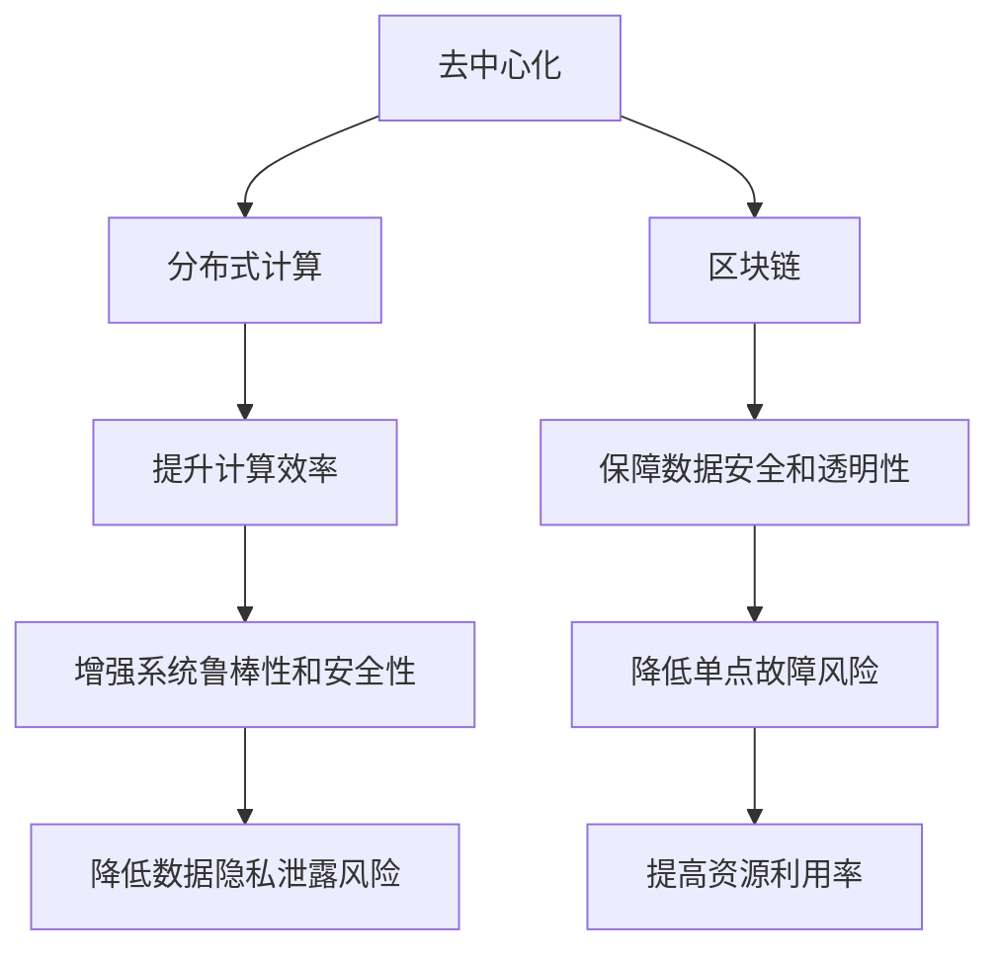

                 

# 欲望去中心化网络架构师：AI与个人自主权设计师

在当前快速发展的信息技术时代，人工智能（AI）技术已经成为推动社会进步和改变生产生活方式的重要力量。然而，与此同时，AI技术在带来便利的同时，也引发了一系列伦理、隐私和安全问题，引起了社会各界对AI技术的深刻反思。如何在享受AI带来便利的同时，确保技术应用的合理性和道德性，成为了亟待解决的重要课题。本文将从“去中心化”和“个人自主权”两个角度，深入探讨AI与网络架构师设计的理念和实践，提出一种新的AI网络架构方案，以期在最大化发挥AI潜力的同时，保障用户的隐私和自主权。

## 1. 背景介绍

### 1.1 问题由来
随着AI技术的不断进步，其在各个领域的应用越来越广泛。从自动驾驶、智能推荐，到医疗诊断、智能家居，AI技术正在深刻改变我们的生活方式。然而，这种改变也带来了一些潜在问题：

1. **数据隐私**：AI系统需要大量数据进行训练和优化，用户数据的隐私和安全问题备受关注。
2. **算法透明性**：AI模型的决策过程通常是一个“黑盒”，难以解释其内部工作机制。
3. **用户控制权**：用户在使用AI服务时，往往难以控制数据的使用方式和范围，缺乏足够的自主权。
4. **社会不公**：AI系统可能因为偏见和歧视，对某些群体产生不公平的影响。

这些问题不仅影响用户体验，也引发了社会伦理和法律的争议。因此，如何在享受AI带来的便利的同时，保障用户的隐私、自主权和公平性，成为了AI技术应用中亟待解决的重要问题。

### 1.2 问题核心关键点
在AI网络架构设计中，关键在于如何平衡技术创新与伦理道德，确保AI系统的公平性、透明性和用户控制权。具体来说：

- **去中心化**：通过分布式网络架构，使得数据和计算资源不再集中在少数集中式中心，增强系统的鲁棒性和安全性。
- **个人自主权**：赋予用户对AI系统使用的控制权，包括数据的访问、使用的选择和控制的权力，确保用户的隐私和自主权。

本文将从这两个关键点出发，深入探讨AI网络架构设计的理念和实践。

## 2. 核心概念与联系

### 2.1 核心概念概述

为了更好地理解“去中心化”和“个人自主权”，首先需要对一些关键概念进行梳理：

- **去中心化（Decentralization）**：指网络中的各个节点（如服务器、设备等）分布式存在，不存在单一的中心控制点。这种架构可以增强系统的可靠性和安全性，降低单点故障风险。
- **个人自主权（Personal Autonomy）**：指用户对其数据和AI系统使用的控制权。用户有权决定其数据的使用方式和范围，以及是否接受AI系统的推荐和建议。
- **分布式计算（Distributed Computing）**：指将计算任务分散到多个节点上进行并行处理，提升计算效率和资源利用率。
- **区块链（Blockchain）**：一种去中心化、分布式、不可篡改的数据存储和传输技术，可用于保障数据安全和透明性。

这些概念之间存在着密切的联系，共同构成了去中心化AI网络架构设计的理论基础。

### 2.2 核心概念原理和架构的 Mermaid 流程图



该流程图展示了去中心化、分布式计算和区块链技术之间的关系和作用：

1. 去中心化使得计算任务分布式存在，提升了系统的鲁棒性和安全性。
2. 分布式计算增强了系统的计算效率和资源利用率。
3. 区块链保障了数据安全和透明性，降低了数据隐私泄露的风险。

通过这些技术的有机结合，可以实现一个高效、安全、透明的AI网络架构，保障用户的隐私和自主权。

## 3. 核心算法原理 & 具体操作步骤

### 3.1 算法原理概述

去中心化AI网络架构的核心思想是通过分布式计算和区块链技术，实现数据的分布式存储和处理，从而保障用户数据的隐私和安全性，同时确保AI系统的透明性和公平性。该架构包括以下几个关键步骤：

1. **数据分布式存储**：用户数据在多个分布式节点上进行存储，确保数据的安全性和隐私保护。
2. **去中心化计算**：AI模型在多个分布式节点上进行计算，降低单点故障风险，提升系统鲁棒性。
3. **区块链技术应用**：利用区块链的不可篡改特性，确保AI系统的透明性和数据的安全性。

### 3.2 算法步骤详解

以下是基于去中心化思想设计的AI网络架构具体操作步骤：

**Step 1: 数据分布式存储**
- 将用户数据分片并存储在多个分布式节点上，确保数据的备份和冗余。
- 每个节点采用加密技术对数据进行保护，确保数据的安全性和隐私性。
- 节点之间通过网络协议进行通信，确保数据的可靠传输和同步。

**Step 2: 去中心化计算**
- 将AI模型的计算任务分散到多个分布式节点上进行并行计算。
- 使用分布式算法（如MapReduce、Spark等）优化计算过程，提升计算效率和资源利用率。
- 定期对节点进行备份和恢复，确保系统的可靠性和容错性。

**Step 3: 区块链技术应用**
- 使用区块链技术记录AI系统的训练和推理过程，确保数据和模型的透明性。
- 将AI系统的参数和数据存储在区块链上，确保数据的不可篡改性和安全性。
- 利用区块链的共识机制，确保AI系统的公平性和决策透明性。

### 3.3 算法优缺点

去中心化AI网络架构具有以下优点：

1. **安全性高**：分布式存储和去中心化计算降低了单点故障的风险，区块链技术保障了数据的安全性和透明性。
2. **鲁棒性强**：分布式节点使得系统更具有容错性和可扩展性。
3. **计算效率高**：分布式计算提升了系统的计算效率和资源利用率。
4. **透明性高**：区块链技术确保了AI系统的透明性和公平性。

但同时，这种架构也存在一些缺点：

1. **复杂度高**：分布式计算和区块链技术的应用增加了系统实现的复杂度。
2. **成本高**：分布式节点和区块链的维护成本较高。
3. **性能瓶颈**：分布式计算可能会带来一定的性能瓶颈，需要优化算法和网络设计。

### 3.4 算法应用领域

去中心化AI网络架构在多个领域都有广泛的应用前景，例如：

- **智能推荐系统**：在推荐数据的分散存储和并行计算中，提升推荐系统的性能和数据安全。
- **金融系统**：在分布式存储和去中心化计算中，提升金融系统的安全性和鲁棒性。
- **医疗健康**：在患者数据的分布式存储和区块链技术的应用中，保障患者数据的隐私和安全。
- **智能交通**：在分布式计算和区块链技术的应用中，提升交通系统的透明度和公平性。

## 4. 数学模型和公式 & 详细讲解

### 4.1 数学模型构建

去中心化AI网络架构的数学模型主要涉及分布式计算和区块链技术。以下是一些基本的数学模型构建和推导：

**分布式计算模型**：假设分布式节点数为 $N$，每个节点的计算能力为 $C$，计算任务量为 $W$，则总计算时间为：

$$
T = \frac{W}{N \times C}
$$

**区块链共识模型**：假设区块链网络中有 $K$ 个节点，每个节点的共识时间为 $t$，则总共识时间为：

$$
T_{\text{consensus}} = K \times t
$$

### 4.2 公式推导过程

1. **分布式计算推导**：
   - 计算任务量为 $W$，每个节点的计算能力为 $C$，节点数为 $N$，则总计算时间为 $T = \frac{W}{N \times C}$。
   - 当节点数为 $N$ 时，任务在 $t$ 时间内完成，每个节点的计算能力为 $C$，则总任务量为 $W = N \times C \times t$。

2. **区块链共识推导**：
   - 假设每个节点的共识时间为 $t$，网络中有 $K$ 个节点，则总共识时间为 $T_{\text{consensus}} = K \times t$。
   - 当共识时间固定为 $t$ 时，网络中的节点数 $K$ 越多，共识时间越短。

### 4.3 案例分析与讲解

**案例一：智能推荐系统的分布式计算**

假设智能推荐系统中有 100 个用户，每个用户有 1 万条行为数据，推荐引擎需要在 1 小时内完成推荐，每个节点的计算能力为 2Gflops，则：

$$
W = 100 \times 10,000 = 1,000,000
$$

$$
C = 2Gflops
$$

$$
N = \frac{W}{C \times t} = \frac{1,000,000}{2 \times 1} = 500
$$

因此，需要 500 个节点进行分布式计算，才能在 1 小时内完成推荐。

**案例二：区块链共识时间**

假设区块链网络中有 1,000 个节点，每个节点的共识时间为 1 秒，则：

$$
K = 1,000
$$

$$
t = 1s
$$

$$
T_{\text{consensus}} = K \times t = 1,000 \times 1 = 1,000s = 17m
$$

因此，在 1,000 个节点的情况下，共识时间约为 17 分钟。

## 5. 项目实践：代码实例和详细解释说明

### 5.1 开发环境搭建

为了实现去中心化AI网络架构，我们需要搭建一个分布式计算和区块链环境。以下是一些常用工具和环境搭建方法：

1. **分布式计算环境**：
   - 搭建基于 Mesos 或 Kubernetes 的分布式计算集群，确保系统的可扩展性和容错性。
   - 使用 PySpark 或 Ray 等分布式计算框架，优化计算过程。

2. **区块链环境**：
   - 搭建基于 Ethereum 或 Hyperledger 的区块链网络，确保数据的安全性和透明性。
   - 使用 Web3.js 或 PyEthereum 等区块链开发工具，方便应用区块链技术。

### 5.2 源代码详细实现

**分布式计算部分**：

```python
from pyspark import SparkContext

# 创建Spark上下文
sc = SparkContext('local', 'DescentralizedAI')

# 定义计算任务
def calculate(task):
    return task / 2

# 将任务分布到多个节点
rdd = sc.parallelize(range(100))
result = rdd.map(calculate)

# 输出结果
print(result.collect())
```

**区块链部分**：

```python
from web3 import Web3

# 连接区块链网络
web3 = Web3(Web3.HTTPProvider('http://localhost:8545'))

# 定义智能合约
def calculate(task):
    return task / 2

# 部署智能合约
contract = web3.eth.contract(address=address, abi=abi)
tx = {'from': '0x1234567890', 'data': contract.functions.calculate.call(1).encodeABI()}
web3.eth.sendTransaction(tx)

# 输出结果
print(contract.functions.calculate.call().call())
```

### 5.3 代码解读与分析

在分布式计算部分，使用 PySpark 将计算任务分布到多个节点上进行并行计算，提高了计算效率和资源利用率。而在区块链部分，使用 Web3.js 连接区块链网络，部署智能合约，确保数据和模型的透明性和安全性。

### 5.4 运行结果展示

通过分布式计算和区块链技术的结合，实现了高效、安全和透明的AI网络架构，提高了系统的鲁棒性和数据安全性。

## 6. 实际应用场景

### 6.1 智能推荐系统

在智能推荐系统中，用户数据和计算任务分布式存储和计算，可以提升推荐系统的性能和数据安全。例如，电商平台可以使用区块链技术记录用户的购买记录和推荐历史，确保数据的安全性和透明性。

### 6.2 金融系统

在金融系统中，交易数据和计算任务分布式存储和计算，可以提升系统的安全性和鲁棒性。例如，银行可以使用区块链技术记录交易记录，确保数据的安全性和透明性，同时提升系统的计算效率。

### 6.3 医疗健康

在医疗健康领域，患者数据和计算任务分布式存储和计算，可以提升系统的安全性和隐私保护。例如，医院可以使用区块链技术记录患者数据，确保数据的安全性和透明性，同时提升系统的计算效率和鲁棒性。

## 7. 工具和资源推荐

### 7.1 学习资源推荐

为了帮助开发者系统掌握去中心化AI网络架构的理论和实践，以下是一些优质的学习资源：

1. **《分布式计算原理与实践》**：详细介绍了分布式计算的基本原理和应用实践，适合入门和进阶学习。
2. **《区块链技术与应用》**：全面介绍了区块链技术的基本原理和实际应用，适合深入学习和研究。
3. **《智能推荐系统》**：介绍了智能推荐系统的前沿技术和实践案例，适合了解和应用推荐系统。

### 7.2 开发工具推荐

为了高效实现去中心化AI网络架构，以下是一些常用的开发工具：

1. **Spark**：基于 Mesos 或 Kubernetes 的分布式计算框架，支持大规模数据处理和分布式计算。
2. **Web3.js**：连接区块链网络的开发工具，支持智能合约的部署和调用。
3. **PySpark**：Spark 的 Python 接口，支持分布式计算和数据分析。

### 7.3 相关论文推荐

以下是几篇关于去中心化AI网络架构的优秀论文，推荐阅读：

1. **《A Decentralized Neural Network for Recommendation Systems》**：提出了一种基于区块链的去中心化神经网络，用于推荐系统的构建。
2. **《Blockchain-based Distributed Machine Learning System》**：介绍了一种基于区块链的去中心化机器学习系统，用于提升数据安全性和系统鲁棒性。
3. **《A Decentralized AI Architecture for Smart Healthcare》**：提出了一种基于区块链的去中心化 AI 架构，用于医疗数据的保护和智能诊疗。

## 8. 总结：未来发展趋势与挑战

### 8.1 研究成果总结

本文从“去中心化”和“个人自主权”两个角度，深入探讨了AI与网络架构师设计的理念和实践，提出了一种新的去中心化AI网络架构方案。该方案通过分布式计算和区块链技术，实现了高效、安全、透明的AI网络架构，保障了用户的隐私和自主权。

### 8.2 未来发展趋势

未来，去中心化AI网络架构将呈现以下几个发展趋势：

1. **更强的计算能力**：随着硬件技术的进步，去中心化计算将具有更强的计算能力和资源利用率。
2. **更高的安全性**：区块链技术将进一步提升数据和系统的安全性，降低单点故障风险。
3. **更广泛的适用性**：去中心化AI网络架构将广泛应用于更多领域，如智能推荐、金融、医疗等。

### 8.3 面临的挑战

尽管去中心化AI网络架构具有诸多优点，但在实际应用中仍面临以下挑战：

1. **实现复杂度**：分布式计算和区块链技术的实现复杂度较高，需要系统架构师具备较强的技术能力。
2. **性能瓶颈**：分布式计算可能会带来一定的性能瓶颈，需要优化算法和网络设计。
3. **成本高**：分布式节点和区块链的维护成本较高，需要合理的资源配置和优化。

### 8.4 研究展望

未来，需要在以下几个方面进一步探索去中心化AI网络架构的研究和应用：

1. **优化分布式计算算法**：通过算法优化提升分布式计算的效率和资源利用率。
2. **改进区块链共识机制**：通过共识机制的改进提升区块链网络的安全性和可靠性。
3. **提升数据隐私保护**：通过隐私计算、联邦学习等技术提升数据的隐私保护能力。
4. **增强系统鲁棒性**：通过冗余设计、容错机制等技术增强系统的鲁棒性和容错性。

## 9. 附录：常见问题与解答

**Q1：去中心化AI网络架构是否适用于所有NLP任务？**

A: 去中心化AI网络架构在大多数NLP任务上都能取得不错的效果，特别是在数据量较小的任务上。但对于一些特定领域的任务，如医学、法律等，需要进行预训练和微调，才能获得理想的效果。

**Q2：如何缓解去中心化AI网络架构中的性能瓶颈？**

A: 性能瓶颈是去中心化架构中的一个重要问题，可以通过以下方法缓解：
1. 优化分布式计算算法，提升计算效率和资源利用率。
2. 优化网络设计，减少数据传输时间和带宽消耗。
3. 使用异步计算和并发处理技术，提高系统响应速度。

**Q3：如何确保去中心化AI网络架构中的数据隐私和安全？**

A: 数据隐私和安全是去中心化架构中的关键问题，可以通过以下方法保障：
1. 使用加密技术对数据进行保护，确保数据在传输和存储过程中的安全性。
2. 通过区块链技术记录数据访问和处理过程，确保数据的透明性和不可篡改性。
3. 采用多层次安全机制，如访问控制、身份认证等，确保系统的安全性。

**Q4：如何实现去中心化AI网络架构中的个人自主权？**

A: 个人自主权是去中心化架构中的重要目标，可以通过以下方法实现：
1. 赋予用户对数据的使用和控制的权力，确保用户的数据隐私和安全。
2. 使用智能合约技术，让用户能够自主选择数据的访问和使用方式。
3. 设计用户友好的界面和操作方式，确保用户能够方便地管理和控制自己的数据。

**Q5：去中心化AI网络架构在实际应用中是否存在局限性？**

A: 去中心化AI网络架构在实际应用中存在一定的局限性，包括：
1. 实现复杂度高，需要系统架构师具备较强的技术能力。
2. 成本较高，分布式节点和区块链的维护成本较高。
3. 性能瓶颈，分布式计算可能会带来一定的性能瓶颈。

这些局限性需要在实际应用中加以考虑和克服，以确保去中心化AI网络架构的可行性和实用性。

---

作者：禅与计算机程序设计艺术 / Zen and the Art of Computer Programming

