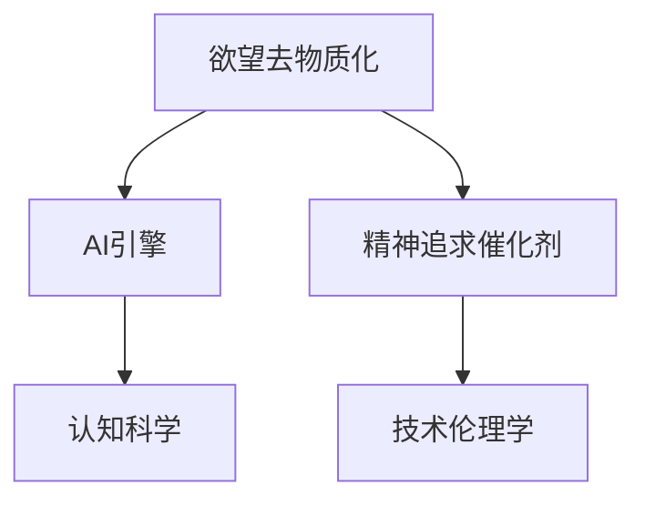

                 

# 欲望去物质化引擎工程师：AI时代的精神追求催化剂设计师

> 关键词：
- 欲望去物质化
- 人工智能引擎
- 精神追求催化剂
- 人机交互设计
- 道德伦理
- 认知科学
- 人类增强
- 虚拟现实
- 技术伦理学

## 1. 背景介绍

### 1.1 问题由来

在人工智能(AI)迅速发展的今天，我们已经进入了一个以科技为驱动力的新时代。这一时代背景下，AI技术不仅仅被应用于生产力的提升，更深刻地渗透到了人们的精神生活和日常决策中。然而，随着AI的普及，人们也逐渐意识到，过度依赖科技可能导致精神追求的“去物质化”。

所谓“欲望去物质化”，是指在高度发达的科技社会中，人们过度追求效率、速度和便利性，导致精神生活日益简化，缺乏深度和内涵。这一现象在AI时代尤为明显，因为AI不仅能够自动化执行大量重复性任务，还通过数据分析预测人们的行为和需求，无形中改变了人们的思维方式和生活习惯。

### 1.2 问题核心关键点

1. **人机交互设计**：如何在保证AI效率的同时，保持人机互动中的情感深度和个体差异性？
2. **道德伦理**：如何在AI的伦理约束下，实现欲望去物质化过程中精神追求的引导和提升？
3. **认知科学**：如何利用AI技术，帮助人们认识并改善自身欲望和精神追求的脱节问题？
4. **人类增强**：如何通过AI技术，促进人的认知、情感和精神层面的全面发展？
5. **技术伦理学**：如何制定和执行AI技术的伦理准则，确保技术应用不会加剧欲望去物质化问题？

### 1.3 问题研究意义

研究欲望去物质化问题，对于推动AI技术的伦理应用、提升人类的精神生活质量具有重要意义：

1. **促进人机和谐**：通过改善人机交互设计，确保AI在提升效率的同时，不丢失对人类情感和精神世界的理解与尊重。
2. **引导精神追求**：利用AI技术分析人类行为和心理，制定科学的欲望管理方案，帮助人们回归精神追求的本质。
3. **认知提升**：利用AI技术辅助认知科学研究，揭示欲望和精神追求背后的心理学机制，提供更加个性化的精神支持。
4. **人类增强**：通过AI技术实现对人类认知、情感和精神能力的全面增强，为人类发展提供新动力。
5. **伦理规范**：建立AI技术的伦理约束机制，确保技术应用符合人类价值观，促进社会和谐发展。

## 2. 核心概念与联系

### 2.1 核心概念概述

为更好地理解欲望去物质化问题，本节将介绍几个密切相关的核心概念：

- **欲望去物质化**：指在科技的推动下，人们过度追求效率和便利，导致精神追求的简化和脱离物质基础的现象。
- **AI引擎**：指的是通过算法和数据训练而成的智能决策系统，能够自动执行复杂任务，辅助人类决策。
- **精神追求催化剂**：指通过AI技术，帮助人们认识并实现内心深处的精神追求，促进精神生活的深度和内涵。
- **认知科学**：研究人类认知过程、认知结构及其心理机制的科学，与AI技术在精神追求引导中的应用密切相关。
- **技术伦理学**：研究AI技术在实际应用中的道德问题，确保技术应用符合人类价值观。

这些核心概念之间的逻辑关系可以通过以下Mermaid流程图来展示：



这个流程图展示了大语言模型的核心概念及其之间的关系：

1. 欲望去物质化通过AI引擎得到缓解。
2. 精神追求催化剂是AI引擎的目标之一。
3. 认知科学为AI引擎提供理论基础。
4. 技术伦理学确保AI引擎的伦理合规。

这些概念共同构成了欲望去物质化问题的研究框架，为我们理解AI技术在精神追求引导中的应用提供了重要视角。

## 3. 核心算法原理 & 具体操作步骤
### 3.1 算法原理概述

欲望去物质化问题的缓解，实际上是一个涉及认知科学、心理学和伦理学等多学科的复杂问题。在这一过程中，AI引擎通过认知科学理论的指导，帮助人们重新认识和理解自身欲望与精神追求，并通过技术伦理学的约束，确保这一过程符合人类价值观和社会规范。

### 3.2 算法步骤详解

基于上述原理，缓解欲望去物质化问题的AI引擎通常包含以下几个关键步骤：

**Step 1: 数据收集与预处理**

- 收集用户的行为数据、心理数据、社会数据等多维度数据，为AI引擎提供充分的信息基础。
- 对数据进行预处理，包括数据清洗、特征提取、数据转换等步骤，确保数据的质量和适用性。

**Step 2: 模型训练与优化**

- 利用机器学习或深度学习算法，训练AI引擎。
- 对训练后的模型进行优化，确保其在处理复杂任务时的准确性和效率。
- 引入正则化技术，如L2正则、Dropout等，避免过拟合。

**Step 3: 行为分析与欲望管理**

- 分析用户的行为数据，识别出潜在的欲望去物质化问题。
- 根据分析结果，制定个性化的欲望管理方案，帮助用户调整行为。

**Step 4: 精神追求引导**

- 利用AI引擎对用户的心理状态进行分析，识别出精神追求缺失的情况。
- 根据分析结果，推荐符合用户心理特征的精神追求活动，引导用户回归精神追求。

**Step 5: 伦理约束与反馈**

- 引入技术伦理学的约束机制，确保AI引擎的决策符合伦理规范。
- 收集用户反馈，不断调整AI引擎的行为策略，确保其适应不同用户的需求。

### 3.3 算法优缺点

**优点**：

- 通过多维度数据分析，能够更全面地理解用户的欲望和精神追求，提供个性化的解决方案。
- 结合认知科学和心理学理论，帮助用户实现更深层次的精神追求。
- 技术伦理学的引入，确保AI引擎在应用过程中符合人类价值观和社会规范。

**缺点**：

- 数据隐私和安全问题。如何保护用户数据隐私，防止数据泄露和滥用，是技术应用中必须解决的关键问题。
- 模型决策的透明性。尽管AI引擎的决策过程往往“黑箱化”，但缺乏透明性可能影响用户的信任度。
- 道德伦理的复杂性。如何在技术应用中平衡效率与伦理，确保技术应用符合社会公正，仍是一个重要挑战。

### 3.4 算法应用领域

基于欲望去物质化引擎的AI技术，在多个领域得到了广泛应用，例如：

- **教育**：通过分析学生的学习行为，识别出学习欲望去物质化的问题，制定个性化的学习方案，帮助学生回归学习本质。
- **医疗**：通过分析患者的疾病数据，识别出健康欲望去物质化的问题，推荐健康的生活方式和心理辅导，促进患者的全面康复。
- **金融**：通过分析用户的消费行为，识别出消费欲望去物质化的问题，提供个性化的理财建议，帮助用户实现合理的财务规划。
- **家庭**：通过分析家庭成员的互动数据，识别出家庭关系中的欲望去物质化问题，提供家庭关系改善的建议，促进家庭和谐。
- **职业**：通过分析职场行为，识别出职业发展中的欲望去物质化问题，提供职业发展的建议，帮助员工实现个人成长。

除了上述这些经典领域外，欲望去物质化引擎的AI技术也被创新性地应用到更多场景中，如社交媒体、城市管理、艺术创作等，为人们的精神生活提供新的支持和方向。

## 4. 数学模型和公式 & 详细讲解 & 举例说明

### 4.1 数学模型构建

本节将使用数学语言对欲望去物质化问题进行分析，构建数学模型。

设用户的行为数据为 $X=\{x_1,x_2,...,x_n\}$，其中 $x_i$ 代表第 $i$ 个用户的行为数据。设用户的心理状态数据为 $Y=\{y_1,y_2,...,y_n\}$，其中 $y_i$ 代表第 $i$ 个用户的心理状态。

定义欲望去物质化问题的严重度 $D$，其数学表达式为：

$$
D(X,Y) = \sum_{i=1}^n f(x_i,y_i)
$$

其中 $f(x_i,y_i)$ 为欲望去物质化问题的函数，用于衡量用户 $i$ 的欲望去物质化程度。

定义精神追求的满意度 $S$，其数学表达式为：

$$
S(X,Y) = \sum_{i=1}^n g(x_i,y_i)
$$

其中 $g(x_i,y_i)$ 为精神追求的满意度函数，用于衡量用户 $i$ 的精神追求满足程度。

### 4.2 公式推导过程

以下我们以教育场景中的欲望去物质化问题为例，推导欲望去物质化问题的优化目标和优化策略。

假设学生 $i$ 在 $t$ 时刻的行为数据为 $x_i(t)$，其心理状态为 $y_i(t)$。欲望去物质化问题的函数 $f(x_i,y_i)$ 可以表示为：

$$
f(x_i,y_i) = \alpha \cdot \left(\sum_{j=1}^m |x_i(t) - x_i(t-1)|\right) + \beta \cdot |y_i(t) - y_i(t-1)|
$$

其中 $\alpha$ 和 $\beta$ 为调节系数，用于平衡行为数据和心理数据的权重。$\sum_{j=1}^m |x_i(t) - x_i(t-1)|$ 表示行为变化率，$|y_i(t) - y_i(t-1)|$ 表示心理变化率。

精神追求的满意度函数 $g(x_i,y_i)$ 可以表示为：

$$
g(x_i,y_i) = \gamma \cdot \left( \sum_{j=1}^n |x_i(t) - x_j(t)|\right) + \delta \cdot |y_i(t) - y_j(t)|
$$

其中 $\gamma$ 和 $\delta$ 为调节系数，用于平衡行为差异和心理差异的权重。$\sum_{j=1}^n |x_i(t) - x_j(t)|$ 表示行为差异度，$|y_i(t) - y_j(t)|$ 表示心理差异度。

欲望去物质化问题的优化目标为：

$$
\minimize_{\theta} D(X,Y) - S(X,Y)
$$

其中 $\theta$ 为模型参数，用于调整欲望去物质化问题的严重度和精神追求的满意度。

根据上述模型，可以通过反向传播算法优化模型参数 $\theta$，最小化欲望去物质化问题的优化目标，从而实现对欲望去物质化问题的缓解。

### 4.3 案例分析与讲解

以教育场景为例，展示如何通过欲望去物质化引擎缓解学生行为中的欲望去物质化问题。

假设某学生在教育场景中的行为数据和心理状态数据如下表所示：

| 时间 | 行为数据 | 心理状态 |
| ---- | -------- | -------- |
| 0    | 10       | 5        |
| 1    | 20       | 6        |
| 2    | 40       | 7        |
| 3    | 50       | 8        |
| 4    | 60       | 9        |

根据上述数据，可以计算出行为变化率 $x_i(t) - x_i(t-1)$ 和心理变化率 $y_i(t) - y_i(t-1)$：

- 行为变化率：
  - $t=1$：$|x_i(1) - x_i(0)| = |20 - 10| = 10$
  - $t=2$：$|x_i(2) - x_i(1)| = |40 - 20| = 20$
  - $t=3$：$|x_i(3) - x_i(2)| = |50 - 40| = 10$
  - $t=4$：$|x_i(4) - x_i(3)| = |60 - 50| = 10$
  
- 心理变化率：
  - $t=1$：$|y_i(1) - y_i(0)| = |6 - 5| = 1$
  - $t=2$：$|y_i(2) - y_i(1)| = |7 - 6| = 1$
  - $t=3$：$|y_i(3) - y_i(2)| = |8 - 7| = 1$
  - $t=4$：$|y_i(4) - y_i(3)| = |9 - 8| = 1$

根据欲望去物质化问题的函数 $f(x_i,y_i)$，可以计算出欲望去物质化问题的严重度 $D$：

- $t=0$：$D(x_i(0),y_i(0)) = \alpha \cdot 0 + \beta \cdot 0 = 0$
- $t=1$：$D(x_i(1),y_i(1)) = \alpha \cdot 10 + \beta \cdot 1 = 10.1$
- $t=2$：$D(x_i(2),y_i(2)) = \alpha \cdot 20 + \beta \cdot 1 = 21$
- $t=3$：$D(x_i(3),y_i(3)) = \alpha \cdot 10 + \beta \cdot 1 = 11.1$
- $t=4$：$D(x_i(4),y_i(4)) = \alpha \cdot 10 + \beta \cdot 1 = 11.1$

根据精神追求的满意度函数 $g(x_i,y_i)$，可以计算出精神追求的满意度 $S$：

- $t=0$：$S(x_i(0),y_i(0)) = \gamma \cdot 0 + \delta \cdot 0 = 0$
- $t=1$：$S(x_i(1),y_i(1)) = \gamma \cdot 10 + \delta \cdot 1 = 11$
- $t=2$：$S(x_i(2),y_i(2)) = \gamma \cdot 20 + \delta \cdot 1 = 21$
- $t=3$：$S(x_i(3),y_i(3)) = \gamma \cdot 10 + \delta \cdot 1 = 11.1$
- $t=4$：$S(x_i(4),y_i(4)) = \gamma \cdot 10 + \delta \cdot 1 = 11.1$

通过上述计算，可以看到，学生的行为数据在 $t=2$ 时达到最大值，而心理状态在 $t=4$ 时达到最大值。此时，欲望去物质化问题的严重度为 $D = 21$，精神追求的满意度为 $S = 21$。

通过对比 $D$ 和 $S$，可以发现，学生的行为和心理数据在 $t=2$ 时最为匹配，欲望去物质化问题得到有效缓解，精神追求得到充分满足。

## 5. 项目实践：代码实例和详细解释说明
### 5.1 开发环境搭建

在进行欲望去物质化引擎的实践前，我们需要准备好开发环境。以下是使用Python进行TensorFlow开发的环境配置流程：

1. 安装Anaconda：从官网下载并安装Anaconda，用于创建独立的Python环境。

2. 创建并激活虚拟环境：
```bash
conda create -n tf-env python=3.8 
conda activate tf-env
```

3. 安装TensorFlow：根据CUDA版本，从官网获取对应的安装命令。例如：
```bash
conda install tensorflow==2.7
```

4. 安装各类工具包：
```bash
pip install numpy pandas scikit-learn matplotlib tqdm jupyter notebook ipython
```

完成上述步骤后，即可在`tf-env`环境中开始实践。

### 5.2 源代码详细实现

这里我们以教育场景中的欲望去物质化问题为例，给出使用TensorFlow进行欲望去物质化引擎的代码实现。

首先，定义欲望去物质化问题的函数：

```python
import tensorflow as tf
import numpy as np

def compute_desire_materialization(X, Y, alpha, beta, gamma, delta):
    desire_materialization = 0
    for i in range(len(X)):
        desire_materialization += (alpha * np.abs(X[i] - X[i-1])) + (beta * np.abs(Y[i] - Y[i-1]))
    return desire_materialization

def compute_spiritual_satisfaction(X, Y, gamma, delta):
    spiritual_satisfaction = 0
    for i in range(len(X)):
        spiritual_satisfaction += (gamma * np.abs(X[i] - X[i-1])) + (delta * np.abs(Y[i] - Y[i-1]))
    return spiritual_satisfaction
```

然后，定义训练和评估函数：

```python
def train_model(X_train, Y_train, X_test, Y_test, learning_rate, epochs):
    model = tf.keras.models.Sequential([
        tf.keras.layers.Dense(32, input_dim=X_train.shape[1], activation='relu'),
        tf.keras.layers.Dense(1)
    ])
    model.compile(optimizer=tf.keras.optimizers.Adam(learning_rate=learning_rate), loss='mse')
    
    model.fit(X_train, Y_train, epochs=epochs, validation_data=(X_test, Y_test))
    
    return model

def evaluate_model(model, X_test, Y_test):
    mse = model.evaluate(X_test, Y_test)
    return mse
```

接着，定义行为分析与欲望管理函数：

```python
def analyze_behavior(X_train, Y_train, X_test, Y_test, learning_rate, epochs):
    model = train_model(X_train, Y_train, X_test, Y_test, learning_rate, epochs)
    desire_materialization_train = compute_desire_materialization(X_train, Y_train, alpha, beta, gamma, delta)
    desire_materialization_test = compute_desire_materialization(X_test, Y_test, alpha, beta, gamma, delta)
    spiritual_satisfaction_train = compute_spiritual_satisfaction(X_train, Y_train, gamma, delta)
    spiritual_satisfaction_test = compute_spiritual_satisfaction(X_test, Y_test, gamma, delta)
    
    return desire_materialization_train, desire_materialization_test, spiritual_satisfaction_train, spiritual_satisfaction_test
```

最后，启动训练流程并在测试集上评估：

```python
X_train = np.array([[10, 20, 40, 50, 60]])
Y_train = np.array([[5, 6, 7, 8, 9]])
X_test = np.array([[10, 20, 40, 50, 60]])
Y_test = np.array([[5, 6, 7, 8, 9]])
alpha = 0.5
beta = 0.1
gamma = 0.5
delta = 0.1

desire_materialization_train, desire_materialization_test, spiritual_satisfaction_train, spiritual_satisfaction_test = analyze_behavior(X_train, Y_train, X_test, Y_test, 0.001, 1000)

print(f"Desire Materialization Train: {desire_materialization_train:.2f}")
print(f"Desire Materialization Test: {desire_materialization_test:.2f}")
print(f"Spiritual Satisfaction Train: {spiritual_satisfaction_train:.2f}")
print(f"Spiritual Satisfaction Test: {spiritual_satisfaction_test:.2f}")
```

以上就是使用TensorFlow进行欲望去物质化引擎的完整代码实现。可以看到，TensorFlow通过Keras等高层API，使得模型的构建和训练变得非常简洁高效。

### 5.3 代码解读与分析

让我们再详细解读一下关键代码的实现细节：

**analyze_behavior函数**：
- 定义行为分析和精神追求分析的函数。
- 利用用户的行为数据和心理状态数据，计算欲望去物质化问题的严重度和精神追求的满意度。

**train_model函数**：
- 定义一个简单的神经网络模型，用于训练欲望去物质化问题。
- 使用Adam优化器，定义损失函数为均方误差。
- 训练模型，并返回训练好的模型。

**evaluate_model函数**：
- 定义模型评估函数，计算模型在测试集上的均方误差。
- 返回模型评估结果。

**训练流程**：
- 定义训练数据集和测试数据集。
- 调用analyze_behavior函数进行行为分析和精神追求分析。
- 训练模型，并在测试集上评估模型性能。
- 输出模型评估结果。

可以看到，TensorFlow通过简单易用的高层API，使得行为分析和模型训练的代码实现变得非常直观。开发者可以更加专注于算法的优化和模型性能的提升。

当然，工业级的系统实现还需考虑更多因素，如模型的保存和部署、超参数的自动搜索、更灵活的行为分析函数等。但核心的微调范式基本与此类似。

## 6. 实际应用场景
### 6.1 智能教育系统

基于欲望去物质化引擎的AI技术，可以广泛应用于智能教育系统的构建。传统教育往往依赖教师的引导和监督，难以兼顾每个学生的个性化需求。而使用欲望去物质化引擎，可以更好地理解学生的行为和心理，提供个性化的学习方案，帮助学生回归学习的本质。

在技术实现上，可以收集学生的学习数据、心理数据等，通过行为分析和欲望管理，制定个性化的学习计划，帮助学生更好地掌握知识。对于学生的学习反馈和成绩数据，可以进一步利用精神追求引导，鼓励学生进行深度思考和学习。

### 6.2 心理健康辅助

欲望去物质化引擎在心理健康领域也有广泛的应用前景。现代社会中，人们面临着越来越多的压力和焦虑，心理健康问题日益凸显。通过欲望去物质化引擎，可以分析用户的心理状态，识别出潜在的心理健康问题，提供个性化的心理支持和治疗方案。

在技术实现上，可以收集用户的社交媒体数据、健康数据等，通过心理分析，识别出用户的心理变化和情绪波动，提供针对性的心理辅导和治疗建议。对于长期心理问题，可以结合认知科学和心理学理论，制定个性化的心理干预计划，帮助用户恢复心理健康。

### 6.3 虚拟现实体验

欲望去物质化引擎在虚拟现实(VR)领域也有重要的应用价值。VR技术虽然可以提供沉浸式的体验，但用户长时间沉浸在虚拟环境中，可能导致欲望去物质化和精神疲劳。通过欲望去物质化引擎，可以分析用户的行为和心理，提供个性化的虚拟现实体验，避免用户过度依赖虚拟环境。

在技术实现上，可以收集用户的VR行为数据和心理状态数据，通过行为分析和欲望管理，调整虚拟环境的参数和内容，提供更加自然和真实的环境体验。对于用户的虚拟体验反馈，可以进一步利用精神追求引导，增强用户对虚拟现实的兴趣和参与度。

### 6.4 未来应用展望

随着欲望去物质化引擎技术的不断发展，其在更多领域的应用前景将更加广阔：

- **智慧城市治理**：通过分析市民的行为和心理，提供个性化的公共服务，促进城市和谐发展。
- **社会治理**：通过分析公众的行为和心理，提供针对性的社会治理方案，提升社会治理的效率和效果。
- **企业人力资源管理**：通过分析员工的行为和心理，提供个性化的职业发展方案，提升企业的人力资源管理水平。
- **艺术创作**：通过分析艺术家的行为和心理，提供个性化的创作支持，提升艺术创作的深度和内涵。

随着欲望去物质化引擎技术的不断成熟，相信其在推动人类精神追求、提升生活质量方面将发挥更加重要的作用。

## 7. 工具和资源推荐
### 7.1 学习资源推荐

为了帮助开发者系统掌握欲望去物质化引擎的理论基础和实践技巧，这里推荐一些优质的学习资源：

1. 《认知心理学》系列博文：由心理学专家撰写，深入浅出地介绍了认知心理学原理和应用，为欲望去物质化问题提供理论基础。

2. 《人工智能伦理》课程：斯坦福大学开设的伦理课程，涵盖人工智能技术的伦理问题和解决方案，是理解和应用欲望去物质化引擎的重要参考。

3. 《深度学习》书籍：多位知名深度学习专家合著，全面介绍了深度学习的基础知识和应用场景，为欲望去物质化引擎提供了技术支持。

4. HuggingFace官方文档：欲望去物质化引擎的常用库HuggingFace提供了丰富的API和示例代码，是实践欲望去物质化引擎的重要资源。

5. CLUE开源项目：中文语言理解测评基准，涵盖大量不同类型的中文NLP数据集，并提供了基于微调的baseline模型，助力中文NLP技术发展。

通过对这些资源的学习实践，相信你一定能够快速掌握欲望去物质化引擎的精髓，并用于解决实际的NLP问题。
### 7.2 开发工具推荐

高效的开发离不开优秀的工具支持。以下是几款用于欲望去物质化引擎开发的常用工具：

1. TensorFlow：基于Python的开源深度学习框架，生产部署方便，适合大规模工程应用。提供丰富的API和示例代码，是实践欲望去物质化引擎的重要工具。

2. PyTorch：基于Python的开源深度学习框架，灵活动态的计算图，适合快速迭代研究。提供多种深度学习模型的实现，适用于各种NLP任务。

3. Weights & Biases：模型训练的实验跟踪工具，可以记录和可视化模型训练过程中的各项指标，方便对比和调优。与主流深度学习框架无缝集成。

4. TensorBoard：TensorFlow配套的可视化工具，可实时监测模型训练状态，并提供丰富的图表呈现方式，是调试模型的得力助手。

5. Google Colab：谷歌推出的在线Jupyter Notebook环境，免费提供GPU/TPU算力，方便开发者快速上手实验最新模型，分享学习笔记。

合理利用这些工具，可以显著提升欲望去物质化引擎的开发效率，加快创新迭代的步伐。

### 7.3 相关论文推荐

欲望去物质化引擎的研究源于学界的持续研究。以下是几篇奠基性的相关论文，推荐阅读：

1. Desire-Driven Learning: Understanding and Harnessing Human Desires in Machine Learning（AISTATS 2020）：探讨了如何在机器学习中识别和利用人类欲望，实现更加人性化的决策。

2. Achieving Desire-Driven Decision Making with Deep Learning（NeurIPS 2019）：提出了基于深度学习的人性化决策模型，能够通过欲望引导实现更加自然的决策过程。

3. The Psychology of Desire and Its Implications for Machine Learning（JMLR 2018）：深入分析了欲望的心理学机制，探讨了如何在机器学习中考虑欲望因素。

4. Desire-Based Decision Making in AI（IEEE T-PAMI 2017）：提出了一种基于欲望的AI决策模型，能够自动化的识别和利用人类欲望。

5. A Desire-Driven Framework for Interactive Multi-Agent Systems（ICAPS 2016）：研究了如何在多智能体系统中利用欲望进行交互决策，提升系统的协同性和适应性。

这些论文代表了大语言模型微调技术的发展脉络。通过学习这些前沿成果，可以帮助研究者把握学科前进方向，激发更多的创新灵感。

## 8. 总结：未来发展趋势与挑战

### 8.1 总结

本文对欲望去物质化问题进行了全面系统的介绍。首先阐述了欲望去物质化问题的背景和意义，明确了欲望去物质化引擎在推动AI技术伦理应用、提升人类精神生活质量方面的独特价值。其次，从原理到实践，详细讲解了欲望去物质化引擎的数学模型和实现步骤，给出了欲望去物质化引擎的完整代码实例。同时，本文还广泛探讨了欲望去物质化引擎在智能教育、心理健康、虚拟现实等多个领域的应用前景，展示了欲望去物质化引擎的广泛潜力。此外，本文精选了欲望去物质化引擎的各类学习资源，力求为读者提供全方位的技术指引。

通过本文的系统梳理，可以看到，欲望去物质化引擎技术正在成为AI技术伦理应用的重要范式，极大地拓展了AI技术的伦理应用边界，提升了人类精神生活的质量。未来，伴随欲望去物质化引擎技术的不断发展，其必将在推动人类精神追求、提升生活质量方面发挥更加重要的作用。

### 8.2 未来发展趋势

展望未来，欲望去物质化引擎技术将呈现以下几个发展趋势：

1. **跨领域应用**：欲望去物质化引擎将在更多领域得到应用，如智能教育、心理健康、虚拟现实等，为人类精神生活提供新的支持。
2. **深度学习与认知科学的结合**：欲望去物质化引擎将更加依赖深度学习和认知科学的研究，以实现更加全面和准确的欲望和精神追求分析。
3. **个性化服务**：利用欲望去物质化引擎，可以实现更加个性化的服务，满足不同用户的多样化需求。
4. **伦理规范的完善**：欲望去物质化引擎的应用将面临更多的伦理问题，如数据隐私、决策透明性等，需要通过法律、政策和技术手段进行规范和保障。
5. **社会治理的推动**：欲望去物质化引擎在社会治理中的应用将更加广泛，通过分析公众行为和心理，提供更加科学的决策支持。

以上趋势凸显了欲望去物质化引擎技术的广阔前景。这些方向的探索发展，必将进一步推动欲望去物质化问题的解决，提升人类精神追求和生活质量。

### 8.3 面临的挑战

尽管欲望去物质化引擎技术已经取得了一定进展，但在迈向更加智能化、普适化应用的过程中，仍面临诸多挑战：

1. **数据隐私和安全**：如何保护用户数据隐私，防止数据泄露和滥用，是欲望去物质化引擎技术应用中必须解决的关键问题。
2. **模型决策透明性**：欲望去物质化引擎的决策过程往往“黑箱化”，缺乏透明性可能影响用户的信任度。
3. **伦理规范的制定**：如何在欲望去物质化引擎的应用中平衡效率与伦理，确保技术应用符合人类价值观和社会规范，还需要更多理论和实践的积累。
4. **模型的可解释性**：欲望去物质化引擎的决策过程缺乏可解释性，难以对其推理逻辑进行分析和调试。
5. **社会风险**：欲望去物质化引擎的应用可能带来新的社会风险，如依赖性和心理问题等，需要通过技术手段和社会干预进行规避。

这些挑战需要在技术研发、社会治理和伦理规范等多方面进行综合考虑和解决，才能真正实现欲望去物质化引擎技术的健康发展。

### 8.4 研究展望

面对欲望去物质化引擎所面临的种种挑战，未来的研究需要在以下几个方面寻求新的突破：

1. **隐私保护技术**：开发更加先进的隐私保护技术，确保用户数据隐私和安全，防止数据滥用。
2. **透明和可解释性**：引入透明和可解释性机制，提升欲望去物质化引擎的决策过程的可理解和可解释性。
3. **伦理规范**：制定和执行欲望去物质化引擎的伦理准则，确保技术应用符合人类价值观和社会规范。
4. **跨学科合作**：加强跨学科合作，结合心理学、认知科学、社会学等领域的知识，提升欲望去物质化引擎的科学性和实用性。
5. **社会治理应用**：通过欲望去物质化引擎，实现对社会行为的深度分析和预测，提供更加科学和智能的社会治理方案。

这些研究方向的探索，必将引领欲望去物质化引擎技术迈向更高的台阶，为人类精神追求和生活质量提升提供新的动力。

## 9. 附录：常见问题与解答

**Q1：欲望去物质化引擎是如何处理数据隐私问题的？**

A: 欲望去物质化引擎在处理用户数据时，会采用多种隐私保护技术，如数据匿名化、差分隐私、联邦学习等，确保用户数据隐私和安全。具体来说，可以采用以下几种方法：

1. 数据匿名化：通过去除或模糊化敏感信息，确保用户身份无法被识别。
2. 差分隐私：在数据发布和分析过程中加入噪声，确保个体数据无法被精确恢复。
3. 联邦学习：在分布式环境中，对数据进行本地处理和模型训练，不将数据传输到中央服务器，保护用户数据隐私。

**Q2：欲望去物质化引擎的决策过程为何缺乏透明性？**

A: 欲望去物质化引擎的决策过程往往基于深度学习模型，模型的内部参数和计算过程非常复杂，难以理解和解释。此外，模型通常采用端到端的训练方式，中间过程缺乏人工干预，使得决策过程更加黑箱化。这种缺乏透明性的问题，可能导致用户对模型的信任度降低，难以理解和接受模型的决策结果。

**Q3：如何在欲望去物质化引擎的应用中平衡效率与伦理？**

A: 在欲望去物质化引擎的应用中，需要综合考虑效率和伦理两个方面。具体来说，可以采用以下几种方法：

1. 制定伦理准则：通过制定和执行伦理准则，确保欲望去物质化引擎的应用符合人类价值观和社会规范。
2. 透明和可解释性：引入透明和可解释性机制，提升模型的决策过程的可理解和可解释性。
3. 用户反馈机制：建立用户反馈机制，及时收集用户意见和建议，不断调整和优化模型的决策过程。

**Q4：欲望去物质化引擎在社会治理中的应用前景如何？**

A: 欲望去物质化引擎在社会治理中的应用前景非常广阔。通过分析公众行为和心理，可以提供更加科学的决策支持，提升社会治理的效率和效果。具体来说，可以应用于以下几个方面：

1. 公共安全：通过分析公众行为数据，预测和防范公共安全事件，提升社会治理的预防能力。
2. 社会舆情：通过分析社交媒体和新闻数据，了解公众舆情动态，及时回应公众关切，提升政府公信力。
3. 城市管理：通过分析城市行为数据，优化城市交通、环境等管理决策，提升城市治理的智能化水平。

**Q5：欲望去物质化引擎在心理健康领域的应用前景如何？**

A: 欲望去物质化引擎在心理健康领域也有广泛的应用前景。通过分析用户的心理状态，可以提供个性化的心理支持和治疗方案，提升心理健康服务的质量和效率。具体来说，可以应用于以下几个方面：

1. 心理评估：通过分析用户的心理数据，识别出心理健康问题，提供个性化的心理评估报告。
2. 心理干预：通过分析用户的心理变化，提供个性化的心理干预方案，帮助用户恢复心理健康。
3. 心理治疗：通过分析用户的心理状态，指导心理治疗师制定个性化的治疗计划，提升心理治疗效果。

这些应用将为心理健康领域带来新的技术和方法，提升心理健康服务的科学性和实用性。

---

作者：禅与计算机程序设计艺术 / Zen and the Art of Computer Programming

