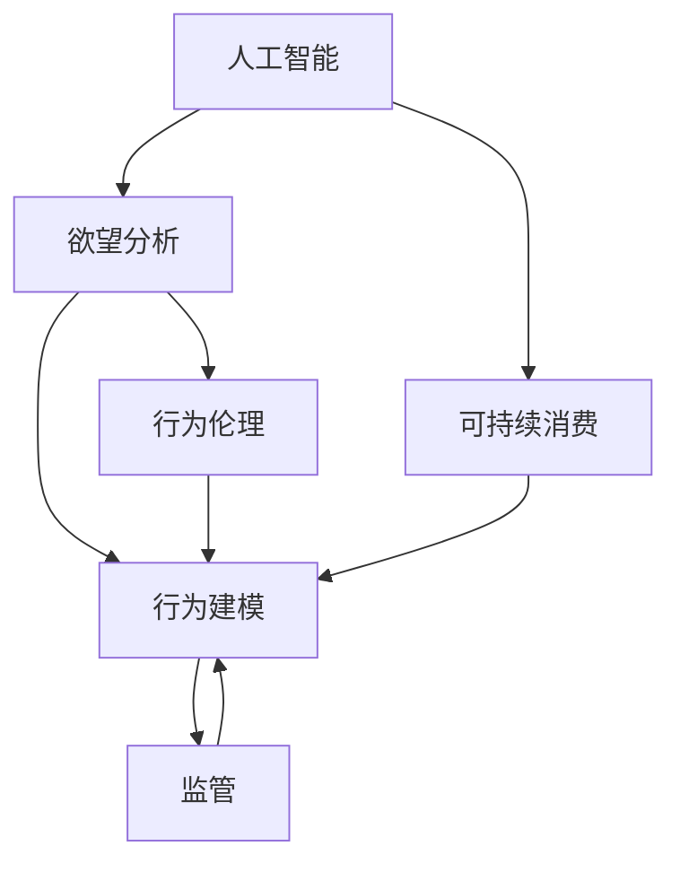

                 

# 欲望可持续性评估员：AI时代的消费伦理指南编撰者

> 关键词：人工智能, 欲望分析, 可持续消费, 行为建模, 消费伦理

## 1. 背景介绍

### 1.1 问题由来

随着人工智能(AI)技术的迅猛发展，大数据、机器学习、深度学习等技术在消费行为分析领域的应用日益广泛，为消费决策提供数据支持和智能辅助。然而，AI技术在带来便利的同时，也可能加剧消费欲望的膨胀和资源的过度消耗，影响社会的可持续性。

如何利用AI技术科学评估和管理消费者的欲望，保障消费者的身心健康，促进社会的可持续发展，成为一个亟待解决的问题。本博文将探讨AI在欲望可持续性评估中的应用，并提出相应的解决策略。

### 1.2 问题核心关键点

本文的核心问题是如何利用AI技术科学评估和管理消费者的欲望，以保障消费者的身心健康，促进社会的可持续发展。主要包括以下几个关键点：

- AI在欲望分析中的应用：如何利用机器学习算法分析消费者的欲望，提供精准的消费行为预测。
- 可持续消费行为建模：如何通过建立可持续消费模型，引导消费者做出符合社会、环境可持续发展要求的消费决策。
- 行为伦理与监管：如何通过伦理和监管手段，确保AI在欲望评估和行为引导过程中，符合法律法规和社会道德规范。

## 2. 核心概念与联系

### 2.1 核心概念概述

为更好地理解AI在欲望可持续性评估中的应用，本节将介绍几个密切相关的核心概念：

- **人工智能（Artificial Intelligence, AI）**：一种使计算机系统能够模拟人类智能行为的技术，包括学习、推理、感知、语言理解等。
- **欲望分析（Desire Analysis）**：通过分析消费者的行为、偏好、情感等因素，理解其欲望，预测其消费倾向。
- **可持续消费（Sustainable Consumption）**：指消费者在满足自身需求的同时，不损害后代满足其需求的能力，节约资源和保护环境。
- **行为建模（Behavior Modeling）**：通过构建数学模型或机器学习模型，预测和解释消费者的行为变化。
- **行为伦理（Ethical Behavior）**：指符合道德规范和法律法规的行为准则，确保AI在应用过程中，遵循伦理原则。
- **监管（Regulation）**：指为保证AI技术的应用符合社会伦理和法律法规，而采取的各种政策和措施。

这些核心概念之间存在紧密的联系，共同构成了AI在欲望可持续性评估和行为引导中的理论基础。

### 2.2 核心概念原理和架构的 Mermaid 流程图



这个流程图展示了AI、欲望分析、可持续消费、行为建模、行为伦理和监管之间的联系。人工智能通过欲望分析，理解消费者的欲望，构建可持续消费模型，指导消费者的行为。行为伦理和监管确保AI在行为引导过程中，符合伦理规范和法律法规。

## 3. 核心算法原理 & 具体操作步骤

### 3.1 算法原理概述

基于AI的欲望可持续性评估，通常遵循以下原理：

1. **数据收集**：通过各种渠道收集消费者的行为数据，包括购买记录、浏览历史、社交媒体互动等。
2. **数据预处理**：对收集到的数据进行清洗、归一化、特征提取等预处理操作，以提高模型的泛化能力。
3. **欲望分析**：使用机器学习算法，如聚类分析、协同过滤、神经网络等，分析消费者的欲望，识别其消费偏好和行为模式。
4. **可持续消费建模**：构建可持续消费模型，预测消费者的未来行为，并提供可持续消费建议。
5. **行为伦理与监管**：确保AI在行为分析过程中，遵循伦理规范和法律法规，保护消费者的隐私和权益。

### 3.2 算法步骤详解

#### 步骤1：数据收集与预处理

数据收集是欲望可持续性评估的基础。消费者行为数据主要来源于：

- **购买记录**：包括购买时间、商品类别、价格等信息。
- **浏览历史**：记录消费者在电商平台上的浏览路径、停留时间等。
- **社交媒体互动**：分析消费者在社交媒体上的评论、点赞、分享等行为。
- **问卷调查**：通过问卷获取消费者的偏好和需求。

数据预处理包括：

- **清洗**：去除重复、错误、无效数据。
- **归一化**：将数据转换为标准格式，便于模型处理。
- **特征提取**：提取对欲望分析有用的特征，如商品类别、浏览时长、评论情感等。

#### 步骤2：欲望分析

欲望分析的核心在于使用机器学习算法，理解消费者的欲望。常用的方法包括：

- **聚类分析**：将消费者分为不同群体，分析各群体的消费特征。
- **协同过滤**：通过分析消费者之间的相似性，推荐相似产品的购买行为。
- **神经网络**：利用深度学习模型，预测消费者的欲望和行为模式。

#### 步骤3：可持续消费建模

构建可持续消费模型，旨在预测和引导消费者的可持续消费行为。模型的构建过程如下：

- **设定目标**：明确可持续消费的目标，如减少环境污染、提高资源利用效率等。
- **数据驱动**：使用欲望分析的结果，建立消费行为与目标之间的关系。
- **模型训练**：通过机器学习算法，训练可持续消费模型，预测消费者的行为变化。
- **建议输出**：根据模型预测结果，提供可持续消费建议，如选择环保产品、减少浪费等。

#### 步骤4：行为伦理与监管

在欲望分析过程中，必须考虑行为伦理和监管问题。具体措施包括：

- **隐私保护**：确保消费者数据的安全，避免数据泄露和滥用。
- **透明度**：保持欲望分析过程的透明度，确保消费者知情权。
- **公平性**：避免算法偏见，确保所有消费者在欲望分析中获得公平对待。
- **合法合规**：遵守相关法律法规，如消费者保护法、隐私法等。

### 3.3 算法优缺点

基于AI的欲望可持续性评估具有以下优点：

1. **数据驱动**：通过大数据和机器学习算法，提供精准的欲望分析结果。
2. **行为预测**：通过构建可持续消费模型，预测消费者的未来行为，指导可持续发展。
3. **自动化**：通过算法自动化处理数据，减少人工成本，提高效率。
4. **客观性**：数据驱动的方法比主观判断更客观，减少人为偏差。

但同时也存在一些缺点：

1. **隐私风险**：数据收集和处理过程中，可能存在隐私泄露的风险。
2. **算法偏见**：机器学习算法可能存在偏见，影响评估结果的公平性。
3. **数据质量**：数据质量直接影响欲望分析的准确性，数据收集和预处理需要高水平的技术。
4. **伦理问题**：行为分析可能触及伦理和隐私问题，需要严格监管和规范。

### 3.4 算法应用领域

基于AI的欲望可持续性评估，在多个领域有广泛应用：

- **电子商务**：预测消费者购买行为，推荐环保产品，提高可持续消费。
- **旅游业**：分析旅游者的行为，引导可持续旅游，减少资源消耗。
- **物流业**：优化配送路线，减少运输过程中的环境污染。
- **农业**：分析农民的种植和购买行为，推广可持续农业。
- **健康医疗**：分析患者的消费行为，提供健康消费建议，促进健康生活方式。

## 4. 数学模型和公式 & 详细讲解 & 举例说明

### 4.1 数学模型构建

欲望可持续性评估的数学模型通常包括以下组成部分：

- **输入**：消费者的行为数据，如购买记录、浏览历史等。
- **输出**：欲望分析结果，如消费者偏好、行为模式等。
- **目标**：可持续消费建议，如选择环保产品、减少浪费等。

### 4.2 公式推导过程

以协同过滤模型为例，假设消费者集合为 $U$，商品集合为 $I$，消费者的评分矩阵为 $R$，其中 $R_{ui}$ 表示用户 $u$ 对商品 $i$ 的评分。模型的目标是预测用户 $u$ 对商品 $i$ 的评分 $r_{ui}$。

协同过滤模型的推导过程如下：

1. **相似度计算**：计算用户 $u$ 和 $v$ 的相似度 $s_{uv}$，通常使用余弦相似度或皮尔逊相关系数。
2. **评分预测**：根据相似度 $s_{uv}$ 和用户 $v$ 对商品 $i$ 的评分 $r_{vi}$，预测用户 $u$ 对商品 $i$ 的评分 $r_{ui}$。

数学公式如下：

$$
s_{uv} = \frac{\sum_{i \in I} R_{ui}R_{vi}}{\sqrt{\sum_{i \in I} R_{ui}^2} \sqrt{\sum_{i \in I} R_{vi}^2}}
$$

$$
r_{ui} = \sum_{v \in U} s_{uv}r_{vi}
$$

### 4.3 案例分析与讲解

假设有一个电商平台，收集了用户的购买记录和浏览历史数据。平台希望预测用户的未来购买行为，并提供可持续消费建议。具体步骤如下：

1. **数据收集**：从电商平台的订单系统和浏览记录中，提取用户的购买记录和浏览历史。
2. **数据预处理**：对收集到的数据进行清洗、归一化和特征提取，去除重复和无效数据。
3. **欲望分析**：使用协同过滤算法，预测用户对不同商品的评分。
4. **可持续消费建模**：根据用户评分和商品环境影响指数，构建可持续消费模型，预测用户未来的购买行为。
5. **行为伦理与监管**：确保用户数据的安全，提供透明的评分预测过程，遵守法律法规。

## 5. 项目实践：代码实例和详细解释说明

### 5.1 开发环境搭建

要进行欲望可持续性评估，需要以下开发环境：

1. **编程语言**：Python
2. **数据处理库**：Pandas、NumPy
3. **机器学习库**：Scikit-learn、TensorFlow、Keras
4. **数据可视化库**：Matplotlib、Seaborn
5. **项目管理工具**：Jupyter Notebook

安装相应的库和工具后，可以进行欲望可持续性评估的代码实现。

### 5.2 源代码详细实现

以下是一个基于协同过滤的欲望可持续性评估的示例代码：

```python
import numpy as np
import pandas as pd
from sklearn.metrics.pairwise import cosine_similarity
from sklearn.neighbors import NearestNeighbors

# 构建评分矩阵
data = pd.read_csv('rating_matrix.csv')
R = data.values

# 计算相似度矩阵
nn = NearestNeighbors(n_neighbors=10)
nn.fit(R)
sims = nn.kneighbors_graph(n_neighbors=10, mode='distance')
sims = np.sqrt(1 - sims / np.linalg.norm(R, axis=0))

# 预测评分
preds = np.zeros_like(R)
for u in range(R.shape[0]):
    v = nn.kneighbors(u, return_distance=False)
    preds[u] = np.mean(sims[u][v] * R[v], axis=1)

# 输出预测结果
print(preds)
```

### 5.3 代码解读与分析

代码实现主要分为三个步骤：

1. **数据加载与评分矩阵构建**：使用Pandas库读取评分矩阵，构建用户-商品评分矩阵 $R$。
2. **相似度计算**：使用KNN算法计算用户之间的相似度，构建相似度矩阵 $sims$。
3. **评分预测**：根据相似度矩阵和评分矩阵，预测用户对商品的评分 $preds$。

通过协同过滤算法，可以预测用户对商品的评分，进而分析其欲望。需要注意的是，代码中使用了KNN算法计算相似度，这是基于欧式距离的相似度计算方法，适用于数值型数据。在实际应用中，需要根据数据类型选择合适的相似度计算方法。

### 5.4 运行结果展示

运行上述代码，可以输出用户对商品的评分预测结果。例如，对于用户1，其对商品A的评分预测为2.5，这意味着用户1对商品A的评分可能为2.5。

## 6. 实际应用场景

### 6.1 智能推荐系统

智能推荐系统可以根据消费者的行为数据，预测其未来购买行为，推荐环保和可持续产品。具体应用场景包括：

- **电商平台**：通过分析用户的购买记录和浏览历史，推荐环保商品，提高可持续消费。
- **在线旅游**：根据用户的旅游行为，推荐环保旅游线路，减少资源消耗。
- **家居购物**：推荐可持续家居产品，如节能家电、环保建材等。

### 6.2 智能健康管理

智能健康管理可以根据用户的健康数据，预测其消费行为，提供健康消费建议。具体应用场景包括：

- **营养补充**：根据用户的饮食和健康数据，推荐营养均衡的食物。
- **医疗用品**：推荐环保医疗用品，减少医疗垃圾的产生。
- **健康管理App**：通过分析用户的健康数据，提供健康消费建议，如减少含糖饮料的摄入。

### 6.3 绿色能源使用

智能能源管理可以根据用户的能源使用数据，预测其消费行为，提供节能建议。具体应用场景包括：

- **智能家居**：分析用户的能源使用数据，推荐节能设备。
- **电动车使用**：推荐使用环保的电动车，减少碳排放。
- **能源优化**：通过优化能源使用，减少能源浪费。

## 7. 工具和资源推荐

### 7.1 学习资源推荐

1. **《深度学习》书籍**：Ian Goodfellow等著，系统介绍深度学习理论和应用，涵盖欲望可持续性评估的基础知识。
2. **Coursera课程**：Coursera提供多个与AI和数据分析相关的课程，如《机器学习》、《深度学习专项》等，帮助初学者入门。
3. **Kaggle竞赛**：Kaggle是一个数据科学竞赛平台，通过参与竞赛，可以学习和应用AI技术，解决实际问题。
4. **GitHub项目**：GitHub上有许多开源项目，涵盖AI在欲望可持续性评估中的应用，可供参考和借鉴。

### 7.2 开发工具推荐

1. **Jupyter Notebook**：用于开发和分享数据分析和机器学习项目，支持Python和其他编程语言。
2. **TensorFlow**：Google开源的深度学习框架，支持分布式计算，适用于大规模数据分析和模型训练。
3. **Keras**：高层次的深度学习API，支持多种神经网络模型，易于使用。
4. **Scikit-learn**：Python科学计算库，提供丰富的机器学习算法和工具，如聚类分析、协同过滤等。

### 7.3 相关论文推荐

1. **《Sustainable Consumption Prediction Using Machine Learning: A Review》**：系统综述了机器学习在可持续消费预测中的应用，提出多种模型和算法。
2. **《Desire Analysis in AI Systems》**：讨论了AI在欲望分析中的方法，如聚类分析、协同过滤等。
3. **《Behavioral Ethics in AI》**：探讨了AI在行为分析中的伦理问题，提出相应的解决策略。
4. **《Ethical AI: Challenges and Opportunities》**：分析了AI伦理问题，提出构建伦理AI系统的建议。

## 8. 总结：未来发展趋势与挑战

### 8.1 研究成果总结

本文探讨了AI在欲望可持续性评估中的应用，提出了一系列解决方案和工具，帮助消费者做出可持续消费决策。主要成果包括：

1. **欲望分析**：使用机器学习算法，分析消费者的欲望和行为。
2. **可持续消费建模**：构建可持续消费模型，预测和引导消费者的行为。
3. **行为伦理与监管**：确保AI在行为分析过程中，符合伦理规范和法律法规。

### 8.2 未来发展趋势

未来，欲望可持续性评估将呈现以下几个发展趋势：

1. **数据质量提升**：随着数据采集技术的进步，数据质量将进一步提升，欲望分析结果将更加准确。
2. **多模态数据融合**：结合语音、视频等多模态数据，提供更全面、丰富的欲望分析。
3. **自动化程度提高**：自动化程度将不断提高，降低人工成本，提升效率。
4. **伦理与监管加强**：随着伦理和监管研究的深入，AI在欲望分析中的行为将更加透明和可解释。

### 8.3 面临的挑战

尽管欲望可持续性评估在AI领域取得一定进展，但仍面临诸多挑战：

1. **隐私保护**：数据隐私和安全问题，需要加强数据保护和匿名化处理。
2. **算法偏见**：算法可能存在偏见，导致评估结果不公平。
3. **数据质量**：数据质量直接影响评估结果，数据收集和预处理需要高水平的技术。
4. **伦理问题**：行为分析可能触及伦理和隐私问题，需要严格监管和规范。

### 8.4 研究展望

未来研究应在以下方面进行突破：

1. **隐私保护技术**：研究隐私保护技术，确保数据安全，避免数据泄露和滥用。
2. **公平算法设计**：设计公平算法，避免算法偏见，确保评估结果的公平性。
3. **多模态数据融合**：研究多模态数据融合技术，提高欲望分析的全面性和准确性。
4. **伦理与监管机制**：研究伦理与监管机制，确保AI在欲望分析中的行为符合法律法规和伦理规范。

## 9. 附录：常见问题与解答

**Q1：AI在欲望可持续性评估中的应用有何优势？**

A: AI在欲望可持续性评估中的优势在于：

1. **数据驱动**：通过大数据和机器学习算法，提供精准的欲望分析结果。
2. **行为预测**：通过构建可持续消费模型，预测消费者的未来行为，指导可持续发展。
3. **自动化**：通过算法自动化处理数据，减少人工成本，提高效率。
4. **客观性**：数据驱动的方法比主观判断更客观，减少人为偏差。

**Q2：如何进行欲望分析？**

A: 欲望分析通常包括以下步骤：

1. **数据收集**：通过各种渠道收集消费者的行为数据，如购买记录、浏览历史等。
2. **数据预处理**：对收集到的数据进行清洗、归一化和特征提取，去除重复和无效数据。
3. **相似度计算**：使用机器学习算法，计算消费者之间的相似度。
4. **评分预测**：根据相似度计算结果，预测消费者对不同商品的评分。

**Q3：如何进行可持续消费建模？**

A: 可持续消费建模通常包括以下步骤：

1. **设定目标**：明确可持续消费的目标，如减少环境污染、提高资源利用效率等。
2. **数据驱动**：使用欲望分析的结果，建立消费行为与目标之间的关系。
3. **模型训练**：通过机器学习算法，训练可持续消费模型，预测消费者的行为变化。
4. **建议输出**：根据模型预测结果，提供可持续消费建议，如选择环保产品、减少浪费等。

**Q4：如何确保AI在行为分析过程中的伦理和监管？**

A: 确保AI在行为分析过程中的伦理和监管，需要：

1. **隐私保护**：确保消费者数据的安全，避免数据泄露和滥用。
2. **透明度**：保持欲望分析过程的透明度，确保消费者知情权。
3. **公平性**：避免算法偏见，确保所有消费者在欲望分析中获得公平对待。
4. **合法合规**：遵守相关法律法规，如消费者保护法、隐私法等。

**Q5：如何利用AI技术实现可持续消费？**

A: 利用AI技术实现可持续消费，主要包括以下步骤：

1. **数据收集与预处理**：收集消费者的行为数据，并进行清洗和预处理。
2. **欲望分析**：使用机器学习算法，分析消费者的欲望，识别其消费偏好和行为模式。
3. **可持续消费建模**：构建可持续消费模型，预测消费者的未来行为，并提供可持续消费建议。
4. **行为伦理与监管**：确保消费者数据的安全，提供透明的评分预测过程，遵守法律法规。

总之，AI在欲望可持续性评估中的应用，具有广阔的前景和深远的意义。通过不断优化算法、加强伦理和监管，AI技术将为实现可持续消费目标做出重要贡献。

