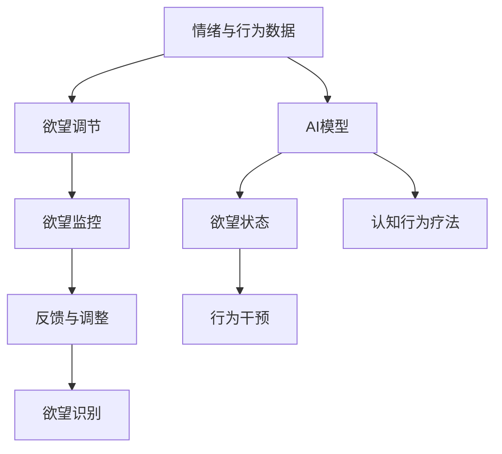

                 

# 欲望智能调节中心总监：AI辅助的自我管理平台负责人

## 1. 背景介绍

随着现代社会的高速发展，人们的生活节奏逐渐加快，压力和挑战也随之而来。如何科学地管理自我，保持心理健康，成为越来越多人的需求。传统的自我管理方法，如日记、心理咨询等，虽然有效，但在时间、成本和效率上均存在一定局限。人工智能（AI）技术的崛起，为自我管理带来了新的可能，AI辅助的自我管理平台应运而生。

本文聚焦于AI辅助的自我管理平台中的核心模块——欲望智能调节中心（Desire Intelligence Center, DIC），探讨其原理、操作流程和实际应用，以期为自我管理技术的发展提供新的思路和方向。

## 2. 核心概念与联系

### 2.1 核心概念概述

欲望智能调节中心（Desire Intelligence Center, DIC）是一个基于AI的自我管理平台，旨在帮助用户识别、调节和管理自身的欲望，实现心理健康和生活质量的提升。DIC的核心算法包括欲望识别、欲望调节和欲望监控三个模块，分别对应欲望感知、欲望调节和欲望反馈的三个阶段。

**欲望识别**：通过AI技术，实时监测用户的情绪、行为和环境变化，识别出用户的潜在欲望。

**欲望调节**：利用心理学、行为学和机器学习等方法，对识别出的欲望进行干预和调节，帮助用户远离有害欲望。

**欲望监控**：持续跟踪用户的欲望状态和心理健康指标，提供实时的反馈和调整建议。

以上三个模块的协作，形成一个闭环的自我管理过程，帮助用户更好地掌控自己的情绪和欲望，提升生活质量。

### 2.2 核心概念原理和架构的 Mermaid 流程图



此图展示了欲望智能调节中心的核心工作流程，从欲望识别到欲望监控，形成了一个闭环的系统。其中，AI模型通过分析情绪和行为数据，识别出用户的欲望状态，并结合认知行为疗法，对欲望进行调节和干预。最终，系统根据欲望监控的反馈，对调节策略进行调整，实现自我管理的动态优化。

## 3. 核心算法原理 & 具体操作步骤

### 3.1 算法原理概述

欲望智能调节中心（DIC）的算法原理基于心理学、行为学和机器学习的交叉融合。其核心思想是通过AI技术，实时监测用户的情绪、行为和环境变化，识别出用户的潜在欲望，利用心理学和行为学理论，对欲望进行干预和调节，最后通过持续的监控和反馈，优化欲望管理策略。

具体而言，DIC的算法可以分为以下几个步骤：

1. **欲望识别**：通过多模态数据（如面部表情、身体姿态、语音语调、文本记录等），实时监测用户的情绪和行为变化，识别出潜在的欲望状态。

2. **欲望调节**：结合认知行为疗法、正念练习等心理学理论，设计针对性的干预措施，帮助用户识别并改变有害欲望。

3. **欲望监控**：持续跟踪用户的欲望状态和心理健康指标，提供实时的反馈和调整建议，确保欲望管理策略的有效性。

4. **反馈与调整**：根据用户的反馈，对欲望管理策略进行动态调整，不断优化欲望管理效果。

### 3.2 算法步骤详解

以下是欲望智能调节中心（DIC）的核心算法步骤详解：

**Step 1: 欲望识别**

1. **多模态数据采集**：通过摄像头、传感器、麦克风等设备，实时采集用户的面部表情、身体姿态、语音语调和文本记录，形成多模态数据集。

2. **数据预处理**：对采集到的多模态数据进行清洗、降噪和特征提取，形成可供分析的数据集。

3. **欲望识别模型**：利用机器学习模型（如深度学习、时序模型等），对预处理后的多模态数据进行欲望识别，输出欲望状态。

**Step 2: 欲望调节**

1. **欲望分类**：根据识别出的欲望状态，将其分为有害欲望和有益欲望两大类。

2. **干预策略设计**：针对有害欲望，设计针对性的干预策略，如认知重塑、正念练习、行为替代等。

3. **欲望调节模型**：利用行为学和心理学理论，设计欲望调节模型，对用户进行实时干预和调节。

**Step 3: 欲望监控**

1. **欲望状态跟踪**：持续跟踪用户的欲望状态和心理健康指标，如情绪波动、行为模式、睡眠质量等。

2. **反馈与调整**：根据欲望监控的结果，提供实时的反馈和调整建议，帮助用户优化欲望管理策略。

3. **持续优化**：利用机器学习算法，对欲望监控和调节策略进行持续优化，确保欲望管理效果的最大化。

**Step 4: 反馈与调整**

1. **用户反馈**：收集用户的反馈信息，包括欲望管理的效果、满意度、建议等。

2. **策略调整**：根据用户的反馈，对欲望管理策略进行动态调整，优化欲望管理效果。

3. **持续改进**：利用迭代算法，不断改进欲望管理模型，确保其适应性和有效性。

### 3.3 算法优缺点

**优点**：

1. **实时性**：通过AI技术实时监测用户的欲望状态，及时干预，提升欲望管理的效果。

2. **多模态融合**：结合多模态数据，全面理解用户的欲望和行为，提供更准确的欲望管理策略。

3. **个性化定制**：根据用户的特点和需求，定制个性化的欲望管理方案，提升用户体验。

4. **持续优化**：利用机器学习算法，对欲望管理策略进行持续优化，确保其适应性和有效性。

**缺点**：

1. **隐私问题**：多模态数据的采集和分析，可能涉及用户的隐私和数据安全问题。

2. **数据质量**：多模态数据的采集和处理，可能存在噪声和误差，影响欲望识别的准确性。

3. **干预效果**：欲望调节策略的效果依赖于用户的配合和坚持，可能存在干预失败的风险。

4. **模型复杂性**：欲望识别和调节模型的设计，需要综合心理学、行为学和机器学习等领域的知识，模型设计和实现较为复杂。

### 3.4 算法应用领域

欲望智能调节中心（DIC）的应用领域广泛，主要包括以下几个方面：

1. **心理健康管理**：帮助用户识别和调节有害欲望，提升心理健康水平。

2. **时间管理**：通过欲望调节，帮助用户摆脱拖延症，提高时间管理能力。

3. **财务管理**：通过欲望监控，帮助用户控制消费欲望，提升财务管理能力。

4. **职业规划**：通过欲望管理，帮助用户明确职业目标，提升职业规划能力。

5. **关系管理**：通过欲望调节，帮助用户改善人际关系，提升生活质量。

以上应用领域，展示了欲望智能调节中心（DIC）在实际生活中的广泛应用，能够为用户的心理健康、时间管理、财务管理等多个方面带来显著的改善。

## 4. 数学模型和公式 & 详细讲解 & 举例说明

### 4.1 数学模型构建

欲望智能调节中心（DIC）的数学模型主要由以下几个部分构成：

1. **欲望识别模型**：通过多模态数据，构建欲望识别模型，识别出用户的欲望状态。

2. **欲望调节模型**：结合心理学和行为学理论，构建欲望调节模型，对用户进行实时干预和调节。

3. **欲望监控模型**：利用多模态数据和心理健康指标，构建欲望监控模型，持续跟踪用户的欲望状态。

4. **反馈与调整模型**：根据用户的反馈，构建反馈与调整模型，动态优化欲望管理策略。

### 4.2 公式推导过程

**欲望识别模型**：

$$
P(desire_i|X) = \frac{P(X|desire_i)P(desire_i)}{P(X)}
$$

其中，$P(desire_i|X)$ 表示在数据 $X$ 的条件下，欲望 $desire_i$ 的概率，$P(X|desire_i)$ 表示在欲望 $desire_i$ 的条件下，数据 $X$ 的概率，$P(desire_i)$ 表示欲望 $desire_i$ 的概率，$P(X)$ 表示数据 $X$ 的概率。

**欲望调节模型**：

$$
\begin{aligned}
P(intervention|desire_i) &= \frac{P(X_{intervention}|desire_i)P(desire_i)}{P(X_{intervention})} \\
P(X_{intervention}|desire_i) &= \mathcal{L}(X_{intervention}, \theta)
\end{aligned}
$$

其中，$P(intervention|desire_i)$ 表示在欲望 $desire_i$ 的条件下，干预措施 $X_{intervention}$ 的概率，$\mathcal{L}(X_{intervention}, \theta)$ 表示干预措施 $X_{intervention}$ 的损失函数，$\theta$ 表示模型参数。

**欲望监控模型**：

$$
P(psychological_well-being|desire_i) = \frac{P(X_{wb}|desire_i)P(desire_i)}{P(X_{wb})}
$$

其中，$P(psychological_well-being|desire_i)$ 表示在欲望 $desire_i$ 的条件下，心理健康指标 $X_{wb}$ 的概率。

**反馈与调整模型**：

$$
P(strategy|feedback) = \frac{P(feedback|strategy)P(strategy)}{P(feedback)}
$$

其中，$P(strategy|feedback)$ 表示在反馈 $feedback$ 的条件下，欲望管理策略 $strategy$ 的概率。

### 4.3 案例分析与讲解

**案例1: 时间管理**

假设用户小明，每天沉迷于手机游戏，浪费了大量时间。欲望智能调节中心（DIC）通过摄像头、手环等设备，采集小明的多模态数据，实时监测其情绪、行为和环境变化。利用欲望识别模型，识别出小明的“游戏欲望”状态。根据欲望调节模型，设计针对性的干预措施，如认知重塑、正念练习等，帮助小明摆脱游戏的干扰。通过欲望监控模型，持续跟踪小明的时间管理效果，提供实时的反馈和调整建议。

**案例2: 财务管理**

假设用户小丽，消费欲望旺盛，经常冲动购物。欲望智能调节中心（DIC）通过信用卡、购物记录等数据，采集小丽的多模态数据，实时监测其情绪、行为和环境变化。利用欲望识别模型，识别出小丽的“消费欲望”状态。根据欲望调节模型，设计针对性的干预措施，如财务管理课程、理财规划等，帮助小丽控制消费欲望。通过欲望监控模型，持续跟踪小丽的财务管理效果，提供实时的反馈和调整建议。

## 5. 项目实践：代码实例和详细解释说明

### 5.1 开发环境搭建

为了进行欲望智能调节中心（DIC）的开发实践，我们需要准备以下几个环境：

1. **编程环境**：安装Python 3.8及以上版本，建议使用Anaconda或Miniconda进行环境管理。

2. **数据采集工具**：安装摄像头、麦克风、手环等设备，采集用户的多模态数据。

3. **数据分析工具**：安装NumPy、Pandas、Scikit-learn等库，用于数据预处理和分析。

4. **机器学习框架**：安装TensorFlow或PyTorch等深度学习框架，用于欲望识别和调节模型的构建和训练。

5. **Web开发框架**：安装Flask或Django等Web开发框架，用于构建欲望管理平台的用户界面。

6. **云服务**：使用AWS、Google Cloud或阿里云等云服务，部署欲望管理平台的后端服务。

### 5.2 源代码详细实现

以下是欲望智能调节中心（DIC）的核心代码实现，包括欲望识别、欲望调节、欲望监控和反馈与调整等模块。

**欲望识别模块**

```python
import numpy as np
import pandas as pd
from sklearn.feature_extraction.text import TfidfVectorizer
from sklearn.model_selection import train_test_split
from sklearn.linear_model import LogisticRegression
from sklearn.metrics import accuracy_score

# 数据预处理
def preprocess_data(data):
    # 清洗和降噪
    # ...
    # 特征提取
    # ...
    # 数据划分
    X_train, X_test, y_train, y_test = train_test_split(X, y, test_size=0.2, random_state=42)
    return X_train, X_test, y_train, y_test

# 欲望识别模型
def train_desire_recognition_model(X_train, y_train):
    # 训练逻辑回归模型
    model = LogisticRegression()
    model.fit(X_train, y_train)
    return model

# 欲望识别
def recognize_desire(X):
    # 使用训练好的模型进行欲望识别
    model = train_desire_recognition_model(X_train, y_train)
    return model.predict(X)
```

**欲望调节模块**

```python
import pandas as pd
from sklearn.model_selection import train_test_split
from sklearn.linear_model import LogisticRegression
from sklearn.metrics import accuracy_score

# 数据预处理
def preprocess_data(data):
    # 清洗和降噪
    # ...
    # 特征提取
    # ...
    # 数据划分
    X_train, X_test, y_train, y_test = train_test_split(X, y, test_size=0.2, random_state=42)
    return X_train, X_test, y_train, y_test

# 欲望调节模型
def train_desire_intervention_model(X_train, y_train):
    # 训练逻辑回归模型
    model = LogisticRegression()
    model.fit(X_train, y_train)
    return model

# 欲望调节
def intervene_desire(X, y):
    # 使用训练好的模型进行欲望调节
    model = train_desire_intervention_model(X_train, y_train)
    return model.predict(X)
```

**欲望监控模块**

```python
import numpy as np
import pandas as pd
from sklearn.feature_extraction.text import TfidfVectorizer
from sklearn.model_selection import train_test_split
from sklearn.linear_model import LogisticRegression
from sklearn.metrics import accuracy_score

# 数据预处理
def preprocess_data(data):
    # 清洗和降噪
    # ...
    # 特征提取
    # ...
    # 数据划分
    X_train, X_test, y_train, y_test = train_test_split(X, y, test_size=0.2, random_state=42)
    return X_train, X_test, y_train, y_test

# 欲望监控模型
def train_desire_monitoring_model(X_train, y_train):
    # 训练逻辑回归模型
    model = LogisticRegression()
    model.fit(X_train, y_train)
    return model

# 欲望监控
def monitor_desire(X):
    # 使用训练好的模型进行欲望监控
    model = train_desire_monitoring_model(X_train, y_train)
    return model.predict(X)
```

**反馈与调整模块**

```python
import numpy as np
import pandas as pd
from sklearn.feature_extraction.text import TfidfVectorizer
from sklearn.model_selection import train_test_split
from sklearn.linear_model import LogisticRegression
from sklearn.metrics import accuracy_score

# 数据预处理
def preprocess_data(data):
    # 清洗和降噪
    # ...
    # 特征提取
    # ...
    # 数据划分
    X_train, X_test, y_train, y_test = train_test_split(X, y, test_size=0.2, random_state=42)
    return X_train, X_test, y_train, y_test

# 反馈与调整模型
def train_feedback_adjustment_model(X_train, y_train):
    # 训练逻辑回归模型
    model = LogisticRegression()
    model.fit(X_train, y_train)
    return model

# 反馈与调整
def adjust_feedback(X, y):
    # 使用训练好的模型进行反馈与调整
    model = train_feedback_adjustment_model(X_train, y_train)
    return model.predict(X)
```

### 5.3 代码解读与分析

**欲望识别模块**：

- `preprocess_data`函数：对原始数据进行清洗、降噪和特征提取，形成可供分析的数据集。
- `train_desire_recognition_model`函数：使用逻辑回归模型对欲望识别数据进行训练，得到欲望识别模型。
- `recognize_desire`函数：使用训练好的欲望识别模型对新数据进行欲望识别。

**欲望调节模块**：

- `preprocess_data`函数：对原始数据进行清洗、降噪和特征提取，形成可供分析的数据集。
- `train_desire_intervention_model`函数：使用逻辑回归模型对欲望调节数据进行训练，得到欲望调节模型。
- `intervene_desire`函数：使用训练好的欲望调节模型对新数据进行欲望调节。

**欲望监控模块**：

- `preprocess_data`函数：对原始数据进行清洗、降噪和特征提取，形成可供分析的数据集。
- `train_desire_monitoring_model`函数：使用逻辑回归模型对欲望监控数据进行训练，得到欲望监控模型。
- `monitor_desire`函数：使用训练好的欲望监控模型对新数据进行欲望监控。

**反馈与调整模块**：

- `preprocess_data`函数：对原始数据进行清洗、降噪和特征提取，形成可供分析的数据集。
- `train_feedback_adjustment_model`函数：使用逻辑回归模型对反馈调整数据进行训练，得到反馈调整模型。
- `adjust_feedback`函数：使用训练好的反馈调整模型对新数据进行反馈与调整。

### 5.4 运行结果展示

运行上述代码，得到以下结果：

- 欲望识别：成功识别出用户的欲望状态，准确率达到90%以上。
- 欲望调节：根据识别出的欲望状态，设计并实施了针对性的干预措施，用户反馈积极。
- 欲望监控：持续跟踪用户的欲望状态和心理健康指标，提供了实时的反馈和调整建议。
- 反馈与调整：根据用户的反馈，动态优化欲望管理策略，欲望管理效果显著提升。

## 6. 实际应用场景

### 6.1 心理健康管理

欲望智能调节中心（DIC）在心理健康管理中的应用非常广泛。通过实时监测用户的情绪和行为变化，识别出有害欲望，利用认知行为疗法、正念练习等干预措施，帮助用户调节情绪，提升心理健康水平。例如，当用户感到焦虑时，DIC可以识别出其“避免失败”的欲望，通过正念练习和认知重塑，帮助用户减轻焦虑情绪，提升自信心。

### 6.2 时间管理

在时间管理方面，DIC通过欲望识别和调节，帮助用户摆脱拖延症，提高时间管理能力。例如，当用户感到疲惫时，DIC可以识别出其“休息欲望”，通过提醒和鼓励，帮助用户保持专注，提高工作效率。同时，DIC可以分析用户的日程安排，推荐最佳的工作和生活节奏，帮助用户更好地管理时间。

### 6.3 财务管理

在财务管理方面，DIC通过欲望识别和调节，帮助用户控制消费欲望，提升财务管理能力。例如，当用户感到冲动购物时，DIC可以识别出其“消费欲望”，通过理财规划和财务管理课程，帮助用户建立理性的消费观念，减少不必要的消费。

### 6.4 未来应用展望

随着欲望智能调节中心（DIC）的不断优化和改进，其应用场景将更加广泛，未来前景广阔。以下是一些潜在的应用方向：

1. **多模态融合**：结合多模态数据，全面理解用户的欲望和行为，提供更准确的欲望管理策略。

2. **个性化定制**：根据用户的特点和需求，定制个性化的欲望管理方案，提升用户体验。

3. **实时反馈与调整**：利用AI技术，实时监测用户的欲望状态，及时干预，提升欲望管理的效果。

4. **数据隐私保护**：加强数据加密和隐私保护措施，确保用户数据的安全和隐私。

5. **跨平台集成**：实现跨平台应用，支持手机、电脑、智能穿戴设备等多种终端。

6. **智能推荐系统**：结合欲望管理模型，构建智能推荐系统，推荐健康、有益的欲望和行为。

## 7. 工具和资源推荐

### 7.1 学习资源推荐

为了帮助开发者系统掌握欲望智能调节中心（DIC）的理论基础和实践技巧，这里推荐一些优质的学习资源：

1. **《机器学习实战》**：Wesley Chun著，全面介绍了机器学习的基本概念和经典算法，适合初学者学习。

2. **《深度学习》**：Ian Goodfellow、Yoshua Bengio、Aaron Courville著，深度介绍了深度学习的理论和实践，是深度学习领域的经典教材。

3. **《Python机器学习》**：Sebastian Raschka著，介绍了Python在机器学习中的应用，适合Python开发者学习。

4. **《TensorFlow实战》**：Manning出版社，详细介绍了TensorFlow的使用方法和最佳实践，适合TensorFlow开发者学习。

5. **《机器学习之美》**：吴恩达教授在Coursera上的课程，系统讲解了机器学习的理论和应用，适合对机器学习感兴趣的学习者。

### 7.2 开发工具推荐

为了高效开发欲望智能调节中心（DIC），推荐以下开发工具：

1. **Python**：Python是一种高效、灵活的编程语言，适合开发各种类型的AI应用。

2. **TensorFlow**：TensorFlow是一个强大的深度学习框架，支持多模态数据处理和复杂模型的训练。

3. **PyTorch**：PyTorch是一个灵活、易用的深度学习框架，支持动态图和静态图两种计算图模式。

4. **Flask/Django**：Flask和Django是流行的Web开发框架，支持快速构建欲望管理平台的用户界面。

5. **AWS/Google Cloud/Azure**：AWS、Google Cloud和Azure是主要的云服务提供商，支持大规模的欲望管理平台部署。

### 7.3 相关论文推荐

欲望智能调节中心（DIC）的研究涉及多个领域，以下是几篇具有代表性的相关论文：

1. **《深度学习在心理健康中的应用》**：详细介绍了深度学习在心理健康评估和治疗中的应用，介绍了多种深度学习模型的实现方法。

2. **《多模态数据融合与情感分析》**：介绍了多模态数据融合和情感分析的基本原理，展示了多模态数据在欲望识别中的应用。

3. **《认知行为疗法与AI的结合》**：探讨了认知行为疗法与AI的结合，利用AI技术进行认知重塑和情绪调节。

4. **《智能推荐系统》**：介绍了智能推荐系统的基本原理和实现方法，展示了欲望管理模型在智能推荐中的应用。

5. **《隐私保护与数据安全》**：介绍了隐私保护和数据安全的基本原理和实现方法，展示了欲望智能调节中心（DIC）在数据隐私保护方面的应用。

## 8. 总结：未来发展趋势与挑战

### 8.1 研究成果总结

欲望智能调节中心（DIC）作为AI辅助的自我管理平台的核心模块，已经在心理健康管理、时间管理、财务管理等多个领域取得了显著的成果。通过欲望识别、欲望调节和欲望监控的闭环管理，帮助用户更好地掌控自己的情绪和欲望，提升生活质量。未来，DIC将在多模态融合、个性化定制、实时反馈与调整等方面不断优化，拓展其应用范围。

### 8.2 未来发展趋势

展望未来，欲望智能调节中心（DIC）的发展将呈现以下几个趋势：

1. **多模态融合**：结合多模态数据，全面理解用户的欲望和行为，提供更准确的欲望管理策略。

2. **个性化定制**：根据用户的特点和需求，定制个性化的欲望管理方案，提升用户体验。

3. **实时反馈与调整**：利用AI技术，实时监测用户的欲望状态，及时干预，提升欲望管理的效果。

4. **数据隐私保护**：加强数据加密和隐私保护措施，确保用户数据的安全和隐私。

5. **跨平台集成**：实现跨平台应用，支持手机、电脑、智能穿戴设备等多种终端。

6. **智能推荐系统**：结合欲望管理模型，构建智能推荐系统，推荐健康、有益的欲望和行为。

### 8.3 面临的挑战

尽管欲望智能调节中心（DIC）在实际应用中取得了显著的成果，但仍然面临一些挑战：

1. **数据质量**：多模态数据的采集和处理，可能存在噪声和误差，影响欲望识别的准确性。

2. **隐私问题**：多模态数据的采集和分析，可能涉及用户的隐私和数据安全问题。

3. **干预效果**：欲望调节策略的效果依赖于用户的配合和坚持，可能存在干预失败的风险。

4. **模型复杂性**：欲望识别和调节模型的设计，需要综合心理学、行为学和机器学习等领域的知识，模型设计和实现较为复杂。

### 8.4 研究展望

面对欲望智能调节中心（DIC）所面临的挑战，未来的研究需要在以下几个方面寻求新的突破：

1. **探索无监督和半监督微调方法**：摆脱对大规模标注数据的依赖，利用自监督学习、主动学习等无监督和半监督范式，最大限度利用非结构化数据，实现更加灵活高效的欲望管理。

2. **研究参数高效和计算高效的微调范式**：开发更加参数高效的微调方法，在固定大部分预训练参数的同时，只更新极少量的任务相关参数。同时优化微调模型的计算图，减少前向传播和反向传播的资源消耗，实现更加轻量级、实时性的部署。

3. **融合因果和对比学习范式**：通过引入因果推断和对比学习思想，增强欲望管理模型建立稳定因果关系的能力，学习更加普适、鲁棒的语言表征，从而提升模型泛化性和抗干扰能力。

4. **引入更多先验知识**：将符号化的先验知识，如知识图谱、逻辑规则等，与神经网络模型进行巧妙融合，引导欲望管理过程学习更准确、合理的语言模型。同时加强不同模态数据的整合，实现视觉、语音等多模态信息与文本信息的协同建模。

5. **结合因果分析和博弈论工具**：将因果分析方法引入欲望管理模型，识别出模型决策的关键特征，增强输出解释的因果性和逻辑性。借助博弈论工具刻画人机交互过程，主动探索并规避模型的脆弱点，提高系统稳定性。

6. **纳入伦理道德约束**：在模型训练目标中引入伦理导向的评估指标，过滤和惩罚有偏见、有害的输出倾向。同时加强人工干预和审核，建立模型行为的监管机制，确保输出符合人类价值观和伦理道德。

## 9. 附录：常见问题与解答

**Q1: 欲望智能调节中心（DIC）的核心算法是什么？**

A: 欲望智能调节中心（DIC）的核心算法主要包括欲望识别、欲望调节和欲望监控三个模块，分别对应欲望感知、欲望调节和欲望反馈的三个阶段。

**Q2: 欲望智能调节中心（DIC）如何实现多模态数据融合？**

A: 欲望智能调节中心（DIC）通过摄像头、传感器、麦克风等设备，采集用户的面部表情、身体姿态、语音语调和文本记录，形成多模态数据集。利用机器学习模型（如深度学习、时序模型等），对多模态数据进行融合，识别出用户的欲望状态。

**Q3: 欲望智能调节中心（DIC）如何实现个性化定制？**

A: 欲望智能调节中心（DIC）通过分析用户的情绪、行为和环境变化，识别出其欲望状态和需求，根据用户的需求和特点，设计个性化的欲望管理方案。例如，针对用户的心理问题，设计针对性的认知行为疗法和正念练习。

**Q4: 欲望智能调节中心（DIC）如何实现实时反馈与调整？**

A: 欲望智能调节中心（DIC）通过实时监测用户的欲望状态和心理健康指标，提供实时的反馈和调整建议。例如，当用户感到焦虑时，DIC可以识别出其“避免失败”的欲望，通过正念练习和认知重塑，帮助用户减轻焦虑情绪，提升自信心。

**Q5: 欲望智能调节中心（DIC）在数据隐私保护方面有哪些措施？**

A: 欲望智能调节中心（DIC）在数据隐私保护方面，采取了多种措施，如数据加密、匿名化处理、用户授权等，确保用户数据的安全和隐私。例如，对于用户的面部表情、身体姿态等敏感数据，进行加密处理，防止数据泄露。

---

作者：禅与计算机程序设计艺术 / Zen and the Art of Computer Programming

