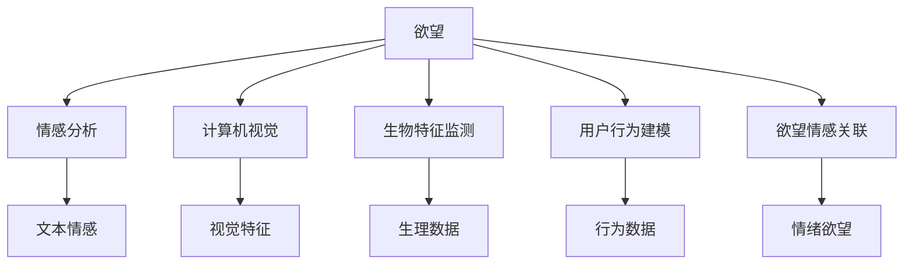

                 

# 欲望的可视化：AI呈现内心世界

## 1. 背景介绍

### 1.1 问题由来

在当今信息爆炸的时代，人类对数据和信息的处理能力达到了前所未有的高度。人们不仅需要通过传统方式了解外部世界的变化，也开始关注自己的内心世界，希望通过数据科学来揭示自身的欲望、情感和行为模式。欲望可视化（Desire Visualization）作为一种新兴的技术，旨在通过AI手段，将人的内在需求和愿望转化为可直观呈现的图像、视频或文字，使我们能够更深刻地理解自己，同时也为心理健康、消费行为分析等领域提供新的应用场景。

### 1.2 问题核心关键点

欲望可视化技术的核心在于如何将个体的欲望和偏好，通过某种算法和模型，转化为可量化、可观测的形式。目前，该领域的研究主要集中在以下几个方面：

1. **情感分析**：通过自然语言处理(NLP)技术，分析用户的文本描述或社交媒体内容，提取其中的情感倾向和欲望表达。
2. **视觉识别**：利用计算机视觉技术，从图片、视频中识别用户的面部表情、姿势、环境背景等信息，以判断其当前的心理状态和欲望水平。
3. **生物特征监测**：通过生物传感器收集用户的生理数据（如心率、皮肤电反应等），分析其情绪波动和欲望变化。
4. **用户行为建模**：通过数据分析和机器学习技术，建立用户行为模型，预测其未来的欲望和需求。
5. **欲望情感关联**：探索欲望和情感之间的复杂关系，揭示不同情境下欲望的变化规律。

### 1.3 问题研究意义

欲望可视化技术不仅具有重要的理论价值，还具备广阔的应用前景：

1. **心理健康**：帮助个体更好地理解自己的情绪和欲望，促进心理健康，预防心理疾病。
2. **消费行为**：分析消费者的欲望和偏好，优化产品设计和市场策略，提升用户体验和满意度。
3. **教育和培训**：通过了解学生的欲望和兴趣，设计更加有效的教学内容和培训方案，提高学习效果。
4. **社会治理**：分析社会大众的欲望和需求，为政策制定和公共管理提供依据，促进社会和谐稳定。
5. **智慧城市**：通过欲望数据的收集和分析，提升城市的智能化水平，提高城市管理的效率和质量。

## 2. 核心概念与联系

### 2.1 核心概念概述

为更好地理解欲望可视化技术，本节将介绍几个密切相关的核心概念：

- **欲望**：指个体内心深处对某种事物或体验的强烈需求和渴望。欲望可以是物质性的，也可以是精神性的。
- **情感分析**：通过文本挖掘、机器学习等技术，自动分析文本中的情感倾向，识别其中的欲望表达。
- **计算机视觉**：使用计算机和算法，分析和理解图像、视频中的视觉信息，提取特征以描述个体状态和环境。
- **生物特征监测**：通过传感器收集生理数据，量化个体的心理状态和欲望水平。
- **用户行为建模**：使用数据分析和机器学习技术，构建用户行为模型，预测和分析欲望变化。
- **欲望情感关联**：探索欲望与情感之间的相互作用，揭示情绪对欲望的影响和欲望对情绪的反作用。

这些概念之间的逻辑关系可以通过以下Mermaid流程图来展示：



这个流程图展示了我欲望可视化技术中各个核心概念的相互关系：

1. 欲望是所有研究和应用的核心，通过情感分析、计算机视觉、生物特征监测、用户行为建模和欲望情感关联等技术手段，对欲望进行多维度的分析和可视化。
2. 情感分析通过文本挖掘识别文本中的情感倾向，计算机视觉和生物特征监测分别从视觉和生理数据中提取特征，用户行为建模利用行为数据建立模型预测欲望，欲望情感关联探索欲望与情感之间的复杂关系。
3. 这些技术手段相互结合，共同构建了欲望可视化的技术框架。

## 3. 核心算法原理 & 具体操作步骤

### 3.1 算法原理概述

欲望可视化技术的核心算法基于多模态数据分析和深度学习。其基本原理是通过对个体在多种情境下产生的各种数据（如文本、图像、生理信号等）进行综合分析，建立欲望模型，并通过可视化的方式呈现欲望。

形式化地，设个体在情境 $s_i$ 下的欲望为 $d_i$，对应的多模态数据为 $\mathbf{X}_i=(x_{1,i}, x_{2,i}, x_{3,i},...)$，其中 $x_{k,i}$ 表示第 $k$ 种模态数据。我们的目标是找到一个映射函数 $f$，使得 $d_i=f(\mathbf{X}_i)$。通过训练深度神经网络，可以将多模态数据映射为欲望值，从而实现欲望的可视化。

### 3.2 算法步骤详解

欲望可视化技术的算法步骤包括数据收集、特征提取、欲望建模和结果可视化四个环节。

1. **数据收集**：通过问卷调查、社交媒体数据、传感器数据等手段，收集个体在多个情境下的多模态数据。
2. **特征提取**：对收集到的数据进行预处理，提取有意义的特征，如情感倾向、面部表情、生理指标等。
3. **欲望建模**：使用深度学习模型（如卷积神经网络、循环神经网络等）训练欲望模型，将多模态特征映射为欲望值。
4. **结果可视化**：将训练得到的欲望值通过图像、图表等形式呈现，帮助个体或研究者理解欲望变化。

### 3.3 算法优缺点

欲望可视化技术在数据驱动的欲望分析方面具有显著优势：

**优点**：
- **全面性**：通过多种数据源的综合分析，可以全面地揭示个体的欲望。
- **实时性**：结合生物传感器，可以实时监测个体的欲望变化。
- **可解释性**：通过可视化呈现，使得欲望分析结果更易于理解和接受。

**缺点**：
- **隐私问题**：多模态数据的收集和使用涉及到隐私保护，需要严格的数据安全和隐私保护措施。
- **模型复杂性**：深度学习模型需要大量的数据和计算资源，训练过程复杂。
- **依赖数据质量**：数据质量和数据完整性直接影响模型效果，数据处理和清洗工作量大。

### 3.4 算法应用领域

欲望可视化技术在多个领域具有广泛的应用前景：

- **心理健康**：通过分析患者的欲望数据，结合情感分析，辅助心理健康评估和治疗。
- **消费行为分析**：通过分析消费者的欲望和偏好，优化产品设计和市场策略，提升用户体验。
- **教育**：分析学生的欲望和兴趣，设计个性化的学习内容和教学方案，提高学习效果。
- **企业人力资源**：通过分析员工的欲望和需求，优化招聘、培训和激励机制，提升员工满意度。
- **智慧城市**：通过分析居民的欲望数据，优化城市服务和公共设施，提升城市管理水平。

## 4. 数学模型和公式 & 详细讲解 & 举例说明（备注：数学公式请使用latex格式，latex嵌入文中独立段落使用 $$，段落内使用 $)
### 4.1 数学模型构建

本节将使用数学语言对欲望可视化技术进行更加严格的刻画。

设个体在情境 $s_i$ 下的欲望为 $d_i$，对应的多模态数据为 $\mathbf{X}_i=(x_{1,i}, x_{2,i}, x_{3,i},...)$，其中 $x_{k,i}$ 表示第 $k$ 种模态数据。

我们的目标是找到一个映射函数 $f$，使得 $d_i=f(\mathbf{X}_i)$。

假设 $f$ 是一个深度神经网络，由输入层、隐藏层和输出层组成，其中隐藏层包含 $n$ 个神经元。设输入特征向量为 $\mathbf{x}_i=(x_{1,i}, x_{2,i},...,x_{m,i})$，隐藏层输出为 $\mathbf{h}_i$，输出层输出为 $d_i$。

根据深度学习的反向传播算法，网络参数 $\theta$ 的更新公式为：

$$
\theta \leftarrow \theta - \eta \nabla_{\theta}\mathcal{L}(\theta)
$$

其中，$\eta$ 为学习率，$\mathcal{L}$ 为损失函数，通常采用均方误差损失或交叉熵损失。

### 4.2 公式推导过程

以下我们以情感分析为例，推导深度神经网络用于欲望建模的过程。

假设个体在情境 $s_i$ 下的情感倾向为 $y_i$，对应的文本描述为 $x_{1,i}$。我们使用深度神经网络对文本进行情感分析，提取情感特征，建立情感-欲望模型 $f$。

设情感分类器为一个二分类逻辑回归模型，输出情感倾向 $y_i$。其损失函数为交叉熵损失，即：

$$
\mathcal{L}(y_i,\hat{y}_i) = -[y_i\log \hat{y}_i + (1-y_i)\log(1-\hat{y}_i)]
$$

其中 $\hat{y}_i$ 为模型的预测情感倾向。

模型的训练目标是最小化交叉熵损失，即：

$$
\theta^* = \mathop{\arg\min}_{\theta} \sum_{i=1}^N \mathcal{L}(y_i,\hat{y}_i)
$$

通过反向传播算法，求得模型参数 $\theta$ 的梯度，并更新模型权重。重复上述过程直至收敛，得到适应于情感-欲望建模的深度神经网络。

### 4.3 案例分析与讲解

假设我们有一组社交媒体数据，包含用户在不同情境下的情感描述和欲望表达。通过对文本进行情感分析，提取出情感特征 $f_1, f_2,...,f_m$，作为模型的输入。使用一个三层的卷积神经网络（CNN）进行欲望建模，其中第一层为卷积层，第二层为池化层，第三层为全连接层。

设卷积核大小为 $3 \times 3$，步幅为 $1$，激活函数为ReLU，隐藏层神经元数量为 $64$，输出层神经元数量为 $1$。模型的损失函数采用均方误差损失，学习率为 $0.001$。

通过数据集 $D=\{(x_{1,i},y_i)\}_{i=1}^N$ 进行训练，得到模型的欲望预测结果 $d_i$。具体步骤如下：

1. **数据预处理**：将文本描述 $x_{1,i}$ 转换为词向量，并添加padding，确保所有样本的输入长度一致。
2. **模型构建**：定义卷积神经网络，并设置损失函数和优化器。
3. **训练模型**：使用数据集 $D$ 对模型进行训练，调整网络参数以最小化损失函数。
4. **结果可视化**：将训练好的模型应用于新情境下的数据，输出欲望预测结果，并通过图像或图表呈现。

## 5. 项目实践：代码实例和详细解释说明
### 5.1 开发环境搭建

在进行欲望可视化技术开发前，我们需要准备好开发环境。以下是使用Python进行TensorFlow开发的环境配置流程：

1. 安装Anaconda：从官网下载并安装Anaconda，用于创建独立的Python环境。

2. 创建并激活虚拟环境：
```bash
conda create -n desire-env python=3.8 
conda activate desire-env
```

3. 安装TensorFlow：根据CUDA版本，从官网获取对应的安装命令。例如：
```bash
conda install tensorflow -c conda-forge -c pytorch
```

4. 安装Keras和TensorBoard：
```bash
conda install keras tensorboard
```

5. 安装各类工具包：
```bash
pip install numpy pandas scikit-learn matplotlib tqdm jupyter notebook ipython
```

完成上述步骤后，即可在`desire-env`环境中开始欲望可视化技术的开发实践。

### 5.2 源代码详细实现

下面我们以情感分析为例，给出使用TensorFlow进行情感-欲望建模的Python代码实现。

首先，定义情感分类器的输入和输出：

```python
from tensorflow.keras import layers

input_shape = (None, embedding_dim)
output_dim = 1
```

然后，构建卷积神经网络模型：

```python
model = layers.Sequential([
    layers.Embedding(vocab_size, embedding_dim, input_length=maxlen),
    layers.Conv1D(32, 3, activation='relu'),
    layers.MaxPooling1D(pool_size=2),
    layers.Dropout(0.2),
    layers.Flatten(),
    layers.Dense(64, activation='relu'),
    layers.Dense(output_dim, activation='sigmoid')
])
```

接着，定义训练和评估函数：

```python
import numpy as np
from tensorflow.keras.optimizers import Adam

def compile_model(model, loss='binary_crossentropy'):
    model.compile(optimizer=Adam(lr=learning_rate), loss=loss, metrics=['accuracy'])

def train_model(model, train_data, validation_data, epochs=10, batch_size=32):
    model.fit(train_data, epochs=epochs, batch_size=batch_size, validation_data=validation_data)

def evaluate_model(model, test_data):
    return model.evaluate(test_data)

# 数据预处理
# 将文本转换为词向量，并添加padding
# 将标签转换为二值向量

# 训练模型
# 调整模型参数以最小化损失函数

# 评估模型
# 计算模型在测试集上的准确率
```

最后，启动训练流程并在测试集上评估：

```python
# 设定学习率和迭代次数
learning_rate = 0.001
epochs = 10

# 定义损失函数
loss = 'binary_crossentropy'

# 初始化模型
model = layers.Sequential([
    layers.Embedding(vocab_size, embedding_dim, input_length=maxlen),
    layers.Conv1D(32, 3, activation='relu'),
    layers.MaxPooling1D(pool_size=2),
    layers.Dropout(0.2),
    layers.Flatten(),
    layers.Dense(64, activation='relu'),
    layers.Dense(output_dim, activation='sigmoid')
])

# 编译模型
compile_model(model, loss)

# 训练模型
train_model(model, train_data, validation_data, epochs=epochs, batch_size=32)

# 评估模型
evaluate_model(model, test_data)
```

以上就是使用TensorFlow进行情感-欲望建模的完整代码实现。可以看到，通过Keras的高级API，我们可以用相对简洁的代码完成模型的构建、训练和评估。

### 5.3 代码解读与分析

让我们再详细解读一下关键代码的实现细节：

**输入输出定义**：
- `input_shape`：输入特征向量的形状，即文本向量的维度。
- `output_dim`：输出层的神经元数量，表示情感分类器的输出维度。

**模型构建**：
- `layers.Embedding`：将文本转换为词向量，作为模型的输入。
- `layers.Conv1D`：定义卷积层，提取文本中的局部特征。
- `layers.MaxPooling1D`：定义池化层，对卷积层的输出进行下采样。
- `layers.Dropout`：加入dropout层，防止过拟合。
- `layers.Flatten`：将池化层的输出展平，准备输入全连接层。
- `layers.Dense`：定义全连接层，输出情感分类器的结果。

**训练和评估函数**：
- `compile_model`：定义模型编译步骤，设置损失函数和优化器。
- `train_model`：定义模型训练过程，调整网络参数以最小化损失函数。
- `evaluate_model`：定义模型评估过程，计算模型在测试集上的准确率。

**数据预处理**：
- 将文本转换为词向量，并添加padding，确保所有样本的输入长度一致。
- 将标签转换为二值向量，适应二分类问题的需求。

**训练流程**：
- 设定学习率和迭代次数，初始化模型。
- 使用数据集对模型进行训练，调整网络参数以最小化损失函数。
- 在测试集上评估模型，输出模型在测试集上的准确率。

可以看到，TensorFlow提供的高级API大大简化了模型的构建和训练过程，开发者可以更专注于算法的创新和优化。

## 6. 实际应用场景

### 6.1 心理健康

欲望可视化技术在心理健康领域具有重要应用。通过分析患者的情感和欲望数据，可以辅助心理健康评估和治疗，为心理医生提供决策支持。例如，通过分析患者的社交媒体帖子，识别其负面情绪和欲望，帮助医生及时发现患者的心理问题，并提供相应的心理辅导和治疗方案。

**案例分析**：某精神健康应用平台收集用户在其情感波动较大的时刻发布的社交媒体帖子，使用深度学习模型分析其情感倾向和欲望表达，发现用户存在抑郁、焦虑等心理问题。系统根据分析结果，自动推送心理健康教育资源，并建议用户寻求专业心理医生的帮助。

### 6.2 消费行为分析

欲望可视化技术在消费行为分析方面也有广泛应用。通过分析消费者的情感和欲望数据，可以优化产品设计和市场策略，提升用户体验和满意度。例如，通过分析消费者对某品牌产品的欲望，设计更具吸引力的产品广告和营销活动，吸引消费者购买。

**案例分析**：某电商平台通过分析用户在购买前的社交媒体评论和评论情感，发现用户对某款手机的欲望强烈，但也对价格较为敏感。系统根据分析结果，调整该手机的定价策略，并在广告中突出产品的性价比，成功提高销售额。

### 6.3 教育

欲望可视化技术在教育领域也有重要应用。通过分析学生的情感和欲望数据，可以设计个性化的学习内容和教学方案，提高学习效果。例如，通过分析学生的社交媒体数据，发现其在某个学科的兴趣不高，系统推荐该学科的趣味性学习资源，激发学生的学习兴趣。

**案例分析**：某在线教育平台通过分析学生在平台上的学习行为和情感数据，发现部分学生在数学学科上存在困难。系统根据分析结果，推送针对性的辅导视频和练习题，帮助学生克服困难，提高数学成绩。

### 6.4 未来应用展望

随着欲望可视化技术的不断发展，未来将有以下几个主要方向：

1. **多模态数据融合**：结合图像、视频、生理数据等多种模态信息，构建更加全面、准确的欲望模型。
2. **实时监测与预警**：结合生物传感器，实现对个体欲望的实时监测，及时发现和预警潜在心理问题。
3. **个性化推荐系统**：通过欲望分析，构建个性化的推荐系统，提升用户体验和满意度。
4. **社会治理应用**：分析社会大众的欲望和需求，优化公共服务和社会治理策略。
5. **智慧城市应用**：结合欲望数据，优化城市服务和公共设施，提升城市管理水平。

## 7. 工具和资源推荐
### 7.1 学习资源推荐

为了帮助开发者系统掌握欲望可视化技术的理论基础和实践技巧，这里推荐一些优质的学习资源：

1. 《深度学习与情感分析》系列博文：由深度学习专家撰写，介绍了情感分析的基本概念和深度学习模型的实现。

2. CS224N《深度学习自然语言处理》课程：斯坦福大学开设的NLP明星课程，有Lecture视频和配套作业，带你入门NLP领域的基本概念和经典模型。

3. 《自然语言处理实战》书籍：介绍自然语言处理技术的基本原理和实现方法，包括文本情感分析和欲望建模。

4. 《Python深度学习》书籍：讲解深度学习在Python中的实现，包括卷积神经网络、循环神经网络等。

5. 《TensorFlow实战》书籍：深入介绍TensorFlow的高级API和深度学习模型的实现。

通过对这些资源的学习实践，相信你一定能够快速掌握欲望可视化技术的精髓，并用于解决实际的情感和欲望问题。

### 7.2 开发工具推荐

高效的开发离不开优秀的工具支持。以下是几款用于欲望可视化技术开发的常用工具：

1. Python：作为深度学习的主流编程语言，Python提供了丰富的科学计算库和深度学习框架，如TensorFlow、Keras等。
2. TensorFlow：由Google主导开发的开源深度学习框架，生产部署方便，适合大规模工程应用。
3. Keras：一个高级深度学习API，可以无缝集成TensorFlow等深度学习框架，简化模型构建和训练过程。
4. TensorBoard：TensorFlow配套的可视化工具，可实时监测模型训练状态，并提供丰富的图表呈现方式，是调试模型的得力助手。
5. Weights & Biases：模型训练的实验跟踪工具，可以记录和可视化模型训练过程中的各项指标，方便对比和调优。

合理利用这些工具，可以显著提升欲望可视化技术的开发效率，加快创新迭代的步伐。

### 7.3 相关论文推荐

欲望可视化技术的发展源于学界的持续研究。以下是几篇奠基性的相关论文，推荐阅读：

1. Sentiment Analysis with Deep Learning（2013年）：提出基于深度学习的情感分析方法，为欲望可视化提供了情感分析的技术基础。
2. Convolutional Neural Networks for Sentiment Analysis（2014年）：介绍卷积神经网络在情感分析中的应用，提升了情感分析的精度和鲁棒性。
3. Attention Mechanisms in Transformers（2018年）：介绍Transformer模型在自然语言处理中的应用，推动了深度学习在情感分析中的发展。
4. Multimodal Sentiment Analysis（2017年）：探讨多模态情感分析技术，为欲望可视化提供了多模态数据融合的方法。
5. Real-time Monitoring of Mood and Arousal in Social Media（2015年）：介绍使用生物传感器进行情绪监测的方法，为欲望可视化提供了生理数据的监测手段。

这些论文代表了大欲望可视化技术的发展脉络。通过学习这些前沿成果，可以帮助研究者把握学科前进方向，激发更多的创新灵感。

## 8. 总结：未来发展趋势与挑战

### 8.1 总结

本文对欲望可视化技术进行了全面系统的介绍。首先阐述了欲望可视化的背景和意义，明确了该技术在心理健康、消费行为分析、教育、智慧城市等多个领域的应用价值。其次，从原理到实践，详细讲解了欲望可视化的数学模型和关键算法，给出了具体的代码实例。最后，本文还探讨了欲望可视化技术在实际应用中的案例分析，展望了未来的发展趋势。

通过本文的系统梳理，可以看到，欲望可视化技术正在成为情感和欲望分析的重要手段，为个体心理健康、消费行为优化、教育个性化、智慧城市建设等领域带来了新的可能性。欲望可视化技术的不断发展，将进一步提升我们对人性的理解，优化社会资源配置，构建更加智慧和谐的未来。

### 8.2 未来发展趋势

展望未来，欲望可视化技术将呈现以下几个发展趋势：

1. **多模态融合**：结合图像、视频、生理数据等多种模态信息，构建更加全面、准确的欲望模型。
2. **实时监测与预警**：结合生物传感器，实现对个体欲望的实时监测，及时发现和预警潜在心理问题。
3. **个性化推荐系统**：通过欲望分析，构建个性化的推荐系统，提升用户体验和满意度。
4. **社会治理应用**：分析社会大众的欲望和需求，优化公共服务和社会治理策略。
5. **智慧城市应用**：结合欲望数据，优化城市服务和公共设施，提升城市管理水平。

### 8.3 面临的挑战

尽管欲望可视化技术已经取得了初步进展，但在迈向更加智能化、普适化应用的过程中，仍面临以下挑战：

1. **隐私保护**：多模态数据的收集和使用涉及到隐私保护，需要严格的数据安全和隐私保护措施。
2. **模型复杂性**：深度学习模型需要大量的数据和计算资源，训练过程复杂。
3. **依赖数据质量**：数据质量和数据完整性直接影响模型效果，数据处理和清洗工作量大。
4. **实时性**：结合生物传感器进行实时监测，需要高精度的传感器和高效的算法。
5. **伦理道德**：在欲望分析过程中，如何保护用户的隐私和自由意志，避免对个体造成不必要的干预，是重要的问题。

### 8.4 研究展望

面对欲望可视化技术面临的种种挑战，未来的研究需要在以下几个方面寻求新的突破：

1. **隐私保护技术**：开发更为安全、高效的隐私保护算法，确保欲望数据的匿名性和安全性。
2. **多模态融合方法**：研究多模态数据的深度融合技术，提升欲望模型的准确性和鲁棒性。
3. **实时监测算法**：开发高效、低延迟的实时监测算法，确保欲望数据的实时性和可靠性。
4. **伦理道德研究**：在欲望分析过程中，研究如何保护用户的隐私和自由意志，避免对个体造成不必要的干预。
5. **应用落地技术**：研究如何将欲望可视化技术转化为实际应用，解决数据收集、模型训练、系统部署等技术问题。

这些研究方向的探索，必将引领欲望可视化技术迈向更高的台阶，为构建安全、可靠、可解释、可控的智能系统铺平道路。面向未来，欲望可视化技术还需要与其他人工智能技术进行更深入的融合，如知识表示、因果推理、强化学习等，多路径协同发力，共同推动自然语言理解和智能交互系统的进步。只有勇于创新、敢于突破，才能不断拓展语言模型的边界，让智能技术更好地造福人类社会。

## 9. 附录：常见问题与解答

**Q1：欲望可视化技术是否适用于所有应用场景？**

A: 欲望可视化技术在许多应用场景中具有广泛的应用前景，如心理健康、消费行为分析、教育、智慧城市等。但某些特定领域的应用，如军事、法律等，可能需要更为严格的隐私保护和数据安全措施，才能保证技术的适用性。

**Q2：如何平衡欲望可视化技术与用户隐私保护？**

A: 在欲望可视化技术的开发和应用过程中，隐私保护是不可忽视的重要问题。以下是一些平衡欲望可视化技术与用户隐私保护的方法：
1. **匿名化处理**：在数据收集和处理过程中，使用数据匿名化技术，去除敏感信息。
2. **差分隐私**：在数据分析过程中，使用差分隐私算法，限制数据泄露风险。
3. **用户同意机制**：在数据收集和使用过程中，确保用户知情并同意，提供隐私保护选择权。
4. **数据去标识化**：在数据分析和可视化过程中，使用数据去标识化技术，限制个体身份信息的泄露。

**Q3：欲望可视化技术如何处理多模态数据？**

A: 多模态数据融合是欲望可视化技术的重要方向。以下是一些处理多模态数据的方法：
1. **特征提取**：通过预处理和特征提取，将不同模态的数据转换为统一的特征表示。
2. **深度融合**：使用深度学习模型，如多模态卷积神经网络，融合不同模态的数据，构建更加全面的欲望模型。
3. **迁移学习**：在不同模态数据之间进行迁移学习，利用已有模型的知识和特征，提升新模态数据的分析能力。
4. **联合训练**：将不同模态的数据联合训练，共同优化欲望模型，提高模型的鲁棒性和泛化能力。

**Q4：欲望可视化技术如何应用于智慧城市？**

A: 欲望可视化技术在智慧城市建设中具有重要应用前景。以下是一些具体的应用场景：
1. **公共服务优化**：通过分析居民的欲望和需求，优化公共服务和公共设施，提升城市管理水平。
2. **交通流量预测**：通过分析居民的出行欲望和行为数据，预测交通流量，优化交通管理。
3. **环境监测**：通过分析居民的环境需求和偏好，优化城市环境建设，提升居民的生活质量。
4. **应急响应**：通过分析公众在紧急情况下的欲望和需求，优化应急响应策略，提升应急管理能力。

**Q5：欲望可视化技术在教育领域的应用有哪些？**

A: 欲望可视化技术在教育领域具有重要应用价值。以下是一些具体的应用场景：
1. **学习内容推荐**：通过分析学生的欲望和兴趣，推荐个性化的学习内容，提高学习效果。
2. **学习效果评估**：通过分析学生的情感和欲望数据，评估学生的学习效果和心理状态，提供个性化的学习建议。
3. **课堂管理**：通过分析学生的欲望和行为数据，优化课堂管理，提高教学质量。
4. **作业批改**：通过分析学生的作业和欲望数据，自动批改作业，提供个性化的反馈。

**Q6：欲望可视化技术如何保护用户的隐私和自由意志？**

A: 在欲望可视化技术的开发和应用过程中，保护用户的隐私和自由意志是重要的问题。以下是一些保护隐私和自由意志的方法：
1. **匿名化处理**：在数据收集和处理过程中，使用数据匿名化技术，去除敏感信息。
2. **差分隐私**：在数据分析过程中，使用差分隐私算法，限制数据泄露风险。
3. **用户同意机制**：在数据收集和使用过程中，确保用户知情并同意，提供隐私保护选择权。
4. **数据去标识化**：在数据分析和可视化过程中，使用数据去标识化技术，限制个体身份信息的泄露。

这些方法可以有效地保护用户的隐私和自由意志，确保欲望可视化技术的公正和透明。

---

作者：禅与计算机程序设计艺术 / Zen and the Art of Computer Programming

