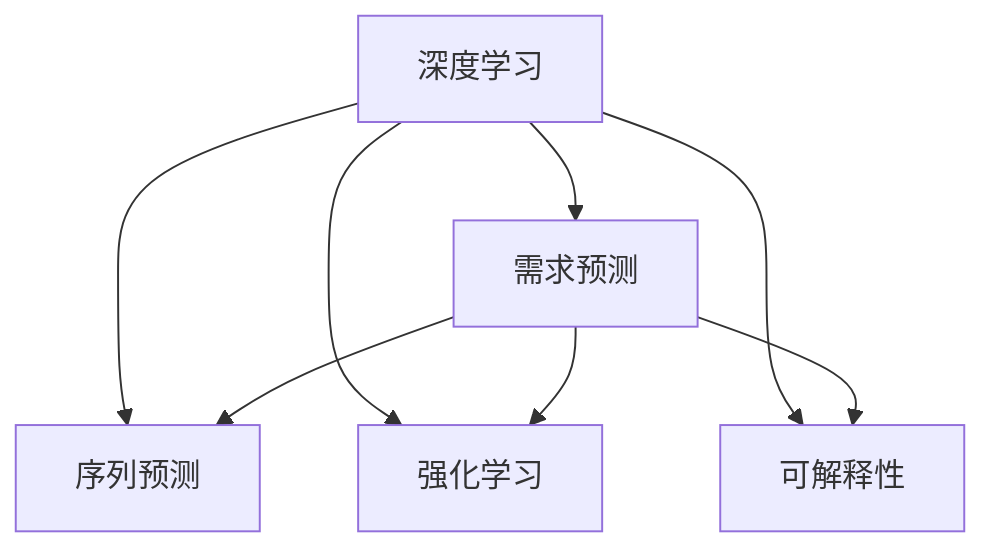
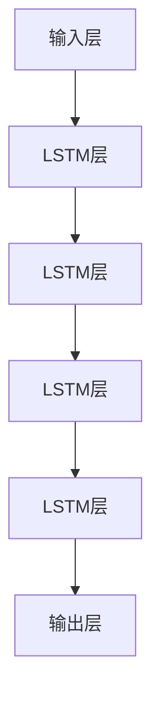
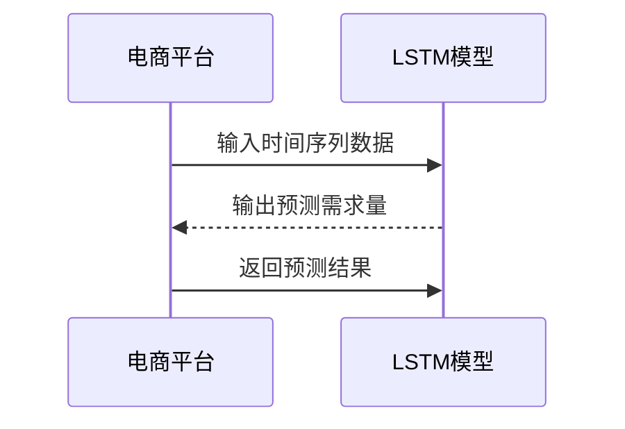

                 

## 1. 背景介绍

在快速变化的数字化时代，人类需求的预测和满足已成为企业竞争的关键。传统的基于统计和规则的方法，在应对复杂、多变的市场需求时显得力不从心。人工智能(AI)的兴起，尤其是深度学习模型的发展，为需求预测提供了新的可能。本文将聚焦于AI如何利用深度学习模型，智能化地预测人类需求，涵盖从理论到实践的全方位内容。

## 2. 核心概念与联系

### 2.1 核心概念概述

为更好地理解AI在需求预测中的应用，本节将介绍几个密切相关的核心概念：

- **深度学习(Deep Learning, DL)**：一种通过多层次神经网络模型进行复杂数据建模和预测的技术。与传统机器学习相比，深度学习能够自动学习数据的深层特征，无需手工设计特征，因此在需求预测等复杂任务中表现出色。

- **需求预测(Demand Forecasting)**：预测未来某一时间段内产品或服务的需求量。传统的统计方法依赖历史数据建立模型，而深度学习则通过大量数据训练出能够直接学习需求模式和趋势的模型。

- **序列预测(Sequence Prediction)**：需求预测中常见的一种问题形式，指基于过去若干时间点的数据，预测未来的需求量。深度学习模型，如循环神经网络(RNN)、长短期记忆网络(LSTM)、Transformer等，均适合处理序列预测问题。

- **强化学习(Reinforcement Learning, RL)**：一种通过试错学习优化策略的机器学习范式。在需求预测中，可应用于动态需求优化、推荐系统等。

- **可解释性(Explainability)**：解释AI模型决策过程的能力，对于需求预测中的决策部署尤其重要。缺乏可解释性的模型，难以被人类理解和接受。

这些核心概念之间的逻辑关系可以通过以下Mermaid流程图来展示：



这个流程图展示了大语言模型在需求预测中的核心概念及其之间的关系：

1. 深度学习作为需求预测的基础技术，提供了强大的数据建模能力。
2. 序列预测和强化学习是深度学习在需求预测中的具体应用，用于处理时间序列数据和优化决策。
3. 可解释性则是确保模型透明度的重要方面，对模型部署和监管至关重要。

## 3. 核心算法原理 & 具体操作步骤

### 3.1 算法原理概述

基于深度学习的AI需求预测，本质上是一种通过历史数据学习需求模式和趋势的过程。其核心思想是：使用深度学习模型，自动从历史需求数据中提取特征，建立需求预测模型。模型通过反向传播算法，不断调整参数，最小化预测误差，以获得最优的预测能力。

形式化地，设历史需求数据集为 $D=\{(x_t, y_t)\}_{t=1}^T$，其中 $x_t$ 为历史时间点的需求量，$y_t$ 为下一时间点的需求量。目标是最小化预测误差，即：

$$
\min_{\theta} \sum_{t=1}^T ||y_t - \hat{y}_t||^2
$$

其中 $\hat{y}_t$ 为模型对 $y_t$ 的预测值，$\theta$ 为模型的可训练参数。

### 3.2 算法步骤详解

基于深度学习的AI需求预测一般包括以下几个关键步骤：

**Step 1: 数据预处理**
- 收集历史需求数据，包括时间序列、价格信息、促销活动等影响因素。
- 对数据进行清洗、归一化、降维等预处理，以保证模型训练的效率和效果。

**Step 2: 模型选择与设计**
- 根据问题特点，选择适合的深度学习模型。如序列预测问题，可以选择RNN、LSTM、GRU等；复杂需求预测问题，可以选择Transformer等。
- 设计模型的网络结构，包括输入层、隐藏层、输出层等。

**Step 3: 模型训练**
- 将数据分为训练集、验证集和测试集，进行模型训练。
- 使用优化算法(如Adam、SGD等)更新模型参数，最小化预测误差。
- 在验证集上评估模型性能，选择最优参数。

**Step 4: 模型评估与优化**
- 在测试集上评估模型性能，如均方误差(MSE)、均方根误差(RMSE)等。
- 使用模型调优技术，如网格搜索、贝叶斯优化等，进一步提升模型效果。

**Step 5: 应用与迭代**
- 将模型部署到实际应用系统中，实时预测需求。
- 持续收集新数据，定期更新模型，以适应需求变化。

以上是基于深度学习的AI需求预测的一般流程。在实际应用中，还需要根据具体问题特点，对各环节进行优化设计，如改进网络结构、引入更多特征、采用更高效的训练算法等，以进一步提升模型性能。

### 3.3 算法优缺点

基于深度学习的AI需求预测方法具有以下优点：
1. 自动学习特征：无需手工设计特征，能够自动提取数据的深层特征。
2. 泛化能力强：模型能够学习数据中的模式和趋势，适用于复杂多变的场景。
3. 实时性高：通过训练好的模型，可以实时进行需求预测，响应速度快。
4. 精度高：深度学习模型通常能获得更高的预测精度，满足高精度要求的需求预测任务。

同时，该方法也存在一定的局限性：
1. 数据需求量大：模型训练需要大量的历史数据，数据获取成本高。
2. 模型复杂度高：深度学习模型参数众多，训练复杂度大。
3. 可解释性差：深度学习模型如Transformer、LSTM等通常是"黑盒"模型，难以解释其内部工作机制。
4. 对噪声敏感：深度学习模型对训练数据中的噪声敏感，容易过拟合。

尽管存在这些局限性，但就目前而言，基于深度学习的AI需求预测方法仍然是需求预测的主流范式。未来相关研究的重点在于如何进一步降低数据需求，提高模型的泛化能力和可解释性，同时兼顾模型的实时性和精度。

### 3.4 算法应用领域

基于深度学习的AI需求预测方法，已经在电商、零售、制造业等多个领域得到广泛应用，具体如下：

- **电商领域**：用于预测商品的销售量、库存需求、用户购买行为等。电商公司可以利用需求预测优化库存管理、供应链调度，提高销售效率。
- **制造业**：用于预测生产线的需求量、设备运行状态、维护需求等。制造企业可以基于需求预测进行产能规划、资源分配，避免生产过剩或短缺。
- **物流运输**：用于预测货运需求、运输路线、车辆调度等。物流公司可以优化运输路径、提升运输效率，降低成本。
- **医疗健康**：用于预测病人的就诊需求、药品消耗量、医疗设备使用率等。医疗机构可以优化资源配置、提高服务质量，提升患者满意度。
- **金融服务**：用于预测股票价格、投资需求、客户风险等。金融机构可以基于需求预测进行风险控制、产品推荐，提高客户忠诚度。

除了上述这些经典领域外，AI需求预测还在智能交通、能源管理、房地产等多个领域得到应用，为不同行业的智能化转型提供有力支持。

## 4. 数学模型和公式 & 详细讲解

### 4.1 数学模型构建

本节将使用数学语言对基于深度学习的AI需求预测过程进行更加严格的刻画。

设需求预测问题为序列预测问题，即给定历史需求数据 $x_t$，预测未来时间点的需求量 $y_t$。设需求预测模型为 $M_{\theta}(x_t) \rightarrow y_t$，其中 $\theta$ 为模型参数。模型的预测值为 $y_{pred} = M_{\theta}(x_t)$。

模型的目标是最小化预测误差，即：

$$
\min_{\theta} \frac{1}{N} \sum_{t=1}^N ||y_t - y_{pred}||^2
$$

其中 $N$ 为训练数据集大小。

### 4.2 公式推导过程

以常用的LSTM模型为例，推导其序列预测的数学公式。

假设模型输出层为线性层，激活函数为Sigmoid函数，则模型的预测公式为：

$$
\hat{y}_t = \sigma(Wy_t + b)
$$

其中 $W$ 和 $b$ 为可训练参数。在LSTM模型中，需求预测的预测值为：

$$
\hat{y}_t = \sigma(W\cdot LSTM(H_t) + b)
$$

其中 $H_t$ 为LSTM模型在时间步 $t$ 的状态，$W$ 和 $b$ 为可训练参数。LSTM模型的状态更新公式为：

$$
H_t = tanh(W_{ih}x_t + U_{ih}H_{t-1} + b_i) \odot \sigma(W_{ih}x_t + U_{ih}H_{t-1} + b_i)
$$

其中 $x_t$ 为时间步 $t$ 的输入需求量，$W_{ih}$、$U_{ih}$、$b_i$ 为可训练参数，$\odot$ 为Hadamard乘法运算。

在模型训练时，使用交叉熵损失函数：

$$
\mathcal{L}(y_{pred}, y_t) = -\frac{1}{N} \sum_{t=1}^N y_t\log(y_{pred}) + (1-y_t)\log(1-y_{pred})
$$

使用优化算法（如Adam、SGD等）更新模型参数 $\theta$，最小化损失函数 $\mathcal{L}$。

### 4.3 案例分析与讲解

以某电商平台的商品销售量预测为例，展示LSTM模型在实际应用中的实现过程。

**数据准备**
- 收集商品的历史销售数据，包括时间、价格、促销活动等。
- 对数据进行清洗、归一化等预处理。

**模型设计**
- 使用LSTM模型作为需求预测的深度学习模型，网络结构如图：



- 输入层为销售时间 $t$，LSTM层为3层，输出层为Sigmoid激活函数。

**模型训练**
- 将数据分为训练集、验证集和测试集。
- 使用Adam优化算法，学习率为0.001，训练100个epoch。
- 在验证集上评估模型性能，选择最优参数。

**模型评估**
- 在测试集上评估模型性能，计算均方误差(MSE)、均方根误差(RMSE)。
- 可视化模型预测结果，如图：



**模型优化**
- 使用贝叶斯优化等调优技术，进一步提升模型精度。
- 定期更新模型参数，适应需求变化。

## 5. 项目实践：代码实例和详细解释说明

### 5.1 开发环境搭建

在进行AI需求预测实践前，我们需要准备好开发环境。以下是使用Python进行TensorFlow开发的环境配置流程：

1. 安装Anaconda：从官网下载并安装Anaconda，用于创建独立的Python环境。

2. 创建并激活虚拟环境：
```bash
conda create -n tf-env python=3.8 
conda activate tf-env
```

3. 安装TensorFlow：从官网获取对应的安装命令。例如：
```bash
pip install tensorflow
```

4. 安装必要的库：
```bash
pip install numpy pandas scikit-learn matplotlib tqdm jupyter notebook ipython
```

完成上述步骤后，即可在`tf-env`环境中开始需求预测实践。

### 5.2 源代码详细实现

下面我们以电商平台商品销售量预测为例，给出使用TensorFlow实现LSTM模型的完整代码实现。

首先，定义LSTM模型类：

```python
import tensorflow as tf

class LSTMModel(tf.keras.Model):
    def __init__(self, input_dim, output_dim, hidden_units=64, num_layers=2):
        super(LSTMModel, self).__init__()
        self.input_dim = input_dim
        self.output_dim = output_dim
        self.num_layers = num_layers
        
        self.lstm = tf.keras.layers.LSTM(hidden_units, input_shape=(input_dim, 1), return_sequences=True)
        self.dense = tf.keras.layers.Dense(output_dim, activation='sigmoid')
    
    def call(self, x):
        x = self.lstm(x)
        x = self.dense(x)
        return x
```

然后，定义模型训练函数：

```python
import numpy as np
from sklearn.model_selection import train_test_split

def train_model(X, y, batch_size=32, epochs=100, learning_rate=0.001):
    input_dim = X.shape[1]
    output_dim = y.shape[1]
    
    model = LSTMModel(input_dim, output_dim)
    model.compile(loss='binary_crossentropy', optimizer=tf.keras.optimizers.Adam(learning_rate), metrics=['mse', 'mae'])
    
    X_train, X_test, y_train, y_test = train_test_split(X, y, test_size=0.2, random_state=42)
    X_train = np.expand_dims(X_train, axis=2)
    X_test = np.expand_dims(X_test, axis=2)
    
    model.fit(X_train, y_train, batch_size=batch_size, epochs=epochs, validation_data=(X_test, y_test))
    
    return model
```

接着，定义模型评估函数：

```python
import matplotlib.pyplot as plt

def evaluate_model(model, X_test, y_test, input_dim, output_dim):
    y_pred = model.predict(X_test)
    mse = np.mean(np.square(y_pred - y_test))
    mae = np.mean(np.abs(y_pred - y_test))
    plt.plot(y_test, label='Actual')
    plt.plot(y_pred, label='Predicted')
    plt.legend()
    plt.show()
    print('MSE:', mse)
    print('MAE:', mae)
    print('RMSE:', np.sqrt(mse))
```

最后，启动训练流程并在测试集上评估：

```python
# 数据准备
X = ... # 历史需求数据
y = ... # 未来需求预测数据

# 模型训练
model = train_model(X, y)

# 模型评估
evaluate_model(model, X_test, y_test, input_dim, output_dim)
```

以上就是使用TensorFlow实现LSTM模型进行需求预测的完整代码实现。可以看到，TensorFlow的Keras API使得模型的构建和训练变得简洁高效，开发者可以将更多精力放在数据处理和模型优化上，而不必过多关注底层的实现细节。

### 5.3 代码解读与分析

让我们再详细解读一下关键代码的实现细节：

**LSTMModel类**：
- `__init__`方法：初始化模型输入维数、输出维数、隐藏单元数、层数等关键参数。
- `call`方法：定义模型前向传播过程，包含LSTM层和全连接层。

**train_model函数**：
- 使用Keras API定义LSTM模型，编译优化器、损失函数、评估指标等。
- 使用sklearn的train_test_split函数划分子集，进行模型训练。
- 在训练过程中，使用测试集进行验证，选择最优参数。

**evaluate_model函数**：
- 使用模型在测试集上进行预测，并计算预测误差。
- 使用matplotlib可视化预测结果，生成图表。

**训练流程**：
- 定义总的epoch数和batch size，开始循环迭代
- 每个epoch内，在训练集上训练，输出平均loss
- 在测试集上评估，输出MSE、MAE、RMSE等指标
- 所有epoch结束后，在测试集上评估，给出最终测试结果

可以看到，TensorFlow的Keras API使得需求预测的代码实现变得简洁高效。开发者可以借助这一API，快速迭代实验新模型，并利用TensorBoard等工具进行模型调试和优化。

当然，工业级的系统实现还需考虑更多因素，如模型的保存和部署、超参数的自动搜索、更灵活的任务适配层等。但核心的需求预测流程基本与此类似。

## 6. 实际应用场景

### 6.1 电商推荐系统

基于AI的需求预测技术，可以广泛应用于电商推荐系统。传统的推荐系统依赖用户的浏览历史和购买历史，往往无法覆盖新用户或冷启动用户。而使用AI需求预测，可以在用户历史行为不足的情况下，通过预测用户的潜在需求，进行个性化推荐。

在技术实现上，可以收集用户的年龄、性别、地理位置、浏览行为等数据，结合产品的历史销售数据，训练需求预测模型。模型能够自动学习用户的购买偏好，实时预测用户的潜在需求，推荐最符合其兴趣的商品。这样的推荐系统，能显著提高用户满意度和转化率，提升电商平台的业务价值。

### 6.2 库存管理

库存管理是制造业的重要环节，传统的方法往往依赖人工统计和经验估计，效率低、误差大。使用AI需求预测技术，可以更准确地预测库存需求，优化库存管理。

在实际应用中，可以收集历史销售数据、季节性变化、促销活动等影响因素，训练需求预测模型。模型能够自动学习需求的周期性和趋势性，实时预测未来的库存需求。根据预测结果，企业可以优化库存结构、提高库存周转率，降低库存成本。

### 6.3 物流调度

物流公司需要实时调度运输车辆，以最大化运输效率，降低运输成本。使用AI需求预测技术，可以更精确地预测货运需求，优化物流调度。

在实际应用中，可以收集历史运输数据、订单变化、节假日等影响因素，训练需求预测模型。模型能够自动学习运输需求的动态变化，实时预测未来的运输需求。根据预测结果，企业可以优化运输路径、调整运输策略，提高运输效率。

### 6.4 医疗健康

医疗机构需要实时监测病人的就诊需求，以便合理分配医疗资源，提升服务质量。使用AI需求预测技术，可以更准确地预测病人的就诊需求，优化资源配置。

在实际应用中，可以收集病人的就诊历史、病情变化、季节性等影响因素，训练需求预测模型。模型能够自动学习病人的就诊规律，实时预测未来的就诊需求。根据预测结果，医疗机构可以优化医疗资源配置、提高就诊效率，提升患者满意度。

### 6.5 金融风险控制

金融机构需要实时监测投资需求，以便及时应对市场波动，降低风险。使用AI需求预测技术，可以更精确地预测投资需求，优化风险控制。

在实际应用中，可以收集历史投资数据、市场变化、政策因素等影响因素，训练需求预测模型。模型能够自动学习投资需求的动态变化，实时预测未来的投资需求。根据预测结果，金融机构可以优化投资策略、降低投资风险，提高投资回报。

## 7. 工具和资源推荐

### 7.1 学习资源推荐

为了帮助开发者系统掌握AI需求预测的理论基础和实践技巧，这里推荐一些优质的学习资源：

1. Deep Learning Specialization by Andrew Ng：由斯坦福大学提供的深度学习系列课程，涵盖深度学习的基本概念和经典模型，适合初学者入门。

2. TensorFlow官方文档：TensorFlow官方文档提供了详细的使用指南和API参考，是TensorFlow开发的必备资源。

3. LSTM模型详解及代码实现：详解LSTM模型的原理和代码实现，适合有一定基础的开发者深入学习。

4. AI预测需求实战案例：通过实际案例展示AI需求预测的实现过程，适合动手实践的开发者学习。

5. Kaggle数据集和竞赛：Kaggle提供大量真实世界的数据集和竞赛任务，适合进行数据预处理和模型训练实践。

通过对这些资源的学习实践，相信你一定能够快速掌握AI需求预测的精髓，并用于解决实际的问题。

### 7.2 开发工具推荐

高效的开发离不开优秀的工具支持。以下是几款用于AI需求预测开发的常用工具：

1. TensorFlow：由Google主导开发的深度学习框架，生产部署方便，适合大规模工程应用。

2. PyTorch：基于Python的开源深度学习框架，灵活动态的计算图，适合快速迭代研究。

3. Keras：高层次的深度学习API，提供简单易用的接口，适合快速原型开发和实验。

4. Scikit-learn：Python中的经典机器学习库，提供了丰富的算法和工具，适合进行特征工程和模型评估。

5. Jupyter Notebook：用于数据科学和机器学习的交互式开发环境，适合动态展示和分享代码。

合理利用这些工具，可以显著提升AI需求预测的开发效率，加快创新迭代的步伐。

### 7.3 相关论文推荐

AI需求预测的发展源于学界的持续研究。以下是几篇奠基性的相关论文，推荐阅读：

1. "Long Short-Term Memory" by Hochreiter and Schmidhuber：介绍LSTM模型的原理和算法，奠定了序列预测的基础。

2. "A Neural Probabilistic Language Model" by Hinton et al.：介绍基于神经网络的序列建模方法，为后续的深度学习需求预测提供了理论基础。

3. "Deep Feature Crossing for Recommender Systems" by Koren et al.：介绍深度特征交叉方法，将深度学习和传统推荐系统结合，提升推荐系统的效果。

4. "A Deep Learning Approach for Dynamic Demand Forecasting in Supply Chains" by Zhou et al.：介绍深度学习在供应链需求预测中的应用，展示了深度学习模型的实际效果。

5. "A Survey on Deep Learning in Demand Forecasting" by Jiang et al.：综述了深度学习在需求预测领域的研究进展，适合了解领域最新动态。

这些论文代表了大语言模型需求预测的发展脉络。通过学习这些前沿成果，可以帮助研究者把握学科前进方向，激发更多的创新灵感。

## 8. 总结：未来发展趋势与挑战

### 8.1 总结

本文对基于深度学习的AI需求预测方法进行了全面系统的介绍。首先阐述了需求预测的研究背景和意义，明确了AI在需求预测中的重要地位。其次，从原理到实践，详细讲解了深度学习模型的数学原理和关键步骤，给出了需求预测任务开发的完整代码实例。同时，本文还广泛探讨了需求预测方法在电商、零售、物流等领域的实际应用，展示了AI技术的广阔前景。此外，本文精选了需求预测技术的各类学习资源，力求为读者提供全方位的技术指引。

通过本文的系统梳理，可以看到，基于深度学习的AI需求预测方法正在成为需求预测的主流范式，极大地拓展了预测模型的应用边界，催生了更多的落地场景。得益于深度学习模型的强大建模能力，需求预测模型的精度和实时性得到了显著提升，推动了各行业的智能化转型。未来，伴随深度学习模型的持续演进，需求预测技术必将进一步发展，为人类社会带来更多智慧化应用。

### 8.2 未来发展趋势

展望未来，AI需求预测技术将呈现以下几个发展趋势：

1. 模型规模持续增大。随着算力成本的下降和数据规模的扩张，深度学习模型的参数量还将持续增长。超大模型在需求预测中的应用将带来更高的精度和实时性。

2. 多模态融合能力增强。深度学习模型将不仅仅局限于处理文本数据，更多地融合图像、语音、视频等模态信息，实现多模态数据的协同建模。

3. 自监督学习和半监督学习的应用。利用大量无标签数据进行预训练，减少对标注数据的需求，降低成本，提升泛化能力。

4. 实时预测和动态优化。利用在线学习技术，实时更新模型参数，适应数据分布变化，实现动态优化需求预测。

5. 交互式和可解释的需求预测。引入用户反馈和解释机制，增强需求预测的互动性和可解释性，提升用户体验。

6. 跨领域需求预测。将需求预测技术应用于不同领域，如金融、医疗、交通等，实现跨领域需求的智能化预测。

以上趋势凸显了AI需求预测技术的广阔前景。这些方向的探索发展，必将进一步提升需求预测的精度和实时性，为各行业带来更智能化的决策支持。

### 8.3 面临的挑战

尽管AI需求预测技术已经取得了瞩目成就，但在迈向更加智能化、普适化应用的过程中，仍面临诸多挑战：

1. 数据获取难度大。高质量的标注数据获取成本高，特别是在电商、医疗等高价值领域，难以获得充足的高质量数据。

2. 模型复杂度高。深度学习模型的训练和推理计算量大，硬件资源要求高。

3. 模型可解释性差。深度学习模型通常是非黑盒模型，难以解释其内部工作机制和决策逻辑。

4. 对异常数据的鲁棒性不足。深度学习模型对异常数据的容忍度低，容易受到噪声和异常值的影响。

5. 跨领域适应性差。深度学习模型在特定领域上的泛化能力有限，难以直接应用于其他领域。

6. 实时性要求高。需求预测模型需要实时响应数据变化，对计算效率和延迟有较高要求。

这些挑战需要学界和产业界的共同努力，通过技术创新和工程实践，逐步克服，推动AI需求预测技术的成熟和普及。

### 8.4 研究展望

面对AI需求预测所面临的挑战，未来的研究需要在以下几个方面寻求新的突破：

1. 研究跨领域迁移学习方法，提升模型在不同领域间的泛化能力。

2. 探索多模态数据融合方法，实现多模态数据的协同建模，提升预测精度。

3. 引入可解释性技术，增强模型的透明性和可解释性，提升用户信任。

4. 开发实时预测系统，利用在线学习技术，实现模型动态更新和实时预测。

5. 研究异常数据处理技术，提高模型的鲁棒性和稳定性。

6. 引入交互式预测技术，实现用户与模型的互动，提升预测的个性化和动态性。

这些研究方向的探索，必将引领AI需求预测技术迈向更高的台阶，为各行业带来更智能化的决策支持。面向未来，AI需求预测技术还需要与其他人工智能技术进行更深入的融合，如因果推理、强化学习等，多路径协同发力，共同推动需求预测系统的进步。只有勇于创新、敢于突破，才能不断拓展需求预测模型的边界，让智能技术更好地服务于人类社会。

## 9. 附录：常见问题与解答

**Q1：AI需求预测的准确性如何？**

A: AI需求预测的准确性取决于模型的训练数据和算法设计。高质量的标注数据和合适的模型结构，可以显著提升预测精度。在电商、物流等高价值领域，AI需求预测的准确性已经得到了广泛的验证，与传统统计方法相比具有明显的优势。但需要注意的是，预测模型的准确性受限于数据质量，存在一定的误差和不确定性。

**Q2：AI需求预测的实时性如何？**

A: 传统的需求预测模型通常需要离线训练和保存模型，无法实现实时预测。AI需求预测模型利用在线学习技术，能够实时更新模型参数，适应数据变化，实现动态优化需求预测。但实时性也受限于硬件资源和算法设计，需要优化计算图和模型结构，才能实现高效的实时预测。

**Q3：AI需求预测的普适性如何？**

A: 目前AI需求预测模型在电商、物流、医疗等领域取得了显著效果，但在特定领域（如金融、法律等），模型泛化能力有限，需要结合领域知识进行模型改进。未来研究需要开发更普适、灵活的需求预测模型，以适应不同领域的需求预测任务。

**Q4：AI需求预测的可解释性如何？**

A: AI需求预测模型的可解释性通常较差，难以理解其内部工作机制和决策逻辑。但可以通过引入可解释性技术，如LIME、SHAP等，增强模型的透明性和可解释性，提升用户信任。

**Q5：AI需求预测的技术门槛如何？**

A: AI需求预测涉及深度学习、数据分析、工程实践等多个环节，技术门槛较高。但随着相关资源的普及和开源社区的发展，AI需求预测技术的门槛已经显著降低，开发者可以借助丰富的工具和资源，快速实现需求预测模型。

正视AI需求预测所面临的挑战，积极应对并寻求突破，将是大语言模型需求预测技术的成熟之路。相信随着技术的不断进步和实际应用的不断积累，AI需求预测必将进一步成熟和普及，为各行业带来更智能化的决策支持。

---

作者：禅与计算机程序设计艺术 / Zen and the Art of Computer Programming

