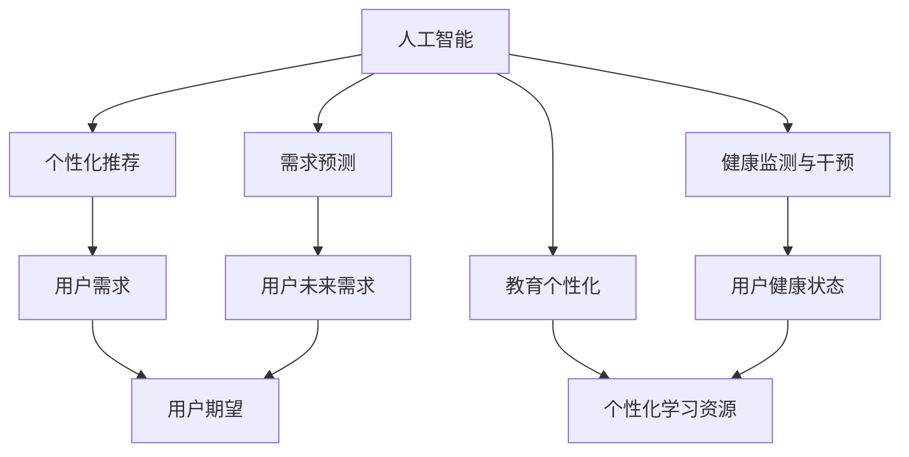

                 

# 欲望的重新定义：AI如何改变人类需求

> 关键词：人工智能,欲望,需求,消费,健康,教育,伦理,人类福祉

## 1. 背景介绍

在当前信息爆炸、技术迅猛发展的时代，人工智能（AI）技术正以前所未有的速度渗透到人类生活的方方面面，重塑着我们对世界和自身的认知。从智能家居到无人驾驶，从精准医疗到教育个性化，AI正在改变我们获取信息、处理事务、享受服务的模式。而在这其中，一个最根本的转变可能是对“欲望”的重新定义，即需求。

### 1.1 问题由来

传统的消费模式，是基于“欲望驱动”的，即人们根据自己的需求和欲望去选择产品和服务。但随着AI技术的进步，特别是大数据、推荐系统和个性化算法的应用，我们发现，AI正在重新定义“需求”，使得人们的需求更加精准、高效，也更加符合自身的认知和期望。这种变化，不仅影响着个体的生活质量，也深刻影响着社会的经济结构、文化观念和伦理规范。

### 1.2 问题核心关键点

AI如何改变人类需求的核心关键点在于：

1. **个性化推荐**：通过大数据分析和机器学习算法，AI能够根据用户的个性化特征和历史行为，精准推荐符合其需求的产品和服务。
2. **需求预测**：利用时间序列分析、自然语言处理等技术，AI可以预测用户未来的需求，帮助商家提前准备，优化供应链。
3. **健康监测与干预**：AI可以实时监测用户的健康数据，预测潜在的健康问题，并提供个性化的健康干预建议。
4. **教育个性化**：AI可以根据学生的学习行为和知识掌握情况，定制个性化的学习路径和资源，提高学习效率。
5. **伦理与隐私**：AI在改变需求的同时，也引发了对数据隐私、算法透明度、伦理责任等问题的深入探讨。

这些关键点共同构成了AI对人类需求的重塑过程，促使我们重新思考欲望与需求之间的关系，以及如何更好地利用AI技术服务于人类福祉。

## 2. 核心概念与联系

### 2.1 核心概念概述

为了深入理解AI如何改变人类需求，我们首先需要明确一些核心概念：

- **人工智能（Artificial Intelligence, AI）**：一种利用计算机和算法模拟人类智能的技术，包括感知、学习、推理等能力。
- **需求（Demand）**：用户对产品、服务、信息等的需求，通常基于个人的欲望、偏好和期望。
- **欲望（Desire）**：更深层次的心理和生理需求，常常表现为对某种结果的渴望或追求。
- **个性化推荐（Personalized Recommendation）**：通过分析用户行为和偏好，推荐符合其需求的产品或服务。
- **需求预测（Demand Prediction）**：利用历史数据和机器学习算法，预测用户未来的需求。
- **健康监测与干预（Health Monitoring & Intervention）**：实时监测用户健康数据，预测健康问题，并提供个性化干预措施。
- **教育个性化（Educational Personalization）**：根据学生的学习行为和知识掌握情况，定制个性化的学习路径和资源。
- **伦理与隐私（Ethics & Privacy）**：在使用AI技术时，如何平衡数据利用和用户隐私保护，以及如何确保算法的透明度和责任归属。

这些概念之间的关系可以通过以下Mermaid流程图来展示：



这个流程图展示了人工智能如何通过多种方式改变和重塑人类需求：

1. 通过个性化推荐，AI帮助用户发现新的需求。
2. 需求预测帮助商家更好地准备和优化供应链。
3. 健康监测与干预，提升用户的健康和生活质量。
4. 教育个性化，提升学习效率和效果。

同时，我们也不能忽视AI在改变需求过程中涉及的伦理和隐私问题。

## 3. 核心算法原理 & 具体操作步骤
### 3.1 算法原理概述

AI改变人类需求的原理主要基于以下几个核心算法：

- **协同过滤（Collaborative Filtering）**：通过分析用户行为和评分数据，发现用户之间的相似性，从而推荐符合其兴趣的产品或服务。
- **内容推荐（Content-Based Recommendation）**：利用产品或服务的属性特征，匹配用户已有的偏好和需求。
- **深度学习（Deep Learning）**：通过神经网络模型，分析用户的历史行为和特征，预测未来的需求。
- **强化学习（Reinforcement Learning）**：通过奖励机制，逐步优化推荐策略，满足用户的长远需求。

这些算法通过不同的方法和模型，帮助AI更好地理解用户需求，提供精准的推荐和服务。

### 3.2 算法步骤详解

AI改变人类需求的算法步骤主要包括以下几个关键环节：

1. **数据收集**：通过日志、传感器、问卷调查等方式，收集用户的各类数据，包括行为数据、偏好数据、生理数据等。
2. **数据预处理**：清洗、筛选、归一化处理数据，确保数据的准确性和可用性。
3. **特征提取**：通过文本挖掘、特征工程等技术，提取用户的关键特征，如兴趣、情感、行为模式等。
4. **模型训练**：选择合适的算法和模型，利用历史数据进行训练，优化推荐策略。
5. **推荐生成**：根据用户当前的状态和行为，生成个性化的推荐列表。
6. **效果评估**：通过用户反馈、点击率、转化率等指标，评估推荐模型的效果，并不断优化。

### 3.3 算法优缺点

AI改变人类需求的算法具有以下优点：

- **高效性**：能够快速分析大量数据，提供精准的个性化推荐。
- **适应性强**：可以处理多种类型的数据，适应不同的应用场景。
- **预测准确**：通过深度学习等算法，可以预测用户未来的需求，提前准备。

同时，这些算法也存在一些局限性：

- **隐私问题**：大量数据收集和分析可能涉及用户隐私，引发伦理和法律问题。
- **公平性**：推荐算法可能存在偏见，导致不公平的推荐结果。
- **依赖性**：过度依赖用户历史数据，可能导致“过滤气泡”和“信息茧房”现象。

### 3.4 算法应用领域

AI改变人类需求的算法已经广泛应用于多个领域：

- **电商**：通过个性化推荐，提升用户体验和销售额。
- **媒体与娱乐**：提供个性化内容，提高用户粘性和满意度。
- **健康医疗**：实时监测用户健康数据，提供个性化健康干预。
- **教育**：根据学生的学习行为，定制个性化的学习路径和资源。
- **金融**：通过需求预测，优化供应链管理和库存控制。

这些应用领域展示了AI在改变人类需求方面的强大能力，也揭示了其广泛的社会影响。

## 4. 数学模型和公式 & 详细讲解 & 举例说明

### 4.1 数学模型构建

AI改变人类需求的数学模型通常基于以下几个基本假设：

- **用户行为数据服从马尔可夫过程**：用户的当前行为只依赖于其历史行为，而与未来行为无关。
- **用户需求满足博弈论中的纳什均衡**：用户在多个选择中，会选择最优解以满足其需求。
- **需求预测可以使用时间序列模型**：用户未来的需求可以通过历史数据和模型进行预测。

### 4.2 公式推导过程

以下以协同过滤算法为例，推导其数学模型和公式。

设用户集合为 $U=\{u_1, u_2, \dots, u_n\}$，物品集合为 $I=\{i_1, i_2, \dots, i_m\}$，用户 $u$ 对物品 $i$ 的评分数据为 $R_{ui}$。协同过滤算法的目标是最小化预测评分与实际评分的误差，即：

$$
\min_{\theta} \sum_{ui \in R} (R_{ui} - \hat{R}_{ui})^2
$$

其中 $\hat{R}_{ui}$ 为预测评分，可以通过用户之间的相似性计算得到：

$$
\hat{R}_{ui} = \theta^T \phi(u) \cdot \phi(i)
$$

$\phi(u)$ 和 $\phi(i)$ 分别为用户和物品的特征向量，$\theta$ 为模型参数。

### 4.3 案例分析与讲解

以电商平台的个性化推荐为例，通过协同过滤算法，可以计算用户 $u$ 对物品 $i$ 的评分：

1. **数据收集**：收集用户浏览、点击、购买等行为数据。
2. **数据预处理**：清洗、筛选、归一化数据。
3. **特征提取**：提取用户和物品的关键特征，如浏览历史、购买记录、物品属性等。
4. **模型训练**：利用协同过滤算法，训练用户和物品之间的相似性矩阵。
5. **推荐生成**：根据用户当前的行为和相似性矩阵，生成个性化推荐列表。

通过以上步骤，电商平台可以显著提升用户满意度和购买率。

## 5. 项目实践：代码实例和详细解释说明
### 5.1 开发环境搭建

在进行AI改变人类需求的实践前，我们需要准备好开发环境。以下是使用Python进行TensorFlow开发的示例环境配置流程：

1. 安装Anaconda：从官网下载并安装Anaconda，用于创建独立的Python环境。

2. 创建并激活虚拟环境：
```bash
conda create -n tf-env python=3.8 
conda activate tf-env
```

3. 安装TensorFlow：根据CUDA版本，从官网获取对应的安装命令。例如：
```bash
conda install tensorflow -c conda-forge -c nvidia -c pytorch
```

4. 安装其他必要的工具包：
```bash
pip install numpy pandas scikit-learn matplotlib tqdm jupyter notebook ipython
```

完成上述步骤后，即可在`tf-env`环境中开始项目实践。

### 5.2 源代码详细实现

这里我们以电商平台个性化推荐为例，给出使用TensorFlow进行协同过滤算法的代码实现。

```python
import tensorflow as tf
from tensorflow.keras.layers import Input, Embedding, Dot, Dense
from tensorflow.keras.models import Model

# 定义输入层
user_input = Input(shape=(n_users,), name='user')
item_input = Input(shape=(n_items,), name='item')

# 定义嵌入层
user_embedding = Embedding(n_users, embedding_dim, input_length=n_users)(user_input)
item_embedding = Embedding(n_items, embedding_dim, input_length=n_items)(item_input)

# 定义相似性矩阵
similarity_matrix = Dot(axes=[2, 2])([user_embedding, item_embedding])

# 定义预测层
prediction = Dense(1, activation='sigmoid')(similarity_matrix)

# 定义模型
model = Model(inputs=[user_input, item_input], outputs=prediction)

# 编译模型
model.compile(optimizer='adam', loss='binary_crossentropy', metrics=['accuracy'])

# 训练模型
model.fit([train_user_ids, train_item_ids], train_ratings, epochs=num_epochs, batch_size=batch_size, validation_split=0.2)
```

这里，我们使用TensorFlow的Keras API实现了协同过滤算法。通过嵌入层将用户和物品表示为向量，计算相似性矩阵，再通过全连接层预测用户对物品的评分。

### 5.3 代码解读与分析

让我们再详细解读一下关键代码的实现细节：

**定义输入层**：
- 使用`Input`层定义用户和物品的输入，分别表示为`user_input`和`item_input`。

**定义嵌入层**：
- 使用`Embedding`层将用户和物品的ID序列转换为向量表示。

**定义相似性矩阵**：
- 使用`Dot`层计算用户和物品的相似性矩阵。

**定义预测层**：
- 使用`Dense`层定义预测评分，通过sigmoid激活函数输出。

**定义模型**：
- 使用`Model`层定义整个推荐模型，包括输入层、嵌入层、相似性矩阵和预测层。

**编译模型**：
- 使用`compile`方法编译模型，设置优化器、损失函数和评价指标。

**训练模型**：
- 使用`fit`方法训练模型，设置训练数据、批次大小、训练轮数等参数。

可以看到，通过TensorFlow实现协同过滤算法，我们能够快速搭建并训练推荐模型。这体现了AI在改变人类需求过程中的高效性和灵活性。

### 5.4 运行结果展示

训练完成后，我们可以通过以下代码生成推荐结果：

```python
import numpy as np

# 使用训练好的模型生成推荐
user_ids = np.array([user_id], dtype=np.int32)
item_ids = np.array(item_ids, dtype=np.int32)
predictions = model.predict([user_ids, item_ids])

# 输出推荐评分
print(predictions[0][0])
```

这里，我们使用`numpy`数组作为输入，调用`predict`方法生成推荐评分。根据评分结果，可以进一步选择评分较高的物品进行推荐。

## 6. 实际应用场景
### 6.1 智能家居

智能家居领域，AI可以通过个性化推荐和需求预测，提升用户的生活质量和舒适度。例如，通过分析用户的日常活动和行为数据，智能家居系统可以推荐合适的智能设备和服务，如智能音箱、智能照明、智能温控等，提升用户的生活便利性和节能环保。

### 6.2 金融理财

在金融理财领域，AI可以通过个性化推荐和需求预测，帮助用户制定合理的投资计划和理财策略。例如，根据用户的财务状况、风险偏好、历史交易记录，AI可以推荐合适的理财产品和投资组合，优化用户的资产配置。

### 6.3 教育培训

教育培训领域，AI可以通过个性化推荐和需求预测，提升学生的学习效率和效果。例如，通过分析学生的学习行为和知识掌握情况，AI可以推荐合适的学习资源和练习题目，定制个性化的学习路径，帮助学生更好地掌握知识。

### 6.4 未来应用展望

未来，AI在改变人类需求方面的应用将更加广泛和深入，我们可以预见以下趋势：

- **多模态融合**：通过融合视觉、听觉、触觉等多模态数据，提升AI对用户需求的理解和响应能力。
- **场景感知**：利用传感器和物联网技术，AI可以实时感知用户的场景和环境变化，提供更加精准和个性化的服务。
- **情感识别**：通过自然语言处理和语音识别技术，AI可以识别用户的情感状态，提供更加人性化和服务。
- **跨领域应用**：AI在多个领域的应用将相互融合，形成更加综合和全面的解决方案，提升用户的生活质量和幸福感。

## 7. 工具和资源推荐
### 7.1 学习资源推荐

为了帮助开发者系统掌握AI改变人类需求的理论基础和实践技巧，这里推荐一些优质的学习资源：

1. **《机器学习实战》**：由Wesley Chun撰写，全面介绍了机器学习的基本概念和算法，包括协同过滤、深度学习等内容。

2. **《Python深度学习》**：由Francois Chollet撰写，介绍了TensorFlow和Keras的使用方法，适合实战操作。

3. **《深度学习与推荐系统》**：由Hongxin Hu撰写，系统介绍了推荐系统的原理和算法，涵盖协同过滤、内容推荐等内容。

4. **《深度学习入门》**：由斋藤康毅撰写，介绍了深度学习的基本概念和实践方法，适合初学者。

5. **Kaggle平台**：提供大量数据集和竞赛任务，通过实践操作，提升机器学习模型的构建和优化能力。

通过对这些资源的学习实践，相信你一定能够快速掌握AI改变人类需求的关键技术和方法，并用于解决实际的NLP问题。

### 7.2 开发工具推荐

高效的开发离不开优秀的工具支持。以下是几款用于AI改变人类需求开发的常用工具：

1. **TensorFlow**：由Google主导开发的开源深度学习框架，生产部署方便，适合大规模工程应用。

2. **PyTorch**：基于Python的开源深度学习框架，灵活动态的计算图，适合快速迭代研究。

3. **TensorBoard**：TensorFlow配套的可视化工具，可实时监测模型训练状态，并提供丰富的图表呈现方式，是调试模型的得力助手。

4. **Weights & Biases**：模型训练的实验跟踪工具，可以记录和可视化模型训练过程中的各项指标，方便对比和调优。

5. **Jupyter Notebook**：交互式笔记本，支持Python代码的编写和运行，适合实时调试和数据探索。

合理利用这些工具，可以显著提升AI改变人类需求任务的开发效率，加快创新迭代的步伐。

### 7.3 相关论文推荐

AI改变人类需求的研究源于学界的持续研究。以下是几篇奠基性的相关论文，推荐阅读：

1. **Collaborative Filtering for Recommender Systems**：由Christopher Burges撰写，介绍了协同过滤算法的原理和实现方法。

2. **Item-Based Collaborative Filtering Recommendations**：由Joachims撰写，介绍了基于物品的协同过滤算法。

3. **Deep Learning for Recommender Systems**：由Ian Goodfellow撰写，介绍了深度学习在推荐系统中的应用。

4. **Reinforcement Learning for Recommendation Systems**：由Vladimir Mikhaylovskiy撰写，介绍了强化学习在推荐系统中的应用。

这些论文代表了大模型微调技术的发展脉络。通过学习这些前沿成果，可以帮助研究者把握学科前进方向，激发更多的创新灵感。

## 8. 总结：未来发展趋势与挑战
### 8.1 总结

本文对AI改变人类需求的原理、操作步骤、优缺点和应用场景进行了全面系统的介绍。首先阐述了AI在改变人类需求中的作用和重要性，明确了需求和欲望之间的复杂关系。其次，从原理到实践，详细讲解了协同过滤算法等核心算法，给出了具体的代码实现和运行结果展示。同时，本文还广泛探讨了AI在智能家居、金融理财、教育培训等多个行业领域的应用前景，展示了AI在改变人类需求方面的强大能力。此外，本文精选了AI改变人类需求的学习资源、开发工具和相关论文，力求为读者提供全方位的技术指引。

通过本文的系统梳理，可以看到，AI在改变人类需求的过程中，已经深入到生活的各个方面，极大地提升了人们的生活质量和幸福感。未来，伴随AI技术的进一步发展，其对人类需求的重塑将更加深入和广泛，带来更加智能和高效的生活方式。

### 8.2 未来发展趋势

展望未来，AI改变人类需求的技术将呈现以下几个发展趋势：

1. **多模态融合**：通过融合视觉、听觉、触觉等多模态数据，提升AI对用户需求的理解和响应能力。

2. **场景感知**：利用传感器和物联网技术，AI可以实时感知用户的场景和环境变化，提供更加精准和个性化的服务。

3. **情感识别**：通过自然语言处理和语音识别技术，AI可以识别用户的情感状态，提供更加人性化和服务。

4. **跨领域应用**：AI在多个领域的应用将相互融合，形成更加综合和全面的解决方案，提升用户的生活质量和幸福感。

5. **隐私保护**：随着用户隐私意识的增强，如何在保护隐私的同时，提供个性化推荐，将成为重要的研究课题。

6. **公平性**：AI算法可能存在偏见，导致不公平的推荐结果，如何确保算法的公平性和透明性，将是一个重要的研究方向。

以上趋势凸显了AI在改变人类需求方面的广阔前景。这些方向的探索发展，必将进一步提升AI系统的性能和应用范围，为构建安全、可靠、可解释、可控的智能系统铺平道路。

### 8.3 面临的挑战

尽管AI在改变人类需求方面取得了显著进展，但在迈向更加智能化、普适化应用的过程中，它仍面临诸多挑战：

1. **数据隐私**：大量数据收集和分析可能涉及用户隐私，引发伦理和法律问题。

2. **算法公平性**：AI算法可能存在偏见，导致不公平的推荐结果。

3. **资源消耗**：大规模深度学习模型的训练和推理需要大量计算资源，如何提高算法的效率和可扩展性，是一个重要研究方向。

4. **透明性**：AI算法的决策过程缺乏可解释性，难以对其推理逻辑进行分析和调试。

5. **伦理责任**：AI在改变人类需求时，需要考虑伦理和责任问题，如何确保算法的透明度和责任归属，是一个重要的研究方向。

6. **安全性**：AI算法可能被恶意利用，如何防范和应对恶意攻击，是一个重要的研究方向。

以上挑战需要在未来的研究中逐步解决，以确保AI技术的安全、可靠和可控。

### 8.4 研究展望

面对AI改变人类需求所面临的挑战，未来的研究需要在以下几个方面寻求新的突破：

1. **数据隐私保护**：开发更高效的数据保护技术，如差分隐私、联邦学习等，确保用户数据的安全和隐私。

2. **公平性算法**：研究如何减少算法的偏见和歧视，确保推荐结果的公平性和透明性。

3. **高效计算**：开发更高效的计算模型和算法，如模型剪枝、量化加速等，提高AI系统的性能和可扩展性。

4. **可解释性**：开发更可解释的AI模型和算法，提升算法的透明度和可审计性。

5. **伦理与责任**：研究AI算法的伦理与责任问题，确保算法的透明度和责任归属。

6. **安全性**：开发更安全的AI算法和系统，防范和应对恶意攻击。

这些研究方向的探索，必将引领AI技术迈向更高的台阶，为构建安全、可靠、可解释、可控的智能系统铺平道路。面向未来，AI改变人类需求技术还需要与其他人工智能技术进行更深入的融合，如知识表示、因果推理、强化学习等，多路径协同发力，共同推动自然语言理解和智能交互系统的进步。只有勇于创新、敢于突破，才能不断拓展AI的边界，让智能技术更好地造福人类社会。

## 9. 附录：常见问题与解答

**Q1：AI在改变人类需求时，如何平衡隐私和个性化推荐之间的关系？**

A: 为了平衡隐私和个性化推荐之间的关系，可以采取以下措施：

1. **数据匿名化**：通过数据匿名化技术，去除用户的个人标识信息，保护用户隐私。

2. **差分隐私**：在数据处理过程中，加入噪声干扰，确保数据处理结果对单个用户的隐私影响可控。

3. **联邦学习**：通过分布式训练方式，让数据在本地设备上处理，减少数据集中存储的风险。

4. **透明性**：向用户公开推荐算法的原理和过程，增强用户对算法的信任感。

5. **用户控制**：允许用户自主选择是否参与个性化推荐，提供隐私设置选项，让用户能够控制数据的共享程度。

这些措施可以在保护用户隐私的同时，提供个性化的推荐服务。

**Q2：AI在改变人类需求时，如何避免算法的偏见和歧视？**

A: 为了避免算法的偏见和歧视，可以采取以下措施：

1. **数据多样性**：收集多样化的数据，涵盖不同群体和背景的用户，确保数据的多样性和代表性。

2. **公平性算法**：采用公平性算法，如反偏见算法、公平性检测工具等，确保算法的公平性和透明性。

3. **透明性**：向用户公开算法的原理和过程，增强用户对算法的信任感。

4. **用户反馈**：收集用户反馈，及时调整算法，避免算法的偏见和歧视。

5. **伦理审查**：建立伦理审查机制，确保算法的开发和应用符合伦理和法律规范。

这些措施可以在确保算法公平性的同时，提供个性化的推荐服务。

**Q3：AI在改变人类需求时，如何提高算法的可解释性？**

A: 为了提高算法的可解释性，可以采取以下措施：

1. **可视化工具**：使用可视化工具，展示算法的决策过程和结果，增强用户对算法的理解。

2. **可解释模型**：采用可解释的机器学习模型，如决策树、线性回归等，增加算法的透明度。

3. **特征重要性分析**：分析算法的特征重要性，向用户解释关键特征对决策的影响。

4. **用户反馈**：收集用户反馈，不断优化算法的可解释性。

5. **透明度**：向用户公开算法的原理和过程，增强用户对算法的信任感。

这些措施可以在提高算法可解释性的同时，提供个性化的推荐服务。

**Q4：AI在改变人类需求时，如何提高算法的效率和可扩展性？**

A: 为了提高算法的效率和可扩展性，可以采取以下措施：

1. **模型剪枝**：通过剪枝技术，去除冗余的参数和计算，提高模型的效率和可扩展性。

2. **量化加速**：将浮点模型转为定点模型，压缩存储空间，提高计算效率。

3. **分布式训练**：采用分布式训练方式，提高算法的可扩展性和效率。

4. **硬件优化**：通过硬件优化，如GPU加速、TPU加速等，提高算法的效率和性能。

5. **算法优化**：研究更加高效的算法，如模型并行、混合精度训练等，提高算法的效率和可扩展性。

这些措施可以在提高算法效率的同时，提供个性化的推荐服务。

**Q5：AI在改变人类需求时，如何防范和应对恶意攻击？**

A: 为了防范和应对恶意攻击，可以采取以下措施：

1. **异常检测**：通过异常检测技术，识别和防范恶意攻击。

2. **数据加密**：对数据进行加密处理，确保数据传输和存储的安全。

3. **访问控制**：建立严格的访问控制机制，限制数据的访问和使用。

4. **安全审计**：定期进行安全审计，确保系统的安全性和稳定性。

5. **应急响应**：建立应急响应机制，及时应对和处理恶意攻击。

这些措施可以在防范和应对恶意攻击的同时，提供个性化的推荐服务。

---

作者：禅与计算机程序设计艺术 / Zen and the Art of Computer Programming

