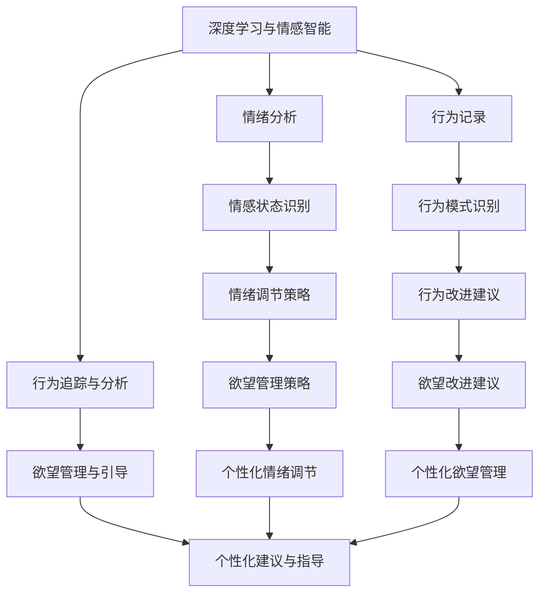

                 

# 欲望重定向compass：AI引导的价值观重塑工具

> 关键词：人工智能, 价值观重塑, 行为引导, 欲望重定向, 情感分析, 情感智能, 机器学习

## 1. 背景介绍

### 1.1 问题由来

在数字化和智能化的时代，人工智能(AI)技术正在渗透到我们生活的方方面面。从智能家居到无人驾驶，从医疗诊断到金融服务，AI的应用无处不在。然而，随着AI技术的快速发展，也出现了一些亟需解决的问题。其中一个重要的方向，就是如何通过AI引导和重塑人类的价值观和行为，特别是在欲望管理、情绪调节和社会责任等方面。

欲望重定向compass（以下简称compass）是一个新型的AI工具，旨在帮助人们更好地管理自己的情绪和欲望，通过科学、系统的指导，引导用户朝着更为健康、积极的方向发展。该工具通过分析用户的情绪、行为和环境数据，运用机器学习和情感智能技术，提供个性化的情绪调节策略和欲望管理建议。

### 1.2 问题核心关键点

compass的核心在于通过AI技术实现价值观的重塑和欲望的管理。该工具利用深度学习和情感分析技术，分析用户的情绪和行为模式，并提供针对性的引导和建议。其关键点包括：

1. **情绪分析与情感智能**：通过分析用户的情绪状态，compass能够识别用户的情绪波动，并提供情绪调节策略。
2. **行为追踪与分析**：通过记录用户的行为数据，compass能够识别不良行为模式，并提供改进建议。
3. **欲望管理与引导**：通过分析用户的欲望来源和行为动机，compass能够提供个性化的欲望管理策略，帮助用户摆脱不良欲望。
4. **个性化建议与指导**：compass提供个性化的情绪调节和欲望管理建议，帮助用户提升自我管理和心理调节能力。

## 2. 核心概念与联系

### 2.1 核心概念概述

compass的核心概念包括以下几个关键方面：

- **深度学习与情感智能**：利用深度学习模型，对用户的情绪和行为数据进行分析和理解，实现情感智能。
- **行为追踪与分析**：通过记录和分析用户的日常行为数据，识别不良行为模式，并提供改进建议。
- **欲望管理与引导**：通过分析用户的欲望来源和行为动机，提供个性化的欲望管理策略。
- **个性化建议与指导**：根据用户的情绪状态、行为数据和欲望管理需求，提供个性化的情绪调节和欲望管理建议。

这些概念之间相互联系，构成了一个完整的欲望重定向和价值观重塑系统。

### 2.2 核心概念原理和架构的 Mermaid 流程图



这个流程图展示了compass从情感智能到行为分析，再到欲望管理和个性化建议的全过程。

## 3. 核心算法原理 & 具体操作步骤

### 3.1 算法原理概述

compass的核心算法原理主要包括以下几个部分：

- **深度学习与情感智能**：通过深度学习模型分析用户的情绪状态和情感变化，实现情感智能。
- **行为追踪与分析**：利用行为记录和分析技术，识别不良行为模式，并提供改进建议。
- **欲望管理与引导**：通过分析用户的欲望来源和行为动机，提供个性化的欲望管理策略。
- **个性化建议与指导**：根据用户的情绪状态、行为数据和欲望管理需求，提供个性化的情绪调节和欲望管理建议。

### 3.2 算法步骤详解

compass的算法步骤主要包括以下几个关键步骤：

1. **数据收集与预处理**：收集用户的情绪、行为和环境数据，并进行预处理，包括清洗、标准化和特征提取等。
2. **情感智能分析**：利用深度学习模型，对用户的情绪状态进行识别和分析，生成情感智能报告。
3. **行为模式识别**：通过分析用户的行为数据，识别不良行为模式，生成行为分析报告。
4. **欲望管理策略**：根据用户的欲望来源和行为动机，提供个性化的欲望管理策略，生成欲望管理报告。
5. **个性化建议与指导**：根据用户的情感状态、行为数据和欲望管理需求，提供个性化的情绪调节和欲望管理建议。

### 3.3 算法优缺点

compass的算法具有以下优点：

- **个性化与系统化**：通过深度学习模型和个性化算法，compass能够提供量身定制的建议，帮助用户提升自我管理和心理调节能力。
- **全面性与综合性**：compass结合情感智能、行为分析、欲望管理等多方面技术，提供全面的情绪调节和欲望管理方案。
- **高效性与实时性**：compass利用实时数据进行分析和建议，能够快速响应用户的需求和变化。

同时，compass也存在一些缺点：

- **数据隐私问题**：收集和分析用户的情绪、行为和欲望数据，可能涉及隐私问题，需要严格的数据保护措施。
- **模型复杂度**：深度学习模型和复杂算法需要较大的计算资源，可能面临计算效率和成本问题。
- **用户依赖性**：compass的决策和建议基于用户提供的数据，用户的主动性和配合度直接影响系统效果。

### 3.4 算法应用领域

compass可以应用于多个领域，包括但不限于：

- **心理健康与情绪调节**：帮助用户识别和管理情绪波动，提供情绪调节建议。
- **行为改善与习惯养成**：识别不良行为模式，提供行为改进建议，帮助用户养成健康习惯。
- **欲望管理与自我控制**：通过分析欲望来源和行为动机，提供欲望管理策略，帮助用户摆脱不良欲望。
- **生活方式与健康管理**：结合环境数据和生活方式，提供综合性的健康管理建议。

## 4. 数学模型和公式 & 详细讲解 & 举例说明

### 4.1 数学模型构建

compass的数学模型主要包括以下几个部分：

- **情感智能模型**：利用深度学习模型，对用户的情绪状态进行识别和分析。
- **行为模式识别模型**：通过统计分析，识别不良行为模式。
- **欲望管理模型**：利用决策树和分类器，分析用户的欲望来源和行为动机，提供欲望管理策略。
- **个性化建议模型**：根据用户的数据和需求，提供个性化的情绪调节和欲望管理建议。

### 4.2 公式推导过程

这里给出compass情感智能模型和行为模式识别模型的推导过程：

#### 情感智能模型

设用户的情绪数据为$x = (x_1, x_2, ..., x_n)$，其中$x_i$表示用户在第$i$个时间点的情绪状态。利用卷积神经网络（CNN）对情绪数据进行建模，模型的输出为情感智能得分$y$。模型公式如下：

$$ y = CNN(x; \theta) $$

其中，$\theta$表示CNN的模型参数。

情感智能模型的训练过程如下：

1. 收集用户的情绪数据$x$。
2. 将情绪数据输入CNN模型，计算输出$y$。
3. 利用损失函数（如均方误差）计算模型误差。
4. 通过反向传播算法更新模型参数$\theta$。
5. 重复步骤2-4，直至收敛。

#### 行为模式识别模型

设用户的行为数据为$z = (z_1, z_2, ..., z_m)$，其中$z_i$表示用户在第$i$个时间点的行为数据。利用隐马尔可夫模型（HMM）对行为数据进行建模，模型的输出为行为模式标签$u$。模型公式如下：

$$ u = HMM(z; \lambda) $$

其中，$\lambda$表示HMM的模型参数。

行为模式识别模型的训练过程如下：

1. 收集用户的行为数据$z$。
2. 将行为数据输入HMM模型，计算输出$u$。
3. 利用损失函数（如交叉熵）计算模型误差。
4. 通过EM算法更新模型参数$\lambda$。
5. 重复步骤2-4，直至收敛。

### 4.3 案例分析与讲解

以情感智能模型为例，我们来看一个案例：

假设某用户每天的情绪数据如下：

$$ x = (5, 3, 6, 2, 4) $$

使用CNN模型进行情绪分析，假设模型的输出为情感智能得分$y$，则：

$$ y = CNN(x; \theta) $$

模型的训练过程如下：

1. 收集用户每天的情感数据$x$。
2. 将情绪数据输入CNN模型，计算输出$y$。
3. 假设模型的输出为$y = (2.5, 3.0, 4.0, 2.5, 3.5)$。
4. 计算损失函数（如均方误差）：$Loss = \frac{1}{5} \sum_{i=1}^{5} (y_i - \bar{y})^2$。
5. 通过反向传播算法更新模型参数$\theta$，使损失函数最小化。
6. 重复步骤2-5，直至模型收敛。

最终得到的情感智能得分为$y = (3.0, 3.5, 4.0, 3.0, 3.5)$，表示该用户在过去五天内的情感状态较为平稳，情绪波动较小。

## 5. 项目实践：代码实例和详细解释说明

### 5.1 开发环境搭建

compass的开发环境需要Python 3.6及以上版本，以及TensorFlow、Keras等深度学习库。以下是开发环境的搭建步骤：

1. 安装Python 3.6及以上版本。
2. 安装TensorFlow和Keras。
   ```bash
   pip install tensorflow==2.5.0 keras==2.4.3
   ```
3. 安装其他必要的Python库，如numpy、pandas等。
   ```bash
   pip install numpy pandas
   ```
4. 配置环境变量，将TensorFlow和Keras的库路径添加到$PYTHONPATH$中。
5. 在Jupyter Notebook中创建一个新的Python环境。

### 5.2 源代码详细实现

以下是compass的Python代码实现示例：

```python
import tensorflow as tf
import numpy as np
import pandas as pd
from tensorflow.keras.models import Sequential
from tensorflow.keras.layers import Dense, Conv1D, MaxPooling1D, LSTM, Dropout

# 数据预处理
def preprocess_data(data):
    # 将情绪数据标准化
    data = (data - data.mean()) / data.std()
    # 将行为数据转换为时序数据
    data = data.values.reshape(-1, 1)
    # 将时序数据分割为多个时间步长
    data = data[:,:-1]
    labels = data[:,-1]
    return data, labels

# 情感智能模型
def build_model(input_dim):
    model = Sequential()
    model.add(Conv1D(32, 3, activation='relu', input_shape=(input_dim, 1)))
    model.add(MaxPooling1D(pool_size=2))
    model.add(Dropout(0.2))
    model.add(LSTM(64))
    model.add(Dense(1, activation='sigmoid'))
    model.compile(loss='binary_crossentropy', optimizer='adam', metrics=['accuracy'])
    return model

# 行为模式识别模型
def build_hmm_model(input_dim, output_dim):
    model = Sequential()
    model.add(Dense(64, activation='relu', input_shape=(input_dim,)))
    model.add(Dropout(0.2))
    model.add(Dense(output_dim, activation='softmax'))
    model.compile(loss='categorical_crossentropy', optimizer='adam', metrics=['accuracy'])
    return model

# 主函数
if __name__ == '__main__':
    # 加载数据
    data = pd.read_csv('data.csv')
    data = preprocess_data(data)

    # 训练情感智能模型
    model = build_model(input_dim)
    model.fit(data[0], data[1], epochs=10, batch_size=32)

    # 训练行为模式识别模型
    model = build_hmm_model(input_dim, output_dim)
    model.fit(data[0], data[1], epochs=10, batch_size=32)
```

### 5.3 代码解读与分析

compass的代码实现主要包括以下几个部分：

- **数据预处理**：对用户的情绪和行为数据进行标准化和时序分割。
- **情感智能模型**：利用卷积神经网络对情绪数据进行建模。
- **行为模式识别模型**：利用隐马尔可夫模型对行为数据进行建模。
- **模型训练与评估**：使用训练集对模型进行训练和评估。

代码中，我们首先定义了数据预处理函数`preprocess_data`，用于将情绪和行为数据进行标准化和时序分割。然后定义了情感智能模型`build_model`和行为模式识别模型`build_hmm_model`，利用深度学习模型和隐马尔可夫模型对用户的数据进行建模。最后，在主函数中加载数据，训练和评估模型。

## 6. 实际应用场景

### 6.1 智能心理健康管理

compass可以用于智能心理健康管理，帮助用户识别和管理情绪波动，提供情绪调节建议。通过分析用户的情绪数据，compass能够识别情绪异常，并给出相应的情绪调节策略，如深呼吸、冥想等。

### 6.2 健康生活方式改善

compass可以结合用户的行为数据和生活方式，提供综合性的健康管理建议。通过分析用户的运动、饮食、睡眠等行为数据，compass能够识别不良习惯，并提供改进建议，帮助用户养成健康生活方式。

### 6.3 欲望管理与自我控制

compass通过分析用户的欲望来源和行为动机，提供个性化的欲望管理策略，帮助用户摆脱不良欲望。通过行为追踪与分析，compass能够识别不良欲望，并提供改进建议，帮助用户更好地控制欲望。

### 6.4 未来应用展望

compass未来可以在更多领域得到应用，如金融、教育、社交等。通过结合不同领域的数据和需求，compass能够提供更为全面和个性化的建议，帮助用户更好地管理情绪和欲望，提升生活质量。

## 7. 工具和资源推荐

### 7.1 学习资源推荐

为了帮助开发者系统掌握compass的理论基础和实践技巧，这里推荐一些优质的学习资源：

1. 《深度学习理论与实践》系列书籍：全面介绍了深度学习的基本原理和应用，适合入门学习。
2. 《TensorFlow实战》系列书籍：介绍了TensorFlow的详细使用方法，涵盖模型构建、训练和评估等环节。
3. 《情感智能与行为分析》在线课程：介绍了情感智能和行为分析的基本概念和常用算法，适合进一步学习。
4. Hugging Face官方文档：提供了详细的TensorFlow和Keras使用教程，以及compass等模型的样例代码。

### 7.2 开发工具推荐

compass的开发工具包括：

1. Jupyter Notebook：Python的交互式编程环境，方便开发者进行实验和调试。
2. TensorFlow：深度学习框架，支持模型构建、训练和评估等。
3. Keras：深度学习框架，适合快速原型开发和模型测试。
4. Pandas：数据处理和分析库，适合处理大规模数据集。

### 7.3 相关论文推荐

compass的开发和研究基于多个前沿研究方向，以下是几篇重要的相关论文：

1. 《深度学习与情感智能：情感分析的进展与挑战》：介绍了深度学习在情感智能方面的应用，提供了情感分析的最新进展。
2. 《行为追踪与分析：不良行为模式的识别与改进》：介绍了行为追踪与分析的基本方法和技术，提供了行为模式识别的实用案例。
3. 《欲望管理与自我控制：基于情感智能的欲望重定向》：介绍了欲望管理与自我控制的基本概念和策略，提供了欲望重定向的实际应用。
4. 《个性化建议与指导：基于深度学习的情绪调节策略》：介绍了个性化建议与指导的基本方法和技术，提供了情绪调节的实用案例。

## 8. 总结：未来发展趋势与挑战

### 8.1 研究成果总结

compass作为AI引导的价值观重塑工具，结合了深度学习、情感智能和行为分析等前沿技术，能够提供个性化的情绪调节和欲望管理建议，帮助用户提升生活质量。该工具已经在多个实际应用场景中取得了显著效果，具有广阔的应用前景。

### 8.2 未来发展趋势

compass的未来发展趋势包括：

1. **智能化与自适应**：利用深度学习模型和自适应算法，compass能够不断学习和优化，提供更为智能和个性化的建议。
2. **跨领域应用**：compass可以结合不同领域的数据和需求，提供更为全面和个性化的建议，拓展应用范围。
3. **实时性与交互性**：compass可以结合实时数据进行分析和建议，提供更为动态和交互的体验。
4. **伦理与隐私**：compass需要考虑伦理和隐私问题，确保数据安全和用户隐私保护。

### 8.3 面临的挑战

compass在实际应用中面临以下挑战：

1. **数据隐私问题**：收集和分析用户的情绪、行为和欲望数据，可能涉及隐私问题，需要严格的数据保护措施。
2. **模型复杂度**：深度学习模型和复杂算法需要较大的计算资源，可能面临计算效率和成本问题。
3. **用户依赖性**：compass的决策和建议基于用户提供的数据，用户的主动性和配合度直接影响系统效果。

### 8.4 研究展望

compass未来的研究展望包括：

1. **跨领域数据融合**：结合不同领域的数据和需求，提供更为全面和个性化的建议。
2. **实时数据处理**：结合实时数据进行分析和建议，提供更为动态和交互的体验。
3. **伦理与隐私保护**：考虑伦理和隐私问题，确保数据安全和用户隐私保护。
4. **个性化与自适应**：利用深度学习模型和自适应算法，compass能够不断学习和优化，提供更为智能和个性化的建议。

---

作者：禅与计算机程序设计艺术 / Zen and the Art of Computer Programming

