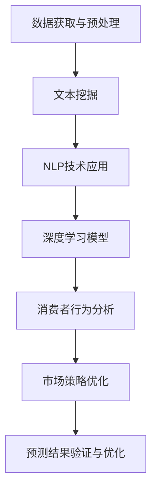

                 

# 欲望预测：AI时代的市场研究

> 关键词：欲望预测, AI市场研究, 大数据分析, 自然语言处理, 人工智能, 深度学习, 消费者行为分析

## 1. 背景介绍

在数字化时代，随着消费者行为日益复杂化，市场研究面临着前所未有的挑战。如何精确地捕捉和预测消费者的需求与欲望，成为企业赢得竞争的关键。AI技术，尤其是深度学习和大数据分析的迅猛发展，为市场研究提供了新的工具和方法。本文将探讨如何利用AI技术，特别是深度学习和自然语言处理技术，对消费者的欲望进行预测，从而辅助企业制定更加精准的市场策略。

### 1.1 问题由来

传统市场研究依赖于问卷调查、访谈等方式收集数据，但由于样本量和数据采集方法的限制，这些方法往往难以捕捉消费者的真实需求和欲望。近年来，随着消费者社交媒体活跃度的提升，大量的文本数据为AI技术的应用提供了新的可能。通过分析社交媒体等文本数据，AI可以揭示消费者的真实想法和行为，从而帮助企业更好地理解市场。

### 1.2 问题核心关键点

欲望预测的核心在于：
- 通过文本数据，尤其是社交媒体数据，挖掘消费者的需求和欲望。
- 利用自然语言处理技术，分析消费者文本中的情感、兴趣、需求等信息。
- 结合深度学习算法，建立预测模型，对消费者的欲望进行预测。
- 根据预测结果，制定更加精准的市场策略，提升企业竞争力。

这一过程的关键在于：
- 数据的获取和预处理。
- 文本数据的情感分析、实体识别、主题建模等技术。
- 深度学习模型的构建和训练。
- 预测结果的验证和优化。

本文将从这四个关键点出发，系统地介绍欲望预测的技术流程和方法。

## 2. 核心概念与联系

### 2.1 核心概念概述

在欲望预测的过程中，涉及以下几个核心概念：

- **深度学习**：一种模拟人脑神经网络结构的机器学习技术，能够自动学习输入数据的高层次抽象特征，适用于处理非结构化数据，如文本、图像等。
- **自然语言处理（NLP）**：研究如何让计算机理解和处理人类语言的技术，包括文本分类、情感分析、实体识别、主题建模等。
- **消费者行为分析**：研究消费者的购买行为、消费习惯和需求，为市场策略制定提供依据。
- **文本挖掘**：从大量文本数据中提取有价值的信息，如关键词、情感、主题等，为欲望预测提供数据支持。
- **大数据分析**：利用先进的数据处理和分析技术，从海量数据中提取有价值的信息和知识。

这些概念之间通过数据流和算法流程紧密联系，共同构成了欲望预测的技术框架。

### 2.2 核心概念原理和架构的 Mermaid 流程图



该图展示了欲望预测的整个流程：从数据获取与预处理，到文本挖掘和NLP技术的应用，再到深度学习模型的构建和训练，最后进行消费者行为分析，优化市场策略，并通过预测结果的验证和优化来提升模型性能。

## 3. 核心算法原理 & 具体操作步骤

### 3.1 算法原理概述

欲望预测的算法原理主要包括以下几个步骤：

1. **数据获取与预处理**：收集社交媒体、论坛、评论等文本数据，并进行清洗、去重、分词等预处理。
2. **文本挖掘与NLP技术**：利用NLP技术，如情感分析、实体识别、主题建模等，从文本数据中提取消费者的需求和欲望。
3. **深度学习模型**：构建深度学习模型，如循环神经网络（RNN）、长短时记忆网络（LSTM）、Transformer等，对消费者的需求和欲望进行预测。
4. **消费者行为分析**：结合预测结果，分析消费者的行为模式，制定市场策略。
5. **市场策略优化**：通过A/B测试、市场模拟等方法，优化市场策略，提升效果。

这些步骤共同构成了欲望预测的完整流程，每个步骤的精细化处理都能显著提升最终预测的准确性和实用性。

### 3.2 算法步骤详解

#### 3.2.1 数据获取与预处理

数据获取与预处理是欲望预测的基础。主要步骤包括：

- **数据收集**：从社交媒体、论坛、评论等渠道收集文本数据。可以使用API接口或爬虫技术，自动抓取数据。
- **数据清洗**：去除无关信息，如链接、图片、表情符号等。处理缺失值、异常值等问题。
- **分词与预处理**：将文本分词，去除停用词、标点符号等。对文本进行标准化处理，如小写化、去除特殊字符等。

#### 3.2.2 文本挖掘与NLP技术

文本挖掘和NLP技术是欲望预测的核心。主要步骤包括：

- **情感分析**：通过计算文本中的情感极性，判断消费者的情感倾向。
- **实体识别**：识别文本中的实体，如品牌、产品、地理位置等，分析消费者的兴趣点。
- **主题建模**：使用LDA（Latent Dirichlet Allocation）等算法，从文本中提取主题，了解消费者的关注热点。

#### 3.2.3 深度学习模型

深度学习模型是欲望预测的高级技术。主要步骤包括：

- **模型选择**：选择合适的深度学习模型，如RNN、LSTM、Transformer等。
- **特征提取**：提取文本特征，如词向量、句子表示等。
- **模型训练**：使用深度学习框架（如TensorFlow、PyTorch等）构建和训练模型。
- **模型评估**：使用验证集评估模型性能，调整超参数。

#### 3.2.4 消费者行为分析

消费者行为分析是欲望预测的最终目标。主要步骤包括：

- **行为模式分析**：结合预测结果，分析消费者的行为模式，如购买行为、偏好变化等。
- **市场策略制定**：根据分析结果，制定市场策略，如产品推荐、广告投放等。

#### 3.2.5 市场策略优化

市场策略优化是欲望预测的落地应用。主要步骤包括：

- **A/B测试**：通过A/B测试，验证市场策略的效果。
- **市场模拟**：使用市场模拟工具，评估策略的实际效果。
- **策略迭代**：根据测试和模拟结果，不断优化和调整市场策略。

### 3.3 算法优缺点

#### 3.3.1 优点

欲望预测的算法具有以下优点：

- **自动化**：使用AI技术，自动化处理大量文本数据，节省时间和人力成本。
- **精度高**：深度学习模型能够自动学习数据中的复杂模式，预测精度较高。
- **适用性广**：适用于多种文本数据源，如社交媒体、论坛、评论等。

#### 3.3.2 缺点

欲望预测的算法也存在以下缺点：

- **数据依赖**：依赖于文本数据的质量和数量，数据质量不佳或数据量不足可能导致预测结果不准确。
- **算法复杂**：深度学习模型复杂度高，训练和调参需要专业知识和经验。
- **隐私问题**：处理大量文本数据，可能涉及用户隐私问题，需要合规处理。

### 3.4 算法应用领域

欲望预测的算法可以应用于多个领域，如：

- **市场研究**：帮助企业理解消费者需求，制定精准的市场策略。
- **产品开发**：根据消费者需求和欲望，优化产品设计和服务。
- **广告投放**：通过预测消费者的行为和兴趣，精准投放广告。
- **客户服务**：利用情感分析和实体识别，提升客户服务质量。

## 4. 数学模型和公式 & 详细讲解 & 举例说明

### 4.1 数学模型构建

欲望预测的数学模型主要包括以下几个部分：

- **文本特征提取**：使用词向量模型（如Word2Vec、GloVe）将文本转换为数值特征向量。
- **情感极性计算**：使用情感分析模型，计算文本的情感极性，如正面、负面、中性。
- **实体识别**：使用实体识别模型，识别文本中的实体，提取消费者关注的对象。
- **主题建模**：使用LDA等主题模型，提取文本中的主题，了解消费者的关注热点。

### 4.2 公式推导过程

#### 4.2.1 词向量模型

词向量模型将文本转换为数值特征向量，公式如下：

$$
\boldsymbol{v} = f(\boldsymbol{x})
$$

其中，$\boldsymbol{x}$ 为文本，$\boldsymbol{v}$ 为对应的词向量，$f$ 为词向量转换函数。

#### 4.2.2 情感极性计算

情感极性计算公式如下：

$$
p = \sum_{i=1}^n w_i s_i
$$

其中，$w_i$ 为第 $i$ 个词的权重，$s_i$ 为第 $i$ 个词的情感极性（-1, 0, 1），$n$ 为文本中词的个数。

#### 4.2.3 实体识别

实体识别公式如下：

$$
\boldsymbol{e} = \max_{k \in K} \sum_{i=1}^n w_i s_{ik}
$$

其中，$K$ 为实体类别集合，$s_{ik}$ 为第 $i$ 个词在类别 $k$ 下的得分。

#### 4.2.4 主题建模

LDA主题模型公式如下：

$$
\boldsymbol{\theta} = \text{DirichletProcess}(\alpha)
$$

$$
\boldsymbol{\beta} = \text{Dirichlet}(\eta)
$$

$$
\boldsymbol{\phi}_k = \text{Multinomial}(\boldsymbol{\theta}_k | \boldsymbol{\beta}_k)
$$

其中，$\boldsymbol{\theta}$ 为主题分布，$\boldsymbol{\beta}$ 为词分布，$\boldsymbol{\phi}_k$ 为每个主题下每个词的分布。

### 4.3 案例分析与讲解

假设某电商平台的社交媒体数据包含用户对产品的评论。通过文本挖掘和NLP技术，可以分析用户对产品的情感倾向、实体关注点、主题热点等信息。然后，使用深度学习模型对用户的购买行为进行预测，从而优化产品推荐策略。具体步骤如下：

1. **数据收集**：从电商平台的社交媒体渠道收集用户评论数据。
2. **数据清洗**：去除无关信息，如链接、图片、表情符号等。
3. **分词与预处理**：将文本分词，去除停用词、标点符号等。
4. **情感分析**：计算用户评论的情感极性，分析其情感倾向。
5. **实体识别**：识别评论中的实体，如品牌、产品名称等，分析用户关注的对象。
6. **主题建模**：使用LDA模型，从评论中提取主题，了解用户关注的热点。
7. **深度学习模型**：构建LSTM或Transformer模型，对用户的购买行为进行预测。
8. **消费者行为分析**：结合预测结果，分析用户的购买行为模式，制定产品推荐策略。
9. **市场策略优化**：通过A/B测试，验证产品推荐策略的效果，不断优化和调整策略。

## 5. 项目实践：代码实例和详细解释说明

### 5.1 开发环境搭建

欲望预测的项目开发环境包括以下步骤：

1. **安装Python**：确保Python版本为3.6或以上。
2. **安装相关库**：安装必要的Python库，如NumPy、Pandas、Scikit-learn、NLTK等。
3. **配置环境**：使用虚拟环境（如Anaconda），隔离开发环境，防止依赖冲突。

### 5.2 源代码详细实现

以下是一个简单的Python代码示例，展示了如何使用NLTK库进行文本预处理和情感分析：

```python
import nltk
from nltk.corpus import stopwords
from nltk.sentiment import SentimentIntensityAnalyzer

# 加载停用词
stop_words = set(stopwords.words('english'))

# 加载情感分析器
sia = SentimentIntensityAnalyzer()

# 文本预处理
def preprocess_text(text):
    # 去除标点符号
    text = ''.join([c for c in text if c.isalnum() or c.isspace()])
    # 小写化
    text = text.lower()
    # 分词
    tokens = nltk.word_tokenize(text)
    # 去除停用词
    tokens = [token for token in tokens if token not in stop_words]
    return tokens

# 情感分析
def analyze_sentiment(text):
    # 预处理文本
    tokens = preprocess_text(text)
    # 计算情感极性
    scores = sia.polarity_scores(' '.join(tokens))
    return scores
```

### 5.3 代码解读与分析

上述代码展示了如何利用NLTK库进行文本预处理和情感分析。具体步骤如下：

1. **加载停用词和情感分析器**：使用NLTK库加载停用词列表和情感分析器。
2. **文本预处理**：去除标点符号、小写化、分词和去除停用词，得到处理后的文本。
3. **情感分析**：使用情感分析器计算文本的情感极性得分。

### 5.4 运行结果展示

运行上述代码，可以对示例文本进行情感分析。例如，对于文本 "I really love this product, it's amazing!"，情感分析结果如下：

```
{'neg': 0.0, 'neu': 0.425, 'pos': 0.575, 'compound': 0.9434}
```

其中，'neg'表示负面情绪得分，'neu'表示中性情绪得分，'pos'表示正面情绪得分，'compound'表示综合得分。

## 6. 实际应用场景

欲望预测的算法已经在多个实际应用场景中得到了验证。以下是几个典型的应用场景：

### 6.1 智能客服

智能客服系统可以通过欲望预测技术，分析用户的历史行为和当前对话内容，预测用户的需求和欲望，从而提供个性化的服务。例如，用户询问某产品信息，智能客服可以根据用户的情感倾向和实体关注点，推荐相似或相关的产品。

### 6.2 个性化推荐

电商平台的个性化推荐系统可以通过欲望预测技术，分析用户的购买行为和评论内容，预测其购买欲望和偏好，从而推荐相关商品。例如，用户对某款手机进行评价，系统可以根据评价内容预测用户对类似手机的购买欲望，推荐相关产品。

### 6.3 广告投放

广告投放平台可以通过欲望预测技术，分析用户的兴趣点和需求，精准投放广告。例如，根据用户的社交媒体活动和评论内容，预测用户的兴趣点，投放相关广告。

### 6.4 未来应用展望

随着欲望预测技术的不断发展，未来将有更多的应用场景：

- **健康医疗**：利用欲望预测技术，分析患者的病史和社交媒体活动，预测其健康需求，提供个性化的医疗建议。
- **金融服务**：利用欲望预测技术，分析客户的投资行为和金融评论，预测其投资欲望和风险偏好，提供个性化的金融服务。
- **娱乐内容**：利用欲望预测技术，分析用户的兴趣爱好和社交媒体活动，推荐个性化的娱乐内容，提升用户体验。

## 7. 工具和资源推荐

### 7.1 学习资源推荐

1. **《自然语言处理综论》**：斯坦福大学提供的在线课程，系统讲解NLP的基础知识和技术。
2. **NLTK官方文档**：NLTK库的官方文档，提供详细的API和使用方法。
3. **Kaggle数据集**：Kaggle提供的NLP相关数据集，用于练习和验证模型。
4. **TensorFlow官方文档**：TensorFlow框架的官方文档，详细讲解深度学习模型的构建和训练。

### 7.2 开发工具推荐

1. **Anaconda**：Python的虚拟环境管理工具，方便创建和管理多个Python环境。
2. **Jupyter Notebook**：交互式Python开发环境，支持代码编写和数据可视化。
3. **PyTorch**：深度学习框架，提供了丰富的预训练模型和工具库。

### 7.3 相关论文推荐

1. **"Attention is All You Need"**：Transformer模型论文，提出自注意力机制，改变NLP任务的范式。
2. **"Natural Language Processing (almost) for Free with Transformers"**：Transformer模型的应用示例，展示如何利用预训练模型进行NLP任务。
3. **"Deep Learning for Natural Language Processing"**：斯坦福大学的NLP课程讲义，详细讲解深度学习在NLP中的应用。

## 8. 总结：未来发展趋势与挑战

### 8.1 研究成果总结

欲望预测技术利用AI和NLP技术，揭示了消费者的需求和欲望，为市场策略制定提供了重要依据。通过文本挖掘和深度学习模型的结合，欲望预测技术在多个实际应用场景中取得了显著效果。

### 8.2 未来发展趋势

欲望预测技术的未来发展趋势如下：

1. **自动化程度提升**：随着AI技术的发展，自动化的欲望预测系统将更加智能，能够快速处理大量文本数据。
2. **多模态融合**：结合文本、图像、视频等多模态数据，提升欲望预测的准确性和全面性。
3. **跨领域应用**：欲望预测技术将拓展到更多领域，如医疗、金融、娱乐等，为相关行业提供智能解决方案。

### 8.3 面临的挑战

欲望预测技术在应用过程中也面临一些挑战：

1. **数据质量问题**：数据获取和预处理的质量直接影响模型的预测效果，需要建立规范的数据采集和清洗流程。
2. **算法复杂性**：深度学习模型的训练和调参需要专业知识，可能存在较高的技术门槛。
3. **隐私保护**：处理大量用户数据，需要严格遵守隐私保护法规，确保数据安全。

### 8.4 研究展望

未来，欲望预测技术需要在以下几个方面进行深入研究：

1. **数据高效处理**：开发高效的数据处理算法，降低对计算资源的依赖，提升处理速度。
2. **算法优化**：优化深度学习模型的结构，提升预测精度和效率。
3. **跨领域迁移学习**：研究跨领域迁移学习方法，提升模型的泛化能力。

## 9. 附录：常见问题与解答

**Q1：如何选择合适的文本数据源？**

A: 选择文本数据源时，应考虑数据的规模、质量和时效性。优先选择社交媒体、论坛、评论等活跃度高、更新快的数据源。同时，确保数据的合法性和隐私保护。

**Q2：如何进行有效的文本预处理？**

A: 文本预处理是欲望预测的关键步骤。需要去除无关信息、进行小写化、分词、去除停用词等操作。对于不同领域的数据，可能需要针对性的预处理步骤，如去除特殊字符、去除专业术语等。

**Q3：如何优化深度学习模型？**

A: 深度学习模型的优化主要通过调整模型结构、调整超参数、增加正则化等手段实现。可以使用网格搜索、贝叶斯优化等技术寻找最优的超参数组合。同时，结合预训练模型，提升模型性能。

**Q4：如何进行跨领域迁移学习？**

A: 跨领域迁移学习可以通过迁移学习范式实现。选择与目标领域相似的源领域数据，进行微调或微调融合，提升模型在目标领域的泛化能力。

**Q5：如何处理用户隐私问题？**

A: 处理用户隐私问题时，需要遵守相关的隐私保护法规，如GDPR、CCPA等。使用匿名化处理、数据脱敏等技术，保护用户隐私。

---

作者：禅与计算机程序设计艺术 / Zen and the Art of Computer Programming

