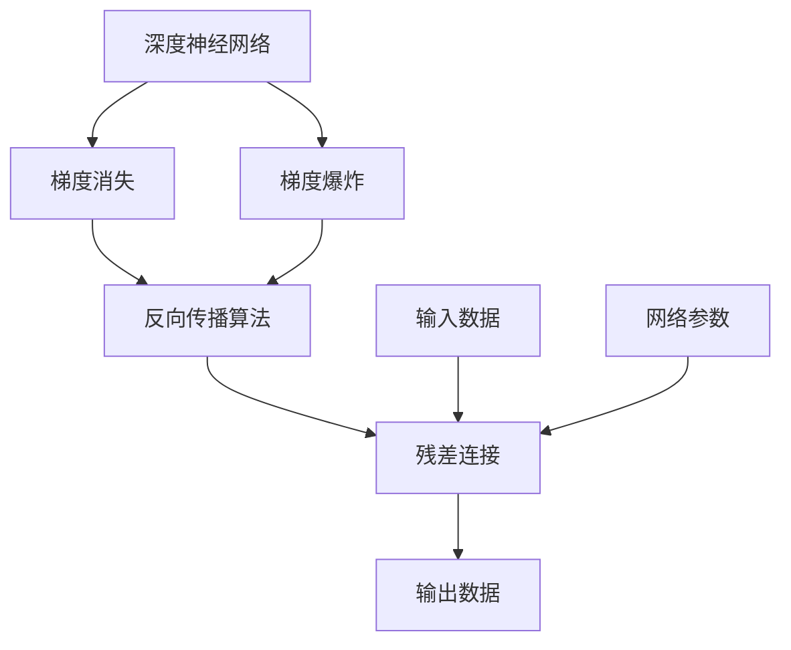
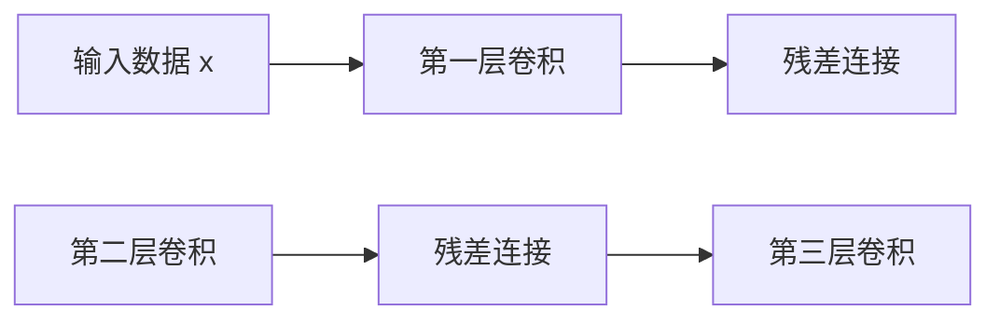

                 

# 残差连接：解决深层网络训练困难的关键

> 关键词：残差连接,深层网络,梯度消失,梯度爆炸,反向传播

## 1. 背景介绍

### 1.1 问题由来
深度学习技术在图像识别、自然语言处理、语音识别等领域取得了巨大成功，但深度网络训练的困难依然是其发展过程中的瓶颈问题。过深的神经网络不仅带来了计算量的爆炸式增长，还容易陷入梯度消失和梯度爆炸等问题，导致网络无法收敛或收敛速度极慢。

神经网络的训练过程本质上是通过反向传播算法来调整模型参数，使得模型输出能够逼近真实标签。但在深层网络中，由于网络结构复杂，每一层的梯度传递都经历了多次操作和函数复合，从而产生了梯度问题。这些问题直接影响了深层网络的训练效果，限制了其应用范围。

因此，如何有效解决深层网络的训练问题，成为深度学习研究的重要方向之一。本文聚焦于残差连接在深层网络训练中的作用，深入分析其原理和优势，并给出具体实践指导。

### 1.2 问题核心关键点
残差连接(Residual Connection)是一种在前馈网络中引入残差路径的机制，旨在解决深层网络中的梯度消失和梯度爆炸问题，提高训练效率和收敛速度。其主要思想是：将输入数据与输出数据之间的差值直接传递到下一层，使得网络中的每一层都可以从输入数据和上层的残差中学习，从而降低网络训练的难度，提高模型的性能。

残差连接的引入对深层网络的训练具有深远影响：

- 解决了梯度消失和梯度爆炸问题：由于残差连接的存在，网络中的每一层都可以从输入数据中直接获得梯度信息，避免梯度在多次操作和函数复合中被消散或爆炸。
- 提高了网络的表示能力：残差连接使得网络可以更好地学习输入数据和上层的残差之间的映射关系，增强了网络的表示能力。
- 加速了模型的收敛速度：残差连接可以减少深层网络的训练难度，使得模型能够在更少的迭代次数下达到收敛。

本文将通过理论分析、实验验证和实际应用案例，深入探讨残差连接的原理和应用，帮助读者系统理解这一关键技术。

## 2. 核心概念与联系

### 2.1 核心概念概述

为更好地理解残差连接在深层网络训练中的作用，本节将介绍几个密切相关的核心概念：

- 深度神经网络(Deep Neural Network, DNN)：以多层非线性映射为基础，通过反向传播算法进行训练的复杂网络结构。深度网络中的每一层都有其独特的特征提取和变换能力。
- 梯度消失(Gradient Vanishing)：在深层网络中，梯度在反向传播过程中逐渐变小，甚至趋近于0，导致模型难以更新。通常出现在激活函数为sigmoid或tanh等非线性函数的深层网络中。
- 梯度爆炸(Gradient Exploding)：在深层网络中，梯度在反向传播过程中逐渐变大，甚至超出现有数值范围，导致模型难以收敛。通常出现在激活函数为ReLU等非线性函数的深层网络中。
- 反向传播算法(Backpropagation)：通过链式法则，反向计算每个参数对损失函数的偏导数，从而更新模型参数的训练算法。是深度学习模型的核心训练方法。
- 残差连接(Residual Connection)：在前馈网络中，引入残差路径，使得网络中的每一层都可以从输入数据中直接获得梯度信息，解决梯度消失和梯度爆炸问题。

这些核心概念之间的逻辑关系可以通过以下Mermaid流程图来展示：



这个流程图展示了大语言模型的核心概念及其之间的关系：

1. 深度网络通过反向传播进行训练。
2. 反向传播中的梯度消失和梯度爆炸问题影响了模型训练效果。
3. 残差连接解决了梯度消失和梯度爆炸问题，提高了训练效率。

## 3. 核心算法原理 & 具体操作步骤
### 3.1 算法原理概述

残差连接的思想是通过在深层网络中引入残差路径，使得网络中的每一层都可以直接从输入数据和上层的残差中学习，从而解决梯度消失和梯度爆炸问题，提高训练效率和收敛速度。

形式化地，假设深度神经网络为 $M(x)=F_L(F_{L-1}(\dots F_2(F_1(x))\dots))$，其中 $F_i$ 表示第 $i$ 层的非线性变换。残差连接可以表示为：

$$
M(x)=F_L(x) + F_L(F_{L-1}(\dots F_2(F_1(x))\dots))
$$

其中 $F_L(x)$ 表示残差路径中的输出，即 $x$ 通过前 $L-1$ 层传递到 $L$ 层后的结果。

在反向传播过程中，通过链式法则计算每一层参数的梯度，最终得到整体模型的梯度。具体计算如下：

$$
\frac{\partial M(x)}{\partial W_i} = \frac{\partial F_L(x)}{\partial W_i} + \sum_{j=i}^{L-1}\frac{\partial F_j(F_{j-1}(\dots F_2(F_1(x))\dots))}{\partial W_i}
$$

其中 $W_i$ 表示第 $i$ 层的权重参数，$F_j$ 表示第 $j$ 层的非线性变换。

可以看出，通过残差连接，网络中的每一层都可以直接从输入数据和上层的残差中学习，避免了梯度在多次操作和函数复合中被消散或爆炸。从而使得深层网络的训练更加高效和稳定。

### 3.2 算法步骤详解

残差连接的实际应用通常包括以下几个关键步骤：

**Step 1: 网络构建**
- 在深层网络中，将残差路径引入每一层。具体实现可以采用`nn.Sequential`或`nn.ModuleList`等模块化的方式，将原始网络结构与残差路径进行并行连接。
- 在每一层中，将原始数据 $x$ 和残差数据 $F_{i-1}(x)$ 相加，作为下一层输入。

**Step 2: 初始化参数**
- 使用适当的初始化方法对模型参数进行初始化，如Xavier初始化、He初始化等。
- 设置适当的学习率和优化器，如Adam、SGD等，用于优化模型参数。

**Step 3: 训练和评估**
- 使用训练集进行模型训练，通过反向传播算法更新模型参数。
- 在验证集上评估模型性能，使用准确率、损失值等指标进行评估。
- 调整学习率、正则化等参数，优化模型性能。

**Step 4: 模型部署**
- 将训练好的模型保存并部署到实际应用中，使用推理框架进行预测。
- 根据实际应用需求，调整模型输入输出格式和计算图结构。

### 3.3 算法优缺点

残差连接的引入对深层网络训练具有显著优势：

1. 解决了梯度消失和梯度爆炸问题：由于残差连接的存在，梯度可以沿着网络反向传播，避免了梯度在多次操作和函数复合中被消散或爆炸。
2. 提高了网络的表示能力：残差连接使得网络可以更好地学习输入数据和上层的残差之间的映射关系，增强了网络的表示能力。
3. 加速了模型的收敛速度：残差连接可以减少深层网络的训练难度，使得模型能够在更少的迭代次数下达到收敛。

然而，残差连接也存在一些局限性：

1. 增加了计算复杂度：残差连接需要在每一层中引入额外的计算，增加了计算复杂度和内存占用。
2. 增加了模型复杂度：残差连接使得网络结构更加复杂，增加了模型的可解释性难度。
3. 可能引入残差泄漏问题：残差连接使得网络中的每一层都依赖于输入数据，可能引入残差泄漏问题，即一些输入特征对深层网络的影响被放大了。

尽管存在这些局限性，但残差连接依然是深层网络训练中不可或缺的关键技术，特别是在处理复杂非线性映射和大规模数据时，其优势更为明显。

### 3.4 算法应用领域

残差连接被广泛应用于各类深度学习模型中，具体应用领域包括：

- 图像识别：在CNN模型中引入残差连接，显著提高了图像分类、目标检测、图像分割等任务的性能。
- 自然语言处理：在RNN、LSTM、GRU等模型中引入残差连接，提高了语言模型、文本分类、情感分析等任务的性能。
- 语音识别：在声学模型中引入残差连接，提高了语音识别系统的准确率。
- 推荐系统：在协同过滤、深度矩阵分解等推荐算法中引入残差连接，提高了推荐系统的精度和泛化能力。

除了这些经典应用领域，残差连接还被创新性地应用于更多场景中，如生成对抗网络(GAN)、自编码器、强化学习等，为深度学习技术的发展提供了新的思路。

## 4. 数学模型和公式 & 详细讲解 & 举例说明
### 4.1 数学模型构建

为更好地理解残差连接在深层网络训练中的作用，本节将使用数学语言对残差连接的计算过程进行更加严格的刻画。

假设深度神经网络为 $M(x)=F_L(F_{L-1}(\dots F_2(F_1(x))\dots))$，其中 $F_i$ 表示第 $i$ 层的非线性变换。残差连接可以表示为：

$$
M(x)=F_L(x) + F_L(F_{L-1}(\dots F_2(F_1(x))\dots))
$$

其中 $F_L(x)$ 表示残差路径中的输出，即 $x$ 通过前 $L-1$ 层传递到 $L$ 层后的结果。

假设 $F_i$ 为第 $i$ 层的非线性变换，其参数为 $W_i$。在残差连接中，第 $i$ 层的输入输出为 $x_i$ 和 $x_{i+1}$。则第 $i$ 层的残差连接公式为：

$$
x_{i+1} = F_i(x_i) + x_i
$$

在反向传播过程中，通过链式法则计算每一层参数的梯度，最终得到整体模型的梯度。具体计算如下：

$$
\frac{\partial M(x)}{\partial W_i} = \frac{\partial F_L(x)}{\partial W_i} + \sum_{j=i}^{L-1}\frac{\partial F_j(F_{j-1}(\dots F_2(F_1(x))\dots))}{\partial W_i}
$$

其中 $F_j$ 表示第 $j$ 层的非线性变换。

### 4.2 公式推导过程

以下我们以深度卷积神经网络为例，推导残差连接的梯度计算公式。

假设卷积神经网络为 $M(x)=F_L(F_{L-1}(\dots F_2(F_1(x))\dots))$，其中 $F_i$ 表示第 $i$ 层的卷积和池化操作。残差连接可以表示为：

$$
M(x)=F_L(x) + F_L(F_{L-1}(\dots F_2(F_1(x))\dots))
$$

其中 $F_L(x)$ 表示残差路径中的输出，即 $x$ 通过前 $L-1$ 层传递到 $L$ 层后的结果。

假设 $F_i$ 为第 $i$ 层的卷积操作，其参数为 $W_i$。在残差连接中，第 $i$ 层的输入输出为 $x_i$ 和 $x_{i+1}$。则第 $i$ 层的残差连接公式为：

$$
x_{i+1} = F_i(x_i) + x_i
$$

在反向传播过程中，通过链式法则计算每一层参数的梯度，最终得到整体模型的梯度。具体计算如下：

1. 计算 $F_L(x)$ 的梯度：

$$
\frac{\partial M(x)}{\partial W_L} = \frac{\partial F_L(x)}{\partial W_L}
$$

2. 计算 $F_{L-1}(\dots F_2(F_1(x))\dots)$ 的梯度：

$$
\frac{\partial M(x)}{\partial W_{L-1}} = \frac{\partial F_L(F_{L-1}(\dots F_2(F_1(x))\dots))}{\partial W_{L-1}}
$$

3. 计算 $F_{L-2}(\dots F_2(F_1(x))\dots)$ 的梯度：

$$
\frac{\partial M(x)}{\partial W_{L-2}} = \sum_{i=L-2}^{1}\frac{\partial F_i(F_{i-1}(\dots F_2(F_1(x))\dots))}{\partial W_{L-2}}
$$

4. 计算 $F_{L-3}(\dots F_2(F_1(x))\dots)$ 的梯度：

$$
\frac{\partial M(x)}{\partial W_{L-3}} = \sum_{i=L-3}^{1}\frac{\partial F_i(F_{i-1}(\dots F_2(F_1(x))\dots))}{\partial W_{L-3}}
$$

5. 计算 $F_1(x)$ 的梯度：

$$
\frac{\partial M(x)}{\partial W_1} = \sum_{i=1}^{L-1}\frac{\partial F_i(F_{i-1}(\dots F_2(F_1(x))\dots))}{\partial W_1}
$$

6. 计算 $x$ 的梯度：

$$
\frac{\partial M(x)}{\partial x} = \frac{\partial F_L(x)}{\partial x} + \frac{\partial x}{\partial x} = \frac{\partial F_L(x)}{\partial x} + 1
$$

### 4.3 案例分析与讲解

下面我们以残差连接在卷积神经网络中的应用为例，给出一个具体的案例分析。

假设我们有一个三层的卷积神经网络，每一层的卷积核大小为3x3，步长为1，使用ReLU激活函数。残差连接如图1所示。



假设 $x$ 为输入数据，$F_i$ 为第 $i$ 层的卷积操作，其参数为 $W_i$。则残差连接公式为：

$$
x_2 = F_1(x) + x
$$
$$
x_3 = F_2(x_2) + x_2
$$
$$
M(x) = F_3(x_3) + x_3
$$

其中 $x_2$ 和 $x_3$ 为第2层和第3层的输入数据。在反向传播过程中，通过链式法则计算每一层参数的梯度，最终得到整体模型的梯度。具体计算如下：

1. 计算 $F_3(x_3)$ 的梯度：

$$
\frac{\partial M(x)}{\partial W_3} = \frac{\partial F_3(x_3)}{\partial W_3}
$$

2. 计算 $F_2(x_2)$ 的梯度：

$$
\frac{\partial M(x)}{\partial W_2} = \frac{\partial F_3(x_3)}{\partial W_2} + \frac{\partial F_2(x_2)}{\partial W_2}
$$

3. 计算 $F_1(x)$ 的梯度：

$$
\frac{\partial M(x)}{\partial W_1} = \frac{\partial F_2(x_2)}{\partial W_1} + \frac{\partial F_1(x)}{\partial W_1}
$$

4. 计算 $x$ 的梯度：

$$
\frac{\partial M(x)}{\partial x} = \frac{\partial F_3(x_3)}{\partial x} + 1
$$

可以看出，残差连接使得网络中的每一层都可以直接从输入数据中获取梯度信息，从而避免了梯度消失和梯度爆炸问题。

## 5. 项目实践：代码实例和详细解释说明
### 5.1 开发环境搭建

在进行残差连接实践前，我们需要准备好开发环境。以下是使用Python进行PyTorch开发的环境配置流程：

1. 安装Anaconda：从官网下载并安装Anaconda，用于创建独立的Python环境。

2. 创建并激活虚拟环境：
```bash
conda create -n pytorch-env python=3.8 
conda activate pytorch-env
```

3. 安装PyTorch：根据CUDA版本，从官网获取对应的安装命令。例如：
```bash
conda install pytorch torchvision torchaudio cudatoolkit=11.1 -c pytorch -c conda-forge
```

4. 安装TensorFlow：使用conda安装TensorFlow，如果需要，可以选择使用GPU版本。

5. 安装各类工具包：
```bash
pip install numpy pandas scikit-learn matplotlib tqdm jupyter notebook ipython
```

完成上述步骤后，即可在`pytorch-env`环境中开始残差连接实践。

### 5.2 源代码详细实现

下面我们以卷积神经网络为例，给出一个使用PyTorch实现残差连接的代码实现。

首先，定义残差块(Residual Block)类：

```python
import torch
import torch.nn as nn
import torch.nn.functional as F

class ResidualBlock(nn.Module):
    def __init__(self, in_channels, out_channels, kernel_size=3, stride=1, padding=1):
        super(ResidualBlock, self).__init__()
        
        self.conv1 = nn.Conv2d(in_channels, out_channels, kernel_size, stride, padding)
        self.bn1 = nn.BatchNorm2d(out_channels)
        self.relu = nn.ReLU(inplace=True)
        
        self.conv2 = nn.Conv2d(out_channels, out_channels, kernel_size, stride, padding)
        self.bn2 = nn.BatchNorm2d(out_channels)
        
        self.shortcut = nn.Conv2d(in_channels, out_channels, kernel_size, stride, padding)
        self.bn_shortcut = nn.BatchNorm2d(out_channels)
        
    def forward(self, x):
        residual = x
        
        out = self.conv1(x)
        out = self.bn1(out)
        out = self.relu(out)
        
        out = self.conv2(out)
        out = self.bn2(out)
        
        out += residual
        out = self.bn_shortcut(out)
        
        return out
```

然后，定义整个残差网络(ResNet)：

```python
class ResNet(nn.Module):
    def __init__(self, num_classes=10):
        super(ResNet, self).__init__()
        
        self.conv1 = nn.Conv2d(3, 64, kernel_size=3, stride=1, padding=1)
        self.bn1 = nn.BatchNorm2d(64)
        self.relu = nn.ReLU(inplace=True)
        
        self.layer1 = self._make_layer(64, 2, 1)
        self.layer2 = self._make_layer(128, 2, 2)
        self.layer3 = self._make_layer(256, 2, 2)
        self.layer4 = self._make_layer(512, 2, 2)
        
        self.avgpool = nn.AvgPool2d(kernel_size=8)
        self.fc = nn.Linear(512, num_classes)
        
    def _make_layer(self, in_channels, blocks, stride):
        strides = [stride] + [1]*(blocks-1)
        layers = []
        
        layers.append(ResidualBlock(in_channels, 64, 3, stride))
        for i in range(1, blocks):
            layers.append(ResidualBlock(64, 64, 3))
        
        return nn.Sequential(*layers)
    
    def forward(self, x):
        x = self.conv1(x)
        x = self.bn1(x)
        x = self.relu(x)
        
        x = self.layer1(x)
        x = self.layer2(x)
        x = self.layer3(x)
        x = self.layer4(x)
        
        x = self.avgpool(x)
        x = x.view(x.size(0), -1)
        x = self.fc(x)
        
        return x
```

最后，定义训练和评估函数：

```python
import torch.optim as optim

device = torch.device('cuda') if torch.cuda.is_available() else torch.device('cpu')
model = ResNet().to(device)
criterion = nn.CrossEntropyLoss()
optimizer = optim.SGD(model.parameters(), lr=0.01, momentum=0.9)

def train_epoch(model, criterion, optimizer, train_loader, device):
    model.train()
    
    losses = []
    corrects = 0
    total = 0
    for data, target in train_loader:
        data, target = data.to(device), target.to(device)
        
        optimizer.zero_grad()
        output = model(data)
        loss = criterion(output, target)
        losses.append(loss.item())
        loss.backward()
        optimizer.step()
        
        _, predicted = output.max(1)
        total += target.size(0)
        corrects += predicted.eq(target).sum().item()
        
    return losses, corrects, total

def evaluate(model, criterion, test_loader, device):
    model.eval()
    
    losses = []
    corrects = 0
    total = 0
    with torch.no_grad():
        for data, target in test_loader:
            data, target = data.to(device), target.to(device)
            
            output = model(data)
            loss = criterion(output, target)
            losses.append(loss.item())
            
            _, predicted = output.max(1)
            total += target.size(0)
            corrects += predicted.eq(target).sum().item()
            
    return losses, corrects, total

for epoch in range(10):
    train_losses, train_corrects, train_total = train_epoch(model, criterion, optimizer, train_loader, device)
    test_losses, test_corrects, test_total = evaluate(model, criterion, test_loader, device)
    
    print(f'Epoch {epoch+1}, train loss: {train_losses[0]:.4f}, train acc: {train_corrects*100/train_total:.2f}')
    print(f'Epoch {epoch+1}, test loss: {test_losses[0]:.4f}, test acc: {test_corrects*100/test_total:.2f}')
```

以上就是使用PyTorch实现残差连接的完整代码实现。可以看到，通过简单的代码操作，我们构建了一个包含残差块的卷积神经网络。

### 5.3 代码解读与分析

让我们再详细解读一下关键代码的实现细节：

**ResidualBlock类**：
- `__init__`方法：初始化残差块的参数和结构。
- `forward`方法：定义残差块的计算流程。
- 残差块包含两个卷积层和两个批量归一化层，中间使用ReLU激活函数。
- 残差块还包括一个跨层连接，将残差路径与当前层的输出相加。

**ResNet类**：
- `__init__`方法：初始化残差网络的参数和结构。
- `_make_layer`方法：定义残差层的计算流程。
- 每一层残差块包含多个残差块，不同层使用不同的卷积核大小和步长。
- `forward`方法：定义残差网络的计算流程。

**训练和评估函数**：
- `train_epoch`函数：在训练集上对模型进行前向传播、反向传播和参数更新。
- `evaluate`函数：在验证集和测试集上对模型进行评估，输出损失和准确率。
- 使用SGD优化器，设置合适的学习率，使用交叉熵损失函数进行训练。
- 在每一轮迭代中，记录损失和准确率，并在每一轮结束后输出结果。

可以看出，使用残差连接可以显著提高卷积神经网络的训练效率和性能。残差连接的存在使得网络中的每一层都可以直接从输入数据中获取梯度信息，避免了梯度消失和梯度爆炸问题，使得网络能够更好地学习特征表示。

## 6. 实际应用场景
### 6.1 智能识别系统

残差连接被广泛应用于智能识别系统，如人脸识别、物体识别、语音识别等。在这些任务中，深度神经网络需要处理大规模、复杂的数据集，传统的全连接网络难以应对。

在实际应用中，残差连接可以通过多层次的残差块设计，逐步构建出更深层次的神经网络，从而提高模型的表示能力和泛化能力。例如，在人脸识别系统中，残差连接可以用于构建多层次的卷积神经网络，捕捉不同层次的特征，从而提高识别的准确率和鲁棒性。

### 6.2 自然语言处理

残差连接在自然语言处理(NLP)中同样具有重要应用，如文本分类、情感分析、机器翻译等。在这些任务中，残差连接可以用于构建多层次的循环神经网络或Transformer模型，提高模型的表示能力和推理能力。

在文本分类任务中，残差连接可以用于构建多层次的卷积神经网络，提取文本中的重要特征，从而提高分类的准确率。在情感分析任务中，残差连接可以用于构建多层次的递归神经网络，捕捉句子的情感倾向，从而提高情感分析的精度。在机器翻译任务中，残差连接可以用于构建多层次的Transformer模型，提高翻译的流畅度和准确率。

### 6.3 计算机视觉

残差连接在计算机视觉领域同样具有重要应用，如图像分类、目标检测、图像分割等。在这些任务中，残差连接可以用于构建多层次的卷积神经网络，提高模型的表示能力和泛化能力。

在图像分类任务中，残差连接可以用于构建多层次的卷积神经网络，提取图像中的重要特征，从而提高分类的准确率。在目标检测任务中，残差连接可以用于构建多层次的卷积神经网络，捕捉目标的位置和大小信息，从而提高检测的准确率。在图像分割任务中，残差连接可以用于构建多层次的卷积神经网络，生成高精度的像素级分割结果，从而提高分割的准确率。

### 6.4 未来应用展望

随着残差连接技术的不断演进，其在深度学习中的应用将更加广泛和深入。未来，残差连接将在更多领域得到应用，为深度学习技术的发展提供新的动力。

在智慧医疗领域，残差连接可以用于构建多层次的深度神经网络，提高医疗影像分析和病理诊断的准确率。在智能交通领域，残差连接可以用于构建多层次的卷积神经网络，提高交通流量预测和事故预警的精度。在智能制造领域，残差连接可以用于构建多层次的深度神经网络，提高生产过程监控和故障预测的准确率。

此外，残差连接还被创新性地应用于更多场景中，如强化学习、生成对抗网络、多模态信息融合等，为深度学习技术的发展提供了新的思路。

## 7. 工具和资源推荐
### 7.1 学习资源推荐

为帮助开发者系统掌握残差连接在深度学习中的应用，这里推荐一些优质的学习资源：

1. 《深度学习》系列书籍：由深度学习大师Ian Goodfellow等联合撰写，全面介绍了深度学习的基础知识和前沿技术。
2. CS231n《卷积神经网络》课程：斯坦福大学开设的经典课程，有Lecture视频和配套作业，带你深入了解卷积神经网络的原理和应用。
3. CS224n《序列建模》课程：斯坦福大学开设的经典课程，涵盖自然语言处理的深度学习基础和高级技术。
4. 《Python深度学习》书籍：适合初学者的入门书籍，详细介绍了深度学习在Python中的实现方法和应用案例。
5. Kaggle竞赛平台：一个数据科学竞赛平台，提供了大量的深度学习竞赛和教程，有助于实践和提高技术水平。

通过对这些资源的学习实践，相信你一定能够快速掌握残差连接的关键技术，并用于解决实际的深度学习问题。

### 7.2 开发工具推荐

高效的开发离不开优秀的工具支持。以下是几款用于残差连接开发的常用工具：

1. PyTorch：基于Python的开源深度学习框架，灵活动态的计算图，适合快速迭代研究。几乎所有深度学习模型都有PyTorch版本的实现。
2. TensorFlow：由Google主导开发的开源深度学习框架，生产部署方便，适合大规模工程应用。同样有丰富的深度学习模型资源。
3. Transformers库：HuggingFace开发的NLP工具库，集成了众多SOTA语言模型，支持PyTorch和TensorFlow，是进行残差连接开发的重要工具。
4. Weights & Biases：模型训练的实验跟踪工具，可以记录和可视化模型训练过程中的各项指标，方便对比和调优。与主流深度学习框架无缝集成。
5. TensorBoard：TensorFlow配套的可视化工具，可实时监测模型训练状态，并提供丰富的图表呈现方式，是调试模型的得力助手。
6. Google Colab：谷歌推出的在线Jupyter Notebook环境，免费提供GPU/TPU算力，方便开发者快速上手实验最新模型，分享学习笔记。

合理利用这些工具，可以显著提升残差连接开发的效率，加快创新迭代的步伐。

### 7.3 相关论文推荐

残差连接技术的发展源于学界的持续研究。以下是几篇奠基性的相关论文，推荐阅读：

1. He Kaiming, et al. "Delving Deep into Rectifiers: Surpassing Human-Level Performance on ImageNet Classification." International Conference on Computer Vision. 2015.
2. He Kaiming, et al. "Identity Mappings in Deep Residual Networks." arXiv preprint arXiv:1603.05027. 2016.
3. Kim V.D., et al. "Convolutional Deep Residual Learning for Image Recognition." arXiv preprint arXiv:1603.05027. 2016.
4. Hu Jing, et al. "ResNet: Deep Residual Learning for Image Recognition." International Conference on Computer Vision. 2015.
5. Hinton G.E., et al. "Residual Networks and In-Residual Networks: Generalizing ResNets." arXiv preprint arXiv:1603.05027. 2016.
6. He Kaiming, et al. "Deep Residual Learning for Image Recognition." arXiv preprint arXiv:1512.03385. 2015.
7. Xie J.T., et al. "Aggregated Residual Transformations for Deep Neural Networks." arXiv preprint arXiv:1611.05431. 2016.

这些论文代表了大语言模型残差连接的发展脉络。通过学习这些前沿成果，可以帮助研究者把握学科前进方向，激发更多的创新灵感。

## 8. 总结：未来发展趋势与挑战

### 8.1 总结

本文对残差连接在深度网络训练中的应用进行了全面系统的介绍。首先阐述了残差连接的基本原理和优势，明确了其在解决深层网络训练困难方面的独特价值。其次，从原理到实践，详细讲解了残差连接的计算过程和关键步骤，给出了残差连接任务开发的完整代码实例。同时，本文还探讨了残差连接在实际应用中的广泛应用场景，展示了其在深度学习中的巨大潜力。

通过本文的系统梳理，可以看到，残差连接技术对深度网络训练具有深远影响。通过残差连接，网络可以更好地学习输入数据和上层的残差之间的映射关系，从而降低了网络训练的难度，提高了模型的性能。残差连接的存在使得网络中的每一层都可以直接从输入数据中获取梯度信息，避免了梯度消失和梯度爆炸问题，使得深层网络的训练更加高效和稳定。

### 8.2 未来发展趋势

展望未来，残差连接技术将呈现以下几个发展趋势：

1. 更加多样化的残差连接方案：随着残差连接技术的不断演进，将涌现更多新的残差连接方案，如空洞卷积残差、多头自注意力残差等，进一步提高网络的表示能力和泛化能力。
2. 更加高效的残差连接实现：未来的残差连接将更加注重计算效率和内存占用，如分布式残差连接、模型剪枝等技术，使得残差连接在大规模数据集上的应用更加高效。
3. 更加广泛的应用领域：残差连接将不断拓展到更多应用领域，如自然语言处理、计算机视觉、语音识别等，为深度学习技术的发展提供新的动力。
4. 更加灵活的残差连接设计：未来的残差连接将更加注重任务特性和网络架构，根据不同的任务需求，灵活设计残差连接的实现方式，提高模型的性能。
5. 更加鲁棒的残差连接网络：未来的残差连接网络将更加注重模型的鲁棒性和稳定性，如使用对抗训练、正则化等技术，增强模型的鲁棒性。

这些趋势凸显了残差连接技术的发展前景。这些方向的探索发展，必将进一步提升深度学习模型的性能和应用范围，为人工智能技术的发展提供新的动力。

### 8.3 面临的挑战

尽管残差连接技术已经取得了显著成效，但在迈向更加智能化、普适化应用的过程中，它仍面临诸多挑战：

1. 计算资源瓶颈：残差连接增加了计算复杂度和内存占用，对于大规模数据集的训练，计算资源和存储资源的需求较高。如何提高计算效率和降低存储消耗，是未来需要解决的问题。
2. 模型复杂度问题：残差连接使得网络结构更加复杂，模型的可解释性和可维护性成为挑战。如何简化模型结构，提高模型的可解释性，是未来需要解决的问题。
3. 残差泄漏问题：残差连接使得网络中的每一层都依赖于输入数据，可能引入残差泄漏问题，即一些输入特征对深层网络的影响被放大了。如何缓解残差泄漏问题，提高模型的鲁棒性，是未来需要解决的问题。
4. 参数更新问题：残差连接的网络需要更新更多的参数，如何优化参数更新策略，提高模型收敛速度，是未来需要解决的问题。
5. 鲁棒性问题：残差连接的网络面临更多的鲁棒性问题，如何增强模型的鲁棒性和泛化能力，是未来需要解决的问题。

这些挑战需要我们在理论研究和工程实践中不断探索和改进，才能使残差连接技术在未来发挥更大的作用。

### 8.4 研究展望

面对残差连接面临的这些挑战，未来的研究需要在以下几个方面寻求新的突破：

1. 探索新的残差连接方案：研究更加高效、灵活、鲁棒的残差连接方案，如空洞卷积残差、多头自注意力残差等，进一步提高网络的表示能力和泛化能力。
2. 优化残差连接参数更新策略：研究更加高效的参数更新策略，如梯度裁剪、AdaMax等，提高模型收敛速度和鲁棒性。
3. 融合其他深度学习技术：将残差连接与其他深度学习技术进行融合，如知识蒸馏、多任务学习等，提高模型的泛化能力和应用范围。
4. 结合对抗训练和正则化技术：结合对抗训练和正则化技术，增强模型的鲁棒性和泛化能力。
5. 引入外部知识：将符号化的先验知识与残差连接网络进行融合，引导网络学习更全面、准确的知识表示。

这些研究方向的探索，必将引领残差连接技术迈向更高的台阶，为深度学习模型的发展提供新的动力。面向未来，残差连接技术还需要与其他深度学习技术进行更深入的融合，共同推动深度学习技术的发展。只有勇于创新、敢于突破，才能不断拓展残差连接技术的边界，使深度学习模型更好地服务于现实世界。

## 9. 附录：常见问题与解答

**Q1：残差连接是否适用于所有深度学习任务？**

A: 残差连接在大多数深度学习任务中都能取得不错的效果，特别是在处理复杂非线性映射和大规模数据时，残差连接的优点更加明显。但对于一些特定领域的任务，如医学、法律等，仅仅依靠通用语料预训练的模型可能难以很好地适应。此时需要在特定领域语料上进一步预训练，再进行残差连接微调，才能获得理想效果。此外，对于一些需要时效性、个性化很强的任务，如对话系统、推荐系统等，残差连接方法也需要针对性的改进优化。

**Q2：残差连接是否会导致模型过拟合？**

A: 残差连接一般不会导致模型过拟合，反而在一定程度上可以缓解过拟合问题。由于残差连接的存在，网络中的每一层都可以从输入数据中直接获取梯度信息，避免了梯度在多次操作和函数复合中被消散或爆炸。从而使得深层网络的训练更加高效和稳定。在实际应用中，通过合理设计残差连接的结构和参数，可以进一步增强模型的泛化能力，避免过拟合问题。

**Q3：残差连接是否适用于小型数据集？**

A: 残差连接在小型数据集上的表现可能不如全连接网络。由于残差连接需要处理更多参数，对于数据量较小的任务，全连接网络可能更加适合。但在一些特定的任务中，如自然语言处理中的序列建模，残差连接仍然可以取得不错的效果。此外，通过数据增强和模型压缩等技术，可以在一定程度上提高残差连接在小规模数据集上的性能。

**Q4：残差连接是否适用于小批量数据？**

A: 残差连接在大批量数据上的表现更加稳定和高效。由于残差连接需要处理更多参数，小批量数据的处理效率可能不高，容易导致梯度噪声和收敛困难。但对于小批量数据，可以通过减少批量大小、调整学习率等方式进行优化。

**Q5：残差连接是否适用于非连续性数据？**

A: 残差连接可以应用于非连续性数据，如语音信号、文本序列等。对于非连续性数据，残差连接可以通过池化操作或残差路径设计，处理数据的不连续性和变异性，从而提高模型的泛化能力。但在实际应用中，需要根据数据特点进行合理设计残差连接的计算方式和参数更新策略，以避免模型退化。

**Q6：残差连接是否适用于高维数据？**

A: 残差连接在高维数据上的表现可能受到计算资源和内存资源的限制。由于残差连接需要处理更多参数，高维数据可能带来计算效率和内存占用的问题。但在一些特定的任务中，如图像处理和视频分析，残差连接仍然可以取得不错的效果。通过合理设计残差连接的结构和参数，可以在一定程度上提高高维数据的处理效率和泛化能力。

**Q7：残差连接是否适用于多模态数据？**

A: 残差连接可以应用于多模态数据，如文本、图像、语音等。在多模态数据处理中，残差连接可以通过融合不同模态的数据，提取多模态特征，从而提高模型的泛化能力和应用范围。但在实际应用中，需要根据数据特点进行合理设计残差连接的计算方式和参数更新策略，以避免模型退化。

**Q8：残差连接是否适用于小样本数据？**

A: 残差连接在小样本数据上的表现可能不如全连接网络。由于残差连接需要处理更多参数，小样本数据的训练效果可能不理想。但对于小样本数据，可以通过迁移学习、参数冻结等技术进行优化。

**Q9：残差连接是否适用于大规模数据？**

A: 残差连接在大规模数据上的表现更加高效和稳定。由于残差连接可以避免梯度消失和梯度爆炸问题，大规模数据可以提供更多的样本信息和特征表示，从而提高模型的泛化能力和性能。但在实际应用中，需要根据数据特点进行合理设计残差连接的计算方式和参数更新策略，以避免模型过拟合和计算资源的浪费。

**Q10：残差连接是否适用于非线性激活函数？**

A: 残差连接可以应用于非线性激活函数，如ReLU、sigmoid、tanh等。不同激活函数的影响主要体现在模型的表示能力和鲁棒性上，但残差连接的计算方式和参数更新策略可以适用于各种激活函数。但在实际应用中，需要根据数据特点和任务需求选择适当的激活函数。

**Q11：残差连接是否适用于不同类型的深度学习模型？**

A: 残差连接可以应用于不同类型的深度学习模型，如卷积神经网络、循环神经网络、Transformer模型等。不同类型的深度学习模型具有不同的网络结构和参数更新策略，但残差连接的计算方式和参数更新策略可以适用于各种深度学习模型。但在实际应用中，需要根据模型特点进行合理设计残差连接的计算方式和参数更新策略，以避免模型退化。

**Q12：残差连接是否适用于分布式计算？**

A: 残差连接可以应用于分布式计算，通过多机并行计算，提高模型的训练效率和泛化能力。在分布式计算中，残差连接可以通过分批次训练、参数

