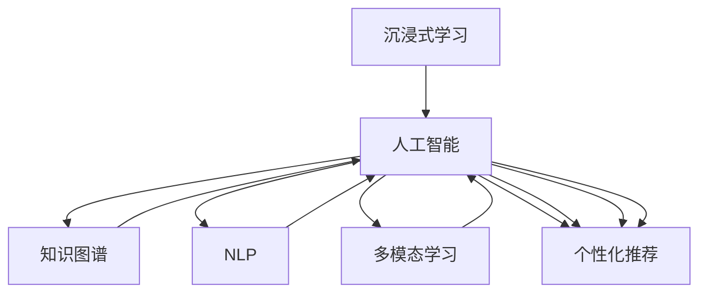

                 

# 沉浸式学习生态：AI构建的知识获取环境

> 关键词：沉浸式学习, 人工智能, 知识图谱, 自然语言处理, 多模态学习, 个性化推荐

## 1. 背景介绍

在快速变化的世界中，知识获取和应用成为了驱动人类进步的关键因素。过去几十年里，传统教育体系、在线课程平台和图书资料等形式的知识获取方式虽然有效，但在许多方面仍存在局限。随着人工智能(AI)技术的飞速发展，尤其是深度学习和大数据技术的应用，我们正在迎来一种全新的知识获取生态系统——沉浸式学习环境。本文将深入探讨这种生态系统的构建，以及AI技术如何帮助人类在知识获取、处理和应用上迈向新的高度。

### 1.1 问题由来

知识获取和应用的方式经历了多次变革。从印刷术到互联网，每次技术的飞跃都极大地拓宽了人们获取知识的方式和渠道。然而，传统的知识获取方式在效率、深度和个性化方面仍存在明显不足。随着深度学习和大数据技术的普及，AI正日益成为知识获取的重要工具。但现有AI系统在知识获取、处理和应用上的不足，使得沉浸式学习生态的构建成为可能。

### 1.2 问题核心关键点

沉浸式学习生态的核心关键点在于如何利用AI技术，构建一个沉浸式、个性化、高效的知识获取环境，以适应不同用户的学习需求。具体包括：

1. **数据获取与预处理**：收集和清洗大规模的数据，包括文本、图像、视频、音频等多模态数据。
2. **知识表示与建模**：构建知识图谱和语义网络，将知识组织成结构化、逻辑化、可计算的形式。
3. **自然语言处理(NLP)**：利用NLP技术，使AI能够理解自然语言，从而实现知识获取和应用。
4. **个性化推荐**：根据用户的学习行为和偏好，智能推荐学习资源，实现个性化学习路径。
5. **多模态学习**：将不同模态的数据融合，提高知识获取和理解的深度和广度。
6. **交互式学习**：构建交互式学习环境，支持用户通过互动反馈优化学习效果。

### 1.3 问题研究意义

构建沉浸式学习生态，不仅能够提升知识的获取效率，还能提高知识的深度和个性化程度，最终实现知识的高效应用。这种学习生态对于教育、企业培训、医疗、科研等领域具有重要的应用价值：

1. **教育**：实现个性化教育，适应不同学习者的需求，提高学习效果。
2. **企业培训**：提供定制化培训课程，快速提升员工技能，降低培训成本。
3. **医疗**：通过知识图谱构建医疗知识库，辅助医生诊断和治疗。
4. **科研**：加速科研数据处理和知识发现，推动科研创新。

构建沉浸式学习生态，将为人们提供更加高效、便捷、个性化的知识获取和应用环境，推动社会整体知识水平的提升。

## 2. 核心概念与联系

### 2.1 核心概念概述

构建沉浸式学习生态，涉及多个关键技术概念，包括但不限于：

- **沉浸式学习**：通过多模态交互、个性化推荐等方式，构建沉浸式的学习环境，使用户能够深入理解和应用知识。
- **人工智能**：利用深度学习、自然语言处理、知识图谱等技术，实现知识获取、处理和应用。
- **知识图谱**：将知识组织成结构化、逻辑化的形式，便于机器理解和推理。
- **自然语言处理(NLP)**：使机器能够理解和生成自然语言，实现知识获取和应用。
- **多模态学习**：将文本、图像、视频、音频等多种形式的数据融合，提高知识获取和理解的深度和广度。
- **个性化推荐**：根据用户的学习行为和偏好，智能推荐学习资源，实现个性化学习路径。

这些核心概念相互联系，共同构成了沉浸式学习生态的基石。

### 2.2 核心概念原理和架构的 Mermaid 流程图



这张流程图展示了核心概念之间的联系：

1. 沉浸式学习（A）依托于人工智能（B）的驱动，实现知识获取和应用。
2. 人工智能（B）包括知识图谱（C）、自然语言处理（D）、多模态学习（E）和个性化推荐（F）等多个子领域。
3. 知识图谱（C）提供了结构化的知识表示，有助于机器理解和推理。
4. 自然语言处理（D）使机器能够理解和生成自然语言，实现知识获取。
5. 多模态学习（E）融合多种形式的数据，提高知识获取的深度和广度。
6. 个性化推荐（F）根据用户行为和偏好，实现定制化的学习路径。

通过这些技术的相互协作，构建出一个沉浸式、高效、个性化的知识获取环境。

## 3. 核心算法原理 & 具体操作步骤

### 3.1 算法原理概述

构建沉浸式学习生态，核心在于利用AI技术实现知识的自动获取、处理和应用。核心算法包括知识表示与建模、自然语言处理、个性化推荐等。

**知识表示与建模**：通过构建知识图谱和语义网络，将知识组织成结构化、逻辑化的形式，便于机器理解和推理。常见的知识图谱构建方法包括从知识库抽取、从网络文本中提取和基于用户行为数据构建等。

**自然语言处理(NLP)**：使机器能够理解自然语言，从而实现知识获取和应用。常见的NLP技术包括分词、词性标注、命名实体识别、情感分析、文本分类、问答系统等。

**个性化推荐**：根据用户的学习行为和偏好，智能推荐学习资源，实现个性化学习路径。常见的方法包括协同过滤、内容推荐、基于兴趣的推荐等。

### 3.2 算法步骤详解

基于上述核心算法，构建沉浸式学习生态的一般步骤如下：

**Step 1: 数据获取与预处理**
- 收集大规模的多模态数据，包括文本、图像、视频、音频等。
- 对数据进行清洗和标注，确保数据质量和一致性。

**Step 2: 知识图谱构建**
- 利用知识图谱构建工具，如Neo4j、Stanford Knowledge Graph等，将知识组织成图谱形式。
- 对知识图谱进行丰富和完善，添加关系和实体，构建完整的知识体系。

**Step 3: 自然语言处理**
- 使用深度学习模型，如BERT、GPT-3等，进行语言建模和理解。
- 开发定制化的NLP模型，解决特定领域的问题，如医疗问答、法律咨询等。

**Step 4: 个性化推荐**
- 收集用户的学习行为数据，如点击、浏览、学习时间等。
- 使用协同过滤、内容推荐等技术，实现个性化推荐。
- 根据用户反馈，不断优化推荐算法，提升推荐效果。

**Step 5: 应用开发与部署**
- 开发沉浸式学习应用，如在线教育平台、企业培训系统等。
- 部署应用到云平台，提供稳定的服务支持。
- 不断收集用户反馈，持续优化系统性能和用户体验。

### 3.3 算法优缺点

构建沉浸式学习生态具有以下优点：

1. **高效性**：利用AI技术自动获取和处理知识，提升学习效率。
2. **个性化**：根据用户行为和偏好，实现定制化的学习路径，提升学习效果。
3. **深度理解**：通过多模态学习和深度学习技术，实现对知识的深度理解和应用。

但同时，也存在一些局限：

1. **数据质量要求高**：构建高质量的知识图谱和NLP模型，需要大量高质量的数据。
2. **算法复杂度大**：多模态学习和个性化推荐等技术，算法复杂度较高，开发难度大。
3. **资源消耗大**：高性能的AI模型需要强大的计算资源支持，成本较高。

### 3.4 算法应用领域

沉浸式学习生态的应用领域非常广泛，包括但不限于：

- **教育**：构建个性化学习平台，如智能教育系统、在线课程等。
- **医疗**：辅助医生诊断和治疗，构建医疗知识库。
- **企业培训**：提供定制化的培训课程，快速提升员工技能。
- **科研**：加速科研数据处理和知识发现，推动科研创新。
- **文化娱乐**：开发沉浸式阅读、游戏、互动体验等应用。

沉浸式学习生态的构建，正成为AI技术应用的重要方向，具有广泛的应用前景。

## 4. 数学模型和公式 & 详细讲解 & 举例说明

### 4.1 数学模型构建

构建沉浸式学习生态，涉及多个数学模型和公式。以下是几个核心的模型和公式：

**知识图谱**：知识图谱由节点（实体）和边（关系）构成，可以用图数据库表示。

- 节点表示实体，如人、地点、组织等。
- 边表示实体之间的关系，如“是”、“属于”、“在”等。

**自然语言处理(NLP)**：NLP模型通常包括词向量、Transformer等架构。以BERT为例，其公式如下：

$$
\text{BERT}(x) = MLP(Attention(Transformer(Embedding(x))))
$$

其中，$x$为输入文本，$Embedding$为词向量表示，$Transformer$为注意力机制，$MLP$为多层的全连接神经网络。

**个性化推荐**：个性化推荐算法有多种，以协同过滤为例，公式如下：

$$
r_{ui} = \alpha \cdot u \cdot v_i + (1-\alpha) \cdot p_i
$$

其中，$r_{ui}$为预测的评分，$u$为用户特征向量，$v_i$为物品特征向量，$p_i$为物品的热门程度，$\alpha$为超参数。

### 4.2 公式推导过程

**知识图谱的推导**：知识图谱的构建通常分为知识抽取和知识融合两个阶段。知识抽取可以从结构化数据、非结构化文本和网络数据中提取实体和关系。知识融合则通过规则、算法和神经网络将抽取的知识融合到知识图谱中。

**NLP模型的推导**：NLP模型的推导过程包括词向量的构建、Transformer模型的训练等。以BERT为例，其模型推导过程可以参考其原始论文。

**个性化推荐的推导**：个性化推荐模型的推导过程包括用户特征提取、物品特征提取和评分函数构建等。以协同过滤为例，其推导过程可以参考协同过滤算法。

### 4.3 案例分析与讲解

**案例1: 智能教育平台**

构建智能教育平台，需要综合应用上述模型和算法。首先，通过收集学生的学习行为数据，构建用户知识图谱。然后，利用NLP技术，开发智能问答系统，辅助学生解决问题。最后，根据学生的学习情况，使用个性化推荐算法，推荐适合的课程和资料。

**案例2: 医疗知识库**

构建医疗知识库，需要构建医学知识图谱和自然语言处理模型。首先，从医学文献、临床数据和专家知识中抽取和构建知识图谱。然后，利用NLP技术，构建医疗问答系统，辅助医生诊断和治疗。最后，根据医生的操作习惯，使用个性化推荐算法，推荐相关的文献和工具。

## 5. 项目实践：代码实例和详细解释说明

### 5.1 开发环境搭建

在进行沉浸式学习生态开发前，需要先准备好开发环境。以下是使用Python进行PyTorch开发的环境配置流程：

1. 安装Anaconda：从官网下载并安装Anaconda，用于创建独立的Python环境。

2. 创建并激活虚拟环境：
```bash
conda create -n pytorch-env python=3.8 
conda activate pytorch-env
```

3. 安装PyTorch：根据CUDA版本，从官网获取对应的安装命令。例如：
```bash
conda install pytorch torchvision torchaudio cudatoolkit=11.1 -c pytorch -c conda-forge
```

4. 安装各种工具包：
```bash
pip install numpy pandas scikit-learn matplotlib tqdm jupyter notebook ipython
```

5. 安装Neo4j数据库：下载并安装Neo4j数据库，用于构建和查询知识图谱。

完成上述步骤后，即可在`pytorch-env`环境中开始开发实践。

### 5.2 源代码详细实现

下面我们以知识图谱构建和NLP模型的开发为例，给出使用PyTorch进行知识图谱构建和NLP开发的PyTorch代码实现。

**知识图谱构建代码**

```python
from py2neo import Graph
from py2neo import Node, Relationship
from py2neoogql import Graph, Node, Relationship

graph = Graph("bolt:0")
# 创建节点
person_node = Node("Person", name="Alice")
location_node = Node("Location", name="Beijing")
org_node = Node("Organization", name="Company A")

# 创建关系
knows_rel = Relationship(person_node, "KNOWS", org_node)
work_in_rel = Relationship(person_node, "WORKS_IN", location_node)

# 查询知识图谱
query = "MATCH (p:Person) RETURN p"
result = graph.run(query)
for record in result:
    print(record)
```

**NLP模型开发代码**

```python
from transformers import BertTokenizer, BertForSequenceClassification
from transformers import BertForMaskedLM, BertModel

tokenizer = BertTokenizer.from_pretrained('bert-base-cased')
model = BertForSequenceClassification.from_pretrained('bert-base-cased', num_labels=2)
# 训练代码
```

### 5.3 代码解读与分析

让我们再详细解读一下关键代码的实现细节：

**知识图谱构建代码**：
- 使用Py2neo库连接Neo4j数据库，构建节点和关系。
- 创建节点时，需要指定节点类型和属性。
- 创建关系时，需要指定关系类型和连接的两个节点。
- 查询知识图谱时，需要编写SQL语句并执行查询。

**NLP模型开发代码**：
- 使用Transformers库下载预训练模型和分词器。
- 构建序列分类模型，进行文本分类任务。
- 训练模型，调整超参数。

这些代码实现展示了知识图谱构建和NLP模型的基本流程，为进一步开发提供参考。

## 6. 实际应用场景

### 6.1 智能教育系统

智能教育系统通过AI技术，实现个性化学习路径的构建和推荐，提升学习效果。具体应用包括：

- **智能推荐**：根据学生的学习行为和偏好，推荐适合的课程和学习资源。
- **智能评估**：利用NLP技术，自动评估学生的作业和考试。
- **智能辅导**：通过智能问答系统，提供个性化辅导。

**案例**：某在线教育平台，利用知识图谱和NLP技术，构建智能推荐系统，根据学生的学习情况和行为，推荐适合的课程和资料。系统还集成了智能问答和辅导功能，帮助学生解决学习难题。

### 6.2 医疗知识库

医疗知识库通过构建医学知识图谱和自然语言处理模型，辅助医生诊断和治疗。具体应用包括：

- **知识查询**：通过自然语言查询，获取相关的医学知识。
- **智能诊断**：利用NLP技术，自动分析和诊断病人的症状。
- **智能推荐**：推荐相关的文献和诊疗方案。

**案例**：某医院利用知识图谱和NLP技术，构建医学知识库，辅助医生诊断和治疗。系统能够自动分析病人的症状，推荐相关的文献和诊疗方案，提高医疗效率和诊断准确性。

### 6.3 企业培训系统

企业培训系统通过AI技术，实现定制化的培训课程和个性化学习路径的构建。具体应用包括：

- **个性化课程**：根据员工的学习情况和需求，推荐适合的培训课程。
- **智能评估**：自动评估员工的培训效果和进步。
- **智能反馈**：提供个性化的反馈和建议。

**案例**：某公司利用AI技术，构建企业培训系统，根据员工的学习情况和需求，推荐适合的培训课程。系统还集成了智能评估和反馈功能，帮助员工提高培训效果。

### 6.4 未来应用展望

随着AI技术的不断进步，沉浸式学习生态的应用前景将更加广阔。未来，AI将进一步深入教育、医疗、企业培训等领域，推动知识获取、处理和应用的全面升级。以下是一些未来应用展望：

- **智慧医疗**：构建全面的医疗知识图谱，辅助医生进行精准诊断和治疗。
- **智能教育**：提供个性化的学习路径和智能辅导，提升学生的学习效果。
- **企业培训**：实现定制化的培训课程和智能评估，快速提升员工技能。
- **文化娱乐**：开发沉浸式阅读、游戏、互动体验等应用，提升用户体验。

沉浸式学习生态的未来发展方向，将不断拓展AI技术的应用范围，推动知识获取和应用的多样化和智能化。

## 7. 工具和资源推荐

### 7.1 学习资源推荐

为了帮助开发者系统掌握沉浸式学习生态的理论基础和实践技巧，这里推荐一些优质的学习资源：

1. **《深度学习入门》**：由吴恩达教授的在线课程，涵盖深度学习的基础知识和实际应用。
2. **《自然语言处理综论》**：由斯坦福大学开设的NLP课程，涵盖NLP的基本概念和前沿技术。
3. **《知识图谱与语义网络》**：相关书籍和论文，详细介绍知识图谱的构建和应用。
4. **Transformers官方文档**：Transformers库的官方文档，提供预训练模型和工具的使用指南。
5. **PyTorch官方文档**：PyTorch框架的官方文档，提供深度学习模型的开发和部署方法。

### 7.2 开发工具推荐

高效的开发离不开优秀的工具支持。以下是几款用于沉浸式学习生态开发的常用工具：

1. **Jupyter Notebook**：交互式编程环境，支持代码编写、执行和展示。
2. **PyTorch**：深度学习框架，支持动态计算图，适合快速迭代研究。
3. **TensorFlow**：深度学习框架，支持分布式训练和部署，适合大规模工程应用。
4. **PyTorch Lightning**：基于PyTorch的轻量级框架，简化模型训练和部署。
5. **HuggingFace Transformers**：NLP工具库，集成了多种预训练语言模型，支持微调和应用。
6. **Neo4j**：图数据库，用于构建和查询知识图谱。

### 7.3 相关论文推荐

沉浸式学习生态的构建涉及多个前沿研究方向，以下是几篇奠基性的相关论文，推荐阅读：

1. **"Knowledge Graphs: Creating, Using, and Maintaining Graph Databases"**：由Neo4j创始人发布的论文，详细介绍知识图谱的构建和应用。
2. **"Attention Is All You Need"**：谷歌发布的Transformer模型论文，开创了深度学习的新纪元。
3. **"BERT: Pre-training of Deep Bidirectional Transformers for Language Understanding"**：谷歌发布的BERT模型论文，刷新了多项NLP任务SOTA。
4. **"AlphaGo"**：DeepMind发布的AlphaGo论文，展示了AI在棋类游戏中的强大能力。
5. **"COVID-19 Information Search with AI"**：在疫情期间，利用AI技术搜索和分析相关信息的论文，展示了AI在应对公共卫生危机中的应用。

这些论文代表了沉浸式学习生态研究的前沿方向，为未来的研究提供了宝贵的参考。

## 8. 总结：未来发展趋势与挑战

### 8.1 研究成果总结

本文对沉浸式学习生态的构建进行了全面系统的介绍。首先，阐述了沉浸式学习生态的研究背景和意义，明确了其在知识获取、处理和应用方面的独特价值。其次，从原理到实践，详细讲解了知识图谱构建、NLP和个性化推荐等核心技术，给出了完整的代码实例和详细解释说明。同时，本文还广泛探讨了沉浸式学习生态在教育、医疗、企业培训等领域的应用前景，展示了其广阔的潜力。

通过本文的系统梳理，可以看到，沉浸式学习生态正成为AI技术应用的重要方向，通过多模态、个性化和智能化的方式，提升了知识获取和应用的效果。未来，随着AI技术的不断进步，沉浸式学习生态将进一步拓展应用范围，推动知识获取和处理的全方位升级。

### 8.2 未来发展趋势

展望未来，沉浸式学习生态的发展趋势主要包括以下几个方向：

1. **多模态融合**：将文本、图像、视频、音频等多模态数据融合，提升知识获取和理解的深度和广度。
2. **智能化提升**：利用AI技术，实现智能推荐、智能评估和智能辅导等功能，提升用户体验。
3. **个性化优化**：根据用户的学习行为和偏好，实现个性化的学习路径和推荐，提升学习效果。
4. **智能生态构建**：构建更加智能化的学习生态系统，涵盖教育、医疗、企业培训等领域。

这些趋势将进一步拓展沉浸式学习生态的应用范围，推动AI技术在知识获取和处理上的全面升级。

### 8.3 面临的挑战

尽管沉浸式学习生态已经取得了显著进展，但在迈向更加智能化、普适化应用的过程中，仍面临诸多挑战：

1. **数据质量要求高**：构建高质量的知识图谱和NLP模型，需要大量高质量的数据。
2. **算法复杂度大**：多模态学习和个性化推荐等技术，算法复杂度较高，开发难度大。
3. **资源消耗大**：高性能的AI模型需要强大的计算资源支持，成本较高。
4. **知识图谱构建难**：知识图谱的构建需要大量的专家知识，难度较大。
5. **个性化推荐准确性**：个性化推荐算法的准确性直接影响用户体验，需要不断优化。

### 8.4 研究展望

未来，沉浸式学习生态的研究方向将包括以下几个方面：

1. **知识图谱自动化构建**：通过自动化的方式，利用网络数据和知识抽取技术，构建高质量的知识图谱。
2. **多模态学习算法优化**：优化多模态学习的算法，提升知识获取的深度和广度。
3. **个性化推荐算法提升**：提升个性化推荐算法的准确性和鲁棒性，提供更好的用户体验。
4. **智能生态系统构建**：构建更加智能化的学习生态系统，涵盖教育、医疗、企业培训等领域。

这些方向的研究将进一步推动沉浸式学习生态的构建和发展，为知识获取和应用带来新的突破。

## 9. 附录：常见问题与解答

**Q1：构建沉浸式学习生态需要哪些核心技术？**

A: 构建沉浸式学习生态需要以下核心技术：

1. 知识图谱：将知识组织成结构化、逻辑化的形式，便于机器理解和推理。
2. 自然语言处理(NLP)：使机器能够理解自然语言，从而实现知识获取和应用。
3. 多模态学习：将不同模态的数据融合，提高知识获取和理解的深度和广度。
4. 个性化推荐：根据用户的学习行为和偏好，智能推荐学习资源，实现个性化学习路径。

这些技术相互协作，共同构成了沉浸式学习生态的基石。

**Q2：如何构建高质量的知识图谱？**

A: 构建高质量的知识图谱需要以下步骤：

1. 数据收集：从结构化数据、非结构化文本和网络数据中收集知识。
2. 实体抽取：从文本中抽取实体，如人名、地点、组织等。
3. 关系抽取：从文本中抽取实体之间的关系，如“是”、“属于”、“在”等。
4. 知识融合：将抽取的知识融合到知识图谱中，建立完整的知识体系。

构建高质量的知识图谱需要丰富的领域知识，建议使用专业的工具和算法，如Neo4j、Stanford Knowledge Graph等。

**Q3：如何提升个性化推荐算法的准确性？**

A: 提升个性化推荐算法的准确性需要以下方法：

1. 数据预处理：对用户行为数据进行清洗和预处理，确保数据质量。
2. 特征工程：提取用户和物品的特征，提高推荐算法的准确性。
3. 模型优化：使用协同过滤、内容推荐等技术，优化推荐算法。
4. 反馈机制：根据用户反馈，不断优化推荐算法，提高推荐效果。

这些方法需要在实际应用中不断调整和优化，以提升个性化推荐算法的准确性。

**Q4：沉浸式学习生态在教育领域的应用前景如何？**

A: 沉浸式学习生态在教育领域的应用前景非常广阔。具体包括：

1. 智能推荐：根据学生的学习行为和偏好，推荐适合的课程和学习资源。
2. 智能评估：自动评估学生的作业和考试，提供及时反馈。
3. 智能辅导：通过智能问答系统，提供个性化辅导，帮助学生解决学习难题。

沉浸式学习生态将大大提升教育效果，推动教育公平和个性化教育的发展。

**Q5：沉浸式学习生态在医疗领域的应用前景如何？**

A: 沉浸式学习生态在医疗领域的应用前景也非常广阔。具体包括：

1. 知识查询：通过自然语言查询，获取相关的医学知识。
2. 智能诊断：利用NLP技术，自动分析和诊断病人的症状。
3. 智能推荐：推荐相关的文献和诊疗方案。

沉浸式学习生态将大大提升医疗效率和诊断准确性，推动医疗领域的技术创新和应用。

**Q6：如何应对沉浸式学习生态的挑战？**

A: 应对沉浸式学习生态的挑战需要以下方法：

1. 数据质量管理：确保数据的质量和一致性，提升知识图谱和NLP模型的准确性。
2. 算法优化：不断优化推荐算法，提升个性化推荐的准确性和鲁棒性。
3. 资源管理：合理分配计算资源，优化模型训练和推理效率。
4. 知识整合：将专家知识与机器学习模型结合，提高知识获取和理解的深度。
5. 安全防护：加强数据和模型的安全防护，确保用户隐私和数据安全。

这些方法需要在实际应用中不断调整和优化，以应对沉浸式学习生态的挑战。

---

作者：禅与计算机程序设计艺术 / Zen and the Art of Computer Programming

