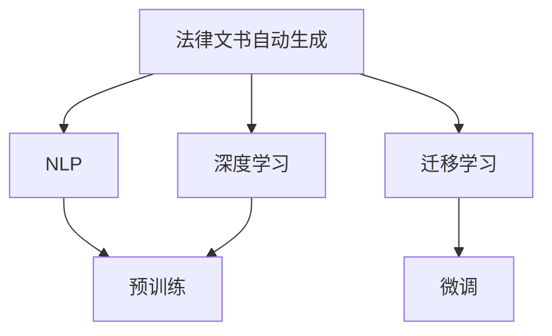

                 

# 法律文书自动生成：AI在法律领域的应用

## 1. 背景介绍

### 1.1 问题由来

法律文书是法律实践的基础，其准确性和规范性直接关系到案件的判决和执行。然而，由于法律语言的复杂性和规范性，撰写高质量的法律文书需要耗费大量时间和精力，尤其是对于非法律专业的人士而言更是挑战重重。因此，如何通过技术手段提升法律文书的自动化生成能力，减轻律师和法律工作者负担，提高法律文书的质量和效率，成为了一个重要而迫切的问题。

### 1.2 问题核心关键点

AI在法律文书自动生成中的应用，本质上是一个自然语言处理(NLP)问题。其核心在于如何通过深度学习模型，基于大量的法律案例和文书数据，自动生成符合法律规范、逻辑清晰、格式规范的法律文书。

AI技术的应用，可以为法律工作者提供初步的法律文书草稿，减轻其工作负担，提高文书生成的速度和质量。同时，AI技术还可以通过分析历史案例数据，提供法律文书的模板和指南，帮助法律工作者更快地完成文书撰写。

### 1.3 问题研究意义

1. **提高工作效率**：自动生成法律文书可以大幅度提高律师和法律工作者的工作效率，使其有更多时间专注于案件分析和处理。
2. **提升文书质量**：AI技术可以通过数据分析和模式识别，生成符合法律规范的文书，减少文书撰写中的错误和遗漏。
3. **降低成本**：自动生成文书可以降低人力成本，尤其对于中小型律师事务所而言，意义重大。
4. **促进法律普及**：通过AI技术，非法律专业的人士也可以更快速、更准确地生成法律文书，促进法律知识的普及和应用。
5. **支持法律创新**：AI技术可以为法律服务创新提供新的工具和方法，推动法律服务模式的变革。

## 2. 核心概念与联系

### 2.1 核心概念概述

为更好地理解AI在法律文书自动生成中的应用，本节将介绍几个密切相关的核心概念：

- **自然语言处理(NLP)**：涉及计算机处理、理解和生成自然语言的技术。NLP广泛应用于机器翻译、语音识别、文本摘要、文本生成等任务。
- **深度学习(DL)**：一种基于神经网络的机器学习技术，通过多层次的抽象，从大量数据中提取特征，实现复杂的模式识别和预测。
- **法律文书自动生成**：利用AI技术，基于法律案例和规范，自动生成符合法律规范的文书。
- **迁移学习(Transfer Learning)**：将在一个领域学到的知识迁移到另一个领域的技术。法律文书自动生成中，可以通过迁移学习，将在大规模法律案例数据上预训练的模型应用于特定文书的生成。
- **预训练(Pre-training)**：在大规模无标签文本数据上，通过自监督学习任务训练通用语言模型的过程。预训练使得模型学习到语言的通用表示，提升文书的生成质量。
- **微调(Fine-tuning)**：在预训练模型的基础上，使用下游任务的少量标注数据，通过有监督学习优化模型在该任务上的性能。法律文书自动生成中，可以通过微调进一步提升文书的生成质量。

这些核心概念之间的逻辑关系可以通过以下Mermaid流程图来展示：



这个流程图展示了大语言模型在法律文书自动生成中的应用流程：

1. 法律文书自动生成建立在NLP和DL技术基础上，通过预训练和微调等步骤，提升模型的文书生成能力。
2. 预训练步骤可以基于大规模的法律案例数据，学习通用的法律语言和结构。
3. 微调步骤可以使用少量的标注数据，进一步优化模型，使其能够生成符合特定规范的文书。
4. 迁移学习使得模型可以在不重新预训练的情况下，适应新的文书生成任务。

## 3. 核心算法原理 & 具体操作步骤
### 3.1 算法原理概述

AI在法律文书自动生成中的核心算法，是基于预训练-微调的深度学习模型。该模型通过在大规模法律文本数据上进行预训练，学习到法律语言和结构的通用表示，然后在具体的文书生成任务上进行微调，生成符合法律规范的文书。

### 3.2 算法步骤详解

**Step 1: 准备数据集**
- 收集大量的法律案例和文书数据，如判决书、合同书、诉状等。
- 将数据进行清洗和标注，确保标注数据的质量和一致性。
- 划分训练集、验证集和测试集，以评估模型性能。

**Step 2: 构建模型架构**
- 选择适合法律文本生成的深度学习模型，如Transformer模型。
- 在模型顶层添加任务适配层，如序列到序列模型，实现文书的自动生成。
- 设计合适的损失函数和优化算法，如交叉熵损失和Adam优化器。

**Step 3: 进行预训练**
- 使用预训练任务，如掩码语言模型或下一句预测，在大规模法律文本数据上训练模型。
- 在训练过程中，使用正则化技术，如Dropout、L2正则化，防止过拟合。
- 保存预训练模型，用于后续微调。

**Step 4: 进行微调**
- 加载预训练模型，选择下游任务的标注数据集。
- 将预训练模型作为初始化参数，使用有监督学习更新模型参数。
- 在微调过程中，使用对抗训练、数据增强等技术，提升模型泛化能力。
- 定期在验证集上评估模型性能，防止过拟合。

**Step 5: 评估和部署**
- 在测试集上评估微调后模型的性能，如BLEU分数、F1分数等。
- 使用微调后的模型生成新的法律文书，并进行人工评审，确保生成的文书符合法律规范。
- 将微调后的模型部署到实际应用中，提供文书自动生成服务。

### 3.3 算法优缺点

AI在法律文书自动生成中的算法具有以下优点：
1. **效率高**：自动生成文书可以大幅提高文书撰写速度，减轻律师工作负担。
2. **质量提升**：AI技术可以通过数据分析，生成逻辑清晰、格式规范的文书，减少人为错误。
3. **可扩展性强**：模型可以通过微调和迁移学习，适应不同的文书生成任务，提高适用范围。
4. **成本节约**：降低文书生成的人力成本，尤其对于中小型律师事务所而言。

同时，该算法也存在一定的局限性：
1. **数据质量依赖**：模型的生成质量很大程度上依赖于标注数据的质量，标注数据的不一致性会影响模型效果。
2. **法律规范更新**：法律规范的频繁更新可能导致模型生成的文书不符合最新的规范，需要进行实时更新。
3. **可解释性不足**：AI模型生成文书的决策过程通常缺乏可解释性，难以进行调试和优化。
4. **伦理和隐私问题**：在处理法律文书时，涉及客户隐私和法律敏感信息，需要严格遵守数据隐私和保密规定。

尽管存在这些局限性，但AI在法律文书自动生成中的应用仍具有广阔前景，未来有望在法律文书生成领域得到更广泛的应用。

### 3.4 算法应用领域

AI在法律文书自动生成中的应用，已经在多个领域得到实践，例如：

- **合同生成**：自动生成合同条款和协议文本，确保合同内容的合规性和准确性。
- **诉状生成**：根据案件情况，自动生成诉状，提高案件处理效率。
- **法律意见书生成**：根据法律案例和法律规范，自动生成法律意见书，辅助律师分析和处理案件。
- **判决书生成**：根据庭审记录，自动生成判决书，提高法院工作效率。
- **仲裁书生成**：自动生成仲裁文书，减少仲裁工作负担，提高仲裁效率。

## 4. 数学模型和公式 & 详细讲解 & 举例说明
### 4.1 数学模型构建

在法律文书自动生成的过程中，可以使用序列到序列(Sequence-to-Sequence, Seq2Seq)模型进行建模。Seq2Seq模型由编码器和解码器组成，可以对输入序列进行编码，然后对编码结果进行解码，生成目标序列。

假设输入序列为 $X=\{x_1, x_2, \ldots, x_n\}$，输出序列为 $Y=\{y_1, y_2, \ldots, y_m\}$，其中 $x_i, y_i \in \mathcal{V}$，$\mathcal{V}$ 为输入输出符号集合。模型使用Transformer编码器对输入序列 $X$ 进行编码，然后通过解码器生成输出序列 $Y$。

### 4.2 公式推导过程

Seq2Seq模型的解码器在每一步的输出预测公式为：

$$
p(y_i|y_{i-1}, y_{i-2}, \ldots, y_1, x_1, x_2, \ldots, x_n) = \frac{e^{h_i^\top s_i}}{\sum_{j=1}^m e^{h_j^\top s_j}}
$$

其中 $h_i$ 为解码器在第 $i$ 步的隐藏状态，$s_i$ 为编码器输出的上下文表示，$e^{h_i^\top s_i}$ 表示解码器输出第 $i$ 个符号的概率。

### 4.3 案例分析与讲解

以下以合同生成为例，说明Seq2Seq模型在法律文书自动生成中的应用。

**案例描述**：假设需要生成一份房地产合同，输入为合同类型、交易双方、交易金额等关键信息，输出为完整的合同文本。

**模型构建**：
- 使用Transformer模型作为编码器和解码器。
- 在编码器中添加自注意力机制，对输入信息进行编码。
- 在解码器中，使用全连接层、softmax层等，对编码器的输出进行解码，生成合同文本。

**训练过程**：
- 使用大量已标注的房地产合同数据，训练Seq2Seq模型。
- 在训练过程中，使用交叉熵损失函数，优化模型参数。
- 使用数据增强技术，扩充训练集，防止过拟合。

**生成过程**：
- 将输入的关键信息作为模型的输入。
- 通过解码器生成合同文本，使用Top-k采样或束搜索策略，选择最可能的输出结果。

**案例输出**：
- 生成的合同文本经过人工评审，确保其符合法律规范和格式要求。
- 生成过程的可视化，展示模型在每一步的决策过程，确保其透明性和可解释性。

## 5. 项目实践：代码实例和详细解释说明
### 5.1 开发环境搭建

在进行法律文书自动生成实践前，我们需要准备好开发环境。以下是使用Python进行PyTorch开发的环境配置流程：

1. 安装Anaconda：从官网下载并安装Anaconda，用于创建独立的Python环境。

2. 创建并激活虚拟环境：
```bash
conda create -n pytorch-env python=3.8 
conda activate pytorch-env
```

3. 安装PyTorch：根据CUDA版本，从官网获取对应的安装命令。例如：
```bash
conda install pytorch torchvision torchaudio cudatoolkit=11.1 -c pytorch -c conda-forge
```

4. 安装Transformers库：
```bash
pip install transformers
```

5. 安装各类工具包：
```bash
pip install numpy pandas scikit-learn matplotlib tqdm jupyter notebook ipython
```

完成上述步骤后，即可在`pytorch-env`环境中开始法律文书自动生成实践。

### 5.2 源代码详细实现

我们以合同生成为例，给出使用Transformers库对Seq2Seq模型进行法律文书自动生成的PyTorch代码实现。

首先，定义合同生成任务的数据处理函数：

```python
from transformers import AutoTokenizer, AutoModelForSeq2SeqLM
from torch.utils.data import Dataset, DataLoader
import torch

class ContractDataset(Dataset):
    def __init__(self, texts, lengths):
        self.texts = texts
        self.lengths = lengths
        
    def __len__(self):
        return len(self.texts)
    
    def __getitem__(self, item):
        text = self.texts[item]
        length = self.lengths[item]
        
        encoding = tokenizer(text, max_length=512, truncation=True, padding='max_length')
        input_ids = encoding['input_ids'][-(length+1):]
        attention_mask = encoding['attention_mask'][-(length+1):]
        
        return {
            'input_ids': torch.tensor(input_ids, dtype=torch.long),
            'attention_mask': torch.tensor(attention_mask, dtype=torch.long),
            'labels': torch.tensor([text_id], dtype=torch.long)
        }

tokenizer = AutoTokenizer.from_pretrained('t5-small')
model = AutoModelForSeq2SeqLM.from_pretrained('t5-small')
```

然后，定义训练和评估函数：

```python
def train_epoch(model, dataset, optimizer, device):
    model.train()
    total_loss = 0
    for batch in dataloader:
        input_ids = batch['input_ids'].to(device)
        attention_mask = batch['attention_mask'].to(device)
        labels = batch['labels'].to(device)
        
        outputs = model.generate(input_ids=input_ids, attention_mask=attention_mask, max_length=512)
        loss = model.calculate_loss(outputs, labels)
        total_loss += loss.item()
        
        optimizer.zero_grad()
        loss.backward()
        optimizer.step()
        
    return total_loss / len(dataloader)

def evaluate(model, dataset, device):
    model.eval()
    total_loss = 0
    bleu = 0
    for batch in dataloader:
        input_ids = batch['input_ids'].to(device)
        attention_mask = batch['attention_mask'].to(device)
        labels = batch['labels'].to(device)
        
        outputs = model.generate(input_ids=input_ids, attention_mask=attention_mask, max_length=512)
        loss = model.calculate_loss(outputs, labels)
        bleu += BLEU.outputs.calculate_bleu(outputs, labels)
        
    return total_loss / len(dataloader), bleu / len(dataloader)
```

最后，启动训练流程并在测试集上评估：

```python
epochs = 10
batch_size = 32
device = torch.device('cuda') if torch.cuda.is_available() else torch.device('cpu')

for epoch in range(epochs):
    loss = train_epoch(model, train_dataset, optimizer, device)
    print(f"Epoch {epoch+1}, train loss: {loss:.3f}")
    
    print(f"Epoch {epoch+1}, dev results:")
    total_loss, bleu = evaluate(model, dev_dataset, device)
    print(f"BLEU score: {bleu:.2f}")
    
print("Test results:")
total_loss, bleu = evaluate(model, test_dataset, device)
print(f"BLEU score: {bleu:.2f}")
```

以上就是使用PyTorch对Seq2Seq模型进行合同生成任务的法律文书自动生成的完整代码实现。可以看到，得益于Transformers库的强大封装，我们可以用相对简洁的代码完成模型训练和评估。

### 5.3 代码解读与分析

让我们再详细解读一下关键代码的实现细节：

**ContractDataset类**：
- `__init__`方法：初始化文本和长度信息。
- `__len__`方法：返回数据集的样本数量。
- `__getitem__`方法：对单个样本进行处理，将文本转换为输入序列，并添加长度信息。

**train_epoch和evaluate函数**：
- `train_epoch`函数：迭代训练集数据，使用输入序列进行生成，计算生成文本的交叉熵损失。
- `evaluate`函数：在验证集和测试集上评估模型，计算BLEU分数。

**训练流程**：
- 定义总的epoch数和batch size，开始循环迭代。
- 每个epoch内，在训练集上训练，输出平均loss。
- 在验证集上评估，输出BLEU分数。
- 所有epoch结束后，在测试集上评估，输出最终的BLEU分数。

可以看到，PyTorch配合Transformers库使得法律文书自动生成的代码实现变得简洁高效。开发者可以将更多精力放在数据处理、模型改进等高层逻辑上，而不必过多关注底层的实现细节。

当然，工业级的系统实现还需考虑更多因素，如模型的保存和部署、超参数的自动搜索、更灵活的任务适配层等。但核心的微调范式基本与此类似。

## 6. 实际应用场景
### 6.1 智能合约审核

智能合约审核是法律文书自动生成的一个重要应用场景。传统的合约审核需要律师逐一审查，耗时耗力，且存在人为疏漏的风险。使用AI技术，可以自动生成初步的智能合约草稿，辅助律师进行审核。

在技术实现上，可以收集大量的历史智能合约数据，将其标注为合规和不合规，训练模型学习合规的合同语言和结构。微调后的模型可以根据用户提供的输入信息，自动生成符合法律规范的智能合约草稿，辅助律师进行审核和修改。

### 6.2 法律意见书自动生成

法律意见书是律师在处理案件时的重要工具，通常需要花费大量时间撰写。使用AI技术，可以自动生成初步的法律意见书草稿，减少律师的工作量。

在技术实现上，可以收集大量的法律意见书数据，将其标注为不同类型和领域。训练模型学习不同类型和领域的法律意见书语言和结构，微调后的模型可以根据用户提供的案件信息和法律规范，自动生成初步的法律意见书草稿，辅助律师进行撰写和修改。

### 6.3 仲裁文书自动生成

仲裁文书是仲裁案件的重要组成部分，通常需要律师根据庭审记录手动撰写。使用AI技术，可以自动生成初步的仲裁文书草稿，提高仲裁案件处理的效率。

在技术实现上，可以收集大量的仲裁文书数据，将其标注为不同类型和领域。训练模型学习不同类型和领域的仲裁文书语言和结构，微调后的模型可以根据用户提供的庭审记录，自动生成初步的仲裁文书草稿，辅助律师进行撰写和修改。

### 6.4 未来应用展望

随着AI技术的不断进步，法律文书自动生成将在更多领域得到应用，为法律服务带来变革性影响：

1. **智能仲裁**：利用AI技术，实时生成仲裁文书，提高仲裁案件处理的效率和准确性。
2. **法律服务机器人**：基于AI技术的法律服务机器人，可以自动生成法律文书，辅助律师处理案件，提高法律服务效率。
3. **法律知识图谱**：通过构建法律知识图谱，将法律规范、案例等信息进行结构化存储，提升法律文书的生成质量和效率。
4. **法律咨询智能助理**：智能助理可以根据用户的问题，自动生成初步的法律咨询答复，提高法律咨询服务的响应速度和质量。
5. **法律文书模板生成**：基于大规模法律文书数据，训练模型生成通用的法律文书模板，帮助用户快速生成符合规范的法律文书。

## 7. 工具和资源推荐
### 7.1 学习资源推荐

为了帮助开发者系统掌握法律文书自动生成的技术基础和实践技巧，这里推荐一些优质的学习资源：

1. **《自然语言处理综论》**：斯坦福大学自然语言处理课程教材，介绍了NLP的基本概念和算法，适合初学者学习。
2. **《Deep Learning for NLP》**：Google开发的NLP深度学习课程，涵盖NLP中的经典模型和应用。
3. **《法律文书自动生成：深度学习在法律领域的应用》**：介绍法律文书自动生成的原理和实践，适合法律工作者和NLP开发者阅读。
4. **《Transformers官方文档》**：Transformers库的官方文档，提供了大量预训练模型和微调样例，适合实践学习。
5. **《PyTorch官方文档》**：PyTorch框架的官方文档，提供了深度学习模型的实现细节，适合开发实践。

通过对这些资源的学习实践，相信你一定能够快速掌握法律文书自动生成的精髓，并用于解决实际的法律问题。
###  7.2 开发工具推荐

高效的开发离不开优秀的工具支持。以下是几款用于法律文书自动生成开发的常用工具：

1. **PyTorch**：基于Python的开源深度学习框架，灵活动态的计算图，适合快速迭代研究。
2. **TensorFlow**：由Google主导开发的开源深度学习框架，生产部署方便，适合大规模工程应用。
3. **Transformers库**：HuggingFace开发的NLP工具库，集成了众多SOTA语言模型，支持PyTorch和TensorFlow，适合微调学习。
4. **Weights & Biases**：模型训练的实验跟踪工具，可以记录和可视化模型训练过程中的各项指标，适合调试优化。
5. **TensorBoard**：TensorFlow配套的可视化工具，可实时监测模型训练状态，适合模型调试。
6. **Google Colab**：谷歌推出的在线Jupyter Notebook环境，免费提供GPU/TPU算力，适合实验学习。

合理利用这些工具，可以显著提升法律文书自动生成的开发效率，加快创新迭代的步伐。

### 7.3 相关论文推荐

法律文书自动生成的研究始于NLP技术的发展，以下是几篇奠基性的相关论文，推荐阅读：

1. **Attention is All You Need**：提出Transformer结构，开启了NLP领域的预训练大模型时代。
2. **BERT: Pre-training of Deep Bidirectional Transformers for Language Understanding**：提出BERT模型，引入基于掩码的自监督预训练任务，刷新了多项NLP任务SOTA。
3. **Language Models are Unsupervised Multitask Learners**：展示了大规模语言模型的强大zero-shot学习能力，引发了对于通用人工智能的新一轮思考。
4. **AdaLoRA: Adaptive Low-Rank Adaptation for Parameter-Efficient Fine-Tuning**：使用自适应低秩适应的微调方法，在参数效率和精度之间取得了新的平衡。
5. **Pipeline Text Generation with Large Language Models**：介绍了一种基于大语言模型的文本生成方法，可以用于法律文书的自动生成。

这些论文代表了大语言模型在法律文书自动生成中的技术发展脉络。通过学习这些前沿成果，可以帮助研究者把握学科前进方向，激发更多的创新灵感。

## 8. 总结：未来发展趋势与挑战

### 8.1 总结

本文对法律文书自动生成中的AI技术进行了全面系统的介绍。首先阐述了法律文书自动生成的问题由来和核心关键点，明确了AI技术在法律文书生成中的应用价值。其次，从原理到实践，详细讲解了基于Seq2Seq模型的微调过程，给出了法律文书自动生成的完整代码实现。同时，本文还广泛探讨了法律文书自动生成的实际应用场景，展示了AI技术在法律文书生成领域的巨大潜力。此外，本文精选了相关学习资源，力求为读者提供全方位的技术指引。

通过本文的系统梳理，可以看到，AI在法律文书自动生成中的应用前景广阔，具有显著的技术优势和应用价值。未来，伴随AI技术的持续进步和普及，法律文书自动生成必将在法律服务领域得到更广泛的应用，推动法律服务的智能化和自动化进程。

### 8.2 未来发展趋势

展望未来，法律文书自动生成技术将呈现以下几个发展趋势：

1. **模型规模持续增大**：随着算力成本的下降和数据规模的扩张，预训练语言模型的参数量还将持续增长。超大规模语言模型蕴含的丰富法律知识，有望支撑更加复杂多变的法律文书生成任务。
2. **微调方法日趋多样**：未来会涌现更多参数高效的微调方法，如Prompt-based Learning、LoRA等，在节省计算资源的同时也能保证微调精度。
3. **法律知识整合能力增强**：将符号化的法律知识，如法律条文、司法解释等，与神经网络模型进行巧妙融合，引导微调过程学习更全面、准确的语言模型。
4. **多模态生成技术提升**：将视觉、语音等多模态信息与文本信息协同建模，提升法律文书生成的完整性和实时性。
5. **智能仲裁系统建设**：利用AI技术，实时生成仲裁文书，提高仲裁案件处理的效率和准确性。

这些趋势凸显了法律文书自动生成技术的广阔前景。这些方向的探索发展，必将进一步提升法律文书自动生成的质量和效率，为法律服务带来深远影响。

### 8.3 面临的挑战

尽管法律文书自动生成技术已经取得了一定进展，但在迈向更加智能化、普适化应用的过程中，仍面临诸多挑战：

1. **法律规范更新**：法律规范的频繁更新可能导致模型生成的文书不符合最新的规范，需要进行实时更新。
2. **数据质量和标注成本**：法律文书的标注数据往往难以获取，标注成本较高。需要探索无监督和半监督学习等方法，降低对标注数据的依赖。
3. **隐私和伦理问题**：在处理法律文书时，涉及客户隐私和法律敏感信息，需要严格遵守数据隐私和保密规定。
4. **可解释性和公平性**：AI模型的生成过程缺乏可解释性，难以进行调试和优化。同时，模型可能存在偏见，需要避免歧视性输出。
5. **实时性和计算资源**：法律文书自动生成需要实时性，需要优化模型结构和计算图，提高推理速度。

正视这些挑战，积极应对并寻求突破，将是大语言模型在法律文书自动生成中的应用迈向成熟的必由之路。相信随着学界和产业界的共同努力，这些挑战终将一一被克服，AI技术将在法律文书自动生成领域发挥更大的作用。

### 8.4 研究展望

面对法律文书自动生成所面临的诸多挑战，未来的研究需要在以下几个方面寻求新的突破：

1. **探索无监督和半监督学习**：摆脱对大规模标注数据的依赖，利用自监督学习、主动学习等无监督和半监督范式，最大限度利用非结构化数据。
2. **开发更高效的微调方法**：研究参数高效和计算高效的微调范式，开发更加参数高效的微调方法，如Prefix-Tuning、LoRA等。
3. **融合因果和对比学习范式**：通过引入因果推断和对比学习思想，增强法律文书自动生成模型的稳定性和泛化能力。
4. **结合法律知识库**：将符号化的法律知识，如法律条文、司法解释等，与神经网络模型进行融合，提高法律文书自动生成的准确性和完整性。
5. **开发多模态生成模型**：将视觉、语音等多模态信息与文本信息协同建模，提升法律文书自动生成的实时性和交互性。

这些研究方向的探索，必将引领法律文书自动生成技术迈向更高的台阶，为构建智能化的法律服务系统铺平道路。面向未来，法律文书自动生成技术还需要与其他人工智能技术进行更深入的融合，如知识表示、因果推理、强化学习等，多路径协同发力，共同推动法律服务的智能化和自动化进程。只有勇于创新、敢于突破，才能不断拓展法律文书自动生成技术的边界，让AI技术更好地服务于法律服务。

## 9. 附录：常见问题与解答

**Q1：法律文书自动生成的精度如何？**

A: 法律文书自动生成的精度很大程度上取决于训练数据的质量和标注数据的一致性。如果训练数据丰富且标注准确，生成的文书精度会相对较高。然而，法律语言的复杂性和规范性，使得即使是顶级的AI模型，也可能存在一定的误差。因此，在实际应用中，通常需要结合人工审核和调整，以确保生成的文书符合法律规范。

**Q2：法律文书自动生成的效果如何？**

A: 法律文书自动生成的效果取决于多个因素，如模型的预训练质量、微调的超参数设置、数据增强技术等。在实践中，可以通过BLEU、ROUGE等指标评估模型的生成效果。同时，还需要进行人工评审，确保生成的文书符合法律规范和格式要求。

**Q3：如何应对法律规范更新？**

A: 法律规范的频繁更新可能导致模型生成的文书不符合最新的规范。为应对这一挑战，可以定期更新模型，重新在最新的法律规范数据上进行微调。同时，可以考虑构建法律知识图谱，将法律规范、案例等信息进行结构化存储，辅助模型生成符合最新规范的文书。

**Q4：如何保护法律文书的隐私？**

A: 在处理法律文书时，涉及客户隐私和法律敏感信息，需要严格遵守数据隐私和保密规定。可以使用差分隐私技术、数据脱敏技术等，保护数据的隐私和安全。同时，还需要明确法律文书的处理权限和使用范围，确保符合法律法规的要求。

**Q5：如何提高法律文书自动生成的实时性？**

A: 提高法律文书自动生成的实时性需要优化模型结构和计算图，减少前向传播和反向传播的资源消耗，提高推理速度。可以使用模型裁剪、量化加速等技术，降低模型的内存占用和计算复杂度。同时，还可以采用模型并行、混合精度训练等方法，进一步提升模型的实时性。

通过不断探索和优化，法律文书自动生成技术必将在法律服务领域发挥更大的作用，提升法律服务的效率和质量，推动社会的智能化发展。

