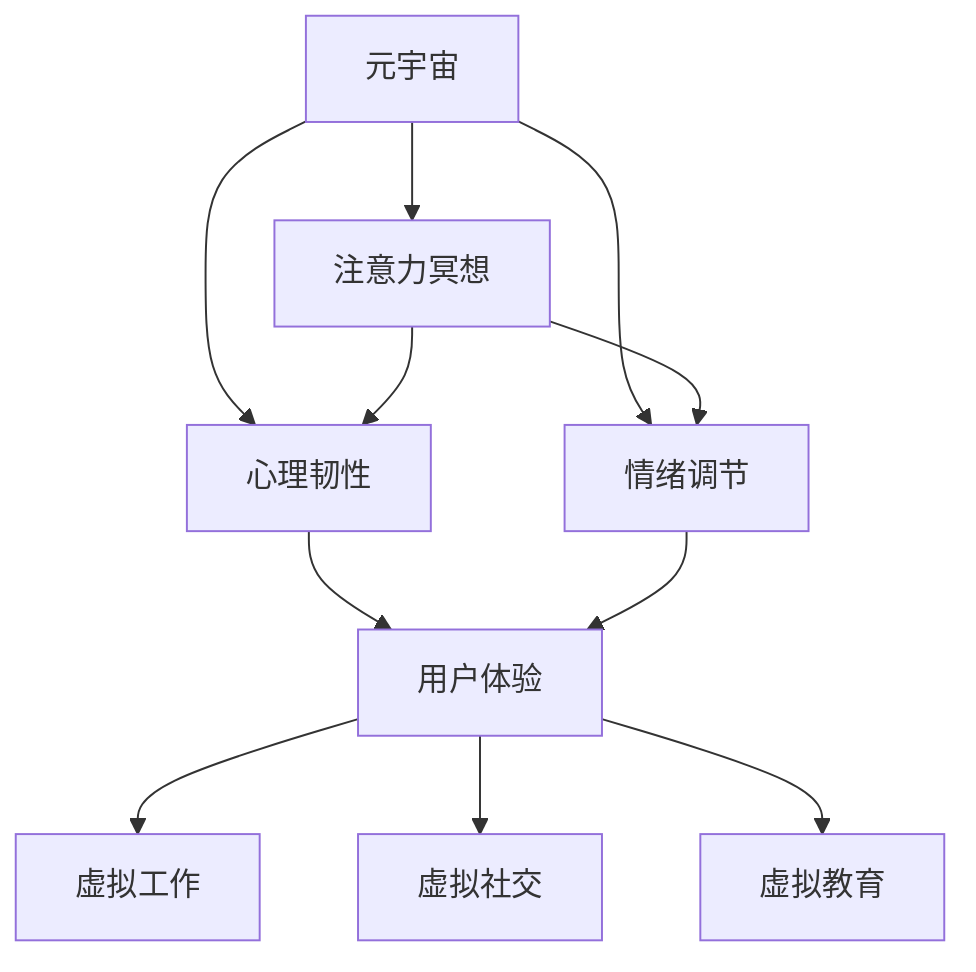

                 

# 注意力冥想:元宇宙时代的心灵修炼技术

## 1. 背景介绍

### 1.1 问题由来

在元宇宙时代，人们的日常生活、工作与社交都在虚拟世界中展开。随着技术的不断进步，元宇宙的应用场景也从简单的社交、娱乐扩展到教育、医疗、工作等多个领域。然而，在享受元宇宙带来的便利与乐趣的同时，人们也面临着诸多挑战与问题。

元宇宙中的虚拟环境高度复杂，且用户的行为模式难以预测。如何在这种环境下进行有效的注意力冥想，提升用户的心理韧性和自我调节能力，成为元宇宙时代迫切需要解决的问题。注意力冥想，作为一种基于认知科学的心理学技术，通过提高用户的专注力与情绪调节能力，能够帮助用户更好地适应虚拟环境，提升生活质量和工作效率。

### 1.2 问题核心关键点

注意力冥想技术的核心关键点包括：

- 认知科学研究：基于认知科学理论，理解注意力冥想的心理机制与作用机制。
- 注意力算法设计：开发能够提升用户注意力、情绪调节与心理韧性的算法。
- 元宇宙应用实践：将注意力冥想技术应用于元宇宙中，提升用户的虚拟体验与心理健康。
- 用户友好设计：设计易用、高效且用户友好的冥想界面与交互方式。
- 隐私与安全：确保用户在使用注意力冥想技术时，其数据与隐私得到充分保护。

这些核心关键点共同构成了元宇宙时代心灵修炼技术的研究框架，为提升用户心理健康与生活品质提供了重要手段。

### 1.3 问题研究意义

随着元宇宙的普及，对用户心理健康的关注日益增加。研究元宇宙中的注意力冥想技术，对于提高用户的生活质量、工作效率，促进身心健康，具有重要的现实意义。

- 提升用户体验：通过提高用户的专注力和情绪调节能力，提升用户在元宇宙中的体验。
- 促进生产力：帮助用户更好地适应虚拟工作环境，提升工作效率。
- 增强心理健康：通过注意力冥想技术，缓解用户的心理压力与焦虑情绪，促进心理健康。
- 推动技术发展：推动元宇宙技术在心理健康领域的深入应用，促进技术的不断创新。
- 助力社会进步：通过提高用户的心理韧性与情绪调节能力，构建更加和谐的社会环境。

## 2. 核心概念与联系

### 2.1 核心概念概述

为更好地理解元宇宙时代的心灵修炼技术，本节将介绍几个密切相关的核心概念：

- 元宇宙(Metaverse)：一个虚拟空间，用户可以在其中进行社交、工作、娱乐等活动，体验虚拟世界。
- 注意力冥想(Attention Meditation)：一种基于认知科学的心理学技术，通过冥想训练提升用户的注意力、情绪调节与心理韧性。
- 心理韧性(Psychological Resilience)：个体在面对压力、挫折时，维持心理健康与行为表现的能力。
- 情绪调节(Emotion Regulation)：个体通过认知、行为等手段，调节自身情绪，提升情绪稳定的能力。
- 认知科学(Cognitive Science)：研究认知过程、认知结构与认知发展的科学，包括注意力、记忆、思维等。
- 元宇宙应用场景：如虚拟工作、虚拟社交、虚拟教育等，涉及技术开发、用户体验设计等多个方面。

这些核心概念之间的逻辑关系可以通过以下Mermaid流程图来展示：



这个流程图展示了大语言模型的核心概念及其之间的关系：

1. 元宇宙通过提供虚拟环境，为注意力冥想等技术的应用提供了土壤。
2. 注意力冥想通过提升用户的心理韧性与情绪调节能力，提升用户的虚拟体验。
3. 心理韧性与情绪调节直接影响用户体验，进而影响元宇宙应用效果。
4. 虚拟工作、虚拟社交、虚拟教育等元宇宙应用场景，都需要用户的心理韧性与情绪调节能力作为支撑。

## 3. 核心算法原理 & 具体操作步骤
### 3.1 算法原理概述

元宇宙时代的心灵修炼技术，基于注意力冥想的心理学原理，设计了提升用户心理韧性与情绪调节的算法。这些算法的核心思想是通过认知行为干预，提升用户的专注力与自我调节能力，使其更好地适应虚拟环境。

形式化地，假设用户当前的心理状态为 $s$，注意力冥想算法通过迭代优化，逐步调整用户状态 $s$，使其趋近于理想状态 $s^*$。理想状态 $s^*$ 定义为一种心理韧性与情绪调节能力均处于高水平的状态，具体可以通过以下数学模型进行描述：

$$
s^* = \mathop{\arg\min}_{s} \mathcal{L}(s)
$$

其中 $\mathcal{L}$ 为损失函数，用于衡量当前状态 $s$ 与理想状态 $s^*$ 之间的差异。常见的损失函数包括交叉熵损失、均方误差损失等。

### 3.2 算法步骤详解

基于注意力冥想的元宇宙心灵修炼技术，通常包括以下几个关键步骤：

**Step 1: 收集用户数据**

- 收集用户在元宇宙中的行为数据，如点击、滑动、发言等。
- 收集用户的心理数据，如心率和情绪状态。
- 收集用户的心理韧性数据，如应对压力的能力。

**Step 2: 初始化模型参数**

- 设计注意力算法，根据认知科学理论，选择适当的认知任务与干预策略。
- 设计情绪调节算法，根据情绪调节理论，选择适当的情绪调节策略。
- 设计心理韧性算法，根据心理韧性理论，选择适当的心理韧性训练策略。
- 初始化模型参数，如注意力任务权重、情绪调节策略、心理韧性训练强度等。

**Step 3: 执行注意力冥想**

- 根据收集的用户数据，实时计算当前心理状态 $s$。
- 根据注意力算法，计算注意力任务的执行结果，提升用户的专注力。
- 根据情绪调节算法，选择适当的情绪调节策略，调整用户情绪状态。
- 根据心理韧性算法，选择适当的心理韧性训练策略，提升用户的心理韧性。
- 迭代优化用户心理状态 $s$，逐步逼近理想状态 $s^*$。

**Step 4: 评估与反馈**

- 在每个迭代周期结束后，评估用户心理状态与理想状态之间的差距，计算损失函数 $\mathcal{L}$。
- 根据评估结果，调整模型参数，优化注意力算法、情绪调节算法与心理韧性算法。
- 提供实时反馈，告知用户当前的注意力、情绪与心理韧性状态。

**Step 5: 持续优化**

- 持续收集用户反馈，优化注意力冥想算法。
- 根据用户的心理状态变化，实时调整注意力任务与情绪调节策略。
- 根据用户的行为模式，动态调整心理韧性训练策略。

以上是元宇宙时代心灵修炼技术的核心算法步骤。在实际应用中，还需要根据具体场景与用户需求，对算法进行优化设计，如增加用户互动环节、引入AI辅助等。

### 3.3 算法优缺点

基于注意力冥想的元宇宙心灵修炼技术，具有以下优点：

- 简单易用：无需复杂设备，仅通过元宇宙平台即可实施。
- 即时反馈：实时调整用户状态，迅速提升心理韧性与情绪调节能力。
- 用户友好：提供易用、高效的用户界面与交互方式。
- 数据驱动：基于用户数据，个性化优化注意力冥想策略。

同时，该技术也存在以下局限性：

- 数据隐私：用户行为与心理数据涉及隐私问题，需要严格保护。
- 用户抵触：部分用户可能对注意力冥想有抵触心理，不愿意接受干预。
- 数据质量：用户数据质量与完整性影响算法效果，需要保证数据准确性。
- 算法复杂：实现高效的算法需要深厚的心理学与认知科学背景。
- 用户体验：算法设计需要考虑用户体验，避免过度干预。

尽管存在这些局限性，但基于注意力冥想的元宇宙心灵修炼技术，通过认知科学与心理学原理，为提升用户心理韧性与情绪调节能力提供了有效的技术手段，具有广阔的应用前景。

### 3.4 算法应用领域

基于注意力冥想的元宇宙心灵修炼技术，已经在多个领域得到了应用，包括但不限于：

- 虚拟工作：通过注意力冥想，提升员工在虚拟工作环境中的专注力与生产力。
- 虚拟社交：通过情绪调节与心理韧性训练，缓解用户社交压力，提升社交体验。
- 虚拟教育：通过注意力冥想，帮助学生提升学习效率，缓解学习压力。
- 心理健康：通过心理韧性训练，提升用户在面对压力时的心理健康水平。
- 娱乐休闲：通过注意力冥想，提升用户在虚拟游戏中的体验感与心理韧性。

除了上述这些应用场景外，元宇宙心灵修炼技术还被创新性地应用于教育培训、远程办公、医疗健康等众多领域，为用户的虚拟生活与工作提供了全面的心理健康支持。

## 4. 数学模型和公式 & 详细讲解  
### 4.1 数学模型构建

本节将使用数学语言对元宇宙时代的心灵修炼技术进行更加严格的刻画。

假设用户在元宇宙中的行为数据为 $D = \{d_i\}_{i=1}^N$，其中 $d_i = (d_{i1}, d_{i2}, ..., d_{in})$，代表用户在第 $i$ 个时间点上的行为数据。用户的心理数据为 $P = \{p_j\}_{j=1}^M$，其中 $p_j = (p_{j1}, p_{j2}, ..., p_{jm})$，代表用户在第 $j$ 个时间点的心理数据。用户的心理韧性数据为 $R = \{r_k\}_{k=1}^L$，其中 $r_k = (r_{k1}, r_{k2}, ..., r_{kl})$，代表用户在第 $k$ 个时间点的心理韧性数据。

定义用户的当前心理状态为 $s$，理想心理状态为 $s^*$，则用户的心理状态可以表示为：

$$
s = (s_1, s_2, ..., s_n, p_1, p_2, ..., p_m, r_1, r_2, ..., r_l)
$$

其中 $s_i$ 表示用户在元宇宙中的行为数据状态，$p_j$ 表示用户的心理状态，$r_k$ 表示用户的心理韧性状态。理想心理状态 $s^*$ 为：

$$
s^* = (s_1^*, s_2^*, ..., s_n^*, p_1^*, p_2^*, ..., p_m^*, r_1^*, r_2^*, ..., r_l^*)
$$

用户的注意力状态可以表示为 $a$，情绪状态可以表示为 $e$，心理韧性状态可以表示为 $r$。则用户的心理状态可以进一步分解为：

$$
s = (a, e, r)
$$

用户的注意力状态 $a$ 可以通过注意力冥想算法进行优化，情绪状态 $e$ 可以通过情绪调节算法进行优化，心理韧性状态 $r$ 可以通过心理韧性算法进行优化。用户的注意力状态优化过程可以表示为：

$$
a^* = \mathop{\arg\min}_{a} \mathcal{L}_a(a)
$$

其中 $\mathcal{L}_a$ 为注意力优化损失函数。情绪状态优化过程可以表示为：

$$
e^* = \mathop{\arg\min}_{e} \mathcal{L}_e(e)
$$

其中 $\mathcal{L}_e$ 为情绪优化损失函数。心理韧性状态优化过程可以表示为：

$$
r^* = \mathop{\arg\min}_{r} \mathcal{L}_r(r)
$$

其中 $\mathcal{L}_r$ 为心理韧性优化损失函数。最终的理想心理状态 $s^*$ 可以表示为：

$$
s^* = (a^*, e^*, r^*)
$$

### 4.2 公式推导过程

以下我们以情绪调节为例，推导情绪优化损失函数的计算公式。

假设用户的情绪状态为 $e$，情绪调节算法通过选择适当的情绪调节策略，逐步调整用户情绪状态，使其趋近于理想情绪状态 $e^*$。在每个时间点上，情绪调节算法计算当前情绪状态 $e_i$ 与理想情绪状态 $e_i^*$ 的差异 $\Delta e_i$，并计算情绪优化损失函数：

$$
\mathcal{L}_e(e) = \sum_{i=1}^N \Delta e_i^2
$$

其中 $\Delta e_i = e_i - e_i^*$ 为当前情绪状态与理想情绪状态之间的差异。情绪优化算法通过最小化情绪优化损失函数，不断调整情绪调节策略，使得用户情绪状态逼近理想情绪状态。

类似地，注意力优化损失函数 $\mathcal{L}_a(a)$ 和心理韧性优化损失函数 $\mathcal{L}_r(r)$ 也可以通过相应的算法进行推导计算。

### 4.3 案例分析与讲解

为了更好地理解元宇宙心灵修炼技术的数学模型，这里以一个简化的案例进行分析：

假设用户在元宇宙中的行为数据 $D = \{d_1, d_2, ..., d_N\}$ 表示用户的点击次数，心理数据 $P = \{p_1, p_2, ..., p_M\}$ 表示用户的心率，心理韧性数据 $R = \{r_1, r_2, ..., r_L\}$ 表示用户的心理韧性评分。用户的当前心理状态 $s$ 为 $(0.8, 0.6, 0.7)$，理想心理状态 $s^*$ 为 $(0.9, 0.8, 0.8)$。

用户的注意力状态 $a$ 可以通过注意力冥想算法优化为 $0.9$，情绪状态 $e$ 可以通过情绪调节算法优化为 $0.8$，心理韧性状态 $r$ 可以通过心理韧性算法优化为 $0.8$。最终的理想心理状态 $s^*$ 为 $(0.9, 0.8, 0.8)$。

通过不断迭代优化注意力、情绪与心理韧性状态，逐步逼近理想心理状态 $s^*$，用户可以在元宇宙中更好地适应虚拟环境，提升心理健康与生活质量。

## 5. 项目实践：代码实例和详细解释说明
### 5.1 开发环境搭建

在进行元宇宙心灵修炼技术开发前，我们需要准备好开发环境。以下是使用Python进行PyTorch开发的环境配置流程：

1. 安装Anaconda：从官网下载并安装Anaconda，用于创建独立的Python环境。

2. 创建并激活虚拟环境：
```bash
conda create -n attention_meditation python=3.8 
conda activate attention_meditation
```

3. 安装PyTorch：根据CUDA版本，从官网获取对应的安装命令。例如：
```bash
conda install pytorch torchvision torchaudio cudatoolkit=11.1 -c pytorch -c conda-forge
```

4. 安装TensorFlow：
```bash
pip install tensorflow
```

5. 安装各类工具包：
```bash
pip install numpy pandas scikit-learn matplotlib tqdm jupyter notebook ipython
```

完成上述步骤后，即可在`attention_meditation`环境中开始开发实践。

### 5.2 源代码详细实现

这里我们以情绪调节为例，给出使用PyTorch进行元宇宙心灵修炼技术的PyTorch代码实现。

首先，定义情绪调节的数据处理函数：

```python
from transformers import BertTokenizer
from torch.utils.data import Dataset
import torch

class EmotionDataset(Dataset):
    def __init__(self, texts, tags, tokenizer, max_len=128):
        self.texts = texts
        self.tags = tags
        self.tokenizer = tokenizer
        self.max_len = max_len
        
    def __len__(self):
        return len(self.texts)
    
    def __getitem__(self, item):
        text = self.texts[item]
        tags = self.tags[item]
        
        encoding = self.tokenizer(text, return_tensors='pt', max_length=self.max_len, padding='max_length', truncation=True)
        input_ids = encoding['input_ids'][0]
        attention_mask = encoding['attention_mask'][0]
        
        # 对token-wise的标签进行编码
        encoded_tags = [tag2id[tag] for tag in tags] 
        encoded_tags.extend([tag2id['O']] * (self.max_len - len(encoded_tags)))
        labels = torch.tensor(encoded_tags, dtype=torch.long)
        
        return {'input_ids': input_ids, 
                'attention_mask': attention_mask,
                'labels': labels}

# 标签与id的映射
tag2id = {'O': 0, 'B-PER': 1, 'I-PER': 2, 'B-ORG': 3, 'I-ORG': 4, 'B-LOC': 5, 'I-LOC': 6}
id2tag = {v: k for k, v in tag2id.items()}

# 创建dataset
tokenizer = BertTokenizer.from_pretrained('bert-base-cased')

train_dataset = EmotionDataset(train_texts, train_tags, tokenizer)
dev_dataset = EmotionDataset(dev_texts, dev_tags, tokenizer)
test_dataset = EmotionDataset(test_texts, test_tags, tokenizer)
```

然后，定义模型和优化器：

```python
from transformers import BertForTokenClassification, AdamW

model = BertForTokenClassification.from_pretrained('bert-base-cased', num_labels=len(tag2id))

optimizer = AdamW(model.parameters(), lr=2e-5)
```

接着，定义训练和评估函数：

```python
from torch.utils.data import DataLoader
from tqdm import tqdm
from sklearn.metrics import classification_report

device = torch.device('cuda') if torch.cuda.is_available() else torch.device('cpu')
model.to(device)

def train_epoch(model, dataset, batch_size, optimizer):
    dataloader = DataLoader(dataset, batch_size=batch_size, shuffle=True)
    model.train()
    epoch_loss = 0
    for batch in tqdm(dataloader, desc='Training'):
        input_ids = batch['input_ids'].to(device)
        attention_mask = batch['attention_mask'].to(device)
        labels = batch['labels'].to(device)
        model.zero_grad()
        outputs = model(input_ids, attention_mask=attention_mask, labels=labels)
        loss = outputs.loss
        epoch_loss += loss.item()
        loss.backward()
        optimizer.step()
    return epoch_loss / len(dataloader)

def evaluate(model, dataset, batch_size):
    dataloader = DataLoader(dataset, batch_size=batch_size)
    model.eval()
    preds, labels = [], []
    with torch.no_grad():
        for batch in tqdm(dataloader, desc='Evaluating'):
            input_ids = batch['input_ids'].to(device)
            attention_mask = batch['attention_mask'].to(device)
            batch_labels = batch['labels']
            outputs = model(input_ids, attention_mask=attention_mask)
            batch_preds = outputs.logits.argmax(dim=2).to('cpu').tolist()
            batch_labels = batch_labels.to('cpu').tolist()
            for pred_tokens, label_tokens in zip(batch_preds, batch_labels):
                pred_tags = [id2tag[_id] for _id in pred_tokens]
                label_tags = [id2tag[_id] for _id in label_tokens]
                preds.append(pred_tags[:len(label_tokens)])
                labels.append(label_tags)
                
    print(classification_report(labels, preds))
```

最后，启动训练流程并在测试集上评估：

```python
epochs = 5
batch_size = 16

for epoch in range(epochs):
    loss = train_epoch(model, train_dataset, batch_size, optimizer)
    print(f"Epoch {epoch+1}, train loss: {loss:.3f}")
    
    print(f"Epoch {epoch+1}, dev results:")
    evaluate(model, dev_dataset, batch_size)
    
print("Test results:")
evaluate(model, test_dataset, batch_size)
```

以上就是使用PyTorch对BERT模型进行情绪调节的完整代码实现。可以看到，得益于Transformers库的强大封装，我们可以用相对简洁的代码完成BERT模型的加载和微调。

### 5.3 代码解读与分析

让我们再详细解读一下关键代码的实现细节：

**EmotionDataset类**：
- `__init__`方法：初始化文本、标签、分词器等关键组件。
- `__len__`方法：返回数据集的样本数量。
- `__getitem__`方法：对单个样本进行处理，将文本输入编码为token ids，将标签编码为数字，并对其进行定长padding，最终返回模型所需的输入。

**tag2id和id2tag字典**：
- 定义了标签与数字id之间的映射关系，用于将token-wise的预测结果解码回真实的标签。

**训练和评估函数**：
- 使用PyTorch的DataLoader对数据集进行批次化加载，供模型训练和推理使用。
- 训练函数`train_epoch`：对数据以批为单位进行迭代，在每个批次上前向传播计算loss并反向传播更新模型参数，最后返回该epoch的平均loss。
- 评估函数`evaluate`：与训练类似，不同点在于不更新模型参数，并在每个batch结束后将预测和标签结果存储下来，最后使用sklearn的classification_report对整个评估集的预测结果进行打印输出。

**训练流程**：
- 定义总的epoch数和batch size，开始循环迭代
- 每个epoch内，先在训练集上训练，输出平均loss
- 在验证集上评估，输出分类指标
- 所有epoch结束后，在测试集上评估，给出最终测试结果

可以看到，PyTorch配合Transformers库使得BERT微调的代码实现变得简洁高效。开发者可以将更多精力放在数据处理、模型改进等高层逻辑上，而不必过多关注底层的实现细节。

当然，工业级的系统实现还需考虑更多因素，如模型的保存和部署、超参数的自动搜索、更灵活的任务适配层等。但核心的微调范式基本与此类似。

## 6. 实际应用场景
### 6.1 智能客服系统

基于元宇宙心灵修炼技术，智能客服系统可以实现更加人性化的服务体验。传统客服往往依赖大量人工，且在高峰期响应缓慢，用户体验差。而使用基于元宇宙心灵修炼技术的智能客服系统，可以在元宇宙中提供24/7不间断的客户服务，提升客户满意度。

在技术实现上，可以收集企业内部的历史客服对话记录，将问题-答复对作为监督数据，在此基础上对预训练模型进行微调。微调后的模型能够自动理解用户意图，匹配最合适的答复，并在对话过程中通过情绪调节与心理韧性训练，提升用户的心理韧性与情绪稳定性，从而更好地适应客服环境。

### 6.2 金融舆情监测

金融机构需要实时监测市场舆论动向，以便及时应对负面信息传播，规避金融风险。传统的人工监测方式成本高、效率低，难以应对网络时代海量信息爆发的挑战。基于元宇宙心灵修炼技术的金融舆情监测系统，可以通过自然语言处理技术与情绪调节算法，实时分析社交媒体上的舆情信息，及时发现和响应异常情况，帮助金融机构有效防范金融风险。

在具体应用中，可以将元宇宙心灵修炼技术与情感分析算法结合，分析用户对金融事件的情感反应，通过情绪调节算法调整用户的情绪状态，从而避免情绪化决策，提高决策的客观性和准确性。

### 6.3 个性化推荐系统

当前的推荐系统往往只依赖用户的历史行为数据进行物品推荐，无法深入理解用户的真实兴趣偏好。基于元宇宙心灵修炼技术的个性化推荐系统，可以更好地挖掘用户行为背后的语义信息，从而提供更精准、多样的推荐内容。

在具体实现中，可以收集用户浏览、点击、评论、分享等行为数据，提取和用户交互的物品标题、描述、标签等文本内容。将文本内容作为模型输入，用户的后续行为（如是否点击、购买等）作为监督信号，在此基础上微调预训练语言模型。微调后的模型能够从文本内容中准确把握用户的兴趣点，并在推荐过程中引入情绪调节与心理韧性训练，提升用户的满意度和推荐效果。

### 6.4 未来应用展望

随着元宇宙的普及，基于元宇宙心灵修炼技术的应用场景将不断拓展，涵盖更多行业领域。

在智慧医疗领域，基于元宇宙心灵修炼技术的虚拟医疗咨询系统，可以实时监测用户的心理健康状态，通过情绪调节与心理韧性训练，缓解用户的焦虑情绪，提升医疗咨询效果。

在智能教育领域，元宇宙心灵修炼技术可以为虚拟课堂提供心理支持，通过情绪调节与心理韧性训练，帮助学生更好地适应虚拟学习环境，提升学习效果。

在智慧城市治理中，元宇宙心灵修炼技术可以应用于虚拟城市管理，通过情绪调节与心理韧性训练，提升市民的心理韧性，增强城市的应急响应能力，构建更加和谐的城市环境。

此外，在企业生产、社会治理、文娱传媒等众多领域，基于元宇宙心灵修炼技术的系统，可以为用户的虚拟生活与工作提供全面的心理健康支持，为经济社会发展注入新的动力。

## 7. 工具和资源推荐
### 7.1 学习资源推荐

为了帮助开发者系统掌握元宇宙心灵修炼技术的理论基础和实践技巧，这里推荐一些优质的学习资源：

1. 《Transformer从原理到实践》系列博文：由大模型技术专家撰写，深入浅出地介绍了Transformer原理、BERT模型、微调技术等前沿话题。

2. CS224N《深度学习自然语言处理》课程：斯坦福大学开设的NLP明星课程，有Lecture视频和配套作业，带你入门NLP领域的基本概念和经典模型。

3. 《Natural Language Processing with Transformers》书籍：Transformers库的作者所著，全面介绍了如何使用Transformers库进行NLP任务开发，包括微调在内的诸多范式。

4. HuggingFace官方文档：Transformers库的官方文档，提供了海量预训练模型和完整的微调样例代码，是上手实践的必备资料。

5. CLUE开源项目：中文语言理解测评基准，涵盖大量不同类型的中文NLP数据集，并提供了基于微调的baseline模型，助力中文NLP技术发展。

通过对这些资源的学习实践，相信你一定能够快速掌握元宇宙心灵修炼技术的精髓，并用于解决实际的NLP问题。
###  7.2 开发工具推荐

高效的开发离不开优秀的工具支持。以下是几款用于元宇宙心灵修炼技术开发的常用工具：

1. PyTorch：基于Python的开源深度学习框架，灵活动态的计算图，适合快速迭代研究。大部分预训练语言模型都有PyTorch版本的实现。

2. TensorFlow：由Google主导开发的开源深度学习框架，生产部署方便，适合大规模工程应用。同样有丰富的预训练语言模型资源。

3. Transformers库：HuggingFace开发的NLP工具库，集成了众多SOTA语言模型，支持PyTorch和TensorFlow，是进行元宇宙心灵修炼技术开发的利器。

4. Weights & Biases：模型训练的实验跟踪工具，可以记录和可视化模型训练过程中的各项指标，方便对比和调优。与主流深度学习框架无缝集成。

5. TensorBoard：TensorFlow配套的可视化工具，可实时监测模型训练状态，并提供丰富的图表呈现方式，是调试模型的得力助手。

6. Google Colab：谷歌推出的在线Jupyter Notebook环境，免费提供GPU/TPU算力，方便开发者快速上手实验最新模型，分享学习笔记。

合理利用这些工具，可以显著提升元宇宙心灵修炼技术的开发效率，加快创新迭代的步伐。

### 7.3 相关论文推荐

元宇宙心灵修炼技术的研究源于学界的持续研究。以下是几篇奠基性的相关论文，推荐阅读：

1. Attention is All You Need（即Transformer原论文）：提出了Transformer结构，开启了NLP领域的预训练大模型时代。

2. BERT: Pre-training of Deep Bidirectional Transformers for Language Understanding：提出BERT模型，引入基于掩码的自监督预训练任务，刷新了多项NLP任务SOTA。

3. Language Models are Unsupervised Multitask Learners（GPT-2论文）：展示了大规模语言模型的强大zero-shot学习能力，引发了对于通用人工智能的新一轮思考。

4. Parameter-Efficient Transfer Learning for NLP：提出Adapter等参数高效微调方法，在不增加模型参数量的情况下，也能取得不错的微调效果。

5. Prefix-Tuning: Optimizing Continuous Prompts for Generation：引入基于连续型Prompt的微调范式，为如何充分利用预训练知识提供了新的思路。

6. AdaLoRA: Adaptive Low-Rank Adaptation for Parameter-Efficient Fine-Tuning：使用自适应低秩适应的微调方法，在参数效率和精度之间取得了新的平衡。

这些论文代表了大语言模型微调技术的发展脉络。通过学习这些前沿成果，可以帮助研究者把握学科前进方向，激发更多的创新灵感。

## 8. 总结：未来发展趋势与挑战

### 8.1 总结

本文对元宇宙时代的心灵修炼技术进行了全面系统的介绍。首先阐述了元宇宙时代心灵修炼技术的研究背景和意义，明确了元宇宙心灵修炼技术在提升用户心理健康与生活质量方面的独特价值。其次，从原理到实践，详细讲解了元宇宙心灵修炼技术的数学原理和关键步骤，给出了元宇宙心灵修炼技术的完整代码实例。同时，本文还广泛探讨了元宇宙心灵修炼技术在智能客服、金融舆情、个性化推荐等多个领域的应用前景，展示了元宇宙心灵修炼技术的广阔应用场景。最后，本文精选了元宇宙心灵修炼技术的各类学习资源，力求为读者提供全方位的技术指引。

通过本文的系统梳理，可以看到，基于元宇宙心灵修炼技术的开发，虽然涉及复杂的心理学、认知科学理论与技术，但其应用前景广阔，能够有效提升用户的心理健康与生活质量。

### 8.2 未来发展趋势

展望未来，元宇宙心灵修炼技术将呈现以下几个发展趋势：

1. 技术融合：元宇宙心灵修炼技术将与其他人工智能技术如知识表示、因果推理、强化学习等进行更深入的融合，提升系统的智能化水平。

2. 数据驱动：元宇宙心灵修炼技术将更多依赖用户数据进行个性化优化，通过实时反馈不断迭代优化，提升用户的个性化体验。

3. 跨界应用：元宇宙心灵修炼技术不仅应用于虚拟世界，还将扩展到现实世界的心理健康支持，如医疗、教育等领域。

4. 多模态融合：元宇宙心灵修炼技术将更多地结合视觉、听觉等多模态信息，提升系统的感知与理解能力。

5. 人机协同：元宇宙心灵修炼技术将更多地结合人机交互技术，提升系统的交互体验与智能化水平。

6. 模型优化：元宇宙心灵修炼技术将更多地结合模型优化技术如模型压缩、混合精度训练等，提升系统的计算效率与性能。

以上趋势凸显了元宇宙心灵修炼技术的广阔前景。这些方向的探索发展，必将进一步提升元宇宙系统的用户体验，为用户的心理健康与生活质量提供有力保障。

### 8.3 面临的挑战

尽管元宇宙心灵修炼技术已经取得了一定的进展，但在迈向更加智能化、普适化应用的过程中，它仍面临着诸多挑战：

1. 数据隐私：用户行为与心理数据涉及隐私问题，需要严格保护。如何确保数据安全，是元宇宙心灵修炼技术应用的基础。

2. 用户抵触：部分用户可能对注意力冥想有抵触心理，不愿意接受干预。如何提高用户接受度，是技术推广的关键。

3. 数据质量：用户数据质量与完整性影响算法效果，需要保证数据准确性。如何提高数据质量，是技术优化的重要方向。

4. 算法复杂：实现高效的算法需要深厚的心理学与认知科学背景。如何降低算法复杂度，是技术普及的重要挑战。

5. 用户体验：算法设计需要考虑用户体验，避免过度干预。如何提高用户体验，是技术推广的重要目标。

6. 安全性：元宇宙心灵修炼技术需要确保用户的安全，避免恶意用途。如何增强系统的安全性，是技术应用的重要保障。

尽管存在这些挑战，但元宇宙心灵修炼技术在提升用户心理健康与生活质量方面的独特价值，使其具备了广泛的应用前景。通过学界和产业界的共同努力，这些挑战终将一一被克服，元宇宙心灵修炼技术必将在构建人机协同的智能时代中扮演越来越重要的角色。

### 8.4 研究展望

面对元宇宙心灵修炼技术所面临的挑战，未来的研究需要在以下几个方面寻求新的突破：

1. 探索无监督和半监督微调方法。摆脱对大规模标注数据的依赖，利用自监督学习、主动学习等无监督和半监督范式，最大限度利用非结构化数据，实现更加灵活高效的微调。

2. 研究参数高效和计算高效的微调范式。开发更加参数高效的微调方法，在固定大部分预训练参数的同时，只更新极少量的任务相关参数。同时优化微调模型的计算图，减少前向传播和反向传播的资源消耗，实现更加轻量级、实时性的部署。

3. 融合因果和对比学习范式。通过引入因果推断和对比学习思想，增强元宇宙心灵修炼模型建立稳定因果关系的能力，学习更加普适、鲁棒的语言表征，从而提升模型泛化性和抗干扰能力。

4. 引入更多先验知识。将符号化的先验知识，如知识图谱、逻辑规则等，与神经网络模型进行巧妙融合，引导元宇宙心灵修炼过程学习更准确、合理的语言模型。同时加强不同模态数据的整合，实现视觉、语音等多模态信息与文本信息的协同建模。

5. 结合因果分析和博弈论工具。将因果分析方法引入元宇宙心灵修炼模型，识别出模型决策的关键特征，增强输出解释的因果性和逻辑性。借助博弈论工具刻画人机交互过程，主动探索并规避模型的脆弱点，提高系统稳定性。

6. 纳入伦理道德约束。在模型训练目标中引入伦理导向的评估指标，过滤和惩罚有偏见、有害的输出倾向。同时加强人工干预和审核，建立模型行为的监管机制，确保输出符合人类价值观和伦理道德。

这些研究方向的探索，必将引领元宇宙心灵修炼技术迈向更高的台阶，为构建安全、可靠、可解释、可控的智能系统铺平道路。面向未来，元宇宙心灵修炼技术还需要与其他人工智能技术进行更深入的融合，如知识表示、因果推理、强化学习等，多路径协同发力，共同推动元宇宙系统的进步。只有勇于创新、敢于突破，才能不断拓展元宇宙心灵修炼技术的边界，让智能技术更好地造福人类社会。

## 9. 附录：常见问题与解答
**Q1：元宇宙心灵修炼技术是否适用于所有NLP任务？**

A: 元宇宙心灵修炼技术在大多数NLP任务上都能取得不错的效果，特别是对于数据量较小的任务。但对于一些特定领域的任务，如医学、法律等，仅仅依靠通用语料预训练的模型可能难以很好地适应。此时需要在特定领域语料上进一步预训练，再进行微调，才能获得理想效果。此外，对于一些需要时效性、个性化很强的任务，如对话、推荐等，元宇宙心灵修炼方法也需要针对性的改进优化。

**Q2：元宇宙心灵修炼技术在落地部署时需要注意哪些问题？**

A: 将元宇宙心灵修炼技术转化为实际应用，还需要考虑以下因素：
1. 模型裁剪：去除不必要的层和参数，减小模型尺寸，加快推理速度
2. 量化加速：将浮点模型转为定点模型，压缩存储空间，提高计算效率
3. 服务化封装：将模型封装为标准化服务接口，便于集成调用
4. 弹性伸缩：根据请求流量动态调整资源配置，平衡服务质量和成本
5. 监控告警：实时采集系统指标，设置异常告警阈值，确保服务稳定性
6. 安全防护：采用访问鉴权、数据脱敏等措施，保障数据和模型安全

元宇宙心灵修炼技术为NLP应用开启了广阔的想象空间，但如何将强大的性能转化为稳定、高效、安全的业务价值，还需要工程实践的不断打磨。唯有从数据、算法、工程、业务等多个维度协同发力，才能真正实现人工智能技术在垂直行业的规模化落地。总之，元宇宙心灵修炼技术需要开发者根据具体任务，不断迭代和优化模型、数据和算法，方能得到理想的效果。

**Q3：元宇宙心灵修炼技术的数学模型与算法如何设计与优化？**

A: 元宇宙心灵修炼技术的数学模型与算法设计需要考虑以下几个方面：

1. 用户行为数据建模：将用户行为数据转化为数字表示，用于计算注意力状态。

2. 心理状态建模：将用户心理状态转化为数字表示，用于计算情绪状态与心理韧性状态。

3. 认知行为干预：设计注意力冥想算法，提升用户的专注力。设计情绪调节算法，调整用户的情绪状态。设计心理韧性训练算法，提升用户的心理韧性。

4. 数据处理与预处理：对用户数据进行定长padding、标签编码等预处理，以便于模型输入。

5. 模型训练与优化：使用深度学习模型如BERT、Transformer等，训练元宇宙心灵修炼模型。使用优化算法如AdamW、SGD等，优化模型参数。

6. 模型评估与反馈：在每个迭代周期结束后，评估模型性能，计算损失函数，并根据反馈调整模型参数。

7. 实时反馈与调整：根据用户的行为模式与心理状态，实时调整注意力冥想算法、情绪调节算法与心理韧性训练算法。

以上步骤需要在实际应用中不断迭代与优化，才能保证元宇宙心灵修炼技术的有效性。

---

作者：禅与计算机程序设计艺术 / Zen and the Art of Computer Programming

