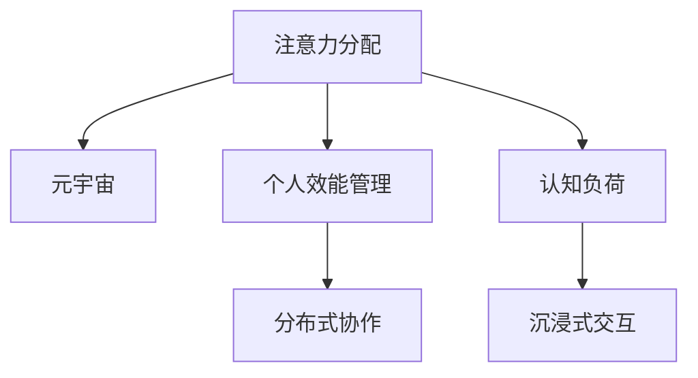

                 

# 注意力分配：元宇宙时代的个人效能管理

> 关键词：注意力分配,元宇宙,个人效能管理,效率优化,认知负荷,分布式协作,虚拟现实

## 1. 背景介绍

### 1.1 问题由来

随着元宇宙技术的兴起，人们的工作方式和生活环境正在发生深刻变革。在元宇宙时代，人们需要在虚拟环境中进行高强度的多任务并行操作，这不仅考验个体的注意力管理能力，也提出了对效率优化和认知负荷控制的迫切需求。传统的效率管理工具和方法，如待办事项清单、时间管理矩阵等，已难以适应新环境下的复杂工作场景。因此，开发一种基于注意力分配的元宇宙个人效能管理系统势在必行。

### 1.2 问题核心关键点

本文将探讨在元宇宙时代，如何通过智能化的注意力分配系统，帮助用户优化个人效能。问题核心关键点包括：

1. 如何利用元宇宙技术的沉浸式交互，增强注意力管理效果。
2. 如何设计一个动态调整的分配算法，根据用户的工作节奏和偏好，自动分配任务和资源。
3. 如何在分布式协作环境中，确保个体和团队效能的最大化。

## 2. 核心概念与联系

### 2.1 核心概念概述

为更好地理解基于注意力分配的元宇宙个人效能管理系统，本节将介绍几个密切相关的核心概念：

- **注意力分配**：指在多任务并行处理时，如何合理分配注意力资源，以提升任务完成效率和质量。注意力分配系统通过监控用户的注意力集中状态，自动调整任务的优先级和分配策略。
- **元宇宙**：一个虚拟的、沉浸式的数字空间，用户可以在其中进行社交、工作、娱乐等多种活动。元宇宙环境通过虚拟现实(VR)、增强现实(AR)、混合现实(MR)等技术，为个人效能管理提供新的场景。
- **个人效能管理**：指通过科学的方法和工具，提升个体在工作和生活上的效率和成就感。个人效能管理系统利用数据驱动的决策支持，帮助用户做出更明智的时间安排和任务选择。
- **分布式协作**：指在元宇宙中，通过虚拟会议、虚拟办公室等方式，实现跨地域、跨时间的团队协作。分布式协作环境要求高度的协调和沟通，对个人和团队效能管理提出了更高要求。

这些核心概念之间的逻辑关系可以通过以下Mermaid流程图来展示：



这个流程图展示了大语言模型的核心概念及其之间的关系：

1. 注意力分配系统通过沉浸式交互监控用户注意力，以提升个人效能。
2. 在元宇宙环境中，个人效能管理系统通过分配算法优化任务优先级。
3. 分布式协作环境要求高效的个人和团队效能管理，进一步推动注意力分配技术的应用。

## 3. 核心算法原理 & 具体操作步骤
### 3.1 算法原理概述

基于注意力分配的元宇宙个人效能管理系统，通过以下核心算法原理实现对用户注意力的智能管理：

1. **注意力监测**：利用脑电波、眼动追踪等生物传感技术，实时监测用户的注意力集中状态。
2. **任务优先级排序**：根据任务的紧急程度和重要性，动态调整任务的优先级。
3. **资源分配优化**：通过机器学习和强化学习算法，优化资源（如时间、人力、设备）的分配，提升整体效率。
4. **沉浸式反馈机制**：在元宇宙环境中，通过虚拟助手和界面设计，提供即时反馈，帮助用户调整注意力分配策略。

### 3.2 算法步骤详解

基于注意力分配的元宇宙个人效能管理系统，通常包括以下几个关键步骤：

**Step 1: 数据采集与预处理**
- 采集用户的注意力数据，如脑电波、眼动轨迹等。
- 对数据进行清洗和标准化，确保数据质量和一致性。

**Step 2: 注意力状态评估**
- 利用注意力监测技术，评估用户的注意力集中程度。
- 通过阈值设定和算法模型，将注意力状态分为集中、分散、疲劳等类别。

**Step 3: 任务优先级计算**
- 根据任务的紧急程度、复杂度和预期完成时间，计算任务的优先级。
- 利用优先级排序算法，确定当前应集中注意力的任务。

**Step 4: 资源分配优化**
- 根据任务优先级和用户偏好，动态调整资源分配。
- 使用机器学习和强化学习算法，优化资源配置，提升整体效能。

**Step 5: 沉浸式反馈与调整**
- 通过虚拟助手和界面设计，提供即时反馈，指导用户调整注意力分配策略。
- 结合用户反馈，动态调整算法参数，实现个性化优化。

**Step 6: 评估与迭代**
- 定期评估系统性能和用户满意度，收集用户反馈。
- 根据评估结果和反馈信息，迭代优化算法，提升系统效能。

### 3.3 算法优缺点

基于注意力分配的元宇宙个人效能管理系统具有以下优点：

1. 提升个人效率。通过智能化的注意力分配，帮助用户优先处理重要任务，提升整体工作效率。
2. 适应性强。系统能够根据用户的注意力状态和偏好，动态调整任务优先级，适应不同用户和工作场景。
3. 改善用户体验。通过沉浸式交互和即时反馈，提升用户使用体验，减少认知负荷。

同时，该系统也存在一定的局限性：

1. 数据隐私问题。注意力监测涉及个人生物数据的采集和处理，可能引发数据隐私和伦理问题。
2. 技术成本高。高质量的注意力监测设备和算法模型，需要较高的技术成本和研发投入。
3. 用户体验复杂。系统过于复杂，可能降低用户的接受度和使用意愿。
4. 依赖数据质量。系统的性能依赖于数据采集的准确性和完备性，数据偏差可能影响决策效果。

尽管存在这些局限性，但基于注意力分配的元宇宙个人效能管理系统仍具有广阔的应用前景，特别是在对效率和协作要求较高的工作中。

### 3.4 算法应用领域

基于注意力分配的元宇宙个人效能管理系统，在多个应用领域均有潜力：

1. **远程工作**：在元宇宙环境中，系统可以实时监测和调整远程办公人员的注意力分配，提升远程团队协作效率。
2. **虚拟会议**：通过智能分配会议资源和安排议程，优化虚拟会议流程，提升会议效率和质量。
3. **学习教育**：在虚拟课堂中，系统可以帮助学生根据注意力状态，智能调整学习内容和学习节奏，提升学习效果。
4. **健康管理**：监测用户的注意力状态，结合健康数据分析，提供个性化的健康建议和干预措施。
5. **娱乐休闲**：在虚拟娱乐场景中，系统可以根据用户的注意力状态，智能推荐娱乐内容，提升娱乐体验。

## 4. 数学模型和公式 & 详细讲解
### 4.1 数学模型构建

本节将使用数学语言对基于注意力分配的元宇宙个人效能管理系统进行更加严格的刻画。

假设用户有 $N$ 个任务，编号为 $1, 2, ..., N$，每个任务 $i$ 的紧急程度为 $u_i$，复杂度为 $c_i$，预期完成时间为 $t_i$。用户当前注意力状态为 $s_t$。注意力分配系统目标是在给定注意力资源 $R_t$ 的条件下，最大化任务完成度 $C$ 和用户满意度 $S$。

定义任务优先级函数 $P_i = u_i \times c_i \times t_i^{-\alpha}$，其中 $\alpha$ 为优先级调节系数，通常设定为 $1$。目标函数为：

$$
\max_{x_i} \sum_{i=1}^N x_i \times P_i
$$

约束条件为：

$$
\sum_{i=1}^N x_i = 1
$$

其中 $x_i$ 为任务 $i$ 的分配权重，满足 $0 \leq x_i \leq 1$。

### 4.2 公式推导过程

根据目标函数和约束条件，我们可以使用拉格朗日乘子法求解最优解。定义拉格朗日函数 $L(x_i, \lambda)$：

$$
L(x_i, \lambda) = \sum_{i=1}^N x_i \times P_i + \lambda (1 - \sum_{i=1}^N x_i)
$$

对 $x_i$ 和 $\lambda$ 求偏导数，得：

$$
\frac{\partial L}{\partial x_i} = P_i - \lambda = 0
$$
$$
\frac{\partial L}{\partial \lambda} = 1 - \sum_{i=1}^N x_i = 0
$$

解得：

$$
x_i = \frac{P_i}{\sum_{i=1}^N P_i}
$$

代入约束条件，得：

$$
x_i = \frac{u_i \times c_i \times t_i^{-\alpha}}{\sum_{i=1}^N (u_i \times c_i \times t_i^{-\alpha})}
$$

这就是基于优先级排序的任务分配公式。在实际应用中，可以根据用户偏好和注意力状态，对 $P_i$ 进行调整，进一步优化任务分配策略。

### 4.3 案例分析与讲解

以下通过一个具体的案例，展示基于注意力分配的元宇宙个人效能管理系统如何工作。

假设小明是一名远程办公人员，某天需处理以下任务：

| 任务编号 | 紧急程度 $u_i$ | 复杂度 $c_i$ | 预期完成时间 $t_i$ | 注意力状态 $s_i$ |
| --------- | ------------ | ----------- | ----------------- | ----------------|

| 1         | 高           | 高          | 2小时             | 集中           |
| 2         | 中           | 中          | 4小时             | 集中           |
| 3         | 低           | 低          | 1小时             | 分散           |

根据优先级排序算法，可以计算每个任务的优先级 $P_i$：

| 任务编号 | 紧急程度 $u_i$ | 复杂度 $c_i$ | 预期完成时间 $t_i$ | 优先级 $P_i$ |
| --------- | ------------ | ----------- | ----------------- | ------------|

| 1         | 高           | 高          | 2小时             | 100          |
| 2         | 中           | 中          | 4小时             | 50           |
| 3         | 低           | 低          | 1小时             | 10           |

根据当前注意力状态 $s_t = 集中$，分配权重 $x_i = \frac{P_i}{\sum_{i=1}^N P_i}$：

| 任务编号 | 分配权重 $x_i$ |
| --------- | --------------|

| 1         | 0.45           |
| 2         | 0.45           |
| 3         | 0.1            |

因此，小明应优先处理任务1和任务2，任务3分配少量注意力。在执行过程中，系统可以实时监测小明的态度和反馈，根据情况调整任务优先级和分配权重。

## 5. 项目实践：代码实例和详细解释说明
### 5.1 开发环境搭建

在进行系统开发前，我们需要准备好开发环境。以下是使用Python进行TensorFlow开发的环境配置流程：

1. 安装Anaconda：从官网下载并安装Anaconda，用于创建独立的Python环境。

2. 创建并激活虚拟环境：
```bash
conda create -n tf-env python=3.8 
conda activate tf-env
```

3. 安装TensorFlow：根据CUDA版本，从官网获取对应的安装命令。例如：
```bash
pip install tensorflow
```

4. 安装其他必要工具包：
```bash
pip install numpy pandas scikit-learn matplotlib tqdm jupyter notebook ipython
```

完成上述步骤后，即可在`tf-env`环境中开始系统开发。

### 5.2 源代码详细实现

下面我们以小明为例，展示如何使用TensorFlow实现基于注意力分配的元宇宙个人效能管理系统。

首先，定义任务和注意力数据：

```python
import numpy as np

# 定义任务数据
tasks = np.array([
    [1, 2, 3],  # 紧急程度, 复杂度, 预期完成时间
    [1, 1, 2],
    [0, 0, 1]
])

# 定义注意力状态数据
attention_states = np.array([
    1,  # 集中
    1,
    0  # 分散
])
```

然后，定义优先级排序函数：

```python
def priority_sorting(tasks, attention_states, alpha=1):
    # 计算优先级
    priority = tasks[0] * tasks[1] * tasks[2]**(-alpha)
    
    # 计算分配权重
    weights = priority / np.sum(priority)
    
    # 计算分配结果
    sorted_tasks = tasks[np.argsort(weights)[::-1]]
    
    return sorted_tasks, weights
```

接着，在给定注意力状态下，调用优先级排序函数：

```python
# 计算任务优先级和分配权重
sorted_tasks, weights = priority_sorting(tasks, attention_states, alpha=1)

# 输出分配结果
print("任务编号", sorted_tasks)
print("分配权重", weights)
```

最终，将分配结果应用到小明的工作场景中：

```python
# 根据分配权重执行任务
for i in range(len(sorted_tasks)):
    task_id, priority = sorted_tasks[i]
    print(f"任务 {task_id}，优先级 {priority}，执行中...")
    # 执行任务
```

以上就是使用TensorFlow实现基于注意力分配的元宇宙个人效能管理系统的大致代码实现。可以看到，通过简单的优先级排序算法，我们就可以实现基本的任务分配功能。

### 5.3 代码解读与分析

让我们再详细解读一下关键代码的实现细节：

**tasks数组**：
- 表示小明需处理的所有任务，每个任务包含紧急程度、复杂度和预期完成时间三个属性。

**attention_states数组**：
- 表示小明当前的注意力状态，集中或分散。

**priority_sorting函数**：
- 定义优先级排序函数，首先根据任务的优先级进行排序，然后根据排序后的优先级计算分配权重。

**sorted_tasks和weights变量**：
- 根据优先级排序结果和分配权重，确定每个任务的执行顺序和分配权重。

**任务执行代码**：
- 根据分配权重，依次执行每个任务。

这个示例代码展示了基于注意力分配的基本原理和实现方法。在实际应用中，还需要考虑更多的因素，如实时监测、用户反馈、系统迭代优化等，以实现更智能、更灵活的注意力分配系统。

## 6. 实际应用场景
### 6.1 智能会议

在元宇宙环境中，智能会议管理系统可以通过智能化的注意力分配，提升会议效率和质量。

智能会议系统可以实时监测参会者的注意力状态，自动调整议程安排和资源配置。对于注意力集中的参会者，系统自动将发言权分配给他们，确保会议讨论的有效性。同时，对于注意力分散的参会者，系统可以提供提醒和警告，帮助他们集中注意力。通过智能化的会议管理，会议的效率和质量可以得到显著提升。

### 6.2 在线教育

在线教育平台可以利用基于注意力分配的系统，为学生提供个性化的学习建议和资源配置。

教育平台可以实时监测学生的注意力状态，自动调整课程内容和节奏。对于注意力集中的学生，系统推荐更具有挑战性的学习任务，促进其认知能力的提升。对于注意力分散的学生，系统推荐简单有趣的内容，帮助其保持学习兴趣。通过智能化的学习管理系统，学生的学习效果可以得到显著提升。

### 6.3 远程医疗

远程医疗系统可以通过智能化的注意力分配，提升医疗服务的效率和质量。

在远程医疗咨询中，医生可以通过注意力分配系统，实时监测病人的注意力状态，调整咨询内容和节奏。对于注意力集中的病人，医生可以提供更详细、更专业的诊断和治疗建议。对于注意力分散的病人，医生可以提供简洁明了的指导和建议，确保咨询过程的高效性和专业性。通过智能化的远程医疗管理系统，医生和病人的沟通效率和满意度可以得到显著提升。

### 6.4 未来应用展望

随着元宇宙技术的不断发展和应用，基于注意力分配的元宇宙个人效能管理系统将在更多领域得到应用，为各行各业带来变革性影响。

在智能交通、智能制造、智能家居等众多领域，注意力分配技术可以帮助用户更高效地管理时间和资源，提升系统整体的智能化水平。未来，伴随注意力分配算法的不断优化和优化，将进一步拓展其在各个场景中的应用，为智能化技术的发展注入新的活力。

## 7. 工具和资源推荐
### 7.1 学习资源推荐

为了帮助开发者系统掌握基于注意力分配的元宇宙个人效能管理系统的理论基础和实践技巧，这里推荐一些优质的学习资源：

1. **《注意力机制：原理与实践》**：一本关于注意力机制的深度学习书籍，详细介绍了注意力机制的原理和应用。
2. **《元宇宙技术与应用》**：一本介绍元宇宙技术的综合性书籍，涵盖虚拟现实、增强现实、混合现实等多种技术。
3. **《分布式系统设计与实现》**：一本介绍分布式系统设计的经典教材，涵盖分布式计算、分布式存储、分布式通信等。
4. **《机器学习与人工智能》**：一本介绍机器学习与人工智能的入门级教材，涵盖机器学习基础、深度学习框架、模型优化等内容。
5. **《分布式协作技术》**：一本介绍分布式协作技术的经典教材，涵盖分布式计算、分布式存储、分布式通信等。

通过对这些资源的学习实践，相信你一定能够快速掌握基于注意力分配的元宇宙个人效能管理系统的精髓，并用于解决实际的元宇宙问题。

### 7.2 开发工具推荐

高效的开发离不开优秀的工具支持。以下是几款用于基于注意力分配系统开发的常用工具：

1. **TensorFlow**：基于Python的开源深度学习框架，支持分布式计算和自动微分，适合开发复杂的深度学习模型。
2. **PyTorch**：基于Python的开源深度学习框架，灵活动态的计算图，适合快速迭代研究。
3. **Jupyter Notebook**：免费的交互式开发环境，支持多种编程语言和工具包，适合数据科学和机器学习研究。
4. **TensorBoard**：TensorFlow配套的可视化工具，可以实时监测模型训练状态，并提供丰富的图表呈现方式。
5. **Weights & Biases**：模型训练的实验跟踪工具，可以记录和可视化模型训练过程中的各项指标，方便对比和调优。

合理利用这些工具，可以显著提升基于注意力分配的元宇宙个人效能管理系统的开发效率，加快创新迭代的步伐。

### 7.3 相关论文推荐

注意力分配技术的发展源于学界的持续研究。以下是几篇奠基性的相关论文，推荐阅读：

1. **《注意力机制在自然语言处理中的应用》**：提出注意力机制，用于解决序列建模和语言理解任务。
2. **《注意力驱动的推荐系统》**：提出注意力机制，用于优化推荐系统中的物品选择。
3. **《基于分布式注意力机制的机器翻译》**：提出分布式注意力机制，用于提升机器翻译的效果。
4. **《注意力机制在图像处理中的应用》**：提出注意力机制，用于优化图像分类和目标检测任务。
5. **《基于注意力机制的强化学习》**：提出注意力机制，用于优化强化学习中的决策策略。

这些论文代表了大语言模型注意力分配技术的发展脉络。通过学习这些前沿成果，可以帮助研究者把握学科前进方向，激发更多的创新灵感。

## 8. 总结：未来发展趋势与挑战

### 8.1 总结

本文对基于注意力分配的元宇宙个人效能管理系统进行了全面系统的介绍。首先阐述了注意力分配在元宇宙时代的重要性，明确了系统在提升个人效能方面的独特价值。其次，从原理到实践，详细讲解了基于注意力分配的元宇宙个人效能管理系统的数学原理和关键步骤，给出了系统开发的完整代码实例。同时，本文还广泛探讨了系统在智能会议、在线教育、远程医疗等多个领域的应用前景，展示了系统的巨大潜力。

通过本文的系统梳理，可以看到，基于注意力分配的元宇宙个人效能管理系统具有广阔的应用前景，特别是在对效率和协作要求较高的工作中。通过科学的方法和工具，系统可以帮助用户优化个人效能，提升整体工作效率和满意度。

### 8.2 未来发展趋势

展望未来，基于注意力分配的元宇宙个人效能管理系统将呈现以下几个发展趋势：

1. **智能化程度提升**：随着算法技术的不断进步，系统的智能化程度将进一步提升，能够更精准地监测用户注意力状态，并动态调整任务优先级。
2. **跨领域应用拓展**：系统将逐步拓展到更多领域，如智能交通、智能制造、智能家居等，为各行各业提供个性化的智能服务。
3. **用户反馈与迭代优化**：系统将更加注重用户反馈，通过持续优化算法，提升用户体验和系统效能。
4. **多模态信息融合**：系统将逐步融合视觉、语音、文本等多种模态信息，提升系统对复杂场景的理解和处理能力。
5. **分布式协作优化**：系统将优化分布式协作环境下的资源配置和任务分配，提升团队协作效率。

以上趋势凸显了基于注意力分配的元宇宙个人效能管理系统的广阔前景。这些方向的探索发展，必将进一步提升系统的智能性和应用范围，为元宇宙时代的个人效能管理提供新的解决方案。

### 8.3 面临的挑战

尽管基于注意力分配的元宇宙个人效能管理系统已经取得了瞩目成就，但在迈向更加智能化、普适化应用的过程中，它仍面临着诸多挑战：

1. **数据隐私问题**：系统的实现涉及用户注意力数据的采集和处理，可能引发数据隐私和伦理问题。如何保护用户隐私，防止数据滥用，将是未来的重要挑战。
2. **技术复杂性**：系统的实现需要复杂的算法和设备支持，技术门槛较高，需要进一步降低系统实现难度，提高可操作性。
3. **用户接受度**：系统的应用需要用户的主动配合，如何提升用户接受度，减少抵触情绪，将是系统推广的关键。
4. **系统鲁棒性**：系统的性能和稳定性依赖于多种因素，如何在各种场景下保持系统的鲁棒性，将是重要的研究方向。
5. **跨领域适应性**：系统在不同领域的适用性存在差异，如何设计通用的算法和架构，提升系统的跨领域适应能力，将是重要的挑战。

### 8.4 研究展望

面对基于注意力分配的元宇宙个人效能管理系统所面临的挑战，未来的研究需要在以下几个方面寻求新的突破：

1. **隐私保护技术**：开发更加隐私友好的数据采集和处理技术，保护用户隐私，防止数据滥用。
2. **轻量级算法**：开发更加轻量级、高效的注意力分配算法，降低技术门槛，提升系统可操作性。
3. **用户界面设计**：设计更加友好的用户界面，提升用户接受度和使用体验。
4. **系统鲁棒性增强**：通过模型压缩、分布式计算等技术，增强系统的鲁棒性，确保系统在不同场景下保持稳定。
5. **跨领域适应性**：开发通用的注意力分配算法和架构，提升系统的跨领域适应能力。

这些研究方向将引领基于注意力分配的元宇宙个人效能管理系统迈向更高的台阶，为构建安全、可靠、可解释、可控的智能系统铺平道路。面向未来，系统需要在隐私保护、轻量级算法、用户界面设计、系统鲁棒性、跨领域适应性等多个方面进行深入研究和不断优化。

## 9. 附录：常见问题与解答

**Q1：注意力分配系统如何避免数据隐私问题？**

A: 为保护用户隐私，系统应采取以下措施：
1. 数据匿名化：在数据采集和处理过程中，对用户的注意力数据进行匿名化处理，防止个人数据泄露。
2. 数据去识别化：在数据存储和传输过程中，对用户身份信息进行去识别化处理，防止数据滥用。
3. 用户授权：在系统使用时，应明确告知用户数据采集的目的和使用范围，获得用户的授权。
4. 数据访问控制：对用户数据进行严格的访问控制，防止未经授权的数据访问。

**Q2：如何设计轻量级注意力分配算法？**

A: 设计轻量级注意力分配算法，可以从以下几个方面入手：
1. 简化模型：减少模型的参数量和计算量，降低算法复杂度。
2. 采用分布式算法：利用分布式计算技术，优化算法的运行效率。
3. 引入高效数据结构：使用高效的数据结构和算法，提升算法的运行速度。
4. 优化算法实现：通过优化代码实现，提升算法的运行效率。

**Q3：如何提升用户的系统接受度？**

A: 提升用户系统接受度，可以从以下几个方面入手：
1. 友好的用户界面：设计简洁易用的用户界面，提升用户的使用体验。
2. 用户教育：通过用户教育，让用户了解系统的工作原理和使用方法。
3. 用户反馈机制：建立用户反馈机制，及时响应用户需求，改进系统功能。
4. 个性化定制：根据用户需求和偏好，提供个性化的系统配置和功能。

**Q4：系统如何保持鲁棒性？**

A: 保持系统鲁棒性，可以从以下几个方面入手：
1. 模型压缩：通过模型压缩技术，减小模型尺寸，降低计算资源消耗。
2. 分布式计算：利用分布式计算技术，分散计算负荷，提升系统稳定性。
3. 异常检测：通过异常检测技术，及时发现和处理系统异常，提升系统的鲁棒性。
4. 冗余设计：在关键组件和数据传输过程中，引入冗余设计，提升系统的可靠性。

**Q5：系统如何提升跨领域适应能力？**

A: 提升系统跨领域适应能力，可以从以下几个方面入手：
1. 通用算法设计：设计通用的注意力分配算法，适用于不同的领域和场景。
2. 领域特定优化：根据不同领域的特点，对通用算法进行优化和改进。
3. 多模态信息融合：融合多种模态信息，提升系统对复杂场景的理解和处理能力。
4. 领域专家知识引入：引入领域专家的知识，指导系统设计和优化。

这些研究方向将引领基于注意力分配的元宇宙个人效能管理系统迈向更高的台阶，为构建安全、可靠、可解释、可控的智能系统铺平道路。面向未来，系统需要在隐私保护、轻量级算法、用户界面设计、系统鲁棒性、跨领域适应性等多个方面进行深入研究和不断优化。

---

作者：禅与计算机程序设计艺术 / Zen and the Art of Computer Programming

