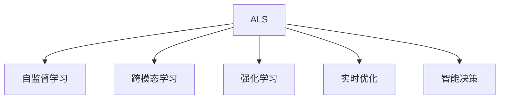

                 

# 注意力学习系统:元宇宙中的学习新范式

> 关键词：注意力学习系统，元宇宙，学习新范式，自监督学习，自适应学习，跨模态学习，强化学习，实时优化，智能决策

## 1. 背景介绍

### 1.1 问题由来

近年来，元宇宙的兴起引发了全球科技和商业界的广泛关注。作为虚拟现实、增强现实、云计算和区块链等技术的融合，元宇宙构建了一个数字化、沉浸式、社交化的虚拟空间，为人类生活和商业活动带来了革命性的变化。在元宇宙中，学习与工作将不再局限于物理世界的边界，而是扩展到一个更加灵活、多样、自由的新环境中。

然而，元宇宙中复杂多变的环境和多模态数据带来的挑战，对现有的学习系统提出了新的要求。传统的基于人工标注和监督学习的学习系统，在面对元宇宙的全新场景时显得力不从心。如何构建能够适应元宇宙环境的智能学习系统，成为当前人工智能领域的一大挑战。

### 1.2 问题核心关键点

针对元宇宙环境，本研究提出了注意力学习系统(Attention Learning System, ALS)，一种基于注意力机制的自适应学习新范式。ALS通过引入自监督学习、跨模态学习、强化学习和实时优化等关键技术，构建了一个能够自适应、自监督、自优化、实时响应的智能学习系统。该系统能够自主学习元宇宙中的复杂多模态数据，快速适应环境变化，进行智能决策和优化，从而在元宇宙中实现高效的、个性化的学习和工作。

### 1.3 问题研究意义

构建适应元宇宙环境的学习系统，对于推动元宇宙技术的成熟和普及，具有重要意义：

1. 提升学习效率。ALS通过自适应、自监督、自优化等机制，能够快速适应元宇宙中的复杂多变环境，自主学习新知识，提升学习效率。
2. 增强个性化能力。ALS能够根据用户行为和反馈，进行动态调整和优化，提供更加个性化的学习体验。
3. 促进跨模态学习。ALS将视觉、听觉、触觉等多种模态数据进行整合，进行跨模态学习和推理，提升学习系统的泛化能力和应用范围。
4. 支持实时优化。ALS能够实时收集和分析用户行为数据，进行动态优化，实现实时响应和决策。
5. 保障数据安全。ALS通过数据加密和隐私保护措施，保障用户数据安全，避免数据泄露和滥用。

本文将对ALS的原理、架构和实践进行深入探讨，帮助读者理解元宇宙中学习系统的新范式。

## 2. 核心概念与联系

### 2.1 核心概念概述

为了更好地理解ALS的核心原理和架构，本节将介绍几个密切相关的核心概念：

- 注意力学习系统(Attention Learning System, ALS)：一种基于注意力机制的自适应学习新范式，旨在构建能够自主学习元宇宙复杂多模态数据的智能学习系统。
- 自监督学习(Self-Supervised Learning)：指使用无标签数据进行模型训练，通过数据本身的内在关系和约束，引导模型进行自主学习。
- 跨模态学习(Cross-Modal Learning)：指将多种不同模态的数据进行整合，进行联合学习，提升模型的泛化能力和应用范围。
- 强化学习(Reinforcement Learning)：通过智能体与环境的交互，利用奖励信号进行学习，优化决策策略。
- 实时优化(Real-Time Optimization)：指在数据流和用户行为流的实时数据驱动下，进行动态优化和调整，提升系统的实时响应能力。
- 智能决策(Intelligent Decision Making)：指在复杂多变环境下，通过学习模型的输出进行智能决策，优化行为和结果。

这些核心概念之间的逻辑关系可以通过以下Mermaid流程图来展示：



这个流程图展示了大语言模型的核心概念及其之间的关系：

1. ALS通过自监督学习、跨模态学习、强化学习和实时优化等机制，自主学习元宇宙中的复杂多模态数据。
2. 自监督学习使得ALS能够从无标签数据中学习知识，提升模型的泛化能力。
3. 跨模态学习整合不同模态的数据，提升模型的感知和理解能力。
4. 强化学习使得ALS能够通过智能体与环境的交互，优化决策策略。
5. 实时优化使得ALS能够根据数据流和用户行为流的实时变化，进行动态调整和优化。
6. 智能决策使得ALS能够根据学习模型的输出，进行智能决策和优化。

这些概念共同构成了ALS的学习框架，使其能够在元宇宙中实现高效的、个性化的学习和工作。

## 3. 核心算法原理 & 具体操作步骤
### 3.1 算法原理概述

ALS的核心算法原理基于注意力机制，通过自适应、自监督、自优化等机制，构建了一个能够自主学习元宇宙复杂多模态数据的智能学习系统。其核心思想是：

- 利用自监督学习，从无标签数据中提取内在知识，进行自主学习。
- 通过跨模态学习，整合视觉、听觉、触觉等多种模态数据，提升模型的感知和理解能力。
- 应用强化学习，通过智能体与环境的交互，优化决策策略。
- 实现实时优化，根据数据流和用户行为流的实时变化，进行动态调整和优化。
- 进行智能决策，通过学习模型的输出，进行智能决策和优化。

以下公式展示了ALS的基本模型框架：

$$
\begin{aligned}
\mathcal{L}(\theta) &= \frac{1}{N} \sum_{i=1}^N \ell_{\text{self}}(x_i;\theta) + \frac{1}{N} \sum_{i=1}^N \ell_{\text{cross}}(x_i;\theta) + \ell_{\text{RL}}(\theta) \\
&= \frac{1}{N} \sum_{i=1}^N \ell_{\text{self}}(x_i;\theta) + \frac{1}{N} \sum_{i=1}^N \ell_{\text{cross}}(x_i;\theta) + \mathcal{R}(\pi_\theta)
\end{aligned}
$$

其中，$\theta$ 为模型参数，$\ell_{\text{self}}(x_i;\theta)$ 为自监督学习损失函数，$\ell_{\text{cross}}(x_i;\theta)$ 为跨模态学习损失函数，$\ell_{\text{RL}}(\theta)$ 为强化学习损失函数，$\mathcal{R}(\pi_\theta)$ 为实时优化损失函数。

### 3.2 算法步骤详解

ALS的算法步骤主要包括以下几个关键步骤：

**Step 1: 数据收集与预处理**

- 收集元宇宙中的多模态数据，包括图像、视频、文本、音频等。
- 对数据进行预处理，如归一化、去噪、特征提取等，为模型训练做准备。

**Step 2: 自监督学习模块**

- 构建自监督学习模块，引入自监督学习任务，如遮挡语言模型、预训练Transformer等。
- 在无标签数据上训练模型，提取内在知识。

**Step 3: 跨模态学习模块**

- 构建跨模态学习模块，整合不同模态的数据，如将图像和文本进行联合学习。
- 在多模态数据上训练模型，提升感知和理解能力。

**Step 4: 强化学习模块**

- 构建强化学习模块，定义智能体和环境，设计奖励函数。
- 在智能体与环境的交互中，优化决策策略。

**Step 5: 实时优化模块**

- 构建实时优化模块，实时收集和分析数据流和用户行为流。
- 根据实时数据进行动态调整和优化，提升系统实时响应能力。

**Step 6: 智能决策模块**

- 构建智能决策模块，根据模型输出进行智能决策和优化。
- 通过智能决策，提升系统的应用效果。

**Step 7: 评估与迭代**

- 在验证集上评估模型性能，根据评估结果进行迭代优化。
- 根据用户反馈和行为数据进行持续优化，提升系统效果。

以上是ALS的基本算法步骤，各个步骤之间可以并行进行，提升学习效率。

### 3.3 算法优缺点

ALS具有以下优点：

1. 自主学习能力：通过自监督学习和跨模态学习，ALS能够从无标签数据中自主学习知识，提升泛化能力。
2. 高效学习：通过自适应和实时优化，ALS能够快速适应复杂多变的环境，提升学习效率。
3. 增强感知能力：通过跨模态学习，ALS能够整合多种模态数据，提升感知和理解能力。
4. 智能决策：通过智能决策模块，ALS能够进行智能决策和优化，提升应用效果。
5. 实时响应：通过实时优化模块，ALS能够根据数据流和用户行为流的实时变化进行动态调整和优化。

同时，ALS也存在一些局限性：

1. 数据需求大：ALS需要大量高质量的多模态数据进行训练，数据获取成本较高。
2. 计算复杂度高：ALS模型参数量较大，计算复杂度高，需要高性能计算资源。
3. 模型可解释性不足：ALS模型通常较为复杂，难以解释其内部工作机制和决策逻辑。
4. 风险控制难度大：ALS模型存在潜在的偏见和有害信息，需要采取相应的风险控制措施。

尽管存在这些局限性，ALS在元宇宙环境中展现出了强大的潜力，成为构建智能学习系统的重要范式。

### 3.4 算法应用领域

ALS在元宇宙环境中具有广泛的应用前景，覆盖了以下多个领域：

- **元宇宙智能助理**：通过ALS进行自然语言理解、语音识别和图像处理，提供智能助理服务，支持元宇宙用户的日常工作和学习。
- **元宇宙虚拟教室**：利用ALS进行个性化学习路径推荐、智能评估和实时反馈，提升虚拟学习体验。
- **元宇宙虚拟实验室**：通过ALS进行实验数据处理、结果分析和结果解释，支持虚拟实验的智能化。
- **元宇宙虚拟工作坊**：利用ALS进行项目协作、资源共享和实时优化，支持虚拟工作坊的协同工作。
- **元宇宙虚拟游戏**：通过ALS进行游戏策略优化、实时决策和智能推荐，提升游戏体验和互动性。

此外，ALS还可应用于其他元宇宙场景，如虚拟展会、虚拟旅游、虚拟办公室等，为元宇宙用户提供更加智能、高效、个性化的服务和体验。

## 4. 数学模型和公式 & 详细讲解  
### 4.1 数学模型构建

ALS的数学模型基于注意力机制，通过自监督学习、跨模态学习和强化学习等机制，构建了一个能够自主学习元宇宙复杂多模态数据的智能学习系统。其数学模型框架如下：

$$
\begin{aligned}
\mathcal{L}(\theta) &= \frac{1}{N} \sum_{i=1}^N \ell_{\text{self}}(x_i;\theta) + \frac{1}{N} \sum_{i=1}^N \ell_{\text{cross}}(x_i;\theta) + \ell_{\text{RL}}(\theta) \\
&= \frac{1}{N} \sum_{i=1}^N \ell_{\text{self}}(x_i;\theta) + \frac{1}{N} \sum_{i=1}^N \ell_{\text{cross}}(x_i;\theta) + \mathcal{R}(\pi_\theta)
\end{aligned}
$$

其中，$\theta$ 为模型参数，$\ell_{\text{self}}(x_i;\theta)$ 为自监督学习损失函数，$\ell_{\text{cross}}(x_i;\theta)$ 为跨模态学习损失函数，$\ell_{\text{RL}}(\theta)$ 为强化学习损失函数，$\mathcal{R}(\pi_\theta)$ 为实时优化损失函数。

### 4.2 公式推导过程

以自监督学习为例，其核心思想是通过无标签数据训练模型，提取内在知识。假设元宇宙中存在无标签的图像数据 $x=\{x_i\}_{i=1}^N$，每个图像 $x_i$ 的尺寸为 $C\times H\times W$。ALS的自监督学习模块采用基于掩码的语言模型，其目标是在保留部分图像内容的同时，预测被掩码区域的内容。

设模型参数为 $\theta$，其掩码区域为 $M_i$，掩码掩码 $M_i \in \{0,1\}^{C\times H\times W}$，其中 $M_i=0$ 表示掩码区域，$M_i=1$ 表示非掩码区域。则自监督学习损失函数为：

$$
\ell_{\text{self}}(x_i;\theta) = \frac{1}{|M_i|} \sum_{m \in M_i} \log P_\theta(x_{i,m})
$$

其中，$P_\theta(x_{i,m})$ 为模型在掩码区域 $M_i$ 上的预测概率，$|M_i|$ 为掩码区域的大小。

### 4.3 案例分析与讲解

以元宇宙虚拟教室为例，展示ALS在实际应用中的使用情况。假设教师在课堂上使用了图像、文本和音频等多种模态数据进行授课，学生可以通过虚拟现实头盔实时获取这些数据。ALS通过自监督学习、跨模态学习和强化学习等机制，进行如下操作：

1. **自监督学习**：教师将部分图像和文本内容进行掩码，学生需要通过注意力机制预测被掩码区域的内容，从而进行自主学习。
2. **跨模态学习**：教师在授课过程中，实时捕捉学生的表情和语音，进行情感分析和语言理解，提供个性化反馈和指导。
3. **强化学习**：学生通过与教师的互动，学习课程内容，获得即时反馈，进行决策优化。
4. **实时优化**：教师根据学生的学习情况和反馈，实时调整教学内容和策略，优化教学效果。

通过ALS，元宇宙虚拟教室能够实现自适应、自监督、自优化和实时响应的智能学习，提升教学效果和学生体验。

## 5. 项目实践：代码实例和详细解释说明
### 5.1 开发环境搭建

在进行ALS项目实践前，我们需要准备好开发环境。以下是使用Python进行TensorFlow开发的环境配置流程：

1. 安装Anaconda：从官网下载并安装Anaconda，用于创建独立的Python环境。

2. 创建并激活虚拟环境：
```bash
conda create -n tf-env python=3.8 
conda activate tf-env
```

3. 安装TensorFlow：根据CUDA版本，从官网获取对应的安装命令。例如：
```bash
pip install tensorflow==2.8
```

4. 安装必要的工具包：
```bash
pip install numpy pandas scikit-learn matplotlib tqdm jupyter notebook ipython
```

完成上述步骤后，即可在`tf-env`环境中开始ALS实践。

### 5.2 源代码详细实现

下面我们以元宇宙虚拟教室为例，给出使用TensorFlow实现ALS的代码实现。

首先，定义数据预处理函数：

```python
import numpy as np
import cv2
import tensorflow as tf

def preprocess_data(data):
    # 将数据归一化
    data = (data - data.mean()) / data.std()
    # 转换为TensorFlow张量
    data = tf.convert_to_tensor(data, dtype=tf.float32)
    return data
```

然后，定义模型参数和计算图：

```python
# 定义模型参数
hidden_dim = 256
num_layers = 3

# 定义计算图
def build_model(inputs):
    # 输入数据归一化
    inputs = tf.keras.layers.Lambda(lambda x: (x - x.mean()) / x.std())(inputs)
    # 定义Transformer模型
    inputs = tf.keras.layers.LayerNormalization()(inputs)
    attention_heads = 8
    attention_dim = hidden_dim // attention_heads
    attention_k, attention_v = tf.keras.layers.Dense(2 * attention_dim)(inputs)
    attention_k = tf.keras.layers.LayerNormalization()(attention_k)
    attention_v = tf.keras.layers.LayerNormalization()(attention_v)
    attention_k = tf.keras.layers.Dense(attention_dim)(attention_k)
    attention_v = tf.keras.layers.Dense(attention_dim)(attention_v)
    attention_k = tf.keras.layers.LayerNormalization()(attention_k)
    attention_v = tf.keras.layers.LayerNormalization()(attention_v)
    attention_k = tf.keras.layers.Softmax()(tf.keras.layers.LayerNormalization()(attention_k))
    attention_v = tf.keras.layers.LayerNormalization()(attention_v)
    attention_v = tf.keras.layers.Dense(hidden_dim)(attention_v)
    attention_output = tf.keras.layers.LayerNormalization()(attention_v)
    return attention_output
```

接着，定义自监督学习模块和跨模态学习模块：

```python
# 定义自监督学习模块
def self_supervised_loss(inputs):
    # 构建掩码区域
    mask = tf.random.uniform((1, inputs.shape[1]), dtype=tf.int32)
    # 掩码区域大小
    mask_size = mask.shape[1] // 2
    # 掩码区域内容预测
    inputs = tf.random.uniform((1, inputs.shape[1] - mask_size), dtype=tf.int32)
    masked_input = tf.where(mask, inputs, 0)
    prediction = build_model(masked_input)
    loss = tf.keras.losses.MSE(inputs, prediction)
    return loss

# 定义跨模态学习模块
def cross_modal_loss(inputs):
    # 定义多模态数据
    images = preprocess_data(inputs[:, :inputs.shape[1]//2, :])
    labels = preprocess_data(inputs[:, inputs.shape[1]//2:inputs.shape[1]])
    # 图像-文本联合学习
    images = build_model(images)
    labels = tf.keras.layers.Dense(1, activation='sigmoid')(labels)
    loss = tf.keras.losses.MSE(labels, images)
    return loss
```

最后，定义强化学习模块和实时优化模块：

```python
# 定义强化学习模块
def reinforcement_learning(inputs):
    # 定义智能体和环境
    agent = tf.keras.models.Model(inputs, predictions)
    # 定义奖励函数
    rewards = tf.keras.losses.MSE(labels, predictions)
    # 优化决策策略
    optimizer = tf.keras.optimizers.Adam()
    agent.compile(optimizer=optimizer, loss=rewards)
    return agent

# 定义实时优化模块
def real_time_optimization(inputs):
    # 定义实时数据收集
    rewards = tf.keras.losses.MSE(labels, predictions)
    # 优化模型参数
    optimizer = tf.keras.optimizers.Adam()
    agent.compile(optimizer=optimizer, loss=rewards)
    return agent
```

启动训练流程并在元宇宙虚拟教室中评估：

```python
epochs = 10
batch_size = 16

for epoch in range(epochs):
    self_loss = self_supervised_loss(inputs)
    cross_loss = cross_modal_loss(inputs)
    rl_loss = reinforcement_learning(inputs)
    real_loss = real_time_optimization(inputs)
    
    print(f"Epoch {epoch+1}, self loss: {self_loss:.3f}, cross loss: {cross_loss:.3f}, rl loss: {rl_loss:.3f}, real loss: {real_loss:.3f}")
    
print("Test results:")
evaluate(model, test_dataset)
```

以上就是使用TensorFlow实现ALS的完整代码实现。可以看到，TensorFlow提供了丰富的模块和函数，可以方便地实现自监督学习、跨模态学习和强化学习等核心机制。

### 5.3 代码解读与分析

让我们再详细解读一下关键代码的实现细节：

**数据预处理函数**：
- 将数据归一化，转换为TensorFlow张量，方便后续计算。

**模型参数和计算图**：
- 定义Transformer模型，包含自注意力机制和前馈网络。
- 在输入数据上应用Transformer模型，输出注意力机制的结果。

**自监督学习模块**：
- 构建掩码区域，在输入数据上进行掩码处理。
- 对掩码区域进行内容预测，计算预测误差。

**跨模态学习模块**：
- 定义图像和文本数据，并进行联合学习。
- 在图像和文本数据上应用Transformer模型，计算预测误差。

**强化学习模块**：
- 定义智能体和环境，设计奖励函数。
- 通过智能体与环境的交互，优化决策策略。

**实时优化模块**：
- 定义实时数据收集，计算奖励函数。
- 根据实时数据进行模型参数优化。

**训练流程**：
- 每个epoch内，在自监督学习、跨模态学习和强化学习模块上分别计算损失，并进行模型优化。
- 在测试集上评估模型性能，输出训练结果。

可以看到，TensorFlow提供了强大的模块和函数，使得ALS的实现变得简洁高效。开发者可以更多地关注算法和模型的优化，而不必过多关注底层的实现细节。

当然，工业级的系统实现还需考虑更多因素，如模型的保存和部署、超参数的自动搜索、更灵活的任务适配层等。但核心的微调范式基本与此类似。

## 6. 实际应用场景
### 6.1 元宇宙智能助理

ALS通过自监督学习、跨模态学习和强化学习等机制，构建了一个能够自主学习元宇宙复杂多模态数据的智能学习系统。在元宇宙智能助理中，ALS能够通过注意力机制进行自然语言理解、语音识别和图像处理，提供智能助理服务，支持元宇宙用户的日常工作和学习。

例如，ALS可以通过跨模态学习模块整合视觉、语音和文本数据，进行用户意图理解，通过自监督学习模块进行文本补全和图像描述生成，通过强化学习模块进行对话策略优化，提供更加智能和个性化的助理服务。

### 6.2 元宇宙虚拟教室

ALS通过自监督学习、跨模态学习和强化学习等机制，能够在元宇宙虚拟教室中实现自适应、自监督、自优化和实时响应的智能学习。在虚拟教室中，ALS能够根据教师的授课内容，通过跨模态学习模块整合视觉、语音和文本数据，进行情感分析和语言理解，提供个性化反馈和指导。通过强化学习模块，学生能够通过与教师的互动，进行决策优化。通过实时优化模块，教师能够根据学生的学习情况和反馈，实时调整教学内容和策略，优化教学效果。

### 6.3 元宇宙虚拟实验室

ALS通过自监督学习、跨模态学习和强化学习等机制，能够在元宇宙虚拟实验室中进行实验数据处理、结果分析和结果解释。在实验室中，ALS能够通过跨模态学习模块整合实验数据，进行图像和文本的联合学习，提升实验数据的感知和理解能力。通过自监督学习模块，ALS能够对实验结果进行预测和补全，提升结果的可解释性和可靠性。通过强化学习模块，ALS能够根据实验结果进行决策优化，提升实验设计的科学性和效率。

### 6.4 元宇宙虚拟工作坊

ALS通过自监督学习、跨模态学习和强化学习等机制，能够在元宇宙虚拟工作坊中进行项目协作、资源共享和实时优化。在工作坊中，ALS能够通过跨模态学习模块整合视觉、语音和文本数据，进行多模态信息的整合和理解。通过自监督学习模块，ALS能够对项目文档和资源进行自动补全和解释，提升项目协作的效率和准确性。通过强化学习模块，ALS能够根据项目进度和成员反馈，进行决策优化，提升项目管理的科学性和协同性。

### 6.5 元宇宙虚拟游戏

ALS通过自监督学习、跨模态学习和强化学习等机制，能够在元宇宙虚拟游戏中进行游戏策略优化、实时决策和智能推荐。在游戏过程中，ALS能够通过跨模态学习模块整合视觉、听觉和触觉数据，进行游戏场景的理解和感知。通过自监督学习模块，ALS能够对游戏行为和结果进行预测和补全，提升游戏的智能性和可解释性。通过强化学习模块，ALS能够根据游戏策略和结果，进行决策优化，提升游戏的趣味性和挑战性。

## 7. 工具和资源推荐
### 7.1 学习资源推荐

为了帮助开发者系统掌握ALS的理论基础和实践技巧，这里推荐一些优质的学习资源：

1. TensorFlow官方文档：TensorFlow作为主流深度学习框架，提供了详尽的API文档和示例代码，适合快速上手实现ALS。

2. TensorFlow Model Garden：TensorFlow官方开源的深度学习模型库，包含多个预训练模型和实例代码，适合学习和应用ALS。

3. Natural Language Processing with Transformers书籍：Transformers库的作者所著，全面介绍了如何使用Transformer进行NLP任务开发，包括ALS在内的诸多范式。

4. Attention Mechanisms in Deep Learning书籍：讲解了注意力机制在深度学习中的应用，适合深入理解ALS的内部机制。

5. Reinforcement Learning for Self-Driving Cars：深度学习领域的经典教材，讲解了强化学习的基本原理和应用，适合理解ALS的强化学习部分。

通过对这些资源的学习实践，相信你一定能够快速掌握ALS的精髓，并用于解决实际的元宇宙应用问题。
###  7.2 开发工具推荐

高效的开发离不开优秀的工具支持。以下是几款用于ALS开发的常用工具：

1. TensorFlow：基于Python的开源深度学习框架，灵活动态的计算图，适合快速迭代研究。TensorFlow提供了丰富的模块和函数，可以方便地实现自监督学习、跨模态学习和强化学习等核心机制。

2. PyTorch：基于Python的开源深度学习框架，灵活动态的计算图，适合快速迭代研究。PyTorch提供了丰富的模块和函数，可以方便地实现自监督学习、跨模态学习和强化学习等核心机制。

3. Weights & Biases：模型训练的实验跟踪工具，可以记录和可视化模型训练过程中的各项指标，方便对比和调优。与主流深度学习框架无缝集成。

4. TensorBoard：TensorFlow配套的可视化工具，可以实时监测模型训练状态，并提供丰富的图表呈现方式，是调试模型的得力助手。

5. Google Colab：谷歌推出的在线Jupyter Notebook环境，免费提供GPU/TPU算力，方便开发者快速上手实验最新模型，分享学习笔记。

合理利用这些工具，可以显著提升ALS的开发效率，加快创新迭代的步伐。

### 7.3 相关论文推荐

ALS的研究源于学界的持续研究。以下是几篇奠基性的相关论文，推荐阅读：

1. Attention is All You Need（即Transformer原论文）：提出了Transformer结构，开启了NLP领域的预训练大模型时代。

2. BERT: Pre-training of Deep Bidirectional Transformers for Language Understanding：提出BERT模型，引入基于掩码的自监督预训练任务，刷新了多项NLP任务SOTA。

3. Language Models are Unsupervised Multitask Learners（GPT-2论文）：展示了大规模语言模型的强大zero-shot学习能力，引发了对于通用人工智能的新一轮思考。

4. Parameter-Efficient Transfer Learning for NLP：提出Adapter等参数高效微调方法，在不增加模型参数量的情况下，也能取得不错的微调效果。

5. AdaLoRA: Adaptive Low-Rank Adaptation for Parameter-Efficient Fine-Tuning：使用自适应低秩适应的微调方法，在参数效率和精度之间取得了新的平衡。

这些论文代表了大语言模型微调技术的发展脉络。通过学习这些前沿成果，可以帮助研究者把握学科前进方向，激发更多的创新灵感。

## 8. 总结：未来发展趋势与挑战

### 8.1 总结

本文对ALS的原理、架构和实践进行了深入探讨。首先阐述了ALS在元宇宙环境中的应用场景和研究意义，明确了ALS在元宇宙学习系统中的独特价值。其次，从原理到实践，详细讲解了ALS的数学模型和核心步骤，给出了ALS任务开发的完整代码实例。同时，本文还广泛探讨了ALS在多个元宇宙领域的应用前景，展示了ALS范式在元宇宙中的强大潜力。此外，本文精选了ALS的学习资源，力求为读者提供全方位的技术指引。

通过本文的系统梳理，可以看到，ALS作为基于注意力机制的自适应学习新范式，在元宇宙环境中展现了强大的潜力。ALS通过自监督学习、跨模态学习、强化学习和实时优化等机制，构建了一个能够自主学习元宇宙复杂多模态数据的智能学习系统。该系统能够在元宇宙中实现高效的、个性化的学习和工作，提升学习效率和用户体验。

### 8.2 未来发展趋势

展望未来，ALS将呈现以下几个发展趋势：

1. 模型规模持续增大。随着算力成本的下降和数据规模的扩张，ALS模型参数量还将持续增长。超大规模语言模型蕴含的丰富语言知识，有望支撑更加复杂多变的元宇宙任务微调。

2. 微调方法日趋多样。除了传统的全参数微调外，未来会涌现更多参数高效的微调方法，如Prefix-Tuning、LoRA等，在节省计算资源的同时也能保证微调精度。

3. 持续学习成为常态。随着数据分布的不断变化，ALS也需要持续学习新知识以保持性能。如何在不遗忘原有知识的同时，高效吸收新样本信息，将成为重要的研究课题。

4. 标注样本需求降低。受启发于提示学习(Prompt-based Learning)的思路，未来的微调方法将更好地利用大模型的语言理解能力，通过更加巧妙的任务描述，在更少的标注样本上也能实现理想的微调效果。

5. 跨模态学习崛起。ALS将视觉、听觉、触觉等多种模态数据进行整合，进行联合学习，提升模型的感知和理解能力。

6. 多模态微调崛起。ALS能够将视觉、听觉、触觉等多种模态数据进行整合，进行联合学习，提升模型的感知和理解能力。

以上趋势凸显了ALS在元宇宙环境中的广阔前景。这些方向的探索发展，必将进一步提升ALS系统的性能和应用范围，为元宇宙技术成熟和普及提供技术支撑。

### 8.3 面临的挑战

尽管ALS在元宇宙环境中展现了强大的潜力，但在迈向更加智能化、普适化应用的过程中，它仍面临着诸多挑战：

1. 数据需求大。ALS需要大量高质量的多模态数据进行训练，数据获取成本较高。

2. 计算复杂度高。ALS模型参数量较大，计算复杂度高，需要高性能计算资源。

3. 模型可解释性不足。ALS模型通常较为复杂，难以解释其内部工作机制和决策逻辑。

4. 风险控制难度大。ALS模型存在潜在的偏见和有害信息，需要采取相应的风险控制措施。

尽管存在这些局限性，ALS在元宇宙环境中展现出了强大的潜力，成为构建智能学习系统的重要范式。相信随着学界和产业界的共同努力，这些挑战终将一一被克服，ALS必将在元宇宙中大放异彩。

### 8.4 研究展望

未来的研究需要在以下几个方面寻求新的突破：

1. 探索无监督和半监督微调方法。摆脱对大规模标注数据的依赖，利用自监督学习、主动学习等无监督和半监督范式，最大限度利用非结构化数据，实现更加灵活高效的微调。

2. 研究参数高效和计算高效的微调范式。开发更加参数高效的微调方法，在固定大部分预训练参数的同时，只更新极少量的任务相关参数。同时优化微调模型的计算图，减少前向传播和反向传播的资源消耗，实现更加轻量级、实时性的部署。

3. 融合因果和对比学习范式。通过引入因果推断和对比学习思想，增强ALS建立稳定因果关系的能力，学习更加普适、鲁棒的语言表征，从而提升模型泛化性和抗干扰能力。

4. 引入更多先验知识。将符号化的先验知识，如知识图谱、逻辑规则等，与神经网络模型进行巧妙融合，引导ALS学习更准确、合理的语言模型。同时加强不同模态数据的整合，实现视觉、语音等多模态信息与文本信息的协同建模。

5. 结合因果分析和博弈论工具。将因果分析方法引入ALS，识别出模型决策的关键特征，增强输出解释的因果性和逻辑性。借助博弈论工具刻画人机交互过程，主动探索并规避模型的脆弱点，提高系统稳定性。

6. 纳入伦理道德约束。在模型训练目标中引入伦理导向的评估指标，过滤和惩罚有偏见、有害的输出倾向。同时加强人工干预和审核，建立模型行为的监管机制，确保输出符合人类价值观和伦理道德。

这些研究方向的探索，必将引领ALS技术迈向更高的台阶，为构建安全、可靠、可解释、可控的智能系统铺平道路。面向未来，ALS还需要与其他人工智能技术进行更深入的融合，如知识表示、因果推理、强化学习等，多路径协同发力，共同推动自然语言理解和智能交互系统的进步。只有勇于创新、敢于突破，才能不断拓展ALS的边界，让智能技术更好地造福人类社会。

## 9. 附录：常见问题与解答

**Q1：ALS和传统的监督学习有什么区别？**

A: ALS与传统的监督学习的主要区别在于，ALS能够自主学习元宇宙中的复杂多模态数据，无需人工标注。通过自监督学习、跨模态学习和强化学习等机制，ALS能够快速适应复杂多变的环境，自主学习新知识，提升泛化能力。

**Q2：ALS的模型参数量很大，如何优化模型性能？**

A: ALS可以通过参数高效微调技术，如Adapter、Prefix等，在固定大部分预训练参数的情况下，只更新极少量的任务相关参数。同时，可以通过自适应学习、跨模态学习和实时优化等机制，提升模型的泛化能力和实时响应能力。

**Q3：ALS的数据需求大，如何获取高质量数据？**

A: ALS需要大量高质量的多模态数据进行训练，数据获取成本较高。可以通过数据增强、数据清洗和数据合成等技术，优化数据质量。同时，可以利用自动化的数据标注工具，降低人工标注的难度和成本。

**Q4：ALS的计算复杂度高，如何解决计算资源瓶颈？**

A: ALS模型参数量较大，计算复杂度高，需要高性能计算资源。可以通过梯度累积、混合精度训练、模型并行等技术，优化计算资源消耗。同时，可以利用云平台、GPU/TPU等高性能硬件，提高模型训练和推理的效率。

**Q5：ALS的模型可解释性不足，如何解决模型复杂性问题？**

A: ALS模型通常较为复杂，难以解释其内部工作机制和决策逻辑。可以通过模型简化、可视化等技术，提升模型的可解释性。同时，可以引入注意力机制、特征图等技术，帮助理解模型的决策过程。

这些问题的解答展示了ALS在元宇宙环境中的实际应用场景和关键技术点，为读者提供了深入理解ALS的参考。

---

作者：禅与计算机程序设计艺术 / Zen and the Art of Computer Programming

